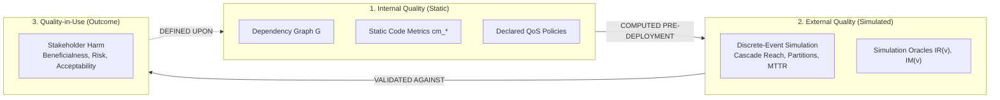
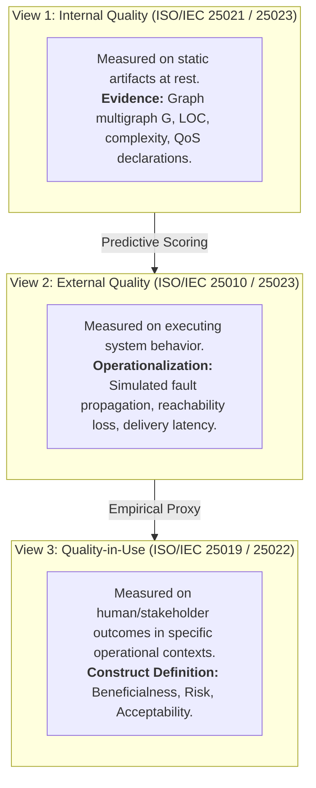
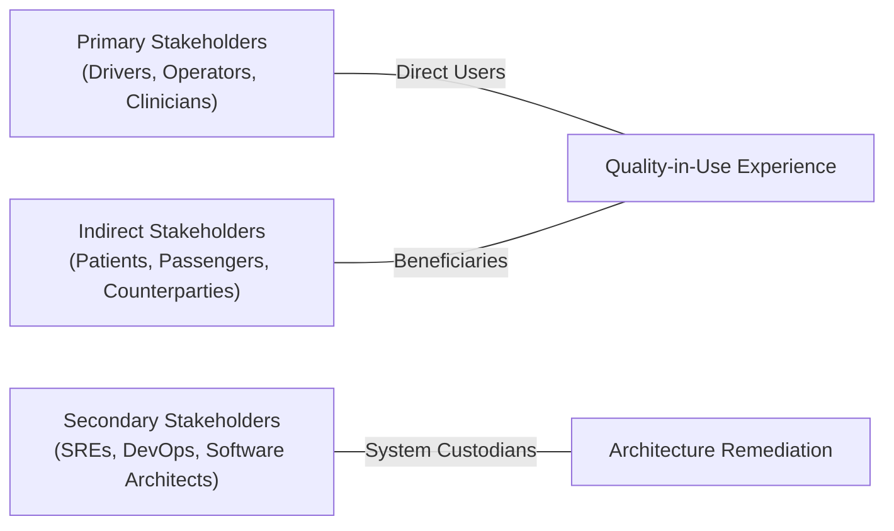
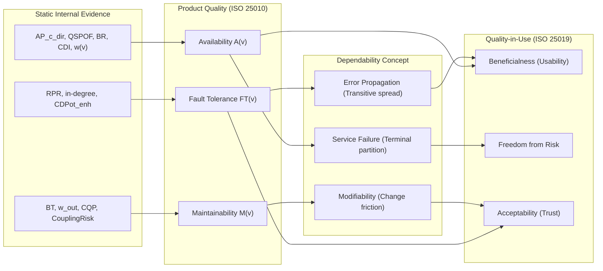
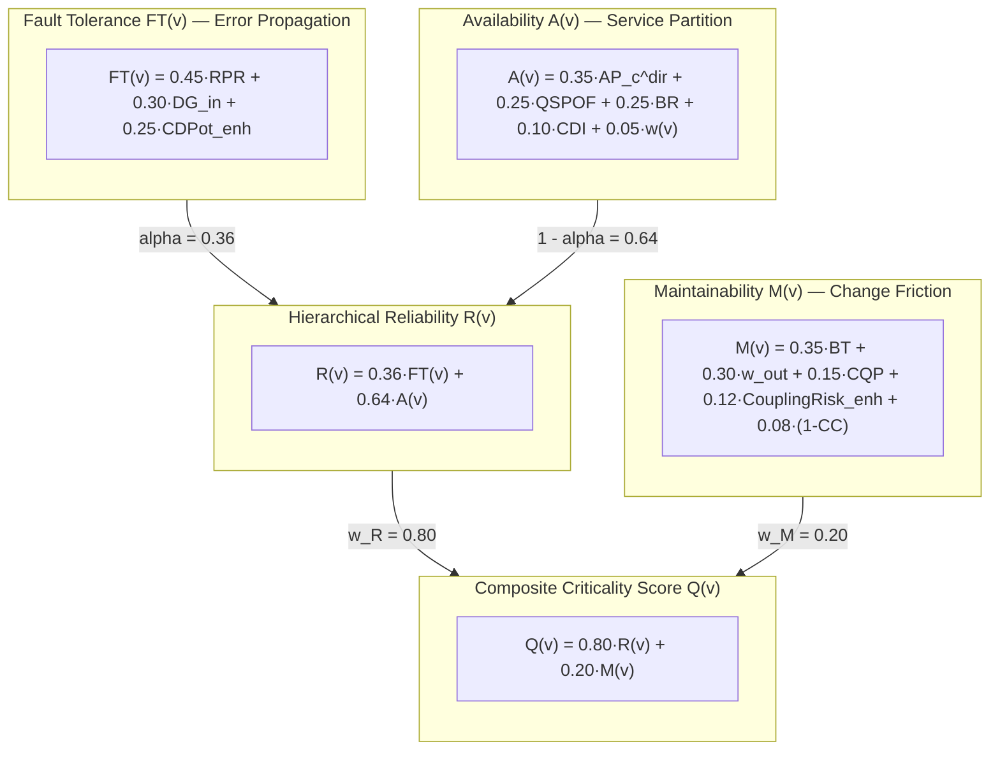
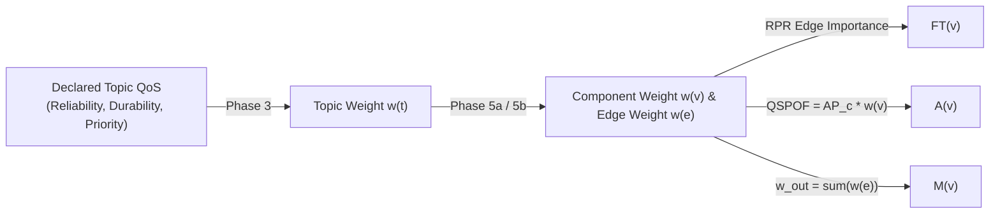
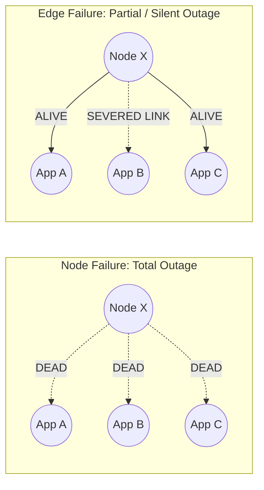
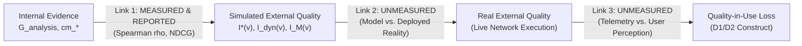
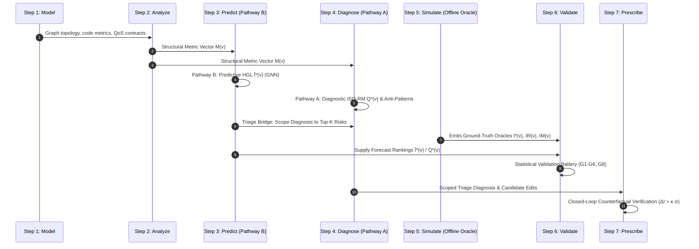

# Component and Relationship Criticality

**A stakeholder-grounded reference defining "criticality" for nodes and edges in software dependency graphs, anchored in the ISO/IEC 25019:2023 (SQuaRE) Quality-in-Use model and the ISO/IEC 25010:2023 Product Quality model.**

[README](../README.md) | [quality-model.md](quality-model.md) | [structural-analysis.md](structural-analysis.md)

---

## Table of Contents

1. [Overview & Core Philosophy](#1-overview--core-philosophy)
2. [What "Criticality" Means in SAAG](#2-what-criticality-means-in-saag)
   - 2.1 [The Four Foundational Definitions (D1–D4)](#21-the-four-foundational-definitions-d1d4)
   - 2.2 [Consequence, Not Risk (D3)](#22-consequence-not-risk-d3)
3. [Quality Grounding (ISO/IEC SQuaRE)](#3-quality-grounding-isoiec-square)
   - 3.0 [Three Quality Views: Internal, External, and Quality-in-Use](#30-three-quality-views-internal-external-and-quality-in-use)
   - 3.1 [What Quality-in-Use Is (ISO/IEC 25019:2023)](#31-what-quality-in-use-is-isoiec-250192023)
   - 3.2 [Stakeholder Taxonomy (Primary, Indirect, Secondary)](#32-stakeholder-taxonomy-primary-indirect-secondary)
   - 3.3 [Context of Use and Domain Context Vectors ($\vec{\omega}$)](#33-context-of-use-and-domain-context-vectors-vecomega)
   - 3.4 [The Four Criticality Questions](#34-the-four-criticality-questions)
   - 3.5 [Binding RM to External Quality, Dependability, and Quality-in-Use](#35-binding-rm-to-external-quality-dependability-and-quality-in-use)
4. [Component (Node) Criticality](#4-component-node-criticality)
   - 4.1 [Definition (D1)](#41-definition-d1)
   - 4.2 [User-Side Failure Signatures](#42-user-side-failure-signatures)
   - 4.3 [The RM Decomposition Model](#43-the-rm-decomposition-model)
   - 4.4 [The Weight Channel: Integrating Declared QoS](#44-the-weight-channel-integrating-declared-qos)
   - 4.5 [Mapping Stakeholder Harms Back to RM Dimensions](#45-mapping-stakeholder-harms-back-to-rm-dimensions)
   - 4.6 [Adaptive Box-Plot Criticality Classification](#46-adaptive-box-plot-criticality-classification)
5. [Relationship (Edge) Criticality](#5-relationship-edge-criticality)
   - 5.1 [Definition (D2)](#51-definition-d2)
   - 5.2 [Why Relationships Need Independent Scores (Partial Outage)](#52-why-relationships-need-independent-scores-partial-outage)
   - 5.3 [Structural Edge Signals](#53-structural-edge-signals)
   - 5.4 [The Edge Weight Channel](#54-the-edge-weight-channel)
   - 5.5 [Edge RM Decomposition](#55-edge-rm-decomposition)
   - 5.6 [Learned Edge Scoring (GNN) and the Removal Oracle](#56-learned-edge-scoring-gnn-and-the-removal-oracle)
   - 5.7 [Ranking Critical Edges in Practice](#57-ranking-critical-edges-in-practice)
6. [From Score to Stakeholder Narrative](#6-from-score-to-stakeholder-narrative)
   - 6.1 [Worked Example (5-Node Distributed Architecture)](#61-worked-example-5-node-distributed-architecture)
   - 6.2 [Five-Step Template for Quality-in-Use Reporting](#62-five-step-template-for-quality-in-use-reporting)
   - 6.3 [Ready-to-Cite LaTeX Definitions & Formulas](#63-ready-to-cite-latex-definitions--formulas)
7. [Validity of the Construct](#7-validity-of-the-construct)
   - 7.1 [The Three-Link Validation Chain](#71-the-three-link-validation-chain)
   - 7.2 [Construct Validity](#72-construct-validity)
     - 7.2.1 [Why a Predictor Rather Than the Oracle](#721-why-a-predictor-rather-than-the-oracle)
   - 7.3 [Characteristic Coverage & Unmodelled Gaps](#73-characteristic-coverage--unmodelled-gaps)
   - 7.4 [Real-World Drivers vs. Structural Proxies](#74-real-world-drivers-vs-structural-proxies)
   - 7.5 [External Validity](#75-external-validity)
   - 7.6 [Empirical Threats to Validity Taxonomy](#76-empirical-threats-to-validity-taxonomy)
8. [Where This Fits in the Pipeline](#8-where-this-fits-in-the-pipeline)
9. [References](#9-references)

---

## 1. Overview & Core Philosophy

In this framework, **criticality is defined from the stakeholder's perspective**: how much an architectural component or dependency matters to the people who depend on the system working correctly. 

Criticality is evaluated by the **harm caused by failure**, not merely by raw internal code complexity or topological degree.

### The Core Principle



> **The Central Axiom:**
> Criticality is **computed** from internal quality evidence, **validated** against simulated external quality, and **defined** on Quality-in-Use.

### Scope: Components vs. Relationships

| Concept | Target Entity | Primary Outputs | Stakeholder Failure Signature |
|:---|:---|:---|:---|
| **Component Criticality** | Nodes ($v \in V$: `Application`, `Broker`, `Topic`, `Node`, `Library`) | Reliability $R(v)$ ($FT, A$), Maintainability $M(v)$, Composite $Q(v)$, 5-tier classification | **Total Outage**: The component disappears. Dependent tasks halt immediately or lose critical state. |
| **Relationship Criticality** | Edges ($e \in E$: pub/sub links, `DEPENDS_ON` paths) | Edge RM composite $Q(u,v)$, structural bridges, GNN prediction $Q_{\text{GNN}}(u,v)$ | **Partial Outage**: Both endpoints survive, but a specific communication channel breaks, silently severing dependent workflows. |

---

## 2. What "Criticality" Means in SAAG

"Criticality" is not an arbitrary metric. It is a **pre-deployment, architecture-derived, consequence-only, relative estimate of stakeholder harm**.

### 2.1 The Four Foundational Definitions (D1–D4)

1. **D1 — Component Criticality ([§4.1](#41-definition-d1))**: The degree to which component failure or degradation transitively destroys stakeholder operational goals across Beneficialness, Freedom from Risk, and Acceptability.
2. **D2 — Relationship Criticality ([§5.1](#51-definition-d2))**: The degree to which disrupting a single inter-component interaction channel—with both endpoints remaining operational—causes partial service failure in the absence of redundant paths.
3. **D3 — Consequence, Not Risk ([§2.2](#22-consequence-not-risk-d3))**: Criticality models consequence severity given failure, assuming equal likelihood across components.
4. **D4 — Relative, Not Absolute ([§7](#7-validity-of-the-construct))**: Criticality tiers and scores are non-parametric distributions relative to a specific software architecture and layer projection, not absolute across systems.

### 2.2 Consequence, Not Risk (D3)

> [!IMPORTANT]
> **D3 — Consequence, Not Risk**: Criticality models the **consequence factor alone** of the classical risk equation ($\text{Risk} = \text{Likelihood} \times \text{Consequence}$). No RM dimension estimates component failure rates (MTTF/MTBF); every dimension estimates what is lost *given* that a failure occurs.

**Key Implications:**
- **Equal Likelihood Assumption**: Ranking node $u$ higher than $v$ means losing $u$ creates more damage, not that $u$ fails more frequently.
- **Enables Pre-Deployment Computation**: Architectural consequence is computable from static design artifacts at design time; failure likelihood requires operational execution history.
- **QoS Policies Scale Consequence**: Declared Quality-of-Service (QoS) contracts indicate the *guarantee level* of delivered data, scaling consequence severity rather than failure probability.

---

## 3. Quality Grounding (ISO/IEC SQuaRE)

### 3.0 Three Quality Views: Internal, External, and Quality-in-Use

The ISO/IEC SQuaRE series distinguishes three quality views based on measurement requirements:



| SQuaRE View | Measured On | Project Implementation | Observed in Project? |
|:---|:---|:---|:---:|
| **Internal Quality** | Artifact at rest (no execution) | Typed multigraph $G$ (SSA) + static code metrics (SCA) | **Yes (100% of RM Inputs)** |
| **External Quality** | Executing system behavior | Simulated cascade reach, network partitions, and message loss | **Simulated Only** |
| **Quality-in-Use** | Stakeholder goal attainment in real contexts | Theoretical grounding for harm mapping and domain context vectors | **No (Modeled Algebraically)** |

#### Internal Evidence: Static System Analysis (SSA) vs. Static Code Analysis (SCA)
- **SSA (97% Impact)**: Evaluates topology, cut-nodes, centralities, and QoS contracts. Drives $100\%$ of Fault Tolerance and Availability, and $85\%$ of Maintainability.
- **SCA (3% Impact)**: Evaluates LOC, cyclomatic complexity, instability, and cohesion ($CQP$). Affects only $15\%$ of Maintainability ($0.20 \times 0.15 = 3\%$ of composite $Q(v)$).

### 3.1 What Quality-in-Use Is (ISO/IEC 25019:2023)

ISO/IEC 25019:2023 defines Quality-in-Use through three macro-characteristics:

| Characteristic | Measurement Dimensions / Sub-Characteristics | Stakeholder Meaning |
|:---|:---|:---|
| **Beneficialness** | **Usability** (Effectiveness, Efficiency, Satisfaction, Trust, Comfort, Transparency), **Accessibility**, **Suitability** | Degree to which the system enables stakeholders to achieve operational goals accurately, completely, and efficiently. |
| **Freedom from Risk** | **Economic Risk**, **Health Risk**, **Human Life Risk**, **Environmental & Societal Risk** | Degree to which the system limits financial, physical, safety, or regulatory harm during failure. |
| **Acceptability** | **Experience**, **Trustworthiness**, **Compliance** | Degree to which stakeholders trust system operation and regulatory compliance. |

*(Note: ISO/IEC 25019:2023 subsumes the older ISO/IEC 25010:2011 characteristics—Effectiveness, Efficiency, Satisfaction—under Usability within Beneficialness).*

### 3.2 Stakeholder Taxonomy (Primary, Indirect, Secondary)



1. **Primary Stakeholders (Direct Users)**: End users interacting directly with the software (e.g., autonomous vehicle drivers, clinical operators, traders).
2. **Indirect Stakeholders (Beneficiaries)**: Entities affected by system outcomes without direct interaction (e.g., hospital patients, vehicle passengers, financial counterparties).
3. **Secondary Stakeholders (Custodians)**: Engineers who build, maintain, and operate the system (e.g., DevOps/SREs, Software Architects).

| RM Dimension | Remediation Owner (Who Acts) | Protected Stakeholders (Whose QiU is Protected) | Target Quality Characteristic |
|:---|:---|:---|:---|
| **Reliability ($R$)** | Reliability Engineer / SRE | Primary & Indirect Stakeholders | Beneficialness & Freedom from Risk |
| ↳ **Fault Tolerance ($FT$)** | Reliability Engineer | Primary & Indirect Stakeholders | Beneficialness (Usability: Efficiency / Cascades) |
| ↳ **Availability ($A$)** | DevOps / SRE | Primary & Indirect Stakeholders | Beneficialness (Usability: Effectiveness / SPOFs) |
| **Maintainability ($M$)** | Software Architect | Secondary Stakeholders (Engineering Team) | Beneficialness (Engineering Efficiency & Modifiability) |

### 3.3 Context of Use and Domain Context Vectors ($\vec{\omega}$)

Criticality is context-dependent. A broker failure in a social messaging app is a nuisance; in an autonomous vehicle, it is a life-safety hazard.

The domain context vector $\vec{\omega}_{\text{domain}} = [\omega_{\text{Ben}}, \omega_{\text{Risk}}, \omega_{\text{Acc}}]$ ($\sum \omega_i = 1.0$) weights stakeholder priorities:

$$Q_{\text{QiU}}(v \mid \text{domain}) = \omega_{\text{Ben}} \cdot H_{\text{Ben}}(v) + \omega_{\text{Risk}} \cdot H_{\text{Risk}}(v) + \omega_{\text{Acc}} \cdot H_{\text{Acc}}(v)$$

| Domain Key | Primary Stakeholder | Priority Profile ($\vec{\omega}$) | Dominant QiU Concern | Effective $(w_R, w_M)$ |
|:---|:---|:---:|:---|:---:|
| `autoware_ros2`, `av` | Vehicle occupants, pedestrians | $(0.20, 0.65, 0.15)$ | Life & health safety risk | $(0.760, 0.240)$ |
| `finance` | Traders, fund managers | $(0.35, 0.50, 0.15)$ | Economic & transaction loss | $(0.753, 0.248)$ |
| `healthcare` | Clinicians, patients | $(0.40, 0.45, 0.15)$ | Clinical diagnostic integrity | $(0.750, 0.250)$ |
| `air_traffic_management` | Controllers, pilots | $(0.50, 0.30, 0.20)$ | Operational effectiveness | $(0.735, 0.265)$ |
| `iot` | Municipalities, citizens | $(0.50, 0.20, 0.30)$ | Fleet efficiency & device trust | $(0.715, 0.285)$ |
| `enterprise`, `microservices` | Internal teams, customers | $(0.40, 0.20, 0.40)$ | Service evolvability & trust | $(0.700, 0.300)$ |

### 3.4 The Four Criticality Questions

| Concern | Stakeholder Question | Failure Impact Meaning |
|:---|:---|:---|
| **Effectiveness** | *"Can I still complete my task at all?"* | Task **stops completely** due to structural graph partition ($A$). |
| **Efficiency** | *"Does it cost more time, latency, or retries?"* | Task slows down, retries failover paths, or inflates change costs ($FT, M$). |
| **Trustworthiness** | *"Do I still trust and adopt this system?"* | Repeated transient cascades erode stakeholder trust ($FT$). |
| **Freedom from Risk** | *"Does this failure endanger life, money, or compliance?"* | Failure exposes stakeholders to hazardous excursions or financial loss ($A, FT$). |

### 3.5 Binding RM to External Quality, Dependability, and Quality-in-Use



#### Mapping Equations: The RM-to-QiU Projection Matrix

$$\mathbf{h}_{\text{QiU}}(v) = \mathbf{M}_{\text{RM} \to \text{QiU}} \cdot \mathbf{s}_{\text{RM}}(v) = \begin{bmatrix} 0.75 & 0.25 \\ 0.80 & 0.20 \\ 0.60 & 0.40 \end{bmatrix} \begin{bmatrix} R(v) \\ M(v) \end{bmatrix}$$

- **Row 1 (Beneficialness)**: $75\% R + 25\% M$ (task execution relies heavily on service continuity).
- **Row 2 (Freedom from Risk)**: $80\% R + 20\% M$ (hazard containment is dominant, with $M$ representing MTTR repair speed).
- **Row 3 (Acceptability)**: $60\% R + 40\% M$ (uptime and agile bug fixes foster user trust).

> [!TIP]
> **The Collapse Invariant**: Because each row of $\mathbf{M}_{\text{RM}\to\text{QiU}}$ sums to $1.0$, computing Quality-in-Use harmonic loss under $\vec{\omega}$ collapses algebraically to evaluating RM under an effective composite weight vector $[w_R^{\text{eff}}, w_M^{\text{eff}}]^{\mathsf T} = \mathbf{M}^{\mathsf T} \vec{\omega}$. Layer 3 generates principled weights rather than redundant rank layers.

---

## 4. Component (Node) Criticality

### 4.1 Definition (D1)

> **D1 — Component Criticality:**
> The degree to which the failure, latency, or functional degradation of a specific software component $v$—directly or transitively—reduces the system's capacity to enable stakeholders to achieve specified operational goals with **Beneficialness**, **Freedom from Risk**, and **Acceptability** within its operational context.
>
> $$\mathrm{crit}_l : V_l \to [0,1]^2 \times [0,1], \quad v \mapsto \Big( [R(v), M(v)], \; Q(v) \Big)$$

### 4.2 User-Side Failure Signatures

- **Single Point of Failure (High $A$)**: Immediate, total service halt. Dependent nodes cannot complete tasks.
- **Cascade Hub (High $FT$)**: Transitive degradation spreading outward. Increased latency, queue overflow, message drops.
- **Bottleneck / Core Asset (High $M$)**: High change friction and regression risk during software evolution.

### 4.3 The RM Decomposition Model

Component criticality is decomposed into **Reliability ($R$)** and **Maintainability ($M$)**, where Reliability hierarchically blends Fault Tolerance ($FT$) and Availability ($A$):



### 4.4 The Weight Channel: Integrating Declared QoS

Structure indicates how many paths cross a node; **QoS weights ($w$) indicate how strongly those deliveries are promised**:



- $FT$ integrates $w(e)$ via Reverse PageRank on $G^{\mathsf T}$ (transitive paths along guaranteed contracts).
- $A$ integrates $w(v)$ via $QSPOF = AP_c^{\text{dir}}(v) \cdot w(v)$ (partitioning high-QoS nodes hurts more).
- $M$ integrates $w(e)$ via $w_{out}(v)$ (depending on strongly promised flows makes modification risky).

### 4.5 Mapping Stakeholder Harms Back to RM Dimensions

| Quality-in-Use Harm | Observable Failure Mechanism | Primary RM Driver | Architectural Remedy |
|:---|:---|:---|:---|
| **Loss of Effectiveness** | Complete service unreachable | **Availability ($A$)** | Replicate node, deploy hot-standby, multi-broker mesh |
| **Degraded Efficiency** | Outage cascades, retries, high latency | **Fault Tolerance ($FT$)** | Add circuit breakers, bulkheads, rate limiting |
| **Eroded Trustworthiness** | Intermittent flakiness and regressions | **Reliability ($R$)** | Harden contracts, add idempotency |
| **Elevated Change Cost** | Slow fixes, high regression risk | **Maintainability ($M$)** | Decouple interfaces, reduce fan-out, refactor $CQP$ |

### 4.6 Adaptive Box-Plot Criticality Classification

Raw scores $Q(v)$ are grouped into five actionable tiers using adaptive distribution fences:

$$\begin{aligned}
\text{Tier 1 (CRITICAL):} \quad &\text{Score} > Q_3 + 1.5 \cdot IQR \quad \text{(Severe statistical outlier)} \\
\text{Tier 2 (HIGH):} \quad &Q_3 < \text{Score} \le Q_3 + 1.5 \cdot IQR \\
\text{Tier 3 (MEDIUM):} \quad &\text{Median} < \text{Score} \le Q_3 \\
\text{Tier 4 (LOW):} \quad &Q_1 < \text{Score} \le \text{Median} \\
\text{Tier 5 (MINIMAL):} \quad &\text{Score} \le Q_1
\end{aligned}$$

---

## 5. Relationship (Edge) Criticality

### 5.1 Definition (D2)

> **D2 — Relationship Criticality:**
> The degree to which the disruption, latency, or data loss across a specific inter-component interaction channel $e = (u,v)$—**with both endpoint components remaining operational**—reduces the system's capacity to enable stakeholders to achieve operational goals, in proportion to the absence of redundant or fallback paths.
>
> $$\mathrm{crit}_l : E_l \to [0,1]^2 \times [0,1], \quad e \mapsto \Big( [R(u,v), M(u,v)], \; Q(u,v) \Big)$$

### 5.2 Why Relationships Need Independent Scores (Partial Outage)



- **Node Failure**: Total capability loss. Operators see immediate alarms.
- **Edge Failure**: Partial, silent outage. Node $X$ appears healthy on dashboards, but Consumer $B$ is completely starved of data.

### 5.3 Structural Edge Signals

- `is_bridge`: Cut-edge flag (`nx.bridges`). Removing it disconnects the graph.
- `betweenness`: Edge betweenness computed over the **inverted-weight graph** (edge length $= 1 / w(e)$). High-QoS links attract shortest paths.
- `weight` $w(e)$: Worst-case QoS weight across carried topics: $w(e) = \max_t w(t)$.
- `path_count`: Multiplicity of communication channels establishing the edge.

### 5.4 The Edge Weight Channel

Unlike nodes, edges use $w(e) \in [0, 1]$ directly without rank normalization:

| Edge Dimension | Weight Term | Rationale |
|:---|:---:|:---|
| **Fault Tolerance ($FT$)** | $0.30 \cdot w(e)$ | A link conducts faults in proportion to promised data delivery guarantees. |
| **Availability ($A$)** | **None** | Replaceability is purely topological (a bridge is a bridge regardless of payload). |
| **Maintainability ($M$)** | $0.15 \cdot w(e)$ | High-guarantee contracts require synchronized multi-party renegotiation. |

### 5.5 Edge RM Decomposition

$$\begin{aligned}
FT(u,v) &= 0.35 \cdot \text{betweenness} + 0.30 \cdot w(e) + 0.20 \cdot \max(FT_u, FT_v) \\
A(u,v) &= 0.30 \cdot \text{is\_bridge} + 0.20 \cdot \min(A_u, A_v) \\
M(u,v) &= 0.35 \cdot \text{betweenness} + 0.30 \cdot \text{is\_bridge} + 0.15 \cdot w(e) \\
R(u,v) &= 0.36 \cdot FT(u,v) + 0.64 \cdot A(u,v) \\
Q(u,v) &= 0.80 \cdot R(u,v) + 0.20 \cdot M(u,v)
\end{aligned}$$

- **`max()` in $FT$**: An edge is as fault-prone as its riskiest endpoint.
- **`min()` in $A$**: An edge is no more available than its most fragile endpoint.

### 5.6 Learned Edge Scoring (GNN) and the Removal Oracle

The GNN predictor uses a dedicated `TypedEdgeEncoder`:

$$Q_{\text{GNN}}(u, v) = \text{TypedEdgeEncoder}(\mathbf{h}_u, \mathbf{h}_v, \mathbf{e}_{uv})$$

**Trained on a heuristic label, not the removal oracle.** The training target is
$y_{\text{edge}}(u, v) = I^*(u) \times \text{bridge\_multiplier}$ — the source
node's simulated impact, discounted 10× unless the edge is a structural bridge
(see [docs/prediction.md §5](prediction.md#5-edge-criticality)). The genuine
**Edge Removal Simulation Oracle**,

$$I_{\text{edge}}(u, v) = \text{Impact}(G \setminus \{(u,v)\}) - \text{Impact}(G)$$

*(evaluated with both endpoints active and differenced against a pristine null
graph)*, is computed by `FailureSimulator.simulate_edge_removal` but is **not
read by the training/eval path** — it is an available, more principled
ground truth that has not yet been wired in, not the oracle edge scores are
currently validated against.

### 5.7 Ranking Critical Edges in Practice

API endpoint `GET /edges/critical` provides sorted edge criticality records combining:
1. `scores.overall`: Deterministic rule-based RM score.
2. `combined_impact`: Measured simulation impact delta.
3. `evaluated`: Boolean indicating whether the edge was swept or was outside the candidate set.

---

## 6. From Score to Stakeholder Narrative

### 6.1 Worked Example (5-Node Distributed Architecture)

Consider a distributed telemetry system: `SensorApp`, `MonitorApp`, `MainBroker`, `NavLib`, and `/temperature` topic:

```
Component        FT(v)    A(v)     R(v)=0.36·FT+0.64·A    M(v)     Q(v)     Primary Diagnosis
─────────────────────────────────────────────────────────────────────────────────────────────
SensorApp        0.4875   0.0188   0.1875                 0.6454   0.3478   Maintainability Bottleneck
MonitorApp       0.4875   0.0188   0.1875                 0.5017   0.2975   Efferent Coupling Risk
MainBroker       0.5156   0.0188   0.1976                 0.2500   0.2160   Routing Hub (Redundant)
NavLib           0.5156   0.0500   0.2176                 0.3737   0.2723   Shared Library
/temperature     0.9375   0.0188   0.3495                 0.3300   0.3427   High-Risk Fan-out Topic
```

**Quality-in-Use Findings:**
- **/temperature ($FT = 0.9375$)**: Represents a major fault propagation hazard. Losing this topic starves `MonitorApp`, degrading **Usability (Efficiency)** through retries.
- **SensorApp ($M = 0.6454$)**: Exhibits high change resistance ($CQP + BT$), creating **Engineering Efficiency** friction for secondary stakeholders.

### 6.2 Five-Step Template for Quality-in-Use Reporting

1. **Context & Stakeholder**: Identify the target domain and harmed party (e.g., *"Autonomous Vehicle: passenger safety"*).
2. **Dominant Dimension**: Extract the primary score driver ($FT, A,$ or $M$).
3. **Harm Mechanism**: Map the score to the SQuaRE characteristic via [§4.5](#45-mapping-stakeholder-harms-back-to-rm-dimensions).
4. **Stakeholder Narrative**: State the failure outcome plainly (e.g., *"Single point of failure cuts lidar feed, stopping vehicle perception"*).
5. **Remediation Routing**: Assign actionable tickets to the corresponding stakeholder (DevOps $\to$ Redundancy, SRE $\to$ Circuit breakers, Architect $\to$ Decoupling).

### 6.3 Ready-to-Cite LaTeX Definitions & Formulas

```latex
% Definition D1: Component Criticality (ISO/IEC 25019:2023 Grounded)
\begin{definition}[Component Criticality ($D1$)]
Let $G_l = (V_l, E_l, w)$ be a layer-projected dependency graph. Component criticality $\mathrm{crit}_l : V_l \to [0,1]^2 \times [0,1]$ maps each component $v \in V_l$ to an orthogonal Product Quality vector $\mathbf{s}(v) = [R(v), M(v)]^T$ and composite score $Q(v)$, estimating counterfactual Quality-in-Use harm:
\begin{equation}
R(v) = \alpha \cdot FT(v) + (1-\alpha) \cdot A(v), \quad \alpha = 0.36
\end{equation}
\begin{equation}
Q(v) = w_R \cdot R(v) + w_M \cdot M(v), \quad w_R = 0.80, \; w_M = 0.20
\end{equation}
\end{definition}

% Definition D2: Relationship Criticality
\begin{definition}[Relationship Criticality ($D2$)]
Let $e = (u,v) \in E_l$ be an inter-component dependency. Relationship criticality $\mathrm{crit}_l : E_l \to [0,1]^2 \times [0,1]$ estimates Quality-in-Use loss resulting from link severance under active endpoints ($u, v \in V_l$):
\begin{equation}
A(u,v) = 0.30 \cdot \mathbf{1}_{\mathrm{bridge}}(e) + 0.20 \cdot \min\left(A(u), A(v)\right)
\end{equation}
\end{definition}

% Quality-in-Use Transformation Matrix
\begin{equation}
\mathbf{h}_{\mathrm{QiU}}(v) = \mathbf{M}_{\mathrm{RM} \to \mathrm{QiU}} \cdot \mathbf{s}_{\mathrm{RM}}(v) = 
\begin{bmatrix}
0.75 & 0.25 \\
0.80 & 0.20 \\
0.60 & 0.40
\end{bmatrix}
\begin{bmatrix} R(v) \\ M(v) \end{bmatrix}
\end{equation}
```

---

## 7. Validity of the Construct

### 7.1 The Three-Link Validation Chain



- **Link 1 (Internal $\to$ Simulated External)**: **Rigorously Measured**. Verified by statistical batteries against simulation oracles (mean $\rho(I_{\text{dyn}}, I^*) = 0.765$).
- **Link 2 (Simulated $\to$ Real System)**: **Unmeasured**. Simulator acts as a discrete-event model of runtime behavior.
- **Link 3 (Real System $\to$ Stakeholder Perception)**: **Unmeasured**. Assumes service degradation translates to stakeholder harm without human survey studies.

### 7.2 Construct Validity

- **Falsifiability**: If components flagged as CRITICAL cause no measurable service loss under simulated fault injection, the construct is falsified.
- **Independence Guarantee**: Predictors read $G_{\text{analysis}}$ while oracles execute on $G_{\text{structural}}$, preventing circular feature contamination.

### 7.2.1 Why a Predictor Rather Than the Oracle

Because $I^*(v)$ *defines* criticality here, the critical set is in principle already computable by
sweeping the simulator. Stated plainly: **simulation alone is sufficient to identify critical
components, given a complete and correctly parameterised model and enough compute.** No predictor in
this framework can exceed its own oracle on the oracle's own terms, so every reported $\rho$ is
*surrogate fidelity*, not accuracy against production failure. The Analyse and Predict stages exist
for four reasons, none of which is "simulation is inaccurate":

| # | Property of the oracle | Consequence | Evidence |
|:--|:---|:---|:---|
| 1 | **Cost falls on counterfactual search**, not on scoring a fixed graph | Remediation is structured as cheap proposal + expensive simulated verification, rather than search-by-simulation. Note the honest bound: a GNN forward pass is 254 ms at \|V\|=2000 but its features cost 56.72 s of Analyse, so there is *no* end-to-end speedup for a single query | [`results/inference_latency.json`](../results/inference_latency.json); [prescription.md](prescription.md) |
| 2 | **It is a parameter choice, not a fact** | `propagation_threshold` is a free parameter *of the ground truth*; per-node label σ reaches 0.416 on a [0,1] target, and the exhaustive sweep runs `n_trials=1`. A model fitted across systems/seeds/thresholds estimates a better-posed quantity than one sweep | [`results/label_stability.json`](../results/label_stability.json); [`reproduce/threshold_sensitivity.py`](../reproduce/threshold_sensitivity.py) |
| 3 | **The oracles disagree** | ρ(I_dyn, I\*) = 0.765, ρ(I_comp, I_dyn) = 0.465, ρ(I_comp, I\*) = 0.397 (minima 0.550 / 0.121 / 0.097). Mean top-K Jaccard is 0.26–0.31 for *every* pair — the oracles corroborate ordering far better than they corroborate the critical set itself | [`results/convergent_validity.json`](../results/convergent_validity.json) |
| 4 | **It is silent on ~a third of the system** | The cascade cannot express direct `Topic`/`Node` failure; those types are excluded deliberately rather than scored zero, leaving 30–47% of components per scenario unlabelled | [`saag/simulation/fault_injector.py`](../saag/simulation/fault_injector.py); §7.3 above; [validation.md](validation.md) L3 |

Separately, **attribution is not a weaker form of ranking** — it answers a different question.
Simulation returns an impact *magnitude*; it does not return a *reason*, and the reason is what
selects the repair. [`saag/prescription/rules.py`](../saag/prescription/rules.py) dispatches on
dimension-level structure, not on aggregate score: articulation point without broker redundancy →
`NodeReallocation`; subscriber concentration → `TopicSplit`; QoS/exposure mismatch → `QosUpgrade`.
The §4.6 role taxonomy (SPOF, Bottleneck, Total Hub, Fragile Hub) exists to make that dispatch
possible. This is why $Q(v)$'s weak *standalone ranking* under distribution shift (LOSO ρ = −0.0142)
is survivable rather than fatal: it is not being asked to rank.

Full treatment: [`docs/research/thesis/material/why_not_simulate.md`](research/thesis/material/why_not_simulate.md).

### 7.3 Characteristic Coverage & Unmodelled Gaps

| ISO/IEC 25010 Characteristic | Coverage Status | Architectural Boundary & Missing Fields |
|:---|:---:|:---|
| **Reliability (Fault Tolerance, Availability)** | **Strong** | Operationalized via $RPR, AP_c^{\text{dir}}, BR$ and validated against $I^*, I_{\text{dyn}}$. |
| **Maintainability (Modularity, Modifiability)** | **Moderate** | Modeled via $BT, w_{out}, CQP$; validated at the Validate stage via change-propagation BFS ($I_M$), which traverses the same `DEPENDS_ON` substrate $M(v)$ is scored from, so $\rho(M, I_M)$ is an internal consistency check rather than independent evidence (see [docs/validation.md](validation.md)). $I_M$ is *computed* by `ChangePropagationSimulator` on every exhaustive failure sweep — Simulate, Validate, Prescribe, and the prediction API alike — but is only *used as an oracle* at the Validate stage; the canonical GNN Predict-stage labeler (`FaultInjector`) never reads it, so the GNN's maintainability head has no ground-truth supervision there (see [docs/prediction.md §Labels](prediction.md#labels)). |
| **Reliability (Recoverability)** | **Absent** | Requires MTTR and replica state absent in static schemas. |
| **Performance Efficiency** | **Absent** | Simulator logs latency, but metrics do not score runtime bandwidth. |
| **Safety** | **Absent** | System identifies structural exposure, not functional safety integrity (SIL/ASIL). |
| **Security** | **Retired** | Adversarial exploitation requires threat modeling, not random fault injection. |

### 7.4 Real-World Drivers vs. Structural Proxies

| Dimension | Real-World Phenomenon | Structural Proxy Used in SAAG | Missing Real-World Attribute |
|:---|:---|:---|:---|
| **Fault Tolerance ($FT$)** | Intrinsic failure rate & MTBF | $RPR + DG_{in} + CDPot_{\text{enh}}$ | Component failure frequency |
| **Availability ($A$)** | Outage downtime & repair MTTR | $AP_c^{\text{dir}} + BR + QSPOF$ | Live recovery / restart speed |
| **Maintainability ($M$)** | Code churn & bug regression rate | $BT + w_{out} + CQP$ | Commit history & developer churn |
| **Safety** | Hazardous state excursions | None | Hazard severity classification |

### 7.5 External Validity

Evaluated across generated scenarios and RQ4 case studies (`Autoware`, `Train-Ticket`, `Cloud-Microservices`). Primary limitations:
1. **Pub-Sub Bias**: Focuses on DDS/ROS 2 messaging paradigms.
2. **Absence of Harvested Incident Logs**: Validated against controlled simulation rather than production post-mortems.

### 7.6 Empirical Threats to Validity Taxonomy

| Threat Category | Specific Methodological Risk | Mitigation & Disclosure Strategy |
|:---|:---|:---|
| **Construct Validity** | Proxy gap between static scores and live human perception (Link 3). | Explicitly scope claims to *structural exposure under simulated fault impact*. |
| **Internal Validity** | Confounding between QoS weight declarations and topology. | Validate predictors on $G_{\text{analysis}}$ against ground truth on $G_{\text{structural}}$. |
| **External Validity** | Generalizability across non-pub-sub communication models. | Restrict claims to asynchronous distributed messaging architectures. |
| **Conclusion Validity** | Non-normal score distributions skewing parametric statistics. | Use non-parametric Spearman $\rho$ and adaptive box-plot quartile fences. |

---

## 8. Where This Fits in the Pipeline



---

## 9. References

- **ISO/IEC 25019:2023**: *Systems and software engineering — SQuaRE — Quality-in-use model*.
- **ISO/IEC 25010:2023**: *Systems and software engineering — SQuaRE — Product quality model*.
- **ISO/IEC 25023:2016**: *Systems and software engineering — SQuaRE — Measurement of product quality*.
- **Avizienis, A., Laprie, J.-C., Randell, B., & Landwehr, C. (2004)**: *Basic concepts and taxonomy of dependable and secure computing*. IEEE TDSC, 1(1), 11–33.
- **Saaty, T. L. (1980)**: *The Analytic Hierarchy Process*. McGraw-Hill.
- **Wohlin, C. et al. (2012)**: *Experimentation in Software Engineering*. Springer.

---

← [quality-model.md](quality-model.md) | → [structural-analysis.md](structural-analysis.md)
