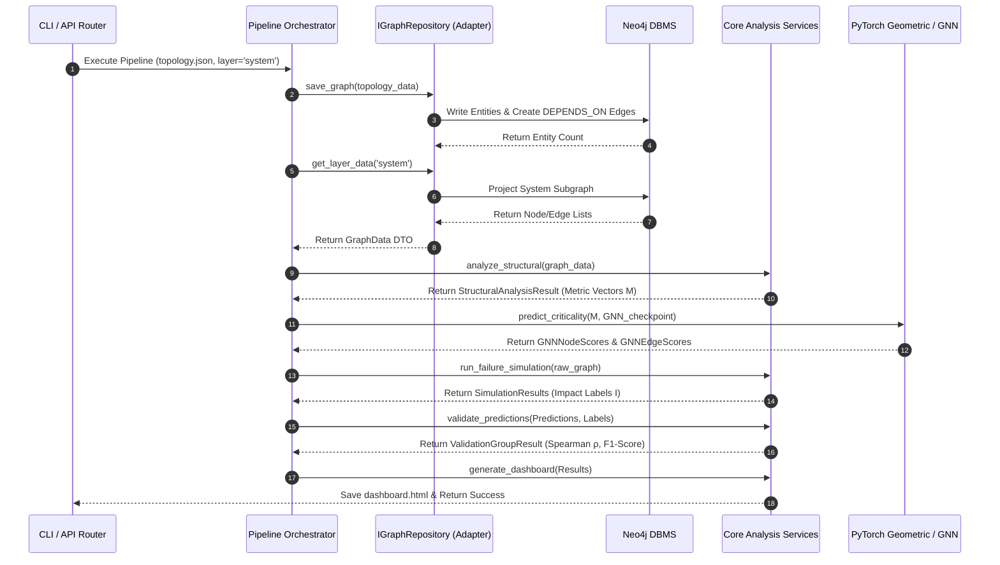
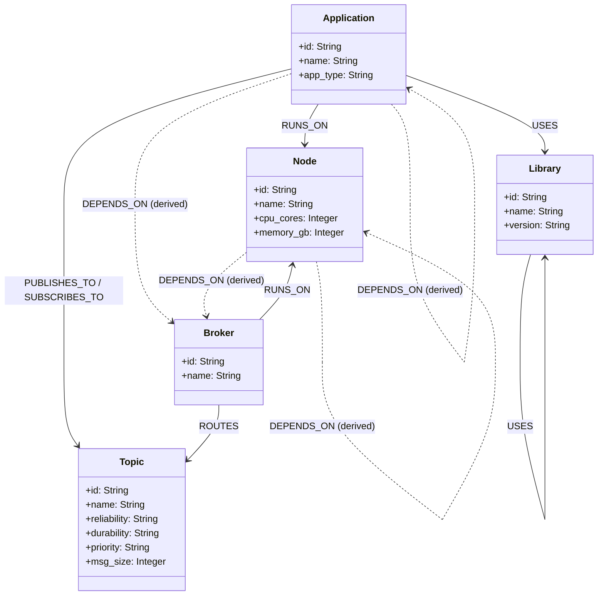

# Software Architecture Description (SAD)

## Software-as-a-Graph (saag)

### Graph-Based Critical Component Prediction for Distributed Publish-Subscribe Systems

**Version 3.0** · **June 2026**  
*Istanbul Technical University, Computer Engineering Department*  
*Conforming to ISO/IEC/IEEE 42010:2011 & ISO/IEC/IEEE 12207:2026*

---

## Table of Contents

1. [Introduction](#1-introduction)
   - 1.1 [Purpose](#11-purpose)
   - 1.2 [Scope](#12-scope)
   - 1.3 [References](#13-references)
   - 1.4 [Architectural Design Principles](#14-architectural-design-principles)
2. [Architectural Representation (Hexagonal Architecture)](#2-architectural-representation-hexagonal-architecture)
   - 2.1 [Overview](#21-overview)
   - 2.2 [Ports and Adapters](#22-ports-and-adapters)
   - 2.3 [Entry Points (Driving Adapters)](#23-entry-points-driving-adapters)
3. [Architectural Views](#3-architectural-views)
   - 3.1 [Logical View](#31-logical-view)
   - 3.2 [Process View](#32-process-view)
   - 3.3 [Development View](#33-development-view)
   - 3.4 [Physical & Deployment View](#34-physical--deployment-view)
4. [Data & Machine Learning Architecture](#4-data--machine-learning-architecture)
   - 4.1 [Neo4j Graph Database Schema](#41-neo4j-graph-database-schema)
   - 4.2 [Heterogeneous GNN Data Layout](#42-heterogeneous-gnn-data-layout)
5. [Architectural Decisions & Rationale](#5-architectural-decisions--rationale)

---

## 1. Introduction

### 1.1 Purpose
This document provides a comprehensive architectural overview of the **Software-as-a-Graph (saag)** framework. It describes the design patterns, logical layers, structural views, data models, and deployment configurations of the system. This document is written in accordance with **ISO/IEC/IEEE 42010:2011** and supports the Architecture Definition process within **ISO/IEC/IEEE 12207:2026**.

### 1.2 Scope
The scope of this architecture description covers the core Python SDK ([saag]), the CLI pipeline controllers ([cli]), the REST API layer ([api]), and the Genieus Next.js web application ([smart]). It details how these components are organized to ingest distributed pub-sub topologies, compute metrics, predict critical nodes/edges via rule-based and GNN paths, run simulations, and validate results.

### 1.3 References
- **ISO/IEC/IEEE 12207:2026**: Systems and software engineering — Software life cycle processes.
- **ISO/IEC/IEEE 42010:2011**: Systems and software engineering — Architecture description.

### 1.4 Architectural Design Principles
The system architecture is governed by the following core design guidelines:
- **Clean / Hexagonal Architecture**: Business logic is isolated from database technologies (Neo4j), presentation libraries (FastAPI, CLI), and GNN runtimes. Core services define interfaces (ports), and external layers implement adapters.
- **Separation of Concerns**: Pre-deployment static prediction is strictly decoupled from failure cascade simulation. This prevents feedback loops and ensures validation integrity.
- **Loose Coupling / High Cohesion**: Components communicate via well-defined Data Transfer Objects (DTOs) and dependency-injected interfaces.
- **Dependency Inversion**: High-level modules (core services) do not depend on low-level modules (database drivers). Both depend on abstractions.

---

## 2. Architectural Representation (Hexagonal Architecture)

### 2.1 Overview
The core SDK follows a **Hexagonal (Ports and Adapters) Architecture**. The application domain logic is placed at the center of the hexagon, isolated from the delivery channels (web UI, CLI scripts) and infrastructure services (Neo4j, file system).

```mermaid
graph TD
    subgraph Driving Adapters (Input Ports)
        CLI["CLI Command Runners (cli/*)"]
        FastAPI["FastAPI REST Routers (api/*)"]
        SDKClient["SDK Builder Client"]
    end

    subgraph Application Core
        UseCases["Use Case Boundary (saag/usecases/*)"]
        Services["Application Services (saag/analysis, saag/prediction, saag/simulation...)"]
        DomainModels["Domain Models (saag/core/models.py)"]
        RepoPort["IGraphRepository Interface (saag/core/ports)"]
    end

    subgraph Driven Adapters (Output Ports)
        Neo4jAdapter["Neo4jRepository (saag/infrastructure/neo4j)"]
        MemoryAdapter["MemoryRepository (saag/infrastructure/memory)"]
    end

    CLI --> UseCases
    FastAPI --> UseCases
    SDKClient --> UseCases
    
    UseCases --> Services
    Services --> DomainModels
    Services --> RepoPort
    
    RepoPort --> Neo4jAdapter
    RepoPort --> MemoryAdapter
```

### 2.2 Ports and Adapters
- **Output Port (Abstraction)**: `IGraphRepository` (defined in `saag.core.ports.graph_repository`). This protocol outlines the persistence capabilities: saving topologies, retrieving layers, exporting JSON, and extracting connectivity matrices.
- **Driven Adapter (Implementation)**:
  - `Neo4jRepository` (Production): Connects to the Neo4j database using the Bolt protocol. Executes Cypher queries to load raw graphs, derive dependencies, and project layers.
  - `MemoryRepository` (Testing): An in-memory graph repository implementing `IGraphRepository` using Python dictionaries. It requires no external database, enabling fast, isolated unit testing.

### 2.3 Entry Points (Driving Adapters)
The domain layer is driven via thin boundary layers:
- **CLI Pipeline**: Execution commands (e.g., `saag-analyze`, `saag-predict`) read arguments, instantiate adapters, invoke domain use cases, and display formatted outputs.
- **REST API**: FastAPI routers receive HTTP payloads, inject scoped repositories, execute use cases, and pass results to presenters.
- **SDK Fluent Interface**: Allows programmatic execution in Python:
  ```python
  result = Pipeline.from_json("topology.json").analyze().predict().simulate().validate().run()
  ```

---

## 3. Architectural Views

### 3.1 Logical View
The logical view decomposes the codebase into specialized packages with strict dependency flows. Dependencies must always point inwards toward `saag.core`.

```
┌─────────────────────────────────────────────────────────────────┐
│ Presenters / Routers (api/) or Arg CLI Runners (cli/)           │
└────────────────────────────────┬────────────────────────────────┘
                                 │ imports
                                 ▼
┌─────────────────────────────────────────────────────────────────┐
│ Use Cases Layer (saag.usecases)                                 │
│ - ModelGraphUseCase     - AnalyzeGraphUseCase                   │
│ - PredictGraphUseCase   - SimulateGraphUseCase                  │
└────────────────────────────────┬────────────────────────────────┘
                                 │ invokes
                                 ▼
┌─────────────────────────────────────────────────────────────────┐
│ Application Service Packages                                    │
│ - saag.analysis (structural metrics & RMAV quality)             │
│ - saag.prediction (inductive GNN and ensemble blending)        │
│ - saag.simulation (BFS discrete-event cascade simulation)       │
│ - saag.validation (Spearman ρ, classification performance)      │
│ - saag.visualization (HTML dashboard builder)                   │
└──────────────────────┬───────────────────┬──────────────────────┘
                       │ imports           │ imports
                       ▼                   ▼
┌──────────────────────────────┐   ┌──────────────────────────────┐
│ Infrastructure Adapters      │   │ Core Domain (saag.core)      │
│ - saag.infrastructure.neo4j  │   │ - Entity Models (models.py)  │
│ - saag.infrastructure.memory │   │ - Interface Port (ports.py)  │
└──────────────────────────────┘   └──────────────────────────────┘
```

- **Domain Entities**: Plain Python dataclasses (`GraphData`, `ComponentData`, `EdgeData`) that contain no database logic or framework dependencies.
- **Use Cases**: Act as thin orchestrators or boundaries. They coordinate execution across services and repositories but do not contain business algorithms.

### 3.2 Process View
The process view describes the pipeline execution sequence and how data transforms step-by-step from raw file configurations to validated dashboards.



#### REST API Thread Model
FastAPI endpoints execute asynchronously (`async def`) on an ASGI event loop (Uvicorn). Tasks requiring heavy computational resources (such as centrality metric calculation or PyTorch GNN execution) are offloaded to synchronous services running in a process worker pool to prevent event loop blocking.

---

### 3.3 Development View
The codebase is structured into isolated folders separating domain packages, presentation scripts, and web UI modules.

```
software-as-a-graph/                  # Workspace Root
├── api/                              # FastAPI REST API implementation
│   ├── routers/                      #   REST routes (health, graph, prediction...)
│   └── presenters/                   #   Response format adapters (Hexagonal presenter pattern)
├── cli/                              # Command-Line Interfaces (one file per step)
│   ├── run.py                        #   Main pipeline orchestrator
│   └── common/                       #   Shared CLI utilities (arguments parser, dispatchers)
├── saag/                             # Core Domain & Service Packages (SDK)
│   ├── core/                         #   Core domain models, ports, and layer definitions
│   ├── analysis/                     #   Structural metrics and RMAV formula engines
│   ├── prediction/                   #   PyTorch HGT/GNN engine and ensemble service
│   ├── simulation/                   #   Discrete-event cascade propagation engine
│   ├── validation/                   #   Spearman ρ and classification evaluation
│   ├── visualization/                #   Plotly chart and static HTML builders
│   └── infrastructure/               #   Neo4j and Memory adapters (implementing ports)
├── smart/                            # Next.js 16 Genieus web application (React, TypeScript)
├── tools/                            # Synthetic topology generation and benchmark tools
├── tests/                            # Pytest suite (24 files, unit & integration tests)
└── pyproject.toml                    # PEP 621 packaging, dependencies, and CLI entry points
```

#### Packaging and Entrypoints
The system is packaged as an installable Python library using `pyproject.toml`. It registers the following console scripts:
- `saag` $\rightarrow$ CLI Pipeline Orchestrator (`cli.run:main`)
- `saag-generate` $\rightarrow$ Synthetic graph generation (`cli.generate_graph:main`)
- `saag-analyze` $\rightarrow$ Metric analysis and quality scoring (`cli.analyze_graph:main`)
- `saag-predict` $\rightarrow$ GNN and ensemble execution (`cli.predict_graph:main`)
- `saag-simulate` $\rightarrow$ Failure cascades execution (`cli.simulate_graph:main`)

---

### 3.4 Physical & Deployment View
The system is deployed as a single, multi-container stack using **Docker Compose**. This ensures that the web server, database, and API layers can communicate securely over an isolated virtual network.

```
                  ┌──────────────────────────────────────────────┐
                  │                 Host Machine                 │
                  │                                              │
                  │   ┌──────────────────────────────────────┐   │
                  │   │        Genieus Web Application       │   │
                  │   │        Next.js Node Container        │   │
                  │   │        Port 7000 (Internal/Ext)      │   │
                  │   └──────────────────┬───────────────────┘   │
                  │                      │ HTTP Calls            │
                  │                      ▼                       │
                  │   ┌──────────────────────────────────────┐   │
                  │   │          FastAPI REST API            │   │
                  │   │          Python Container            │   │
                  │   │        Port 8000 (Internal/Ext)      │   │
                  │   └──────────────────┬───────────────────┘   │
                  │                      │ Bolt Protocol         │
                  │                      ▼                       │
                  │   ┌──────────────────────────────────────┐   │
                  │   │            Neo4j Database            │   │
                  │   │           Database Container         │   │
                  │   │        Port 7687 Bolt / 7474 UI      │   │
                  │   └──────────────────────────────────────┘   │
                  │                                              │
                  └──────────────────────────────────────────────┘
```

#### Docker Network & Ports
- **Network**: Named bridge network (`saag-net`). All containers are registered on this network, allowing hostname-based routing.
- **Volumes**: Persistent volume mounted to `/data` in the Neo4j container to preserve topology state between stack restarts.
- **Environment Variables**:
  - `NEO4J_URI=bolt://neo4j:7687` (resolved inside the API container)
  - `NEXT_PUBLIC_API_URL=http://localhost:8000` (resolved inside the client browser)

---

## 4. Data & Machine Learning Architecture

### 4.1 Neo4j Graph Database Schema
The database models the distributed publish-subscribe system as a heterogeneous graph.



#### Derived Logical Dependencies
During Phase 4 of the import process, raw topological connections are evaluated to derive direct `DEPENDS_ON` edges pointing from dependents to dependencies. These edges carry a QoS-derived weight (see Appendix A.1 of the SRS) and are grouped into four analysis layers:
1. `app_to_app` $\rightarrow$ Application layer
2. `node_to_node` $\rightarrow$ Infrastructure layer
3. `app_to_broker` / `node_to_broker` $\rightarrow$ Middleware layer
4. Combined components $\rightarrow$ System layer

---

### 4.2 Heterogeneous GNN Data Layout
To run GNN predictions, the NetworkX graph is converted to a PyTorch Geometric `HeteroData` layout. Nodes and edges are partitioned into tensors.

#### Node Feature Tensors
Each node $v$ receives a feature vector composed of an 18-dimensional base topological vector (indices 0-17) augmented by type-specific features (indices 18+).

```
   Node Type      0                         17 18                    22
  ┌────────────┐ ┌────────────────────────────┐┌──────────────────────┐
  │ App / Lib  │ │   18-dim base topological  ││ 5-dim code quality   │ (23-dim)
  └────────────┘ └────────────────────────────┘└──────────────────────┘
  ┌────────────┐ ┌────────────────────────────┐┌───┐
  │   Broker   │ │   18-dim base topological  ││CQP│ (19-dim)
  └────────────┘ └────────────────────────────┘└───┘
  ┌────────────┐ ┌────────────────────────────┐┌──────────────────────┐
  │   Topic    │ │   18-dim base topological  ││ 4-dim pub/sub counts │ (22-dim)
  └────────────┘ └────────────────────────────┘└──────────────────────┘
  ┌────────────┐ ┌────────────────────────────┐┌───────────┐
  │Node (Infra)│ │   18-dim base topological  ││CPU/Mem nrm│ (20-dim)
  └────────────┘ └────────────────────────────┘└───────────┘
```

#### Edge Feature Tensors (16 Dimensions)
- **Index 0**: QoS weight $w(e)$ computed during import.
- **Index 1**: Normalized path count.
- **Indices 2-8**: One-hot encoding of the 7 edge types.
- **Indices 9-15**: QoS-specific attributes (Reliability flag, Durability ordinals, Priority ordinals, deadline values, max blocking duration).

---

## 5. Architectural Decisions & Rationale

### Decision 1: Hexagonal Ports & Adapters Structure
- **Rationale**: Isolating domain calculation logic from infrastructure packages allows us to maintain stable, testable code. By defining `IGraphRepository`, we can execute unit tests using `MemoryRepository` in milliseconds without launching Neo4j. If we transition to another database (e.g., Neptune) in the future, the core SDK remains unchanged.

### Decision 2: Decoupling Static Prediction from Failure Simulation
- **Rationale**: The core evaluation methodology requires validating structural predictions against cascade simulation results. If the prediction engine (RMAV/GNN) had access to simulation telemetry during execution, it would result in validation leakage. Decooupling them guarantees that predictions are computed purely statically (pre-deployment), matching operational constraints.

### Decision 3: Heterogeneous Graph Transformer (HGT) Backbone
- **Rationale**: Publish-subscribe systems are inherently heterogeneous (applications publish to topics, brokers route topics, apps run on physical nodes). Standard homogeneous GNN models (like GCN or GAT) wash out these semantic differences. HGTConv learns separate query/key/value projection matrices per relation type, accurately capturing pub-sub routing patterns.

### Decision 4: API-First Decoupled Frontend (Next.js & FastAPI)
- **Rationale**: Separating the frontend and backend enables independent scaling. The FastAPI layer acts as a pure calculation server, which can be deployed close to the Neo4j database or run in batch mode. The Next.js frontend delivers a modern web application (Genieus) that runs entirely in the user's browser, calling the backend asynchronously without blocking UI interactions.
