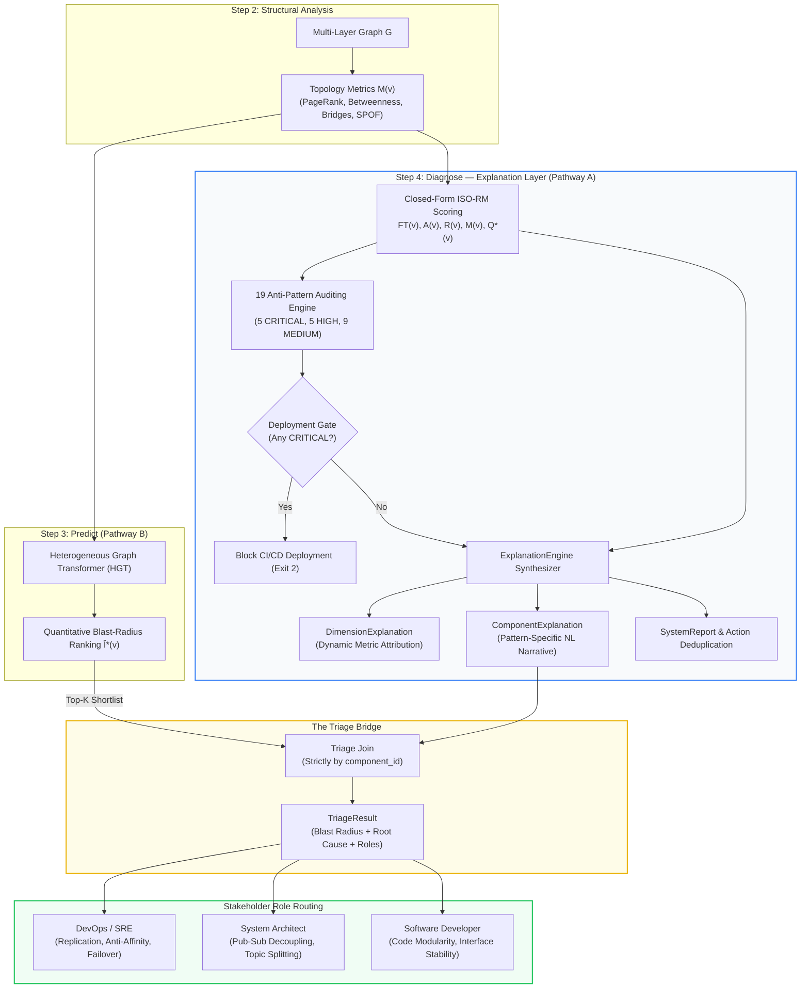
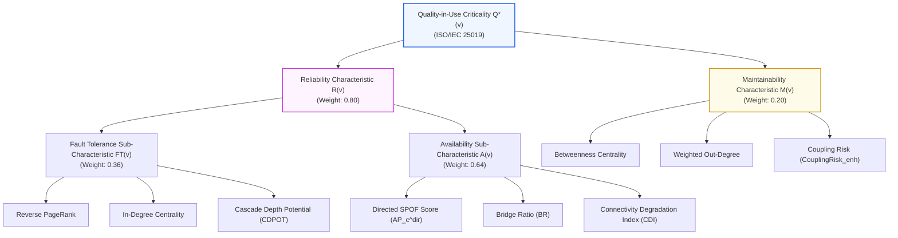
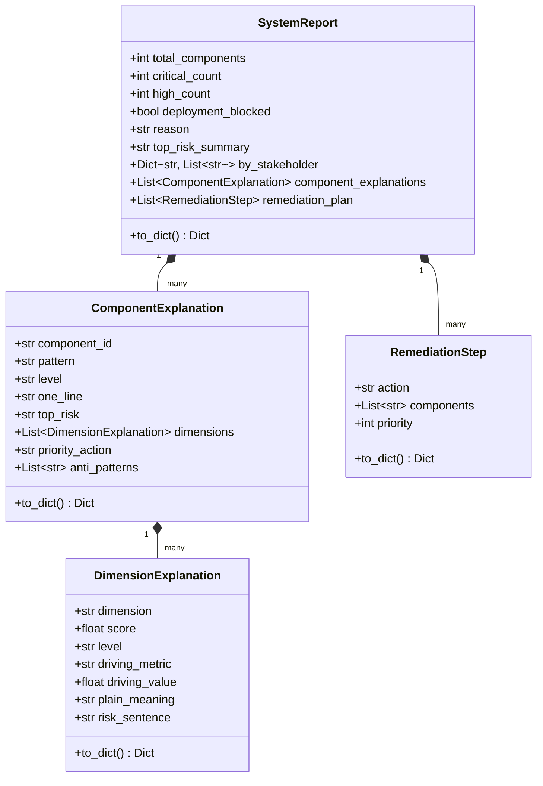
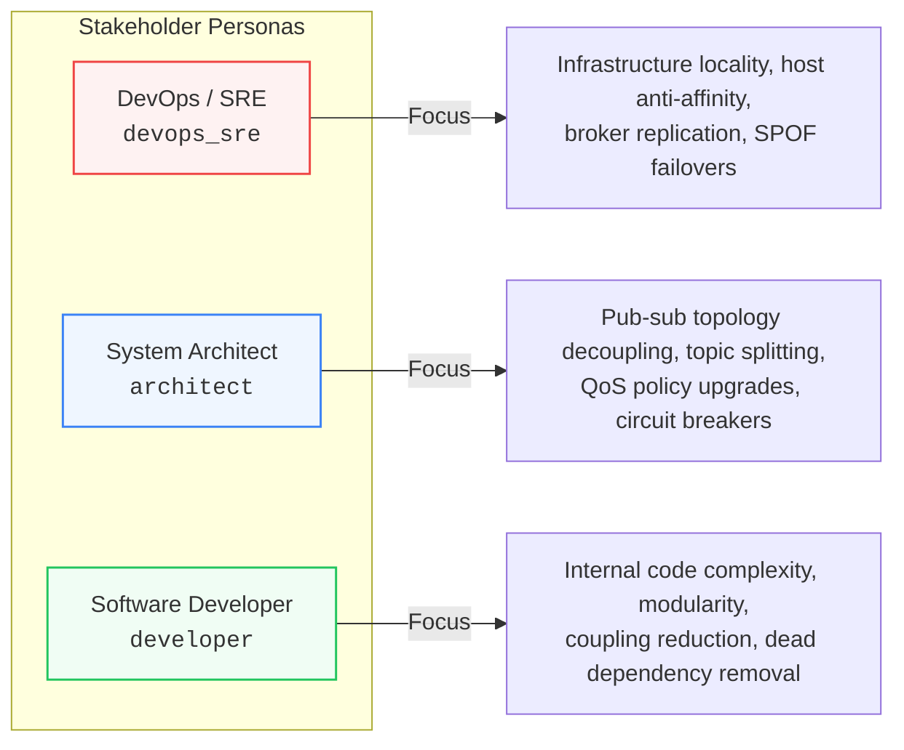
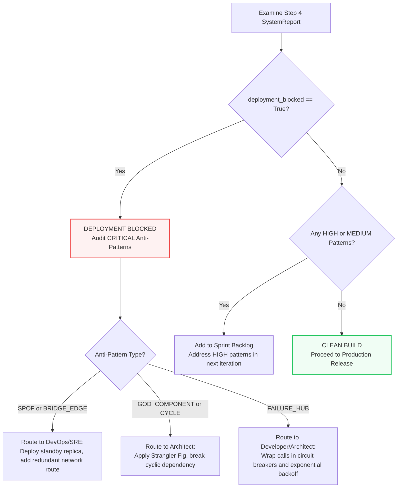

# Step 4: Diagnose — Deterministic ISO-RM Root-Cause Attribution & The Explanation Layer

**Transform complex architectural graph metrics and criticality predictions into deterministic, standards-grounded root-cause attributions, audit 19 structural anti-patterns, generate human-readable natural language explanations, and route prioritized remediations to engineering stakeholders via the Triage Bridge.**

← [Step 3: Predict](prediction.md) | → [Step 5: Simulate](failure-simulation.md)

---

## Table of Contents

1. [Overview & Dual-Pathway Architecture](#1-overview--dual-pathway-architecture)
   - 1.1 [The Mission of Step 4](#11-the-mission-of-step-4)
   - 1.2 [Pathway A vs. Pathway B Separation](#12-pathway-a-vs-pathway-b-separation)
   - 1.3 [The Three Foundational Invariants](#13-the-three-foundational-invariants)
2. [Theoretical Grounding: ISO/IEC 25010 & 25019](#2-theoretical-grounding-isoiec-25010--25019)
   - 2.1 [Quality-in-Use & Structural Characteristics](#21-quality-in-use--structural-characteristics)
   - 2.2 [Closed-Form Reference Model (RM) Mathematics](#22-closed-form-reference-model-rm-mathematics)
   - 2.3 [Adaptive Box-Plot Threshold Fencing](#23-adaptive-box-plot-threshold-fencing)
3. [The Explanation Layer Architecture](#3-the-explanation-layer-architecture)
   - 3.1 [Why Numbers Alone Are Not Enough](#31-why-numbers-alone-are-not-enough)
   - 3.2 [Core Data Contracts (`saag.explanation.engine`)](#32-core-data-contracts-saagexplanationengine)
   - 3.3 [The Explanation Synthesis Pipeline](#33-the-explanation-synthesis-pipeline)
4. [Dynamic Metric Driver Identification](#4-dynamic-metric-driver-identification)
   - 4.1 [Attribution Mapping (`DIMENSION_DRIVERS`)](#41-attribution-mapping-dimension_drivers)
   - 4.2 [Dynamic Top-Contributor Selection Algorithm](#42-dynamic-top-contributor-selection-algorithm)
   - 4.3 [Plain-Language Translation Table](#43-plain-language-translation-table)
5. [Pattern-Specific Natural Language Synthesis](#5-pattern-specific-natural-language-synthesis)
   - 5.1 [The 7 Architectural Archetypes](#51-the-7-architectural-archetypes)
   - 5.2 [Dynamic Context Variable Interpolation](#52-dynamic-context-variable-interpolation)
   - 5.3 [Concrete Transformation Walkthrough](#53-concrete-transformation-walkthrough)
6. [Stakeholder Role Routing & Triage Presenter](#6-stakeholder-role-routing--triage-presenter)
   - 6.1 [The Three Engineering Personas](#61-the-three-engineering-personas)
   - 6.2 [Resolution Rules: Pattern Overrides & Dimension Fallbacks](#62-resolution-rules-pattern-overrides--dimension-fallbacks)
   - 6.3 [Executive Summaries & Action Deduplication](#63-executive-summaries--action-deduplication)
7. [The 19 Anti-Pattern Auditing Engine](#7-the-19-anti-pattern-auditing-engine)
   - 7.1 [Comprehensive Catalog Specification](#71-comprehensive-catalog-specification)
   - 7.2 [Severity Classification & CI/CD Deployment Gating](#72-severity-classification--cicd-deployment-gating)
   - 7.3 [Detector Resilience & Fail-Safe Invariant](#73-detector-resilience--fail-safe-invariant)
8. [The Triage Bridge: Joining Blast Radius with Root Cause](#8-the-triage-bridge-joining-blast-radius-with-root-cause)
   - 8.1 [The Blast-Radius Dilemma](#81-the-blast-radius-dilemma)
   - 8.2 [Joining Strictly on `component_id`](#82-joining-strictly-on-component_id)
   - 8.3 [GNN Shim Safety & Root-Cause Substrate Isolation](#83-gnn-shim-safety--root-cause-substrate-isolation)
9. [Zero-GNN Cold-Start Independence](#9-zero-gnn-cold-start-independence)
   - 9.1 [Zero Machine Learning Dependency](#91-zero-machine-learning-dependency)
   - 9.2 [Cold-Start Triage Ranking](#92-cold-start-triage-ranking)
10. [Programmatic Python SDK Guide](#10-programmatic-python-sdk-guide)
    - 10.1 [High-Level Fluent Pipeline API](#101-high-level-fluent-pipeline-api)
    - 10.2 [Client API (`Client.diagnose` & `Client.triage`)](#102-client-api-clientdiagnose--clienttriage)
    - 10.3 [Decoupled Clean Architecture Use Cases](#103-decoupled-clean-architecture-use-cases)
    - 10.4 [Direct `ExplanationEngine` Invocation](#104-direct-explanationengine-invocation)
11. [CLI Reference & CI/CD Workflows](#11-cli-reference--cicd-workflows)
    - 11.1 [Command Line Options & Arguments](#111-command-line-options--arguments)
    - 11.2 [Real-World Execution Examples](#112-real-world-execution-examples)
    - 11.3 [Automated GitHub Actions / GitLab CI Gating](#113-automated-github-actions--gitlab-ci-gating)
12. [Output Schemas & Artifact Examples](#12-output-schemas--artifact-examples)
    - 12.1 [JSON Schema Breakdown (`diagnosis.json`)](#121-json-schema-breakdown-diagnosisjson)
    - 12.2 [Annotated JSON Payload Example](#122-annotated-json-payload-example)
13. [Diagnostic Interpretation & Remediation Decision Tree](#13-diagnostic-interpretation--remediation-decision-tree)
14. [What Comes Next](#14-what-comes-next)

---

## 1. Overview & Dual-Pathway Architecture

Modern distributed systems and microservices architectures suffer from a critical diagnostic gap: machine learning models can identify *which* components are statistically likely to trigger massive failure cascades, but neural weights cannot articulate *why* a component is fragile or *how* a software engineering team should refactor it.

**Step 4 (Diagnose)** bridges this gap. It acts as the **deterministic root-cause attribution and explanation engine** of Software-as-a-Graph (SaaG). Grounded in the international software quality standards **ISO/IEC 25010:2023** and **ISO/IEC 25019:2023**, Step 4 evaluates structural graph topology, identifies the precise graph metric driving each vulnerability, audits the system against a formal catalog of 19 anti-patterns, generates natural-language explanations, and maps prioritized remediation actions directly to responsible engineering stakeholders.



### 1.1 The Mission of Step 4

Step 4 answers four critical engineering questions that black-box predictive models cannot answer:

1. **Why is this component risky?** It isolates the exact underlying topological weakness (e.g., transitively reachable blast radius, structural articulation point, or change instability).
2. **What structural anti-pattern is present?** It audits the topology against 19 well-defined bad smells (e.g., `SPOF`, `GOD_COMPONENT`, `BROKER_OVERLOAD`, `CYCLE`).
3. **Who is responsible for fixing it?** It routes the remediation to the correct engineering discipline (DevOps/SRE, System Architect, or Software Developer).
4. **Should this build be allowed into production?** It serves as an automated quality gate for CI/CD pipelines, blocking releases when critical architectural risks are discovered.

### 1.2 Pathway A vs. Pathway B Separation

SaaG establishes a strict conceptual and operational separation between its two analytical pathways:

| Attribute | Pathway A: Diagnostic Attribution (Step 4) | Pathway B: Predictive Ranking (Step 3) |
|:---|:---|:---|
| **Primary Method** | Deterministic closed-form algebraic Reference Model (RM) | Learned Heterogeneous Graph Transformer (HGT) |
| **Output Type** | Multi-dimensional quality scores, anti-patterns, explanations | Scalar blast-radius prediction $\hat{I}^*(v)$, relative rank |
| **Ground Truth / Standards** | ISO/IEC 25010:2023 & ISO/IEC 25019:2023 standards | Discrete-event failure simulation cascades (Step 5) |
| **Explainability** | 100% white-box; closed-form equations and metric drivers | Black-box neural embeddings; high predictive throughput |
| **Model Checkpoint** | None required (zero-GNN cold-start capable) | Requires trained PyTorch / PyG weights (optional fallback) |
| **Primary Role** | Root-cause identification, smell detection, remediation | High-throughput ranking of largest system blast radius |

### 1.3 The Three Foundational Invariants

The design of Step 4 is governed by three non-negotiable architectural guarantees:

> [!IMPORTANT]
> **Invariant 1: Parameter Independence**  
> Pathway A (Step 4) and Pathway B (Step 3) share **zero learned weights**. Pathway A is never fitted, calibrated, or trained on Pathway B's predictions, and Pathway B does not alter Pathway A's equations. They provide completely independent perspectives on system health.

> [!IMPORTANT]
> **Invariant 2: Offline Oracle Separation**  
> Simulation (Step 5) is an offline validation oracle and **never an input to Step 4**. Step 4 operates exclusively on static structural metrics and declared transport QoS policies. It evaluates architectural risk before any failure occurs and without incurring simulation overhead.

> [!IMPORTANT]
> **Invariant 3: No Hallucination in Root-Cause Attribution**  
> Neural networks can rank components by estimated impact, but they are prone to hallucinating explanations. In SaaG, **neural models are never asked to generate root-cause explanations**. The Triage Bridge joins quantitative rankings to qualitative diagnostic profiles strictly on `component_id`. All explanations are synthesized deterministically from verifiable graph metrics.

---

## 2. Theoretical Grounding: ISO/IEC 25010 & 25019

Unlike heuristic linter tools, Step 4's diagnostic framework is formally anchored in the software engineering quality standards **ISO/IEC 25010:2023** (Systems and software engineering — Systems and software Quality Requirements and Evaluation — Product quality model) and **ISO/IEC 25019:2023** (Quality-in-use model).

### 2.1 Quality-in-Use & Structural Characteristics

Criticality is formalized as a **Quality-in-Use** construct: the degree to which an architectural defect or failure degrades system stakeholders' operational goals (safety, availability, cost, and mission success).



The model decomposes Quality-in-Use into two orthogonal ISO/IEC 25010 product quality characteristics evaluated over the derived dependency multigraph $G_{\text{analysis}} = (V, E)$:

1. **Reliability ($R$)**: The capability of the system to maintain a specified level of performance under stated conditions. This is subdivided into:
   - **Fault Tolerance ($FT$)**: Resistance to cascading failure propagation across directed dependency paths.
   - **Availability ($A$)**: The degree to which components and services remain accessible and operational, specifically penalized by single points of failure (cut vertices and bridges).
2. **Maintainability ($M$)**: The degree of effectiveness and efficiency with which a component can be modified, refactored, or evolved without introducing unintended regressions.

*(Note: The former Vulnerability/Security dimension was formally retired because empirical fault-injection instruments cannot validate it without external dynamic attack vectors. See [`criticality.md`](criticality.md) for the complete theoretical justification).*

### 2.2 Closed-Form Reference Model (RM) Mathematics

The diagnostic Reference Model computes closed-form, deterministic quality scores by hierarchically aggregating normalized Tier-1 structural metrics.

#### Step A: Sub-Characteristic Aggregation

For each component $v \in V$, the Fault Tolerance ($FT$), Availability ($A$), and Maintainability ($M$) scores are evaluated as weighted sums of normalized structural metrics $\tilde{m}(v) \in [0, 1]$:

$$\text{FT}(v) = w_{\text{rpr}} \cdot \widetilde{\text{RPR}}(v) + w_{\text{in}} \cdot \widetilde{\text{Deg}}_{\text{in}}(v) + w_{\text{cdpot}} \cdot \widetilde{\text{CDPOT}}(v)$$

$$\text{A}(v) = w_{\text{spof}} \cdot \widetilde{\text{AP}}_c^{\text{dir}}(v) + w_{\text{br}} \cdot \widetilde{\text{BR}}(v) + w_{\text{cdi}} \cdot \widetilde{\text{CDI}}(v)$$

$$\text{M}(v) = w_{\text{btw}} \cdot \widetilde{\text{BTW}}(v) + w_{\text{out}} \cdot \widetilde{\text{Deg}}_{\text{out}}(v) + w_{\text{cr}} \cdot \widetilde{\text{CR}}(v)$$

#### Step B: Reliability Synthesis

Reliability combines dynamic cascade propagation potential with static topological disconnectivity:

$$R(v) = 0.36 \cdot \text{FT}(v) + 0.64 \cdot \text{A}(v)$$

The heavier weighting on Availability ($0.64$) reflects empirical evidence from production topologies: structural graph partitioning causes immediate, irrecoverable service loss, whereas cascade propagation can often be mitigated downstream via timeouts and circuit breakers.

#### Step C: Quality-in-Use Composite ($Q^*$)

The overarching diagnostic criticality score $Q^*(v)$ balances operational continuity against long-term maintenance friction:

$$Q^*(v) = 0.80 \cdot R(v) + 0.20 \cdot M(v)$$

### 2.3 Adaptive Box-Plot Threshold Fencing

Rather than applying arbitrary hard-coded cutoffs (e.g., $Q^* > 0.8$), Step 4 categorizes components into five ordinal criticality tiers using distribution-aware **Tukey box-plot fences** calculated across the evaluated system population:

$$\text{IQR} = Q_3 - Q_1$$

$$\text{Upper Fence} = Q_3 + 1.5 \cdot \text{IQR}$$

$$\text{Criticality Level}(v) = \begin{cases} 
\mathbf{CRITICAL} & \text{if } Q^*(v) > Q_3 + 1.5 \cdot \text{IQR} \\ 
\mathbf{HIGH} & \text{if } Q_3 < Q^*(v) \le Q_3 + 1.5 \cdot \text{IQR} \\ 
\mathbf{MEDIUM} & \text{if } Q_2 < Q^*(v) \le Q_3 \\ 
\mathbf{LOW} & \text{if } Q_1 < Q^*(v) \le Q_2 \\ 
\mathbf{MINIMAL} & \text{if } Q^*(v) \le Q_1 
\end{cases}$$

This adaptive fence guarantees that classification automatically adjusts to the graph's size and density. If a population contains fewer than 12 components ($N < 12$), the engine automatically falls back to fixed percentile thresholds ($90^{\text{th}}$, $75^{\text{th}}$, $50^{\text{th}}$, $25^{\text{th}}$ percentiles) to prevent small-sample distortion.

---

## 3. The Explanation Layer Architecture

The core implementation of the Explanation Layer resides in [`saag/explanation/engine.py`](file:///home/onuralpyigit/Workspace/SoftwareAsAGraph/saag/explanation/engine.py) and [`saag/explanation/templates.py`](file:///home/onuralpyigit/Workspace/SoftwareAsAGraph/saag/explanation/templates.py).

### 3.1 Why Numbers Alone Are Not Enough

Presenting an engineer or an engineering manager with a raw tensor or a vector of numbers (e.g., `NavLib: Q=0.891, RPR=0.87, BTW=0.62, AP_c=1.0`) fails in production environments:
- It forces the engineer to mentally reverse-engineer the graph topology.
- It provides no contextual explanation of the cascading failure mechanism.
- It does not identify which metric is the dominant driver of the risk.
- It does not provide actionable, concrete guidance on how to fix the problem.

The Explanation Layer converts these raw numerical metrics into structured, human-readable explanations that directly drive remediation workflows.

### 3.2 Core Data Contracts (`saag.explanation.engine`)

The explanation engine defines four typed data contracts:



1. [`DimensionExplanation`](file:///home/onuralpyigit/Workspace/SoftwareAsAGraph/saag/explanation/engine.py#L20-L41): Explains why a specific ISO characteristic (Reliability, Maintainability, Availability) is elevated, highlighting the single dominant driving metric and translating its numerical value into a plain English risk statement.
2. [`ComponentExplanation`](file:///home/onuralpyigit/Workspace/SoftwareAsAGraph/saag/explanation/engine.py#L43-L72): Aggregates all dimension explanations for a component, names its high-level architectural pattern (e.g., "Total Hub"), generates an executive one-line summary, details its primary risk, lists detected anti-pattern IDs, and provides a single priority remediation action.
3. [`RemediationStep`](file:///home/onuralpyigit/Workspace/SoftwareAsAGraph/saag/explanation/engine.py#L74-L87): A deduplicated, system-level refactoring task grouping all affected components under an actionable priority (Priority 1 = CRITICAL, Priority 2 = HIGH).
4. [`SystemReport`](file:///home/onuralpyigit/Workspace/SoftwareAsAGraph/saag/explanation/engine.py#L89-L114): An executive-level report covering the entire architecture, containing deployment gating status, top risk concentrations, role-routed stakeholder task lists, and an ordered remediation roadmap.

### 3.3 The Explanation Synthesis Pipeline

The [`ExplanationEngine`](file:///home/onuralpyigit/Workspace/SoftwareAsAGraph/saag/explanation/engine.py#L175-L256) follows a three-stage synthesis workflow:

```
[Raw ComponentQuality & DetectedProblems]
                   │
                   ▼
       1. Context Interpolation
          Extracts raw & normalized metrics:
          {id}, {in_degree_raw}, {out_degree_raw}, {bridge_ratio_pct}, {cascade_count}
                   │
                   ▼
       2. Dynamic Driver Attribution
          Evaluates DIMENSION_DRIVERS for each elevated dimension (score ≥ HIGH)
          Selects argmax(driving_value) → attaches driving_metric & plain_meaning
                   │
                   ▼
       3. Narrative Template Interpolation
          Matches CriticalityProfile.pattern in PATTERN_TEMPLATES
          Generates one_line, top_risk, and priority_action narratives
                   │
                   ▼
       [Structured ComponentExplanation]
```

---

## 4. Dynamic Metric Driver Identification

A common failure of automated diagnostic tools is generic feedback (e.g., "Reliability is low"). The Explanation Layer solves this through **Dynamic Metric Driver Identification** via [`identify_driver()`](file:///home/onuralpyigit/Workspace/SoftwareAsAGraph/saag/explanation/engine.py#L134-L143).

### 4.1 Attribution Mapping (`DIMENSION_DRIVERS`)

For each ISO quality dimension, the engine tracks candidate structural drivers in [`DIMENSION_DRIVERS`](file:///home/onuralpyigit/Workspace/SoftwareAsAGraph/saag/explanation/engine.py#L116-L132). Each candidate defines its attribute accessor, human-readable name, and semantic operational meaning:

```python
DIMENSION_DRIVERS = {
    "Reliability": [
        ("reverse_pagerank", "Reverse PageRank", "fraction of the system reachable from this component"),
        ("in_degree", "In-degree centrality", "number of components directly depending on it"),
        ("cdpot", "Cascade Depth Potential", "depth × breadth of its failure cascade"),
    ],
    "Maintainability": [
        ("betweenness", "Betweenness centrality", "routing traffic passing through it"),
        ("dependency_weight_out", "Weighted out-degree", "number and priority of interface dependencies"),
        ("coupling_risk", "Coupling Risk", "instability relative to its dependents"),
    ],
    "Availability": [
        ("ap_c_directed", "Directed SPOF score", "fraction of connectivity lost if it is removed"),
        ("bridge_ratio", "Bridge ratio", "fraction of its connections that are irreplaceable"),
        ("cdi", "Connectivity Degradation Index", "increase in average path length without it"),
    ],
}
```

### 4.2 Dynamic Top-Contributor Selection Algorithm

When a dimension is classified as elevated ($\ge \text{HIGH}$ or flagged in `CriticalityProfile`), `identify_driver()` evaluates all candidate metrics for that dimension and selects the one with the highest normalized value:

$$\text{TopDriver}(v, D) = \arg\max_{(m, \text{name}, \text{meaning}) \in \text{Drivers}(D)} \tilde{m}(v)$$

```python
def identify_driver(component: ComponentQuality, dimension: str) -> tuple[str, float, str]:
    """Return (metric_name, value, plain_meaning) for the top contributor."""
    metrics = DIMENSION_DRIVERS.get(dimension, [])
    if not metrics:
        return ("Unknown", 0.0, "unknown metric driver")
    
    values = [(name, getattr(component.structural, attr, 0.0), meaning)
              for attr, name, meaning in metrics]
    return max(values, key=lambda x: x[1])
```

### 4.3 Plain-Language Translation Table

The selected metric driver is formatted into the final explanation string:

| Dimension | Selected Driver | Raw Property | Generated Plain-Meaning Text |
|:---|:---|:---|:---|
| **Reliability** | Reverse PageRank | `reverse_pagerank` | *"Primary driver: fraction of the system reachable from this component."* |
| **Reliability** | In-Degree | `in_degree` | *"Primary driver: number of components directly depending on it."* |
| **Reliability** | Cascade Depth Potential | `cdpot` | *"Primary driver: depth × breadth of its failure cascade."* |
| **Maintainability** | Betweenness | `betweenness` | *"Primary driver: routing traffic passing through it."* |
| **Maintainability** | Weighted Out-Degree | `dependency_weight_out` | *"Primary driver: number and priority of interface dependencies."* |
| **Maintainability** | Coupling Risk | `coupling_risk` | *"Primary driver: instability relative to its dependents."* |
| **Availability** | Directed SPOF Score | `ap_c_directed` | *"Primary driver: fraction of connectivity lost if it is removed."* |
| **Availability** | Bridge Ratio | `bridge_ratio` | *"Primary driver: fraction of its connections that are irreplaceable."* |
| **Availability** | Connectivity Degradation | `cdi` | *"Primary driver: increase in average path length without it."* |

---

## 5. Pattern-Specific Natural Language Synthesis

In [`saag/analysis/analyzer.py`](file:///home/onuralpyigit/Workspace/SoftwareAsAGraph/saag/analysis/analyzer.py#L101-L115), components with elevated dimensions are mapped to a distinct architectural pattern tuple: `(ft_crit, a_crit, m_crit)`.

### 5.1 The 7 Architectural Archetypes

[`PATTERN_TEMPLATES`](file:///home/onuralpyigit/Workspace/SoftwareAsAGraph/saag/explanation/templates.py#L34-L79) maps these tuples to one of 7 archetypal pattern explanations:

| Archetype Pattern | Condition `(FT, A, M)` | Architectural Definition & Operational Meaning |
|:---|:---|:---|
| **Total Hub** | `(True, True, True)` | Concentrates cascade propagation risk, structural SPOF disconnectivity, and change modification friction simultaneously. Highest overall systemic hazard. |
| **Single Point of Failure (SPOF)** | `(False, True, False)` | Topological cut vertex. Its loss strictly disconnects the graph into isolated partitions, halting communication. |
| **Fault-Tolerance Hub** | `(True, False, False)` | High in-degree and transitive reachability. A failure here triggers wide cascading outages across downstream subscribers. |
| **Bottleneck** | `(False, False, True)` | High betweenness and coupling. A change bottleneck where interface modifications force breaking updates across dependents. |
| **Fragile Hub** | `(True, True, False)` | Combines wide failure cascade reach with structural SPOF behavior. Loss halts data flows and partitions the network. |
| **Fragile Bottleneck** | `(False, True, True)` | A structural SPOF that also acts as a change bottleneck. Compounds operational availability risk with maintainability debt. |
| **Composite Risk** | *(Any other combo)* | Multi-dimensional vulnerability where no single metric dominates, but the combined risk exceeds population fences. |

### 5.2 Dynamic Context Variable Interpolation

The template engine prepares a rich contextual dictionary `ctx` extracted from the component's structural properties:

```python
ctx = quality.structural.to_dict()
ctx["id"] = quality.id
ctx["in_degree_raw"] = quality.structural.in_degree_raw
ctx["out_degree_raw"] = quality.structural.out_degree_raw
bridge_ratio = getattr(quality.structural, "bridge_ratio", 0.0)
ctx["bridge_ratio_pct"] = round(bridge_ratio * 100, 1)
ctx["fragmented_pct"] = bridge_ratio
ctx["cascade_count"] = quality.structural.in_degree_raw
ctx["coupling_count"] = quality.structural.total_degree_raw
```

These parameters are interpolated into the chosen pattern's narrative template strings.

### 5.3 Concrete Transformation Walkthrough

Let us trace how a raw component with ID `"App_Controller"` is transformed:

#### Raw Component Metrics
- In-degree: 8 direct dependents
- Out-degree: 12 dependencies
- Total degree: 20
- Bridge ratio: 0.65 (65% of connections are bridges)
- `ft_crit = True`, `a_crit = True`, `m_crit = True` $\rightarrow$ Pattern: `"Total Hub"`
- Reliability score: 0.891 (CRITICAL), top driver: Reverse PageRank (0.870)
- Maintainability score: 0.845 (CRITICAL), top driver: Betweenness centrality (0.812)
- Availability score: 0.920 (CRITICAL), top driver: Directed SPOF score (0.950)

#### Generated `ComponentExplanation` Output
```json
{
  "component_id": "App_Controller",
  "pattern": "Total Hub",
  "level": "CRITICAL",
  "one_line": "App_Controller is a critical hub — it concentrates fault-tolerance, availability, and change risk simultaneously.",
  "top_risk": "A single failure here activates three independent failure modes at once. It is the highest-priority component in the system.",
  "dimensions": [
    {
      "dimension": "Reliability",
      "score": 0.891,
      "level": "CRITICAL",
      "driving_metric": "Reverse PageRank",
      "driving_value": 0.87,
      "plain_meaning": "This component has many incoming dependencies (8 direct). Primary driver: fraction of the system reachable from this component.",
      "risk_sentence": "Unplanned downtime here will broadly impact downstream services."
    },
    {
      "dimension": "Maintainability",
      "score": 0.845,
      "level": "CRITICAL",
      "driving_metric": "Betweenness centrality",
      "driving_value": 0.812,
      "plain_meaning": "It acts as a structural bridge with 12 outgoing dependencies. Primary driver: routing traffic passing through it.",
      "risk_sentence": "Modifying this component carries a high risk of unintended side-effects."
    },
    {
      "dimension": "Availability",
      "score": 0.92,
      "level": "CRITICAL",
      "driving_metric": "Directed SPOF score",
      "driving_value": 0.95,
      "plain_meaning": "It is an articulation point in the architecture. Primary driver: fraction of connectivity lost if it is removed.",
      "risk_sentence": "If this component fails, sections of the system will be entirely disconnected."
    }
  ],
  "priority_action": "Introduce a redundant replica and circuit breakers before deployment.",
  "anti_patterns": ["SPOF", "GOD_COMPONENT", "COMPOUND_RISK"]
}
```

---

## 6. Stakeholder Role Routing & Triage Presenter

Architectural debt cannot be remediated if tickets are broadcast generically to "the engineering team." In [`saag/explanation/engine.py`](file:///home/onuralpyigit/Workspace/SoftwareAsAGraph/saag/explanation/engine.py#L145-L173) and [`api/presenters/triage_presenter.py`](file:///home/onuralpyigit/Workspace/SoftwareAsAGraph/api/presenters/triage_presenter.py#L28-L105), SaaG routes each finding to specific engineering disciplines.

### 6.1 The Three Engineering Personas



1. **DevOps / Site Reliability Engineers (`devops_sre`)**:
   - **Remits**: Runtime physical availability, infrastructure orchestration, redundancy, clustering, failover mechanisms.
   - **Target Vulnerabilities**: `SPOF`, `BROKER_OVERLOAD`, `BRIDGE_EDGE`, physical host co-location hazards.
2. **System & Software Architects (`architect`)**:
   - **Remits**: Macro-level system boundaries, asynchronous communication topology, contract stability, interface abstractions.
   - **Target Vulnerabilities**: `GOD_COMPONENT`, `FAILURE_HUB`, `CYCLE`, `DEEP_PIPELINE`, `CHATTY_PAIR`, QoS mismatches.
3. **Software Developers / Engineers (`developer`)**:
   - **Remits**: Internal module structure, cyclomatic/cognitive code complexity, excessive coupling, dead interfaces.
   - **Target Vulnerabilities**: `UNSTABLE_INTERFACE`, `HUB_AND_SPOKE`, `ORPHANED_TOPIC`, high coupling risk ($CR$).

### 6.2 Resolution Rules: Pattern Overrides & Dimension Fallbacks

The function [`resolve_roles()`](file:///home/onuralpyigit/Workspace/SoftwareAsAGraph/saag/explanation/engine.py#L145-L173) applies a deterministic two-tier resolution strategy:

```python
def resolve_roles(exp: "ComponentExplanation") -> List[str]:
    # Tier 1: Pattern-Specific Overrides
    if exp.pattern == "Total Hub":
        roles = ["SRE", "DevOps", "Architect"]
    elif exp.pattern == "Fragile Hub":
        roles = ["SRE", "DevOps"]
    elif exp.pattern == "Exposed Bottleneck":
        roles = ["Architect", "Security"]
    else:
        role = STAKEHOLDER_MAPPING["patterns"].get(exp.pattern)
        if role:
            roles = [role]
        else:
            # Tier 2: Per-Dimension Fallback (for CRITICAL or HIGH dimensions)
            roles = []
            for dim in exp.dimensions:
                if dim.level in ("CRITICAL", "HIGH"):
                    r = STAKEHOLDER_MAPPING["dimensions"].get(dim.dimension)
                    if r:
                        roles.append(r)

    return roles or ["Architect"]
```

### 6.3 Executive Summaries & Action Deduplication

In [`ExplanationEngine.explain_system()`](file:///home/onuralpyigit/Workspace/SoftwareAsAGraph/saag/explanation/engine.py#L257-L350), findings across all components are aggregated into a system-wide action plan:

1. **Action Deduplication**: If five components all require circuit breakers (`"Introduce circuit breakers before deployment"`), they are merged into a single `RemediationStep` referencing all 5 component IDs.
2. **Priority Ordering**: Remediation steps are sorted by priority ascending (Priority 1 for CRITICAL components, Priority 2 for HIGH), and then by the number of affected components descending.
3. **Role Categorization**: In `categorize_by_stakeholder()`, triage items are split into distinct role buckets, providing tailored views for sprint planning and platform engineering backlog grooming.

---

## 7. The 19 Anti-Pattern Auditing Engine

In [`saag/analysis/antipattern_detector.py`](file:///home/onuralpyigit/Workspace/SoftwareAsAGraph/saag/analysis/antipattern_detector.py), SaaG audits the evaluated architecture against a formal catalog of **19 structural anti-patterns**.

### 7.1 Comprehensive Catalog Specification

The catalog spans four categories: **Availability**, **Reliability**, **Maintainability**, and **Architecture**:

| Pattern ID | Name | Severity | Category | Graph Detection Condition | Operational Risk | Recommended Remediation |
|:---|:---|:---|:---|:---|:---|:---|
| `SPOF` | Single Point of Failure | **CRITICAL** | Availability | $v$ is a directed articulation point ($\text{AP}_c^{\text{dir}} > 0$). | Removing $v$ strictly partitions the graph, disconnecting subscribers. | Introduce redundancy, active-passive failover, or clustered broker configurations. |
| `BRIDGE_EDGE` | Bridge Edge | **HIGH** | Availability | Edge $(u, v)$ whose removal increases connected components. | Loss of this link partitions the system into isolated clusters. | Add redundant connections or alternative paths. |
| `BOTTLENECK_EDGE` | Bottleneck Dependency | **HIGH** | Availability | Edge carrying an anomalously high share of shortest paths. | Performance bottleneck and concentrated failure point. | Introduce caching, load balancing, or asynchronous decoupling. |
| `BROKER_OVERLOAD` | Broker Saturation | **HIGH** | Availability | Broker handles disproportionate routing vs peers or is sole broker. | Resource exhaustion halts all dependent producers and consumers. | Partition topic namespace across brokers or introduce edge brokers. |
| `FAILURE_HUB` | Critical Failure Hub | **CRITICAL** | Reliability | Component with critical reliability risk whose failure cascades widely. | A failure triggers mass cascading outages across downstream nodes. | Instrument health checks, circuit breakers in dependents, and retries. |
| `CONCENTRATION_RISK`| Concentration Risk | **MEDIUM** | Reliability | Top 3 components hold $> 50\%$ of transitive PageRank. | The system is fragile due to extreme operational reliance on few nodes. | Distribute load via domain partitioning or message brokers. |
| `DEEP_PIPELINE` | Deep Processing Pipeline | **HIGH** | Reliability | Directed source-to-sink chain length exceeds layer threshold. | Latency amplification, multiplicative failure risk, tracing collapse. | Merge adjacent stages, parallelize stages, instrument stage SLOs. |
| `TOPIC_FANOUT` | Topic Fan-Out Explosion | **MEDIUM** | Reliability | Topic has anomalously high subscriber count relative to peers. | Broker memory amplification and broadcast outage blast radius. | Segment by semantic sub-topics or replace with shared state store. |
| `QOS_MISMATCH` | QoS Policy Mismatch | **MEDIUM** | Reliability | Publisher QoS weight is substantially lower than subscriber expectation. | Silent discovery mismatch or missing delivery guarantees under load. | Establish a QoS schema registry with CI validation or relay bridges. |
| `GOD_COMPONENT` | God Component | **CRITICAL** | Maintainability | Extreme betweenness centrality and excessive coupling ($PC$). | High change fragility and difficult testing due to bloated responsibilities. | Decompose into smaller focused services via Strangler Fig pattern. |
| `HUB_AND_SPOKE` | Hub-and-Spoke Pattern | **MEDIUM** | Maintainability | High degree hub node whose neighbors have near-zero direct clustering. | Local bottlenecks and single-failure-point behavior in clusters. | Add direct communication links between neighbors for alternative paths. |
| `CHATTY_PAIR` | Chatty Pair | **MEDIUM** | Maintainability | Reciprocal high-frequency dependency between two nodes via pub-sub. | Hidden logical coupling behind indirection; cannot be deployed independently. | Introduce a mediator, apply event-carried state transfer, or Tell-Don't-Ask. |
| `ORPHANED_TOPIC` | Orphaned Topic | **MEDIUM** | Maintainability | Topic has zero publishers or zero subscribers. | Publisher-only wastes broker resources; subscriber-only waits forever. | Clean up publisher-only topics; resolve configuration/naming mismatch. |
| `UNSTABLE_INTERFACE` | Unstable Interface | **MEDIUM** | Maintainability | High maintainability risk driven by near-equal in/out coupling complexity. | Absorbs upstream changes and propagates downstream; high deployment friction. | Apply Stable Abstractions Principle, schema registry, topic inversion. |
| `CYCLE` | Dependency Cycle | **HIGH** | Architecture | Strongly connected component of size $\ge 2$ detected in graph. | Oscillating message loops, memory leaks, testing feedback loops. | Break cycle via interfaces, dependency inversion, or event decoupling. |
| `CHAIN` | Chain Topology | **MEDIUM** | Architecture | Unbranched linear chain of components without bypasses. | Total reliability degrades as the product of every node in the sequence. | Introduce redundant routing paths or bypass shortcuts to reduce depth. |
| `ISOLATED` | Isolated Component | **MEDIUM** | Architecture | Component has zero incoming and outgoing edges in the layer. | Component is orphaned, unconfigured, or abandoned. | Verify deployment manifests, routing tables, and integration status. |
| `SYSTEMIC_RISK` | Systemic Risk Pattern | **CRITICAL** | Architecture | $\ge 30\%$ of all components classified as CRITICAL. | Pervasive architectural decay across the entire application topology. | Full architectural review and systemic decoupling roadmap required. |
| `COMPOUND_RISK` | Compound Risk | **CRITICAL** | Architecture | Component is simultaneously a structural SPOF and a God/Failure Hub. | Catastrophic point: hard to change, high failure reach, isolates graph. | Urgent priority: introduce redundancy and decouple interfaces immediately. |

### 7.2 Severity Classification & CI/CD Deployment Gating

The 19 anti-patterns are grouped into three severity tiers:

```
┌────────────────────────────────────────────────────────┐
│  5 CRITICAL Anti-Patterns                              │
│  SPOF, FAILURE_HUB, GOD_COMPONENT,                    │
│  SYSTEMIC_RISK, COMPOUND_RISK                          │
│  Action: BLOCKS DEPLOYMENT (Exit Code 2)               │
├────────────────────────────────────────────────────────┤
│  5 HIGH Anti-Patterns                                  │
│  BRIDGE_EDGE, BOTTLENECK_EDGE, BROKER_OVERLOAD,        │
│  DEEP_PIPELINE, CYCLE                                  │
│  Action: BLOCKS DEPLOYMENT (Exit Code 2)               │
├────────────────────────────────────────────────────────┤
│  9 MEDIUM Anti-Patterns                                │
│  CONCENTRATION_RISK, TOPIC_FANOUT, QOS_MISMATCH,       │
│  HUB_AND_SPOKE, CHATTY_PAIR, ORPHANED_TOPIC,           │
│  UNSTABLE_INTERFACE, CHAIN, ISOLATED                   │
│  Action: WARNING (Exit Code 1)                         │
└────────────────────────────────────────────────────────┘
```

In automated pipelines, `cli/diagnose_graph.py` enforces these gates via standard UNIX process exit codes:
- **`0` (Clean)**: No anti-patterns detected (or `--no-antipatterns` set). Pipeline proceeds.
- **`1` (Warning)**: Only MEDIUM anti-patterns detected. Build passes with architectural debt warnings.
- **`2` (Blocker)**: At least one HIGH or CRITICAL anti-pattern detected. **CI/CD build fails**, preventing deployment.

### 7.3 Detector Resilience & Fail-Safe Invariant

If an anti-pattern detector encounters an unhandled exception (e.g., due to unexpected graph topology), SaaG records the crashed pattern in `detector.failed_patterns` and continues executing remaining detectors. 

> [!WARNING]
> **Crash Safety Invariant**: A crashed detector must **never** be interpreted as a clean scan. If any detector fails during an audit, `cli/diagnose_graph.py` logs the failure and **exits with code 2**, ensuring incomplete audits cannot silently slip into production.

---

## 8. The Triage Bridge: Joining Blast Radius with Root Cause

The **Triage Bridge** ([`saag/analysis/triage.py`](file:///home/onuralpyigit/Workspace/SoftwareAsAGraph/saag/analysis/triage.py)) resolves the core operational tension between high-throughput predictive ranking and in-depth qualitative diagnosis.

### 8.1 The Blast-Radius Dilemma

In an enterprise graph with 5,000 components, generating detailed architectural explanations and reviewing anti-patterns for every single node creates cognitive overload. Conversely, relying solely on a neural model's Top-10 ranking tells engineers *which* nodes to look at, but provides no explainable root cause.

```
       ┌───────────────────────────┐      ┌───────────────────────────┐
       │   Pathway B (Predict)     │      │   Pathway A (Diagnose)    │
       │   Neural Blast Radius     │      │   Deterministic ISO-RM    │
       │   • High Throughput       │      │   • 100% Explainable      │
       │   • Global Topology View  │      │   • Metric Drivers        │
       │   • Black Box / No 'Why'  │      │   • Anti-Pattern Audits   │
       └─────────────┬─────────────┘      └─────────────┬─────────────┘
                     │                                  │
                     │ Top-K Shortlist                  │ RM Substrate
                     │ (e.g. 10 nodes)                  │ (All nodes)
                     └────────────────►┌───┐◄───────────┘
                                       │ J │
                                       │ O │  Join on component_id
                                       │ I │  (Strict equality)
                                       │ N │
                                       └───┘
                                         │
                                         ▼
                            ┌─────────────────────────┐
                            │      TriageResult       │
                            │  Ranked Blast Radius +  │
                            │  Attributed Root Causes │
                            │  + Stakeholder Roles    │
                            └─────────────────────────┘
```

The Triage Bridge solves this by:
1. Shortlisting the Top-$K$ most critical components by predicted impact ($\hat{I}^*$ from GNN, or $Q^*$ in cold start).
2. Joining each shortlisted node to its corresponding deterministic RM root-cause explanation.

### 8.2 Joining Strictly on `component_id`

The function [`triage()`](file:///home/onuralpyigit/Workspace/SoftwareAsAGraph/saag/analysis/triage.py#L100-L160) performs an exact inner join on `component_id`:

```python
def triage(prediction_result: Any, k: int = 10, layer: str = "system", node_types: Optional[Sequence[str]] = None) -> TriageResult:
    # 1. Extract Top-K components sorted by overall score descending (id ascending as tiebreaker)
    selected = select_top_k(prediction_result, k, node_types=node_types)

    # 2. Extract RM substrate
    rm_substrate = getattr(prediction_result, "rm_result", None) or prediction_result
    components_by_id = {c.id: c for c in rm_substrate.components}
    problems_by_id = defaultdict(list)
    for problem in getattr(rm_substrate, "problems", None) or []:
        problems_by_id[problem.entity_id].append(problem)

    engine = ExplanationEngine()
    entries: List[TriageEntry] = []
    for rank, (component_id, score) in enumerate(selected, start=1):
        cq = components_by_id.get(component_id)
        if cq is None:
            continue

        exp = engine.explain_component(cq, problems_by_id.get(component_id, []))
        entries.append(TriageEntry(
            component_id=component_id,
            rank=rank,
            ranking_score=score,
            component_type=cq.type,
            pattern=exp.pattern,
            level=exp.level,
            elevated_dimensions=[d.to_dict() for d in exp.dimensions],
            priority_action=exp.priority_action,
            roles=resolve_roles(exp),
        ))

    return TriageResult(
        layer=layer, k=k,
        ranking_source="gnn" if getattr(prediction_result, "prediction_mode", "rm").startswith("gnn") else "rm",
        population=len(prediction_result.components),
        entries=entries,
    )
```

### 8.3 GNN Shim Safety & Root-Cause Substrate Isolation

A crucial safety guarantee is implemented in `triage()`:

> [!CAUTION]
> In [`GNNAnalysisResult`](file:///home/onuralpyigit/Workspace/SoftwareAsAGraph/saag/analysis/models.py), the `.components` attribute is a lightweight shim where `fault_tolerance` and `availability` are intentionally left at `0.0`, and `.profile` is `None` (as those are RM-only properties).  
> **The Triage Bridge never reads root-cause attributes from the GNN result shim.** It accesses the underlying `rm_substrate` stored in `prediction_result.rm_result`. This guarantees that neural predictions cannot corrupt deterministic root-cause profiles.

---

## 9. Zero-GNN Cold-Start Independence

A cornerstone of SaaG's production design is that **Step 4 has zero dependencies on machine learning frameworks or GPU hardware**.

### 9.1 Zero Machine Learning Dependency

Step 4 runs completely standalone without PyTorch, PyTorch Geometric, CUDA, or pre-trained model weights:
- It requires only the structural graph metrics computed in Step 2.
- The Reference Model is evaluated via vectorized NumPy or pure Python closed-form math.
- Anti-pattern detection runs via graph-traversal algorithms (NetworkX).
- Natural language explanations are generated deterministically via template interpolation.

This enables immediate deployment in lightweight CI/CD runners, air-gapped environments, and edge platforms where installing heavy ML runtimes is impractical.

### 9.2 Cold-Start Triage Ranking

When Step 3 (Predict) is skipped or has no trained checkpoint, the Triage Bridge operates in **Cold-Start Mode**:
- Ranking source is automatically tagged as `"rm"`.
- The shortlist is ordered by the deterministic composite score $Q^*(v)$.
- Ties are broken deterministically by `component_id` ascending.
- Root-cause attributions and stakeholder role mappings remain identical.

---

## 10. Programmatic Python SDK Guide

Step 4 can be invoked programmatically through multiple interfaces depending on the required level of abstraction.

### 10.1 High-Level Fluent Pipeline API

The [`Pipeline`](file:///home/onuralpyigit/Workspace/SoftwareAsAGraph/saag/pipeline.py#L127-L163) provides a fluent interface:

```python
import saag

# 1. Standalone Step 4 (Zero-GNN Cold Start)
result = (
    saag.Pipeline.from_json("data/microservices.json", clear=True)
        .analyze(layer="system")
        .diagnose(k=10, use_ahp=True)  # RM scoring + 19 anti-patterns + Triage Top-10
        .run()
)

# Inspect Diagnostic Results
report = result.diagnosis.raw.explanation  # SystemReport instance
print(f"Deployment Blocked: {report.deployment_blocked} ({report.reason})")
print(f"Top Risk Summary: {report.top_risk_summary}")

# 2. Chained after Step 3 (GNN Ranking + RM Diagnosis)
full_result = (
    saag.Pipeline.from_json("data/microservices.json", clear=True)
        .analyze(layer="system")
        .predict(mode="gnn", gnn_checkpoint="models/hgt_checkpoint.pt")
        .diagnose(k=5)  # Reuses Step 3's RM pass; joins GNN Top-5 with RM explanations
        .run()
)

for entry in full_result.diagnosis.triage.entries:
    print(f"#{entry.rank} {entry.component_id} [{entry.pattern}] - Roles: {entry.roles}")
    print(f"   Priority Action: {entry.priority_action}")
```

### 10.2 Client API (`Client.diagnose` & `Client.triage`)

Using [`Client`](file:///home/onuralpyigit/Workspace/SoftwareAsAGraph/saag/client.py#L131-L240) against an active Neo4j graph database:

```python
from saag import Client

client = Client(neo4j_uri="bolt://localhost:7687", user="neo4j", password="password")

# Run structural analysis
analysis = client.analyze(layer="system")

# Run Step 4 diagnosis with AHP weighting
diagnosis = client.diagnose(
    analysis_result=analysis,
    k=10,
    detect_problems=True,
    use_ahp=True,
    ahp_shrinkage=0.7,
    normalization_method="robust"
)

# Print triage entries
if diagnosis.triage:
    for entry in diagnosis.triage.entries:
        print(f"[{entry.level}] {entry.component_id}: {entry.priority_action}")
```

### 10.3 Decoupled Clean Architecture Use Cases

For unit tests or microservices without database connections, use [`DiagnosticUseCase`](file:///home/onuralpyigit/Workspace/SoftwareAsAGraph/saag/usecases/diagnostic.py#L22-L95) and [`TriageUseCase`](file:///home/onuralpyigit/Workspace/SoftwareAsAGraph/saag/usecases/triage.py#L12-L53):

```python
from saag.usecases.diagnostic import DiagnosticUseCase
from saag.usecases.triage import TriageUseCase

# Execute deterministic diagnostic attribution on in-memory structural results
diag_uc = DiagnosticUseCase()
quality, problems, summary, explanation = diag_uc.execute(
    layer="system",
    structural_result=in_memory_structural_result,
    detect_problems=True
)

# Run triage scoping to Top-5 components
triage_uc = TriageUseCase()
triage_result = triage_uc.execute(prediction_result=quality, k=5)
```

### 10.4 Direct `ExplanationEngine` Invocation

To generate an explanation for a single component:

```python
from saag.explanation.engine import ExplanationEngine

engine = ExplanationEngine()
comp_exp = engine.explain_component(quality=component_quality, smells=detected_problems)

print(comp_exp.one_line)
print(comp_exp.top_risk)
for dim in comp_exp.dimensions:
    print(f"  • {dim.dimension}: {dim.plain_meaning} ({dim.driving_metric}={dim.driving_value})")
```

---

## 11. CLI Reference & CI/CD Workflows

The CLI tool [`cli/diagnose_graph.py`](file:///home/onuralpyigit/Workspace/SoftwareAsAGraph/cli/diagnose_graph.py) provides a complete operational command-line interface.

### 11.1 Command Line Options & Arguments

```bash
usage: diagnose_graph.py [-h] [--use-ahp] [--equal-weights] [--ahp-shrinkage λ]
                         [--norm {robust,minmax,zscore,rank}] [--winsorize]
                         [--sensitivity] [--triage-k K] [--by-stakeholder]
                         [--no-antipatterns] [--severity LEVELS]
                         [--pattern IDS] [--catalog] [--output-antipatterns FILE]
                         [--no-exit-code] [--uri URI] [--user USER]
                         [--password PASSWORD] [--layer LAYER] [--output FILE]
                         [--verbose] [--quiet]
```

#### Key Arguments Reference

| Argument | Type | Default | Description |
|:---|:---|:---|:---|
| `--layer` | string | `"system"` | Subgraph layer(s) to analyze (e.g. `app`, `system`, or `app,system`). |
| `--triage-k` | integer | `None` | Shortlist the Top-$K$ critical components and print the Triage Bridge table. |
| `--by-stakeholder` | flag | `False` | Group triage findings and remediations by engineering role. |
| `--use-ahp` | flag | `False` | Apply Analytic Hierarchy Process (AHP) dimension weights. |
| `--equal-weights` | flag | `False` | Use baseline equal weighting ($0.5 / 0.5$) across all RM levels. |
| `--ahp-shrinkage` | float | `0.7` | Shrinkage parameter $\lambda \in [0, 1]$ blending AHP toward equal weights. |
| `--severity` | string | `None` | Filter anti-patterns by severity (`critical`, `high`, `medium`). |
| `--pattern` | string | `None` | Restrict audit to specific pattern IDs (e.g., `SPOF,GOD_COMPONENT`). |
| `--catalog` | flag | `False` | Print the full 19 anti-pattern catalog and exit immediately. |
| `--output` | path | `None` | Path to save the complete diagnostic JSON report. |
| `--output-antipatterns`| path | `None` | Save anti-pattern list to JSON (feeds `visualize_graph.py`). |
| `--no-exit-code` | flag | `False` | Always exit with 0, suppressing CI/CD deployment blocking. |

### 11.2 Real-World Execution Examples

#### 1. Quick Local Diagnostic Audit
```bash
python cli/diagnose_graph.py --layer system --triage-k 10
```

#### 2. Stakeholder-Oriented Sprint Planning Audit
```bash
python cli/diagnose_graph.py --layer system --use-ahp --triage-k 10 --by-stakeholder --output reports/sprint_triage.json
```

#### 3. Inspect the Complete Anti-Pattern Catalog
```bash
python cli/diagnose_graph.py --catalog
```

### 11.3 Automated GitHub Actions / GitLab CI Gating

Integrate Step 4 as a blocking quality gate in your CI/CD workflow:

```yaml
# .github/workflows/architecture_gate.yml
name: Architecture Quality Gate

on:
  pull_request:
    branches: [ main ]

jobs:
  diagnose-architecture:
    runs-on: ubuntu-latest
    steps:
      - uses: actions/checkout@v4

      - name: Set up Python
        uses: actions/setup-python@v5
        with:
          python-version: "3.11"

      - name: Install SaaG Dependencies
        run: pip install -e .

      - name: Run SaaG Step 4 Diagnostic Gate
        run: |
          python cli/diagnose_graph.py \
            --layer system \
            --severity critical,high \
            --output reports/diagnosis.json \
            --output-antipatterns reports/antipatterns.json

      - name: Upload Architecture Report
        if: always()
        uses: actions/upload-artifact@v4
        with:
          name: architecture-diagnosis
          path: reports/
```

If any CRITICAL or HIGH anti-pattern (such as a newly introduced `SPOF` or circular `CYCLE`) is introduced in the pull request, the CLI exits with code `2`, **failing the pull request check automatically**.

---

## 12. Output Schemas & Artifact Examples

### 12.1 JSON Schema Breakdown (`diagnosis.json`)

When executed with `--output diagnosis.json`, the output dictionary contains:
- `layers`: Map of layer names (`system`, `app`) to layer diagnostic results.
  - `total_components`: Total count of evaluated nodes.
  - `rm`: Keyed map of component IDs to individual dimensional scores ($Q^*$, $R$, $M$, $FT$, $A$, and SPOF flag).
  - `antipatterns`: Array of detected architectural problems.
  - `triage`: Top-$K$ shortlisted components annotated with patterns and stakeholder roles.

### 12.2 Annotated JSON Payload Example

```json
{
  "layers": {
    "system": {
      "total_components": 42,
      "rm": {
        "PaymentBroker": {
          "overall": 0.892,
          "reliability": 0.915,
          "maintainability": 0.801,
          "fault_tolerance": 0.880,
          "availability": 0.935,
          "is_spof": true
        },
        "OrderService": {
          "overall": 0.612,
          "reliability": 0.650,
          "maintainability": 0.460,
          "fault_tolerance": 0.620,
          "availability": 0.667,
          "is_spof": false
        }
      },
      "antipatterns": [
        {
          "entity_id": "PaymentBroker",
          "entity_type": "Broker",
          "name": "Single Point of Failure (SPOF)",
          "severity": "CRITICAL",
          "category": "Availability",
          "description": "PaymentBroker is a directed cut vertex. Removing it partitions the graph.",
          "risk": "Any failure halts all dependent financial data flows.",
          "recommendation": "Introduce active-passive failover or clustered broker configurations.",
          "evidence": {
            "is_articulation_point": true,
            "directed_spof_score": 0.935
          }
        },
        {
          "entity_id": "PaymentBroker",
          "entity_type": "Broker",
          "name": "Broker Saturation",
          "severity": "HIGH",
          "category": "Availability",
          "description": "PaymentBroker routes 68% of all inter-service message traffic.",
          "risk": "Broker saturation will cause systemic backpressure across all producers.",
          "recommendation": "Partition topic namespace across multiple brokers.",
          "evidence": {
            "traffic_share": 0.68
          }
        }
      ],
      "triage": {
        "layer": "system",
        "k": 1,
        "ranking_source": "rm",
        "population": 42,
        "entries": [
          {
            "component_id": "PaymentBroker",
            "rank": 1,
            "ranking_score": 0.892,
            "component_type": "Broker",
            "pattern": "Total Hub",
            "level": "CRITICAL",
            "elevated_dimensions": [
              {
                "dimension": "Reliability",
                "score": 0.915,
                "level": "CRITICAL",
                "driving_metric": "Reverse PageRank",
                "driving_value": 0.89,
                "plain_meaning": "This component has many incoming dependencies (14 direct). Primary driver: fraction of the system reachable from this component.",
                "risk_sentence": "Unplanned downtime here will broadly impact downstream services."
              },
              {
                "dimension": "Availability",
                "score": 0.935,
                "level": "CRITICAL",
                "driving_metric": "Directed SPOF score",
                "driving_value": 0.94,
                "plain_meaning": "It is an articulation point in the architecture. Primary driver: fraction of connectivity lost if it is removed.",
                "risk_sentence": "If this component fails, sections of the system will be entirely disconnected."
              }
            ],
            "priority_action": "Introduce a redundant replica and circuit breakers before deployment.",
            "roles": [
              "SRE",
              "DevOps",
              "Architect"
            ]
          }
        ]
      }
    }
  }
}
```

---

## 13. Diagnostic Interpretation & Remediation Decision Tree

When reviewing a diagnostic report, engineering teams should follow this structured triage decision tree:



---

## 14. What Comes Next

- **Simulation & Ground-Truth Verification**: Proceed to **[Step 5: Simulate](failure-simulation.md)** to execute discrete-event failure injection, empirical cascade propagation, and recoverability verification.
- **Statistical Metric Validation**: See **[Step 6: Validate](validation.md)** to verify predicted scores against Tier-1 and Tier-2 validation gates ($G_1$–$G_6$, $G_8$).
- **Automated Refactoring Prescriptions**: Proceed to **[Step 7: Prescribe](prescription.md)** to compile actionable refactoring blueprints directly from this stage's anti-pattern findings.
- **Learned Ranking & GNN Prediction**: Review **[Step 3: Predict](prediction.md)** to explore how the Heterogeneous Graph Transformer (HGT) produces the quantitative blast-radius shortlist.

---

← [Step 3: Predict](prediction.md) | → [Step 5: Simulate](failure-simulation.md)
