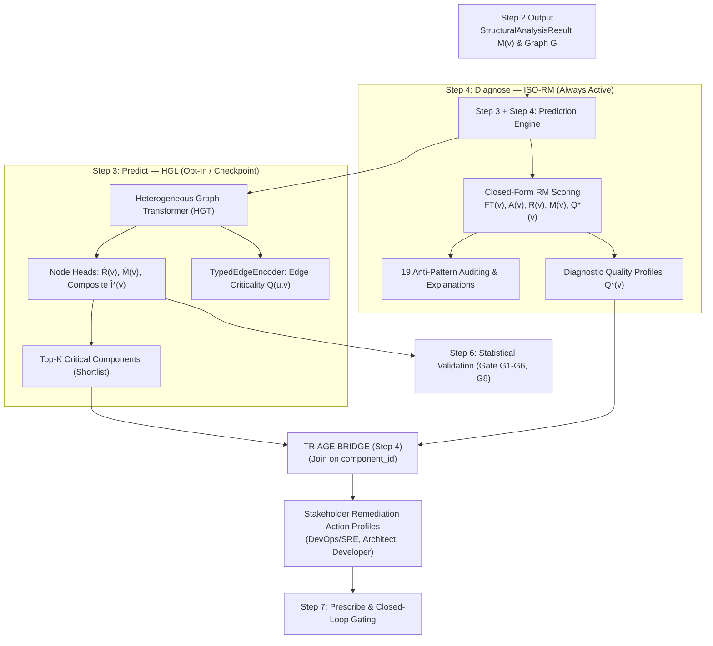

# Step 4: Diagnose — Deterministic ISO-RM Root-Cause Attribution & Triage Bridge

**Attribute architectural component criticality through deterministic ISO/IEC 25010/25019 quality attribution, detect 19 structural anti-patterns, generate natural-language explanations, and — via the Triage Bridge — connect this root-cause profile to Step 3's high-risk ranking to map it to stakeholder-oriented remediations.**

← [Step 3: Predict](prediction.md) | → [Step 5: Simulate](failure-simulation.md)

---

## Table of Contents

1. [Overview & Dual-Pathway Architecture](#1-overview--dual-pathway-architecture)
2. [Pathway A: Deterministic Diagnostic Quality Attribution (ISO-RM)](#2-pathway-a-deterministic-diagnostic-quality-attribution-iso-rm)
   - 2.1 [Theoretical Grounding (ISO/IEC 25010 & 25019)](#21-theoretical-grounding-isoiec-25010--25019)
   - 2.2 [The Declared RM Composite](#22-the-declared-rm-composite)
   - 2.3 [Anti-Pattern Auditing & Explanations](#23-anti-pattern-auditing--explanations)
3. [The Triage Bridge & Stakeholder-Oriented Root-Cause Attribution](#3-the-triage-bridge--stakeholder-oriented-root-cause-attribution)
   - 3.1 [Bridging Quantitative Blast Radius with Qualitative Root Cause](#31-bridging-quantitative-blast-radius-with-qualitative-root-cause)
   - 3.2 [Stakeholder Role Taxonomy](#32-stakeholder-role-taxonomy)
   - 3.3 [Triage Workflow & Data Contracts](#33-triage-workflow--data-contracts)
4. [Zero-GNN Cold-Start Independence](#4-zero-gnn-cold-start-independence)
5. [CLI Reference & Commands](#5-cli-reference--commands)
6. [Output Schema & Sample JSON](#6-output-schema--sample-json)
7. [Programmatic Python SDK & Use Cases](#7-programmatic-python-sdk--use-cases)
   - 7.1 [Pipeline Integration](#71-pipeline-integration)
   - 7.2 [Direct Use Case Execution (`saag.usecases`)](#72-direct-use-case-execution-saagusecases)
8. [What Comes Next](#8-what-comes-next)

---

## 1. Overview & Dual-Pathway Architecture

Steps 3 and 4 together are the **core analytical and predictive engine** of the Software-as-a-Graph (SaG) framework, split into two deliberately separate stages rather than forcing a single model to act simultaneously as a statistical estimator and an explainable standards compliance checker. This document covers **Step 4 (Diagnose)** — the deterministic root-cause engine and the Triage Bridge; see [prediction.md](prediction.md) for **Step 3 (Predict)** — the learned ranking engine.



### Key Architectural Invariants
1. **Parameter Independence**: Pathway A (Step 4, this document) and Pathway B (Step 3) share no learned weights; neither is fitted to the other's output.
2. **Offline Oracle Separation**: Simulation (Step 5) is never a Step 4 input — Pathway A operates deterministically on structural metrics and declared QoS topology, with zero ML or simulation runtime access.
3. **No Hallucination in Root-Cause Attribution**: The Triage Bridge joins quantitative rankings to qualitative RM diagnostics strictly by component ID, preventing neural models from guessing unverified architectural root causes.

> The JSS manuscript's Figure 1 calls these **Pathway B** (predictive/learned ranking) and **Pathway A** (explanation/deterministic ISO-RM). Those labels name the two *methods*, which is not quite the same cut as the two *stages*: Step 3 always computes the RM composite — Pathway A's own math — as the GNN's input feature and its zero-checkpoint fallback, so a cold-start Step 3 emits a pure Pathway A ranking.

---

## 2. Pathway A: Deterministic Diagnostic Quality Attribution (ISO-RM)

Pathway A provides deterministic, closed-form architectural quality attribution grounded in established software engineering standards.

### 2.1 Theoretical Grounding (ISO/IEC 25010 & 25019)
Criticality is formulated as a **Quality-in-Use** construct (ISO/IEC 25019:2023): the extent to which component degradation impairs system stakeholders from achieving their operational goals. It decomposes into two primary ISO/IEC 25010:2023 characteristics evaluated over the derived dependency multigraph $G_{\text{analysis}}$:

- **Reliability ($R$)**: Hierarchically combines:
  - **Fault Tolerance ($FT$)**: Cascading failure propagation depth, fan-out reach ($FOC$), and Multi-Path Coupling Index ($MPCI$).
  - **Availability ($A$)**: Topological single points of failure ($AP_c^{\text{dir}}$), bridge ratios ($BR$), and connectivity degradation ($CDI$).
- **Maintainability ($M$)**: Resistance to safe modification, code complexity penalty ($CQP$), and structural coupling ($PC$).

*(Note: Vulnerability/Security was formally retired because no fault-model instrument could validate it by construction; see [criticality.md](criticality.md) for full rationale).*

### 2.2 The Declared RM Composite
The composite score is algebraically derived from the retired 4-D model by dropping Vulnerability and renormalizing:

$$R(v) = 0.36 \cdot FT(v) + 0.64 \cdot A(v)$$

$$Q^*(v) = 0.80 \cdot R(v) + 0.20 \cdot M(v)$$

Scores are classified into 5 adaptive tiers using box-plot fences calculated over the system's score distribution: **CRITICAL** ($> Q_3 + 1.5 \cdot IQR$), **HIGH** ($> Q_3$), **MEDIUM** ($> Q_2$), **LOW** ($> Q_1$), and **MINIMAL** ($\le Q_1$).

### 2.3 Anti-Pattern Auditing & Explanations
Pathway A audits computed RM metrics against a formal catalog of **19 structural anti-patterns** (5 CRITICAL, 5 HIGH, 9 MEDIUM; see [antipatterns.md](antipatterns.md)) and generates human-readable explanations via `ExplanationEngine`.

---

## 3. The Triage Bridge & Stakeholder-Oriented Root-Cause Attribution

### 3.1 Bridging Quantitative Blast Radius with Qualitative Root Cause
High-throughput predictive models (Step 3) excel at isolating *which* components will cause the largest blast radius ($\hat{I}^*$), but neural embeddings cannot articulate *why* a component failed or *what* remediation an engineer should apply.

The **Triage Bridge** (`saag.analysis.triage.triage()` / `TriageUseCase`) solves this by filtering the system population down to the Top-$K$ (typically 5–15%) highest-risk components and joining each component ID with Pathway A's deterministic root-cause profile:

```
Top-K Shortlist (Step 3) ──► Join on component_id ◄── RM CriticalityProfile (Step 4)
                                          │
                                          ▼
                            Structured TriageEntry:
                            • Component ID & Rank
                            • Quantitative Score (GNN Î* or RM Q*)
                            • Elevated RM Dimensions (FT, A, M)
                            • Detected Anti-Pattern Signature
                            • Stakeholder Role Routing
```

### 3.2 Stakeholder Role Taxonomy
Triage entries map prioritized remediation actions to distinct engineering roles:

| Stakeholder Role | Key Responsibility | Targeted Anti-Patterns & Metrics | Primary Remediation Action |
|:---|:---|:---|:---|
| **DevOps / SRE** | Infrastructure locality & resilience | `SPOF`, `BROKER_OVERLOAD`, $AP_c^{\text{dir}}$, host co-location | Host anti-affinity rules, container migration, broker replication |
| **System Architect** | Pub-sub topology & transport contracts | `GOD_COMPONENT`, `FAILURE_HUB`, `CYCLE`, `DEEP_PIPELINE`, $CDI$ | Topic splitting, pub-sub decoupling, transport QoS contract upgrades |
| **Software Developer** | Internal code modularity & coupling | `CYCLIC_DEPENDENCY`, High $CQP$, High $MPCI$, High $PC$ | Code complexity refactoring, coupling reduction, dead dependency cleanup |

### 3.3 Triage Workflow & Data Contracts
The Triage Bridge produces a `TriageResult` containing `TriageEntry` items. In the REST API (`POST /api/v1/graph/prediction/triage`), `triage_presenter.py` categorizes these entries into structured stakeholder buckets (`devops_sre`, `architect`, `developer`).

---

## 4. Zero-GNN Cold-Start Independence

Step 4 needs no GNN checkpoint at all: `Client.diagnose()` runs standalone off Step 2's (Analyze) output, computing its own RM pass via `DiagnosticUseCase` when Step 3 (Predict) was not run in the same invocation. When Step 3 *was* run, Step 4 reuses its RM pass (Step 3 always computes RM as its own input feature and fallback) rather than recomputing it. Either way the Triage Bridge falls back to ranking by RM $Q^*(v)$ when no GNN checkpoint produced a Pathway B ranking — see [prediction.md §2.3](prediction.md#23-zero-gnn-cold-start-fallback).

---

## 5. CLI Reference & Commands

```bash
# Step 4 on its own — RM scoring + anti-patterns + Triage bridge, no GNN checkpoint required
PYTHONPATH=. python cli/diagnose_graph.py --layer system --triage-k 10

# AHP-weighted RM composite, grouped by stakeholder role
PYTHONPATH=. python cli/diagnose_graph.py --layer system --use-ahp --triage-k 10 --by-stakeholder

# CI/CD gate: only CRITICAL patterns block (exit 2); MEDIUM warns (exit 1); clean is 0
PYTHONPATH=. python cli/diagnose_graph.py --layer system --severity critical --output-antipatterns output/antipatterns.json
```

Step 4 is also bundled by default into `predict_graph.py` (Step 3) for backward compatibility with its pre-split behaviour — see [prediction.md §7](prediction.md#7-cli-reference--commands).

---

## 6. Output Schema & Sample JSON

Running `python cli/diagnose_graph.py --triage-k 5 --output output/diagnosis.json` produces:

```json
{
  "layers": {
    "system": {
      "total_components": 35,
      "rm": {
        "NavLib": {
          "overall": 0.54,
          "reliability": 0.63,
          "maintainability": 0.41,
          "fault_tolerance": 0.59,
          "availability": 0.58,
          "is_spof": true
        }
      },
      "antipatterns": [
        {
          "entity_id": "NavLib",
          "entity_type": "Component",
          "name": "Single Point of Failure (SPOF)",
          "severity": "CRITICAL",
          "category": "Availability",
          "description": "NavLib is a directed cut vertex. Removing it partitions the dependency graph.",
          "recommendation": "Introduce redundancy: deploy backup instances or redundant routing paths.",
          "evidence": { "is_articulation_point": true, "availability_score": 0.58 }
        }
      ],
      "triage": {
        "layer": "system",
        "k": 5,
        "ranking_source": "rm",
        "population": 35,
        "entries": [
          {
            "component_id": "NavLib",
            "rank": 1,
            "ranking_score": 0.54,
            "component_type": "Library",
            "pattern": "Single Point of Failure (SPOF)",
            "level": "CRITICAL",
            "priority_action": "Introduce redundancy: deploy backup instances or redundant routing paths.",
            "roles": ["DevOps", "Architect"],
            "elevated_dimensions": ["Availability", "Fault Tolerance"]
          }
        ]
      }
    }
  }
}
```

`ranking_source` is `"rm"` here (no GNN checkpoint) — when the same diagnosis is run against a Step 3 result that had a checkpoint, it reads `"gnn"` instead, and `rm` carries the same dimension scores either way since the root-cause substrate is always Pathway A's, never the GNN's. See [prediction.md §8](prediction.md#8-output-schema--sample-json) for the schema Step 3 (with Step 4 bundled) produces, which additionally carries a `gnn` block.

---

## 7. Programmatic Python SDK & Use Cases

### 7.1 Pipeline Integration

The high-level `Pipeline` builder configures and executes Step 4 (Diagnose) standalone (zero-GNN cold start) or chained after Step 3 (Predict):

```python
import saag

# Cold start — Step 4 alone, no GNN checkpoint
result = (
    saag.Pipeline.from_json("data/system.json", clear=True)
        .analyze(layer="system")
        .diagnose(k=10)   # Step 4: RM + Triage Bridge (Top-10)
        .run()
)

# Chained after Step 3
result = (
    saag.Pipeline.from_json("data/system.json", clear=True)
        .analyze(layer="system")
        .simulate(layer="system", mode="exhaustive")  # offline ground truth for Step 3's checkpoint
        .predict()        # Step 3: GNN ranking (or RM fallback)
        .diagnose(k=10)    # Step 4: RM + Triage Bridge, reuses Step 3's RM pass
        .validate()
        .prescribe()
        .run()
)

# Inspect Triage Bridge output
if result.diagnosis and result.diagnosis.triage:
    triage_res = result.diagnosis.triage
    print(f"Triage Source: {triage_res.ranking_source}, Evaluated: {triage_res.population} nodes")
    for entry in triage_res.entries:
        print(f"Rank #{entry.rank}: {entry.component_id} ({entry.level}) -> Action: {entry.priority_action}")
        print(f"  Stakeholder Roles: {', '.join(entry.roles)}")
```

### 7.2 Direct Use Case Execution (`saag.usecases`)

For fine-grained, decoupled execution without database dependencies:

```python
from saag.usecases import DiagnosticUseCase, TriageUseCase

# Pathway A: Diagnostic Quality Attribution
diag_uc = DiagnosticUseCase()
quality, problems, summary, explanation = diag_uc.execute(structural_result=struct_result)

# Triage Bridge: Scoping Diagnosis to Top-K Risks
triage_uc = TriageUseCase()
triage_result = triage_uc.execute(prediction_result=quality, k=10)
```

See [prediction.md §6.2](prediction.md#62-direct-use-case-execution-saagusecases) for `PredictiveUseCase` (Step 3).

---

## 8. What Comes Next

- **For Simulation & Validation**: Proceed to **[Step 5: Simulate](failure-simulation.md)** and **[Step 6: Validate](validation.md)** to statistically evaluate Step 3's predicted scores against discrete-event failure injection.
- **For Remediation**: **[Step 7: Prescribe](prescription.md)** compiles verified refactoring blueprints from this stage's anti-pattern and Triage output.
- **For the ranking this stage's Triage Bridge scopes to**: see **[Step 3: Predict](prediction.md)**.

---

← [Step 3: Predict](prediction.md) | → [Step 5: Simulate](failure-simulation.md)
