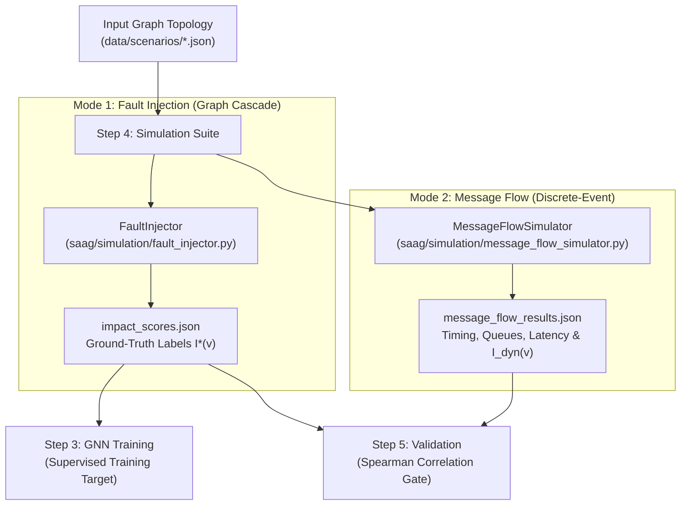
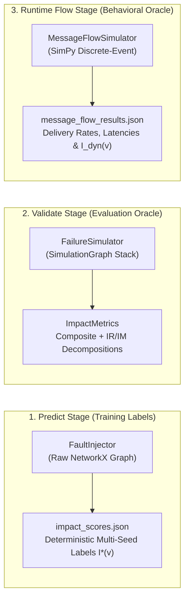
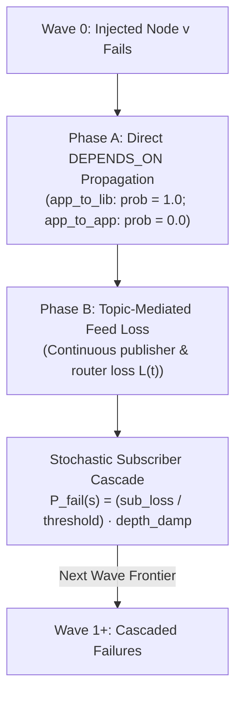
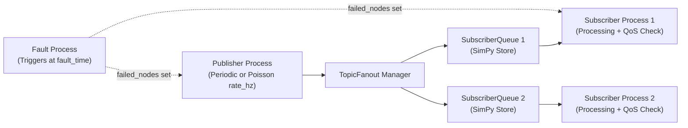

# Step 4: Simulate — Failure Simulation

**Generates simulation-derived ground-truth impact $I(v)$ to train and validate predicted architectural criticality $Q(v)$, using discrete-event and graph cascade failure engines.**

← [Step 3: Predict](prediction.md) | → [Step 5: Validate](validation.md)

---

## Table of Contents

1. [Overview & Simulation Philosophy](#1-overview--simulation-philosophy)
2. [Simulation Architecture & Engine Taxonomy](#2-simulation-architecture--engine-taxonomy)
   - 2.1 [Canonical Engine Roles & Responsibilities](#21-canonical-engine-roles--responsibilities)
3. [Mode 1: Fault Injection (`FaultInjector`)](#3-mode-1-fault-injection-faultinjector)
   - 3.1 [Dynamic Dependency Derivation](#31-dynamic-dependency-derivation)
   - 3.2 [Wave-Based Cascade Algorithm](#32-wave-based-cascade-algorithm)
   - 3.3 [Ground-Truth Impact Formulations ($I(v)$ vs. $I^*(v)$)](#33-ground-truth-impact-formulations-iv-vs-iv)
   - 3.4 [Cascade Thresholds & Multi-Broker Semantics](#34-cascade-thresholds--multi-broker-semantics)
   - 3.5 [Multi-Seed Stability & The `label_stability` Block](#35-multi-seed-stability--the-label_stability-block)
4. [Mode 2: Message Flow Simulation (`MessageFlowSimulator`)](#4-mode-2-message-flow-simulation-messageflowsimulator)
   - 4.1 [Discrete-Event SimPy Process Model](#41-discrete-event-simpy-process-model)
   - 4.2 [Two-Level Fan-Out Queue Architecture](#42-two-level-fan-out-queue-architecture)
   - 4.3 [Runtime QoS Contract Enforcement](#43-runtime-qos-contract-enforcement)
   - 4.4 [Dynamic Behavioral Oracle ($I_{\text{dyn}}(v)$)](#44-dynamic-behavioral-oracle-i_textdynv)
5. [Quality Model Alignment & Construct Grounding](#5-quality-model-alignment--construct-grounding)
6. [Worked Example: Air Traffic Management (ATM) Scenario](#6-worked-example-air-traffic-management-atm-scenario)
7. [CLI Reference (`cli/simulate_graph.py`)](#7-cli-reference-clisimulate_graphpy)
   - 7.1 [Shared Arguments](#71-shared-arguments)
   - 7.2 [`fault-inject` Subcommand](#72-fault-inject-subcommand)
   - 7.3 [`message-flow` Subcommand](#73-message-flow-subcommand)
   - 7.4 [`combined` Subcommand](#74-combined-subcommand)
8. [Output Schemas (`impact_scores.json` & `message_flow_results.json`)](#8-output-schemas-impact_scoresjson--message_flow_resultsjson)
9. [Python API Usage](#9-python-api-usage)
10. [Known Limitations & Design Boundaries](#10-known-limitations--design-boundaries)
11. [What Comes Next](#11-what-comes-next)

---

## 1. Overview & Simulation Philosophy

The Software-as-a-Graph (SaaG) framework predicts architectural component criticality **prior to deployment** using topological graph metrics ($Q(v)$). Because real runtime failure logs do not exist pre-deployment, the framework generates objective ground-truth impact labels ($I(v)$) through **pre-deployment failure simulations**.



> [!IMPORTANT]
> **Pre-Deployment Guarantee**: All simulation modes operate strictly on the static architectural graph schema, ensuring that predictions remain completely independent of post-deployment runtime monitoring agents.

---

## 2. Simulation Architecture & Engine Taxonomy

The `saag/simulation/` package provides specialized simulation engines tailored for distinct pipeline stages:



### 2.1 Canonical Engine Roles & Responsibilities

| Engine | Canonical Scope | Primary Output | Consumed By |
|:---|:---|:---|:---|
| **`FaultInjector`** | **Predict Stage** (Supervised labels) | `impact_scores.json` $\to I^*(v)$ scalar | GNN training (`cli/train_graph.py`), $k$-fold & LOSO evaluations |
| **`FailureSimulator`** | **Validate Stage** (Quality oracle) | `ImpactMetrics` $\to$ Composite + $IR/IM$ sub-metrics | Validation gates (`saag/validation/service.py`) |
| **`MessageFlowSimulator`** | **Dynamic Runtime Flow** (Behavioral oracle) | `message_flow_results.json` $\to I_{\text{dyn}}(v)$ | Convergent validity analysis (`reproduce/convergent_validity.py`) |

> [!CAUTION]
> **Never mix engines within the same stage**: `FaultInjector` outputs variance-tracked training labels; `FailureSimulator` provides multi-dimensional RM decompositions. They are maintained separately by contract ([`tests/test_groundtruth_contract.py`](../tests/test_groundtruth_contract.py)).

---

## 3. Mode 1: Fault Injection (`FaultInjector`)

### 3.1 Dynamic Dependency Derivation

Before running failure cascades, `FaultInjector` builds an $O(1)$ pub-sub index and automatically derives missing `DEPENDS_ON` edges:
1. **App-to-App (`app_to_app`)**: If Application $A_{\text{sub}}$ subscribes to Topic $T$ published by Application $A_{\text{pub}}$, a dependency $A_{\text{sub}} \xrightarrow{\text{DEPENDS\_ON}} A_{\text{pub}}$ is derived with inherited QoS attributes.
2. **App-to-Library (`app_to_lib`)**: If Application $A$ uses Library $L$ (via `USES`), a dependency $A \xrightarrow{\text{DEPENDS\_ON}} L$ is derived with `weight = 1.0`.

### 3.2 Wave-Based Cascade Algorithm

Failure propagation executes in iterative breadth-first waves ($W_0, W_1, W_2, \dots$), starting with the injected candidate node $v \in W_0$:



#### Phase A: Direct Dependency Propagation
- If an edge $(u, v_{\text{failed}})$ is typed `app_to_lib`, dependent $u$ fails deterministically ($\text{prob} = 1.0$).
- `app_to_app` dependencies are resolved via pub-sub feed loss in Phase B ($\text{prob} = 0.0$ in Phase A).

#### Phase B: Continuous Topic Feed Loss & Subscriber Cascaing
1. **Topic Feed Loss ($L(t) \in [0, 1]$)**:
   - For topics with publishers:
     $$L(t) = \min\left(1.0, \; \frac{\sum_{p \in \text{failed}(t)} \text{rate}(p, t)}{\sum_{p \in \text{all}(t)} \text{rate}(p, t)} \times \text{QoS\_factor}(t)\right)$$
   - For topics routed solely by brokers:
     $$L(t) = \min\left(1.0, \; \frac{|\text{failed\_routers}(t)|}{|\text{all\_routers}(t)|} \times \text{QoS\_factor}(t)\right)$$
2. **Average Subscriber Feed Loss ($\text{sub\_loss}(s)$)**:
   $$\text{sub\_loss}(s) = \frac{\sum_{t \in \text{subs}(s)} L(t)}{|\text{subs}(s)|}$$
3. **Stochastic Cascade Probability ($P_{\text{fail}}(s)$)**:
   If $\text{sub\_loss}(s) \ge \text{propagation\_threshold}$:
   $$P_{\text{fail}}(s) = \min\left(1.0, \; \frac{\text{sub\_loss}(s)}{\text{propagation\_threshold}}\right) \times \text{depth\_damp}$$
   $$\text{depth\_damp} = \max(0.25, \; 1.0 - \text{wave\_idx} \times 0.15)$$

---

### 3.3 Ground-Truth Impact Formulations ($I(v)$ vs. $I^*(v)$)

1. **`FaultInjector` Scalar Impact ($I(v)$)**:
   $$I(v) = \frac{\sum_{s \in \text{all\_subscribers}} \text{sub\_loss}(s)}{|\text{all\_subscribers}|}$$
2. **`FailureSimulator` Composite Impact ($I^*(v)$)**:
   $$I^*(v) = 0.35 \cdot \text{reachability\_loss} + 0.25 \cdot \text{fragmentation} + 0.25 \cdot \text{throughput\_loss} + 0.15 \cdot \text{flow\_disruption}$$
   *(All terms are weighted by QoS message severity $s(t) = w(t) \cdot \text{rate}(t)$).*

---

### 3.4 Cascade Thresholds & Multi-Broker Semantics

- **Propagation Threshold (`--propagation-threshold`)**: Controls cascade sensitivity:
  - `0.2` (Default): Aggressive; subscriber cascades when losing $\ge 20\%$ of average feed.
  - `0.5`: Moderate; models multi-input dependencies (e.g., ATM `ConflictDetector` requiring both radar and track feeds).
  - `1.0`: Conservative; subscriber only cascades upon 100% total feed starvation.
- **Multi-Broker Redundancy**: If a topic is routed across $k$ redundant brokers, failing 1 broker results in continuous loss $L(t) = 1/k$, preventing unrealistic binary all-or-nothing drops.

---

### 3.5 Multi-Seed Stability & The `label_stability` Block

Cascade evaluation is executed across $N$ seeds (default: $\{42, 123, 456, 789, 2024\}$). The mean impact $\overline{I(v)}$ and standard deviation $\sigma(v)$ are recorded alongside a dataset-wide stability block:

```json
"label_stability": {
  "n_seeds": 5,
  "n_nodes": 39,
  "k_frac": 0.20,
  "mean_std": 0.0267,
  "max_std": 0.1856,
  "test_retest_spearman": 0.9802,
  "topk_jaccard": 0.6250
}
```

- **`test_retest_spearman`**: The minimum pairwise rank correlation across all seed pairs (establishes the theoretical correlation ceiling for $Q(v)$).
- **`topk_jaccard`**: The minimum pairwise overlap of top-$K$ critical components across seeds.

---

## 4. Mode 2: Message Flow Simulation (`MessageFlowSimulator`)

### 4.1 Discrete-Event SimPy Process Model

Built on **SimPy**, this engine models runtime message exchanges, queue occupancies, and timing latencies:



### 4.2 Two-Level Fan-Out Queue Architecture

To preserve true pub-sub semantics, `TopicFanout` maintains private `SubscriberQueue` instances for each subscriber, preventing first-come-first-served queue contention.

System delivery rate is normalized by total subscriber demand:

$$\text{Delivery Rate} = \frac{\text{Total Messages Delivered}}{\sum_{t \in \text{Topics}} (\text{Published}(t) \times \text{Subscribers}(t))}$$

### 4.3 Runtime QoS Contract Enforcement

| QoS Policy | Enforcement Mechanism in Simulation |
|:---|:---|
| **Reliability (`RELIABLE`)** | Queue overflow triggers **head-drop** (drops oldest sample to retain fresh data, matching DDS `KEEP_LAST`). |
| **Reliability (`BEST_EFFORT`)** | Queue overflow triggers **tail-drop** (incoming sample is dropped). |
| **Deadline (`deadline_ms`)** | End-to-end check: $(\text{time}_{\text{processed}} - \text{time}_{\text{created}}) > \text{deadline} \to \text{Violation}$. |
| **Lifespan (`lifespan_ms`)** | Expired samples are silently discarded upon dequeue. |

### 4.4 Dynamic Behavioral Oracle ($I_{\text{dyn}}(v)$)

$I_{\text{dyn}}(v)$ measures the empirical delivery loss inflicted on **surviving** components:

$$I_{\text{dyn}}(v) = \text{DeliveryRate}_{\text{pre-fault}} - \text{DeliveryRate}_{\text{post-fault}}$$

*(Computed with surviving node receipts in the numerator and continuous demand in the denominator, achieving mean $\rho(I_{\text{dyn}}, I^*) = 0.765$ across the scenario cohort).*

---

## 5. Quality Model Alignment & Construct Grounding

The simulation suite maps observed metrics to ISO/IEC 25010 & 25019 quality constructs:

| Quality Characteristic | Observed Simulation Attribute | Metric / Artifact Source |
|:---|:---|:---|
| **Effectiveness** (Availability & Fault Tolerance) | Message delivery rates & partition sizes | `FaultEventRecord.delivery_rate_after`, `ImpactMetrics.reachability_loss` |
| **Efficiency** (Time Behavior & Capacity) | End-to-end latency percentiles & buffer drops | `latency_p50_after`, `latency_p95_after`, `total_queue_overflows` |
| **Freedom from Risk** (Contract Integrity) | QoS deadline & lifespan violations | `total_dropped_deadline`, `deadline_violations_per_topic` |

---

## 6. Worked Example: Air Traffic Management (ATM) Scenario

```
RadarTracker ──PUBLISHES_TO──▶ T_radar   ──SUBSCRIBES_TO──▶ ConflictDetector
             ──PUBLISHES_TO──▶ T_tracks  ──SUBSCRIBES_TO──▶ ConflictDetector, ATCWorkstation, FlightDataProcessor

FlightDataProcessor ──PUBLISHES_TO──▶ T_fpa ──SUBSCRIBES_TO──▶ ATCWorkstation
ConflictDetector    ──PUBLISHES_TO──▶ T_conflicts ──SUBSCRIBES_TO──▶ ATCWorkstation
ASTERIX_Broker      ──ROUTES────────▶ All Topics
```

### Simulated Fault Impact Ranking

| Component | $I(v)$ | Cascade Depth | Architectural Rationale |
|:---|:---:|:---:|:---|
| `RadarTracker` | **1.000** | 1 | Sole producer of `T_radar` and `T_tracks`; starves `ConflictDetector` and `FlightDataProcessor`, triggering full cascade to `ATCWorkstation`. |
| `ASTERIX_Broker`| **1.000** | 1 | Sole routing broker for all system topics; partitions the entire graph. |
| `ConflictDetector`| **0.111** | 0 | Orphans `T_conflicts` only; `ATCWorkstation` loses 1 of 3 input feeds. |
| `FlightDataProcessor`| **0.111** | 0 | Orphans `T_fpa` only; `ATCWorkstation` loses 1 of 3 input feeds. |
| `ATCWorkstation`| **0.000** | 0 | Pure leaf consumer; failure inflicts zero downstream impact. |

---

## 7. CLI Reference (`cli/simulate_graph.py`)

### 7.1 Shared Arguments

```bash
--input PATH      # Path to scenario JSON (or use --layer <name>)
--output DIR      # Output directory (default: output/simulation/)
--export-json     # Write full JSON and summary text reports
--verbose / -v    # Enable debug logging
```

### 7.2 `fault-inject` Subcommand

```bash
# Full multi-seed cascade simulation
PYTHONPATH=. python cli/simulate_graph.py fault-inject \
    --input data/scenarios/atm_system.json \
    --seeds 42,123,456,789,2024 \
    --propagation-threshold 0.2 \
    --qos-factor ladder \
    --export-json
```

### 7.3 `message-flow` Subcommand

```bash
# Inject broker fault at midpoint (t = 150s)
PYTHONPATH=. python cli/simulate_graph.py message-flow \
    --input data/scenarios/atm_system.json \
    --duration 300 \
    --fault-node ASTERIX_Broker \
    --fault-time 150 \
    --export-json
```

### 7.4 `combined` Subcommand

```bash
# Run both cascade fault injection and message-flow sequentially
PYTHONPATH=. python cli/simulate_graph.py combined \
    --input data/scenarios/atm_system.json \
    --seeds 42,123,456,789,2024 \
    --node-types Application,Broker,Library \
    --duration 300 --fault-node ASTERIX_Broker \
    --export-json
```

---

## 8. Output Schemas (`impact_scores.json` & `message_flow_results.json`)

### 8.1 `impact_scores.json` (Fault Injection Ground Truth)

```json
{
  "schema_version": "2.1",
  "graph_id": "atm_system",
  "labeler": "FaultInjector",
  "labeled_node_types": ["Application", "Broker", "Library"],
  "labeled_dimensions": ["composite", "reliability"],
  "unlabeled_node_ids": ["N0", "N1", "N2"],
  "label_stability": {
    "n_seeds": 5,
    "test_retest_spearman": 0.9802,
    "topk_jaccard": 0.6250
  },
  "top_k_by_impact": [
    {
      "rank": 1,
      "node_id": "RadarTracker",
      "node_type": "Application",
      "impact_score": 1.0,
      "cascade_depth": 1,
      "orphaned_topics": 4,
      "impacted_subscribers": 3,
      "impact_score_std": 0.0
    }
  ]
}
```

### 8.2 `message_flow_results.json` (Dynamic Discrete-Event Results)

```json
{
  "schema_version": "2.0",
  "graph_id": "atm_system",
  "simulation_duration": 300.0,
  "system_delivery_rate": 0.9975,
  "fault_event": {
    "fault_time": 150.0,
    "faulted_node_id": "ConflictDetector",
    "delivery_rate_before": 0.9977,
    "delivery_rate_after": 0.9962,
    "latency_p50_before": 2.1,
    "latency_p50_after": 8.7
  }
}
```

---

## 9. Python API Usage

### 9.1 Running `FaultInjector` Programmatically

```python
import networkx as nx
from pathlib import Path
from saag.simulation.fault_injector import FaultInjector

# Initialize injector with multi-seed configuration
injector = FaultInjector(
    graph=graph,
    seeds=[42, 123, 456, 789, 2024],
    propagation_threshold=0.2,
    qos_factor_mode="ladder"
)

# Run simulation on eligible architectural node types
result = injector.run(node_types=["Application", "Broker", "Library"])
result.save(Path("output/simulation/impact_scores.json"))

print(f"Top Critical: {result.top_k_by_impact[0]['node_id']} "
      f"(I = {result.top_k_by_impact[0]['impact_score']:.4f})")
```

### 9.2 Running `MessageFlowSimulator` Programmatically

```python
from pathlib import Path
from saag.simulation.message_flow_simulator import MessageFlowSimulator

sim = MessageFlowSimulator(
    graph=graph,
    duration=300.0,
    fault_node="ConflictDetector",
    fault_time=150.0,
    seed=42
)

result = sim.run()
result.save(Path("output/simulation/message_flow_results.json"))

if result.fault_event:
    print(f"Delivery Drop: {result.fault_event.delivery_rate_before:.4f} -> "
          f"{result.fault_event.delivery_rate_after:.4f}")
```

---

## 10. Known Limitations & Design Boundaries

| # | Boundary / Limitation | Methodological Scope & Handling |
|:---|:---|:---|
| **L1** | **Unmodelled Topic/Node Direct Failures** | Cascade derives `DEPENDS_ON` from pub/sub and `USES`; physical host and raw topic failures are listed in `unlabeled_node_ids`. |
| **L2** | **Unmeasured Maintainability Dimension** | `FaultInjector` measures operational cascade reach ($IR$ / composite). Maintainability ground truth is supplied by `FailureSimulator` in Step 5. |
| **L3** | **Single Fault per Simulation** | Simulators evaluate one component failure per run; multi-failure cascades model cascading effects rather than concurrent disjoint failures. |
| **L4** | **Discrete-Event Latency Saturation** | In low-utilization scenarios (~1 Hz), queue build-up is negligible. $I_{\text{dyn}}(v)$ uses empirical delivery rates rather than latency jitter. |
| **L5** | **Edge Ground Truth Scope** | Edge impact is evaluated via single-edge removal sweeps ($\Delta \text{Impact}$) with unmeasured edges marked `evaluated: false`. |

---

## 11. What Comes Next

Simulation ground-truth files (`impact_scores.json` and `message_flow_results.json`) are consumed downstream:
- **[Step 3: Predict](prediction.md)** trains GNN models on $I^*(v)$ labels.
- **[Step 5: Validate](validation.md)** executes statistical correlation gates (Spearman $\rho \ge 0.70$, $F_1\text{@top-}K$) to validate topological $Q(v)$ against simulated impact.

---

← [Step 3: Predict](prediction.md) | → [Step 5: Validate](validation.md)