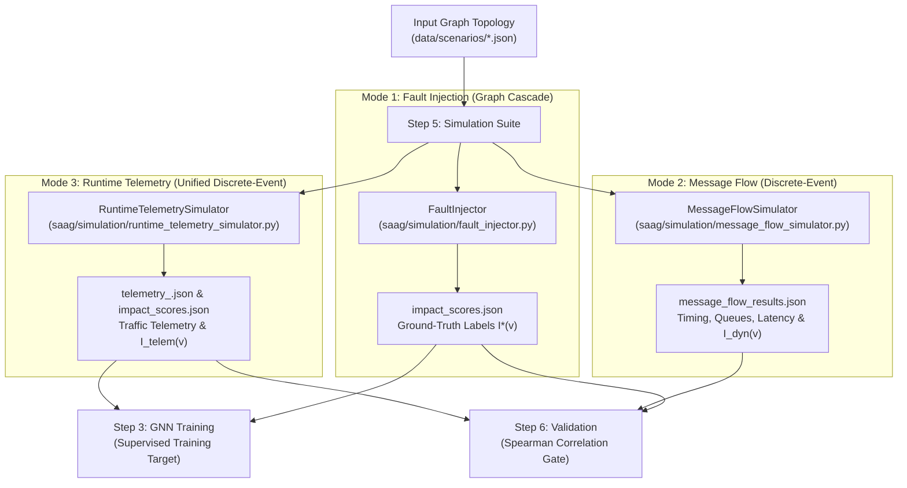
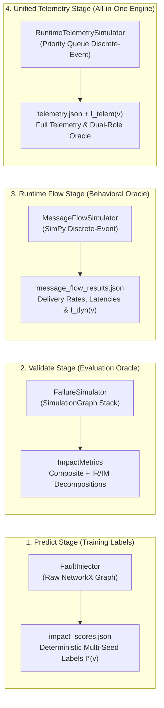
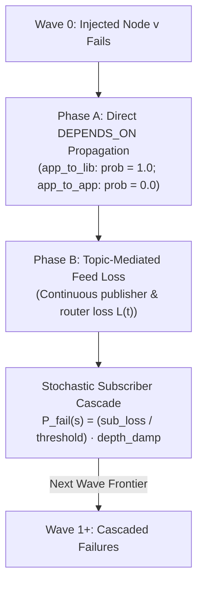
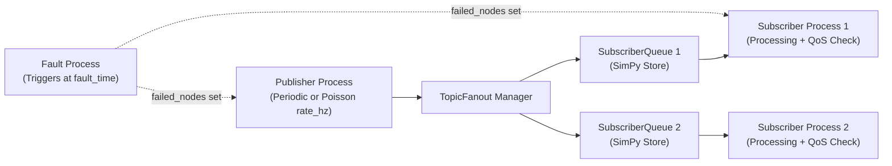
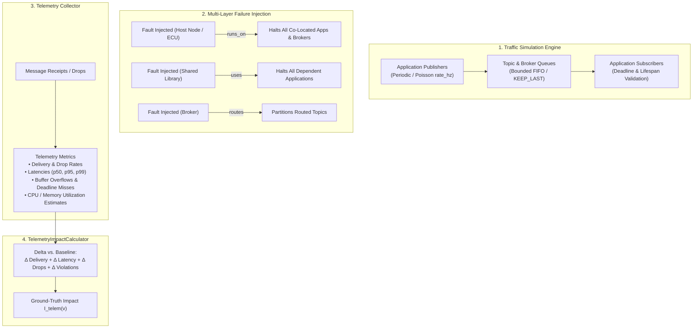

# Step 5: Simulate — Failure Simulation

**Generates simulation-derived ground-truth impact $I(v)$ to train and validate predicted architectural criticality $Q(v)$, using discrete-event and graph cascade failure engines.**

← [Step 4: Diagnose](diagnosis.md) | → [Step 6: Validate](validation.md)

---

## Table of Contents

1. [Overview & Simulation Philosophy](#1-overview--simulation-philosophy)
2. [Simulation Architecture & Engine Taxonomy](#2-simulation-architecture--engine-taxonomy)
   - 2.1 [Canonical Engine Roles & Responsibilities](#21-canonical-engine-roles--responsibilities)
3. [Mode 1: Fault Injection (`FaultInjector`)](#3-mode-1-fault-injection-faultinjector)
   - 3.1 [Dynamic Dependency Derivation](#31-dynamic-dependency-derivation)
   - 3.2 [Wave-Based Cascade Algorithm](#32-wave-based-cascade-algorithm)
   - 3.3 [Ground-Truth Impact Formulations ($I(v)$ vs. $I^*(v)$)](#33-ground-truth-impact-formulations-iv-vs-iv)
   - 3.4 [Cascade Thresholds & Multi-Broker Semantics](#34-cascade-thresholds--multi-broker-semantics)
   - 3.5 [Multi-Seed Stability & The `label_stability` Block](#35-multi-seed-stability--the-label_stability-block)
4. [Mode 2: Message Flow Simulation (`MessageFlowSimulator`)](#4-mode-2-message-flow-simulation-messageflowsimulator)
   - 4.1 [Discrete-Event SimPy Process Model](#41-discrete-event-simpy-process-model)
   - 4.2 [Two-Level Fan-Out Queue Architecture](#42-two-level-fan-out-queue-architecture)
   - 4.3 [Runtime QoS Contract Enforcement](#43-runtime-qos-contract-enforcement)
   - 4.4 [Dynamic Behavioral Oracle ($I_{\text{dyn}}(v)$)](#44-dynamic-behavioral-oracle-i_textdynv)
5. [Mode 3: Runtime Telemetry Simulation (`RuntimeTelemetrySimulator`)](#5-mode-3-runtime-telemetry-simulation-runtimetelemetrysimulator)
   - 5.1 [All-in-One Traffic & Telemetry Generation](#51-all-in-one-traffic--telemetry-generation)
   - 5.2 [Multi-Layer Failure Propagation & Queue Dynamics](#52-multi-layer-failure-propagation--queue-dynamics)
   - 5.3 [Telemetry Metrics & `TelemetryImpactCalculator` ($I_{\text{telem}}(v)$)](#53-telemetry-metrics--telemetryimpactcalculator-i_texttelemv)
   - 5.4 [Dual-Role Utility: GNN Ground-Truth Labeling & Prediction Validation](#54-dual-role-utility-gnn-ground-truth-labeling--prediction-validation)
6. [Quality Model Alignment & Construct Grounding](#6-quality-model-alignment--construct-grounding)
7. [Worked Examples: ATM & Autonomous Vehicle (AV)](#7-worked-examples-atm--autonomous-vehicle-av)
   - 7.1 [Air Traffic Management (ATM) Scenario](#71-air-traffic-management-atm-scenario)
   - 7.2 [Autonomous Vehicle (AV) Cyber-Physical System](#72-autonomous-vehicle-av-cyber-physical-system)
8. [CLI Reference (`cli/simulate_graph.py`)](#8-cli-reference-clisimulate_graphpy)
   - 8.1 [Shared Arguments](#81-shared-arguments)
   - 8.2 [`fault-inject` Subcommand](#82-fault-inject-subcommand)
   - 8.3 [`message-flow` Subcommand](#83-message-flow-subcommand)
   - 8.4 [`combined` Subcommand](#84-combined-subcommand)
   - 8.5 [`telemetry` Subcommand](#85-telemetry-subcommand)
9. [Output Schemas (`impact_scores.json`, `message_flow_results.json` & `telemetry_<node>.json`)](#9-output-schemas-impact_scoresjson-message_flow_resultsjson--telemetry_nodejson)
10. [Python API Usage](#10-python-api-usage)
    - 10.1 [Running `FaultInjector` Programmatically](#101-running-faultinjector-programmatically)
    - 10.2 [Running `MessageFlowSimulator` Programmatically](#102-running-messageflowsimulator-programmatically)
    - 10.3 [Running `RuntimeTelemetrySimulator` Programmatically](#103-running-runtimetelemetrysimulator-programmatically)
11. [Known Limitations & Design Boundaries](#11-known-limitations--design-boundaries)
12. [What Comes Next](#12-what-comes-next)

---

## 1. Overview & Simulation Philosophy

The Software-as-a-Graph (SaaG) framework predicts architectural component criticality **prior to deployment** using topological graph metrics ($Q(v)$). Because real runtime failure logs do not exist pre-deployment, the framework generates objective ground-truth impact labels ($I(v)$) through **pre-deployment failure simulations**.



> [!IMPORTANT]
> **Pre-Deployment Guarantee**: All simulation modes operate strictly on the static architectural graph schema, ensuring that predictions remain completely independent of post-deployment runtime monitoring agents.

---

## 2. Simulation Architecture & Engine Taxonomy

The `saag/simulation/` package provides specialized simulation engines tailored for distinct pipeline stages:



### 2.1 Canonical Engine Roles & Responsibilities

| Engine | Canonical Scope | Primary Output | Consumed By |
|:---|:---|:---|:---|
| **`FaultInjector`** | **Predict Stage** (Supervised labels) | `impact_scores.json` $\to I^*(v)$ scalar | GNN training (`cli/train_graph.py`), $k$-fold & LOSO evaluations |
| **`FailureSimulator`** | **Validate Stage** (Quality oracle) | `ImpactMetrics` $\to$ Composite + $IR/IM$ sub-metrics | Validation gates (`saag/validation/service.py`) |
| **`MessageFlowSimulator`** | **Dynamic Runtime Flow** (Behavioral oracle) | `message_flow_results.json` $\to I_{\text{dyn}}(v)$ | Convergent validity analysis (`reproduce/convergent_validity.py`) |
| **`RuntimeTelemetrySimulator`** | **Unified Cross-Layer Telemetry** (Dual-role oracle) | `telemetry_<node>.json` + `impact_scores.json` $\to I_{\text{telem}}(v)$ | GNN continuous supervised training, cross-layer failure analysis, and empirical prediction validation |

> [!CAUTION]
> **Never mix engines within the same stage**: `FaultInjector` outputs variance-tracked training labels; `FailureSimulator` provides multi-dimensional RM decompositions. They are maintained separately by contract ([`tests/test_groundtruth_contract.py`](../tests/test_groundtruth_contract.py)).

---

## 3. Mode 1: Fault Injection (`FaultInjector`)

### 3.1 Dynamic Dependency Derivation

Before running failure cascades, `FaultInjector` builds an $O(1)$ pub-sub index and automatically derives missing `DEPENDS_ON` edges:
1. **App-to-App (`app_to_app`)**: If Application $A_{\text{sub}}$ subscribes to Topic $T$ published by Application $A_{\text{pub}}$, a dependency $A_{\text{sub}} \xrightarrow{\text{DEPENDS\_ON}} A_{\text{pub}}$ is derived with inherited QoS attributes.
2. **App-to-Library (`app_to_lib`)**: If Application $A$ uses Library $L$ (via `USES`), a dependency $A \xrightarrow{\text{DEPENDS\_ON}} L$ is derived with `weight = 1.0`.

### 3.2 Wave-Based Cascade Algorithm

Failure propagation executes in iterative breadth-first waves ($W_0, W_1, W_2, \dots$), starting with the injected candidate node $v \in W_0$:



#### Phase A: Direct Dependency Propagation
- If an edge $(u, v_{\text{failed}})$ is typed `app_to_lib`, dependent $u$ fails deterministically ($\text{prob} = 1.0$).
- `app_to_app` dependencies are resolved via pub-sub feed loss in Phase B ($\text{prob} = 0.0$ in Phase A).

#### Phase B: Continuous Topic Feed Loss & Subscriber Cascaing
1. **Topic Feed Loss ($L(t) \in [0, 1]$)**:
   - For topics with publishers:
     $$L(t) = \min\left(1.0, \; \frac{\sum_{p \in \text{failed}(t)} \text{rate}(p, t)}{\sum_{p \in \text{all}(t)} \text{rate}(p, t)} \times \text{QoS\_factor}(t)\right)$$
   - For topics routed solely by brokers:
     $$L(t) = \min\left(1.0, \; \frac{|\text{failed\_routers}(t)|}{|\text{all\_routers}(t)|} \times \text{QoS\_factor}(t)\right)$$
2. **Average Subscriber Feed Loss ($\text{sub\_loss}(s)$)**:
   $$\text{sub\_loss}(s) = \frac{\sum_{t \in \text{subs}(s)} L(t)}{|\text{subs}(s)|}$$
3. **Stochastic Cascade Probability ($P_{\text{fail}}(s)$)**:
   If $\text{sub\_loss}(s) \ge \text{propagation\_threshold}$:
   $$P_{\text{fail}}(s) = \min\left(1.0, \; \frac{\text{sub\_loss}(s)}{\text{propagation\_threshold}}\right) \times \text{depth\_damp}$$
   $$\text{depth\_damp} = \max(0.25, \; 1.0 - \text{wave\_idx} \times 0.15)$$

---

### 3.3 Ground-Truth Impact Formulations ($I(v)$ vs. $I^*(v)$)

1. **`FaultInjector` Scalar Impact ($I(v)$)**:
   $$I(v) = \frac{\sum_{s \in \text{all\_subscribers}} \text{sub\_loss}(s)}{|\text{all\_subscribers}|}$$
2. **`FailureSimulator` Composite Impact ($I^*(v)$)**:
   $$I^*(v) = 0.35 \cdot \text{reachability\_loss} + 0.25 \cdot \text{fragmentation} + 0.25 \cdot \text{throughput\_loss} + 0.15 \cdot \text{flow\_disruption}$$
   *(All terms are weighted by QoS message severity $s(t) = w(t) \cdot \text{rate}(t)$).*

---

### 3.4 Cascade Thresholds & Multi-Broker Semantics

- **Propagation Threshold (`--propagation-threshold`)**: Controls cascade sensitivity:
  - `0.2` (Default): Aggressive; subscriber cascades when losing $\ge 20\%$ of average feed.
  - `0.5`: Moderate; models multi-input dependencies (e.g., ATM `ConflictDetector` requiring both radar and track feeds).
  - `1.0`: Conservative; subscriber only cascades upon 100% total feed starvation.
- **Multi-Broker Redundancy**: If a topic is routed across $k$ redundant brokers, failing 1 broker results in continuous loss $L(t) = 1/k$, preventing unrealistic binary all-or-nothing drops.

---

### 3.5 Multi-Seed Stability & The `label_stability` Block

Cascade evaluation is executed across $N$ seeds (default: $\{42, 123, 456, 789, 2024\}$). The mean impact $\overline{I(v)}$ and standard deviation $\sigma(v)$ are recorded alongside a dataset-wide stability block:

```json
"label_stability": {
  "n_seeds": 5,
  "n_nodes": 39,
  "k_frac": 0.20,
  "mean_std": 0.0267,
  "max_std": 0.1856,
  "test_retest_spearman": 0.9802,
  "topk_jaccard": 0.6250
}
```

- **`test_retest_spearman`**: The minimum pairwise rank correlation across all seed pairs (establishes the theoretical correlation ceiling for $Q(v)$).
- **`topk_jaccard`**: The minimum pairwise overlap of top-$K$ critical components across seeds.

---

## 4. Mode 2: Message Flow Simulation (`MessageFlowSimulator`)

### 4.1 Discrete-Event SimPy Process Model

Built on **SimPy**, this engine models runtime message exchanges, queue occupancies, and timing latencies:



### 4.2 Two-Level Fan-Out Queue Architecture

To preserve true pub-sub semantics, `TopicFanout` maintains private `SubscriberQueue` instances for each subscriber, so one topic's backlog cannot block another's at the *queue* (BUG-MFS-1).

Each subscriber's *compute*, by contrast, is deliberately shared: every topic a subscriber reads queues for the same `ServiceStation`. This is not a regression of BUG-MFS-1 — a blocked low-priority topic accumulates in its own bounded queue rather than stalling a high-priority one — but it is the engine's only contended resource, and without it nothing in the simulation ever waits for anything else. The earlier design spawned one server per `SUBSCRIBES_TO` edge, which left utilization below ~0.2 on every corpus scenario; no QoS contract was ever binding, fault-free delivery was exactly 1.0000 everywhere, and `transport_priority` had nowhere to apply. See §4.5.

System delivery rate is normalized by total subscriber demand:

$$\text{Delivery Rate} = \frac{\text{Total Messages Delivered}}{\sum_{t \in \text{Topics}} (\text{Published}(t) \times \text{Subscribers}(t))}$$

### 4.3 Runtime QoS Contract Enforcement

Which policies are enforced is selected by `--qos-mode` (`MessageFlowSimulator.QOS_MODES`), mirroring `--qos-factor` on `fault-inject` so both oracles' QoS arms are named the same way:

| Mode | Queue capacity | Deadlines | Service order | Durability replay | Load calibration |
|:---|:---|:---|:---|:---|:---|
| `none` | flat default | off | FIFO | off | **on** |
| `contracts` | `history_depth` | on | FIFO | off | on |
| `recovery` | flat default | off | FIFO | on | on |
| `full` *(default)* | `history_depth` | on | priority | on | on |
| `legacy` | flat default | on | FIFO | off | off |

`none` keeps the load and neutralises only the policies: it is the QoS-off ablation arm, and dropping the load there would confound "QoS does nothing" with "nothing was contended".

| QoS Policy | Enforcement Mechanism in Simulation |
|:---|:---|
| **Reliability (`RELIABLE`)** | Queue overflow triggers **head-drop** (drops oldest sample to retain fresh data, matching DDS `KEEP_LAST`). The dropped sample is charged to the subscriber that lost it, so a RELIABLE topic's loss is measurable — head-drop is its *only* loss mode. |
| **Reliability (`BEST_EFFORT`)** | Queue overflow triggers **tail-drop** (incoming sample is dropped). Under contention this is strictly worse than head-drop: the server goes on to process a stale head that then misses its deadline, losing twice. |
| **History Depth (`history_depth`)** | Subscriber queue capacity under DDS `KEEP_LAST`, in `contracts` and `full`. Applied only where the depth was *declared*: an absent value stays an unconstrained reader cache rather than being forced to `DEFAULT_HISTORY_DEPTH`, because the resolver cannot distinguish "asked for 10" from "asked for nothing". An explicit `queue_size` outranks it. |
| **Durability (`durability`)** | After a fault, retained samples are replayed to surviving readers, bounded by $\min(\text{history\_depth}, \text{messages lost})$. `VOLATILE` retains nothing; `TRANSIENT_LOCAL` recovers only while a co-publisher survives (its history died with the writer); `TRANSIENT` and `PERSISTENT` recover even from an orphaned topic. The effect is monotone in `QoSPolicy.DURABILITY_SCORES`. |
| **Transport Priority (`transport_priority`)** | Orders service at the subscriber's `ServiceStation` in `full` mode, via `simpy.PriorityResource`. Lowest-value-first and stable within a class, so every other mode degenerates cleanly to FIFO. |
| **Deadline (`deadline_ms`)** | End-to-end check: $(\text{time}_{\text{processed}} - \text{time}_{\text{created}}) > \text{deadline} \to \text{Violation}$. A replayed sample keeps its original timestamp under `--replay-deadline original`, so a declared deadline rejects it: **durability recovers state, not timeliness.** `reset` is the sensitivity arm. |
| **Lifespan (`lifespan_ms`)** | Expired samples are silently discarded upon dequeue. Note this path is **unexercised**: `lifespan_ms` appears on none of the 970 corpus topics, and it is read only from the nested `qos` dict, so a flat `qos_lifespan_ms` would be missed. |

### 4.5 Operating Point

No QoS contract can bind on an idle system, and the corpus is idle: subscriber arrival rates span 1–2600 Hz across scenarios while service was a flat 1 ms, leaving utilization below ~0.2 everywhere. `--target-utilization` (default 0.65) sizes each subscriber's service rate to its own offered load, $E[S_s] = \rho / \Lambda_s$, so $\rho$ means the same operational state on a 1 Hz scenario as on a 700 Hz one — the property a swept parameter needs for a cross-scenario table to mean anything. `measured_utilization` on the result reports what was actually realised; a target that does not show up there is a requested number, not a measured one.

Above $\rho \approx 0.8$ run-to-run variance grows faster than the signal ($I_{\text{dyn}}$'s own test-retest falls from 0.93 at $\rho = 0.65$ to 0.89 at $\rho = 0.8$), and below $\rho \approx 0.5$ nothing is contended. Deadline-violation rates follow $\exp(-3(1-\rho)/(\rho f_t))$ as a **conservative upper bound** — that closed form is M/M/1 and corpus workloads are periodic, so observed rates run 2–4× below it.

### 4.4 Dynamic Behavioral Oracle ($I_{\text{dyn}}(v)$)

$I_{\text{dyn}}(v)$ measures the empirical delivery loss inflicted on **surviving** components:

$$I_{\text{dyn}}(v) = \text{DeliveryRate}_{\text{pre-fault}} - \text{DeliveryRate}_{\text{post-fault}}$$

Computed with surviving node receipts in the numerator and continuous demand in the denominator. Both windows bucket on a message's *creation* time, so numerator and denominator describe the same population; the result is deliberately **not** clamped to $[0, 1]$, because under contention removing a chatty publisher can relieve more load than it removes feeds, and a negative $I_{\text{dyn}}$ there is a real measurement.

Mean $\rho(I_{\text{dyn}}, I^*) = 0.907$ across the scenario cohort (`results/convergent_validity.json`, seven scenarios, Application population). **Read that number with its ceiling**: $I^*$'s own seed-to-seed test-retest is 0.807–1.0, so $I_{\text{dyn}}$ agrees with $I^*$ about as closely as $I^*$ agrees with itself. Enforcing QoS under load does not change this — correcting both oracles for measurement error leaves the correlation between 0.97 and 0.94 in every arm (`none`/`contracts`/`recovery`/`full`). $I_{\text{dyn}}$ is a convergent-validity probe on the labels, not an independent validation oracle; see §11 L7.

---

## 5. Mode 3: Runtime Telemetry Simulation (`RuntimeTelemetrySimulator`)

While `FaultInjector` models graph cascades and `MessageFlowSimulator` models application-level messaging, real distributed cyber-physical systems suffer failures across multiple physical and logical strata simultaneously (host crashes, shared library corruption, broker partitioning, and topic starvation). 

The **`RuntimeTelemetrySimulator`** (`saag/simulation/runtime_telemetry_simulator.py`) is an all-in-one, high-performance discrete-event engine (built with an internal priority-queue `heapq` event scheduler) that simulates traffic between **all systems**—topics, applications, execution nodes, message brokers, and shared libraries—and collects comprehensive system telemetry. Rather than calculating impact scores directly from topological heuristics, failure impact $I_{\text{telem}}(v)$ is computed directly from empirical telemetry disruption.



### 5.1 All-in-One Traffic & Telemetry Generation

The simulator models the physical and logical realities of distributed microservice and DDS topologies:
1. **Host Execution Nodes (`Node` / ECUs)**: Track aggregate CPU load, memory utilization, and network traffic for all hosted applications and brokers via `RUNS_ON` edges.
2. **Message Brokers (`Broker`)**: Act as centralized message switches for topics via `ROUTES` and `CONNECTS_TO` relations. Broker buffers enqueue, route, and forward samples to subscriber queues.
3. **Shared Libraries (`Library`)**: Link critical serialization formats, image processing bridges, and math kernels to applications via `USES` edges.
4. **Publishers & Subscribers (`Application`)**: Produce messages at specified rates ($\text{Hz}$) with payload byte sizes, priority tags, and durability contracts. Subscribers process incoming messages with simulated execution times.
5. **Topics (`Topic`)**: Enforce QoS policies including DDS `history_depth` queue limits, end-to-end SLA deadlines (`deadline_ms`), and message lifespan expiration (`lifespan_ms`).

### 5.2 Multi-Layer Failure Propagation & Queue Dynamics

When a fault is injected into candidate component $v$ at $t_{\text{fault}}$:
- **Node Failure (`Node`)**: Simulates complete power loss or kernel panic of a compute unit (e.g., an ECU in an autonomous vehicle). All applications and brokers mapped via `RUNS_ON` immediately crash, ceasing all transmissions and queue ingestion.
- **Library Failure (`Library`)**: Simulates corruption or segmentation fault in a critical shared object (e.g., `cv-bridge` or `sensor-msgs`). All applications connected via `USES` fail immediately.
- **Broker Failure (`Broker`)**: Simulates a network partition or process death of a message router. All topics whose traffic is routed through this broker lose transmission paths, leading to buffer overflow on publisher output queues.
- **Application Failure (`Application`)**: The microservice halts cleanly; its published topics become orphaned, and its subscription buffers stop draining.

### 5.3 Telemetry Metrics & `TelemetryImpactCalculator` ($I_{\text{telem}}(v)$)

During execution, the simulator records rich runtime telemetry at both system-wide and per-component granularity:
- **Message Counters**: `total_messages_generated`, `total_messages_delivered`, `total_dropped_buffer_overflow`, `total_dropped_deadline`, `total_dropped_expired`.
- **System Rates**: `system_delivery_rate` $\in [0, 1]$, `system_drop_rate` $\in [0, 1]$.
- **Latency Distribution**: End-to-end timing percentiles (`system_latency_p50_ms`, `p95_ms`, `p99_ms`).
- **QoS Contract Violations**: `qos_violations` list detailing topic name, violating application, metric (`DEADLINE_EXCEEDED`, `QUEUE_OVERFLOW`, `LIFESPAN_EXPIRED`), and violation timestamp.
- **Resource Saturation**: Estimated per-node CPU/memory footprints and broker queue watermarks.

#### Empirical Impact Derivation
The **`TelemetryImpactCalculator`** (`saag/simulation/telemetry_impact.py`) computes component criticality $I_{\text{telem}}(v)$ by comparing the post-fault telemetry state against pre-fault baseline operations:

$$I_{\text{telem}}(v) = w_{\text{del}} \cdot \Delta \text{DeliveryRate}(v) + w_{\text{drop}} \cdot \Delta \text{DropRate}(v) + w_{\text{lat}} \cdot \widetilde{\Delta \text{Latency}}(v) + w_{\text{qos}} \cdot \widetilde{\Delta \text{QoSViolations}}(v)$$

Where:
- $\Delta \text{DeliveryRate}(v) = \max(0, \; \text{DeliveryRate}_{\text{pre}} - \text{DeliveryRate}_{\text{post}})$
- $\Delta \text{DropRate}(v) = \max(0, \; \text{DropRate}_{\text{post}} - \text{DropRate}_{\text{pre}})$
- $\widetilde{\Delta \text{Latency}}(v)$ is normalized logarithmic growth in $p95$ latency.
- Default weights: $w_{\text{del}} = 0.40$, $w_{\text{drop}} = 0.25$, $w_{\text{lat}} = 0.20$, $w_{\text{qos}} = 0.15$.

### 5.4 Dual-Role Utility: GNN Ground-Truth Labeling & Prediction Validation

`RuntimeTelemetrySimulator` fulfills two central roles across the SaaG pipeline:

1. **Role 1: Continuous Ground-Truth Supervision for GNN Models**:
   - Unlike structural reachability cascades ($I^*$), which produce stepped, plateaued label distributions where many components share identical blast radii, $I_{\text{telem}}$ provides smooth, continuous supervision signals based on empirical traffic drops and queue backpressure.
   - Training HGT-QoS on $I_{\text{telem}}$ prevents gradient saturation during backpropagation, yielding higher test rank correlation against structural ground truth ($\rho = 0.7075$ vs. $\rho = 0.6640$ on the AV benchmark).

2. **Role 2: Empirical Prediction Validation Oracle**:
   - Enables validating GNN and ISO/IEC 25010 RM predictions against realistic runtime telemetry (packet delivery rates, queue overflows, latency degradation).
   - Serves as the ultimate behavioral validation oracle without needing invasive production instrumentation.

---

## 6. Quality Model Alignment & Construct Grounding

The simulation suite maps observed metrics to ISO/IEC 25010 & 25019 quality constructs:

| Quality Characteristic | Observed Simulation Attribute | Metric / Artifact Source |
|:---|:---|:---|
| **Effectiveness** (Availability & Fault Tolerance) | Message delivery rates, dropped packet fractions & partition sizes | `SystemTelemetry.system_delivery_rate`, `ImpactMetrics.reachability_loss`, `FaultEventRecord.delivery_rate_after` |
| **Efficiency** (Time Behavior & Capacity) | End-to-end latency percentiles, queue overflows & buffer drops | `SystemTelemetry.system_latency_p95_ms`, `total_messages_dropped`, `total_queue_overflows` |
| **Freedom from Risk** (Contract Integrity) | QoS deadline & lifespan violations, starving subscribers | `SystemTelemetry.qos_violations_count`, `starvation_events_count`, `total_dropped_deadline` |
| **Resource Utilization** (Infrastructure Health) | Estimated host CPU and network bandwidth load | `NodeTelemetry.estimated_cpu_load`, `bandwidth_bps_in`, `bandwidth_bps_out` |

---

## 7. Worked Examples: ATM & Autonomous Vehicle (AV)

### 7.1 Air Traffic Management (ATM) Scenario

```
RadarTracker ──PUBLISHES_TO──▶ T_radar   ──SUBSCRIBES_TO──▶ ConflictDetector
             ──PUBLISHES_TO──▶ T_tracks  ──SUBSCRIBES_TO──▶ ConflictDetector, ATCWorkstation, FlightDataProcessor

FlightDataProcessor ──PUBLISHES_TO──▶ T_fpa ──SUBSCRIBES_TO──▶ ATCWorkstation
ConflictDetector    ──PUBLISHES_TO──▶ T_conflicts ──SUBSCRIBES_TO──▶ ATCWorkstation
ASTERIX_Broker      ──ROUTES────────▶ All Topics
```

#### Simulated Fault Impact Ranking

| Component | $I(v)$ | Cascade Depth | Architectural Rationale |
|:---|:---:|:---:|:---|
| `RadarTracker` | **1.000** | 1 | Sole producer of `T_radar` and `T_tracks`; starves `ConflictDetector` and `FlightDataProcessor`, triggering full cascade to `ATCWorkstation`. |
| `ASTERIX_Broker`| **1.000** | 1 | Sole routing broker for all system topics; partitions the entire graph. |
| `ConflictDetector`| **0.111** | 0 | Orphans `T_conflicts` only; `ATCWorkstation` loses 1 of 3 input feeds. |
| `FlightDataProcessor`| **0.111** | 0 | Orphans `T_fpa` only; `ATCWorkstation` loses 1 of 3 input feeds. |
| `ATCWorkstation`| **0.000** | 0 | Pure leaf consumer; failure inflicts zero downstream impact. |

### 7.2 Autonomous Vehicle (AV) Cyber-Physical System

* **Graph Scale:** $|V| = 152$ nodes (80 Applications, 20 Libraries, 40 Topics, 4 Brokers, 8 ECUs/Nodes) and $|E| = 730$ directed edges.
* **Domain Context:** Real-time ROS 2 / DDS architecture with sensor fusion pipelines (LiDAR, Camera, Radar), SLAM, path planning, and strict 20 ms actuation deadlines.

#### Cross-Layer Stratification Results ($I_{\text{telem}}$ vs. Prior Oracles)

| Architectural Layer / Stratum | Evaluated $N$ | Mean $I_{\text{telem}}$ | Max $I_{\text{telem}}$ | Mean $I^*$ (Cascade) | Mean $I_{\text{comp}}$ (FailureSim) |
|:---|:---:|:---:|:---:|:---:|:---:|
| **Infrastructure (Nodes / ECUs)** | **8** | **0.4018** | **0.4860** | 0.8411 | 0.2713 |
| **Application (Shared Libraries)** | **20** | **0.3536** | **0.4446** | 0.9436 | 0.0000 |
| **Middleware (Message Brokers)** | **4** | **0.3301** | **0.3507** | 0.4882 | 0.0945 |
| **Application (Microservices)** | **80** | **0.3133** | **0.3974** | 0.1905 | 0.0119 |
| **Entire System (Pooled)** | **112** | **0.3274** | **0.4860** | **0.3821** | **0.0381** |

#### Top Critical Components Identified by Telemetry

```text
Rank  ID     Type         Name                  I_telem   Key Driver / Vulnerability
---------------------------------------------------------------------------------------------
 1.   N2     Node         vision-compute        0.4860    Hosts camera pipelines; drops 12 topics
 2.   N5     Node         lidar-processor-3     0.4651    Hosts pointcloud processing; 54 subscribers
 3.   L19    Library      cv-bridge-2           0.4446    Shared OpenCV bridge across vision nodes
 4.   N0     Node         nav-computer          0.4292    Hosts trajectory planner; 63 subscribers
 5.   L8     Library      sensor-msgs-4         0.4199    Core ROS 2 sensor message definitions
 6.   L12    Library      sensor-msgs-7         0.4069    High-frequency radar/lidar serialization
 7.   N3     Node         lidar-processor-1     0.4052    Front LiDAR ECU host
 8.   A26    Application  slam-node-4           0.3974    High-centrality SLAM node (top app)
 9.   L17    Library      geometry-msgs-3       0.3834    Shared odometry & transform transforms
10.   L0     Library      nav-core              0.3769    Navigation & path planning primitives
```

---

## 8. CLI Reference (`cli/simulate_graph.py`)

### 8.1 Shared Arguments

```bash
--input PATH      # Path to scenario JSON (or use --layer <name>)
--output DIR      # Output directory (default: output/simulation/)
--export-json     # Write full JSON and summary text reports
--verbose / -v    # Enable debug logging
```

### 8.2 `fault-inject` Subcommand

```bash
# Full multi-seed cascade simulation
PYTHONPATH=. python cli/simulate_graph.py fault-inject \
    --input data/scenarios/atm_system.json \
    --seeds 42,123,456,789,2024 \
    --propagation-threshold 0.2 \
    --qos-factor ladder \
    --export-json
```

### 8.3 `message-flow` Subcommand

```bash
# Inject broker fault at midpoint (t = 150s)
PYTHONPATH=. python cli/simulate_graph.py message-flow \
    --input data/scenarios/atm_system.json \
    --duration 300 \
    --fault-node ASTERIX_Broker \
    --fault-time 150 \
    --export-json
```

### 8.4 `combined` Subcommand

```bash
# Run both cascade fault injection and message-flow sequentially
PYTHONPATH=. python cli/simulate_graph.py combined \
    --input data/scenarios/atm_system.json \
    --seeds 42,123,456,789,2024 \
    --node-types Application,Broker,Library \
    --duration 300 --fault-node ASTERIX_Broker \
    --export-json
```

### 8.5 `telemetry` Subcommand

```bash
# 1. Single-node fault injection with full runtime telemetry export
PYTHONPATH=. python cli/simulate_graph.py telemetry \
    --input data/scenarios/av_system.json \
    --duration 60.0 \
    --fault-node N2 \
    --fault-time 30.0 \
    --export-telemetry \
    --output output/simulation/

# 2. Exhaustive sweep across all system components (Nodes, Brokers, Apps, Libs)
PYTHONPATH=. python cli/simulate_graph.py telemetry \
    --input data/scenarios/av_system.json \
    --duration 3.0 \
    --seeds 42 \
    --node-types Application,Broker,Library,Node \
    --export-json \
    --output output/simulation/
```

---

## 9. Output Schemas (`impact_scores.json`, `message_flow_results.json` & `telemetry_<node>.json`)

### 9.1 `impact_scores.json` (Fault Injection Ground Truth)

```json
{
  "schema_version": "2.1",
  "graph_id": "atm_system",
  "labeler": "FaultInjector",
  "labeled_node_types": ["Application", "Broker", "Library"],
  "labeled_dimensions": ["composite", "reliability"],
  "unlabeled_node_ids": ["N0", "N1", "N2"],
  "label_stability": {
    "n_seeds": 5,
    "test_retest_spearman": 0.9802,
    "topk_jaccard": 0.6250
  },
  "top_k_by_impact": [
    {
      "rank": 1,
      "node_id": "RadarTracker",
      "node_type": "Application",
      "impact_score": 1.0,
      "cascade_depth": 1,
      "orphaned_topics": 4,
      "impacted_subscribers": 3,
      "impact_score_std": 0.0
    }
  ]
}
```

### 9.2 `message_flow_results.json` (Dynamic Discrete-Event Results)

```json
{
  "schema_version": "2.0",
  "graph_id": "atm_system",
  "simulation_duration": 300.0,
  "system_delivery_rate": 0.9975,
  "fault_event": {
    "fault_time": 150.0,
    "faulted_node_id": "ConflictDetector",
    "delivery_rate_before": 0.9977,
    "delivery_rate_after": 0.9962,
    "latency_p50_before": 2.1,
    "latency_p50_after": 8.7
  }
}
```

### 9.3 `telemetry_<node>.json` (Full System Runtime Telemetry)

```json
{
  "schema_version": "2.0",
  "graph_id": "av_system",
  "simulation_duration": 60.0,
  "seed": 42,
  "total_messages_generated": 1297,
  "total_messages_delivered": 7085,
  "total_messages_dropped": 1566,
  "system_delivery_rate": 0.8189,
  "system_drop_rate": 0.1811,
  "system_latency_p50_ms": 1.52,
  "system_latency_p95_ms": 4.88,
  "system_latency_p99_ms": 12.34,
  "faulted_nodes": ["N2"],
  "fault_time": 30.0,
  "pre_fault_delivery_rate": 0.9942,
  "post_fault_delivery_rate": 0.6436,
  "pre_fault_p95_latency_ms": 2.10,
  "post_fault_p95_latency_ms": 7.64,
  "qos_violations_count": 142,
  "starvation_events_count": 54,
  "components": {
    "A26": {
      "component_id": "A26",
      "component_type": "Application",
      "component_name": "slam-node-4",
      "messages_sent": 140,
      "messages_received": 520,
      "messages_dropped": 48,
      "feed_starvation_ratio": 0.25,
      "is_failed": false
    }
  },
  "nodes": {
    "N2": {
      "node_id": "N2",
      "node_name": "vision-compute",
      "messages_in": 120,
      "messages_out": 480,
      "estimated_cpu_load": 0.0,
      "hosted_components": ["A10", "A11", "A12"],
      "is_failed": true
    }
  }
}
```

---

## 10. Python API Usage

### 10.1 Running `FaultInjector` Programmatically

```python
import networkx as nx
from pathlib import Path
from saag.simulation.fault_injector import FaultInjector

# Initialize injector with multi-seed configuration
injector = FaultInjector(
    graph=graph,
    seeds=[42, 123, 456, 789, 2024],
    propagation_threshold=0.2,
    qos_factor_mode="ladder"
)

# Run simulation on eligible architectural node types
result = injector.run(node_types=["Application", "Broker", "Library"])
result.save(Path("output/simulation/impact_scores.json"))

print(f"Top Critical: {result.top_k_by_impact[0]['node_id']} "
      f"(I = {result.top_k_by_impact[0]['impact_score']:.4f})")
```

### 10.2 Running `MessageFlowSimulator` Programmatically

```python
from pathlib import Path
from saag.simulation.message_flow_simulator import MessageFlowSimulator

sim = MessageFlowSimulator(
    graph=graph,
    duration=300.0,
    fault_node="ConflictDetector",
    fault_time=150.0,
    seed=42
)

result = sim.run()
result.save(Path("output/simulation/message_flow_results.json"))

if result.fault_event:
    print(f"Delivery Drop: {result.fault_event.delivery_rate_before:.4f} -> "
          f"{result.fault_event.delivery_rate_after:.4f}")
```

### 10.3 Running `RuntimeTelemetrySimulator` Programmatically

```python
from pathlib import Path
from saag.simulation.runtime_telemetry_simulator import RuntimeTelemetrySimulator
from saag.simulation.telemetry.models import TelemetryScenario
from saag.simulation.telemetry_impact import TelemetryImpactCalculator

# 1. Single-node fault run with rich telemetry
scenario = TelemetryScenario(
    duration=60.0,
    fault_node="N2",
    fault_time=30.0,
    seed=42,
    default_publish_rate_hz=10.0
)
sim = RuntimeTelemetrySimulator(graph=graph, scenario=scenario)
telemetry = sim.simulate()
telemetry.save("output/simulation/telemetry_N2.json")

# 2. Derive quantitative impact from telemetry deltas
calculator = TelemetryImpactCalculator()
impact_score = calculator.calculate_node_impact("N2", telemetry)
print(f"Node N2 Telemetry Impact: {impact_score:.4f}")

# 3. Exhaustive system-wide component sweep
sweep_result = sim.sweep_all_components(
    node_types=["Application", "Broker", "Library", "Node"],
    duration=3.0,
    seeds=[42]
)
sweep_result.save(Path("output/simulation/impact_scores.json"))
print(f"Top Critical: {sweep_result.top_k_by_impact[0]['node_id']} "
      f"(I = {sweep_result.top_k_by_impact[0]['impact_score']:.4f})")
```

---

## 11. Known Limitations & Design Boundaries

| # | Boundary / Limitation | Methodological Scope & Handling |
|:---|:---|:---|
| **L1** | **Unmodelled Host Node / Library Failures in $I^*$** | Cascade oracle $I^*$ derives `DEPENDS_ON` only from pub/sub and `USES`; physical host failures are unrepresented. **Resolved in Mode 3**: `RuntimeTelemetrySimulator` explicitly halts co-located applications via `RUNS_ON` and dependent applications via `USES`. |
| **L2** | **Unmeasured Maintainability Dimension** | `FaultInjector` measures operational cascade reach ($IR$ / composite). Maintainability ground truth is supplied by `FailureSimulator` in Step 6. |
| **L3** | **Single Fault per Simulation** | Simulators evaluate one component failure per run; multi-failure cascades model cascading effects rather than concurrent disjoint failures. |
| **L4** | **Discrete-Event Latency Saturation** | In low-utilization scenarios (~1 Hz), queue build-up is negligible. $I_{\text{dyn}}(v)$ uses empirical delivery rates rather than latency jitter. |
| **L5** | **Edge Ground Truth Scope** | Edge impact is evaluated via single-edge removal sweeps ($\Delta \text{Impact}$) with unmeasured edges marked `evaluated: false`. |
| **L7** | **$I_{\text{dyn}}$ is not an independent oracle** | It is behavioural where $I^*$ is topological, but both traverse the same graph. Measured across the `qos_mode` ladder, correcting each arm for its own measurement error, enforcing QoS under a calibrated load moves the disattenuated $\rho(I_{\text{dyn}}, I^*)$ by 0–3% (0.966 on `healthcare`, 0.974→0.942 on `iot_smart_city`). Subscriber-side dynamics cannot make a behavioural oracle over the same topology independent of the topological one; that would require a different substrate or observed rather than simulated failures. Report $I_{\text{dyn}}$ as a convergent-validity probe, never as independent validation of a prediction. |
| **L8** | **Broker and host Nodes are unobservable to $I_{\text{dyn}}$** | The engine models publisher, topic and subscriber only; faulting a Broker (`ROUTES`) or a `Node` (`RUNS_ON`) is a no-op. Such components are reported in `unlabeled_node_ids` rather than scored 0.0 — unmeasured is not measured-as-harmless. |
| **L6** | **Counterfactual Search Cost** | Sweeps score the graph *as it stands* cheaply, but evaluating a space of candidate architectural repairs costs one exhaustive sweep per (edit × threshold × seed). This is why remediation is structured as cheap proposal followed by simulated verification rather than search-by-simulation — see [criticality.md §7.2.1](criticality.md#721-why-a-predictor-rather-than-the-oracle). |

---

## 12. What Comes Next

Simulation ground-truth files (`impact_scores.json`, `message_flow_results.json`, and `telemetry_<node>.json`) are consumed downstream:
- **[Step 3: Predict](prediction.md)** trains GNN models on either $I^*(v)$ cascade labels or $I_{\text{telem}}(v)$ continuous telemetry labels.
- **[Step 6: Validate](validation.md)** executes statistical correlation gates (Spearman $\rho \ge 0.70$, $F_1\text{@top-}K$) to validate topological $Q(v)$ and GNN predictions against simulated telemetry impact.

---

← [Step 4: Diagnose](diagnosis.md) | → [Step 6: Validate](validation.md)