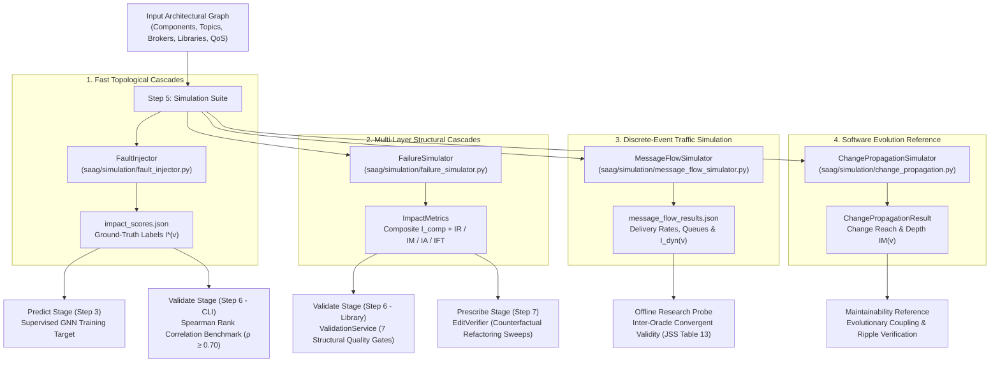
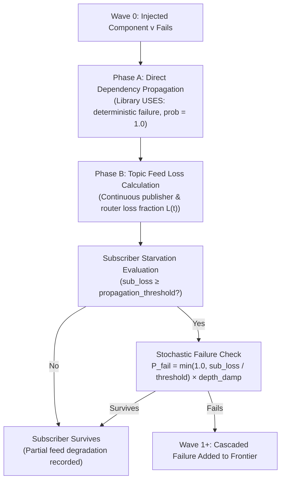

# Step 5: Simulate — Pre-Deployment Failure Simulation

**Generates simulation-derived ground-truth impact metrics ($I^*(v)$, $I_{\text{comp}}(v)$, $I_{\text{dyn}}(v)$, $IM(v)$) to train, validate, and verify architectural criticality across the software lifecycle.**

← [Step 4: Diagnose](diagnosis.md) | → [Step 6: Validate](validation.md)

---

## Table of Contents

1. [Overview & The Intuitive Mental Model](#1-overview-the-intuitive-mental-model)
2. [The Four Simulation Engines at a Glance](#2-the-four-simulation-engines-at-a-glance)
3. [Lifecycle Integration: Where Simulators Fit in SaG](#3-lifecycle-integration-where-simulators-fit-in-sag)
4. [Engine 1: FaultInjector (Fast Cascade Reachability)](#4-engine-1-faultinjector-fast-cascade-reachability)
   - 4.1 [Core Purpose & Intuition](#41-core-purpose-intuition)
   - 4.2 [Step-by-Step Wave Algorithm](#42-step-by-step-wave-algorithm)
   - 4.3 [Mathematical Formulation ($I^*(v)$)](#43-mathematical-formulation-iv)
   - 4.4 [Multi-Broker Redundancy & Cascade Thresholds](#44-multi-broker-redundancy-cascade-thresholds)
   - 4.5 [Multi-Seed Stability & Test-Retest Ceilings](#45-multi-seed-stability-test-retest-ceilings)
5. [Engine 2: FailureSimulator (Multi-Layer Structural & Quality Impact)](#5-engine-2-failuresimulator-multi-layer-structural-quality-impact)
   - 5.1 [Core Purpose & Intuition](#51-core-purpose-intuition)
   - 5.2 [Multi-Layer Structural Traversal](#52-multi-layer-structural-traversal)
   - 5.3 [Composite Impact Formulation ($I_{\text{comp}}(v)$)](#53-composite-impact-formulation-i_textcompv)
   - 5.4 [ISO/IEC 25010 Quality Decompositions ($IR$, $IM$, $IA$, $IFT$)](#54-isoiec-25010-quality-decompositions-ir-im-ia-ift)
   - 5.5 [Baseline Flow Priming & Flow Disruption](#55-baseline-flow-priming-flow-disruption)
   - 5.6 [Role in Validation Gating & Prescriptive Verification](#56-role-in-validation-gating-prescriptive-verification)
6. [Engine 3: MessageFlowSimulator (High-Fidelity Discrete-Event Queuing)](#6-engine-3-messageflowsimulator-high-fidelity-discrete-event-queuing)
   - 6.1 [Core Purpose & Intuition](#61-core-purpose-intuition)
   - 6.2 [SimPy Architecture: Queues, Contention & Processes](#62-simpy-architecture-queues-contention-processes)
   - 6.3 [Runtime QoS Contract Enforcement](#63-runtime-qos-contract-enforcement)
   - 6.4 [Load Calibration ($\rho = 0.65$) & Operating Points](#64-load-calibration-rho-065-operating-points)
   - 6.5 [Dynamic Delivery Loss ($I_{\text{dyn}}(v)$)](#65-dynamic-delivery-loss-i_textdynv)
   - 6.6 [The Contention-Relief Phenomenon (Why $I_{\text{dyn}}$ is 1-Dimensional)](#66-the-contention-relief-phenomenon-why-i_textdyn-is-1-dimensional)
   - 6.7 [Role as an Offline Convergent-Validity Research Probe](#67-role-as-an-offline-convergent-validity-research-probe)
7. [Engine 4: ChangePropagationSimulator (Maintainability Reference)](#7-engine-4-changepropagationsimulator-maintainability-reference)
   - 7.1 [Core Purpose: Runtime Failure vs. Development-Time Change](#71-core-purpose-runtime-failure-vs-development-time-change)
   - 7.2 [Transposed Graph Traversal ($G^\top$) & Stop Conditions](#72-transposed-graph-traversal-gtop--stop-conditions)
   - 7.3 [Maintainability Impact ($IM(v)$)](#73-maintainability-impact-imv)
8. [Quality Model Alignment (ISO/IEC 25010 & 25019)](#8-quality-model-alignment-isoiec-25010-25019)
9. [Worked Examples](#9-worked-examples)
   - 9.1 [Air Traffic Management (ATM) Walkthrough](#91-air-traffic-management-atm-walkthrough)
   - 9.2 [Autonomous Vehicle (AV) Multi-Oracle Stratification](#92-autonomous-vehicle-av-multi-oracle-stratification)
10. [CLI Reference (`cli/simulate_graph.py`)](#10-cli-reference-clisimulate_graphpy)
    - 10.1 [General Options](#101-general-options)
    - 10.2 [`fault-inject` Subcommand](#102-fault-inject-subcommand)
    - 10.3 [`message-flow` Subcommand](#103-message-flow-subcommand)
    - 10.4 [`combined` Subcommand](#104-combined-subcommand)
11. [Output Schemas (`impact_scores.json` & `message_flow_results.json`)](#11-output-schemas-impact_scoresjson-message_flow_resultsjson)
12. [Python API Quickstart](#12-python-api-quickstart)
13. [Methodological Boundaries & Design Invariants](#13-methodological-boundaries-design-invariants)
14. [What Comes Next](#14-what-comes-next)

---

## 1. Overview & The Intuitive Mental Model

When developing distributed, event-driven architectures (such as ROS 2 robotics, microservice meshes, or financial trading backbones), identifying critical components and architectural bottlenecks is essential **before deployment**.

In an already deployed production system, engineers analyze historic crash logs and distributed traces. However, **prior to deployment, no outage logs exist**. 

To solve this cold-start challenge, Software-as-a-Graph (SaG) performs **pre-deployment failure simulations**:
1. We take an architectural graph manifest (nodes, topics, brokers, libraries, and QoS policies).
2. We systematically simulate component crashes.
3. We observe and measure how failure cascades ripple through the system.
4. The observed damage becomes an objective, empirical **ground-truth impact score** used to train predictive models (such as GNNs) and evaluate architectural safety gates.

```
+---------------------+       Controlled       +-----------------------+
| Architectural Graph |   Failure Simulation   |  Ground-Truth Impact  |
|  (Pre-Deployment)   | ---------------------> |      Scores I(v)      |
+---------------------+                        +-----------------------+
                                                           |
                                                           v
                                            Used to train GNNs & validate
                                            architectural resilience gates
```

> [!IMPORTANT]
> **The Input–Label Independence Guarantee**:
> All simulation engines operate strictly on the **raw structural multigraph** ($G_{\text{structural}}$). They never read the derived logical dependencies (`DEPENDS_ON`) that predictive and explanatory algorithms consume. This architectural barrier prevents circular logic and data leakage.

---

## 2. The Four Simulation Engines at a Glance

Why does SaG provide **four distinct simulation engines** instead of just one?

Because answering different engineering questions requires different tradeoffs between **computational speed**, **granularity**, and **fidelity**. An engine fast enough to generate training labels across thousands of nodes cannot simulate microsecond packet queues; conversely, a high-fidelity discrete-event queuing engine is too computationally heavy for exhaustive training sweeps.

The following table summarizes the four specialized engines:

| Simulator Engine | Core Engineering Question | Underlying Paradigm | Primary Metric Output | Speed / Complexity | Primary Role in SaG |
|:---|:---|:---|:---|:---|:---|
| **`FaultInjector`** | *"If a publisher or broker dies, which downstream subscribers lose their data feeds?"* | Graph cascade reachability ($O(V+E)$) | **$I^*(v)$**: Continuous subscriber feed-loss fraction | **Fast** (~10 ms/node) | **Predict Stage**: Ground-truth labels for GNN training.<br>**Validate Stage**: CLI benchmark gate ($\rho \ge 0.70$). |
| **`FailureSimulator`** | *"What is the structural damage across physical hosts, network links, brokers, and shared libraries?"* | Multi-layer structural graph traversal | **$I_{\text{comp}}(v)$**: AHP composite structural loss ($IR, IM, IA, IFT$) | **Moderate** (~50 ms/node) | **Validate Stage**: `ValidationService` 7 quality gates.<br>**Prescribe Stage**: `EditVerifier` counterfactual mutation sweeps. |
| **`MessageFlowSimulator`** | *"How do message queues, packet drops, and deadlines behave under real-time DDS traffic and QoS contracts?"* | Discrete-event queuing simulation (SimPy) | **$I_{\text{dyn}}(v)$**: Dynamic traffic delivery rate drop | **Detailed** (~5–30 s/node) | **Research Probe**: Inter-oracle convergent validity analysis (JSS Table 13). |
| **`ChangePropagationSimulator`** | *"If an engineer modifies an interface, how far does the change ripple upstream across the dependency graph?"* | Transposed dependency BFS on $G^\top$ with stop conditions | **$IM(v)$**: Development-time maintainability blast radius | **Instant** (<5 ms/node) | **Maintainability Reference**: Consistency checks for software evolution risk. |

---

## 3. Lifecycle Integration: Where Simulators Fit in SaG

The SaG framework strictly decouples simulation engines across the architectural lifecycle:



### Stage Summary
1. **Predict Stage**: `FaultInjector` produces $I^*(v)$ labels used by GNNs (`HGT-QoS`, `GAT`, `Topo-QoS`) to learn relational failure patterns.
2. **Validate Stage**:
   - **Library Pathway (`ValidationService`)**: Uses `FailureSimulator` to verify 7 fixed quality gates checking structural blast-radius bounds.
   - **CLI Benchmark Pathway (`cli/validate_graph.py`)**: Uses `FaultInjector` to evaluate model ranking ($\rho \ge 0.70$) and Top-$K$ critical component identification ($F_1@K$).
3. **Prescribe Stage**: `FailureSimulator` powers `EditVerifier` counterfactual mutation sweeps, ensuring proposed refactoring edits achieve net risk reduction ($\Delta I_{\text{comp}} > 0, \Delta \text{SRI} > 0$) without triggering secondary regressions.
4. **Explain Stage**: Deterministic structural analysis (`DiagnosticUseCase`) with **strictly zero simulation access**, adhering to the input–label independence guarantee.
5. **Offline Research Probe**: `MessageFlowSimulator` evaluates inter-oracle convergent validity ($I_{\text{dyn}}$ vs $I^*$, JSS Table 13), confirming that static topological risk correlates with runtime discrete-event message loss.

---

## 4. Engine 1: FaultInjector (Fast Cascade Reachability)

### 4.1 Core Purpose & Intuition

The **`FaultInjector`** is the primary workhorse for generating machine learning ground-truth labels ($I^*(v)$). 

**Intuition**: Imagine a network of distributed microservices communicating via publish-subscribe topics. When service $A$ fails, it stops publishing to topic $T$. All services subscribed to $T$ lose that incoming data feed. If a subscriber depends heavily on that feed, it may also fail, triggering a cascade that starves further downstream services.

`FaultInjector` executes an $O(V+E)$ breadth-first search (BFS) cascade to trace exactly how far feed starvation spreads.

```
[ Injected Failure: Publisher A ]
               │
               ▼ stops publishing
       [ Topic T1 ]
               │
               ▼ feed lost
      [ Subscriber B ]  ───(loses >20% feed)───► [ Subscriber B Crashes ]
                                                          │
                                                          ▼ stops publishing
                                                  [ Topic T2 ]
                                                          │
                                                          ▼ feed lost
                                                 [ Subscriber C ]
```

### 4.2 Step-by-Step Wave Algorithm

The simulation begins with an injected candidate node $v$ and propagates in iterative waves ($W_0, W_1, W_2, \dots$):



1. **Wave 0 (Direct Failure)**: Component $v$ is marked as failed and removed from the active topology.
2. **Phase A (Direct Library Dependencies)**: If an application depends on a failed `Library` (`app_to_lib`), that application crashes deterministically ($\text{probability} = 1.0$), because software cannot run without its runtime libraries.
3. **Phase B (Topic-Mediated Feed Loss)**:
   - For every topic $t$, we compute its continuous feed loss $L(t) \in [0, 1]$ based on what fraction of its publishers and routing brokers are down:
     $$L(t) = \max\left(\text{Publisher Loss}(t), \; \text{Router Loss}(t)\right) \times \text{QoS\_factor}(t)$$
   - A subscriber $s$ calculates its average feed loss across all incoming topics:
     $$\text{sub\_loss}(s) = \frac{\sum_{t \in \text{subs}(s)} L(t)}{|\text{subs}(s)|}$$
4. **Stochastic Cascade & Depth Damping**:
   - If $\text{sub\_loss}(s) \ge \text{propagation\_threshold}$ (default: `0.20`), the subscriber has a probability of cascading:
     $$P_{\text{fail}}(s) = \min\left(1.0, \; \frac{\text{sub\_loss}(s)}{\text{propagation\_threshold}}\right) \times \text{depth\_damp}$$
     $$\text{depth\_damp} = \max(0.25, \; 1.0 - \text{wave\_idx} \times 0.15)$$
   - Depth damping prevents runaway artificial cascades in deep graphs by decreasing cascade likelihood at each successive wave.
5. **Termination**: The algorithm repeats wave by wave until no new nodes fail or the depth limit is reached.

### 4.3 Mathematical Formulation ($I^*(v)$)

The ground-truth impact score $I^*(v)$ is defined as the **mean continuous feed loss inflicted across all subscribers in the system**:

$$I^*(v) = \frac{\sum_{s \in \text{All Subscribers}} \text{sub\_loss}(s)}{|\text{All Subscribers}|}$$

- If failing $v$ causes no feed loss anywhere, $I^*(v) = 0.0$.
- If failing $v$ starves 100% of all feeds for every subscriber, $I^*(v) = 1.0$.
- By measuring continuous feed loss rather than just a binary count of dead nodes, $I^*(v)$ captures partial operational degradation smoothly.

### 4.4 Multi-Broker Redundancy & Cascade Thresholds

- **Multi-Broker Redundancy**: If a topic is routed across $k$ redundant brokers, failing 1 broker results in fractional router loss:
  $$\text{Router Loss}(t) = \frac{1}{k}$$
  If $k=2$, losing one broker reduces feed by 50% rather than causing a 100% total collapse.
- **Cascade Threshold (`--propagation-threshold`)**:
  - `0.2` (Default): Realistic sensitivity; a service losing $\ge 20\%$ of its incoming data streams risks functional failure.
  - `0.5`: Moderate tolerance; suitable for multi-sensor fusion systems where losing 1 out of 2 feeds causes degradation but not immediate shutdown.
  - `1.0`: Extreme tolerance; a service only cascades if 100% of all its feeds are completely severed.

### 4.5 Multi-Seed Stability & Test-Retest Ceilings

Because cascade propagation includes stochastic tie-breaking and probabilistic cascading, `FaultInjector` executes across **5 random seeds** (default: `{42, 123, 456, 789, 2024}`).

The reported ground-truth impact $\overline{I^*(v)}$ is the arithmetic mean across all seeds, recorded with its standard deviation $\sigma(v)$. Every generated artifact includes a dataset-wide stability block:

```json
"label_stability": {
  "n_seeds": 5,
  "mean_std": 0.0267,
  "max_std": 0.1856,
  "test_retest_spearman": 0.9802,
  "topk_jaccard": 0.6250
}
```

- **`test_retest_spearman` ($\ge 0.98$)**: The minimum pairwise rank correlation across any two seeds. This proves that the ground-truth ordering is stable and reproducible, establishing the theoretical upper performance bound for any predictive model.
- **`topk_jaccard` ($\ge 0.60$)**: The overlap of the top 20% most critical components between seed runs.

---

## 5. Engine 2: FailureSimulator (Multi-Layer Structural & Quality Impact)

### 5.1 Core Purpose & Intuition

While `FaultInjector` focuses on pub-sub feed loss for machine learning labels, **`FailureSimulator`** evaluates the **entire physical, network, logical, and software architecture as an integrated multi-layer system**.

**Intuition**: Real distributed systems do not fail in the application layer alone. An ECU host processor can overheat, a network link can drop, a message broker can crash, or a shared library can fail. `FailureSimulator` traces failures across all four architectural planes to compute multi-dimensional ISO/IEC 25010 quality impact.

```
[ Physical Layer ]     Host Compute Node (ECU) fails
                              │ (RUNS_ON)
                              ▼
[ Middleware Layer ]   Message Broker crashes
                              │ (ROUTES)
                              ▼
[ Logical Layer ]      Topics become unreachable, subscribers starve
                              │
[ Software Layer ]     Shared Library fails ──(USES)──► Application crashes
```

### 5.2 Multi-Layer Structural Traversal

`FailureSimulator` models four distinct cascade pathways on the `SimulationGraph`:
1. **Physical Cascades (`RUNS_ON`)**: When a compute host (`Node`) fails, all applications and brokers hosted on that machine immediately crash.
2. **Network Cascades (`CONNECTS_TO`)**: When network links fail, communication between distributed brokers is partitioned.
3. **Logical Cascades (`PUBLISHES_TO`, `SUBSCRIBES_TO`, `ROUTES`)**: When a broker crashes, its routed topics are orphaned; when a publisher crashes, subscriber paths are severed.
4. **Software Library Cascades (`USES`)**: When a shared library (`Library`) fails, all applications that import or link to that library crash.

### 5.3 Composite Impact Formulation ($I_{\text{comp}}(v)$)

`FailureSimulator` computes an overall composite damage score $I_{\text{comp}}(v) \in [0, 1]$ using Analytic Hierarchy Process (AHP) weights over four fundamental structural degradation criteria:

$$I_{\text{comp}}(v) = 0.35 \cdot \text{Reachability Loss} + 0.25 \cdot \text{Fragmentation} + 0.25 \cdot \text{Throughput Loss} + 0.15 \cdot \text{Flow Disruption}$$

Each term captures a distinct physical or operational dimension:
1. **Reachability Loss (35%)**: The fraction of end-to-end publisher-to-subscriber communication paths that are severed by the failure.
2. **Infrastructure Fragmentation (25%)**: How severely the failure splits the system into disconnected graph components (split 70% by component count and 30% by stranded QoS message volume).
3. **Throughput Loss (25%)**: The total QoS-weighted message bandwidth (messages/second) lost across all active topics.
4. **Flow Disruption (15%)**: The fraction of end-to-end active communication flows broken compared to an unperturbed baseline.

### 5.4 ISO/IEC 25010 Quality Decompositions ($IR$, $IM$, $IA$, $IFT$)

In addition to composite impact, `FailureSimulator` provides specific quality attribute decompositions matching ISO/IEC 25010:

- **$IFT(v)$ (Fault-Tolerance Impact)**: Directly measures dynamic cascade propagation:
  $$IFT(v) = 0.45 \cdot \text{Cascade Reach} + 0.35 \cdot \text{Weighted Cascade Impact} + 0.20 \cdot \text{Normalized Depth}$$
- **$IA(v)$ (Availability Impact)**: Evaluates infrastructure partition severity and stranded capacity:
  $$IA(v) = 0.50 \cdot \text{Weighted Reachability Loss} + 0.35 \cdot \text{Weighted Fragmentation} + 0.15 \cdot \text{Path-Breaking Throughput Loss}$$
- **$IR(v)$ (Reliability Impact)**: The balanced blend of Fault-Tolerance and Availability:
  $$IR(v) = r_\alpha \cdot IFT(v) + (1 - r_\alpha) \cdot IA(v)$$
- **$IM(v)$ (Maintainability Impact)**: Evaluates architectural blast radius and ripple effects, populated via `ChangePropagationSimulator`.

> [!NOTE]
> **No Security Dimension ($IS$)**:
> SaG focuses strictly on reliability, dependability, and maintainability. A hypothetical security metric ($IS$) is not present in the framework or ISO-RM implementation.

### 5.5 Baseline Flow Priming & Flow Disruption

The **Flow Disruption** term (15% of $I_{\text{comp}}$) compares post-failure message paths against an unperturbed baseline. Before running failure sweeps, baseline flows must be primed:

```python
SimulationService._prime_baseline_flows(sim_graph, failure_sim)
```

Priming executes deterministically without random drops, ensuring that flow disruption measures genuine structural vulnerability rather than random noise.

### 5.6 Role in Validation Gating & Prescriptive Verification

`FailureSimulator` is consumed downstream in two critical stages:
1. **Validate Stage (`ValidationService`)**: Evaluates 7 fixed structural quality gates (G1–G7) ensuring that critical components do not exceed acceptable reachability, throughput, or cascade thresholds.
2. **Prescribe Stage (`EditVerifier`)**: When automated refactoring generates candidate architectural repairs, `EditVerifier` runs counterfactual failure simulations using `FailureSimulator` to verify that proposed changes achieve net risk reduction ($\Delta I_{\text{comp}} > 0, \Delta \text{SRI} > 0$) without introducing secondary cascade regressions.

---

## 6. Engine 3: MessageFlowSimulator (High-Fidelity Discrete-Event Queuing)

### 6.1 Core Purpose & Intuition

Static graph models evaluate connectivity, but they do not model **time**, **queue buffers**, or **message traffic rates**.

**Intuition**: Consider an autonomous vehicle with an obstacle detection topic running at 50 Hz. Even if the network graph is intact, if a subscriber's input queue fills up, new obstacle messages will be dropped or delayed past their 20 ms deadline. 

**`MessageFlowSimulator`** is a high-fidelity discrete-event simulator built on **SimPy**. It simulates a running virtual clock where publishers emit messages at specific frequencies, queues accumulate packets, and subscribers process messages subject to DDS QoS contracts.

```
[ Publisher Process ] ──(50 Hz)──► [ Topic Fanout ]
                                           │
                      ┌────────────────────┴────────────────────┐
                      ▼                                         ▼
            [ Subscriber 1 Queue ]                    [ Subscriber 2 Queue ]
              (history_depth = 10)                      (history_depth = 5)
                      │                                         │
                      ▼                                         ▼
            [ Subscriber 1 Server ]                   [ Subscriber 2 Server ]
             (Service Rate μ = 65 Hz)                  (Service Rate μ = 65 Hz)
```

### 6.2 SimPy Architecture: Queues, Contention & Processes

To model distributed messaging accurately, the engine enforces two architectural design rules:

1. **Per-Subscriber Private Queues**:
   Each subscriber gets an independent FIFO queue for each topic it reads. This prevents **cross-topic head-of-line blocking**: a high-volume sensor stream cannot monopolize or block the queue of a high-priority emergency stop topic.
2. **Shared Compute ServiceStation**:
   While input queues are separate, each subscriber application processes incoming messages through a single shared `ServiceStation` (representing its CPU/worker thread capacity). This creates realistic resource contention when multiple topics deliver messages simultaneously.

### 6.3 Runtime QoS Contract Enforcement

The engine enforces five standard DDS QoS policies:

| QoS Policy | Simulation Enforcement Mechanism |
|:---|:---|
| **Reliability (`RELIABLE`)** | Queue overflow triggers **head-drop** (drops oldest sample to keep the freshest data, matching DDS `KEEP_LAST`). |
| **Reliability (`BEST_EFFORT`)** | Queue overflow triggers **tail-drop** (drops incoming message immediately). |
| **History Depth (`history_depth`)** | Limits maximum queue buffer size. Excess messages trigger drop policies based on reliability setting. |
| **Transport Priority (`transport_priority`)** | Orders message processing in `ServiceStation` via `simpy.PriorityResource`. High-priority messages jump ahead of normal traffic. |
| **Deadline (`deadline_ms`)** | Measures end-to-end latency ($t_{\text{processed}} - t_{\text{created}}$). If latency exceeds deadline, a SLA violation is logged. |

### 6.4 Load Calibration ($\rho = 0.65$) & Operating Points

In real systems, QoS contracts only matter when there is **contention**:
- If a system is nearly idle (utilization $\rho < 0.20$), queues never fill up, deadlines are never missed, and QoS policies never trigger.
- If a system is completely saturated (utilization $\rho > 0.85$), queues explode, drop rates soar, and simulation results degrade into noise.

To ensure consistent, reproducible results across scenarios with widely varying message rates (from 1 Hz to 2,600 Hz), `MessageFlowSimulator` automatically calibrates each subscriber's service rate:

$$E[S_s] = \frac{\rho}{\Lambda_s} \quad \text{where } \rho = 0.65$$

This ensures every subscriber operates at a calibrated **65% target utilization**, allowing QoS policies to bind realistically while maintaining high test-retest reproducibility ($\rho_{\text{stability}} = 0.93$).

### 6.5 Dynamic Delivery Loss ($I_{\text{dyn}}(v)$)

When evaluating component criticality, `MessageFlowSimulator` injects a failure at simulation midpoint ($t = t_{\text{fault}}$) and measures the resulting drop in delivery rate:

$$I_{\text{dyn}}(v) = \text{DeliveryRate}_{\text{pre-fault}} - \text{DeliveryRate}_{\text{post-fault}}$$

Where system delivery rate is normalized by total subscriber demand:

$$\text{DeliveryRate} = \frac{\text{Total Messages Delivered}}{\sum_{t \in \text{Topics}} (\text{Published}(t) \times \text{Subscribers}(t))}$$

### 6.6 The Contention-Relief Phenomenon (Why $I_{\text{dyn}}$ is 1-Dimensional)

Why does `MessageFlowSimulator` report delivery rate loss ($I_{\text{dyn}}$) as a **pure 1-dimensional score**, rather than combining it with latency or SLA violation metrics?

During empirical testing, an interesting physical phenomenon was uncovered: **Contention Relief**.

When a high-volume publisher fails, it stops sending messages. On heavily loaded subscribers, the sudden removal of this traffic **clears the queue**, causing post-fault latency to *decrease* and deadline violations to *drop*:
- Tail Latency ($\Delta L_{p95}$) vs. Delivery Loss ($I_{\text{dyn}}$): $\rho = -0.499$ (negative correlation!)
- Deadline Violations vs. Delivery Loss ($I_{\text{dyn}}$): $\rho = -0.418$ (negative correlation!)

If SaG combined delivery loss and latency into an additive score:
$$\text{Damage} = w_1 \cdot \Delta\text{Delivery} + w_2 \cdot \Delta\text{Latency}$$
The positive delivery loss and negative latency delta would cancel each other out! 

Therefore, $I_{\text{dyn}}$ is kept strictly 1-dimensional (delivery rate loss), while latency and deadline metrics are reported separately as supplementary diagnostics.

### 6.7 Role as an Offline Convergent-Validity Research Probe

`MessageFlowSimulator` is computationally demanding (taking minutes to simulate high-rate scenarios), making it unsuitable for live CI/CD gating.

Instead, it serves as an **offline research probe for convergent validity** (JSS Section 7.3 and Table 13):
- Across the twelve evaluation scenarios, $I_{\text{dyn}}$ correlates with $I^*$ (`FaultInjector`) at **Spearman $\rho = 0.620$**.
- This substantial correlation confirms that static topological graph rankings reflect real runtime communication bottlenecks, without requiring expensive discrete-event simulations in pre-deployment pipelines.

---

## 7. Engine 4: ChangePropagationSimulator (Maintainability Reference)

### 7.1 Core Purpose: Runtime Failure vs. Development-Time Change

The first three simulation engines answer runtime dependability questions. **`ChangePropagationSimulator`** answers a software engineering and evolution question:

> *"If a software engineer modifies component $v$, how many other components across the system must be adapted or re-tested?"*

| Concept | Runtime Failure Simulation | Change Propagation Simulation |
|:---|:---|:---|
| **Trigger** | Component $v$ crashes at runtime | Component $v$'s interface/code changes at development time |
| **Direction** | Follows communication flow (downstream impact) | Follows dependency contracts (upstream ripple on $G^\top$) |
| **Stop Conditions** | Queue absorption, broker redundancy | Loose coupling, stable interfaces |
| **Output Metric** | Operational cascade damage ($I^*(v), I_{\text{comp}}(v)$) | Architectural blast radius / Maintainability ($IM(v)$) |

### 7.2 Transposed Graph Traversal ($G^\top$) & Stop Conditions

If component $u$ depends on component $v$ ($u \xrightarrow{\text{DEPENDS\_ON}} v$), then changing $v$ may force $u$ to adapt. Therefore, change propagates in the **reverse direction** of dependencies:

1. Build the transposed dependency graph $G^\top$: invert every edge $(u \to v)$ into $(v \to u)$.
2. Execute a breadth-first search (BFS) starting at modified component $v$.
3. At each encountered node $u$, check two stopping conditions:
   - **Loose-Coupling Stop**: If edge weight $w(u \to v) < \theta_{\text{loose}}$ (e.g., volatile, best-effort messaging), the dependent absorbs the change without requiring modifications.
   - **Stable-Interface Stop**: If node instability $I(u) < \theta_{\text{stable}}$ (many incoming dependencies, few outgoing), the component acts as a stable boundary and halts propagation.

### 7.3 Maintainability Impact ($IM(v)$)

`ChangePropagationSimulator` outputs three normalized metrics for each component:
- **`change_reach`**: Fraction of system components reached by the change.
- **`weighted_change_impact`**: Importance-weighted adaptation cost.
- **`normalized_change_depth`**: Maximum propagation depth reached.

These are combined into the canonical Maintainability Impact score:
$$IM(v) = 0.45 \cdot \text{Change Reach} + 0.35 \cdot \text{Weighted Change Impact} + 0.20 \cdot \text{Normalized Depth}$$

---

## 8. Quality Model Alignment (ISO/IEC 25010 & 25019)

The SaG simulation suite maps observed metrics directly to international software quality standards:

| ISO/IEC 25010 Quality Characteristic | Observed Simulation Attribute | Mathematical Formula / Metric | Responsible Simulator Engine |
|:---|:---|:---|:---|
| **Effectiveness & Reliability** | Feed-loss cascade reach & path severing | $I^*(v) = \frac{1}{|S|} \sum \text{sub\_loss}(s)$ | `FaultInjector` |
| **Structural Reliability** | Publisher-to-subscriber path reachability loss | $\text{reachability\_loss} = 1 - \frac{\text{paths}_{\text{post}}}{\text{paths}_{\text{pre}}}$ | `FailureSimulator` |
| **Availability & Fault Tolerance** | Infrastructure fragmentation & stranded message volume | $\text{fragmentation} = 0.7 \Delta\text{CC} + 0.3 \Delta\text{Mass}$ | `FailureSimulator` |
| **Operational Capacity** | QoS-weighted lost message bandwidth | $\text{throughput\_loss} = 1 - \frac{\sum \text{rate}_{\text{post}}}{\sum \text{rate}_{\text{pre}}}$ | `FailureSimulator` |
| **Time Behavior & Performance** | Real-time traffic delivery drop under contention | $I_{\text{dyn}}(v) = \text{DR}_{\text{before}} - \text{DR}_{\text{after}}$ | `MessageFlowSimulator` |
| **Modularity & Maintainability** | Upstream code change ripple on transposed dependencies | $IM(v) = 0.45 \text{Reach} + 0.35 \text{Impact} + 0.20 \text{Depth}$ | `ChangePropagationSimulator` |

---

## 9. Worked Examples

### 9.1 Air Traffic Management (ATM) Walkthrough

Consider an Air Traffic Management architecture:

```
RadarTracker ──PUBLISHES_TO──► T_radar   ──SUBSCRIBES_TO──► ConflictDetector
             ──PUBLISHES_TO──► T_tracks  ──SUBSCRIBES_TO──► ConflictDetector, ATCWorkstation, FlightDataProcessor

FlightDataProcessor ──PUBLISHES_TO──► T_fpa ──SUBSCRIBES_TO──► ATCWorkstation
ConflictDetector    ──PUBLISHES_TO──► T_conflicts ──SUBSCRIBES_TO──► ATCWorkstation
ASTERIX_Broker      ──ROUTES────────► All Topics
```

#### Simulation Results & Architectural Rationale

| Component | $I^*(v)$ (`FaultInjector`) | Cascade Depth | Architectural Rationale |
|:---|:---:|:---:|:---|
| **`RadarTracker`** | **1.000** | 1 | Sole producer of primary radar and track feeds. Its failure starves `ConflictDetector` and `FlightDataProcessor`, triggering a cascade that eliminates all feeds to `ATCWorkstation`. |
| **`ASTERIX_Broker`** | **1.000** | 1 | Sole routing broker for the entire system; its failure partitions all publish-subscribe message paths. |
| **`ConflictDetector`** | **0.111** | 0 | Only publishes `T_conflicts`. When it fails, `ATCWorkstation` loses 1 out of 3 feeds (partial degradation; no cascade). |
| **`FlightDataProcessor`**| **0.111** | 0 | Only publishes `T_fpa`. `ATCWorkstation` loses 1 out of 3 feeds. |
| **`ATCWorkstation`** | **0.000** | 0 | Pure sink subscriber. Its failure causes zero downstream feed loss. |

### 9.2 Autonomous Vehicle (AV) Multi-Oracle Stratification

Evaluating an Autonomous Vehicle system ($|V| = 152$ nodes, $|E| = 730$ edges) across the simulation engines demonstrates how each oracle reveals different architectural layers:

| Architectural Layer / Stratum | Evaluated Count | Mean $I^*$ (`FaultInjector`) | Mean $I_{\text{comp}}$ (`FailureSimulator`) | Mean $I_{\text{dyn}}$ (`MessageFlow`) |
|:---|:---:|:---:|:---:|:---:|
| **Infrastructure (Compute ECUs)** | 8 | — *(unlabeled)* | **0.2713** | — *(unobservable)* |
| **Application (Shared Libraries)**| 20 | **0.9436** | 0.0000 | — *(unobservable)* |
| **Middleware (Message Brokers)**  | 4 | 0.4882 | **0.0945** | — *(unobservable)* |
| **Application (Microservices)**   | 80 | 0.1905 | 0.0119 | **0.1842** |
| **Entire System (Pooled)**        | 112 | 0.3821 | 0.0381 | — |

**Key Insights**:
- `FaultInjector` focuses on application feeds and shared libraries ($I^* = 0.9436$ for libraries because multiple microservices crash when a core library fails).
- `FailureSimulator` captures infrastructure crash impact ($I_{\text{comp}} = 0.2713$ on compute ECUs due to multi-process host termination).
- `MessageFlowSimulator` evaluates continuous runtime delivery loss over active microservices ($I_{\text{dyn}} = 0.1842$).

---

## 10. CLI Reference (`cli/simulate_graph.py`)

The SaG simulation CLI is accessible via `cli/simulate_graph.py`.

### 10.1 General Options

```bash
python cli/simulate_graph.py [SUBCOMMAND] [OPTIONS]

Shared Options:
  --input PATH      Path to scenario graph JSON (e.g., data/scenarios/atm_system.json)
  --output DIR      Directory for output artifacts (default: output/simulation/)
  --export-json     Export results to structured JSON files
  --verbose, -v     Enable debug logging
```

### 10.2 `fault-inject` Subcommand

Runs multi-seed cascade reachability simulation to generate $I^*(v)$ training labels:

```bash
# Full multi-seed sweep across Application and Broker nodes
python cli/simulate_graph.py fault-inject \
    --input data/scenarios/atm_system.json \
    --output output/simulation/ \
    --seeds 42,123,456,789,2024 \
    --propagation-threshold 0.2 \
    --qos-factor ladder \
    --export-json
```

**Key Arguments**:
- `--seeds`: Comma-separated list of random seeds (default: `42,123,456,789,2024`).
- `--propagation-threshold`: Cascade sensitivity (default: `0.2`).
- `--nodes`: Specific component IDs to inject (default: all eligible nodes).
- `--node-types`: Filter node types (default: `Application,Broker`).

### 10.3 `message-flow` Subcommand

Runs SimPy discrete-event message flow simulation:

```bash
# 300-second simulation, faulting ConflictDetector at t=150s with full QoS enforcement
python cli/simulate_graph.py message-flow \
    --input data/scenarios/atm_system.json \
    --output output/simulation/ \
    --duration 300 \
    --fault-node ConflictDetector \
    --fault-time 150 \
    --qos-mode full \
    --target-utilization 0.65 \
    --seed 42 \
    --export-json
```

**Key Arguments**:
- `--duration`: Simulation run time in virtual seconds (default: `300.0`).
- `--fault-node`: Component ID to crash during the run.
- `--fault-time`: Simulation timestamp when fault triggers (default: midpoint).
- `--qos-mode`: QoS enforcement level (`none`, `contracts`, `recovery`, `full`, `legacy`).
- `--target-utilization`: Calibrated subscriber utilization target (default: `0.65`).

### 10.4 `combined` Subcommand

Executes both `fault-inject` and `message-flow` sequentially in a single pass:

```bash
python cli/simulate_graph.py combined \
    --input data/scenarios/atm_system.json \
    --output output/simulation/ \
    --seeds 42,123,456 \
    --duration 300 \
    --fault-node ConflictDetector \
    --export-json
```

---

## 11. Output Schemas (`impact_scores.json` & `message_flow_results.json`)

### 11.1 `impact_scores.json` (Fault Injection Ground Truth)

Generated by `FaultInjector`, this artifact supplies the $I^*(v)$ supervised training labels:

```json
{
  "schema_version": "2.1",
  "graph_id": "atm_system",
  "labeler": "FaultInjector",
  "seeds_used": [42, 123, 456, 789, 2024],
  "labeled_node_types": ["Application", "Broker"],
  "labeled_dimensions": ["composite", "reliability"],
  "unlabeled_node_ids": ["N0", "N1", "T_radar", "T_tracks"],
  "label_stability": {
    "n_seeds": 5,
    "test_retest_spearman": 0.9802,
    "topk_jaccard": 0.6250
  },
  "records": {
    "RadarTracker": {
      "impact_score": 1.0,
      "impact_score_std": 0.0,
      "cascade_depth": 1,
      "impacted_subscribers": 3,
      "orphaned_topics": 2
    },
    "ConflictDetector": {
      "impact_score": 0.1111,
      "impact_score_std": 0.0,
      "cascade_depth": 0,
      "impacted_subscribers": 1,
      "orphaned_topics": 1
    }
  }
}
```

### 11.2 `message_flow_results.json` (Dynamic Discrete-Event Results)

Generated by `MessageFlowSimulator`:

```json
{
  "schema_version": "2.0",
  "graph_id": "atm_system",
  "simulation_duration": 300.0,
  "system_delivery_rate": 0.9975,
  "qos_mode": "full",
  "target_utilization": 0.65,
  "utilization_mode": "per_subscriber",
  "measured_utilization": {
    "ConflictDetector": 0.6478,
    "ATCWorkstation": 0.6512
  },
  "fault_event": {
    "fault_time": 150.0,
    "faulted_node_id": "ConflictDetector",
    "delivery_rate_before": 0.9982,
    "delivery_rate_after": 0.9810,
    "delivery_rate_drop": 0.0172,
    "latency_p50_before": 2.1,
    "latency_p50_after": 2.0,
    "qos_violations_count": 0
  }
}
```

---

## 12. Python API Quickstart

### 12.1 Running `FaultInjector` Programmatically

```python
import networkx as nx
from pathlib import Path
from saag.simulation.fault_injector import FaultInjector

# Initialize injector with multi-seed configuration
injector = FaultInjector(
    graph=graph,
    seeds=[42, 123, 456, 789, 2024],
    propagation_threshold=0.2,
    qos_factor_mode="ladder"
)

# Run systematic sweep over candidate node types
result = injector.run(node_types=["Application", "Broker"])
result.save(Path("output/simulation/impact_scores.json"))

print(f"Top critical node: {result.top_k_by_impact[0]['node_id']} "
      f"(I* = {result.top_k_by_impact[0]['impact_score']:.4f})")
```

### 12.2 Running `FailureSimulator` Programmatically

```python
from pathlib import Path
from saag.simulation.graph import SimulationGraph
from saag.simulation.failure_simulator import FailureSimulator
from saag.simulation.service import SimulationService

# Wrap graph into SimulationGraph
sim_graph = SimulationGraph(graph_data)
sim = FailureSimulator(sim_graph, qos_weighting=True)

# Prime baseline flows for flow disruption measurement
SimulationService._prime_baseline_flows(sim_graph, sim)

# Run exhaustive failure sweep
results = sim.simulate_exhaustive(seed=42)
for r in results[:5]:
    print(f"Node: {r.target_id:<20} | I_comp: {r.impact.composite_impact:.4f} "
          f"| Reachability Loss: {r.impact.reachability_loss:.4f}")
```

### 12.3 Running `MessageFlowSimulator` Programmatically

```python
from pathlib import Path
from saag.simulation.message_flow_simulator import MessageFlowSimulator

sim = MessageFlowSimulator(
    graph=graph,
    duration=300.0,
    fault_node="ConflictDetector",
    fault_time=150.0,
    seed=42,
    qos_mode="full",
    target_utilization=0.65
)

result = sim.run()
result.save(Path("output/simulation/message_flow_results.json"))

if result.fault_event:
    print(f"Faulted: {result.fault_event.faulted_node_id}")
    print(f"Delivery Rate Drop (I_dyn): {result.fault_event.delivery_rate_drop:.4f}")
```

### 12.4 Running `ChangePropagationSimulator` Programmatically

```python
from saag.simulation.change_propagation import ChangePropagationSimulator

# Run maintainability change propagation sweep on dependency graph
cps = ChangePropagationSimulator(analysis_service)
maintainability_results = cps.run_all()

for node_id, res in list(maintainability_results.items())[:5]:
    print(f"Node: {node_id:<20} | IM: {res.maintainability_impact:.4f} "
          f"| Change Reach: {res.change_reach:.4f}")
```

---

## 13. Methodological Boundaries & Design Invariants

| # | Boundary / Limitation | Methodological Scope & Handling |
|:---|:---|:---|
| **L1** | **Physical Node & Library Scope** | `FailureSimulator` cascades physical host crashes (`RUNS_ON`) and library crashes (`USES`). `FaultInjector` derives `DEPENDS_ON(app_to_lib)` for libraries, but hardware nodes are excluded from default GNN application training sweeps. |
| **L2** | **Maintainability Separation** | `FaultInjector` measures runtime operational cascade loss ($I^*(v)$). Maintainability ground truth ($IM(v)$) is supplied separately by `ChangePropagationSimulator`. |
| **L3** | **Single-Fault Sweeps** | Simulators evaluate one component failure per run to calculate isolated individual criticality. Cascades model propagation depth rather than simultaneous disjoint failures. |
| **L4** | **1-Dimensional $I_{\text{dyn}}$** | Due to the **Contention-Relief phenomenon** (§6.6), secondary metrics (latency, SLA violations) negatively correlate with delivery loss. Therefore, $I_{\text{dyn}}$ is kept strictly 1-dimensional (delivery rate drop). |
| **L5** | **Edge Ground-Truth Scope** | Edge criticality is evaluated via single-edge removal sweeps ($\Delta \text{Impact}$). Unmeasured edges are explicitly marked `evaluated: false`. |
| **L6** | **Counterfactual Prescriptive Verification** | Sweeps on a static graph are fast, but counterfactual mutation verification costs one sweep per candidate repair. Prescriptive optimization therefore uses a heuristic proposal generator followed by simulated verification (`EditVerifier`), rather than brute-force search. |
| **L7** | **$I_{\text{dyn}}$ is a Convergent Probe, Not an Independent Oracle** | While $I_{\text{dyn}}$ is behavioral and $I^*$ is topological, both traverse the same underlying system architecture. $I_{\text{dyn}}$ provides convergent construct validity (JSS Table 13, $\rho = 0.620$) rather than fully independent statistical validation. |
| **L8** | **Hardware Brokers & Nodes in Discrete-Event Simulation** | `MessageFlowSimulator` models active message-passing processes. Hardware compute nodes and passive network links are unobservable to message queuing processes and are omitted from discrete-event evaluation rather than scored 0.0. |

---

## 14. What Comes Next

With ground-truth simulation artifacts generated:
- **[Step 3: Predict](prediction.md)**: Train Heterogeneous Graph Transformers (`HGT-QoS`) using the $I^*(v)$ labels generated by `FaultInjector`.
- **[Step 6: Validate](validation.md)**: Statistically evaluate predicted criticality scores against simulated ground-truth metrics using Spearman rank correlation ($\rho \ge 0.70$) and top-$K$ identification ($F_1@K$).
- **[Step 7: Prescribe](prescription.md)**: Apply automated refactoring operators and verify net risk reduction ($\Delta I_{\text{comp}} > 0, \Delta \text{SRI} > 0$) using `FailureSimulator`.

---

← [Step 4: Diagnose](diagnosis.md) | → [Step 6: Validate](validation.md)
