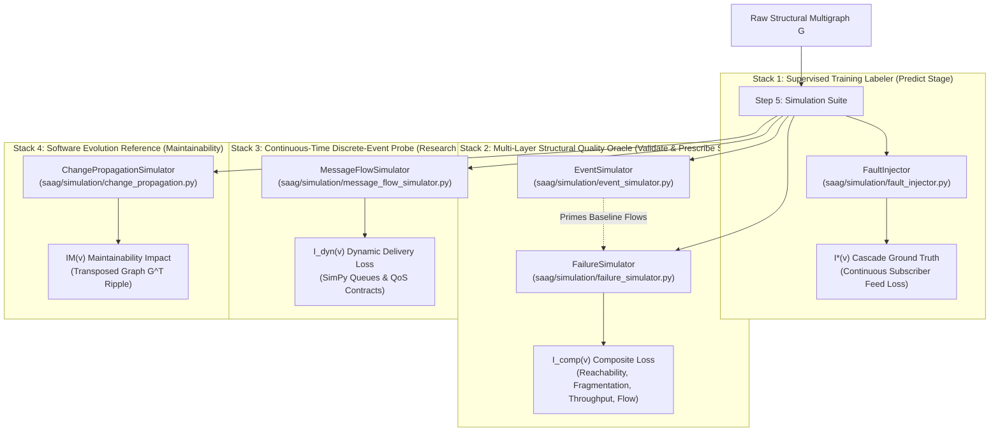
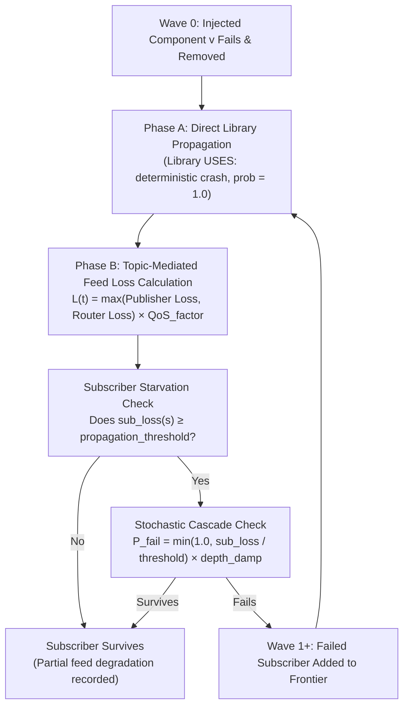
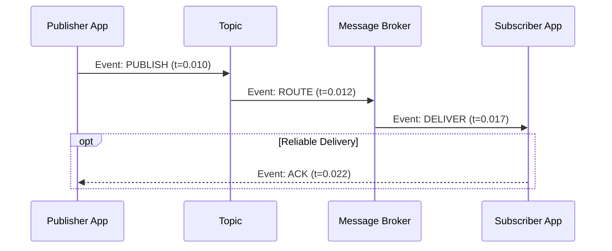

# Step 5: Simulate — Pre-Deployment Failure & Event Simulation

**Generate empirical ground-truth impact metrics ($I^*(v)$, $I_{\text{comp}}(v)$, $I_{\text{dyn}}(v)$, $IM(v)$) through controlled cascade, structural, and discrete-event simulations to train, validate, and verify architectural dependability.**

← [Step 4: Diagnose](diagnosis.md) | → [Step 6: Validate](validation.md)

---

## Table of Contents

1. [Overview & The Pre-Deployment Cold-Start Problem](#1-overview--the-pre-deployment-cold-start-problem)
2. [The Five Simulation Engines at a Glance](#2-the-five-simulation-engines-at-a-glance)
3. [Lifecycle Integration: Where Simulators Fit in SaG](#3-lifecycle-integration-where-simulators-fit-in-sag)
4. [Engine 1: `FaultInjector` (Fast Cascade Reachability)](#4-engine-1-faultinjector-fast-cascade-reachability)
   - 4.1 [Intuition & Core Purpose](#41-intuition--core-purpose)
   - 4.2 [Step-by-Step Wave Algorithm ($W_0, W_1, \dots$)](#42-step-by-step-wave-algorithm-w_0-w_1-dots)
   - 4.3 [Mathematical Formulation ($I^*(v)$)](#43-mathematical-formulation-iv)
   - 4.4 [Multi-Broker Redundancy & Cascade Thresholds](#44-multi-broker-redundancy--cascade-thresholds)
   - 4.5 [Multi-Seed Stability & Test-Retest Ceilings](#45-multi-seed-stability--test-retest-ceilings)
5. [Engine 2: `FailureSimulator` (Multi-Layer Structural & Quality Impact)](#5-engine-2-failuresimulator-multi-layer-structural--quality-impact)
   - 5.1 [Intuition & Core Purpose](#51-intuition--core-purpose)
   - 5.2 [Multi-Layer Structural Traversal](#52-multi-layer-structural-traversal)
   - 5.3 [Composite Impact Formulation ($I_{\text{comp}}(v)$)](#53-composite-impact-formulation-i_textcompv)
   - 5.4 [ISO/IEC 25010 Quality Decompositions ($IR, IM, IA, IFT$)](#54-isoiec-25010-quality-decompositions-ir-im-ia-ift)
   - 5.5 [Flow Disruption & Baseline Flow Priming](#55-flow-disruption--baseline-flow-priming)
   - 5.6 [Roles in Validation Gating & Prescriptive Verification](#56-roles-in-validation-gating--prescriptive-verification)
6. [Engine 3: `EventSimulator` (Built-In Discrete-Event Message Engine)](#6-engine-3-eventsimulator-built-in-discrete-event-message-engine)
   - 6.1 [Intuition & Zero-Dependency Event Loop](#61-intuition--zero-dependency-event-loop)
   - 6.2 [Poisson Failures, Recoveries & M/G/1 Arrivals](#62-poisson-failures-recoveries--mg1-arrivals)
   - 6.3 [Baseline Flow Generation for Quality Analysis](#63-baseline-flow-generation-for-quality-analysis)
7. [Engine 4: `MessageFlowSimulator` (High-Fidelity Queuing & QoS)](#7-engine-4-messageflowsimulator-high-fidelity-queuing--qos)
   - 7.1 [Intuition & SimPy Architecture](#71-intuition--simpy-architecture)
   - 7.2 [Private Topic Queues vs. Shared Compute Server](#72-private-topic-queues-vs-shared-compute-server)
   - 7.3 [Runtime DDS QoS Contract Enforcement](#73-runtime-dds-qos-contract-enforcement)
   - 7.4 [Load Calibration ($\rho = 0.65$) & Operating Points](#74-load-calibration-rho--065--operating-points)
   - 7.5 [Dynamic Delivery Loss ($I_{\text{dyn}}(v)$)](#75-dynamic-delivery-loss-i_textdynv)
   - 7.6 [The Contention-Relief Phenomenon (Why $I_{\text{dyn}}$ is 1-Dimensional)](#76-the-contention-relief-phenomenon-why-i_textdyn-is-1-dimensional)
   - 7.7 [Role as an Offline Convergent-Validity Research Probe](#77-role-as-an-offline-convergent-validity-research-probe)
8. [Engine 5: `ChangePropagationSimulator` (Maintainability Reference)](#8-engine-5-changepropagationsimulator-maintainability-reference)
   - 8.1 [Runtime Failure vs. Development-Time Interface Change](#81-runtime-failure-vs-development-time-interface-change)
   - 8.2 [Transposed Graph Traversal ($G^\top$) & Stop Conditions](#82-transposed-graph-traversal-gtop--stop-conditions)
   - 8.3 [Maintainability Impact ($IM(v)$)](#83-maintainability-impact-imv)
9. [Quality Model Alignment (ISO/IEC 25010 & 25019)](#9-quality-model-alignment-isoiec-25010--25019)
10. [Worked Examples](#10-worked-examples)
    - 10.1 [Air Traffic Management (ATM) Step-by-Step Cascade](#101-air-traffic-management-atm-step-by-step-cascade)
    - 10.2 [Autonomous Vehicle (AV) Multi-Oracle Stratification](#102-autonomous-vehicle-av-multi-oracle-stratification)
11. [Programmatic Python API Quickstart](#11-programmatic-python-api-quickstart)
12. [CLI Reference (`cli/simulate_graph.py`)](#12-cli-reference-clisimulate_graphpy)
13. [Output Schemas (`impact_scores.json` & `message_flow_results.json`)](#13-output-schemas-impact_scoresjson--message_flow_resultsjson)
14. [Methodological Boundaries & Design Invariants](#14-methodological-boundaries--design-invariants)
15. [What Comes Next](#15-what-comes-next)

---

## 1. Overview & The Pre-Deployment Cold-Start Problem

In distributed, event-driven architectures (e.g., ROS 2 robotics, microservice meshes, aerospace flight controls, financial trading backbones), identifying critical components and architectural bottlenecks is vital **before deployment**.

In an existing production system, site reliability engineers inspect historical crash traces and distributed APM telemetry. However, **prior to deployment, no crash logs exist**:
- How do we know which microservice failure will bring down the vehicle?
- How do we know which message broker is a single point of failure?
- How do we train graph neural networks to predict blast radius without production outage data?

To solve this pre-deployment cold-start challenge, Software-as-a-Graph (SaG) executes **controlled pre-deployment simulations**:
1. We ingest the architectural graph manifest (nodes, topics, brokers, libraries, hardware hosts, and QoS delivery contracts).
2. We systematically inject synthetic component failures.
3. We observe and record the resulting cascade across physical, network, logical, and software layers.
4. The observed operational damage becomes an objective, empirical **ground-truth impact score** used to train predictive models, evaluate safety gates, and verify automated refactoring prescriptions.

```
┌──────────────────────────┐     Systematic Injection     ┌────────────────────────────┐
│   Architectural Graph    │  ─────────────────────────►  │    Ground-Truth Impact     │
│ (Nodes, Topics, Brokers) │      Simulation Engine       │ Scores: I*(v), I_comp(v)   │
└──────────────────────────┘                              └────────────────────────────┘
                                                                        │
                                                                        ▼
                                                          • Supervised GNN Training
                                                          • Empirical Safety Gating
                                                          • Counterfactual Verification
```

> [!IMPORTANT]
> **The Input–Label Independence Guarantee:**
> All simulation engines operate strictly on the **raw structural multigraph** ($G_{\text{structural}}$). They never read the derived logical dependencies (`DEPENDS_ON`) that predictive and explanatory algorithms consume. This strict architectural boundary prevents circular logic, label contamination, and data leakage.

---

## 2. The Five Simulation Engines at a Glance

Why does SaG provide **five distinct simulation engines** instead of a single catch-all simulator?

Because answering different engineering questions requires fundamentally different tradeoffs between **computational speed**, **granularity**, and **simulation fidelity**. An engine fast enough to generate training labels across thousands of nodes in seconds cannot simulate microsecond packet queues; conversely, a high-fidelity discrete-event queuing engine is far too computationally heavy for exhaustive training sweeps.



The table below summarizes the five specialized simulation engines:

| Engine | Core Engineering Question | Underlying Paradigm | Primary Metric Output | Computational Speed | Primary Role in SaG |
|:---|:---|:---|:---|:---:|:---|
| **`FaultInjector`** | *"If a publisher or broker dies, which downstream subscribers lose their data feeds?"* | Graph cascade reachability ($O(V+E)$) | **$I^*(v)$**: Continuous subscriber feed-loss fraction | **Fast** (~10 ms/node) | **Predict Stage**: Ground-truth labels for GNN training.<br>**Validate Stage**: CLI benchmark gate ($\rho \ge 0.70$). |
| **`FailureSimulator`** | *"What is the structural damage across physical hosts, network links, brokers, and shared libraries?"* | Multi-layer structural graph traversal | **$I_{\text{comp}}(v)$**: AHP composite structural loss ($IR, IM, IA, IFT$) | **Moderate** (~50 ms/node) | **Validate Stage**: `ValidationService` 7 quality gates.<br>**Prescribe Stage**: `EditVerifier` counterfactual mutation sweeps. |
| **`EventSimulator`** | *"How do messages flow through the topology under Poisson failure and recovery events?"* | Discrete-event priority queue simulation (Zero external dependencies) | **Flow Metrics**: Baseline message delivery paths, drop counts, queue lengths | **Fast** (~20 ms/run) | **Baseline Provider**: Primes unperturbed healthy flows for `FailureSimulator`'s flow disruption metric. |
| **`MessageFlowSimulator`** | *"How do message queues, packet drops, and deadlines behave under real-time DDS traffic and QoS contracts?"* | Continuous-time discrete-event queuing simulation (SimPy) | **$I_{\text{dyn}}(v)$**: Dynamic traffic delivery rate drop | **Detailed** (~5–30 s/node) | **Research Probe**: Inter-oracle convergent validity analysis (JSS Section 7.3 and Table 13). |
| **`ChangePropagationSimulator`** | *"If an engineer modifies an interface, how far does the change ripple upstream across the dependency graph?"* | Transposed dependency BFS on $G^\top$ with stop conditions | **$IM(v)$**: Development-time maintainability blast radius | **Instant** (<5 ms/node) | **Maintainability Reference**: Ground truth for evolutionary coupling and code ripple risk. |

---

## 3. Lifecycle Integration: Where Simulators Fit in SaG

SaG enforces strict stage boundaries. Different simulation engines own different stages of the architectural lifecycle, and their outputs are **not interchangeable**:

```mermaid
flowchart LR
    subgraph Step5["Step 5: Simulation Suite"]
        FI["FaultInjector"]
        FS["FailureSimulator"]
        ES["EventSimulator"]
        MFS["MessageFlowSimulator"]
        CPS["ChangePropagationSimulator"]
    end

    subgraph Step3["Step 3: Predict"]
        HGT["HGT-QoS / GAT Training"]
    end

    subgraph Step6["Step 6: Validate"]
        VAL_CLI["CLI Benchmark (ρ ≥ 0.70)"]
        VAL_LIB["ValidationService (7 Quality Gates)"]
        CONV["Convergent Validity Probe"]
    end

    subgraph Step7["Step 7: Prescribe"]
        EV["EditVerifier (Mutation Sweeps)"]
    end

    FI -->|I*(v) Labels| HGT
    FI -->|I*(v) Ground Truth| VAL_CLI
    ES -.->|Baseline Flow Priming| FS
    FS -->|I_comp(v) Quality Metrics| VAL_LIB
    FS -->|Risk Delta ΔI_comp| EV
    MFS -->|I_dyn(v) Probe| CONV
    CPS -->|IM(v) Metrics| FS
```

### Stage Summary & Engine Contracts

1. **Step 3 (Predict Stage)**:
   `FaultInjector` produces the scalar labels $I^*(v)$ across multiple seeds. GNNs (`NodeCriticalityGNN`, `HomogeneousGAT_*`) use $I^*(v)$ as their supervised training target.
2. **Step 6 (Validate Stage)**:
   - **CLI Benchmark (`cli/validate_graph.py`)**: Uses `FaultInjector` to test whether GNN or structural predictions match empirical cascade reachability with rank correlation $\rho \ge 0.70$.
   - **Library Quality Gates (`ValidationService`)**: Uses `FailureSimulator` to verify 7 fixed quality gates (G1–G7) checking structural reachability, throughput, and cascade bounds.
   - **Convergent Validity Probe**: Uses `MessageFlowSimulator` to verify that topological risk correlates with dynamic message loss ($I_{\text{dyn}}$ vs $I^*$, $\rho = 0.620$).
3. **Step 7 (Prescribe Stage)**:
   `EditVerifier` uses `FailureSimulator` to execute counterfactual failure simulations on proposed architectural refactorings, verifying that candidate edits yield net risk reduction ($\Delta I_{\text{comp}} > 0, \Delta \text{SRI} > 0$).
4. **Step 4 (Diagnose Stage)**:
   **Has strictly zero simulation access**. Anti-pattern detection and ISO-RM attribution are closed-form and deterministic, preserving the input–label independence guarantee.

---

## 4. Engine 1: `FaultInjector` (Fast Cascade Reachability)

### 4.1 Intuition & Core Purpose

`FaultInjector` in [`saag/simulation/fault_injector.py`](../saag/simulation/fault_injector.py) is the canonical labeler for supervised machine learning.

**Intuition**: In a publish-subscribe system, when Publisher $A$ crashes, it stops publishing to Topic $T_1$. Consequently, all subscribers reading $T_1$ suffer feed starvation. If a subscriber depends heavily on that feed, it may also crash, cutting off further downstream topics and starving further subscribers.

`FaultInjector` traces this cascade using an efficient breadth-first search ($O(V+E)$) on the pub-sub interaction graph.

```
[ Injected Failure: Publisher A ]
               │
               ▼ stops publishing
        [ Topic T1 ]
               │
               ▼ feed lost
       [ Subscriber B ]  ───(loses >20% feed)───► [ Subscriber B Crashes ]
                                                           │
                                                           ▼ stops publishing
                                                   [ Topic T2 ]
                                                           │
                                                           ▼ feed lost
                                                  [ Subscriber C ]
```

---

### 4.2 Step-by-Step Wave Algorithm ($W_0, W_1, \dots$)

The simulation begins with an injected target node $v$ and evaluates failure propagation across iterative discrete waves:



1. **Wave 0 (Direct Failure)**:
   Target component $v$ is removed from the active topology.
2. **Phase A (Direct Library Dependencies)**:
   If an application depends on a failed `Library` (`app_to_lib`), that application crashes deterministically ($\text{probability} = 1.0$). Software cannot execute when its core runtime libraries fail.
3. **Phase B (Topic-Mediated Feed Loss)**:
   For every topic $t$, its continuous feed loss $L(t) \in [0, 1]$ is computed from the share of dead publishers and dead routing brokers:
   $$L(t) = \max\left(\text{Publisher Loss}(t), \; \text{Router Loss}(t)\right) \times \text{QoS\_factor}(t)$$
   A subscriber $s$ calculates its mean feed loss across all subscribed topics:
   $$\text{sub\_loss}(s) = \frac{\sum_{t \in \text{subs}(s)} L(t)}{|\text{subs}(s)|}$$
4. **Stochastic Cascade & Depth Damping**:
   If $\text{sub\_loss}(s) \ge \text{propagation\_threshold}$ (default: `0.20`), the subscriber has a probability of cascading:
   $$P_{\text{fail}}(s) = \min\left(1.0, \; \frac{\text{sub\_loss}(s)}{\text{propagation\_threshold}}\right) \times \text{depth\_damp}$$
   $$\text{depth\_damp} = \max(0.25, \; 1.0 - \text{wave\_idx} \times 0.15)$$
   *Depth damping* prevents runaway artificial cascades in deep graphs by reducing cascade likelihood at each successive wave.
5. **Termination**: The wave iteration terminates when no new components fail or when `max_cascade_depth` is reached.

---

### 4.3 Mathematical Formulation ($I^*(v)$)

The ground-truth impact score $I^*(v)$ is defined as the **mean continuous feed loss inflicted across all subscribers in the system**:

$$I^*(v) = \frac{1}{|\mathcal{S}_{\text{all}}|} \sum_{s \in \mathcal{S}_{\text{all}}} \text{sub\_loss}(s)$$

- If failing $v$ causes zero feed loss to any subscriber, $I^*(v) = 0.0$.
- If failing $v$ cuts off 100% of feeds to every subscriber, $I^*(v) = 1.0$.
- By tracking continuous feed loss rather than a coarse binary count of dead nodes, $I^*(v)$ captures partial operational degradation smoothly.

---

### 4.4 Multi-Broker Redundancy & Cascade Thresholds

- **Multi-Broker Redundancy**: If a topic is routed across $k$ redundant brokers, failing 1 broker results in fractional router loss:
  $$\text{Router Loss}(t) = \frac{1}{k}$$
  If $k=2$, losing one broker reduces feed availability by 50% rather than causing total failure. Redundancy softens the cascade blow.
- **Cascade Threshold (`--propagation-threshold`)**:
  - `0.2` (Default): Realistic sensitivity; a service losing $\ge 20\%$ of its incoming data streams risks functional failure.
  - `0.5`: Moderate tolerance; suitable for multi-sensor fusion systems where losing 1 out of 2 redundant feeds causes degradation but not immediate shutdown.
  - `1.0`: Extreme tolerance; a service only cascades if 100% of all its feeds are completely severed.

---

### 4.5 Multi-Seed Stability & Test-Retest Ceilings

Because wave propagation uses stochastic tie-breaking and probabilistic cascading, `FaultInjector` executes across **5 random seeds** (default: `{42, 123, 456, 789, 2024}`).

The reported ground-truth impact $\overline{I^*(v)}$ is the arithmetic mean across all seeds, recorded with its standard deviation $\sigma(v)$. Every generated artifact includes dataset-wide stability metrics:

```json
"label_stability": {
  "n_seeds": 5,
  "mean_std": 0.0267,
  "max_std": 0.1856,
  "test_retest_spearman": 0.9802,
  "topk_jaccard": 0.6250
}
```

- **`test_retest_spearman` ($\ge 0.98$)**: The minimum pairwise rank correlation across any two seeds. This proves that the ground-truth ranking is stable and reproducible, establishing the theoretical upper performance bound for any predictive model.
- **`topk_jaccard` ($\ge 0.60$)**: The overlap of the top 20% most critical components between seed runs.

---

## 5. Engine 2: `FailureSimulator` (Multi-Layer Structural & Quality Impact)

### 5.1 Intuition & Core Purpose

While `FaultInjector` focuses on pub-sub feed loss for machine learning labels, **`FailureSimulator`** in [`saag/simulation/failure_simulator.py`](../saag/simulation/failure_simulator.py) evaluates the **entire physical, network, logical, and software architecture as an integrated multi-layer system**.

**Intuition**: Real distributed systems do not fail in the application layer alone. An ECU host processor can overheat, a network link can drop, a message broker can crash, or a shared library can fail. `FailureSimulator` traces failures across all four architectural planes to compute multi-dimensional ISO/IEC 25010 quality impact.

```
[ Physical Layer ]     Host Compute Node (ECU) fails
                              │ (RUNS_ON)
                              ▼
[ Middleware Layer ]   Message Broker crashes
                              │ (ROUTES)
                              ▼
[ Logical Layer ]      Topics become unreachable, subscribers starve
                              │
[ Software Layer ]     Shared Library fails ──(USES)──► Application crashes
```

---

### 5.2 Multi-Layer Structural Traversal

`FailureSimulator` models four distinct cascade pathways on the `SimulationGraph`:
1. **Physical Cascades (`RUNS_ON`)**: When a compute host (`Node`) fails, all applications and brokers hosted on that machine immediately crash.
2. **Network Cascades (`CONNECTS_TO`)**: When network links fail, communication between distributed brokers is partitioned.
3. **Logical Cascades (`PUBLISHES_TO`, `SUBSCRIBES_TO`, `ROUTES`)**: When a broker crashes, its routed topics are orphaned; when a publisher crashes, subscriber paths are severed.
4. **Software Library Cascades (`USES`)**: When a shared library (`Library`) fails, all applications that import or link to that library crash.

---

### 5.3 Composite Impact Formulation ($I_{\text{comp}}(v)$)

`FailureSimulator` computes an overall composite damage score $I_{\text{comp}}(v) \in [0, 1]$ using Analytic Hierarchy Process (AHP) weights over four fundamental structural degradation criteria:

$$I_{\text{comp}}(v) = 0.35 \cdot \text{Reachability Loss} + 0.25 \cdot \text{Fragmentation} + 0.25 \cdot \text{Throughput Loss} + 0.15 \cdot \text{Flow Disruption}$$

Each term captures a distinct physical or operational dimension:
1. **Reachability Loss (35%)**: The fraction of end-to-end publisher-to-subscriber communication paths severed by the failure:
   $$\text{Reachability Loss} = 1 - \frac{\text{Paths}_{\text{post}}}{\text{Paths}_{\text{pre}}}$$
2. **Infrastructure Fragmentation (25%)**: How severely the failure splits the system into disconnected graph components (split 70% by component count and 30% by stranded QoS message volume):
   $$\text{Fragmentation} = 0.70 \cdot \Delta\text{Connected Components} + 0.30 \cdot \Delta\text{Stranded QoS Mass}$$
3. **Throughput Loss (25%)**: The total QoS-weighted message bandwidth (messages/second) lost across all active topics:
   $$\text{Throughput Loss} = 1 - \frac{\sum_{t \in \text{Topics}} \text{Throughput}_{\text{post}}(t)}{\sum_{t \in \text{Topics}} \text{Throughput}_{\text{pre}}(t)}$$
4. **Flow Disruption (15%)**: The fraction of end-to-end active communication flows broken compared to an unperturbed baseline.

---

### 5.4 ISO/IEC 25010 Quality Decompositions ($IR, IM, IA, IFT$)

In addition to composite impact, `FailureSimulator` provides specific quality attribute decompositions matching ISO/IEC 25010:

- **$IFT(v)$ (Fault-Tolerance Impact)**: Directly measures dynamic cascade propagation:
  $$IFT(v) = 0.45 \cdot \text{Cascade Reach} + 0.35 \cdot \text{Weighted Cascade Impact} + 0.20 \cdot \text{Normalized Depth}$$
- **$IA(v)$ (Availability Impact)**: Evaluates infrastructure partition severity and stranded capacity:
  $$IA(v) = 0.50 \cdot \text{Weighted Reachability Loss} + 0.35 \cdot \text{Weighted Fragmentation} + 0.15 \cdot \text{Path-Breaking Throughput Loss}$$
- **$IR(v)$ (Reliability Impact)**: The balanced blend of Fault-Tolerance and Availability:
  $$IR(v) = r_\alpha \cdot IFT(v) + (1 - r_\alpha) \cdot IA(v) \quad (r_\alpha = 0.36)$$
- **$IM(v)$ (Maintainability Impact)**: Evaluates architectural blast radius and ripple effects, populated via `ChangePropagationSimulator`.

---

### 5.5 Flow Disruption & Baseline Flow Priming

The **Flow Disruption** term (15% of $I_{\text{comp}}$) compares post-failure message paths against an unperturbed baseline. Before running failure sweeps, baseline flows must be primed:

```python
SimulationService._prime_baseline_flows(sim_graph, failure_sim)
```

Priming executes a deterministically seeded run with `EventSimulator` under healthy, drop-free conditions. This ensures that flow disruption measures genuine structural path severing rather than stochastic noise.

---

### 5.6 Roles in Validation Gating & Prescriptive Verification

`FailureSimulator` is consumed downstream in two critical stages:
1. **Validate Stage (`ValidationService`)**: Evaluates 7 fixed structural quality gates (G1–G7) ensuring that critical components do not exceed acceptable reachability, throughput, or cascade thresholds.
2. **Prescribe Stage (`EditVerifier`)**: When automated refactoring generates candidate architectural repairs, `EditVerifier` runs counterfactual failure simulations using `FailureSimulator` to verify that proposed changes achieve net risk reduction ($\Delta I_{\text{comp}} > 0, \Delta \text{SRI} > 0$) without introducing secondary cascade regressions.

---

## 6. Engine 3: `EventSimulator` (Built-In Discrete-Event Message Engine)

### 6.1 Intuition & Zero-Dependency Event Loop

While `MessageFlowSimulator` relies on SimPy, **`EventSimulator`** in [`saag/simulation/event_simulator.py`](../saag/simulation/event_simulator.py) is a **lightweight, built-in discrete-event simulator** that requires **zero external dependencies**.

It models pub-sub communication using an internal priority queue (`heapq`) ordered by simulation time:
- **`PUBLISH`**: An application creates a message and submits it to its target topic.
- **`ROUTE`**: A message broker ingests the message from the topic and schedules forwarding.
- **`DELIVER`**: The message arrives at the subscriber application.
- **`ACK`**: An acknowledgment is returned if the topic contract requires `RELIABLE` delivery.
- **`DROP`**: A message is dropped if queues overflow, brokers fail, or timeouts expire.



---

### 6.2 Poisson Failures, Recoveries & M/G/1 Arrivals

`EventSimulator` supports advanced stochastic failure and queuing models:

1. **Poisson Component Failure Injection ($\lambda$)**:
   Components fail according to a homogeneous Poisson process with rate $\lambda$ (failures per simulated second). Inter-arrival times between failures follow an exponential distribution $\text{Exp}(\lambda)$.
2. **Exponential Recovery ($1 / \mu_{\text{rec}}$)**:
   If `mean_recovery_time > 0`, a `RECOVER_COMPONENT` event is automatically scheduled $\text{Exp}(1 / \mu_{\text{rec}})$ seconds after failure, restoring the component to active service.
3. **Poisson Message Arrivals (M/G/1 Queueing)**:
   When `poisson_arrivals=True`, fixed message intervals are replaced by exponential inter-arrival times $\text{Exp}(1 / \Delta t)$, transforming the simulator into an M/G/1 queueing system.

---

### 6.3 Baseline Flow Generation for Quality Analysis

`EventSimulator` serves as the **baseline flow generator** for `FailureSimulator`. Running `simulate_all_publishers()` under healthy conditions records every active `(publisher, topic, subscriber)` flow. `FailureSimulator` caches this flow set to compute the **flow disruption** metric during component failure sweeps.

---

## 7. Engine 4: `MessageFlowSimulator` (High-Fidelity Queuing & QoS)

### 7.1 Intuition & SimPy Architecture

Static graph models evaluate connectivity, but they do not model **time**, **queue buffers**, or **message traffic rates**.

**Intuition**: Consider an autonomous vehicle with an obstacle detection topic running at 50 Hz. Even if the network graph is intact, if a subscriber's input queue fills up, new obstacle messages will be dropped or delayed past their 20 ms deadline. 

**`MessageFlowSimulator`** in [`saag/simulation/message_flow_simulator.py`](../saag/simulation/message_flow_simulator.py) is a high-fidelity discrete-event simulator built on **SimPy**. It simulates a running virtual clock where publishers emit messages at specific frequencies, queues accumulate packets, and subscribers process messages subject to DDS QoS contracts.

```
[ Publisher Process ] ──(50 Hz)──► [ Topic Fanout ]
                                           │
                      ┌────────────────────┴────────────────────┐
                      ▼                                         ▼
            [ Subscriber 1 Queue ]                    [ Subscriber 2 Queue ]
              (history_depth = 10)                      (history_depth = 5)
                      │                                         │
                      ▼                                         ▼
            [ Subscriber 1 Server ]                   [ Subscriber 2 Server ]
             (Service Rate μ = 65 Hz)                  (Service Rate μ = 65 Hz)
```

---

### 7.2 Private Topic Queues vs. Shared Compute Server

To model distributed messaging accurately, the engine enforces two architectural design rules:

1. **Per-Subscriber Private Queues**:
   Each subscriber gets an independent FIFO queue for each topic it reads. This prevents **cross-topic head-of-line blocking**: a high-volume sensor stream cannot monopolize or block the queue of a high-priority emergency stop topic.
2. **Shared Compute ServiceStation**:
   While input queues are separate, each subscriber application processes incoming messages through a single shared `ServiceStation` (representing its CPU/worker thread capacity). This creates realistic resource contention when multiple topics deliver messages simultaneously.

---

### 7.3 Runtime DDS QoS Contract Enforcement

The engine enforces five standard DDS QoS policies:

| QoS Policy | Simulation Enforcement Mechanism |
|:---|:---|
| **Reliability (`RELIABLE`)** | Queue overflow triggers **head-drop** (drops oldest sample to keep freshest data, matching DDS `KEEP_LAST`). |
| **Reliability (`BEST_EFFORT`)** | Queue overflow triggers **tail-drop** (drops incoming message immediately). |
| **History Depth (`history_depth`)** | Limits maximum queue buffer size. Excess messages trigger drop policies based on reliability setting. |
| **Transport Priority (`transport_priority`)** | Orders message processing in `ServiceStation` via `simpy.PriorityResource`. High-priority messages jump ahead of normal traffic. |
| **Deadline (`deadline_ms`)** | Measures end-to-end latency ($t_{\text{processed}} - t_{\text{created}}$). If latency exceeds deadline, an SLA violation is logged. |

---

### 7.4 Load Calibration ($\rho = 0.65$) & Operating Points

In real systems, QoS contracts only matter when there is **contention**:
- If a system is nearly idle (utilization $\rho < 0.20$), queues never fill up, deadlines are never missed, and QoS policies never trigger.
- If a system is completely saturated (utilization $\rho > 0.85$), queues explode, drop rates soar, and simulation results degrade into noise.

To ensure consistent, reproducible results across scenarios with widely varying message rates (from 1 Hz to 2,600 Hz), `MessageFlowSimulator` automatically calibrates each subscriber's service rate:

$$E[S_s] = \frac{\rho}{\Lambda_s} \quad \text{where } \rho = 0.65$$

This ensures every subscriber operates at a calibrated **65% target utilization**, allowing QoS policies to bind realistically while maintaining high test-retest reproducibility ($\rho_{\text{stability}} = 0.93$).

---

### 7.5 Dynamic Delivery Loss ($I_{\text{dyn}}(v)$)

When evaluating component criticality, `MessageFlowSimulator` injects a failure at simulation midpoint ($t = t_{\text{fault}}$) and measures the resulting drop in delivery rate:

$$I_{\text{dyn}}(v) = \text{DeliveryRate}_{\text{pre-fault}} - \text{DeliveryRate}_{\text{post-fault}}$$

Where system delivery rate is normalized by total subscriber demand:

$$\text{DeliveryRate} = \frac{\text{Total Messages Delivered}}{\sum_{t \in \text{Topics}} (\text{Published}(t) \times \text{Subscribers}(t))}$$

---

### 7.6 The Contention-Relief Phenomenon (Why $I_{\text{dyn}}$ is 1-Dimensional)

Why does `MessageFlowSimulator` report delivery rate loss ($I_{\text{dyn}}$) as a **pure 1-dimensional score**, rather than combining it with latency or SLA violation metrics?

During empirical testing, an interesting physical phenomenon was uncovered: **Contention Relief**.

When a high-volume publisher fails, it stops sending messages. On heavily loaded subscribers, the sudden removal of this traffic **clears the queue**, causing post-fault latency to *decrease* and deadline violations to *drop*:
- Tail Latency ($\Delta L_{p95}$) vs. Delivery Loss ($I_{\text{dyn}}$): $\rho = -0.499$ (negative correlation!)
- Deadline Violations vs. Delivery Loss ($I_{\text{dyn}}$): $\rho = -0.418$ (negative correlation!)

If SaG combined delivery loss and latency into an additive score:
$$\text{Damage} = w_1 \cdot \Delta\text{Delivery} + w_2 \cdot \Delta\text{Latency}$$
The positive delivery loss and negative latency delta would cancel each other out! 

Therefore, $I_{\text{dyn}}$ is kept strictly 1-dimensional (delivery rate loss), while latency and deadline metrics are reported separately as supplementary diagnostics.

---

### 7.7 Role as an Offline Convergent-Validity Research Probe

`MessageFlowSimulator` is computationally demanding (taking minutes to simulate high-rate scenarios), making it unsuitable for live CI/CD gating.

Instead, it serves as an **offline research probe for convergent validity** (JSS Section 7.3 and Table 13):
- Across the twelve evaluation scenarios, $I_{\text{dyn}}$ correlates with $I^*$ (`FaultInjector`) at **Spearman $\rho = 0.620$**.
- This substantial correlation confirms that static topological graph rankings reflect real runtime communication bottlenecks, without requiring expensive discrete-event simulations in pre-deployment pipelines.

---

## 8. Engine 5: `ChangePropagationSimulator` (Maintainability Reference)

### 8.1 Runtime Failure vs. Development-Time Interface Change

The first four simulation engines evaluate runtime dependability. **`ChangePropagationSimulator`** in [`saag/simulation/change_propagation.py`](../saag/simulation/change_propagation.py) answers a software engineering and evolution question:

> *"If a software engineer modifies component $v$, how many other components across the system must be adapted or re-tested?"*

| Dimension | Runtime Failure Simulation | Change Propagation Simulation |
|:---|:---|:---|
| **Trigger** | Component $v$ crashes at runtime | Component $v$'s interface/code changes at development time |
| **Direction** | Follows communication flow (downstream dataflow) | Follows dependency contracts (upstream ripple on $G^\top$) |
| **Stop Conditions** | Queue absorption, broker redundancy | Loose coupling, stable interfaces |
| **Output Metric** | Operational cascade damage ($I^*(v), I_{\text{comp}}(v)$) | Architectural blast radius / Maintainability ($IM(v)$) |

---

### 8.2 Transposed Graph Traversal ($G^\top$) & Stop Conditions

If component $u$ depends on component $v$ ($u \xrightarrow{\text{DEPENDS\_ON}} v$), then modifying $v$ may force $u$ to adapt. Therefore, change propagates in the **reverse direction** of dependencies:

1. Build the transposed dependency graph $G^\top$: invert every edge $(u \to v)$ into $(v \to u)$.
2. Execute a breadth-first search (BFS) starting at modified component $v$.
3. At each encountered node $u$, evaluate two stopping conditions:
   - **Loose-Coupling Stop**: If edge weight $w(u \to v) < \theta_{\text{loose}}$ (default: `0.20`), the dependent absorbs the change without requiring modifications (e.g., volatile, best-effort messaging).
   - **Stable-Interface Stop**: If node instability $\text{Instability}(u) < \theta_{\text{stable}}$ (default: `0.20`, indicating many afferent and few efferent dependencies), the component acts as an architectural boundary and absorbs change obligations.

---

### 8.3 Maintainability Impact ($IM(v)$)

`ChangePropagationSimulator` outputs three normalized metrics for each component:
- **`change_reach`**: Fraction of system components reached by the change.
- **`weighted_change_impact`**: Importance-weighted adaptation cost.
- **`normalized_change_depth`**: Maximum propagation depth reached.

These are combined into the canonical Maintainability Impact score:
$$IM(v) = 0.45 \cdot \text{Change Reach} + 0.35 \cdot \text{Weighted Change Impact} + 0.20 \cdot \text{Normalized Depth}$$

---

## 9. Quality Model Alignment (ISO/IEC 25010 & 25019)

The SaG simulation suite maps observed metrics directly to international software quality standards:

| ISO/IEC 25010 Quality Characteristic | Observed Simulation Attribute | Mathematical Formula / Metric | Responsible Simulator Engine |
|:---|:---|:---|:---|
| **Effectiveness & Reliability** | Feed-loss cascade reach & path severing | $I^*(v) = \frac{1}{|\mathcal{S}|} \sum \text{sub\_loss}(s)$ | `FaultInjector` |
| **Structural Reliability** | Publisher-to-subscriber path reachability loss | $\text{reachability\_loss} = 1 - \frac{\text{paths}_{\text{post}}}{\text{paths}_{\text{pre}}}$ | `FailureSimulator` |
| **Availability & Fault Tolerance** | Infrastructure fragmentation & stranded message volume | $\text{fragmentation} = 0.70 \Delta\text{CC} + 0.30 \Delta\text{Mass}$ | `FailureSimulator` |
| **Operational Capacity** | QoS-weighted lost message bandwidth | $\text{throughput\_loss} = 1 - \frac{\sum \text{rate}_{\text{post}}}{\sum \text{rate}_{\text{pre}}}$ | `FailureSimulator` |
| **Time Behavior & Performance** | Real-time traffic delivery drop under contention | $I_{\text{dyn}}(v) = \text{DR}_{\text{before}} - \text{DR}_{\text{after}}$ | `MessageFlowSimulator` |
| **Modularity & Maintainability** | Upstream code change ripple on transposed dependencies | $IM(v) = 0.45 \text{Reach} + 0.35 \text{Impact} + 0.20 \text{Depth}$ | `ChangePropagationSimulator` |

---

## 10. Worked Examples

### 10.1 Air Traffic Management (ATM) Step-by-Step Cascade

Consider an Air Traffic Management architecture:

```
RadarTracker ──PUBLISHES_TO──► T_radar   ──SUBSCRIBES_TO──► ConflictDetector
             ──PUBLISHES_TO──► T_tracks  ──SUBSCRIBES_TO──► ConflictDetector, ATCWorkstation, FlightDataProcessor

FlightDataProcessor ──PUBLISHES_TO──► T_fpa ──SUBSCRIBES_TO──► ATCWorkstation
ConflictDetector    ──PUBLISHES_TO──► T_conflicts ──SUBSCRIBES_TO──► ATCWorkstation
ASTERIX_Broker      ──ROUTES────────► All Topics
```

#### Simulation Results & Architectural Rationale

| Component | $I^*(v)$ (`FaultInjector`) | Cascade Depth | Architectural Rationale |
|:---|:---:|:---:|:---|
| **`RadarTracker`** | **1.000** | 1 | Sole producer of primary radar and track feeds. Its failure starves `ConflictDetector` and `FlightDataProcessor`, triggering a cascade that eliminates all feeds to `ATCWorkstation`. |
| **`ASTERIX_Broker`** | **1.000** | 1 | Sole routing broker for the entire system; its failure partitions all publish-subscribe message paths. |
| **`ConflictDetector`** | **0.111** | 0 | Only publishes `T_conflicts`. When it fails, `ATCWorkstation` loses 1 out of 3 feeds (partial degradation; no cascade). |
| **`FlightDataProcessor`**| **0.111** | 0 | Only publishes `T_fpa`. `ATCWorkstation` loses 1 out of 3 feeds. |
| **`ATCWorkstation`** | **0.000** | 0 | Pure sink subscriber. Its failure causes zero downstream feed loss. |

---

### 10.2 Autonomous Vehicle (AV) Multi-Oracle Stratification

Evaluating an Autonomous Vehicle system ($|V| = 152$ nodes, $|E| = 730$ edges) across the simulation engines demonstrates how each oracle reveals different architectural layers:

| Architectural Layer / Stratum | Evaluated Count | Mean $I^*$ (`FaultInjector`) | Mean $I_{\text{comp}}$ (`FailureSimulator`) | Mean $I_{\text{dyn}}$ (`MessageFlow`) |
|:---|:---:|:---:|:---:|:---:|
| **Infrastructure (Compute ECUs)** | 8 | — *(unlabeled)* | **0.2713** | — *(unobservable)* |
| **Application (Shared Libraries)**| 20 | **0.9436** | 0.0000 | — *(unobservable)* |
| **Middleware (Message Brokers)**  | 4 | 0.4882 | **0.0945** | — *(unobservable)* |
| **Application (Microservices)**   | 80 | 0.1905 | 0.0119 | **0.1842** |
| **Entire System (Pooled)**        | 112 | 0.3821 | 0.0381 | — |

**Key Insights**:
- `FaultInjector` focuses on application feeds and shared libraries ($I^* = 0.9436$ for libraries because multiple microservices crash when a core library fails).
- `FailureSimulator` captures infrastructure crash impact ($I_{\text{comp}} = 0.2713$ on compute ECUs due to multi-process host termination).
- `MessageFlowSimulator` evaluates continuous runtime delivery loss over active microservices ($I_{\text{dyn}} = 0.1842$).

---

## 11. Programmatic Python API Quickstart

### 11.1 Running `FaultInjector` (GNN Ground-Truth Labels)

```python
from pathlib import Path
from saag.simulation.fault_injector import FaultInjector
from saag.core.graph_io import load_graph

graph = load_graph("data/scenarios/atm_system.json")

# Initialize injector with recommended 5 seeds
injector = FaultInjector(
    graph=graph,
    seeds=[42, 123, 456, 789, 2024],
    propagation_threshold=0.20,
    qos_factor_mode="ladder"
)

# Run systematic sweep over candidate node types
result = injector.run(node_types=["Application", "Broker"])
result.save(Path("output/simulation/impact_scores.json"))

print(f"Top critical component: {result.top_k_by_impact[0]['node_id']} "
      f"(I* = {result.top_k_by_impact[0]['impact_score']:.4f})")
```

---

### 11.2 Running `FailureSimulator` (Structural Quality Impact)

```python
from saag.simulation.graph import SimulationGraph
from saag.simulation.failure_simulator import FailureSimulator
from saag.simulation.service import SimulationService
from saag.core.graph_io import load_graph

graph_dict = load_graph("data/scenarios/atm_system.json", return_dict=True)
sim_graph = SimulationGraph(graph_dict)
fail_sim = FailureSimulator(sim_graph, qos_weighting=True)

# Prime unperturbed baseline flows via EventSimulator
SimulationService._prime_baseline_flows(sim_graph, fail_sim)

# Run exhaustive failure sweep
results = fail_sim.simulate_exhaustive(seed=42)
for r in results[:5]:
    print(f"Component: {r.target_id:<20} | I_comp: {r.impact.composite_impact:.4f} "
          f"| Reachability Loss: {r.impact.reachability_loss:.4f}")
```

---

### 11.3 Running `EventSimulator` (Discrete-Event Pub-Sub Flows)

```python
from saag.simulation.graph import SimulationGraph
from saag.simulation.event_simulator import EventSimulator
from saag.simulation.models import EventScenario

sim_graph = SimulationGraph(graph_dict)
event_sim = EventSimulator(sim_graph)

# Simulate 100 messages from RadarTracker with Poisson component failures
result = event_sim.simulate(EventScenario(
    source_app="RadarTracker",
    num_messages=100,
    duration=10.0,
    failure_rate=0.1,         # λ = 0.1 failures/sec
    mean_recovery_time=2.0,   # Exp(1/2) recovery time
    poisson_arrivals=True
))

print(f"Messages published: {result.metrics.messages_published}")
print(f"Delivery rate: {result.metrics.delivery_rate:.2f}%")
print(f"P99 latency: {result.metrics.p99_latency * 1000:.2f} ms")
```

---

### 11.4 Running `MessageFlowSimulator` (Continuous-Time SimPy Queuing)

```python
from pathlib import Path
from saag.simulation.message_flow_simulator import MessageFlowSimulator
from saag.core.graph_io import load_graph

graph = load_graph("data/scenarios/atm_system.json")

sim = MessageFlowSimulator(
    graph=graph,
    duration=300.0,
    fault_node="ConflictDetector",
    fault_time=150.0,
    seed=42,
    qos_mode="full",
    target_utilization=0.65
)

result = sim.run()
result.save(Path("output/simulation/message_flow_results.json"))

if result.fault_event:
    print(f"Faulted node: {result.fault_event.faulted_node_id}")
    print(f"Dynamic Delivery Rate Drop (I_dyn): {result.fault_event.delivery_rate_drop:.4f}")
```

---

### 11.5 Running `ChangePropagationSimulator` (Maintainability Impact)

```python
from saag.simulation.change_propagation import ChangePropagationSimulator
from saag.analysis.analyzer import StructuralAnalyzer

analyzer = StructuralAnalyzer()
analysis_res = analyzer.analyze_graph(graph, layer="system")

cps = ChangePropagationSimulator(theta_loose=0.20, theta_stable=0.20)
maintainability_results = cps.run_all(analysis_res)

for node_id, res in list(maintainability_results.items())[:5]:
    print(f"Component: {node_id:<20} | IM: {res.maintainability_impact:.4f} "
          f"| Change Reach: {res.change_reach:.4f}")
```

---

## 12. CLI Reference (`cli/simulate_graph.py`)

Access the simulation CLI via `cli/simulate_graph.py`.

### 12.1 Shared Options

```bash
python cli/simulate_graph.py [SUBCOMMAND] [OPTIONS]

Shared Options:
  --input PATH      Path to scenario graph JSON (e.g., data/scenarios/atm_system.json)
  --output DIR      Directory for output artifacts (default: output/simulation/)
  --export-json     Export results to structured JSON files
  --verbose, -v     Enable debug logging
```

---

### 12.2 `fault-inject` Subcommand

Runs multi-seed cascade reachability simulation to generate $I^*(v)$ training labels:

```bash
# Full multi-seed sweep across Application and Broker nodes
python cli/simulate_graph.py fault-inject \
    --input data/scenarios/atm_system.json \
    --output output/simulation/ \
    --seeds 42,123,456,789,2024 \
    --propagation-threshold 0.2 \
    --qos-factor ladder \
    --export-json
```

**Key Arguments**:
- `--seeds`: Comma-separated list of random seeds (default: `42,123,456,789,2024`).
- `--propagation-threshold`: Cascade sensitivity (default: `0.2`).
- `--nodes`: Specific component IDs to inject (default: all eligible nodes).
- `--node-types`: Filter node types (default: `Application,Broker`).

---

### 12.3 `message-flow` Subcommand

Runs SimPy discrete-event message flow simulation:

```bash
# 300-second simulation, faulting ConflictDetector at t=150s with full QoS enforcement
python cli/simulate_graph.py message-flow \
    --input data/scenarios/atm_system.json \
    --output output/simulation/ \
    --duration 300 \
    --fault-node ConflictDetector \
    --fault-time 150 \
    --qos-mode full \
    --target-utilization 0.65 \
    --seed 42 \
    --export-json
```

**Key Arguments**:
- `--duration`: Simulation run time in virtual seconds (default: `300.0`).
- `--fault-node`: Component ID to crash during the run.
- `--fault-time`: Simulation timestamp when fault triggers (default: midpoint).
- `--qos-mode`: QoS enforcement level (`none`, `contracts`, `recovery`, `full`, `legacy`).
- `--target-utilization`: Calibrated subscriber utilization target (default: `0.65`).

---

### 12.4 `combined` Subcommand

Executes both `fault-inject` and `message-flow` sequentially in a single pass:

```bash
python cli/simulate_graph.py combined \
    --input data/scenarios/atm_system.json \
    --output output/simulation/ \
    --seeds 42,123,456 \
    --duration 300 \
    --fault-node ConflictDetector \
    --export-json
```

---

## 13. Output Schemas (`impact_scores.json` & `message_flow_results.json`)

### 13.1 `impact_scores.json` (Fault Injection Ground Truth)

Generated by `FaultInjector`, this artifact supplies the $I^*(v)$ supervised training labels:

```json
{
  "schema_version": "2.1",
  "graph_id": "atm_system",
  "labeler": "FaultInjector",
  "seeds_used": [42, 123, 456, 789, 2024],
  "labeled_node_types": ["Application", "Broker"],
  "labeled_dimensions": ["composite", "reliability"],
  "unlabeled_node_ids": ["N0", "N1", "T_radar", "T_tracks"],
  "label_stability": {
    "n_seeds": 5,
    "mean_std": 0.0267,
    "max_std": 0.1856,
    "test_retest_spearman": 0.9802,
    "topk_jaccard": 0.6250
  },
  "records": {
    "RadarTracker": {
      "impact_score": 1.0,
      "impact_score_std": 0.0,
      "cascade_depth": 1,
      "impacted_subscribers": 3,
      "orphaned_topics": 2
    },
    "ConflictDetector": {
      "impact_score": 0.1111,
      "impact_score_std": 0.0,
      "cascade_depth": 0,
      "impacted_subscribers": 1,
      "orphaned_topics": 1
    }
  }
}
```

---

### 13.2 `message_flow_results.json` (Dynamic Discrete-Event Results)

Generated by `MessageFlowSimulator`:

```json
{
  "schema_version": "2.0",
  "graph_id": "atm_system",
  "simulation_duration": 300.0,
  "system_delivery_rate": 0.9975,
  "qos_mode": "full",
  "target_utilization": 0.65,
  "utilization_mode": "per_subscriber",
  "measured_utilization": {
    "ConflictDetector": 0.6478,
    "ATCWorkstation": 0.6512
  },
  "fault_event": {
    "fault_time": 150.0,
    "faulted_node_id": "ConflictDetector",
    "delivery_rate_before": 0.9982,
    "delivery_rate_after": 0.9810,
    "delivery_rate_drop": 0.0172,
    "latency_p50_before": 2.1,
    "latency_p50_after": 2.0,
    "qos_violations_count": 0
  }
}
```

---

## 14. Methodological Boundaries & Design Invariants

| # | Boundary / Invariant | Methodological Scope & Handling |
|:---|:---|:---|
| **I1** | **Input–Label Independence Guarantee** | All simulation engines operate strictly on raw structural edges, never reading derived `DEPENDS_ON` edges. Circular reasoning is structurally impossible. |
| **I2** | **Ground-Truth Non-Interchangeability** | $I^*(v)$ (`FaultInjector`) and $I_{\text{comp}}(v)$ (`FailureSimulator`) represent fundamentally different quantities. $I^*(v)$ is the supervised target for GNNs; $I_{\text{comp}}(v)$ is the structural quality oracle for validation gates. Mixing them is a contract violation enforced by tests. |
| **I3** | **Offline Oracle Separation** | GNN inference (Step 3) requires zero runtime simulation calls. Simulators run purely offline to generate labels or validate predictions. |
| **B1** | **1-Dimensional $I_{\text{dyn}}$ (Contention Relief)** | Failing high-rate components reduces downstream latency and deadline violations on remaining traffic ($\rho = -0.499$). Therefore, $I_{\text{dyn}}$ is kept strictly 1-dimensional (delivery rate drop). |
| **B2** | **Single-Fault Sweeps** | Simulators evaluate one component failure per run to calculate isolated individual criticality. Cascades model propagation depth rather than simultaneous disjoint failures. |
| **B3** | **Observable Entity Scope** | Discrete-event message queuing processes observe active publishers and subscribers. Passive network cables and hardware hosts are unobservable to message queues and are evaluated structurally by `FailureSimulator`. |

---

## 15. What Comes Next

With ground-truth simulation artifacts generated:
- **[Step 3: Predict](prediction.md)**: Train Heterogeneous Graph Transformers (`HGT-QoS`) using the $I^*(v)$ labels generated by `FaultInjector`.
- **[Step 6: Validate](validation.md)**: Statistically evaluate predicted criticality scores against simulated ground-truth metrics using Spearman rank correlation ($\rho \ge 0.70$) and top-$K$ identification ($F_1@K$).
- **[Step 7: Prescribe](prescription.md)**: Apply automated refactoring operators and verify net risk reduction ($\Delta I_{\text{comp}} > 0, \Delta \text{SRI} > 0$) using `FailureSimulator`.

---

← [Step 4: Diagnose](diagnosis.md) | → [Step 6: Validate](validation.md)
