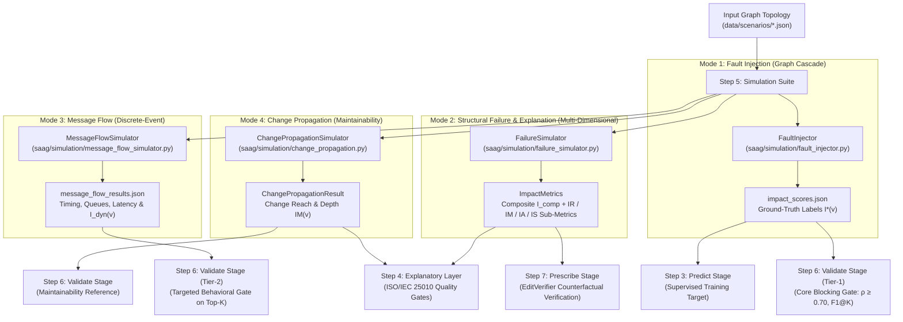
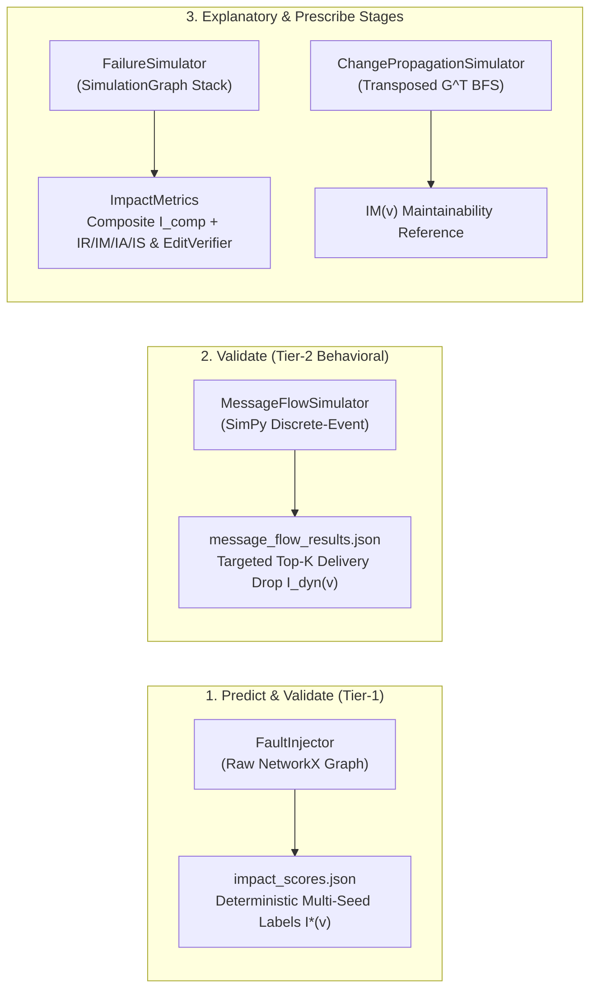
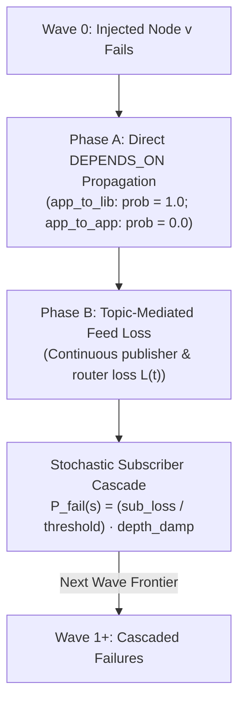
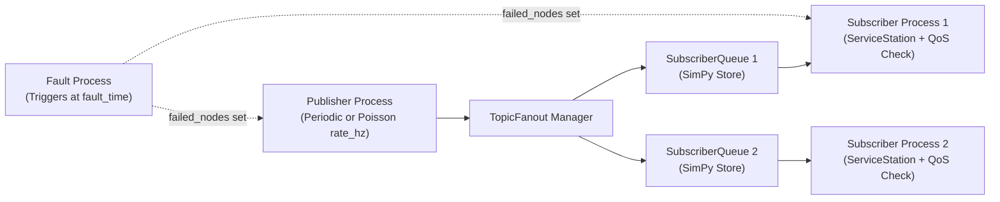

# Step 5: Simulate — Failure Simulation

**Generates simulation-derived ground-truth impact $I(v)$ to train and validate predicted architectural criticality $Q(v)$, using discrete-event and graph cascade failure engines.**

← [Step 4: Diagnose](diagnosis.md) | → [Step 6: Validate](validation.md)

---

## Table of Contents

1. [Overview & Simulation Philosophy](#1-overview--simulation-philosophy)
2. [Simulation Architecture & Engine Taxonomy](#2-simulation-architecture--engine-taxonomy)
   - 2.1 [Canonical Engine Roles & Responsibilities](#21-canonical-engine-roles--responsibilities)
3. [Mode 1: Fault Injection (`FaultInjector`)](#3-mode-1-fault-injection-faultinjector)
   - 3.1 [Dynamic Dependency Derivation](#31-dynamic-dependency-derivation)
   - 3.2 [Wave-Based Cascade Algorithm](#32-wave-based-cascade-algorithm)
   - 3.3 [Ground-Truth Impact Formulations ($I(v)$ vs. $I^*(v)$)](#33-ground-truth-impact-formulations-iv-vs-iv)
   - 3.4 [Cascade Thresholds & Multi-Broker Semantics](#34-cascade-thresholds--multi-broker-semantics)
   - 3.5 [Multi-Seed Stability & The `label_stability` Block](#35-multi-seed-stability--the-label_stability-block)
4. [Mode 2: Structural Failure Simulation (`FailureSimulator`)](#4-mode-2-structural-failure-simulation-failuresimulator)
   - 4.1 [Raw Structural Relationship Traversal](#41-raw-structural-relationship-traversal)
   - 4.2 [Composite Impact Formulation ($I_{\text{comp}}(v)$)](#42-composite-impact-formulation-i_textcompv)
   - 4.3 [Dimensional Sub-Metrics ($IR$, $IM$, $IA$, $IS$)](#43-dimensional-sub-metrics-ir-im-ia-is)
   - 4.4 [Baseline Flow Priming & Flow Disruption](#44-baseline-flow-priming--flow-disruption)
   - 4.5 [Remediation Verification & Validation Gating](#45-remediation-verification--validation-gating)
5. [Mode 3: Message Flow Simulation (`MessageFlowSimulator`)](#5-mode-3-message-flow-simulation-messageflowsimulator)
   - 5.1 [Discrete-Event SimPy Process Model](#51-discrete-event-simpy-process-model)
   - 5.2 [Two-Level Fan-Out Queue Architecture](#52-two-level-fan-out-queue-architecture)
   - 5.3 [Runtime QoS Contract Enforcement](#53-runtime-qos-contract-enforcement)
   - 5.4 [Operating Point & Load Calibration ($\rho = 0.65$)](#54-operating-point--load-calibration-rho--065)
   - 5.5 [Dynamic Behavioral Oracle ($I_{\text{dyn}}(v)$)](#55-dynamic-behavioral-oracle-i_textdynv)
   - 5.6 [Secondary Diagnostics & Rejection of Multi-Metric Composite ($I_{\text{dyn}}^{\text{comp}}$)](#56-secondary-diagnostics--rejection-of-multi-metric-composite-i_textdyntextcomp)
6. [Quality Model Alignment & Construct Grounding](#6-quality-model-alignment--construct-grounding)
7. [Worked Examples: ATM & Autonomous Vehicle (AV)](#7-worked-examples-atm--autonomous-vehicle-av)
   - 7.1 [Air Traffic Management (ATM) Scenario](#71-air-traffic-management-atm-scenario)
   - 7.2 [Autonomous Vehicle (AV) Cyber-Physical System](#72-autonomous-vehicle-av-cyber-physical-system)
8. [CLI Reference (`cli/simulate_graph.py`)](#8-cli-reference-clisimulate_graphpy)
   - 8.1 [Shared Arguments](#81-shared-arguments)
   - 8.2 [`fault-inject` Subcommand](#82-fault-inject-subcommand)
   - 8.3 [`message-flow` Subcommand](#83-message-flow-subcommand)
   - 8.4 [`combined` Subcommand](#84-combined-subcommand)
9. [Output Schemas (`impact_scores.json` & `message_flow_results.json`)](#9-output-schemas-impact_scoresjson--message_flow_resultsjson)
   - 9.1 [`impact_scores.json` (Fault Injection Ground Truth)](#91-impact_scoresjson-fault-injection-ground-truth)
   - 9.2 [`message_flow_results.json` (Dynamic Discrete-Event Results)](#92-message_flow_resultsjson-dynamic-discrete-event-results)
10. [Python API Usage](#10-python-api-usage)
    - 10.1 [Running `FaultInjector` Programmatically](#101-running-faultinjector-programmatically)
    - 10.2 [Running `FailureSimulator` Programmatically](#102-running-failuresimulator-programmatically)
    - 10.3 [Running `MessageFlowSimulator` Programmatically](#103-running-messageflowsimulator-programmatically)
11. [Known Limitations & Design Boundaries](#11-known-limitations--design-boundaries)
12. [What Comes Next](#12-what-comes-next)

---

## 1. Overview & Simulation Philosophy

The Software-as-a-Graph (SaaG) framework predicts architectural component criticality **prior to deployment** using topological graph metrics ($Q(v)$). Because real runtime failure logs do not exist pre-deployment, the framework generates objective ground-truth impact labels ($I(v)$) through **pre-deployment failure simulations**.



> [!IMPORTANT]
> **Pre-Deployment Guarantee**: All simulation modes operate strictly on the static architectural graph schema, ensuring that predictions remain completely independent of post-deployment runtime monitoring agents.

---

## 2. Simulation Architecture & Engine Taxonomy

The `saag/simulation/` package provides four specialized simulation engines tailored for distinct pipeline stages:



### 2.1 Canonical Engine Roles & Responsibilities

| Engine | Canonical Scope & Stage | Primary Output | Consumed By |
|:---|:---|:---|:---|
| **`FaultInjector`** | **Predict Stage** (Supervised labels)<br>**Validate Stage (Tier-1)** (Core blocking gate) | `impact_scores.json` $\to I^*(v)$ scalar | GNN training (`cli/train_graph.py`), LOSO evaluations, CI/CD blocking gate ($\rho \ge 0.70, F_1@K$) |
| **`MessageFlowSimulator`** | **Validate Stage (Tier-2)** (Targeted behavioral gate)<br>**Runtime Flow Stage** (Behavioral oracle) | `message_flow_results.json` $\to I_{\text{dyn}}(v)$ | Targeted Top-$K$ dynamic SLA/overflow validation, convergent validity probe (`reproduce/convergent_validity.py`) |
| **`FailureSimulator`** | **Explanatory Layer** (ISO/IEC 25010 quality gates)<br>**Prescribe / Explain Stage** (Remediation verifier) | `ImpactMetrics` $\to$ Composite $I_{\text{comp}}(v) + IR/IM/IA/IS$ sub-metrics, $I_{\text{edge}}(u,v)$ | Root-cause attribution profiles, `EditVerifier` counterfactual mutation sweeps (`saag/prescription/evaluator.py`) |
| **`ChangePropagationSimulator`** | **Explanatory Layer** (Maintainability profiling)<br>**Validate Stage** (Maintainability reference) | `ChangePropagationResult` $\to IM(v)$ | ISO/IEC maintainability quality decomposition, structural change consistency check |

> [!CAUTION]
> **Stage-Specific Separation of Engines**: `FaultInjector` outputs variance-tracked cascade training and Tier-1 validation labels ($I^*$); `MessageFlowSimulator` provides runtime behavioral flow validation ($I_{\text{dyn}}$); `FailureSimulator` provides multi-dimensional explanatory attribution and prescriptive edit verification ($I_{\text{comp}}$); and `ChangePropagationSimulator` provides maintainability change ripple ($I_M$). They are maintained separately by contract ([`tests/test_groundtruth_contract.py`](../tests/test_groundtruth_contract.py)).

---

## 3. Mode 1: Fault Injection (`FaultInjector`)

### 3.1 Dynamic Dependency Derivation

Before running failure cascades, `FaultInjector` builds an $O(1)$ pub-sub index and automatically derives missing `DEPENDS_ON` edges:
1. **App-to-App (`app_to_app`)**: If Application $A_{\text{sub}}$ subscribes to Topic $T$ published by Application $A_{\text{pub}}$, a dependency $A_{\text{sub}} \xrightarrow{\text{DEPENDS\_ON}} A_{\text{pub}}$ is derived with inherited QoS attributes.
2. **App-to-Library (`app_to_lib`)**: If Application $A$ uses Library $L$ (via `USES`), a dependency $A \xrightarrow{\text{DEPENDS\_ON}} L$ is derived with `weight = 1.0`.

### 3.2 Wave-Based Cascade Algorithm

Failure propagation executes in iterative breadth-first waves ($W_0, W_1, W_2, \dots$), starting with the injected candidate node $v \in W_0$:



#### Phase A: Direct Dependency Propagation
- If an edge $(u, v_{\text{failed}})$ is typed `app_to_lib`, dependent $u$ fails deterministically ($\text{prob} = 1.0$).
- `app_to_app` dependencies are resolved via pub-sub feed loss in Phase B ($\text{prob} = 0.0$ in Phase A).

#### Phase B: Continuous Topic Feed Loss & Subscriber Cascading
1. **Topic Feed Loss ($L(t) \in [0, 1]$)**:
   - For topics with publishers:
     $$L(t) = \min\left(1.0, \; \frac{\sum_{p \in \text{failed}(t)} \text{rate}(p, t)}{\sum_{p \in \text{all}(t)} \text{rate}(p, t)} \times \text{QoS\_factor}(t)\right)$$
   - For topics routed solely by brokers:
     $$L(t) = \min\left(1.0, \; \frac{|\text{failed\_routers}(t)|}{|\text{all\_routers}(t)|} \times \text{QoS\_factor}(t)\right)$$
2. **Average Subscriber Feed Loss ($\text{sub\_loss}(s)$)**:
   $$\text{sub\_loss}(s) = \frac{\sum_{t \in \text{subs}(s)} L(t)}{|\text{subs}(s)|}$$
3. **Stochastic Cascade Probability ($P_{\text{fail}}(s)$)**:
   If $\text{sub\_loss}(s) \ge \text{propagation\_threshold}$:
   $$P_{\text{fail}}(s) = \min\left(1.0, \; \frac{\text{sub\_loss}(s)}{\text{propagation\_threshold}}\right) \times \text{depth\_damp}$$
   $$\text{depth\_damp} = \max(0.25, \; 1.0 - \text{wave\_idx} \times 0.15)$$

---

### 3.3 Ground-Truth Impact Formulations ($I(v)$ vs. $I^*(v)$)

1. **`FaultInjector` Scalar Impact ($I^*(v)$)**:
   $$I^*(v) = \frac{\sum_{s \in \text{all\_subscribers}} \text{sub\_loss}(s)}{|\text{all\_subscribers}|}$$
   Averaged across multi-seed executions to yield the canonical supervised training target $\overline{I^*(v)}$ with associated standard deviation $\sigma(v)$.

---

### 3.4 Cascade Thresholds & Multi-Broker Semantics

- **Propagation Threshold (`--propagation-threshold`)**: Controls cascade sensitivity:
  - `0.2` (Default): Aggressive; subscriber cascades when losing $\ge 20\%$ of average feed.
  - `0.5`: Moderate; models multi-input dependencies (e.g., ATM `ConflictDetector` requiring both radar and track feeds).
  - `1.0`: Conservative; subscriber only cascades upon 100% total feed starvation.
- **Multi-Broker Redundancy**: If a topic is routed across $k$ redundant brokers, failing 1 broker results in continuous loss $L(t) = 1/k$, preventing unrealistic binary all-or-nothing drops.

---

### 3.5 Multi-Seed Stability & The `label_stability` Block

Cascade evaluation is executed across $N$ seeds (default: $\{42, 123, 456, 789, 2024\}$). The mean impact $\overline{I^*(v)}$ and standard deviation $\sigma(v)$ are recorded alongside a dataset-wide stability block:

```json
"label_stability": {
  "n_seeds": 5,
  "n_nodes": 39,
  "k_frac": 0.20,
  "mean_std": 0.0267,
  "max_std": 0.1856,
  "test_retest_spearman": 0.9802,
  "topk_jaccard": 0.6250
}
```

- **`test_retest_spearman`**: The minimum pairwise rank correlation across all seed pairs (establishes the theoretical correlation ceiling for $Q(v)$).
- **`topk_jaccard`**: The minimum pairwise overlap of top-$K$ critical components across seeds.

---

## 4. Mode 2: Structural Failure Simulation (`FailureSimulator`)

The **`FailureSimulator`** (`saag/simulation/failure_simulator.py`) is the canonical **Validate-stage oracle**. Unlike `FaultInjector`, which derives application dependencies and computes scalar cascade labels for training, `FailureSimulator` traverses the raw structural relationships of the `SimulationGraph` across physical, logical, network, and library pathways to produce multi-dimensional ISO/IEC 25010 construct decompositions.

### 4.1 Raw Structural Relationship Traversal

`FailureSimulator` evaluates multi-layer physical and logical cascades directly:
- **Physical Cascades (`RUNS_ON`)**: When a host compute node (`Node`) fails, all hosted components (`Application`, `Broker`) immediately fail.
- **Logical Cascades (`PUBLISHES_TO`, `SUBSCRIBES_TO`)**: Failing a message broker partitions routed topics; failing a publisher leads to subscriber starvation.
- **Network Cascades (`CONNECTS_TO`)**: Partitions network links between brokers and distributed endpoints.
- **Library Cascades (`USES`)**: When a shared library (`Library`) fails, all dependent applications crash.

### 4.2 Composite Impact Formulation ($I_{\text{comp}}(v)$)

Component failure impact $I_{\text{comp}}(v)$ is computed as an AHP-weighted composite of four structural degradation dimensions:

$$I_{\text{comp}}(v) = 0.35 \cdot \text{reachability\_loss} + 0.25 \cdot \text{fragmentation} + 0.25 \cdot \text{throughput\_loss} + 0.15 \cdot \text{flow\_disruption}$$

Where each term is weighted by operational severity $s(t) = w(t) \cdot \text{rate}(t)$:
1. **Reachability Loss**: Fraction of publisher-subscriber communication paths severed by the failure.
2. **Infrastructure Fragmentation**: Connectivity disruption across the graph, split between structural component count (70%) and stranded QoS message mass (30%).
3. **Throughput Loss**: QoS-weighted reduction in delivered message bandwidth across all active topics.
4. **Flow Disruption**: Disruption to end-to-end active communication flows compared to an unperturbed baseline.

> [!NOTE]
> **AHP Weight Derivation**: The weights $(0.35, 0.25, 0.25, 0.15)$ derive from an Analytic Hierarchy Process Saaty pairwise comparison matrix over the four impact criteria, regularized via shrinkage ($\lambda = 0.7$) toward a uniform prior.

### 4.3 Dimensional Sub-Metrics ($IR$, $IM$, $IA$, $IS$)

In addition to composite impact, `FailureSimulator` decomposes failure effects into ISO/IEC 25010 quality characteristics:
- **$IR(v)$ (Reliability Impact)**: Combines path reachability loss and throughput degradation.
- **$IM(v)$ (Maintainability Impact)**: Measures architectural blast radius over derived dependency fan-in and fan-out structures.
- **$IA(v)$ (Availability Impact)**: Evaluates infrastructure partition count and stranded QoS capacity.
- **$IS(v)$ (Security Impact)**: Evaluates exposed attack surface and compromised credential propagation.

### 4.4 Baseline Flow Priming & Flow Disruption

The flow disruption term (15% of $I_{\text{comp}}$) compares post-failure flow paths against an unperturbed baseline. Before running exhaustive failure sweeps, the baseline flows must be primed via:

```python
SimulationService._prime_baseline_flows(graph, sim)
```

Priming executes deterministically with zero stochastic drop probabilities, ensuring that flow disruption measures architectural vulnerability rather than RNG variance.

### 4.5 Remediation Verification & Validation Gating

`FailureSimulator` is consumed downstream by:
- **Validation Gates G1–G8** (`saag/validation/service.py`): Checks predicted criticality against simulated structural loss.
- **Remediation Acceptance** (`saag/prescription/evaluator.py`): The `EditVerifier` sweeps candidate graph refactorings against `FailureSimulator.simulate_exhaustive` to verify that proposed repairs strictly decrease $I_{\text{comp}}$ without causing regressions.

---

## 5. Mode 3: Message Flow Simulation (`MessageFlowSimulator`)

### 5.1 Discrete-Event SimPy Process Model

Built on **SimPy**, this engine models runtime message exchanges, queue occupancies, and timing latencies:



### 5.2 Two-Level Fan-Out Queue Architecture

To preserve true pub-sub semantics, `TopicFanout` maintains private `SubscriberQueue` instances for each subscriber, so one topic's backlog cannot block another's at the *queue* (BUG-MFS-1).

Each subscriber's *compute*, by contrast, is deliberately shared: every topic a subscriber reads queues for the same `ServiceStation`. This is not a regression of BUG-MFS-1 — a blocked low-priority topic accumulates in its own bounded queue rather than stalling a high-priority one — but it is the engine's only contended resource, and without it nothing in the simulation ever waits for anything else. The earlier design spawned one server per `SUBSCRIBES_TO` edge, which left utilization below ~0.2 on every corpus scenario; no QoS contract was ever binding, fault-free delivery was exactly 1.0000 everywhere, and `transport_priority` had nowhere to apply. See §5.4.

System delivery rate is normalized by total subscriber demand:

$$\text{Delivery Rate} = \frac{\text{Total Messages Delivered}}{\sum_{t \in \text{Topics}} (\text{Published}(t) \times \text{Subscribers}(t))}$$

### 5.3 Runtime QoS Contract Enforcement

Which policies are enforced is selected by `--qos-mode` (`MessageFlowSimulator.QOS_MODES`), mirroring `--qos-factor` on `fault-inject` so both oracles' QoS arms are named the same way:

| Mode | Queue capacity | Deadlines | Service order | Durability replay | Load calibration |
|:---|:---|:---|:---|:---|:---|
| `none` | flat default | off | FIFO | off | **on** |
| `contracts` | `history_depth` | on | FIFO | off | on |
| `recovery` | flat default | off | FIFO | on | on |
| `full` *(default)* | `history_depth` | on | priority | on | on |
| `legacy` | flat default | on | FIFO | off | off |

`none` keeps the load and neutralises only the policies: it is the QoS-off ablation arm, and dropping the load there would confound "QoS does nothing" with "nothing was contended".

| QoS Policy | Enforcement Mechanism in Simulation |
|:---|:---|
| **Reliability (`RELIABLE`)** | Queue overflow triggers **head-drop** (drops oldest sample to retain fresh data, matching DDS `KEEP_LAST`). The dropped sample is charged to the subscriber that lost it, so a RELIABLE topic's loss is measurable — head-drop is its *only* loss mode. |
| **Reliability (`BEST_EFFORT`)** | Queue overflow triggers **tail-drop** (incoming sample is dropped). Under contention this is strictly worse than head-drop: the server goes on to process a stale head that then misses its deadline, losing twice. |
| **History Depth (`history_depth`)** | Subscriber queue capacity under DDS `KEEP_LAST`, in `contracts` and `full`. Applied only where the depth was *declared*: an absent value stays an unconstrained reader cache rather than being forced to `DEFAULT_HISTORY_DEPTH`, because the resolver cannot distinguish "asked for 10" from "asked for nothing". An explicit `queue_size` outranks it. |
| **Durability (`durability`)** | After a fault, retained samples are replayed to surviving readers, bounded by $\min(\text{history\_depth}, \text{messages lost})$. `VOLATILE` retains nothing; `TRANSIENT_LOCAL` recovers only while a co-publisher survives (its history died with the writer); `TRANSIENT` and `PERSISTENT` recover even from an orphaned topic. The effect is monotone in `QoSPolicy.DURABILITY_SCORES`. |
| **Transport Priority (`transport_priority`)** | Orders service at the subscriber's `ServiceStation` in `full` mode, via `simpy.PriorityResource`. Lowest-value-first and stable within a class, so every other mode degenerates cleanly to FIFO. |
| **Deadline (`deadline_ms`)** | End-to-end check: $(\text{time}_{\text{processed}} - \text{time}_{\text{created}}) > \text{deadline} \to \text{Violation}$. A replayed sample keeps its original timestamp under `--replay-deadline original`, so a declared deadline rejects it: **durability recovers state, not timeliness.** `reset` is the sensitivity arm. |
| **Lifespan (`lifespan_ms`)** | Expired samples are silently discarded upon dequeue. Note this path is unexercised when `lifespan_ms` is not declared on corpus topics. |

### 5.4 Operating Point & Load Calibration ($\rho = 0.65$)

No QoS contract can bind on an idle system, and raw corpus scenarios are idle: subscriber arrival rates span 1–2600 Hz across scenarios while service was a flat 1 ms, leaving utilization below ~0.2 everywhere. `--target-utilization` (default 0.65) sizes each subscriber's service rate to its own offered load, $E[S_s] = \rho / \Lambda_s$, so $\rho$ means the same operational state on a 1 Hz scenario as on a 700 Hz one — the property a swept parameter needs for a cross-scenario table to mean anything. `measured_utilization` on the result reports what was actually realised.

Above $\rho \approx 0.8$ run-to-run variance grows faster than the signal ($I_{\text{dyn}}$'s own test-retest falls from 0.93 at $\rho = 0.65$ to 0.89 at $\rho = 0.8$), and below $\rho \approx 0.5$ nothing is contended.

### 5.5 Dynamic Behavioral Oracle ($I_{\text{dyn}}(v)$)

$I_{\text{dyn}}(v)$ measures the empirical delivery loss inflicted on **surviving** components:

$$I_{\text{dyn}}(v) = \text{DeliveryRate}_{\text{pre-fault}} - \text{DeliveryRate}_{\text{post-fault}}$$

Computed with surviving node receipts in the numerator and continuous demand in the denominator. Both windows bucket on a message's *creation* time, so numerator and denominator describe the same population; the result is deliberately **not** clamped to $[0, 1]$, because under contention removing a chatty publisher can relieve more load than it removes feeds, and a negative $I_{\text{dyn}}$ there is a real measurement.

Mean $\rho(I_{\text{dyn}}, I^*) = 0.620$ across the twelve LOSO folds (`results/convergent_validity.json`, Application population, five seeds, `qos_mode=full` at $\rho_{\text{util}} = 0.65$). **Read that number with its ceiling**: $I^*$'s own seed-to-seed test-retest across the same folds is 0.817–1.000 (median 0.979), so $I_{\text{dyn}}$ agrees with $I^*$ distinctly *less* closely than $I^*$ agrees with itself — which is what a corroborating oracle should do. An oracle that matched $I^*$ to within label noise would be re-measuring the topology, not testing it. $I_{\text{dyn}}$ serves as a convergent-validity probe demonstrating that the topological ranking survives dynamic discrete-event traffic; see §11 L7.

Two qualifications travel with it. Restricted to components both oracles score non-zero, agreement falls to $\rho^{+} = 0.441$, so a substantial share of the headline figure is the two oracles concurring on which components are harmless. And the configuration is load-bearing. Measured on the seven core scenarios so the arms are paired on one population, the uncalibrated `legacy` policy returns $\rho = 0.686$ where `full` returns $0.638$ — the uncalibrated figure is the flattering one, and it is inflated rather than better: at high publication rates under a flat service time almost no delivery loss is measurable, so on `financial_trading_system` the maximum $I_{\text{dyn}}$ is 0.037 and the correlation degenerates to noise ($\rho^{+} = 0.003$). Any result quoted from this oracle must name its `qos_mode` and whether calibration was active; both are recorded in the artifact's provenance block.

### 5.6 Secondary Diagnostics & Rejection of Multi-Metric Composite ($I_{\text{dyn}}^{\text{comp}}$)

While `MessageFlowSimulator` collects extensive runtime diagnostics—including tail latency degradation ($\Delta L_{p95}$), Latency Inflation Factor ($\text{LIF}$), Deadline Violation Rate ($\text{DVR} / \Delta\text{SLA}$), and Queue Overflow counts—empirical evaluation across both low-rate (`healthcare_system`) and high-rate (`financial_trading_system`) scenarios demonstrates why these cannot be aggregated into a composite damage score ($I_{\text{dyn}}^{\text{comp}}$):

1. **Systemic Negative Correlation (Contention Relief vs. Feed Loss)**:
   In distributed publish-subscribe architectures, failing a publisher removes its offered traffic. On contended subscribers, this relieves queueing pressure: post-fault tail latencies decrease ($\Delta L_{p95} < 0$, e.g., mean $-0.13\text{ ms}$ on `financial_trading_system`) and deadline violations fall ($\Delta\text{SLA} < 0$). Every secondary metric correlates **negatively** with delivery loss $I_{\text{dyn}}$:
   - $\Delta L_{p95}$ vs. $I_{\text{dyn}}$: $\rho = -0.499$ ($p = 0.069$)
   - $\text{LIF}$ vs. $I_{\text{dyn}}$: $\rho = -0.518$ ($p = 0.058$)
   - $\text{DVR} / \Delta\text{SLA}$ vs. $I_{\text{dyn}}$: $\rho = -0.418$ ($p = 0.137$)

   Each of the three is recomputable from `FaultEventRecord` alone — `delta_latency_p95`, `latency_inflation_factor` and `delta_deadline_violations` respectively — so the sign of the effect can be re-derived from any saved run.

   An additive composite $I_{\text{dyn}}^{\text{comp}} = w_A \Delta\text{DR} + w_L \Delta L_{p95} + w_D \Delta\text{SLA} + \dots$ with positive weights would sum anti-correlated quantities, structurally cancelling the damage signal and reducing discriminative ranking accuracy.

2. **Severe Scenario-Dependent SNR Discrepancy**:
   On low-rate scenarios ($\sim 1\text{--}10\text{ Hz}$), within-node seed noise ($\sigma_{\text{seed}} \approx 79.4\text{ ms}$) swamps across-node variation ($\sigma_{\text{across}} \approx 20.9\text{ ms}$), producing $\text{SNR} = 0.26$. On high-rate scenarios ($\sim 700\text{ Hz}$), $\text{SNR}$ reaches $2.68$, but resolves consistently negative deltas (contention relief). A metric whose SNR swings by an order of magnitude cannot serve as a cross-scenario ranking label.

3. **Structural Neutralization of Saturation & Starvation**:
   Saturation- and starvation-flavoured metrics (buffer drop rates, starvation ratios, fairness indices) have no headroom to vary at the corpus operating point, because per-subscriber calibration bounds every queue by construction: sizing $E[S_s] = \rho / \Lambda_s$ at $\rho = 0.65$ (§5.4) holds each station below saturation whatever its offered load. A metric that is pinned near its floor by the experimental design cannot discriminate between components under it. `measured_utilization` on every result records where each station actually landed, so the claim is checkable per run rather than assumed — and it bounds the argument in the safe direction, since stations that undershoot $\rho$ are further from saturation still.

**Conclusion**: $I_{\text{dyn}}$ remains strictly 1-dimensional (unweighted delivery rate loss), operating at $\text{SNR} = 1.46\text{--}95.8$. Secondary metrics are exposed in `FaultEventRecord` exclusively as per-scenario runtime diagnostics.

---

## 6. Quality Model Alignment & Construct Grounding

The simulation suite maps observed metrics to ISO/IEC 25010 & 25019 quality constructs:

| Quality Characteristic | Observed Simulation Attribute | Metric / Artifact Source |
|:---|:---|:---|
| **Effectiveness** (Availability & Fault Tolerance) | Message delivery rates, dropped packet fractions & path reachability | `FaultInjector.sub_loss`, `FailureSimulator.reachability_loss`, `MessageFlowSimulator.system_delivery_rate` |
| **Efficiency** (Time Behavior & Capacity) | Queue occupancies, throughput loss & end-to-end latency percentiles | `FailureSimulator.throughput_loss`, `MessageFlowSimulator.latency_p50 / p95` |
| **Freedom from Risk** (Contract Integrity) | Graph fragmentation, QoS deadline violations & subscriber starvation | `FailureSimulator.fragmentation`, `MessageFlowSimulator.qos_violations_count` |
| **Modularity & Maintainability** (Architectural Blast Radius) | Derived dependency fan-in/fan-out, library blast radius | `FailureSimulator.maintainability_impact` ($IM(v)$) |

---

## 7. Worked Examples: ATM & Autonomous Vehicle (AV)

### 7.1 Air Traffic Management (ATM) Scenario

```
RadarTracker ──PUBLISHES_TO──▶ T_radar   ──SUBSCRIBES_TO──▶ ConflictDetector
             ──PUBLISHES_TO──▶ T_tracks  ──SUBSCRIBES_TO──▶ ConflictDetector, ATCWorkstation, FlightDataProcessor

FlightDataProcessor ──PUBLISHES_TO──▶ T_fpa ──SUBSCRIBES_TO──▶ ATCWorkstation
ConflictDetector    ──PUBLISHES_TO──▶ T_conflicts ──SUBSCRIBES_TO──▶ ATCWorkstation
ASTERIX_Broker      ──ROUTES────────▶ All Topics
```

#### Simulated Fault Impact Ranking

| Component | $I^*(v)$ | Cascade Depth | Architectural Rationale |
|:---|:---:|:---:|:---|
| `RadarTracker` | **1.000** | 1 | Sole producer of `T_radar` and `T_tracks`; starves `ConflictDetector` and `FlightDataProcessor`, triggering full cascade to `ATCWorkstation`. |
| `ASTERIX_Broker`| **1.000** | 1 | Sole routing broker for all system topics; partitions the entire graph. |
| `ConflictDetector`| **0.111** | 0 | Orphans `T_conflicts` only; `ATCWorkstation` loses 1 of 3 input feeds. |
| `FlightDataProcessor`| **0.111** | 0 | Orphans `T_fpa` only; `ATCWorkstation` loses 1 of 3 input feeds. |
| `ATCWorkstation`| **0.000** | 0 | Pure leaf consumer; failure inflicts zero downstream impact. |

### 7.2 Autonomous Vehicle (AV) Cyber-Physical System

* **Graph Scale:** $|V| = 152$ nodes (80 Applications, 20 Libraries, 40 Topics, 4 Brokers, 8 ECUs/Nodes) and $|E| = 730$ directed edges.
* **Domain Context:** Real-time ROS 2 / DDS architecture with sensor fusion pipelines (LiDAR, Camera, Radar), SLAM, path planning, and strict 20 ms actuation deadlines.

#### Multi-Oracle Stratification Across Architectural Layers

| Architectural Layer / Stratum | Evaluated $N$ | Mean $I^*$ (FaultInjector) | Mean $I_{\text{comp}}$ (FailureSimulator) | Mean $I_{\text{dyn}}$ (MessageFlow) |
|:---|:---:|:---:|:---:|:---:|
| **Infrastructure (Nodes / ECUs)** | 8 | — (unlabeled) | 0.2713 | — (unobservable) |
| **Application (Shared Libraries)** | 20 | 0.9436 | 0.0000 | — (unobservable) |
| **Middleware (Message Brokers)** | 4 | 0.4882 | 0.0945 | — (unobservable) |
| **Application (Microservices)** | 80 | 0.1905 | 0.0119 | 0.1842 |
| **Entire System (Pooled)** | 112 | 0.3821 | 0.0381 | — |

The three oracles measure complementary aspects:
- `FaultInjector` produces $I^*(v)$ for GNN supervision, deriving app-to-library dependencies so libraries exhibit high impact.
- `FailureSimulator` evaluates multi-layer structural loss across compute nodes, brokers, and applications.
- `MessageFlowSimulator` evaluates continuous runtime delivery loss $I_{\text{dyn}}(v)$ over active message paths under QoS contracts.

---

## 8. CLI Reference (`cli/simulate_graph.py`)

### 8.1 Shared Arguments

```bash
--input PATH      # Path to scenario JSON (or use --layer <name>)
--output DIR      # Output directory (default: output/simulation/)
--export-json     # Write full JSON and summary text reports
--verbose / -v    # Enable debug logging
```

### 8.2 `fault-inject` Subcommand

```bash
# Full multi-seed cascade simulation
PYTHONPATH=. python cli/simulate_graph.py fault-inject     --input data/scenarios/atm_system.json     --seeds 42,123,456,789,2024     --propagation-threshold 0.2     --qos-factor ladder     --export-json
```

### 8.3 `message-flow` Subcommand

```bash
# Inject broker fault at midpoint (t = 150s)
PYTHONPATH=. python cli/simulate_graph.py message-flow     --input data/scenarios/atm_system.json     --duration 300     --fault-node ConflictDetector     --fault-time 150     --qos-mode full     --export-json
```

### 8.4 `combined` Subcommand

```bash
# Run both cascade fault injection and message-flow sequentially
PYTHONPATH=. python cli/simulate_graph.py combined     --input data/scenarios/atm_system.json     --seeds 42,123,456,789,2024     --node-types Application,Broker,Library     --duration 300 --fault-node ConflictDetector     --export-json
```

---

## 9. Output Schemas (`impact_scores.json` & `message_flow_results.json`)

### 9.1 `impact_scores.json` (Fault Injection Ground Truth)

```json
{
  "schema_version": "2.1",
  "graph_id": "atm_system",
  "labeler": "FaultInjector",
  "labeled_node_types": ["Application", "Broker", "Library"],
  "labeled_dimensions": ["composite", "reliability"],
  "unlabeled_node_ids": ["N0", "N1", "N2"],
  "label_stability": {
    "n_seeds": 5,
    "test_retest_spearman": 0.9802,
    "topk_jaccard": 0.6250
  },
  "top_k_by_impact": [
    {
      "rank": 1,
      "node_id": "RadarTracker",
      "node_type": "Application",
      "impact_score": 1.0,
      "cascade_depth": 1,
      "orphaned_topics": 4,
      "impacted_subscribers": 3,
      "impact_score_std": 0.0
    }
  ]
}
```

### 9.2 `message_flow_results.json` (Dynamic Discrete-Event Results)

```json
{
  "schema_version": "2.0",
  "graph_id": "atm_system",
  "simulation_duration": 300.0,
  "system_delivery_rate": 0.9975,
  "qos_mode": "full",
  "target_utilization": 0.65,
  "utilization_mode": "per_subscriber",
  "service_distribution": "exponential",
  "measured_utilization": {"ConflictDetector": 0.6478, "TrackDisplay": 0.6512},
  "service_time_s": {"ConflictDetector": 0.0129, "TrackDisplay": 0.0093},
  "fault_event": {
    "fault_time": 150.0,
    "faulted_node_id": "ConflictDetector",
    "delivery_rate_before": 0.9977,
    "delivery_rate_after": 0.9962,
    "latency_p50_before": 2.1,
    "latency_p50_after": 8.7
  }
}
```

---

## 10. Python API Usage

### 10.1 Running `FaultInjector` Programmatically

```python
import networkx as nx
from pathlib import Path
from saag.simulation.fault_injector import FaultInjector

# Initialize injector with multi-seed configuration
injector = FaultInjector(
    graph=graph,
    seeds=[42, 123, 456, 789, 2024],
    propagation_threshold=0.2,
    qos_factor_mode="ladder"
)

# Run simulation on eligible architectural node types
result = injector.run(node_types=["Application", "Broker", "Library"])
result.save(Path("output/simulation/impact_scores.json"))

print(f"Top Critical: {result.top_k_by_impact[0]['node_id']} "
      f"(I* = {result.top_k_by_impact[0]['impact_score']:.4f})")
```

### 10.2 Running `FailureSimulator` Programmatically

```python
from pathlib import Path
from saag.simulation.graph import SimulationGraph
from saag.simulation.failure_simulator import FailureSimulator
from saag.simulation.service import SimulationService

# Wrap graph in SimulationGraph
sim_graph = SimulationGraph(graph_data)
sim = FailureSimulator(sim_graph, qos_weighting=True)

# Prime baseline flows so flow disruption (15%) is measurable
SimulationService._prime_baseline_flows(sim_graph, sim)

# Run exhaustive failure sweep
results = sim.simulate_exhaustive(seed=42)
for r in results[:5]:
    print(f"Node: {r.target_id} -> I_comp = {r.impact.composite_impact:.4f} "
          f"(Reachability: {r.impact.reachability_loss:.4f})")
```

### 10.3 Running `MessageFlowSimulator` Programmatically

```python
from pathlib import Path
from saag.simulation.message_flow_simulator import MessageFlowSimulator

sim = MessageFlowSimulator(
    graph=graph,
    duration=300.0,
    fault_node="ConflictDetector",
    fault_time=150.0,
    seed=42,
    qos_mode="full",
    target_utilization=0.65
)

result = sim.run()
result.save(Path("output/simulation/message_flow_results.json"))

if result.fault_event:
    print(f"Delivery Drop: {result.fault_event.delivery_rate_before:.4f} -> "
          f"{result.fault_event.delivery_rate_after:.4f}")
```

---

## 11. Known Limitations & Design Boundaries

| # | Boundary / Limitation | Methodological Scope & Handling |
|:---|:---|:---|
| **L1** | **Host Node & Library Cascades Across Engines** | `FailureSimulator` natively cascades host failures via `RUNS_ON` and library failures via `USES`. `FaultInjector` dynamically derives `DEPENDS_ON(app_to_lib)` for libraries, but compute hardware nodes are omitted from default application-level training labels. |
| **L2** | **Unmeasured Maintainability Dimension in $I^*$** | `FaultInjector` measures operational cascade reach ($IR$ / composite). Maintainability ground truth ($IM(v)$) is supplied by `FailureSimulator` in Step 6. |
| **L3** | **Single Fault per Simulation** | Simulators evaluate one candidate component failure per run; multi-failure cascades model cascading effects rather than concurrent disjoint failures. |
| **L4** | **Discrete-Event Tail Latency & Operating Point** | Under calibrated utilization ($\rho = 0.65$), queue contention is active. However, tail-latency variance across seeds has $\text{SNR} \approx 0.26$ ($\sigma_{\text{seed}} \approx 79\text{ ms} > \sigma_{\text{across}} \approx 21\text{ ms}$), so delivery rate drop remains the sole stable discriminative metric. |
| **L5** | **Edge Ground Truth Scope** | Edge impact is evaluated via single-edge removal sweeps ($\Delta \text{Impact}$) with unmeasured edges marked `evaluated: false`. |
| **L6** | **Counterfactual Search Cost** | Sweeps score the graph *as it stands* cheaply, but evaluating candidate architectural repairs costs one exhaustive sweep per (edit × threshold × seed). Remediation is thus structured as proposal followed by simulated verification rather than search-by-simulation — see [criticality.md §7.2.1](criticality.md#721-why-a-predictor-rather-than-the-oracle). |
| **L7** | **$I_{\text{dyn}}$ is a convergent-validity probe, not an independent oracle** | It is behavioural where $I^*$ is topological, but both traverse the same graph, and subscriber-side dynamics over the same topology cannot be fully independent of a topological oracle. That structural argument is what limits the claim, and it holds whatever the correlation turns out to be: report $I_{\text{dyn}}$ as convergent validity, never as independent predictive validation. **The disattenuated estimate previously quoted here ($\approx 0.94\text{--}0.97$) is withdrawn**: it was derived from the superseded $\rho = 0.907$, and re-deriving it requires a fresh test-retest reliability for $I_{\text{dyn}}$ under `qos_mode=full` on the twelve-fold cohort, which has not been measured. The observed $\rho = 0.620$ is now well below $I^*$'s own reproducibility, so the earlier reading — that near-ceiling agreement left $I_{\text{dyn}}$ no room to falsify anything $I^*$ would not — no longer follows from the data. |
| **L8** | **Broker and host Nodes are unobservable to $I_{\text{dyn}}$** | `MessageFlowSimulator` models publisher, topic, and subscriber interactions only; faulting a Broker (`ROUTES`) or a `Node` (`RUNS_ON`) has no direct messaging process. Such components are omitted from evaluated sets rather than scored 0.0. |

---

## 12. What Comes Next

Simulation ground-truth files (`impact_scores.json` and `message_flow_results.json`) are consumed downstream:
- **[Step 3: Predict](prediction.md)** trains GNN models on $I^*(v)$ cascade labels.
- **[Step 6: Validate](validation.md)** executes statistical correlation gates (Spearman $\rho \ge 0.70$, $F_1\text{@top-}K$) validating topological $Q(v)$ and GNN predictions against simulated structural impact ($I_{\text{comp}}$) and dynamic behavioral flow ($I_{\text{dyn}}$).

---

← [Step 4: Diagnose](diagnosis.md) | → [Step 6: Validate](validation.md)
