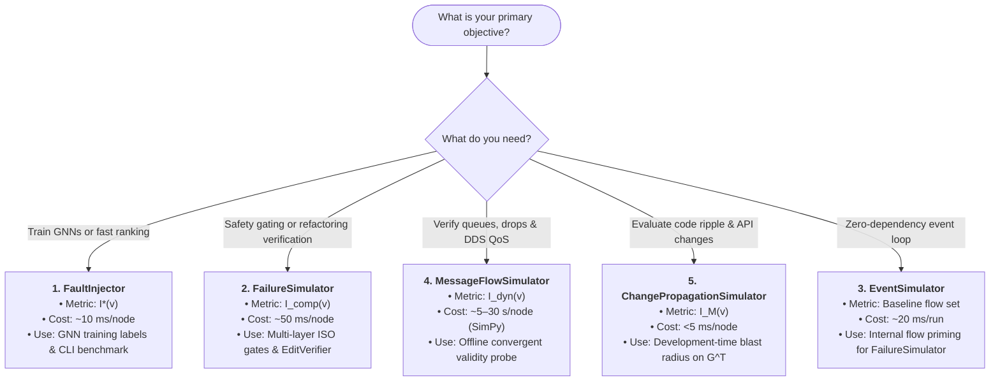
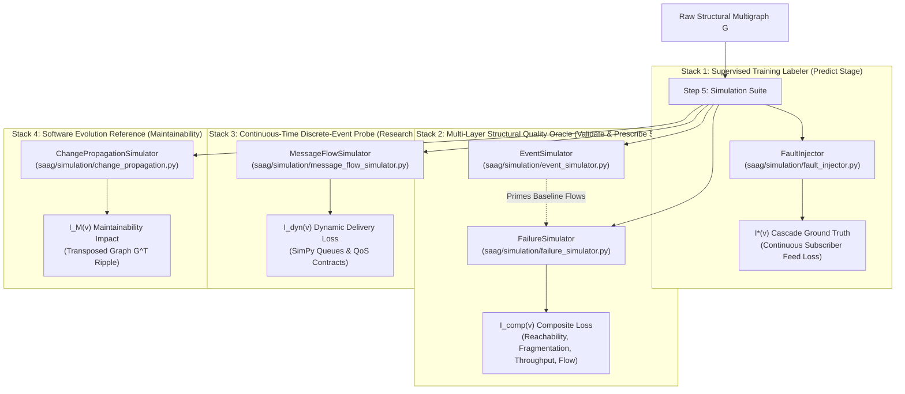
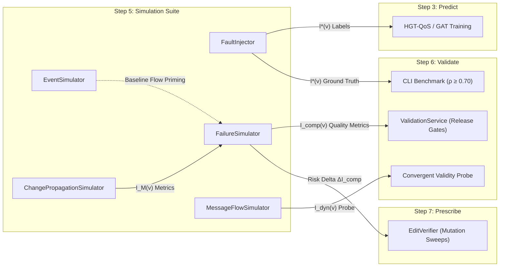
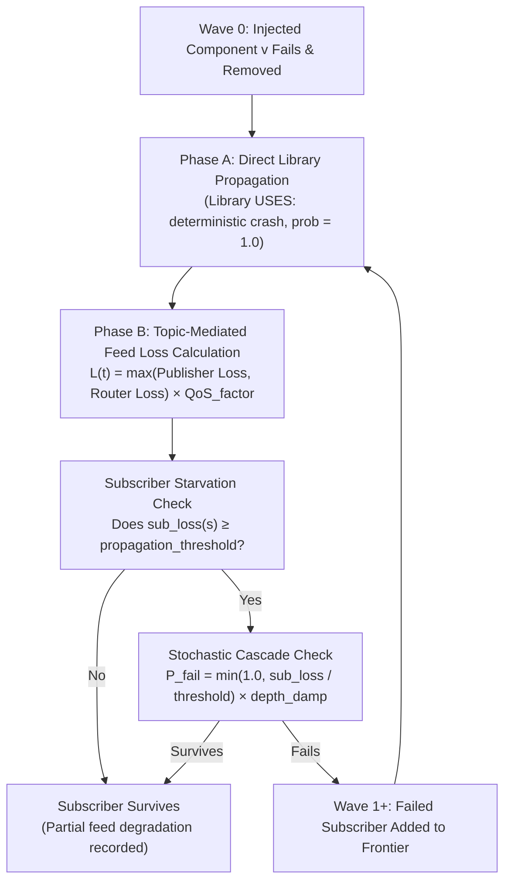
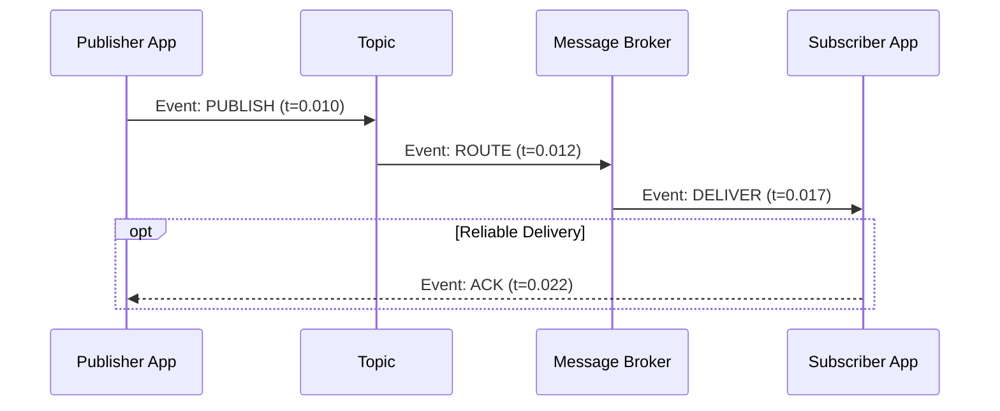
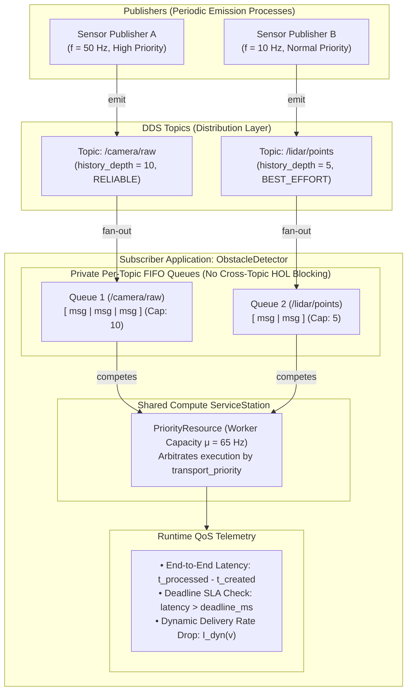
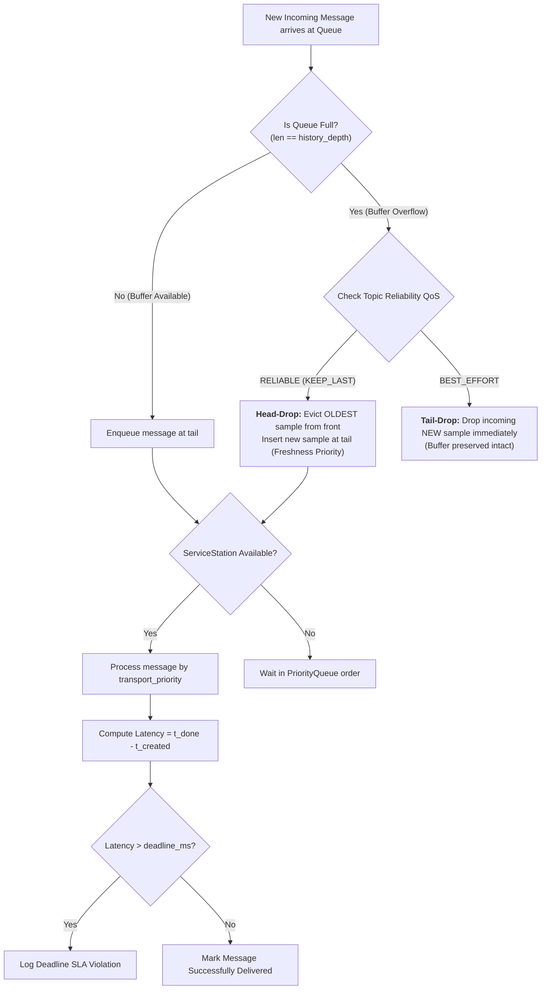
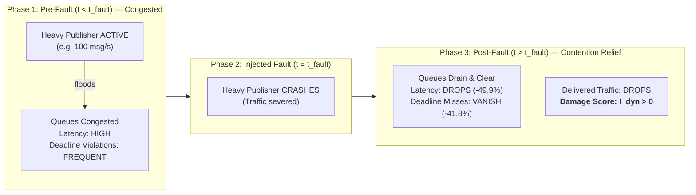

# Step 5: Simulate — Pre-Deployment Failure & Event Simulation

**Generate empirical ground-truth impact metrics ($I^*(v)$, $I_{\text{comp}}(v)$, $I_{\text{dyn}}(v)$, $I_M(v)$) through controlled cascade, structural, and discrete-event simulations to train, validate, and verify architectural dependability.**

← [Step 4: Diagnose](diagnosis.md) | [README](../README.md) | **Step 5: Simulate** | → [Step 6: Validate](validation.md)

---

## Table of Contents

1. [Overview & The Pre-Deployment Cold-Start Problem](#1-overview--the-pre-deployment-cold-start-problem)
2. [The Five Simulation Engines at a Glance](#2-the-five-simulation-engines-at-a-glance)
   - 2.1 [Decision Guide: Choose Your Simulator](#21-decision-guide-choose-your-simulator)
   - 2.2 [Demystifying Terminology: Fault vs. Failure vs. Event vs. Flow vs. Change](#22-demystifying-terminology-fault-vs-failure-vs-event-vs-flow-vs-change)
   - 2.3 [The Four Paper Oracles vs. One Supporting Engine](#23-the-four-paper-oracles-vs-one-supporting-engine)
   - 2.4 [Comparative Engine Matrix](#24-comparative-engine-matrix)
3. [Lifecycle Integration: Where Simulators Fit in SaG](#3-lifecycle-integration-where-simulators-fit-in-sag)
4. [Engine 1: `FaultInjector` (Fast Cascade Reachability — Primary Oracle $I^*$)](#4-engine-1-faultinjector-fast-cascade-reachability--primary-oracle-i)
   - 4.1 [Quick Facts](#41-quick-facts)
   - 4.2 [Intuition & Step-by-Step Wave Algorithm ($W_0, W_1, \dots$)](#42-intuition--step-by-step-wave-algorithm-w_0-w_1-dots)
   - 4.3 [Mathematical Formulation ($I^*(v)$)](#43-mathematical-formulation-iv)
   - 4.4 [Multi-Broker Redundancy & Cascade Thresholds](#44-multi-broker-redundancy--cascade-thresholds)
   - 4.5 [How to Run `FaultInjector`](#45-how-to-run-faultinjector)
   - 4.6 [Output Schema Snippet (`impact_scores.json`)](#46-output-schema-snippet-impact_scoresjson)
   - 4.7 [Academic Provenance & Label Stability](#47-academic-provenance--label-stability)
5. [Engine 2: `FailureSimulator` (Multi-Layer Structural & Quality Impact — Oracle $I_{\text{comp}}$)](#5-engine-2-failuresimulator-multi-layer-structural--quality-impact--oracle-i_textcomp)
   - 5.1 [Quick Facts](#51-quick-facts)
   - 5.2 [Intuition & Multi-Layer Structural Traversal](#52-intuition--multi-layer-structural-traversal)
   - 5.3 [Composite Impact Formulation ($I_{\text{comp}}(v)$) & Visual Breakdown](#53-composite-impact-formulation-i_textcompv--visual-breakdown)
   - 5.4 [ISO/IEC 25010 Quality Decompositions ($IR, IM, IA, IFT$)](#54-isoiec-25010-quality-decompositions-ir-im-ia-ift)
   - 5.5 [Flow Disruption & Baseline Flow Priming](#55-flow-disruption--baseline-flow-priming)
   - 5.6 [Relationship Criticality ($I_{\text{edge}}(u,v)$)](#56-relationship-criticality-i_textedgeuv)
   - 5.7 [How to Run `FailureSimulator`](#57-how-to-run-failuresimulator)
   - 5.8 [Academic Provenance & Quality Gating Roles](#58-academic-provenance--quality-gating-roles)
6. [Engine 3: `EventSimulator` (Built-In Discrete-Event Engine — Supporting Baseline)](#6-engine-3-eventsimulator-built-in-discrete-event-engine--supporting-baseline)
   - 6.1 [Quick Facts](#61-quick-facts)
   - 6.2 [Intuition & Zero-Dependency Event Loop](#62-intuition--zero-dependency-event-loop)
   - 6.3 [Poisson Failures, Recoveries & M/G/1 Arrivals](#63-poisson-failures-recoveries--mg1-arrivals)
   - 6.4 [Primary Role: Baseline Flow Generation for `FailureSimulator`](#64-primary-role-baseline-flow-generation-for-failuresimulator)
   - 6.5 [How to Run `EventSimulator`](#65-how-to-run-eventsimulator)
7. [Engine 4: `MessageFlowSimulator` (High-Fidelity Queuing & QoS — Dynamic Probe $I_{\text{dyn}}$)](#7-engine-4-messageflowsimulator-high-fidelity-queuing--qos--dynamic-probe-i_textdyn)
   - 7.1 [Quick Facts](#71-quick-facts)
   - 7.2 [Intuition & SimPy Architecture](#72-intuition--simpy-architecture)
   - 7.3 [Private Topic Queues vs. Shared Compute Server](#73-private-topic-queues-vs-shared-compute-server)
   - 7.4 [Runtime DDS QoS Contract Enforcement](#74-runtime-dds-qos-contract-enforcement)
   - 7.5 [Load Calibration ($\rho = 0.65$) & Operating Points](#75-load-calibration-rho--065--operating-points)
   - 7.6 [Dynamic Delivery Loss ($I_{\text{dyn}}(v)$) & The Contention-Relief Phenomenon](#76-dynamic-delivery-loss-i_textdynv--the-contention-relief-phenomenon)
   - 7.7 [How to Run `MessageFlowSimulator`](#77-how-to-run-messageflowsimulator)
   - 7.8 [Output Schema Snippet (`message_flow_results.json`)](#78-output-schema-snippet-message_flow_resultsjson)
   - 7.9 [Academic Provenance: Convergent-Validity Research Probe](#79-academic-provenance-convergent-validity-research-probe)
8. [Engine 5: `ChangePropagationSimulator` (Maintainability Reference — Oracle $I_M$)](#8-engine-5-changepropagationsimulator-maintainability-reference--oracle-i_m)
   - 8.1 [Quick Facts](#81-quick-facts)
   - 8.2 [Runtime Failure vs. Development-Time Interface Change](#82-runtime-failure-vs-development-time-interface-change)
   - 8.3 [Transposed Graph Traversal ($G^\top$) & Stop Conditions](#83-transposed-graph-traversal-gtop--stop-conditions)
   - 8.4 [Maintainability Impact ($I_M(v)$)](#84-maintainability-impact-i_mv)
   - 8.5 [How to Run `ChangePropagationSimulator`](#85-how-to-run-changepropagationsimulator)
   - 8.6 [Academic Provenance: Multi-Task Loss Dimension Masking](#86-academic-provenance-multi-task-loss-dimension-masking)
9. [Quality Model Alignment (ISO/IEC 25010 & 25019)](#9-quality-model-alignment-isoiec-25010--25019)
10. [Worked Examples](#10-worked-examples)
    - 10.1 [Air Traffic Management (ATM) Step-by-Step Cascade](#101-air-traffic-management-atm-step-by-step-cascade)
    - 10.2 [Autonomous Vehicle (AV) Multi-Oracle Stratification](#102-autonomous-vehicle-av-multi-oracle-stratification)
11. [Programmatic Python API Quickstart](#11-programmatic-python-api-quickstart)
12. [CLI Reference (`cli/simulate_graph.py`)](#12-cli-reference-clisimulate_graphpy)
13. [Output Schemas Reference](#13-output-schemas-reference)
14. [Methodological Boundaries & Design Invariants](#14-methodological-boundaries--design-invariants)
15. [What Comes Next](#15-what-comes-next)

---

```
┌─────────────────────────────────────────────────────────────────────────────┐
│                             STEP 5 AT A GLANCE                              │
├───────────────────┬─────────────────────────────────────────────────────────┤
│ Primary Input     │ G_structural — the RAW physical multigraph only.        │
│                   │ Never the derived DEPENDS_ON edges. This boundary is    │
│                   │ what keeps labels independent of the features.          │
├───────────────────┼─────────────────────────────────────────────────────────┤
│ Core Suite        │ Five simulators in saag/simulation/, answering distinct │
│                   │ architectural questions at different fidelities.        │
├───────────────────┼─────────────────────────────────────────────────────────┤
│ Key Operations    │ 1. Crash each component in turn.                        │
│                   │ 2. Propagate cascade across physical, network, logical, │
│                   │    and software layers.                                 │
│                   │ 3. Record resulting operational damage.                 │
│                   │ 4. Average across 5 random seeds; verify stability.     │
├───────────────────┼─────────────────────────────────────────────────────────┤
│ Primary Outputs   │ • I*(v)     — primary GNN training label & ranking.     │
│                   │ • I_comp(v) — Validate quality gates & Prescribe edits. │
│                   │ • I_dyn(v)  — offline convergent-validity probe.        │
│                   │ • I_M(v)    — maintainability blast radius reference.   │
├───────────────────┼─────────────────────────────────────────────────────────┤
│ Pipeline Role     │ This is Step 5, but Step 3 CONSUMES its output offline. │
│                   │ The pipeline is a DAG: Simulate produces training       │
│                   │ labels offline, Predict reads them from disk.           │
├───────────────────┼─────────────────────────────────────────────────────────┤
│ Downstream Handoff│ • Step 3 (Predict): I*(v) supervised labels.            │
│                   │ • Step 6 (Validate): ground-truth comparison oracle.    │
│                   │ • Step 7 (Prescribe): counterfactual edit verification. │
└───────────────────┴─────────────────────────────────────────────────────────┘
```

> [!NOTE]
> **JSS Manuscript Mapping & Pipeline Nomenclature:**
> - **Eight Steps vs. Four Stages:** This repository numbers eight executable pipeline steps (Model, Analyze, Predict, Diagnose, Simulate, Validate, Prescribe, Visualize). The companion JSS manuscript describes a four-stage formulation (Typed Multigraph $\to$ QoS Dependency Projection $\to$ Heterogeneous Graph Learning $\to$ Explainable Quality Attribution).
> - **Two Evaluation Arms:** The documentation uses **Pathway B** for the learned ranking arm (`PredictiveUseCase`) and **Pathway A** for the deterministic diagnostic arm (`DiagnosticUseCase`). In the paper, these are termed the **Predictive Pathway** (§4) and the **Explanation Layer** (§5).
> - **Simulator-Derived Labels:** No oracle is validated against live production outages; all labels in this framework are simulator-derived under controlled graph configurations.

---

## 1. Overview & The Pre-Deployment Cold-Start Problem

In distributed, event-driven architectures (e.g., ROS 2 robotics, microservice meshes, aerospace flight controls, financial trading backbones), identifying critical components and architectural bottlenecks is vital **before deployment**.

In an existing production system, site reliability engineers inspect historical crash traces and distributed APM telemetry. However, **prior to deployment, no crash logs exist**:
- How do we know which microservice failure will bring down the vehicle?
- How do we know which message broker is a single point of failure?
- How do we train graph neural networks to predict blast radius without production outage data?

To solve this pre-deployment cold-start challenge, Software-as-a-Graph (SaG) executes **controlled pre-deployment simulations**:
1. We ingest the architectural graph manifest (nodes, topics, brokers, libraries, hardware hosts, and QoS delivery contracts).
2. We systematically inject synthetic component failures.
3. We observe and record the resulting cascade across physical, network, logical, and software layers.
4. The observed operational damage becomes an objective, empirical **ground-truth impact score** used to train predictive models, evaluate safety gates, and verify automated refactoring prescriptions.

```
┌──────────────────────────┐     Systematic Injection     ┌────────────────────────────┐
│   Architectural Graph    │  ─────────────────────────►  │    Ground-Truth Impact     │
│ (Nodes, Topics, Brokers) │      Simulation Engine       │ Scores: I*(v), I_comp(v)   │
└──────────────────────────┘                              └────────────────────────────┘
                                                                        │
                                                                        ▼
                                                          • Supervised GNN Training
                                                          • Empirical Safety Gating
                                                          • Counterfactual Verification
```

> [!IMPORTANT]
> **The Input–Label Independence Guarantee:**
> All simulation engines operate strictly on the **raw structural multigraph** ($G_{\text{structural}}$). They never read the derived logical dependencies (`DEPENDS_ON`) that predictive and explanatory algorithms consume. This strict architectural boundary prevents circular logic, label contamination, and data leakage.

---

## 2. The Five Simulation Engines at a Glance

Why does SaG provide **five distinct simulation engines** instead of a single catch-all simulator?

Because answering different engineering questions requires fundamentally different tradeoffs between **computational speed**, **granularity**, and **simulation fidelity**. An engine fast enough to generate training labels across thousands of nodes in seconds cannot simulate microsecond packet queues; conversely, a high-fidelity discrete-event queuing engine is far too computationally heavy for exhaustive training sweeps.

### 2.1 Decision Guide: Choose Your Simulator

Use this decision guide to select the appropriate engine for your task:



---

### 2.2 Demystifying Terminology: Fault vs. Failure vs. Event vs. Flow vs. Change

The naming convention reflects the specific failure and temporal model of each engine:

| Engine | Focus Layer | What it Injects / Evaluates | Why this Name? |
|:---|:---|:---|:---|
| **`FaultInjector`** | Application & Pub-Sub Dataflow | Single-component crash causing feed starvation | Injects an isolated **fault** at an individual publisher or broker and observes cascading downstream starvation ($I^*$). |
| **`FailureSimulator`** | Multi-Layer Infrastructure | Systemic crash across physical, network, and software planes | Simulates systemic **failures** across ECUs, network links, brokers, and libraries, calculating composite quality loss ($I_{\text{comp}}$). |
| **`EventSimulator`** | Discrete-Event Pub-Sub | Message events (`PUBLISH`, `ROUTE`, `DELIVER`, `DROP`) | Built-in lightweight **event queue** operating without external dependencies, modeling stochastic Poisson failure/recovery. |
| **`MessageFlowSimulator`** | Real-Time DDS Queuing | Continuous packet flow, queue limits, and QoS contracts | Models continuous **message traffic flow** over a virtual SimPy timeline to observe queue occupancy, deadline misses, and packet loss ($I_{\text{dyn}}$). |
| **`ChangePropagationSimulator`** | Development-Time Codebase | API modifications, interface refactoring | Simulates upstream **software changes** propagating backward on transposed dependencies ($G^\top$) to quantify code maintenance ripple ($I_M$). |

---

### 2.3 The Four Paper Oracles vs. One Supporting Engine

In the JSS manuscript (§4.3), the simulation suite is formalized as **four component-level oracles and one relationship oracle**. `EventSimulator` serves as the internal engine that primes baseline flows for `FailureSimulator`:

| Engine Class | JSS §4.3 Oracle Name | Target Metric | Architectural Role | Status in Paper |
|:---|:---|:---:|:---|:---:|
| [`FaultInjector`](../saag/simulation/fault_injector.py) | **Cascade Reachability Oracle** | $I^*(v)$ | **Primary Continuous Target Oracle**: continuous GNN supervision and predictive ranking. | **Primary Oracle** |
| [`FailureSimulator`](../saag/simulation/failure_simulator.py) | **Multi-Metric Composite Oracle** | $I_{\text{comp}}(v)$ | Multi-layer quality gates (`ValidationService`) and counterfactual mutation sweeps (`EditVerifier`). | **Validate/Prescribe Oracle** |
| [`FailureSimulator`](../saag/simulation/failure_simulator.py) | **Relationship Removal Oracle** | $I_{\text{edge}}(u,v)$ | Single-edge severing sweeps: $I_{\text{edge}} = \bar{I}_{\text{comp}}(G \setminus \{(u,v)\}) - \bar{I}_{\text{comp}}(G)$. | **Edge Criticality Oracle** |
| [`MessageFlowSimulator`](../saag/simulation/message_flow_simulator.py) | **Dynamic Queue-Flow Oracle** | $I_{\text{dyn}}(v)$ | Offline behavioral validation probe ensuring graph scores reflect dynamic queuing. | **Research Probe** |
| [`ChangePropagationSimulator`](../saag/simulation/change_propagation.py) | **Change-Propagation Oracle** | $I_M(v)$ | Evolutionary maintainability blast radius reference. *Never a training label.* | **Maintainability Oracle** |
| [`EventSimulator`](../saag/simulation/event_simulator.py) | *Internal Event Engine* | Baseline flows | Internal baseline flow priming for `FailureSimulator`'s Flow Disruption metric. | *Supporting Utility* |

> [!CAUTION]
> **A result measured against one oracle is never transferred to another.** These represent distinct operational constructs on different scales; only their rank agreement is comparable. Every evaluation must state which oracle produced its labels.

---

### 2.4 Comparative Engine Matrix



The table below summarizes the technical specifications of each engine:

| Engine | Core Question | Underlying Paradigm | Output Metric | Speed | Primary Role |
|:---|:---|:---|:---|:---:|:---|
| **`FaultInjector`** | *"If publisher or broker $v$ dies, which subscribers starve?"* | BFS cascade reachability ($O(V+E)$) | **$I^*(v)$**: Feed loss fraction | **Fast** (~10 ms/node) | **Predict**: Training labels.<br>**Validate**: CLI benchmark ($\rho \ge 0.70$). |
| **`FailureSimulator`** | *"What is the systemic loss across hosts, links, brokers, and libraries?"* | Multi-layer structural graph traversal | **$I_{\text{comp}}(v)$**: AHP composite loss | **Moderate** (~50 ms/node) | **Validate**: Release safety gates.<br>**Prescribe**: Refactoring verification. |
| **`EventSimulator`** | *"How do messages traverse the graph under Poisson failure/recovery?"* | Priority queue (`heapq`) event loop | **Flow Set**: Active paths, drops | **Fast** (~20 ms/run) | **Utility**: Primes baseline flows for `FailureSimulator`. |
| **`MessageFlowSimulator`** | *"How do queues, packet drops, and deadlines behave under DDS traffic?"* | Discrete-event queuing (SimPy) | **$I_{\text{dyn}}(v)$**: Dynamic delivery drop | **Detailed** (~5–30 s/node) | **Research**: Inter-oracle convergent validity ($\rho = 0.620$). |
| **`ChangePropagationSimulator`** | *"If an interface changes, how far does it ripple upstream?"* | Transposed dependency BFS on $G^\top$ | **$I_M(v)$**: Maintenance blast radius | **Instant** (<5 ms/node) | **Reference**: Software evolution & GNN dimension masking. |

---

## 3. Lifecycle Integration: Where Simulators Fit in SaG

SaG enforces strict stage boundaries. Different simulation engines own different stages of the architectural lifecycle, and their outputs are **not interchangeable**:



### Stage Summary & Engine Contracts

1. **Step 3 (Predict Stage)**:
   `FaultInjector` produces scalar labels $I^*(v)$ across 5 seeds. GNNs (`NodeCriticalityGNN`, `HGT-QoS`) use $I^*(v)$ as their continuous supervised training target.
2. **Step 6 (Validate Stage)**:
   - **CLI Benchmark (`cli/validate_graph.py`)**: Uses `FaultInjector` to test whether GNN or structural predictions match empirical cascade reachability with rank correlation $\rho \ge 0.70$.
   - **Library Quality Gates (`ValidationService`)**: Uses `FailureSimulator` to evaluate the six shipped gates — three release gates (`spearman`, `overlap_at_q3`, `top5_overlap`) whose conjunction defines `passed`, and three reported informational gates.
   - **Convergent Validity Probe**: Uses `MessageFlowSimulator` to verify that topological risk correlates with dynamic message loss ($I_{\text{dyn}}$ vs. $I^*$, $\rho = 0.620$).
3. **Step 7 (Prescribe Stage)**:
   `EditVerifier` uses `FailureSimulator` to execute counterfactual failure simulations on proposed architectural refactorings, verifying that candidate edits yield net risk reduction ($\Delta I_{\text{comp}} > 0, \Delta \text{SRI} > 0$).
4. **Step 4 (Diagnose Stage)**:
   **Has strictly zero simulation access**. Anti-pattern detection and ISO-RM attribution are closed-form and deterministic, preserving the input–label independence guarantee.

---

## 4. Engine 1: `FaultInjector` (Fast Cascade Reachability — Primary Oracle $I^*$)

### 4.1 Quick Facts

| Dimension | Specification |
|:---|:---|
| **Source File** | [`saag/simulation/fault_injector.py`](../saag/simulation/fault_injector.py) |
| **JSS Oracle Name** | Cascade Reachability Oracle ($I^*(v)$) |
| **Output Metric** | $I^*(v) \in [0, 1]$ (Continuous subscriber feed-loss fraction) |
| **Algorithmic Complexity** | $O(V + E)$ (Wave-based BFS on pub-sub topology) |
| **Execution Cost** | ~10 ms per node (~$0.14$–$7.2\,\text{s}$ for a complete scenario sweep) |
| **Primary Consumer** | Step 3 (Predict Stage — GNN continuous training target) |

---

### 4.2 Intuition & Step-by-Step Wave Algorithm ($W_0, W_1, \dots$)

**Intuition**: When Publisher $A$ crashes, it stops publishing to Topic $T_1$. Consequently, all subscribers reading $T_1$ suffer feed starvation. If a subscriber depends heavily on that feed, it may also crash, cutting off further downstream topics and starving secondary subscribers.



1. **Wave 0 (Direct Failure)**: Target component $v$ is removed from the active topology.
2. **Phase A (Direct Library Dependencies)**: If an application depends on a failed `Library` (`app_to_lib`), that application crashes deterministically ($\text{probability} = 1.0$).
3. **Phase B (Topic-Mediated Feed Loss)**: For every topic $t$, continuous feed loss $L(t) \in [0, 1]$ is computed from dead publishers and dead routing brokers:
   $$L(t) = \max\left(\text{Publisher Loss}(t), \; \text{Router Loss}(t)\right) \times \text{QoS\_factor}(t)$$
   A subscriber $s$ calculates its mean feed loss across all subscribed topics:
   $$\text{sub\_loss}(s) = \frac{\sum_{t \in \text{subs}(s)} L(t)}{|\text{subs}(s)|}$$
4. **Stochastic Cascade & Depth Damping**: If $\text{sub\_loss}(s) \ge \text{propagation\_threshold}$ (default: `0.20`), the subscriber has a probability of cascading:
   $$P_{\text{fail}}(s) = \min\left(1.0, \; \frac{\text{sub\_loss}(s)}{\text{propagation\_threshold}}\right) \times \text{depth\_damp}, \quad \text{depth\_damp} = \max(0.25, \; 1.0 - \text{wave\_idx} \times 0.15)$$
5. **Termination**: Iteration terminates when no new components fail or `max_cascade_depth` is reached.

---

### 4.3 Mathematical Formulation ($I^*(v)$)

The ground-truth impact score $I^*(v)$ is the **mean continuous feed loss inflicted across all subscribers in the intact system**:

$$I^*(v) = \frac{1}{|\mathcal{S}_{\text{all}}|} \sum_{s \in \mathcal{S}_{\text{all}}} \text{sub\_loss}(s)$$

- If failing $v$ causes zero feed loss to any subscriber, $I^*(v) = 0.0$.
- If failing $v$ cuts off 100% of feeds to every subscriber, $I^*(v) = 1.0$.
- Because it tracks continuous feed loss rather than a coarse count of dead nodes, $I^*(v)$ captures partial operational degradation smoothly.

---

### 4.4 Multi-Broker Redundancy & Cascade Thresholds

- **Multi-Broker Redundancy**: If a topic is routed across $k$ redundant brokers, failing 1 broker results in fractional router loss:
  $$\text{Router Loss}(t) = \frac{1}{k}$$
  If $k=2$, losing one broker reduces feed availability by 50% rather than causing total partition.
- **Cascade Threshold (`--propagation-threshold`)**:
  - `0.2` (Default): Realistic sensitivity; a service losing $\ge 20\%$ of incoming data streams risks functional failure.
  - `0.5`: Moderate tolerance; suitable for multi-sensor fusion systems.
  - `1.0`: Extreme tolerance; a service only cascades if 100% of its feeds are severed.

---

### 4.5 How to Run `FaultInjector`

#### Python API
```python
from pathlib import Path
from saag.simulation.fault_injector import FaultInjector
from saag.core.graph_io import load_graph

graph = load_graph("data/scenarios/atm_system.json")

# Initialize injector with standard 5 seeds
injector = FaultInjector(
    graph=graph,
    seeds=[42, 123, 456, 789, 2024],
    propagation_threshold=0.20,
    qos_factor_mode="ladder"
)

result = injector.run(node_types=["Application", "Broker"])
result.save(Path("output/simulation/impact_scores.json"))

print(f"Top critical: {result.top_k_by_impact[0]['node_id']} "
      f"(I* = {result.top_k_by_impact[0]['impact_score']:.4f})")
```

#### CLI Command
```bash
python cli/simulate_graph.py fault-inject \
    --input data/scenarios/atm_system.json \
    --output output/simulation/ \
    --seeds 42,123,456,789,2024 \
    --propagation-threshold 0.2 \
    --qos-factor ladder \
    --export-json
```

---

### 4.6 Output Schema Snippet (`impact_scores.json`)

```json
{
  "schema_version": "2.1",
  "graph_id": "atm_system",
  "labeler": "FaultInjector",
  "seeds_used": [42, 123, 456, 789, 2024],
  "label_stability": {
    "n_seeds": 5,
    "mean_std": 0.020109,
    "test_retest_spearman": 0.97169,
    "topk_jaccard": 0.875
  },
  "records": {
    "RadarTracker": {
      "impact_score": 1.0,
      "impact_score_std": 0.0,
      "cascade_depth": 1,
      "impacted_subscribers": 3,
      "orphaned_topics": 2
    }
  }
}
```

---

### 4.7 Academic Provenance & Label Stability

> [!NOTE]
> **JSS Manuscript Findings (§4.3, §7.1, §7.5.1):**
> - **Label Noise Ceiling:** Re-running `FaultInjector` across 5 random seeds yields pairwise test-retest rank correlations of **$0.811$–$1.000$ (median $0.982$)**, establishing the ceiling of achievable GNN accuracy.
> - **Topological Nature of $I^*$:** Disabling QoS scaling entirely recovers component ranking at mean **$\rho = 0.965$** ($0.891$–$0.999$), indicating that $I^*$ is primarily a topological reachability functional with QoS acting at top-$K$ boundaries (Jaccard $0.678$).
> - **Simulation vs. Static Gate Cost:** Running a full 5-seed `FaultInjector` sweep costs **$0.14$–$7.2\,\text{s}$**, whereas static analysis costs **$0.04$–$82.7\,\text{s}$** (being $11\times$ slower on Enterprise mesh), proving that in-process cascade simulation is computationally cheaper than full static feature extraction.

---

## 5. Engine 2: `FailureSimulator` (Multi-Layer Structural & Quality Impact — Oracle $I_{\text{comp}}$)

### 5.1 Quick Facts

| Dimension | Specification |
|:---|:---|
| **Source File** | [`saag/simulation/failure_simulator.py`](../saag/simulation/failure_simulator.py) |
| **JSS Oracle Name** | Multi-Metric Composite Oracle ($I_{\text{comp}}(v)$) & Relationship Removal Oracle ($I_{\text{edge}}$) |
| **Output Metric** | $I_{\text{comp}}(v) \in [0, 1]$ (AHP composite loss) + ISO/IEC 25010 decompositions ($IR, IM, IA, IFT$) |
| **Algorithmic Scope** | 4 Architectural Layers: Physical, Network, Middleware, Software |
| **Execution Cost** | ~50 ms per node |
| **Primary Consumers**| Step 6 (`ValidationService` release gates) & Step 7 (`EditVerifier` refactoring verification) |

---

### 5.2 Intuition & Multi-Layer Structural Traversal

Real distributed systems do not fail in the application layer alone. An ECU host processor can overheat, a network link can drop, a message broker can crash, or a shared library can fail. `FailureSimulator` traces failures across all four architectural planes:

```
[ Physical Layer ]     Host Compute Node (ECU) fails
                              │ (RUNS_ON)
                              ▼
[ Middleware Layer ]   Message Broker crashes
                              │ (ROUTES)
                              ▼
[ Logical Layer ]      Topics become unreachable, subscribers starve
                              │
[ Software Layer ]     Shared Library fails ──(USES)──► Application crashes
```

---

### 5.3 Composite Impact Formulation ($I_{\text{comp}}(v)$) & Visual Breakdown

`FailureSimulator` computes an overall composite damage score $I_{\text{comp}}(v) \in [0, 1]$ using Analytic Hierarchy Process (AHP) weights:

$$I_{\text{comp}}(v) = 0.35 \cdot \text{Reachability Loss} + 0.25 \cdot \text{Fragmentation} + 0.25 \cdot \text{Throughput Loss} + 0.15 \cdot \text{Flow Disruption}$$

```
┌─────────────────────────────────────────────────────────────────────────────┐
│                   COMPOSITE STRUCTURAL LOSS (I_comp)                        │
├──────────────┬───────┬──────────────────────────────────────────────────────┤
│ 35% Weight   │  RL   │ Reachability Loss: % of end-to-end paths severed     │
│              │       │ RL = 1 - (Paths_post / Paths_pre)                    │
├──────────────┼───────┼──────────────────────────────────────────────────────┤
│ 25% Weight   │  FR   │ Infrastructure Fragmentation: Splits into partitions │
│              │       │ FR = 0.70·ΔConnectedComponents + 0.30·ΔStrandedMass  │
├──────────────┼───────┼──────────────────────────────────────────────────────┤
│ 25% Weight   │  TL   │ Throughput Loss: % of QoS message bandwidth lost     │
│              │       │ TL = 1 - (Throughput_post / Throughput_pre)          │
├──────────────┼───────┼──────────────────────────────────────────────────────┤
│ 15% Weight   │  FD   │ Flow Disruption: Broken flows vs. EventSimulator base│
│              │       │ FD = 1 - (ActiveFlows_post / ActiveFlows_pre)        │
└──────────────┴───────┴──────────────────────────────────────────────────────┘
```

---

### 5.4 ISO/IEC 25010 Quality Decompositions ($IR, IM, IA, IFT$)

- **$IFT(v)$ (Fault-Tolerance Impact)**: Directly measures dynamic cascade propagation:
  $$IFT(v) = 0.45 \cdot \text{Cascade Reach} + 0.35 \cdot \text{Weighted Cascade Impact} + 0.20 \cdot \text{Normalized Depth}$$
- **$IA(v)$ (Availability Impact)**: Evaluates infrastructure partition severity and stranded capacity:
  $$IA(v) = 0.50 \cdot \text{Weighted Reachability Loss} + 0.35 \cdot \text{Weighted Fragmentation} + 0.15 \cdot \text{Path-Breaking Throughput Loss}$$
- **$IR(v)$ (Reliability Impact)**: The balanced blend of Fault-Tolerance and Availability:
  $$IR(v) = r_\alpha \cdot IFT(v) + (1 - r_\alpha) \cdot IA(v) \quad (r_\alpha = 0.36)$$
- **$I_M(v)$ (Maintainability Impact)**: Evaluates architectural blast radius and ripple effects, populated via `ChangePropagationSimulator`.

---

### 5.5 Flow Disruption & Baseline Flow Priming

The Flow Disruption term ($15\%$ of $I_{\text{comp}}$) compares post-failure communication paths against an unperturbed baseline. Before running failure sweeps, baseline flows must be primed:

```python
SimulationService._prime_baseline_flows(sim_graph, failure_sim)
```

Priming executes a deterministically seeded run with `EventSimulator` under healthy conditions, ensuring that flow disruption measures genuine structural path severing rather than stochastic noise.

---

### 5.6 Relationship Criticality ($I_{\text{edge}}(u,v)$)

`FailureSimulator` also evaluates the criticality of individual architectural dependencies by simulating single-edge severing:

$$I_{\text{edge}}(u,v) = \bar{I}_{\text{comp}}\big(G \setminus \{(u,v)\}\big) - \bar{I}_{\text{comp}}(G)$$

This measures the loss inflicted when dependency $(u,v)$ is removed while both endpoints stay operational.

---

### 5.7 How to Run `FailureSimulator`

```python
from saag.simulation.graph import SimulationGraph
from saag.simulation.failure_simulator import FailureSimulator
from saag.simulation.service import SimulationService
from saag.core.graph_io import load_graph

graph_dict = load_graph("data/scenarios/atm_system.json", return_dict=True)
sim_graph = SimulationGraph(graph_dict)
fail_sim = FailureSimulator(sim_graph, qos_weighting=True)

# Prime unperturbed baseline flows via EventSimulator
SimulationService._prime_baseline_flows(sim_graph, fail_sim)

# Run exhaustive failure sweep
results = fail_sim.simulate_exhaustive(seed=42)
for r in results[:5]:
    print(f"Component: {r.target_id:<20} | I_comp: {r.impact.composite_impact:.4f} "
          f"| Reachability Loss: {r.impact.reachability_loss:.4f}")
```

---

### 5.8 Academic Provenance & Quality Gating Roles

> [!NOTE]
> **JSS Manuscript Findings (§4.3, §7.3.4):**
> - **Prohibited from Predictive Training:** $I_{\text{comp}}$ is strictly reserved for Validate-stage quality gates and Prescribe-stage verification; it is **never used as a GNN training target**.
> - **Simpson's Paradox Discovery:** When evaluated against $I_{\text{comp}}$, RM attribution correlation is $\rho = 0.566$ on Applications, $0.119$ on Brokers, and $0.244$ on Nodes, but pooling all types collapses the score to $\rho = 0.098$. This empirical finding mandated that all evaluations in the paper be strictly stratified by node type.
> - **AHP Weight Provenance:** The $(0.35, 0.25, 0.25, 0.15)$ weights originate from a rank-one comparison matrix, documenting historical provenance rather than an absolute mathematical proof.

---

## 6. Engine 3: `EventSimulator` (Built-In Discrete-Event Engine — Supporting Baseline)

### 6.1 Quick Facts

| Dimension | Specification |
|:---|:---|
| **Source File** | [`saag/simulation/event_simulator.py`](../saag/simulation/event_simulator.py) |
| **Dependencies** | **Zero external dependencies** (pure Python standard library `heapq`) |
| **Output Metrics** | Flow paths, message drop counts, delivery rate, P99 latency |
| **Execution Cost** | ~20 ms per run |
| **Primary Role** | Primes healthy baseline communication flows for `FailureSimulator` |

---

### 6.2 Intuition & Zero-Dependency Event Loop

While `MessageFlowSimulator` relies on SimPy, `EventSimulator` is a lightweight discrete-event simulator with an internal priority queue (`heapq`) ordered by virtual simulation time:



- **`PUBLISH`**: An application creates a message and submits it to its target topic.
- **`ROUTE`**: A message broker ingests the message from the topic and schedules forwarding.
- **`DELIVER`**: The message arrives at the subscriber application.
- **`ACK`**: An acknowledgment is returned if the topic contract requires `RELIABLE` delivery.
- **`DROP`**: A message is dropped if queues overflow, brokers fail, or timeouts expire.

---

### 6.3 Poisson Failures, Recoveries & M/G/1 Arrivals

1. **Poisson Failure Process ($\lambda$)**: Components fail according to a homogeneous Poisson process with rate $\lambda$ (inter-arrival times follow $\text{Exp}(\lambda)$).
2. **Exponential Recovery ($1 / \mu_{\text{rec}}$)**: If `mean_recovery_time > 0`, a `RECOVER_COMPONENT` event restores the component after $\text{Exp}(1 / \mu_{\text{rec}})$ seconds.
3. **M/G/1 Queueing**: Setting `poisson_arrivals=True` replaces fixed message intervals with exponential inter-arrival times $\text{Exp}(1 / \Delta t)$.

---

### 6.4 Primary Role: Baseline Flow Generation for `FailureSimulator`

In the SaG architecture, `EventSimulator` is primarily invoked by `SimulationService._prime_baseline_flows()`. Running `simulate_all_publishers()` under healthy conditions records every active `(publisher, topic, subscriber)` path, which `FailureSimulator` caches to compute the **Flow Disruption** metric ($15\%$ of $I_{\text{comp}}$).

---

### 6.5 How to Run `EventSimulator`

```python
from saag.simulation.graph import SimulationGraph
from saag.simulation.event_simulator import EventSimulator
from saag.simulation.models import EventScenario

sim_graph = SimulationGraph(graph_dict)
event_sim = EventSimulator(sim_graph)

# Simulate 100 messages with Poisson component failures
result = event_sim.simulate(EventScenario(
    source_app="RadarTracker",
    num_messages=100,
    duration=10.0,
    failure_rate=0.1,         # λ = 0.1 failures/sec
    mean_recovery_time=2.0,   # Exp(1/2) recovery time
    poisson_arrivals=True
))

print(f"Messages published: {result.metrics.messages_published}")
print(f"Delivery rate: {result.metrics.delivery_rate:.2f}%")
print(f"P99 latency: {result.metrics.p99_latency * 1000:.2f} ms")
```

---

## 7. Engine 4: `MessageFlowSimulator` (High-Fidelity Queuing & QoS — Dynamic Probe $I_{\text{dyn}}$)

### 7.1 Quick Facts

| Dimension | Specification |
|:---|:---|
| **Source File** | [`saag/simulation/message_flow_simulator.py`](../saag/simulation/message_flow_simulator.py) |
| **JSS Oracle Name** | Dynamic Queue-Flow Oracle ($I_{\text{dyn}}(v)$) |
| **Underlying Engine**| **SimPy** discrete-event queuing framework |
| **Output Metric** | $I_{\text{dyn}}(v) \in [0, 1]$ (Dynamic delivery rate drop under fault) |
| **Execution Cost** | Detailed (~5–30 s per node) |
| **Primary Role** | Offline convergent-validity research probe (JSS §7.3.2) |

---

### 7.2 Intuition & SimPy Architecture

Static graphs evaluate topological connectivity, but they cannot model **time**, **buffer saturation**, or **message rates**.

**Intuition**: Consider an autonomous vehicle with an obstacle detection topic running at 50 Hz. Even if the network graph is fully connected, if a subscriber's input queue fills up, new obstacle messages will be dropped or delayed past their 20 ms deadline. `MessageFlowSimulator` models a virtual clock where publishers emit messages at specific frequencies, queues accumulate packets, and subscribers process messages under DDS QoS contracts.



---

### 7.3 Private Topic Queues vs. Shared Compute Server

To model distributed messaging accurately, `MessageFlowSimulator` enforces two architectural design rules:

1. **Per-Subscriber Private Queues**: Each subscriber maintains an independent FIFO buffer for each topic it reads. This prevents **cross-topic head-of-line (HOL) blocking**: a high-volume diagnostic stream cannot fill or stall the buffer of an emergency-stop topic.
2. **Shared Compute ServiceStation**: All messages entering a subscriber are processed by a single `ServiceStation` (representing its CPU thread/core allocation). This creates realistic multi-topic resource contention when bursts arrive simultaneously.

```
┌─────────────────────────────────────────────────────────────────────────────┐
│              PRIVATE TOPIC QUEUES vs. SHARED COMPUTE STATION                │
├──────────────────────────────────────┬──────────────────────────────────────┤
│  Incoming Topic Feeds                │  Subscriber Internal Architecture   │
├──────────────────────────────────────┼──────────────────────────────────────┤
│  Topic A (50 Hz, High Priority) ──►  │  [ Private Queue A (depth = 10) ] ─┐ │
│                                      │                                    ▼ │
│  Topic B (100 Hz, Low Priority) ──►  │  [ Private Queue B (depth = 5)  ] ─┼─► [ Shared Compute Server ]
│                                      │                                    ▲ │   (μ = 65 Hz, PriorityResource)
│  Topic C (10 Hz, Best Effort)  ──►  │  [ Private Queue C (depth = 5)  ] ─┘ │
├──────────────────────────────────────┴──────────────────────────────────────┤
│  Result: Queues isolate overflow; Server arbitrates CPU execution order.    │
└─────────────────────────────────────────────────────────────────────────────┘
```

---

### 7.4 Runtime DDS QoS Contract Enforcement

The engine enforces five standard DDS QoS policies dynamically:

| QoS Policy | Simulation Enforcement Mechanism |
|:---|:---|
| **Reliability (`RELIABLE`)** | Queue overflow triggers **head-drop** (drops oldest sample to retain freshest data, matching DDS `KEEP_LAST`). |
| **Reliability (`BEST_EFFORT`)** | Queue overflow triggers **tail-drop** (drops incoming message immediately). |
| **History Depth (`history_depth`)** | Limits maximum queue buffer size. Overflow triggers head-drop or tail-drop. |
| **Transport Priority (`transport_priority`)** | Orders message processing in `ServiceStation` via `simpy.PriorityResource`. High-priority messages jump ahead of normal traffic. |
| **Deadline (`deadline_ms`)** | Measures end-to-end latency ($t_{\text{processed}} - t_{\text{created}}$). Latencies exceeding deadline log SLA violations. |



---

### 7.5 Load Calibration ($\rho = 0.65$) & Operating Points

In real systems, QoS contracts only matter under contention:
- If utilization $\rho < 0.20$, queues never fill up and QoS policies never trigger.
- If utilization $\rho > 0.85$, queues explode and results degrade into noise.

`MessageFlowSimulator` automatically calibrates subscriber service rates to operate at a consistent **65% target utilization**:
$$E[S_s] = \frac{\rho}{\Lambda_s} \quad \text{where } \rho = 0.65$$
This allows QoS policies to bind realistically while ensuring high test-retest reproducibility ($\rho_{\text{stability}} = 0.93$).

```
┌─────────────────────────────────────────────────────────────────────────────┐
│                    UTILIZATION REGIMES & LOAD CALIBRATION                   │
├───────────────────┬─────────────────────────────────────────────────────────┤
│  ρ < 0.20 (Idle)  │  Queues empty, no contention. Deadlines never missed.   │
│                   │  QoS policies remain inactive (Uninformative).          │
├───────────────────┼─────────────────────────────────────────────────────────┤
│  ρ = 0.65 (TARGET)│  ★ CALIBRATED OPERATING POINT:                          │
│                   │  Queues form realistically, priority preemption binds,  │
│                   │  deadline violations occur under load (High Stability). │
├───────────────────┼─────────────────────────────────────────────────────────┤
│  ρ > 0.85 (Heavy) │  Queue explosion, runaway packet drops.                 │
│                   │  Results degrade into stochastic queueing noise.        │
└───────────────────┴─────────────────────────────────────────────────────────┘
```

---

### 7.6 Dynamic Delivery Loss ($I_{\text{dyn}}(v)$) & The Contention-Relief Phenomenon

When evaluating component criticality, `MessageFlowSimulator` injects a failure at midpoint ($t = t_{\text{fault}}$) and measures the resulting drop in delivery rate:

$$I_{\text{dyn}}(v) = \text{DeliveryRate}_{\text{pre-fault}} - \text{DeliveryRate}_{\text{post-fault}}$$

$$\text{DeliveryRate} = \frac{\text{Total Messages Delivered}}{\sum_{t \in \text{Topics}} (\text{Published}(t) \times \text{Subscribers}(t))}$$

#### Why $I_{\text{dyn}}$ is Strictly 1-Dimensional: The Contention-Relief Paradox

During empirical testing, an interesting physical phenomenon was uncovered: **Contention Relief**.

When a high-volume publisher crashes, it stops sending messages. On heavily loaded downstream subscribers, the sudden removal of this traffic **clears the queues**, allowing remaining messages to be processed faster:
- **Tail Latency ($\Delta L_{p95}$) vs. Delivery Loss ($I_{\text{dyn}}$)**: $\rho = -0.499$ (negative correlation!)
- **Deadline Violations vs. Delivery Loss ($I_{\text{dyn}}$)**: $\rho = -0.418$ (negative correlation!)



```
┌─────────────────────────────────────────────────────────────────────────────┐
│                 THE CONTENTION-RELIEF CANCELLATION TRAP                     │
├─────────────────────────────────────────────────────────────────────────────┤
│  If SaG combined delivery loss and latency into an additive metric:         │
│                                                                             │
│        Damage = w1 · ΔDeliveryLoss (+)  +  w2 · ΔLatencyDrop (-)            │
│                                                                             │
│  The positive delivery loss and negative latency delta would CANCEL OUT!    │
│  A catastrophic publisher crash would produce an apparent Damage score ≈ 0. │
├─────────────────────────────────────────────────────────────────────────────┤
│  Resolution: I_dyn is kept strictly 1-dimensional (delivery rate loss).     │
│  Latency and deadline violations are reported separately as diagnostics.    │
└─────────────────────────────────────────────────────────────────────────────┘
```

---

### 7.7 How to Run `MessageFlowSimulator`

#### Python API
```python
from pathlib import Path
from saag.simulation.message_flow_simulator import MessageFlowSimulator
from saag.core.graph_io import load_graph

graph = load_graph("data/scenarios/atm_system.json")

sim = MessageFlowSimulator(
    graph=graph,
    duration=300.0,
    fault_node="ConflictDetector",
    fault_time=150.0,
    seed=42,
    qos_mode="full",
    target_utilization=0.65
)

result = sim.run()
result.save(Path("output/simulation/message_flow_results.json"))

if result.fault_event:
    print(f"Dynamic Delivery Rate Drop (I_dyn): {result.fault_event.delivery_rate_drop:.4f}")
```

#### CLI Command
```bash
python cli/simulate_graph.py message-flow \
    --input data/scenarios/atm_system.json \
    --output output/simulation/ \
    --duration 300 \
    --fault-node ConflictDetector \
    --fault-time 150 \
    --qos-mode full \
    --target-utilization 0.65 \
    --seed 42 \
    --export-json
```

---

### 7.8 Output Schema Snippet (`message_flow_results.json`)

```json
{
  "schema_version": "2.0",
  "graph_id": "atm_system",
  "simulation_duration": 300.0,
  "system_delivery_rate": 0.9975,
  "qos_mode": "full",
  "target_utilization": 0.65,
  "fault_event": {
    "fault_time": 150.0,
    "faulted_node_id": "ConflictDetector",
    "delivery_rate_before": 0.9982,
    "delivery_rate_after": 0.9810,
    "delivery_rate_drop": 0.0172,
    "latency_p50_before": 2.1,
    "latency_p50_after": 2.0,
    "qos_violations_count": 0
  }
}
```

---

### 7.9 Academic Provenance: Convergent-Validity Research Probe

> [!NOTE]
> **JSS Manuscript Findings (§7.3.2, Supplementary §S9, Table S3.1):**
> Across the twelve evaluation scenarios on the Application population, $I_{\text{dyn}}$ agrees with $I^*$ (`FaultInjector`) at:
> - **Mean Spearman $\rho = \mathbf{0.620}$** (range $0.290$–$0.924$)
> - **Kendall $\tau = 0.478$**
> - **Top-$K$ Jaccard = $0.365$** (against $0.111$ expected by chance)
> 
> Because this correlation is substantial but distinctly below $I^*$'s test-retest ceiling ($0.811$–$1.000$), it confirms that topological graph rankings reflect real runtime communication dynamics without being redundant with them.

---

## 8. Engine 5: `ChangePropagationSimulator` (Maintainability Reference — Oracle $I_M$)

### 8.1 Quick Facts

| Dimension | Specification |
|:---|:---|
| **Source File** | [`saag/simulation/change_propagation.py`](../saag/simulation/change_propagation.py) |
| **JSS Oracle Name** | Change-Propagation Oracle ($I_M(v)$) |
| **Traversal Direction** | **Upstream** on transposed dependency graph ($G^\top$) |
| **Output Metric** | $I_M(v) \in [0, 1]$ (Development-time maintainability blast radius) |
| **Execution Cost** | Instant (<5 ms per node) |
| **Primary Role** | Maintainability reference; grounds GNN dimension masking ($m = [1, 0]$) |

---

### 8.2 Runtime Failure vs. Development-Time Interface Change

| Dimension | Runtime Failure Simulation ($I^*, I_{\text{comp}}$) | Change Propagation Simulation ($I_M$) |
|:---|:---|:---|
| **Trigger** | Component $v$ crashes at runtime | Component $v$'s interface/code changes at development time |
| **Direction** | Follows downstream dataflow | Follows upstream dependencies on $G^\top$ |
| **Stop Conditions** | Queue absorption, broker redundancy | Loose coupling, stable architectural interfaces |
| **Output Metric** | Operational cascade damage ($I^*(v), I_{\text{comp}}(v)$) | Architectural maintenance blast radius ($I_M(v)$) |

---

### 8.3 Transposed Graph Traversal ($G^\top$) & Stop Conditions

If component $u$ depends on component $v$ ($u \xrightarrow{\text{DEPENDS\_ON}} v$), then modifying $v$ may force $u$ to adapt. Therefore, change propagates in the **reverse direction** of dependencies:

1. Build transposed dependency graph $G^\top$: invert every edge $(u \to v)$ into $(v \to u)$.
2. Execute BFS starting at modified component $v$.
3. At each encountered node $u$, evaluate two stopping conditions:
   - **Loose-Coupling Stop**: If edge weight $w(u \to v) < \theta_{\text{loose}}$ (default: `0.20`), the dependent absorbs the change without requiring code adaptations.
   - **Stable-Interface Stop**: If node instability $\text{Instability}(u) < \theta_{\text{stable}}$ (default: `0.20`, indicating many incoming and few outgoing dependencies), the component acts as an architectural boundary and absorbs change obligations.

---

### 8.4 Maintainability Impact ($I_M(v)$)

`ChangePropagationSimulator` blends three normalized structural metrics:

$$I_M(v) = 0.45 \cdot \text{Change Reach} + 0.35 \cdot \text{Weighted Change Impact} + 0.20 \cdot \text{Normalized Depth}$$

- **`change_reach`**: Fraction of system components reached by the change ripple.
- **`weighted_change_impact`**: Importance-weighted adaptation cost.
- **`normalized_change_depth`**: Maximum upstream propagation depth reached.

---

### 8.5 How to Run `ChangePropagationSimulator`

```python
from saag.simulation.change_propagation import ChangePropagationSimulator
from saag.analysis.analyzer import StructuralAnalyzer
from saag.core.graph_io import load_graph

graph = load_graph("data/scenarios/atm_system.json")
analysis_res = StructuralAnalyzer().analyze_graph(graph, layer="system")

cps = ChangePropagationSimulator(theta_loose=0.20, theta_stable=0.20)
maintainability_results = cps.run_all(analysis_res)

for node_id, res in list(maintainability_results.items())[:5]:
    print(f"Component: {node_id:<20} | IM: {res.maintainability_impact:.4f} "
          f"| Change Reach: {res.change_reach:.4f}")
```

---

### 8.6 Academic Provenance: Multi-Task Loss Dimension Masking

> [!NOTE]
> **JSS Manuscript Findings (§4.2.1, §4.3):**
> - **Dimension Masking ($m = [1, 0]$):** Because dynamic cascade simulation ($I^*$) observes runtime failure reachability rather than source-code maintainability, maintainability ground truth is unobserved during dynamic simulation sweeps. The GNN multi-task objective applies a boolean dimension mask $m = [m_R, m_M] = [1, 0]$ to ensure the maintainability head $\hat{M}(v)$ is not penalized or driven to zero during training.
> - **Prohibition as a Training Label:** $I_M(v)$ is computed from the transpose of the derived `DEPENDS_ON` projection. Using it as a training label would constitute circular supervision, directly violating the Input–Label Independence Guarantee.

---

## 9. Quality Model Alignment (ISO/IEC 25010 & 25019)

The SaG simulation suite maps observed metrics directly to international software quality standards:

| ISO/IEC 25010 Characteristic | Observed Simulation Attribute | Mathematical Formula / Metric | Responsible Simulator Engine |
|:---|:---|:---|:---|
| **Effectiveness & Reliability** | Feed-loss cascade reach & path severing | $I^*(v) = \frac{1}{|\mathcal{S}|} \sum \text{sub\_loss}(s)$ | `FaultInjector` |
| **Structural Reliability** | Publisher-to-subscriber path reachability loss | $\text{reachability\_loss} = 1 - \frac{\text{paths}_{\text{post}}}{\text{paths}_{\text{pre}}}$ | `FailureSimulator` |
| **Availability & Fault Tolerance** | Infrastructure fragmentation & stranded message volume | $\text{fragmentation} = 0.70 \Delta\text{CC} + 0.30 \Delta\text{Mass}$ | `FailureSimulator` |
| **Operational Capacity** | QoS-weighted lost message bandwidth | $\text{throughput\_loss} = 1 - \frac{\sum \text{rate}_{\text{post}}}{\sum \text{rate}_{\text{pre}}}$ | `FailureSimulator` |
| **Time Behavior & Performance** | Real-time traffic delivery drop under contention | $I_{\text{dyn}}(v) = \text{DR}_{\text{before}} - \text{DR}_{\text{after}}$ | `MessageFlowSimulator` |
| **Modularity & Maintainability** | Upstream code change ripple on transposed dependencies | $I_M(v) = 0.45 \text{Reach} + 0.35 \text{Impact} + 0.20 \text{Depth}$ | `ChangePropagationSimulator` |

---

## 10. Worked Examples

### 10.1 Air Traffic Management (ATM) Step-by-Step Cascade

Consider an Air Traffic Management architecture:

```
RadarTracker ──PUBLISHES_TO──► T_radar   ──SUBSCRIBES_TO──► ConflictDetector
             ──PUBLISHES_TO──► T_tracks  ──SUBSCRIBES_TO──► ConflictDetector, ATCWorkstation, FlightDataProcessor

FlightDataProcessor ──PUBLISHES_TO──► T_fpa ──SUBSCRIBES_TO──► ATCWorkstation
ConflictDetector    ──PUBLISHES_TO──► T_conflicts ──SUBSCRIBES_TO──► ATCWorkstation
ASTERIX_Broker      ──ROUTES────────► All Topics
```

#### Simulation Results & Architectural Rationale

| Component | $I^*(v)$ (`FaultInjector`) | Cascade Depth | Architectural Rationale |
|:---|:---:|:---:|:---|
| **`RadarTracker`** | **1.000** | 1 | Sole producer of primary radar feeds. Its failure starves `ConflictDetector` and `FlightDataProcessor`, triggering a cascade that eliminates all feeds to `ATCWorkstation`. |
| **`ASTERIX_Broker`** | **1.000** | 1 | Sole routing broker for the entire system; its failure partitions all publish-subscribe message paths. |
| **`ConflictDetector`** | **0.111** | 0 | Only publishes `T_conflicts`. When it fails, `ATCWorkstation` loses 1 out of 3 feeds (partial degradation; no cascade). |
| **`FlightDataProcessor`**| **0.111** | 0 | Only publishes `T_fpa`. `ATCWorkstation` loses 1 out of 3 feeds. |
| **`ATCWorkstation`** | **0.000** | 0 | Pure sink subscriber. Its failure causes zero downstream feed loss. |

---

### 10.2 Autonomous Vehicle (AV) Multi-Oracle Stratification

Evaluating an Autonomous Vehicle system ($|V| = 152$ nodes, $|E| = 730$ edges) across the simulation engines demonstrates how each oracle reveals different architectural layers:

| Architectural Layer / Stratum | Evaluated Count | Mean $I^*$ (`FaultInjector`) | Mean $I_{\text{comp}}$ (`FailureSimulator`) | Mean $I_{\text{dyn}}$ (`MessageFlow`) |
|:---|:---:|:---:|:---:|:---:|
| **Infrastructure (Compute ECUs)** | 8 | — *(unlabeled)* | **0.2713** | — *(unobservable)* |
| **Application (Shared Libraries)**| 20 | **0.9436** | 0.0000 | — *(unobservable)* |
| **Middleware (Message Brokers)**  | 4 | 0.4882 | **0.0945** | — *(unobservable)* |
| **Application (Microservices)**   | 80 | 0.1905 | 0.0119 | **0.1842** |
| **Entire System (Pooled)**        | 112 | 0.3821 | 0.0381 | — |

**Key Insights**:
- `FaultInjector` focuses on application feeds and shared libraries ($I^* = 0.9436$ for libraries because multiple microservices crash when a core library fails).
- `FailureSimulator` captures infrastructure crash impact ($I_{\text{comp}} = 0.2713$ on compute ECUs due to multi-process host termination).
- `MessageFlowSimulator` evaluates continuous runtime delivery loss over active microservices ($I_{\text{dyn}} = 0.1842$).

---

## 11. Programmatic Python API Quickstart

For programmatic scripting, the simulation engines can be orchestrated directly:

```python
from pathlib import Path
from saag.core.graph_io import load_graph
from saag.simulation.fault_injector import FaultInjector
from saag.simulation.message_flow_simulator import MessageFlowSimulator

graph = load_graph("data/scenarios/atm_system.json")

# 1. FaultInjector sweep for GNN ground-truth labels
injector = FaultInjector(graph, seeds=[42, 123, 456, 789, 2024])
fi_res = injector.run(node_types=["Application", "Broker"])
fi_res.save(Path("output/simulation/impact_scores.json"))

# 2. Discrete-event queue flow simulation
sim = MessageFlowSimulator(graph, duration=300.0, fault_node="ConflictDetector", fault_time=150.0)
mf_res = sim.run()
mf_res.save(Path("output/simulation/message_flow_results.json"))
```

---

## 12. CLI Reference (`cli/simulate_graph.py`)

Access the simulation CLI via `cli/simulate_graph.py`.

### 12.1 Shared Options
```bash
python cli/simulate_graph.py [SUBCOMMAND] [OPTIONS]

Shared Options:
  --input PATH      Path to scenario graph JSON (e.g., data/scenarios/atm_system.json)
  --output DIR      Directory for output artifacts (default: output/simulation/)
  --export-json     Export results to structured JSON files
  --verbose, -v     Enable debug logging
```

---

### 12.2 `fault-inject` Subcommand

Runs multi-seed cascade reachability simulation to generate $I^*(v)$ training labels:

```bash
python cli/simulate_graph.py fault-inject \
    --input data/scenarios/atm_system.json \
    --output output/simulation/ \
    --seeds 42,123,456,789,2024 \
    --propagation-threshold 0.2 \
    --qos-factor ladder \
    --export-json
```

**Key Arguments**:
- `--seeds`: Comma-separated list of random seeds (default: `42,123,456,789,2024`).
- `--propagation-threshold`: Cascade sensitivity threshold (default: `0.2`).
- `--nodes`: Specific component IDs to inject (default: all eligible nodes).
- `--node-types`: Filter node types (default: `Application,Broker`).

---

### 12.3 `message-flow` Subcommand

Runs SimPy discrete-event message flow simulation:

```bash
python cli/simulate_graph.py message-flow \
    --input data/scenarios/atm_system.json \
    --output output/simulation/ \
    --duration 300 \
    --fault-node ConflictDetector \
    --fault-time 150 \
    --qos-mode full \
    --target-utilization 0.65 \
    --seed 42 \
    --export-json
```

**Key Arguments**:
- `--duration`: Simulation virtual run time in seconds (default: `300.0`).
- `--fault-node`: Component ID to crash during the run.
- `--fault-time`: Simulation timestamp when fault triggers (default: midpoint).
- `--qos-mode`: QoS enforcement level (`none`, `contracts`, `recovery`, `full`, `legacy`).
- `--target-utilization`: Calibrated subscriber utilization target (default: `0.65`).

---

### 12.4 `combined` Subcommand

Executes both `fault-inject` and `message-flow` sequentially in a single pass:

```bash
python cli/simulate_graph.py combined \
    --input data/scenarios/atm_system.json \
    --output output/simulation/ \
    --seeds 42,123,456 \
    --duration 300 \
    --fault-node ConflictDetector \
    --export-json
```

---

## 13. Output Schemas Reference

### 13.1 `impact_scores.json` (Fault Injection Ground Truth)

Generated by `FaultInjector`, this artifact supplies the $I^*(v)$ supervised training labels:

```json
{
  "schema_version": "2.1",
  "graph_id": "atm_system",
  "labeler": "FaultInjector",
  "seeds_used": [42, 123, 456, 789, 2024],
  "labeled_node_types": ["Application", "Broker"],
  "labeled_dimensions": ["composite", "reliability"],
  "unlabeled_node_ids": ["N0", "N1", "T_radar", "T_tracks"],
  "label_stability": {
    "n_seeds": 5,
    "mean_std": 0.020109,
    "max_std": 0.129898,
    "test_retest_spearman": 0.97169,
    "topk_jaccard": 0.875
  },
  "records": {
    "RadarTracker": {
      "impact_score": 1.0,
      "impact_score_std": 0.0,
      "cascade_depth": 1,
      "impacted_subscribers": 3,
      "orphaned_topics": 2
    },
    "ConflictDetector": {
      "impact_score": 0.1111,
      "impact_score_std": 0.0,
      "cascade_depth": 0,
      "impacted_subscribers": 1,
      "orphaned_topics": 1
    }
  }
}
```

---

### 13.2 `message_flow_results.json` (Dynamic Discrete-Event Results)

Generated by `MessageFlowSimulator`:

```json
{
  "schema_version": "2.0",
  "graph_id": "atm_system",
  "simulation_duration": 300.0,
  "system_delivery_rate": 0.9975,
  "qos_mode": "full",
  "target_utilization": 0.65,
  "utilization_mode": "per_subscriber",
  "measured_utilization": {
    "ConflictDetector": 0.6478,
    "ATCWorkstation": 0.6512
  },
  "fault_event": {
    "fault_time": 150.0,
    "faulted_node_id": "ConflictDetector",
    "delivery_rate_before": 0.9982,
    "delivery_rate_after": 0.9810,
    "delivery_rate_drop": 0.0172,
    "latency_p50_before": 2.1,
    "latency_p50_after": 2.0,
    "qos_violations_count": 0
  }
}
```

---

## 14. Methodological Boundaries & Design Invariants

| # | Boundary / Invariant | Methodological Scope & Handling |
|:---|:---|:---|
| **I1** | **Input–Label Independence Guarantee** | All simulation engines operate strictly on raw structural edges ($G_{\text{structural}}$), never reading derived `DEPENDS_ON` edges. Circular reasoning is structurally impossible. |
| **I2** | **Ground-Truth Non-Interchangeability** | $I^*(v)$ (`FaultInjector`) and $I_{\text{comp}}(v)$ (`FailureSimulator`) represent fundamentally different quantities. $I^*(v)$ is the supervised target for GNNs; $I_{\text{comp}}(v)$ is the structural quality oracle for validation gates. Mixing them is a contract violation enforced by tests. |
| **I3** | **Offline Oracle Separation** | GNN inference (Step 3) requires zero runtime simulation calls. Simulators run purely offline to generate labels or validate predictions. |
| **B1** | **1-Dimensional $I_{\text{dyn}}$ (Contention Relief)** | Failing high-rate components reduces downstream latency and deadline violations on remaining traffic ($\rho = -0.499$). Therefore, $I_{\text{dyn}}$ is kept strictly 1-dimensional (delivery rate drop). |
| **B2** | **Single-Fault Sweeps** | Simulators evaluate one component failure per run to calculate isolated individual criticality. Cascades model propagation depth rather than simultaneous disjoint failures. |
| **B3** | **Observable Entity Scope** | Discrete-event message queuing processes observe active publishers and subscribers. Passive network cables and hardware hosts are unobservable to message queues and are evaluated structurally by `FailureSimulator`. |

---

## 15. What Comes Next

With ground-truth simulation artifacts generated:
- **[Step 3: Predict](prediction.md)**: Train Heterogeneous Graph Transformers (`HGT-QoS`) using the $I^*(v)$ labels generated by `FaultInjector`.
- **[Step 6: Validate](validation.md)**: Statistically evaluate predicted criticality scores against simulated ground-truth metrics using Spearman rank correlation ($\rho \ge 0.70$) and top-$K$ identification ($F_1@K$).
- **[Step 7: Prescribe](prescription.md)**: Apply automated refactoring operators and verify net risk reduction ($\Delta I_{\text{comp}} > 0, \Delta \text{SRI} > 0$) using `FailureSimulator`.

---

← [Step 4: Diagnose](diagnosis.md) | → [Step 6: Validate](validation.md)
