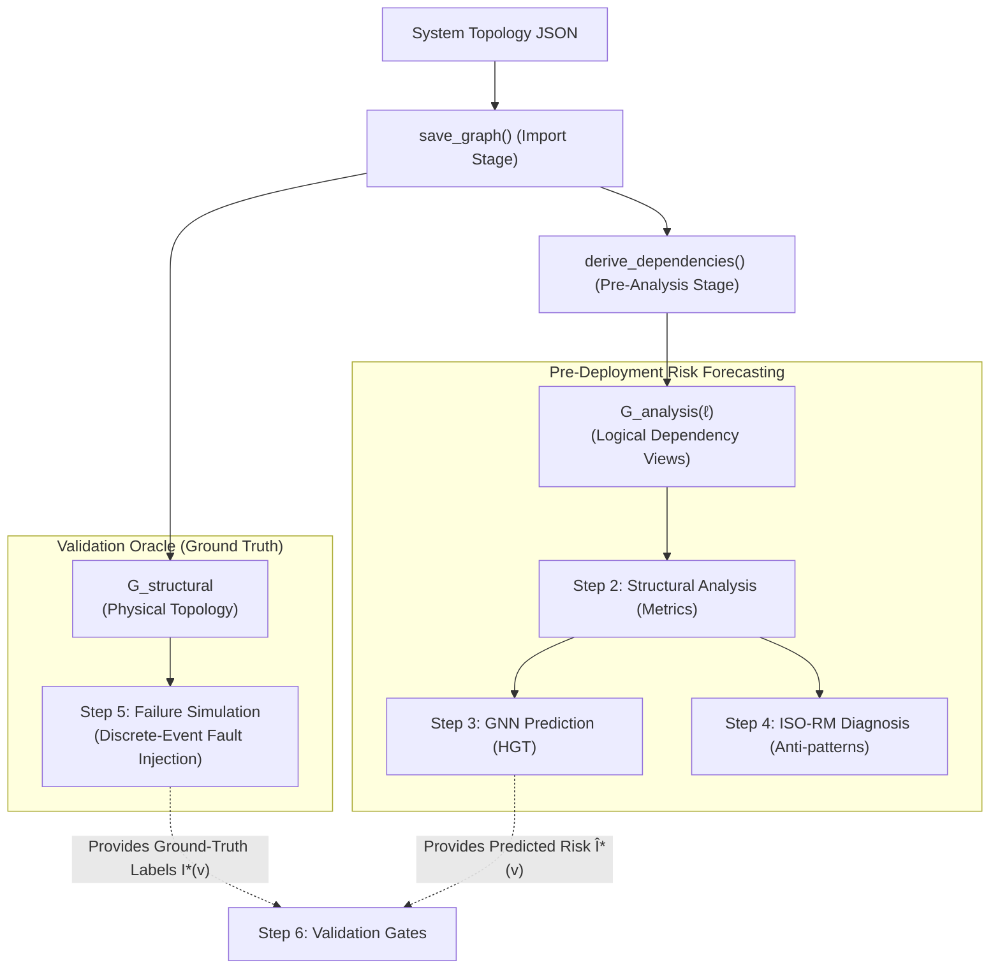
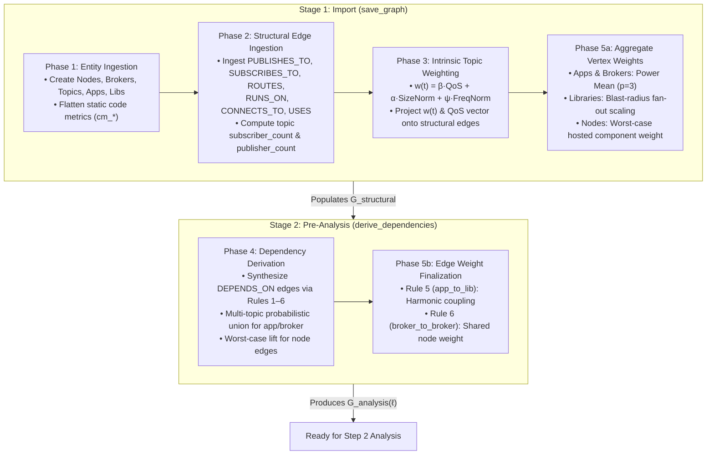
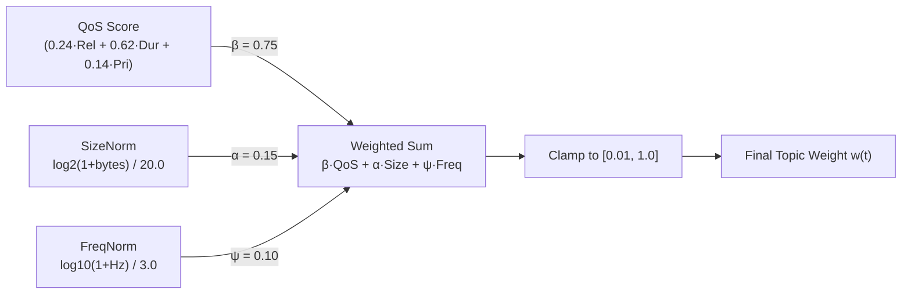
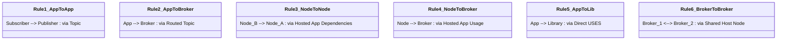
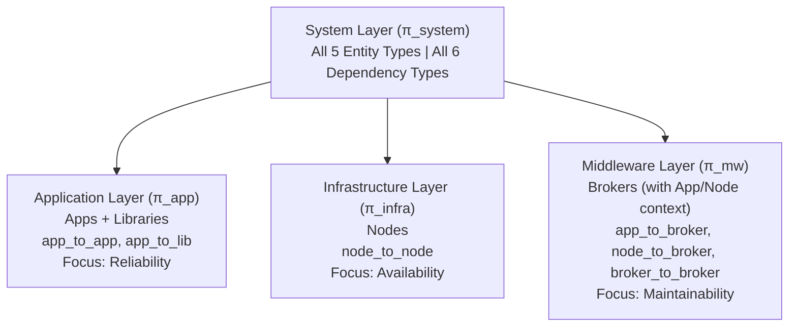

# Step 1: Model — Graph Construction & Dependency Derivation

**Transform raw system architecture into a formal, weighted, directed multi-layer graph capturing physical topology and runtime failure dependencies.**

[README](../README.md) | **Step 1: Model** | → [Step 2: Analyze](structural-analysis.md)

For the complete CLI command reference (`import_graph.py`, `export_graph.py`), see [cli-pipeline-guide.md — Step 1](cli-pipeline-guide.md#step-1-model--import--export).

---

## Table of Contents

1. [Executive Summary & At a Glance](#1-executive-summary--at-a-glance)
2. [Core Conceptual Foundations (The "Why")](#2-core-conceptual-foundations-the-why)
   - 2.1 [The Data Flow vs. Dependency Flow Inversion](#21-the-data-flow-vs-dependency-flow-inversion)
   - 2.2 [Multi-Topic Failure Coupling](#22-multi-topic-failure-coupling)
   - 2.3 [Shared Library Blast Radius](#23-shared-library-blast-radius)
   - 2.4 [Infrastructure Colocation & Shared Fate](#24-infrastructure-colocation--shared-fate)
   - 2.5 [Dual Graph Views: Simulation vs. Analysis](#25-dual-graph-views-simulation-vs-analysis)
3. [Execution Architecture (Stages & Phases)](#3-execution-architecture-stages--phases)
   - 3.1 [Two-Stage Pipeline Workflow](#31-two-stage-pipeline-workflow)
   - 3.2 [Why Decouple Import from Pre-Analysis?](#32-why-decouple-import-from-pre-analysis)
4. [Formal Graph Definition](#4-formal-graph-definition)
5. [Stage 1 (Import): Ingestion & Intrinsic Weighting](#5-stage-1-import-ingestion--intrinsic-weighting)
   - 5.1 [Phase 1: Entity Modeling & Code Metrics](#51-phase-1-entity-modeling--code-metrics)
   - 5.2 [Phase 2: Structural Topology & Degree Augmentation](#52-phase-2-structural-topology--degree-augmentation)
   - 5.3 [Phase 3: Intrinsic Topic Weighting ($w(t)$)](#53-phase-3-intrinsic-topic-weighting-wt)
   - 5.4 [Phase 5a: Aggregate Vertex Weighting ($w(v)$)](#54-phase-5a-aggregate-vertex-weighting-wv)
6. [Stage 2 (Pre-Analysis): Dependency Derivation & Edge Finalization](#6-stage-2-pre-analysis-dependency-derivation--edge-finalization)
   - 6.1 [Phase 4: The Six Dependency Derivation Rules](#61-phase-4-the-six-dependency-derivation-rules)
   - 6.2 [Multi-Topic Probabilistic Union vs. Worst-Case Lift](#62-multi-topic-probabilistic-union-vs-worst-case-lift)
   - 6.3 [Phase 5b: Edge Weight Finalization](#63-phase-5b-edge-weight-finalization)
   - 6.4 [Implementation Parity (Neo4j, Memory, Simulation)](#64-implementation-parity-neo4j-memory-simulation)
7. [Layer Projections ($\pi_\ell$)](#7-layer-projections-pi_ell)
8. [Topology JSON Specification](#8-topology-json-specification)
9. [End-to-End Step-by-Step Worked Example](#9-end-to-end-step-by-step-worked-example)
10. [Middleware Architecture Mapping](#10-middleware-architecture-mapping)
11. [Computational Complexity & Performance](#11-computational-complexity--performance)
12. [CLI & Python SDK Usage](#12-cli--python-sdk-usage)
13. [What Comes Next](#13-what-comes-next)

---

### Where this sits in the JSS paper

| | |
|:---|:---|
| **Manuscript section** | §3.1 (formal multigraph), §3.2 (QoS weights + the six `DEPENDS_ON` rules), §3.3 (dual graph views and the four analytical layers) |
| **Paper's name for this** | Stages 1–2 of the four-stage pipeline: *Typed Multigraph Formulation* and *QoS-Aware Logical Dependency Projection* |
| **Symbols** | $\mathcal{G} = (V, E, \tau_V, \tau_E, w_V, w_E)$, $w(t)$, $w_V$/$w_E$, $G_{\text{structural}}$, $G_{\text{analysis}}$ — identical to this document's |
| **Results** | No results section; this stage is construction, not measurement. Supplementary §S14 shows the running example's structural graph and its projection. |

> [!NOTE]
> **Eight steps here, four stages in the paper.** This repository numbers the pipeline in eight
> executable steps (Model, Analyze, Predict, Diagnose, Simulate, Validate, Prescribe, Visualize),
> because that is what you run. The JSS manuscript describes a coarser **four-stage** pipeline —
> Typed Multigraph Formulation → QoS-Aware Dependency Projection → Heterogeneous Graph Learning
> (Predictive Pathway) → Explainable Quality Attribution (Explanation Layer) — because that is what
> it evaluates. Steps 1 and 2 together are the paper's stages 1–2; Step 3 is stage 3; Step 4 is
> stage 4. The paper also refers to a "Validate stage" and a "Prescribe stage" without numbering
> them: those are Steps 6 and 7.
>
> The two arms are named differently too. This documentation says **Pathway B** for the learned
> ranking arm and **Pathway A** for the deterministic diagnostic arm, matching `PredictiveUseCase`
> and `DiagnosticUseCase` in the code. The paper calls them the **Predictive Pathway** (§4) and the
> **Explanation Layer** (§5). They are the same two things.

---

## 1. Executive Summary & At a Glance

In distributed publish-subscribe architectures (such as ROS 2/DDS, Apache Kafka, or MQTT), software components do not communicate through hardcoded point-to-point RPCs. Instead, they interact asynchronously via message topics, routing brokers, and shared libraries.

The **Model stage (Step 1)** ingests a declarative JSON specification of this architecture and builds a mathematically rigorous, weighted, directed multi-layer graph. It computes QoS-aware criticality weights and derives causal failure dependencies before any code is deployed or executed.

```
┌─────────────────────────────────────────────────────────────────────────────┐
│                             STEP 1 AT A GLANCE                              │
├───────────────────┬─────────────────────────────────────────────────────────┤
│ Primary Input     │ System Topology JSON (nodes, brokers, topics, apps,     │
│                   │ libraries, and structural relationships).               │
├───────────────────┼─────────────────────────────────────────────────────────┤
│ Execution Stages  │ Stage 1: Import (Phases 1, 2, 3, 5a)                    │
│                   │ Stage 2: Pre-Analysis (Phases 4, 5b)                    │
├───────────────────┼─────────────────────────────────────────────────────────┤
│ Key Operations    │ 1. Ingest entities and flatten static code metrics.     │
│                   │ 2. Compute QoS-driven topic weights w(t).               │
│                   │ 3. Propagate vertex weights w(v) via power means.       │
│                   │ 4. Derive logical DEPENDS_ON edges via 6 formal rules.  │
│                   │ 5. Project graph into 4 canonical analysis layers.      │
├───────────────────┼─────────────────────────────────────────────────────────┤
│ Primary Outputs   │ • G_structural: Raw physical graph for Step 5 simulation│
│                   │ • G_analysis(ℓ): Derived dependency graph for Steps 2–4 │
├───────────────────┼─────────────────────────────────────────────────────────┤
│ Next Step         │ Step 2: Analyze (computes 53-field metric vector M(v))  │
└───────────────────┴─────────────────────────────────────────────────────────┘
```

---

## 2. Core Conceptual Foundations (The "Why")

Before diving into mathematical formulas, understanding four architectural principles is essential to grasp how Software-as-a-Graph models distributed systems.

### 2.1 The Data Flow vs. Dependency Flow Inversion

A standard architecture diagram displays **data flow**: where messages travel. However, reliability engineering and blast-radius forecasting require knowing **dependency flow**: *who breaks when a component fails?*

Consider an Inertial Measurement Unit (`ImuSensorApp`) that publishes telemetry to `/telemetry/imu`, and a `NavigationApp` that subscribes to that topic:

```
Physical Data Flow:
  [ ImuSensorApp ] ────────PUBLISHES_TO───────► ( /telemetry/imu ) ────────SUBSCRIBES_TO───────► [ NavigationApp ]
  (Message Producer)                                 (Topic)                                     (Message Consumer)

Logical Failure Dependency (DEPENDS_ON):
  [ NavigationApp ] ──────────────────────────DEPENDS_ON──────────────────────────► [ ImuSensorApp ]
  (Dependent / Victim)                                                             (Dependency / Root Cause)
```

> [!IMPORTANT]
> **Direction Convention**:
> All `DEPENDS_ON` edges point from the **dependent** (the entity that suffers disruption) to the **dependency** (the entity whose failure causes the disruption).
> 
> If `ImuSensorApp` crashes, `NavigationApp` is starved of sensor data and cannot navigate. Therefore, `NavigationApp` depends on `ImuSensorApp`. **Dependency edges point in the opposite direction of message flow.**

### 2.2 Multi-Topic Failure Coupling

Two services rarely communicate over a single topic in complex robotics or enterprise platforms. If Service $B$ subscribes to 5 separate topics published by Service $A$, the failure vulnerability compounds:
- Losing $A$ deprives $B$ of 5 data feeds simultaneously.
- The coupling strength between $B$ and $A$ must grow monotonically with the number and criticality of mediating topics, which we model using a **probabilistic union** ($1 - \prod(1 - w(t))$).

### 2.3 Shared Library Blast Radius

Modern services share utility libraries, serialization routines, and hardware drivers. A runtime defect or memory leak in a shared library does not propagate sequentially; it triggers a **simultaneous blast** across all consuming applications. The graph model captures this by scaling library criticality with its afferent consumer fan-out ($\text{DG}_{\text{in}}$).

### 2.4 Infrastructure Colocation & Shared Fate

Two message brokers or services hosted on the same physical or virtual compute node share a common failure domain:
- If the host node loses power or suffers kernel panic, all hosted instances die together.
- The model captures this via `RUNS_ON` relationships, lifting component risks up to `node_to_node` edges and establishing `broker_to_broker` colocation dependencies.

### 2.5 Dual Graph Views: Simulation vs. Analysis

To prevent circular reasoning and ensure scientific rigor, the framework strictly decouples physical event simulation from analytical prediction:



- **$G_{\text{structural}}$ (Physical View)**: Retains raw physical edges (`PUBLISHES_TO`, `SUBSCRIBES_TO`, `ROUTES`, `RUNS_ON`, `CONNECTS_TO`, `USES`). Consumed **only** by Step 5 discrete-event simulation to route physical packets and inject hardware/process faults.
- **$G_{\text{analysis}}(\ell)$ (Logical Dependency View)**: Retains derived `DEPENDS_ON` edges across layer projection $\ell$. Consumed by Step 2 structural metrics ($M(v)$), Step 3 GNN prediction ($\hat{I}^*(v)$), and Step 4 ISO-RM quality scoring ($Q^*(v)$).

> [!NOTE]
> **Independence Guarantee**:
> Analytical prediction metrics never leak into simulation routines, and simulation cascade labels never pollute graph construction. This ensures evaluation benchmarks test genuine predictive power rather than circular artifacts.

---

## 3. Execution Architecture (Stages & Phases)

### 3.1 Two-Stage Pipeline Workflow

Graph construction executes across **two explicit stages** comprising **five algorithmic phases**:



### 3.2 Why Decouple Import from Pre-Analysis?

Software-as-a-Graph explicitly separates `save_graph()` from `derive_dependencies()`:

| Criterion | Stage 1: Import (`save_graph`) | Stage 2: Pre-Analysis (`derive_dependencies`) |
|:---|:---|:---|
| **Primary Goal** | Faithful storage, validation, and physical representation. | Analytical reasoning and causal dependency synthesis. |
| **Phases Executed** | **Phases 1, 2, 3, and 5a** | **Phases 4 and 5b** |
| **Graph Produced** | $G_{\text{structural}}$ (Physical network) | $G_{\text{analysis}}(\ell)$ (Causal dependency graph) |
| **Computational Profile** | $\mathcal{O}(\|V\| + \|E_S\|)$ fast linear ingestion. | Path-expansion and transitive closure across USES chains. |
| **CLI Command** | `cli/import_graph.py --input system.json` | Automatically invoked by `cli/analyze_graph.py` |
| **SDK Method** | `client.import_topology("system.json")` | `client.analyze(layer="app")` |

This decoupling allows users to validate schemas with `--dry-run`, import large topologies, and export clean physical snapshots without paying the computational cost of path expansion until analytical metrics are actually required.

---

## 4. Formal Graph Definition

Mathematically, the system is modeled as a directed, attributed, multi-layer graph:

$$\mathcal{G} = (V, E, \tau_V, \tau_E, w_V, w_E, \mathcal{L})$$

where:

- **Vertices ($V$)**: Partitioned into five distinct architectural entities:
  $$V = V_{\text{app}} \cup V_{\text{broker}} \cup V_{\text{topic}} \cup V_{\text{node}} \cup V_{\text{lib}}$$
- **Edges ($E$)**: Union of physical structural links and logical causal dependencies:
  $$E = E_{\text{structural}} \cup E_{\text{dependency}}$$
- **Vertex Categorization Function ($\tau_V$)**: Maps each vertex to its entity type:
  $$\tau_V : V \to \{\text{Application}, \text{Broker}, \text{Topic}, \text{Node}, \text{Library}\}$$
- **Edge Categorization Function ($\tau_E$)**: Maps each edge to its relationship type:
  $$\tau_E : E \to \{\text{PUBLISHES\_TO}, \text{SUBSCRIBES\_TO}, \text{ROUTES}, \text{RUNS\_ON}, \text{CONNECTS\_TO}, \text{USES}, \text{DEPENDS\_ON}\}$$
- **Vertex Weight Function ($w_V$)**: Quantifies intrinsic or aggregate criticality:
  $$w_V(v) \in [w_{\min}, 1.0] \quad (\text{with floor } w_{\min} = 0.01)$$
- **Edge Weight Function ($w_E$)**: Quantifies coupling intensity and failure transmission probability:
  $$w_E(e) \in [w_{\min}, 1.0]$$
- **Layer Projections ($\mathcal{L}$)**: Architectural view filters:
  $$\mathcal{L} = \{\text{app}, \text{infra}, \text{mw}, \text{system}\}$$

---

## 5. Stage 1 (Import): Ingestion & Intrinsic Weighting

### 5.1 Phase 1: Entity Modeling & Code Metrics

During Phase 1, every component in the topology JSON is ingested into its respective vertex category. Properties are validated, normalized, and flattened into scalar attributes suitable for graph database storage:

| Entity Type | Graph Label | Core Properties | Architectural Description |
|:---|:---|:---|:---|
| **Node** | `:Node` | `id`, `name`, `ip_address`, `cpu_cores`, `memory_gb`, `os_type` | Physical host machine, VM, or bare-metal compute unit. |
| **Broker** | `:Broker` | `id`, `name`, `type`, `max_connections`, `host` | Message broker engine (e.g., DDS participant, Kafka broker, EMQX). |
| **Topic** | `:Topic` | `id`, `name`, `size`, `qos_reliability`, `qos_durability`, `qos_transport_priority`, `qos_deadline_ms`, `qos_history_depth`, `topic_frequency`, `topic_criticality` | Asynchronous pub-sub channel governed by Quality of Service (QoS) contracts. |
| **Application** | `:Application` | `id`, `name`, `role`, `app_type`, `version`, `criticality`, `hotstandby`, `cm_*` | Executable software service or process with 3-tier operational priority (`HIGH`, `MEDIUM`, `LOW`) and dual-node failover (`hotstandby`). |
| **Library** | `:Library` | `id`, `name`, `version`, `cm_*` | Shared software package, driver, or reusable algorithmic module. |

#### Code Quality Metric Flattening (`cm_*`)
For Applications and Libraries, object-oriented static code metrics are ingested and flattened into `cm_*` properties. These properties feed the **Code Quality Penalty (CQP)** in Step 2:
- `cm_total_loc`: Total Lines of Code (volume and surface area).
- `cm_avg_wmc`: Weighted Methods per Class (McCabe cyclomatic complexity).
- `cm_avg_lcom`: Lack of Cohesion of Methods (Henderson-Sellers LCOM).
- `cm_avg_fanin` / `cm_avg_fanout`: Afferent ($C_a$) and Efferent ($C_e$) class coupling.
- Instability ($I$): Derived internally as $I = \frac{C_e}{C_a + C_e} \in [0, 1]$.

### 5.2 Phase 2: Structural Topology & Degree Augmentation

Phase 2 imports the six physical structural relationship types that define the communication and deployment layout:

| Relationship | Source ($\tau_V(u)$) | Target ($\tau_V(v)$) | Architectural Meaning |
|:---|:---|:---|:---|
| `PUBLISHES_TO` | Application / Library | Topic | Component writes messages to this topic channel. |
| `SUBSCRIBES_TO` | Application / Library | Topic | Component reads messages from this topic channel. |
| `ROUTES` | Broker | Topic | Broker manages queuing and routing for this topic. |
| `RUNS_ON` | Application / Broker | Node | Process is hosted on and scheduled by this compute node. |
| `CONNECTS_TO` | Node | Node | Physical or virtual network link between hosts. |
| `USES` | Application / Library | Library | Software compile/link-time dependency on a shared library. |

#### Topic Fan-Out Augmentation
Immediately upon edge insertion, each Topic vertex is augmented with its degree metrics:
$$\text{subscriber\_count}(t) = |\{ a \in V : (a, t) \in \text{SUBSCRIBES\_TO} \}|$$
$$\text{publisher\_count}(t) = |\{ a \in V : (a, t) \in \text{PUBLISHES\_TO} \}|$$

These degree counts allow Step 2 and Step 4 analyzers to immediately identify high-fan-out topics that act as message bottlenecks.

### 5.3 Phase 3: Intrinsic Topic Weighting ($w(t)$)

Topic weight $w(t)$ quantifies the intrinsic importance and runtime stress of a message channel. It is formulated as a convex combination of **QoS delivery contracts**, **payload size**, and **message frequency**:

$$w(t) = \max\left(w_{\min}, \; \min\left(1.0, \; \beta \cdot \text{QoS}(t) + \alpha \cdot \text{SizeNorm}(t) + \psi \cdot \text{FreqNorm}(t)\right)\right)$$

where:
- $\beta = 0.75$ (QoS contract weight — primary signal).
- $\alpha = 0.15$ (Payload buffer weight).
- $\psi = 0.10$ (Publish frequency weight).
- $w_{\min} = 0.01$ (Weight floor preventing zero-importance components).



#### 1. QoS Contract Formulation
$$\text{QoS}(t) = 0.24 \cdot \text{Score}_{\text{reliability}} + 0.62 \cdot \text{Score}_{\text{durability}} + 0.14 \cdot \text{Score}_{\text{priority}}$$

The weights $(0.24, 0.62, 0.14)$ represent the geometric-mean priority vector derived from an Analytic Hierarchy Process (AHP) pairwise comparison matrix (`AHPMatrices.criteria_topic_qos`, with Consistency Ratio $CR \approx 0.016$):

| QoS Attribute | Accepted Values | Score | Architectural Rationale |
|:---|:---|:---:|:---|
| **Durability** (0.62) | `PERSISTENT`<br/>`TRANSIENT`<br/>`TRANSIENT_LOCAL`<br/>`VOLATILE` | `1.0`<br/>`0.6`<br/>`0.5`<br/>`0.0` | **Dominant factor.** Governs whether data survives broker restarts or node crashes. Unpersisted data is permanently lost upon failure. |
| **Reliability** (0.24) | `RELIABLE`<br/>`BEST_EFFORT` | `1.0`<br/>`0.0` | Governs whether dropped packets must be retransmitted. Critical control channels demand guaranteed delivery. |
| **Transport Priority** (0.14) | `HIGHEST` / `CRITICAL` / `URGENT`<br/>`HIGH`<br/>`MEDIUM`<br/>`LOW` | `1.0`<br/>`0.66`<br/>`0.33`<br/>`0.0` | Governs packet scheduling under network interface queue contention. |

> [!NOTE]
> All QoS enum lookups are case-normalized and whitespace-trimmed (`_canon`), ensuring that values like `"reliable"` or `"RELIABLE"` produce identical scores rather than falling through to zero.

#### 2. Payload Size and Message Frequency Normalization
- **$\text{SizeNorm}(t)$**: Logarithmic normalization of message size in bytes against a 1 MiB ($2^{20}$ B) design envelope:
  $$\text{SizeNorm}(t) = \min\left(1.0, \; \frac{\log_2(1 + \text{size\_bytes})}{20.0}\right)$$
  *(Rationale: 1 MiB represents the practical DDS sample ceiling before Real-Time Publish-Subscribe (RTPS) fragmentation overhead degrades packet handling).*
- **$\text{FreqNorm}(t)$**: Logarithmic normalization of publish rate in Hz against a 999 Hz (~1 kHz) design envelope:
  $$\text{FreqNorm}(t) = \min\left(1.0, \; \frac{\log_{10}(1 + f_t)}{3.0}\right)$$
  *(When publish rate is unstated in the input JSON, $f_t$ defaults to a constant $1.0\text{ Hz}$).*

#### 3. Incident Edge Inheritance
Once $w(t)$ is computed:
- All incident `PUBLISHES_TO`, `SUBSCRIBES_TO`, and `ROUTES` edges automatically inherit $w(t)$ as their edge weight.
- Incident edges inherit the topic's full QoS dictionary (`qos_reliability`, `qos_durability`, `qos_transport_priority`). This guarantees that downstream consumers (such as GNN edge encoders) have access to rich QoS features.

### 5.4 Phase 5a: Aggregate Vertex Weighting ($w(v)$)

A software service or compute host does not possess an intrinsic QoS contract. Its importance is determined by the data channels it handles and the components it hosts. Phase 5a propagates topic weights up to components:

#### 1. Application Weight ($w(\text{app})$)
Applications aggregate the weights of all directly attached topics $T_{\text{app}} = \{ t : (a, t) \in \text{PUBLISHES\_TO} \cup \text{SUBSCRIBES\_TO} \}$ using a **Generalized Power Mean ($p=3$)**:

$$w(\text{app}) = \left(\frac{1}{|T_{\text{app}}|} \sum_{t \in T_{\text{app}}} w(t)^3\right)^{1/3}$$

> [!TIP]
> **Why Power Mean with $p=3$?**
> - An **arithmetic mean ($p=1$)** dilutes a single critical flight-control topic if an application also handles multiple low-priority telemetry topics.
> - A **pure maximum ($p=\infty$)** is blind to quantity; an app handling ten critical topics would score identically to an app handling just one.
> - The **power mean ($p=3$)** acts as a smooth, scale-free worst-case approximation. It strongly emphasizes the most critical topics while still increasing when multiple critical topics are attached.

#### 2. Library Weight ($w(\text{lib})$)
A shared library's criticality reflects both the topics it touches and the operational importance of the applications consuming it, scaled by its **afferent consumer blast radius**:

$$w(\text{lib}) = \min\left(1.0, \; \text{base\_w} \cdot \left(1 + \gamma \cdot \log_2(1 + \text{DG}_{\text{in}})\right)\right) \quad (\text{with } \gamma = 0.15)$$

where:
$$\text{base\_w} = \max\left( \{ w(t) : t \in T_{\text{lib}} \} \cup \{ w(\text{app}) : (\text{app}, \text{lib}) \in \text{USES} \} \right)$$
$$\text{DG}_{\text{in}} = |\{ \text{app} : (\text{app}, \text{lib}) \in \text{USES} \}|$$

At realistic fan-outs (e.g., 5 to 30 consuming applications), $\gamma = 0.15$ yields a controlled 40% to 75% amplification, correctly reflecting that a crash in a widely shared library takes down multiple services simultaneously.

#### 3. Application Second Pass (Library-Mediated)
Applications that publish or subscribe to topics purely through linked libraries (rather than holding direct pub/sub edges) initially receive the floor weight ($0.01$). A second pass elevates their weight:
$$w(\text{app}) = \max_{(\text{app}, \text{lib}) \in \text{USES}} w(\text{lib})$$
This prevents library-centric services from becoming artificially invisible to subsequent risk scoring.

#### 4. Broker Weight ($w(\text{broker})$)
Brokers aggregate the weights of all routed topics $T_{\text{routed}} = \{ t : (b, t) \in \text{ROUTES} \}$ using the same Power Mean ($p=3$):
$$w(\text{broker}) = \left(\frac{1}{|T_{\text{routed}}|} \sum_{t \in T_{\text{routed}}} w(t)^3\right)^{1/3}$$

#### 5. Node Weight ($w(\text{node})$)
A compute host's criticality equals the worst-case criticality among all software components running on it:
$$w(\text{node}) = \max_{v \in \text{hosted}} w(v) \quad \text{where } (v, \text{node}) \in \text{RUNS\_ON}$$

---

## 6. Stage 2 (Pre-Analysis): Dependency Derivation & Edge Finalization

When analysis is requested (`client.analyze()` or `cli/analyze_graph.py`), the system executes Stage 2: synthesizing the logical `DEPENDS_ON` edges across six formal architectural derivation rules.

### 6.1 Phase 4: The Six Dependency Derivation Rules

Each rule transforms structural relationships into directed causal dependencies.



#### Rule 1: `app_to_app` (Service-to-Service Dependency)
- **Pattern**: A subscriber component consumes data generated by a publisher component through a mediating topic:
  $$\text{Subscriber} \xrightarrow{\text{SUBSCRIBES\_TO}} \text{Topic} \xleftarrow{\text{PUBLISHES\_TO}} \text{Publisher}$$
- **Derived Edge**: $\text{Subscriber} \xrightarrow{\text{DEPENDS\_ON}} \text{Publisher}$ (`dependency_type: 'app_to_app'`)
- **Transitive Library Propagation**: Rule 1 inspects USES chains up to 3 hops deep (`USES*1..3`). If App $A$ uses a library that subscribes to Topic $T$, or if App $B$ uses a library that publishes to Topic $T$, the causal dependency $A \xrightarrow{\text{DEPENDS\_ON}} B$ is fully derived.
- **Edge Weight ($w_E$)**: Evaluated using the **probabilistic union** over all mediating topics:
  $$w_E = 1 - \prod_{t \in T_{\text{mediating}}} (1 - w(t))$$

#### Rule 2: `app_to_broker` (Service-to-Broker Dependency)
- **Pattern**: An application publishes to or subscribes from a topic routed by a message broker:
  $$\text{App} \xrightarrow{\text{PUBLISHES\_TO } \mid \text{ SUBSCRIBES\_TO}} \text{Topic} \xleftarrow{\text{ROUTES}} \text{Broker}$$
- **Derived Edge**: $\text{App} \xrightarrow{\text{DEPENDS\_ON}} \text{Broker}$ (`dependency_type: 'app_to_broker'`)
- **Rationale**: If the broker crashes or experiences queue exhaustion, message routing stops and the application cannot exchange data.
- **Edge Weight ($w_E$)**: Probabilistic union over all routed topics used by the app.

#### Rule 3: `node_to_node` (Host-to-Host Infrastructure Dependency)
- **Pattern**: Applications hosted on Node $B$ depend on applications hosted on Node $A$ (via `app_to_app` or `app_to_broker`):
  $$\text{Node } B \xleftarrow{\text{RUNS\_ON}} \text{App } B \xrightarrow{\text{DEPENDS\_ON}} \text{App } A \xrightarrow{\text{RUNS\_ON}} \text{Node } A \quad (B \neq A)$$
- **Derived Edge**: $\text{Node } B \xrightarrow{\text{DEPENDS\_ON}} \text{Node } A$ (`dependency_type: 'node_to_node'`)
- **Edge Weight ($w_E$)**: **Worst-case lift** ($\max_{d} w(d)$).

#### Rule 4: `node_to_broker` (Host-to-Broker Dependency)
- **Pattern**: An application running on a compute node depends on an external broker:
  $$\text{Node} \xleftarrow{\text{RUNS\_ON}} \text{App} \xrightarrow{\text{DEPENDS\_ON}} \text{Broker}$$
- **Derived Edge**: $\text{Node} \xrightarrow{\text{DEPENDS\_ON}} \text{Broker}$ (`dependency_type: 'node_to_broker'`)
- **Edge Weight ($w_E$)**: Worst-case lift ($\max_{d} w(d)$).

#### Rule 5: `app_to_lib` (Application-to-Library Dependency)
- **Pattern**: An application or library directly utilizes a shared library:
  $$\text{Component} \xrightarrow{\text{USES}} \text{Library}$$
- **Derived Edge**: $\text{Component} \xrightarrow{\text{DEPENDS\_ON}} \text{Library}$ (`dependency_type: 'app_to_lib'`)
- **Edge Weight ($w_E$)**: Initialized with placeholder $0.01$, then finalized in Phase 5b via the **harmonic mean** of the two component weights.

#### Rule 6: `broker_to_broker` (Broker Colocation Shared Fate)
- **Pattern**: Two distinct message brokers run on the same physical host:
  $$\text{Broker}_1 \xrightarrow{\text{RUNS\_ON}} \text{Node} \xleftarrow{\text{RUNS\_ON}} \text{Broker}_2 \quad (\text{Broker}_1 \neq \text{Broker}_2)$$
- **Derived Edge**: Bidirectional edges $\text{Broker}_1 \xleftrightarrow{\text{DEPENDS\_ON}} \text{Broker}_2$ (`dependency_type: 'broker_to_broker'`)
- **Rationale**: Brokers sharing a compute node compete for memory and network sockets, and crash simultaneously if the node fails.
- **Edge Weight ($w_E$)**: Initialized with placeholder $0.01$, then finalized in Phase 5b to inherit the shared Node's weight.

---

### 6.2 Multi-Topic Probabilistic Union vs. Worst-Case Lift

A key theoretical contribution of Software-as-a-Graph is distinguishing when to combine parallel failure channels using a **probabilistic union** versus a **worst-case lift**:

```
                       ┌──────────────────────────────────────────────┐
                       │ How Should Parallel Edges Be Aggregated?     │
                       └──────────────────────┬───────────────────────┘
                                              │
                     Are the combined channels independent events?
                                              │
                      ┌───────────────────────┴───────────────────────┐
                      ▼ YES                                           ▼ NO
        ┌──────────────────────────────┐                ┌──────────────────────────────┐
        │  Probabilistic Union         │                │  Worst-Case Lift             │
        │  w_E = 1 - ∏(1 - w(t))       │                │  w_E = max(w_1, ..., w_n)    │
        ├──────────────────────────────┤                ├──────────────────────────────┤
        │ Used for: Rules 1 & 2        │                │ Used for: Rules 3 & 4        │
        │ (app_to_app, app_to_broker)  │                │ (node_to_node, node_to_broker│
        └──────────────────────────────┘                └──────────────────────────────┘
```

#### 1. Why Probabilistic Union for Rules 1 & 2?
When two applications communicate over $k$ separate topics, each topic represents an independent transmission path. If topic failure events have probabilities $w(t_1), \dots, w(t_k)$, the probability that *at least one* failure impacts the consumer is:
$$w_E = 1 - \prod_{t \in T} (1 - w(t))$$
This guarantees that:
- Coupling increases monotonically with each additional topic channel.
- $w_E$ is bounded in $[w_{\min}, 1.0]$.
- Every edge stores `path_count = |T|` recording the raw number of mediating channels.

#### 2. Why Worst-Case Lift for Rules 3 & 4?
Rules 3 and 4 lift component dependencies up to the physical compute node level. Applying the probabilistic union to node edges causes **severe saturation** (measured on this repository's scenario corpus at 91% to 100% of all `node_to_node` edges saturating to $\geq 0.95$ — an internal observation from the corpus in [`data/scenarios/`](../data/scenarios/), not a published figure).

Why does the union fail for nodes? The independence assumption fails. The dependencies a node lifts are already correlated aggregates over overlapping sets of hosted applications and shared topics. A compute node is exposed to the **single most critical service** it hosts, not the multiplicative union of all of them. Therefore, worst-case propagation is mathematically and architecturally sound:
$$w_E(\text{Node } B \to \text{Node } A) = \max_{d \in D_{BA}} w(d)$$

---

### 6.3 Phase 5b: Edge Weight Finalization

Because Phase 4 establishes edges whose weights depend on aggregate component weights, Phase 5b runs immediately after derivation:

1. **`app_to_lib` Harmonic Mean**:
   $$w_E(\text{app} \to \text{lib}) = \frac{2 \cdot w(\text{app}) \cdot w(\text{lib})}{w(\text{app}) + w(\text{lib})}$$
   The harmonic mean balances caller operational criticality against shared library criticality:
   - If a high-criticality app ($w = 0.90$) calls a trivial utility library ($w = 0.10$), the coupling weight is dampened ($w_E \approx 0.18$).
   - If both caller and library are high criticality ($w = 0.90, 0.85$), coupling remains high ($w_E \approx 0.87$).
2. **`broker_to_broker` Node Weight**:
   $$w_E(\text{Broker}_1 \to \text{Broker}_2) = \max_{n \in \text{shared\_nodes}} w(n)$$
   The edge reflects the severity of losing the host hardware that both brokers depend upon.

---

### 6.4 Implementation Parity (Neo4j, Memory, Simulation)

Software-as-a-Graph implements graph construction and dependency derivation in **three independent engines** that maintain **100% topological and mathematical parity**:

1. **`Neo4jRepository`** ([`saag/infrastructure/neo4j_repo.py`](../saag/infrastructure/neo4j_repo.py)): High-performance enterprise implementation using Cypher batch queries and ACID transactions.
2. **`MemoryRepository`** ([`saag/infrastructure/memory_repo.py`](../saag/infrastructure/memory_repo.py)): Pure Python / NetworkX dictionary engine for testing, local dry-runs, and environments without Neo4j.
3. **`SimulationGraph`** ([`saag/simulation/service.py`](../saag/simulation/service.py)): Simulation engine that independently derives the same six dependency rules from raw structural edges for change-propagation testing ($I_M(v)$).

> [!TIP]
> Parity across all three engines is continuously enforced by automated CI regression tests:
> - `tests/test_repository_fidelity_parity.py` pins vertex weights, edge weights, and path counts between `MemoryRepository` and `Neo4jRepository`.
> - `tests/test_simulation_dependency_derivation.py` pins derived arc sets between `SimulationGraph` and `MemoryRepository`.

---

## 7. Layer Projections ($\pi_\ell$)

Distributed architectures present distinct risks at different abstraction boundaries. Software-as-a-Graph defines four canonical layer projections in [`saag/core/layers.py`](../saag/core/layers.py):

$$\pi_\ell(\mathcal{G}) = \mathcal{G}_\ell = (V_\ell, E_\ell, \tau_V|_{\ell}, \tau_E|_{\ell}, w_V|_{\ell}, w_E|_{\ell})$$



### Layer Specification Table

| Layer | CLI Flag | Subgraph Vertices ($T_\ell$) | Included Dependencies ($D_\ell$) | Analyzed Types ($T_a$) | Architectural Focus |
|:---|:---|:---|:---|:---|:---|
| **Application** | `--layer app` | Application, Library | `app_to_app`, `app_to_lib` | Application, Library | **Reliability ($R$)**: Microservice cascades, pub-sub starvation, shared-library blast radius. |
| **Infrastructure** | `--layer infra` | Node | `node_to_node` | Node | **Availability ($A$)**: Host partition risk, network bridges, single points of failure (SPOF). |
| **Middleware** | `--layer mw` | Application, Broker, Node | `app_to_broker`, `node_to_broker`, `broker_to_broker` | Broker | **Maintainability ($M$)**: Broker throughput bottlenecks, colocation risks, queue exhaustion. |
| **System** | `--layer system` | All 5 entity types | All 6 dependency types | All components | **Holistic Composite ($Q$)**: End-to-end multi-tier risk evaluation. |

#### Architectural Scope Constraints
- **Why are Libraries included in $\pi_{\text{app}}$?**
  If libraries were omitted, a shared library used by 20 applications would have $\text{DG}_{\text{in}} = 0$ in the application projection, obscuring its blast radius from software engineers running `--layer app`.
- **Why are Applications and Nodes in the $\pi_{\text{mw}}$ subgraph?**
  To preserve incoming dependency edges pointing to Brokers (`app_to_broker`, `node_to_broker`), applications and nodes must be present in the graph projection. However, the analysis target set ($T_a$) is restricted to $\{ \text{Broker} \}$, ensuring that middleware metrics score brokers exclusively.

---

## 8. Topology JSON Specification

The input specification is a declarative JSON document defining architectural components and their physical connections:

```json
{
  "metadata": {
    "name": "AutonomousDeliveryDrone",
    "domain": "robotics",
    "version": "2.1.0"
  },
  "nodes": [
    { "id": "N0", "name": "FlightComputer", "cpu_cores": 8, "memory_gb": 16 },
    { "id": "N1", "name": "MissionPayload", "cpu_cores": 4, "memory_gb": 8 }
  ],
  "brokers": [
    { "id": "B0", "name": "DDS_Participant", "type": "FastDDS" }
  ],
  "topics": [
    {
      "id": "T0",
      "name": "/telemetry/imu",
      "size": 64,
      "frequency": 100.0,
      "qos": {
        "reliability": "RELIABLE",
        "durability": "TRANSIENT_LOCAL",
        "transport_priority": "HIGH",
        "deadline_ms": 10.0,
        "history_depth": 10
      }
    }
  ],
  "applications": [
    {
      "id": "A0",
      "name": "ImuSensorDriver",
      "app_type": "driver",
      "criticality": "HIGH",
      "hotstandby": true,
      "code_metrics": {
        "size": { "total_loc": 1250 },
        "complexity": { "avg_wmc": 14.2 },
        "cohesion": { "avg_lcom": 12.0 },
        "coupling": { "avg_fanin": 4, "avg_fanout": 6 }
      }
    },
    {
      "id": "A1",
      "name": "FlightController",
      "app_type": "controller",
      "criticality": "HIGH",
      "hotstandby": false
    }
  ],
  "libraries": [
    {
      "id": "L0",
      "name": "QuaternionMathLib",
      "version": "1.3.0"
    }
  ],
  "relationships": {
    "publishes_to": [
      { "from": "A0", "to": "T0" }
    ],
    "subscribes_to": [
      { "from": "A1", "to": "T0" }
    ],
    "routes": [
      { "from": "B0", "to": "T0" }
    ],
    "runs_on": [
      { "from": "A0", "to": "N0" },
      { "from": "A1", "to": "N0" },
      { "from": "B0", "to": "N0" }
    ],
    "connects_to": [
      { "from": "N0", "to": "N1" }
    ],
    "uses": [
      { "from": "A0", "to": "L0" },
      { "from": "A1", "to": "L0" }
    ]
  }
}
```

---

## 9. End-to-End Step-by-Step Worked Example

To understand how every equation operates in practice, let us trace a complete numerical walkthrough of the example system specified above.

### System Components
- **Nodes**: `N0` (hosts A0, A1, B0), `N1` (standby)
- **Broker**: `B0` (routes T0)
- **Topic**: `T0` (size = 64 B, freq = 100 Hz, QoS: RELIABLE, TRANSIENT_LOCAL, HIGH)
- **Apps**: `A0` (publishes T0, uses L0), `A1` (subscribes T0, uses L0)
- **Library**: `L0` (used by A0 and A1)

---

### Step 1: Compute Topic Weight (Phase 3)
1. **QoS Score**:
   - Reliability: `RELIABLE` $\implies 1.0$
   - Durability: `TRANSIENT_LOCAL` $\implies 0.5$
   - Priority: `HIGH` $\implies 0.66$
   $$\text{QoS}(T0) = 0.24(1.0) + 0.62(0.5) + 0.14(0.66) = 0.24 + 0.31 + 0.0924 = \mathbf{0.6424}$$
2. **Payload Size Normalization**:
   $$\text{SizeNorm}(T0) = \frac{\log_2(1 + 64)}{20.0} = \frac{\log_2(65)}{20.0} = \frac{6.0224}{20.0} = \mathbf{0.3011}$$
3. **Publish Frequency Normalization**:
   $$\text{FreqNorm}(T0) = \frac{\log_{10}(1 + 100)}{3.0} = \frac{\log_{10}(101)}{3.0} = \frac{2.0043}{3.0} = \mathbf{0.6681}$$
4. **Total Topic Weight $w(T0)$**:
   $$w(T0) = 0.75(0.6424) + 0.15(0.3011) + 0.10(0.6681) = 0.4818 + 0.0452 + 0.0668 = \mathbf{0.5938}$$

All incident structural edges (`A0 -> T0`, `A1 -> T0`, `B0 -> T0`) inherit $w_E = \mathbf{0.5938}$.

---

### Step 2: Compute Vertex Weights (Phase 5a)
1. **Applications (`A0` and `A1`)**:
   Both directly attach to single topic $T0$:
   $$w(A0) = w(A1) = (0.5938^3)^{1/3} = \mathbf{0.5938}$$
2. **Broker (`B0`)**:
   Routes single topic $T0$:
   $$w(B0) = (0.5938^3)^{1/3} = \mathbf{0.5938}$$
3. **Library (`L0`)**:
   Consumed by 2 applications ($A0, A1 \implies \text{DG}_{\text{in}} = 2$). $\text{base\_w} = \max(w(A0), w(A1)) = 0.5938$:
   $$\text{Multiplier} = 1 + 0.15 \cdot \log_2(1 + 2) = 1 + 0.15 \cdot 1.5850 = 1 + 0.2377 = 1.2377$$
   $$w(L0) = \min(1.0, \; 0.5938 \times 1.2377) = \mathbf{0.7350}$$
4. **Compute Node (`N0`)**:
   Hosts $A0$ (0.5938), $A1$ (0.5938), and $B0$ (0.5938):
   $$w(N0) = \max(0.5938, 0.5938, 0.5938) = \mathbf{0.5938}$$

---

### Step 3: Derive Dependencies (Phase 4)
- **Rule 1 (`app_to_app`)**:
  Subscriber $A1$ depends on Publisher $A0$ across topic $T0$:
  $$A1 \xrightarrow{\text{DEPENDS\_ON}} A0 \quad (\text{weight} = 0.5938, \; \text{path\_count} = 1)$$
- **Rule 2 (`app_to_broker`)**:
  Both $A0$ and $A1$ depend on Broker $B0$ for routing topic $T0$:
  $$A0 \xrightarrow{\text{DEPENDS\_ON}} B0 \quad (\text{weight} = 0.5938)$$
  $$A1 \xrightarrow{\text{DEPENDS\_ON}} B0 \quad (\text{weight} = 0.5938)$$
- **Rule 5 (`app_to_lib`)**:
  Both $A0$ and $A1$ use shared library $L0$:
  $$A0 \xrightarrow{\text{DEPENDS\_ON}} L0$$
  $$A1 \xrightarrow{\text{DEPENDS\_ON}} L0$$

---

### Step 4: Finalize Edge Weights (Phase 5b)
- **Rule 5 Edge Finalization (`app_to_lib`)**:
  Evaluated via the harmonic mean between Application ($0.5938$) and Library ($0.7350$):
  $$w_E(A0 \to L0) = \frac{2 \times 0.5938 \times 0.7350}{0.5938 + 0.7350} = \frac{0.8729}{1.3288} = \mathbf{0.6569}$$
  $$w_E(A1 \to L0) = \mathbf{0.6569}$$

### Final Graph Representation Summary

```
==============================================================================
COMPONENT VERTICES (V)
ID    Type         Name                 Weight    Key Properties
------------------------------------------------------------------------------
T0    Topic        /telemetry/imu       0.5938    sub_count=1, pub_count=1
A0    Application  ImuSensorDriver      0.5938    role=['pub'], hotstandby=true
A1    Application  FlightController     0.5938    role=['sub'], hotstandby=false
B0    Broker       DDS_Participant      0.5938    type='FastDDS'
L0    Library      QuaternionMathLib    0.7350    DG_in=2, fanout_boost=+23.8%
N0    Node         FlightComputer       0.5938    hosted_max=0.5938
N1    Node         MissionPayload       0.0100    hosted_max=0.01 (empty)

DERIVED DEPENDENCIES (DEPENDS_ON in G_analysis)
Source (Dependent) ──► Target (Dependency)  Type           Weight   Path Count
------------------------------------------------------------------------------
A1 (FlightController) ──► A0 (ImuSensor)    app_to_app     0.5938   1
A0 (ImuSensor)        ──► B0 (DDS Broker)   app_to_broker  0.5938   1
A1 (FlightController) ──► B0 (DDS Broker)   app_to_broker  0.5938   1
A0 (ImuSensor)        ──► L0 (MathLib)      app_to_lib     0.6569   1
A1 (FlightController) ──► L0 (MathLib)      app_to_lib     0.6569   1
==============================================================================
```

---

## 10. Middleware Architecture Mapping

The graph model maps transparently onto real-world publish-subscribe middleware:

| Model Entity | ROS 2 / DDS | Apache Kafka | MQTT / IoT Gateway |
|:---|:---|:---|:---|
| **Application** | ROS 2 Node (`rclcpp::Node`) | Microservice / Consumer Group | MQTT Client Publisher/Subscriber |
| **Topic** | DDS Topic / Partition | Kafka Topic / Partition | MQTT Topic Filter |
| **Broker** | DDS Domain Participant / Daemon | Kafka Broker / Cluster Coordinator | Mosquitto / EMQX Broker |
| **Node** | Host Machine / Edge Compute | Kubernetes Worker Node / VM | Edge Gateway / Server |
| **Library** | Shared C++/Python library (`ament`) | Shared Java JAR / Library module | Client SDK / Embedded Library |
| **QoS Reliability** | `RELIABLE` vs. `BEST_EFFORT` | `acks=all` vs. `acks=0` | QoS Level 2/1 vs. QoS 0 |
| **QoS Durability** | `TRANSIENT_LOCAL` vs. `VOLATILE` | Retention policy (`log.retention`) | Retained Messages (`retain=true`) |
| **QoS Priority** | `TRANSPORT_PRIORITY` policy | Priority partition queues | Message header priority flags |

---

## 11. Computational Complexity & Performance

Graph construction runs **once at design time** prior to deployment, introducing **zero runtime latency**:

| Phase | Operation | Complexity | Implementation Details |
|:---|:---|:---:|:---|
| **Phase 1** | Entity Ingestion & Flattening | $\mathcal{O}(\|V\|)$ | Single-pass dictionary insertion with JSON attribute flattening. |
| **Phase 2** | Structural Edge Ingestion | $\mathcal{O}(\|E_S\|)$ | Indexed endpoint verification and degree counter incrementing. |
| **Phase 3** | Intrinsic Topic Weighting | $\mathcal{O}(\|V_{\text{topic}}\|)$ | Closed-form algebraic evaluation over QoS vectors. |
| **Phase 4** | Dependency Derivation | $\mathcal{O}(\|V_{\text{app}}\| \cdot \text{FanOut})$ | Indexed two-hop traversal over mediating topics; USES chains bounded at 3 hops. |
| **Phase 5** | Weight Aggregations & Finalization | $\mathcal{O}(\|V\| + \|E\|)$ | Local neighbor power-mean and harmonic coupling evaluations. |

Even on industrial topologies with 500+ microservices and thousands of topics, graph modeling completes in **under 200 milliseconds** in memory and under 1.5 seconds in Neo4j. These are indicative development-machine timings, not benchmarked results; the measured per-stage latencies the manuscript reports are in JSS §7.5, and structural analysis — not modeling — is the stage that dominates cost.

---

## 12. CLI & Python SDK Usage

### Command-Line Interface (CLI)

```bash
# 1. Validate input topology schema without modifying the database (Dry-run)
python cli/import_graph.py --input data/system.json --dry-run

# 2. Import topology and derive weights in Neo4j (clearing existing database)
python cli/import_graph.py --input data/system.json --clear

# 3. Export complete graph snapshot (re-importable JSON)
python cli/export_graph.py --output output/system_snapshot.json

# 4. Export layer-projected dependency graph for application layer
python cli/export_graph.py --output output/app_layer.json --format analysis --layer app
```

### Python SDK Integration

```python
from saag import Client

# 1. Initialize Client (connects to Neo4j or in-memory fallback)
client = Client(neo4j_uri="bolt://localhost:7687", user="neo4j", password="password")

# 2. Import topology (runs Stage 1: Phases 1, 2, 3, 5a)
import_result = client.import_topology(filepath="data/system.json", clear=True)
print(f"Imported {import_result.nodes_imported} nodes, {import_result.edges_imported} structural edges.")

# 3. Request Analysis (triggers Stage 2 pre-analysis derivation and Step 2 metric calculation)
analysis_result = client.analyze(layer="app")
print(f"Analyzed {len(analysis_result.components)} components across the application layer.")
```

---

## 13. What Comes Next

With the multi-layer graph $\mathcal{G}$ constructed, weighted, and projected into canonical layers, proceed to:

→ [**Step 2: Structural & Quality Analysis (`structural-analysis.md`)**](structural-analysis.md)
