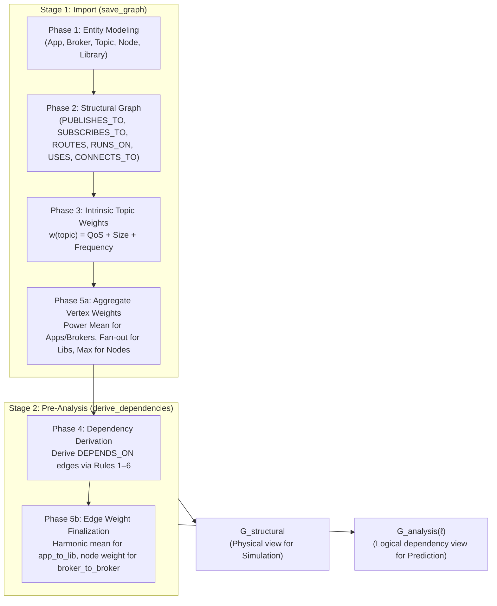

# Step 1: Model (Graph Construction & Weight Assignment)

**Transform raw system topology into a formal, weighted, directed multi-layer graph capturing structural architecture and runtime dependencies.**

[README](../README.md) | → [Step 2: Analyze](structural-analysis.md)

For the full CLI reference (`import_graph.py`, `export_graph.py`), see [cli-pipeline-guide.md — Step 1](cli-pipeline-guide.md#step-1-model--import--export).

---

## Table of Contents

1. [Overview & Execution Workflow](#1-overview--execution-workflow)
2. [Why Model as a Directed Dependency Graph?](#2-why-model-as-a-directed-dependency-graph)
3. [Formal Graph Definition](#3-formal-graph-definition)
4. [Five Construction Phases](#4-five-construction-phases)
   - [Phase 1: Entity Modeling](#41-phase-1--entity-modeling)
   - [Phase 2: Structural Topology & Fan-Out](#42-phase-2--structural-topology--fan-out)
   - [Phase 3: Intrinsic Topic Weighting](#43-phase-3--intrinsic-topic-weighting)
   - [Phase 4: Dependency Derivation](#44-phase-4--dependency-derivation)
   - [Phase 5: Aggregate Weight Propagation](#45-phase-5--aggregate-weight-propagation)
5. [Layer Projections](#5-layer-projections)
6. [Dual Graph Views (Simulation vs. Analysis)](#6-dual-graph-views-simulation-vs-analysis)
7. [Topology JSON Specification](#7-topology-json-specification)
8. [End-to-End Worked Example](#8-end-to-end-worked-example)
9. [Middleware Mapping](#9-middleware-mapping)
10. [Computational Complexity](#10-computational-complexity)
11. [Import, Export & Database Parity](#11-import-export--database-parity)

---

## 1. Overview & Execution Workflow

In distributed publish-subscribe architectures, components do not communicate through direct point-to-point calls. Instead, communication is mediated asynchronously through topics, brokers, and shared libraries. 

The modeling step transforms this topology into a **formal directed multi-layer graph** across two stages and five distinct phases:



### Stage Summary

| Stage | Trigger | Phases | What It Produces |
|:---|:---|:---|:---|
| **Import** | `save_graph()` / `import_graph.py` | **1, 2, 3, 5a** | All 5 entity types, 6 structural relationship types, topic fan-out counts, and vertex weights. |
| **Pre-Analysis** | `derive_dependencies()` / `analyze_graph.py` | **4, 5b** | Directed `DEPENDS_ON` edges across 6 derivation rules, multi-topic probabilistic coupling, and finalized edge weights. |

> [!NOTE]
> Splitting import from pre-analysis allows topologies to be imported, verified, and exported rapidly without computing expensive path derivations until analytical scoring is actually requested.

---

## 2. Why Model as a Directed Dependency Graph?

A physical architecture diagram shows *how data flows*. However, reliability, failure propagation, and risk analysis require knowing **who depends on whom**:

- **Data Flow vs. Dependency Flow**: If App $A$ publishes to Topic $T$ and App $B$ subscribes to $T$, data flows $A \to T \to B$. But if $A$ fails, $B$ is starved of data. Thus, the logical failure dependency is **$B \to A$** (Subscriber depends on Publisher).
- **Multi-Topic Failure Coupling**: If two services communicate across 5 critical topics rather than 1, a failure in the publisher impacts multiple message channels simultaneously.
- **Shared Library Blast Radius**: A bug in a shared library does not propagate sequentially; it takes down all consumer applications simultaneously.
- **Infrastructure Colocation**: Two brokers or apps running on the same host node share a common physical failure domain.

---

## 3. Formal Graph Definition

We define the system as a directed, attributed multi-layer graph:

$$\mathcal{G} = (V, E, \tau_V, \tau_E, w_V, w_E, \mathcal{L})$$

where:

- **Vertices ($V$)**: $V = V_{\text{app}} \cup V_{\text{broker}} \cup V_{\text{topic}} \cup V_{\text{node}} \cup V_{\text{lib}}$
- **Edges ($E$)**: $E = E_{\text{structural}} \cup E_{\text{dependency}}$
- **Vertex Types ($\tau_V$)**: $\tau_V : V \to \{\text{Application}, \text{Broker}, \text{Topic}, \text{Node}, \text{Library}\}$
- **Edge Types ($\tau_E$)**: $\tau_E : E \to \{\text{PUBLISHES\_TO}, \text{SUBSCRIBES\_TO}, \text{ROUTES}, \text{RUNS\_ON}, \text{CONNECTS\_TO}, \text{USES}, \text{DEPENDS\_ON}\}$
- **Vertex Weight ($w_V$)**: $w_V(v) \in [w_{\min}, 1.0]$ representing the intrinsic and aggregate criticality of entity $v$.
- **Edge Weight ($w_E$)**: $w_E(e) \in [w_{\min}, 1.0]$ representing the coupling intensity and failure transmission strength along edge $e$.
- **Layers ($\mathcal{L}$)**: $\mathcal{L} = \{\text{app}, \text{infra}, \text{mw}, \text{system}\}$.

---

## 4. Five Construction Phases

### 4.1 Phase 1: Entity Modeling

Every entity in the input JSON is imported into its corresponding vertex category:

| Entity | Primary Properties | Description |
|:---|:---|:---|
| **Node** | `id`, `name` | Physical or virtual compute host. |
| **Broker** | `id`, `name` | Middleware message routing engine. |
| **Topic** | `id`, `name`, `size`, `qos_*`, `frequency` | Asynchronous message distribution channel. |
| **Application** | `id`, `name`, `role`, `app_type`, `version`, `criticality`, `cm_*` | Executable software service or process. |
| **Library** | `id`, `name`, `version`, `cm_*` | Shared software module or package. |

#### Internal Code-Quality Attributes (`cm_*`)
For Applications and Libraries, static code metrics are ingested and flattened. Five of these metrics directly feed the **Code Quality Penalty (CQP)** in Step 2:
- `cm_total_loc` (Lines of Code), `cm_avg_wmc` (Weighted Methods per Class), `cm_avg_lcom` (Lack of Cohesion of Methods), `cm_avg_fanin` / `cm_avg_fanout` (Afferent/Efferent coupling).

---

### 4.2 Phase 2: Structural Topology & Fan-Out

Six physical edge types are imported directly from the input topology:

| Edge Type | Direction | Semantics |
|:---|:---|:---|
| `PUBLISHES_TO` | Application/Library $\to$ Topic | Component writes messages to this topic. |
| `SUBSCRIBES_TO` | Application/Library $\to$ Topic | Component reads messages from this topic. |
| `ROUTES` | Broker $\to$ Topic | Broker routes and manages traffic for this topic. |
| `RUNS_ON` | Application/Broker $\to$ Node | Component is hosted on this compute node. |
| `CONNECTS_TO` | Node $\to$ Node | Physical network link between hosts. |
| `USES` | Application/Library $\to$ Library | Software dependency on a shared library module. |

#### Topic Fan-Out Augmentation
Immediately after structural edge insertion, each topic is augmented with its degree counts:
- `subscriber_count(t)` $= |\{ a : (a, t) \in \text{SUBSCRIBES\_TO} \}|$
- `publisher_count(t)` $= |\{ a : (a, t) \in \text{PUBLISHES\_TO} \}|$

---

### 4.3 Phase 3: Intrinsic Topic Weighting

Topic weight $w(t)$ quantifies the intrinsic criticality of the data flow. It combines declared **QoS semantics**, **payload size**, and **message frequency**:

$$w(t) = \max\left(w_{\min}, \; \min\left(1.0, \; \beta \cdot \text{QoS}(t) + \alpha \cdot \text{SizeNorm}(t) + \psi \cdot \text{FreqNorm}(t)\right)\right)$$

where:
- $\beta = 0.75$ (QoS weight), $\alpha = 0.15$ (Payload size weight), $\psi = 0.10$ (Publishing frequency weight), $w_{\min} = 0.01$.

#### 1. QoS Score Formulation
$$\text{QoS}(t) = 0.30 \cdot \text{Score}_{\text{reliability}} + 0.40 \cdot \text{Score}_{\text{durability}} + 0.30 \cdot \text{Score}_{\text{priority}}$$

| QoS Attribute | Value | Score | Rationale |
|:---|:---|:---:|:---|
| **Reliability** | `RELIABLE`<br/>`BEST_EFFORT` | `1.0`<br/>`0.0` | Guaranteed delivery prevents packet loss failure. |
| **Durability** | `PERSISTENT`<br/>`TRANSIENT`<br/>`TRANSIENT_LOCAL`<br/>`VOLATILE` | `1.0`<br/>`0.6`<br/>`0.5`<br/>`0.0` | State survival across restarts ensures recoverability. |
| **Transport Priority** | `HIGHEST` / `CRITICAL` / `URGENT`<br/>`HIGH`<br/>`MEDIUM`<br/>`LOW` | `1.0`<br/>`0.66`<br/>`0.33`<br/>`0.0` | Scheduling priority under queue contention. |

#### 2. Size and Frequency Normalization
$$\text{SizeNorm}(t) = \min\left(1.0, \; \frac{\log_2(1 + \text{size\_kb})}{50.0}\right) \quad (\text{where } \text{size\_kb} = \text{bytes} / 1024)$$

$$\text{FreqNorm}(t) = \min\left(1.0, \; \frac{\log_{10}(1 + f_t)}{3.0}\right) \quad (\text{where } f_t \text{ is message rate in Hz})$$

> [!TIP]
> **Edge Inheritance**: Once $w(t)$ is computed, all incident structural edges (`PUBLISHES_TO`, `SUBSCRIBES_TO`, `ROUTES`) automatically inherit $w(t)$ and the topic's QoS vector.

---

### 4.4 Phase 4: Dependency Derivation

In Phase 4, the logical `DEPENDS_ON` edges are synthesized across 6 formal rules.

> **Direction Convention**: All `DEPENDS_ON` edges point from the **dependent** (the entity that suffers if a failure occurs) to the **dependency** (the entity whose failure causes the impact).

```
Data Flow:      Publisher ──────> Topic ──────> Subscriber
Dependency:     Subscriber ───────────────────> Publisher  (app_to_app)
```

| Rule | Dependency Type | Graph Pattern | Edge Weight ($w_E$) |
|:---:|:---|:---|:---|
| **1** | `app_to_app` | Subscriber $\to$ Topic $\leftarrow$ Publisher *(includes transitive library usage)* | Probabilistic union: $1 - \prod_{t \in T} (1 - w(t))$ |
| **2** | `app_to_broker` | App $\to$ Topic $\leftarrow$ Broker *(publisher or subscriber)* | Probabilistic union: $1 - \prod_{t \in T} (1 - w(t))$ |
| **3** | `node_to_node` | Node $B \to$ Node $A$ *(when hosted apps have an `app_to_app` dependency)* | Lifted union: $1 - \prod_{d} (1 - w(d))$ |
| **4** | `node_to_broker` | Node $\to$ Broker *(when a hosted app depends on a broker)* | Lifted union: $1 - \prod_{d} (1 - w(d))$ |
| **5** | `app_to_lib` | Application $\to$ Library *(via `USES` relationship)* | Harmonic mean: $\frac{2 \cdot w(\text{app}) \cdot w(\text{lib})}{w(\text{app}) + w(\text{lib})}$ |
| **6** | `broker_to_broker` | Broker $A \leftrightarrow$ Broker $B$ *(colocated on the same Node)* | Shared Node weight: $w(\text{node})$ |

#### Multi-Topic Probabilistic Union
When two applications communicate over multiple topics $T_{uv} = \{t_1, t_2, \dots, t_k\}$, they collapse into a single directed edge with:
- **`path_count`** $= |T_{uv}|$ (integer coupling density).
- **`weight`** $= 1 - \prod_{t \in T_{uv}} (1 - w(t))$ (monotonic failure exposure).

---

### 4.5 Phase 5: Aggregate Weight Propagation

#### Phase 5a (Import Stage): Vertex Aggregations

1. **Application Weight**: Generalized Power Mean ($p=3$) over all directly attached topics $T_{\text{app}}$:
   $$w(\text{app}) = \left(\frac{1}{|T_{\text{app}}|} \sum_{t \in T_{\text{app}}} w(t)^3\right)^{1/3}$$
   *(If an app has no direct topics but uses libraries, it inherits $\max_{l} w(l)$ in a second pass).*

2. **Broker Weight**: Generalized Power Mean ($p=3$) over all routed topics $T_{\text{routed}}$:
   $$w(\text{broker}) = \left(\frac{1}{|T_{\text{routed}}|} \sum_{t \in T_{\text{routed}}} w(t)^3\right)^{1/3}$$

3. **Library Weight**: Base topic/consumer weight scaled by afferent fan-out blast radius:
   $$w(\text{lib}) = \min\left(1.0, \; \text{base\_w} \cdot \left(1 + \gamma \cdot \log_2(1 + \text{DG}_{\text{in}})\right)\right) \quad (\gamma = 0.15)$$

4. **Node Weight**: Worst-case criticality of all hosted components:
   $$w(\text{node}) = \max_{v \in \text{hosted}} w(v)$$

#### Phase 5b (Pre-Analysis Stage): Edge Finalization
- `app_to_lib` edges take the symmetric harmonic mean of application and library weights:
  $$w_E(\text{app} \to \text{lib}) = \frac{2 \cdot w(\text{app}) \cdot w(\text{lib})}{w(\text{app}) + w(\text{lib})}$$
- `broker_to_broker` edges inherit the shared host node's weight.

---

## 5. Layer Projections

The graph provides 4 canonical layer projections defined in [`saag/core/layers.py`](../saag/core/layers.py):

| Layer | CLI Flag | Target Vertices | Included `dependency_type` Edges | Primary Use Case |
|:---|:---|:---|:---|:---|
| **Application** | `--layer app` | Application, Library | `app_to_app`, `app_to_lib` | Microservice & software component risk. |
| **Infrastructure**| `--layer infra`| Node | `node_to_node` | Host connectivity & hardware cascade risk. |
| **Middleware** | `--layer mw` | Application, Broker, Node | `app_to_broker`, `node_to_broker`, `broker_to_broker` | Broker bottleneck & routing failure analysis. |
| **System** | `--layer system` | All 5 entity types | All 6 dependency types | Full cross-layer holistic system analysis. |

---

## 6. Dual Graph Views (Simulation vs. Analysis)

To guarantee scientific rigor, the framework strictly decouples discrete-event simulation from analytical prediction:

```
                      ┌──────────────────────────────────────────────┐
                      │             System Topology JSON             │
                      └──────────────────────┬───────────────────────┘
                                             │
                                   save_graph() (Import)
                                             │
                      ┌──────────────────────┴───────────────────────┐
                      ▼                                              ▼
           ┌─────────────────────┐                       ┌─────────────────────┐
           │    G_structural     │                       │    G_analysis(ℓ)    │
           │ (Physical Topology) │                       │ (Logical Dependency)│
           └──────────┬──────────┘                       └──────────┬──────────┘
                      │                                             │
                      ▼                                             ▼
           ┌─────────────────────┐                       ┌─────────────────────┐
           │ Step 4: Simulation  │                       │ Steps 2-3: Analysis │
           │ (Ground-Truth Sim)  │                       │   (GNN & Metrics)   │
           └─────────────────────┘                       └─────────────────────┘
```

- **$G_{\text{structural}}$**: Contains physical edges (`PUBLISHES_TO`, `SUBSCRIBES_TO`, `ROUTES`, `RUNS_ON`, `USES`, `CONNECTS_TO`). Consumed **only** by Step 4 simulation.
- **$G_{\text{analysis}}(\ell)$**: Contains derived `DEPENDS_ON` edges across layer $\ell$. Consumed **only** by Step 2 structural metrics and Step 3 GNN prediction.

> [!IMPORTANT]
> **Independence Guarantee**: Prediction metrics never leak into simulation logic, and simulation cascade outputs never pollute graph construction.

---

## 7. Topology JSON Specification

Input topologies use a clear, declarative schema with nested entity lists and relationship pairs:

```json
{
  "metadata": {
    "scale": { "apps": 2, "topics": 1, "brokers": 1, "nodes": 2, "libs": 1 },
    "domain": "robotics"
  },
  "nodes": [
    { "id": "N0", "name": "ComputeNode_1" },
    { "id": "N1", "name": "ComputeNode_2" }
  ],
  "brokers": [
    { "id": "B0", "name": "MainBroker" }
  ],
  "topics": [
    {
      "id": "T0",
      "name": "/telemetry/imu",
      "size": 64,
      "qos": {
        "reliability": "RELIABLE",
        "durability": "TRANSIENT_LOCAL",
        "transport_priority": "HIGH"
      }
    }
  ],
  "applications": [
    {
      "id": "A0",
      "name": "ImuSensorApp",
      "role": ["pub"],
      "app_type": "driver",
      "criticality": true,
      "code_metrics": {
        "size": { "total_loc": 1200 },
        "complexity": { "avg_wmc": 12.5 },
        "cohesion": { "avg_lcom": 18.0 }
      }
    },
    {
      "id": "A1",
      "name": "NavigationApp",
      "role": ["sub"],
      "app_type": "controller",
      "criticality": true
    }
  ],
  "libraries": [
    {
      "id": "L0",
      "name": "MathLib",
      "version": "1.4.0"
    }
  ],
  "relationships": {
    "runs_on": [
      { "from": "A0", "to": "N0" },
      { "from": "A1", "to": "N1" },
      { "from": "B0", "to": "N0" }
    ],
    "routes": [{ "from": "B0", "to": "T0" }],
    "publishes_to": [{ "from": "A0", "to": "T0" }],
    "subscribes_to": [{ "from": "A1", "to": "T0" }],
    "connects_to": [{ "from": "N0", "to": "N1" }],
    "uses": [
      { "from": "A0", "to": "L0" },
      { "from": "A1", "to": "L0" }
    ]
  }
}
```

---

## 8. End-to-End Worked Example

Let us trace a concrete system with two applications (`A0: SensorApp`, `A1: MonitorApp`), one broker (`B0`), one shared library (`L0: NavLib`), and one topic (`T0: /temperature`).

### 1. Topic Weight Calculation (Phase 3)
- **QoS**: `RELIABLE` (1.0), `TRANSIENT_LOCAL` (0.5), `HIGH` (0.66)
  $$\text{QoS\_score} = 0.30(1.0) + 0.40(0.5) + 0.30(0.66) = 0.698$$
- **Size**: 64 bytes $\implies \text{SizeNorm} = \frac{\log_2(1 + 0.0625)}{50.0} \approx 0.00175$
- **Frequency**: Derived from $r \cdot p = 1.0 \times 0.66 = 0.66 \implies f = 100\text{ Hz} \implies \text{FreqNorm} \approx 0.6681$
- **Total Topic Weight**:
  $$w(T0) = 0.75(0.698) + 0.15(0.00175) + 0.10(0.6681) \approx \mathbf{0.591}$$

### 2. Vertex Weight Aggregation (Phase 5a)
- $w(\text{SensorApp}) = w(\text{MonitorApp}) = w(\text{MainBroker}) = \mathbf{0.591}$ (single topic power mean).
- For `NavLib` ($\text{DG}_{\text{in}} = 2$ consuming apps):
  $$w(\text{NavLib}) = 0.591 \times \left(1 + 0.15 \times \log_2(1 + 2)\right) \approx 0.591 \times 1.238 = \mathbf{0.732}$$

### 3. Dependency Derivation & Edge Finalization (Phases 4 & 5b)
- **`app_to_app`**: $\text{MonitorApp} \xrightarrow{\text{DEPENDS\_ON}} \text{SensorApp}$ ($w = 0.591$, $\text{path\_count} = 1$)
- **`app_to_broker`**: $\text{MonitorApp} \xrightarrow{\text{DEPENDS\_ON}} \text{MainBroker}$ ($w = 0.591$)
- **`app_to_broker`**: $\text{SensorApp} \xrightarrow{\text{DEPENDS\_ON}} \text{MainBroker}$ ($w = 0.591$)
- **`app_to_lib`**: $\text{SensorApp} \xrightarrow{\text{DEPENDS\_ON}} \text{NavLib}$ with harmonic mean:
  $$w_E = \frac{2 \times 0.591 \times 0.732}{0.591 + 0.732} = \mathbf{0.654}$$
- **`app_to_lib`**: $\text{MonitorApp} \xrightarrow{\text{DEPENDS\_ON}} \text{NavLib}$ ($w_E = \mathbf{0.654}$)

---

## 9. Middleware Mapping

The model maps directly to common publish-subscribe and message-oriented middleware:

| Model Element | ROS 2 / DDS | Apache Kafka | MQTT |
|:---|:---|:---|:---|
| **Application** | `rclcpp` / `rclpy` Node | Producer / Consumer Service | MQTT Client Application |
| **Topic** | DDS Topic | Kafka Topic / Partition | MQTT Topic Filter |
| **Broker** | DDS Domain Participant | Kafka Broker cluster | Mosquitto / EMQX Broker |
| **Node** | Host Machine / Pod | Kubernetes Worker Node | Edge Gateway / Server |
| **Library** | Shared C++/Python package | Maven / PyPI Dependency | Shared Client SDK |

---

## 10. Computational Complexity

| Phase | Operation | Algorithmic Complexity | Note |
|:---|:---|:---:|:---|
| **Phase 1** | Entity Creation | $\mathcal{O}(|V|)$ | Single-pass vertex insertion. |
| **Phase 2** | Structural Edges & Fan-Out | $\mathcal{O}(|E_S|)$ | Indexed endpoint matching. |
| **Phase 3** | Intrinsic Topic Weights | $\mathcal{O}(|V_{\text{topic}}|)$ | Direct algebraic evaluation. |
| **Phase 4** | Dependency Derivation | $\mathcal{O}(|V_{\text{app}}| \cdot \text{FanOut})$ | Bounded by publisher/subscriber fan-out per topic. |
| **Phase 5** | Weight Aggregations | $\mathcal{O}(|V| + |E_S|)$ | Local neighbor aggregation per component. |

> All graph modeling runs **once at design-time**, introducing zero runtime monitoring overhead.

---

## 11. Import, Export & Database Parity

The graph construction engine is implemented in two fully interchangeable repositories with **100% mathematical and topological parity**:
1. **`MemoryRepository`** ([`saag/infrastructure/memory_repo.py`](../saag/infrastructure/memory_repo.py)): In-memory NetworkX-based implementation for unit tests, rapid execution, and standalone CLI scripts.
2. **`Neo4jRepository`** ([`saag/infrastructure/neo4j_repo.py`](../saag/infrastructure/neo4j_repo.py)): Enterprise graph database implementation using optimized Cypher batch transactions for large topologies and persistence.

### Quick CLI Usage

```bash
# 1. Import topology (with database clear)
python cli/import_graph.py --input data/system.json --clear

# 2. Validate input schema without modifying the database
python cli/import_graph.py --input data/system.json --dry-run

# 3. Export a complete re-importable snapshot
python cli/export_graph.py --output output/snapshot.json

# 4. Export layer-specific analysis view
python cli/export_graph.py --output output/app_layer.json --format analysis --layer app
```

---

## 12. What Comes Next

With the multi-layer graph $\mathcal{G}$ constructed and weighted, proceed to:

→ [**Step 2: Structural & Quality Analysis (`structural-analysis.md`)**](structural-analysis.md)
