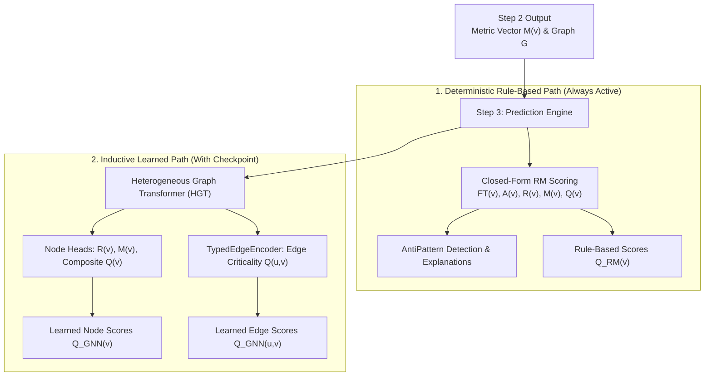
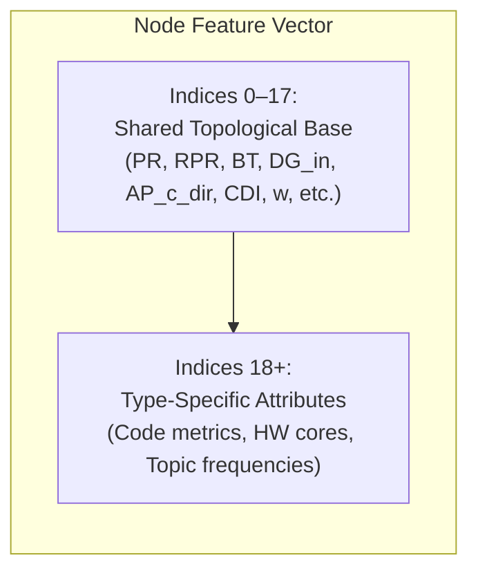
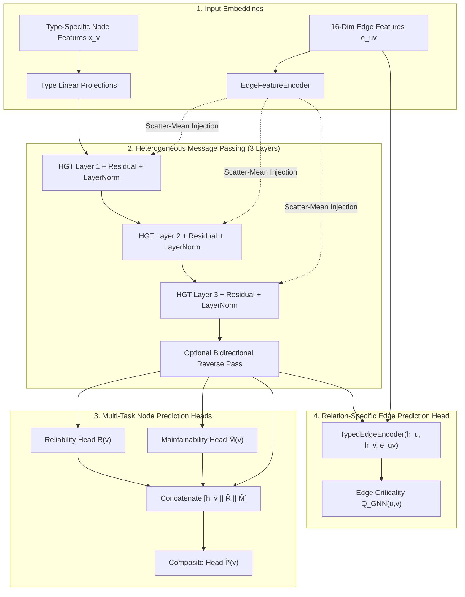
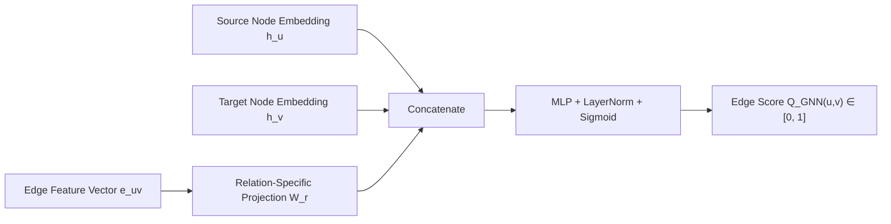

# Step 3: Predict — Rule-Based (RM) + Learned (GNN) Criticality

**Predict architectural component and relationship criticality by combining deterministic rule-based RM scoring with a Heterogeneous Graph Transformer (HGT) trained on simulation ground truth, alongside antipattern detection and explainability.**

← [Step 2: Analyze](structural-analysis.md) | → [Step 4: Simulate](failure-simulation.md)

---

## Table of Contents

1. [Overview & Core Philosophy](#1-overview--core-philosophy)
2. [Graph Data Preparation (PyTorch Geometric `HeteroData`)](#2-graph-data-preparation-pytorch-geometric-heterodata)
   - 2.1 [Node Feature Schema](#21-node-feature-schema)
   - 2.2 [Edge Feature Schema (16 Dimensions)](#22-edge-feature-schema-16-dimensions)
   - 2.3 [Target Labels & Dimension Masking](#23-target-labels--dimension-masking)
3. [Model Architecture](#3-model-architecture)
   - 3.1 [Heterogeneous Message Passing Backbone](#31-heterogeneous-message-passing-backbone)
   - 3.2 [Prediction Heads](#32-prediction-heads)
4. [Training Protocol & Loss Formulation](#4-training-protocol--loss-formulation)
   - 4.1 [Multi-Task Loss Equation](#41-multi-task-loss-equation)
   - 4.2 [Training Hyperparameters & Optimisation](#42-training-hyperparameters--optimisation)
5. [Edge Criticality Prediction](#5-edge-criticality-prediction)
6. [Comparing Rule-Based (RM) vs. Learned (GNN) Modes](#6-comparing-rule-based-rm-vs-learned-gnn-modes)
7. [Output Schema & Sample JSON](#7-output-schema--sample-json)
8. [CLI Reference & Commands](#8-cli-reference--commands)
9. [Known Limitations & Design Boundaries](#9-known-limitations--design-boundaries)
10. [What Comes Next](#10-what-comes-next)

---

## 1. Overview & Core Philosophy

Step 3 is the **unified prediction engine** of the framework. It evaluates the structural metric vector $M(v)$ and topology produced in Step 2 to generate component and edge criticality scores through two complementary modalities:



### Core Outputs

1. **Deterministic Rule-Based Scores ($Q_{\text{RM}}(v) \in [0, 1]$)**: Always computed. Uses closed-form AHP-weighted equations rooted in ISO/IEC 25010 ([structural-analysis.md §9](structural-analysis.md#9-analyze-stage--rule-based-rm-scoring)).
2. **Learned Node Criticality ($Q_{\text{GNN}}(v) \in [0, 1]$)**: Computed when a trained checkpoint exists. Discovers non-linear, multi-hop topological motifs.
3. **Learned Edge Criticality ($Q_{\text{GNN}}(u, v) \in [0, 1]$)**: Predicts relationship criticality directly on individual links.
4. **Architectural Antipatterns & Explanations**: Detects structural risks (e.g., SPOFs, Bottlenecks) with human-readable recommendations.

---

## 2. Graph Data Preparation (PyTorch Geometric `HeteroData`)

[`networkx_to_hetero_data()`](../saag/prediction/data_preparation.py) converts the NetworkX graph into a PyTorch Geometric `HeteroData` structure, partitioning nodes and edges by entity type.

### 2.1 Node Feature Schema

Node vectors consist of a **shared 18-dimensional topological base** (indices 0–17) followed by **type-specific extensions** (indices 18+):

| Node Type | Total Dimensions | Type-Specific Extensions (Indices 18+) |
|:---|:---:|:---|
| `Application` | **23** | 5 Code Quality attributes (`loc_norm`, `complexity_norm`, $I_{\text{code}}$, `lcom_norm`, $CQP$) |
| `Library` | **23** | 5 Code Quality attributes (`loc_norm`, `complexity_norm`, $I_{\text{code}}$, `lcom_norm`, $CQP$) |
| `Broker` | **19** | `max_connections_norm` |
| `Topic` | **22** | `subscriber_count_norm`, `publisher_count_norm`, `log1p_frequency_norm`, `topic_qos_criticality_ord` |
| `Node` (Infra) | **20** | `cpu_cores_norm`, `memory_gb_norm` |



#### Shared Topological Base (Indices 0–17 across all Node Types)
- `0`: PageRank ($PR$)
- `1`: Reverse PageRank ($RPR$)
- `2`: Betweenness Centrality ($BT$)
- `3`: Closeness Centrality ($CL$)
- `4`: Eigenvector Centrality ($EV$)
- `5`: In-Degree Normalised ($DG_{in}$)
- `6`: Out-Degree Normalised ($DG_{out}$)
- `7`: Clustering Coefficient ($CC$)
- `8`: Undirected Articulation Score
- `9`: Bridge Ratio ($BR$)
- `10`: Component QoS Weight ($w(v)$)
- `11`: QoS-Weighted In-Degree ($w_{in}$)
- `12`: QoS-Weighted Out-Degree ($w_{out}$)
- `13`: Multi-Path Coupling Index ($MPCI$)
- `14`: Path Complexity ($PC$)
- `15`: Fan-Out Criticality ($FOC$)
- `16`: Directed Articulation Point ($AP_c^{\text{dir}}$)
- `17`: Connectivity Degradation Index ($CDI$)

### 2.2 Edge Feature Schema (16 Dimensions)

Edge features capture both topological properties and declared QoS delivery guarantees:

| Index | Feature Key | Semantic Meaning |
|:---:|:---|:---|
| **0** | `qos_weight` | Continuous QoS weight $w(e) \in [0, 1]$ |
| **1** | `path_count_norm` | Normalized channel count: $\log_2(1 + \text{path\_count}) / \log_2(17)$ |
| **2–8** | `edge_type_one_hot` | One-hot indicator (`PUBLISHES_TO`, `SUBSCRIBES_TO`, `ROUTES`, `RUNS_ON`, `CONNECTS_TO`, `USES`, `DEPENDS_ON`) |
| **9** | `reliability_score` | QoS Reliability (`BEST_EFFORT` = 0.0, `RELIABLE` = 1.0) |
| **10** | `durability_score` | QoS Durability (`VOLATILE` = 0.0, `TRANSIENT_LOCAL` = 0.5, `TRANSIENT` = 0.6, `PERSISTENT` = 1.0) |
| **11** | `priority_score` | Transport Priority (`LOW` = 0.0, `MEDIUM` = 0.33, `HIGH` = 0.66, `URGENT` = 1.0) |
| **12** | `has_deadline` | Binary flag (1.0 if finite contract deadline is configured) |
| **13** | `deadline_ns_log` | Scaled contract deadline duration |
| **14** | `max_blocking_ms_log`| Scaled blocking timeout duration |
| **15** | `qos_heterogeneity_flag`| Flag indicating edge QoS diverges from system mode |

*(Note: Indices 9–15 are active for pub/sub interaction links; structural links default to 0).*

### 2.3 Target Labels & Dimension Masking

| Tensor Name | Target Shape | Semantic Purpose |
|:---|:---:|:---|
| `data[type].y` | $(N, 3)$ | Simulation ground-truth vectors: $[I^*(v), IR(v), IM(v)]$ |
| `data[type].y_rm` | $(N, 3)$ | Rule-based consistency regularization target: $[Q(v), R(v), M(v)]$ |
| `data[type].label_mask` | $(N,)$ | Boolean mask indicating which nodes were simulated (excludes unlabelled nodes) |
| `data[type].dimension_mask`| $(3,)$ | Boolean mask indicating measured ground-truth columns (masks unmeasured targets) |
| `data[rel].y_edge` | $(E, 3)$ | Per-edge ground-truth criticality labels |

---

## 3. Model Architecture



### 3.1 Heterogeneous Message Passing Backbone

The backbone consists of **3 layers of Heterogeneous Graph Transformer (`HGTConv`)** with hidden dimension $D = 64$, 4 attention heads, and dropout $p = 0.2$.

1. **Type-Specific Input Projection**:
   $$\mathbf{h}_v^{(0)} = \text{GELU}(\text{LayerNorm}(\mathbf{W}_{\text{type}(v)} \mathbf{x}_v))$$
2. **Edge Feature Injection & Convolution**:
   Edge attributes are projected and scatter-mean injected into target nodes before each convolution:
   $$\mathbf{h}_d \leftarrow \mathbf{h}_d + \frac{1}{|\mathcal{N}(d)|} \sum_{u \in \mathcal{N}(d)} \mathbf{W}_{\text{edge}}^{(k)} \mathbf{e}_{ud}$$
   $$\mathbf{h}_v^{(k+1)} = \text{Dropout}\left(\text{GELU}\left(\text{LayerNorm}\left(\text{HGTConv}_k(\mathbf{h}^{(k)}, \mathcal{E}) + \mathbf{h}_v^{(k)}\right)\right)\right)$$
3. **Bidirectional Reverse Flow**:
   When `use_bidirectional=True`, an inverted convolution pass transmits upstream signals:
   $$\mathbf{h}_v \leftarrow \mathbf{h}_v + 0.5 \cdot \mathbf{h}_v^{\text{rev}}$$

### 3.2 Prediction Heads

All prediction heads utilize `ResidualMLP` networks with final sigmoid activations bounding outputs in $[0, 1]$:

$$\begin{aligned}
\hat{R}(v) &= \text{Sigmoid}(\text{MLP}_R(\mathbf{h}_v)) \quad &\text{(Reliability)} \\
\hat{M}(v) &= \text{Sigmoid}(\text{MLP}_M(\mathbf{h}_v)) \quad &\text{(Maintainability)} \\
\hat{I}^*(v) &= \text{Sigmoid}(\text{MLP}_C([\mathbf{h}_v \parallel \hat{R}(v) \parallel \hat{M}(v)])) \quad &\text{(Composite Criticality)}
\end{aligned}$$

*(The composite head explicitly consumes dimension predictions to capture non-linear cross-attribute interactions).*

---

## 4. Training Protocol & Loss Formulation

### 4.1 Multi-Task Loss Equation

The model is trained end-to-end using a balanced composite loss combining point regression, ranking objectives, pairwise margin separation, and rule-based consistency:

$$\mathcal{L} = \mathcal{L}_{\text{composite}} + 0.5 \cdot \mathcal{L}_{\text{dimension}} + 0.3 \cdot \mathcal{L}_{\text{rank}} + 0.1 \cdot \mathcal{L}_{\text{pairwise}} + 0.1 \cdot \mathcal{L}_{\text{consistency}} + 0.3 \cdot \mathcal{L}_{\text{edge}}$$

| Loss Component | Mathematical Formulation | Optimization Target |
|:---|:---|:---|
| **$\mathcal{L}_{\text{composite}}$** | $\text{MSE}(\hat{I}^*(v), I^*(v))$ | Accurate absolute composite prediction on simulated nodes |
| **$\mathcal{L}_{\text{dimension}}$** | $\sum_{d} \text{MSE}(\hat{d}(v), I_d^*(v)) \cdot \text{mask}_d$ | Multi-task alignment on measured sub-dimensions |
| **$\mathcal{L}_{\text{rank}}$** | $-\frac{1}{N} \sum_{v} \log P(\text{rank}(v))$ | ListMLE loss optimizing global Kendall $\tau$ and Spearman $\rho$ |
| **$\mathcal{L}_{\text{pairwise}}$** | $\sum_{i,j: y_i - y_j > m} \frac{\max(0, \; m - (\hat{s}_i - \hat{s}_j))}{|\text{pairs}|}$ | Margin ranking ($m=0.05$) enforcing strict ordinal separation |
| **$\mathcal{L}_{\text{consistency}}$**| $\text{MSE}(\hat{s}_{\text{unlabelled}}, y_{\text{RM}})$ | Semi-supervised regularization on unlabelled nodes toward $Q_{\text{RM}}$ |
| **$\mathcal{L}_{\text{edge}}$** | $\frac{1}{|\mathcal{R}|} \sum_{r \in \mathcal{R}} \text{MSE}(\hat{y}_{\text{edge}}^{(r)}, y_{\text{edge}}^{(r)})$ | Relation-balanced MSE on edge criticality predictions |

### 4.2 Training Hyperparameters & Optimisation

- **Data Splits**: 60% Train / 20% Validation / 20% Test (stratified per node type).
- **Optimizer**: AdamW ($\text{lr} = 3 \times 10^{-4}$, weight decay $= 10^{-4}$, gradient clipping norm $= 1.0$).
- **Learning Rate Schedule**: `CosineAnnealingWarmRestarts` ($T_0 = 50, T_{\text{mult}} = 2, \eta_{\text{min}} = 3 \times 10^{-6}$).
- **Early Stopping**: 30 epochs patience on combined metric ($0.6 \cdot \rho_{\text{val}} + 0.4 \cdot (1 - \mathcal{L}_{\text{val}} / \mathcal{L}_{\text{best}})$).
- **Multi-Seed Robustness**: Sweeps seeds $\{42, 123, 456, 789, 2024\}$ and saves the best model based on validation Spearman $\rho$.

---

## 5. Edge Criticality Prediction



Edge criticality is evaluated directly on individual links via `TypedEdgeEncoder`:

$$Q_{\text{GNN}}(u, v) = \text{Sigmoid}\left(\text{MLP}_{\text{edge}}\left(\left[\mathbf{h}_u \parallel \mathbf{h}_v \parallel \mathbf{W}_r \mathbf{e}_{uv}\right]\right)\right)$$

### Ground Truth vs. Removal Oracle
- **Heuristic Training Labels**: Derived from source node impact discounted by bridge status:
  $$y_{\text{edge}}(u, v) = I^*(u) \times \begin{cases} 1.0 & \text{if } e \text{ is bridge} \\ 0.1 & \text{otherwise} \end{cases}$$
- **Simulated Removal Ground Truth**: Directly measured by severing edge $(u,v)$ under live endpoints:
  $$I_{\text{edge}}(u, v) = \text{Impact}(G \setminus \{(u,v)\}) - \text{Impact}(G)$$

---

## 6. Comparing Rule-Based (RM) vs. Learned (GNN) Modes

| Dimension | Rule-Based RM (`--predict-mode rm_only`) | Learned GNN (`--predict-mode gnn_only`) |
|:---|:---:|:---:|
| **Training Requirement** | **None** (Zero-shot deterministic execution) | Requires simulation ground truth ($I^*(v)$) |
| **Execution Latency** | $\approx 20\text{ms}$ (Algebraic closed-form) | $\approx 80\text{ms}$ (Forward neural pass) |
| **Node Scoring** | Exact AHP-weighted formula | Multi-task neural prediction heads |
| **Edge Scoring** | Structural proxies ($BR, BT, w(e)$) | Direct per-edge inference via `TypedEdgeEncoder` |
| **Interpretability** | **Complete** (Transparent metric contributions) | High (Multi-head attribution + attention) |
| **Multi-Hop Non-Linearity**| Bounded by 1-hop / 2-hop metric formulas | Deep multi-hop structural motif discovery |
| **Generalization** | Immediate on any valid graph | Optimal within trained domain (fine-tuning for transfer) |
| **Primary Use Case** | Baseline analysis, CI gates, unlabelled graphs | Deep architectural ranking, edge prioritization |

---

## 7. Output Schema & Sample JSON

Running `python cli/predict_graph.py --gnn-model <ckpt> --output results/prediction.json` produces the following unified schema:

```json
{
  "layers": {
    "system": {
      "total_components": 35,
      "rm": {
        "NavLib": {
          "overall": 0.54,
          "reliability": 0.63,
          "maintainability": 0.41,
          "fault_tolerance": 0.59,
          "availability": 0.58,
          "is_spof": true,
          "blast_radius": 12,
          "cascade_depth": 4
        }
      },
      "antipatterns": [
        {
          "entity_id": "NavLib",
          "entity_type": "Component",
          "name": "Single Point of Failure (SPOF)",
          "severity": "CRITICAL",
          "category": "Availability",
          "description": "NavLib is a directed cut vertex. Removing it partitions the dependency graph.",
          "recommendation": "Introduce redundancy: deploy backup instances or redundant routing paths.",
          "evidence": { "is_articulation_point": true, "availability_score": 0.58 }
        }
      ],
      "gnn": {
        "prediction_mode": "gnn_only",
        "node_scores": {
          "NavLib": {
            "component": "NavLib",
            "composite_score": 0.5432,
            "reliability_score": 0.6321,
            "maintainability_score": 0.4121,
            "criticality_level": "HIGH",
            "source": "GNN"
          }
        },
        "edge_scores": [
          {
            "source": "MonitorApp",
            "target": "SensorApp",
            "edge_type": "DEPENDS_ON",
            "composite_score": 0.4512,
            "reliability_score": 0.3211,
            "maintainability_score": 0.2512,
            "criticality_level": "MEDIUM"
          }
        ],
        "gnn_metrics": {
          "spearman_rho": 0.5871,
          "f1_score": 0.5052,
          "ndcg_10": 0.9211,
          "top_5_overlap": 0.60
        }
      }
    }
  }
}
```

---

## 8. CLI Reference & Commands

### 1. Training GNN Checkpoints (Requires Step 4 Simulation Results)

```bash
# Standard training across 5 random seeds
PYTHONPATH=. python cli/train_graph.py --layer system --seeds 42 123 456 789 2024

# Multi-scenario inductive training
PYTHONPATH=. python cli/train_graph.py --layer system --multi-scenario

# Train node model only (disable edge head)
PYTHONPATH=. python cli/train_graph.py --layer system --no-edge-model
```

### 2. Running Criticality Predictions

```bash
# Rule-based RM scoring only (no checkpoint required)
PYTHONPATH=. python cli/predict_graph.py --layer system

# GNN inference using trained checkpoint
PYTHONPATH=. python cli/predict_graph.py --layer system --gnn-model output/gnn_checkpoints/best_model --output results/prediction.json
```

### 3. Running Evaluation Protocols

```bash
# Primary: Repeated per-domain 5-fold cross-validation
PYTHONPATH=. python cli/kfold_evaluate.py

# Secondary: Cross-scenario Leave-One-Scenario-Out (LOSO) evaluation
PYTHONPATH=. python cli/loso_evaluate.py
```

---

## 9. Known Limitations & Design Boundaries

| # | Boundary / Limitation | Methodological Context & Mitigation |
|:--|:---|:---|
| **L1** | **Heuristic Edge Labels** | Training uses $I^*(u) \times \text{bridge\_multiplier}$. Direct simulation removal ground truth ($I_{\text{edge}}$) is available in Step 4 for validation. |
| **L2** | **Backbone Edge Scatter-Mean** | Node convolutions average incoming edge vectors. Individual per-edge features are preserved un-averaged in `TypedEdgeEncoder`. |
| **L3** | **Unsupervised Infrastructure Nodes** | Loss is computed over `Application` and `Library` nodes; Broker, Topic, and Host nodes learn via graph message passing. |
| **L4** | **Transductive vs. Inductive Scope** | Single-graph training operates transductively. Inductive transfer is validated via `loso_evaluate.py` across distinct scenarios. |
| **L5** | **Feature Version Compatibility** | Checkpoints require `feature_version >= 3` (Broker: 19, Topic: 22, Node: 20 dimensions). Older checkpoints must be retrained. |

---

## 10. What Comes Next

- **For Inference**: Proceed to **[Step 4: Simulate](failure-simulation.md)** and **[Step 5: Validate](validation.md)** to statistically evaluate predicted scores against discrete-event failure injection.
- **For Training**: Execute **[Step 4: Simulate](failure-simulation.md)** first to generate ground-truth impact labels $I^*(v)$ before running `cli/train_graph.py`.

---

← [Step 2: Analyze](structural-analysis.md) | → [Step 4: Simulate](failure-simulation.md)
