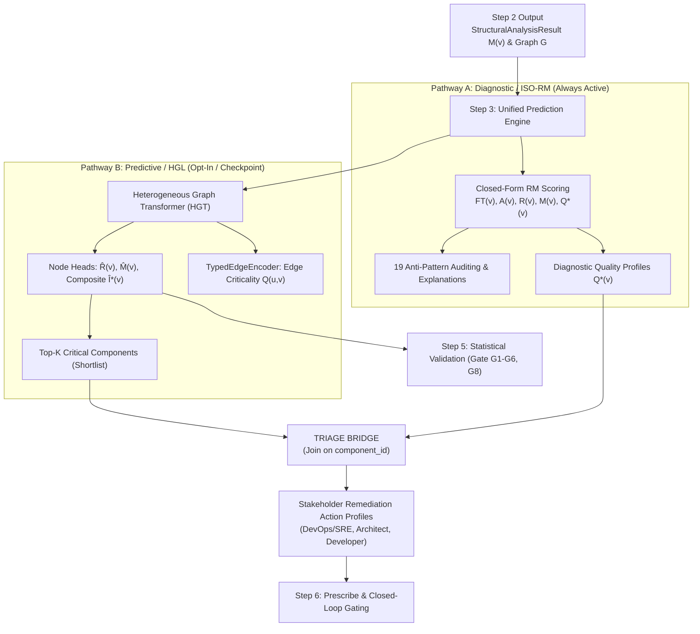
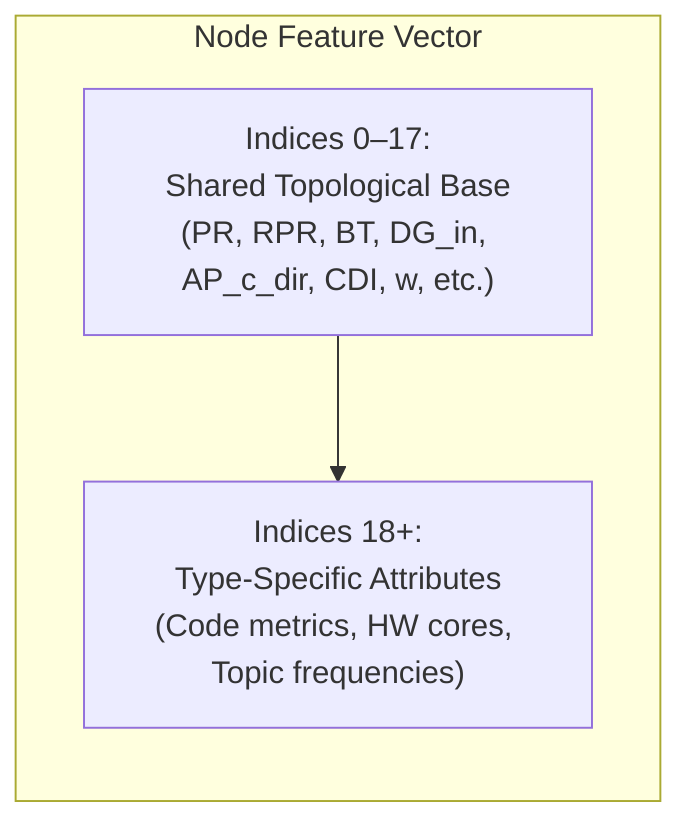
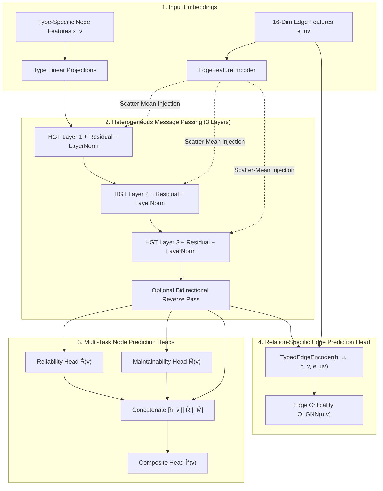

# Step 3: Predict — Dual-Pathway Architecture (Diagnostic RM + Learned HGT) & Triage Bridge

**Predict architectural component and relationship criticality through a dual-pathway architecture: combining deterministic ISO/IEC 25010/25019 quality attribution (Pathway A: Diagnostic) with Heterogeneous Graph Transformer neural blast-radius forecasting (Pathway B: Predictive), connected via the Triage Bridge to map high-risk components to stakeholder-oriented remediations.**

← [Step 2: Analyze](structural-analysis.md) | → [Step 4: Simulate](failure-simulation.md)

---

## Table of Contents

1. [Overview & Dual-Pathway Architecture](#1-overview--dual-pathway-architecture)
2. [Pathway A: Deterministic Diagnostic Quality Attribution (ISO-RM)](#2-pathway-a-deterministic-diagnostic-quality-attribution-iso-rm)
   - 2.1 [Theoretical Grounding (ISO/IEC 25010 & 25019)](#21-theoretical-grounding-isoiec-25010--25019)
   - 2.2 [The Declared RM Composite](#22-the-declared-rm-composite)
   - 2.3 [Anti-Pattern Auditing & Explanations](#23-anti-pattern-auditing--explanations)
3. [Pathway B: Inductive Learned Criticality & Blast-Radius Forecasting (HGT)](#3-pathway-b-inductive-learned-criticality--blast-radius-forecasting-hgt)
   - 3.1 [Heterogeneous Graph Transformer (HGT) Message Passing](#31-heterogeneous-graph-transformer-hgt-message-passing)
   - 3.2 [16-Dimensional QoS Edge Encodings](#32-16-dimensional-qos-edge-encodings)
   - 3.3 [Zero-GNN Cold-Start Fallback](#33-zero-gnn-cold-start-fallback)
4. [The Triage Bridge & Stakeholder-Oriented Root-Cause Attribution](#4-the-triage-bridge--stakeholder-oriented-root-cause-attribution)
   - 4.1 [Bridging Quantitative Blast Radius with Qualitative Root Cause](#41-bridging-quantitative-blast-radius-with-qualitative-root-cause)
   - 4.2 [Stakeholder Role Taxonomy](#42-stakeholder-role-taxonomy)
   - 4.3 [Triage Workflow & Data Contracts](#43-triage-workflow--data-contracts)
5. [Graph Data Preparation (PyTorch Geometric `HeteroData`)](#5-graph-data-preparation-pytorch-geometric-heterodata)
   - 5.1 [Node Feature Schema](#51-node-feature-schema)
   - 5.2 [Edge Feature Schema (16 Dimensions)](#52-edge-feature-schema-16-dimensions)
   - 5.3 [Target Labels & Dimension Masking](#53-target-labels--dimension-masking)
6. [Model Architecture & Prediction Heads](#6-model-architecture--prediction-heads)
   - 6.1 [Backbone Structure](#61-backbone-structure)
   - 6.2 [Multi-Task Node Prediction Heads](#62-multi-task-node-prediction-heads)
   - 6.3 [Relation-Specific Edge Prediction Head](#63-relation-specific-edge-prediction-head)
7. [Training Protocol & Multi-Task Loss Formulation](#7-training-protocol--multi-task-loss-formulation)
   - 7.1 [Multi-Task Loss Equation](#71-multi-task-loss-equation)
   - 7.2 [Training Hyperparameters & Optimisation](#72-training-hyperparameters--optimisation)
8. [Programmatic Python SDK & Use Cases](#8-programmatic-python-sdk--use-cases)
   - 8.1 [Pipeline Integration](#81-pipeline-integration)
   - 8.2 [Direct Use Case Execution (`saag.usecases`)](#82-direct-use-case-execution-saagusecases)
9. [CLI Reference & Commands](#9-cli-reference--commands)
10. [Output Schema & Sample JSON](#10-output-schema--sample-json)
11. [Known Limitations & Design Boundaries](#11-known-limitations--design-boundaries)
12. [What Comes Next](#12-what-comes-next)

---

## 1. Overview & Dual-Pathway Architecture

Step 3 is the **core analytical and predictive engine** of the Software-as-a-Graph (SaG) framework. Rather than forcing a single model to act simultaneously as a statistical estimator and an explainable standards compliance checker, Step 3 implements an explicit **dual-pathway architecture**:



### Key Architectural Invariants
1. **Parameter Independence**: Pathway A and Pathway B share no learned weights; neither is fitted to the other's output.
2. **Offline Oracle Separation**: Simulation (Step 4) acts solely as an offline supervisor generating supervised training labels ($I^*(v)$ via `FaultInjector`) and serving as the validation oracle (`FailureSimulator`). Prediction consumes labels from disk during training but has zero runtime dependency on the simulation engine.
3. **No Hallucination in Root-Cause Attribution**: The Triage Bridge joins quantitative rankings to qualitative RM diagnostics strictly by component ID, preventing neural models from guessing unverified architectural root causes.

---

## 2. Pathway A: Deterministic Diagnostic Quality Attribution (ISO-RM)

Pathway A provides deterministic, closed-form architectural quality attribution grounded in established software engineering standards.

### 2.1 Theoretical Grounding (ISO/IEC 25010 & 25019)
Criticality is formulated as a **Quality-in-Use** construct (ISO/IEC 25019:2023): the extent to which component degradation impairs system stakeholders from achieving their operational goals. It decomposes into two primary ISO/IEC 25010:2023 characteristics evaluated over the derived dependency multigraph $G_{\text{analysis}}$:

- **Reliability ($R$)**: Hierarchically combines:
  - **Fault Tolerance ($FT$)**: Cascading failure propagation depth, fan-out reach ($FOC$), and Multi-Path Coupling Index ($MPCI$).
  - **Availability ($A$)**: Topological single points of failure ($AP_c^{\text{dir}}$), bridge ratios ($BR$), and connectivity degradation ($CDI$).
- **Maintainability ($M$)**: Resistance to safe modification, code complexity penalty ($CQP$), and structural coupling ($PC$).

*(Note: Vulnerability/Security was formally retired because no fault-model instrument could validate it by construction; see [criticality.md](criticality.md) for full rationale).*

### 2.2 The Declared RM Composite
The composite score is algebraically derived from the retired 4-D model by dropping Vulnerability and renormalizing:

$$R(v) = 0.36 \cdot FT(v) + 0.64 \cdot A(v)$$

$$Q^*(v) = 0.80 \cdot R(v) + 0.20 \cdot M(v)$$

Scores are classified into 5 adaptive tiers using box-plot fences calculated over the system's score distribution: **CRITICAL** ($> Q_3 + 1.5 \cdot IQR$), **HIGH** ($> Q_3$), **MEDIUM** ($> Q_2$), **LOW** ($> Q_1$), and **MINIMAL** ($\le Q_1$).

### 2.3 Anti-Pattern Auditing & Explanations
Pathway A audits computed RM metrics against a formal catalog of **19 structural anti-patterns** (5 CRITICAL, 5 HIGH, 9 MEDIUM; see [antipatterns.md](antipatterns.md)) and generates human-readable explanations via `ExplanationEngine`.

---

## 3. Pathway B: Inductive Learned Criticality & Blast-Radius Forecasting (HGT)

Pathway B evaluates multi-hop, non-linear failure dynamics that exceed closed-form 1-hop and 2-hop structural metrics.

### 3.1 Heterogeneous Graph Transformer (HGT) Message Passing
The machine learning backbone uses stacked `torch_geometric.nn.HGTConv` layers with multi-head attention ($H=4$, $D=64$, dropout $p=0.2$). Heterogeneous node types (`Application`, `Library`, `Broker`, `Topic`, `Node`) and typed edges are parameterized with type-specific projection matrices.

### 3.2 16-Dimensional QoS Edge Encodings
Edge representations capture both topological connectivity and declared transport Quality-of-Service contracts (Reliability, Durability, Priority, Deadlines, Blocking Timeouts, and Heterogeneity Flags). An `EdgeFeatureEncoder` injects these 16-D representations into target nodes via scatter-mean aggregation prior to each convolution layer.

### 3.3 Zero-GNN Cold-Start Fallback
When no trained GNN checkpoint is available on disk, Pathway B falls back gracefully to Pathway A's deterministic $Q^*(v)$ ranking. The system never crashes in uncalibrated or cold-start deployments.

---

## 4. The Triage Bridge & Stakeholder-Oriented Root-Cause Attribution

### 4.1 Bridging Quantitative Blast Radius with Qualitative Root Cause
High-throughput predictive models (Pathway B) excel at isolating *which* components will cause the largest blast radius ($\hat{I}^*$), but neural embeddings cannot articulate *why* a component failed or *what* remediation an engineer should apply.

The **Triage Bridge** (`saag.analysis.triage.triage()` / `TriageUseCase`) solves this by filtering the system population down to the Top-$K$ (typically 5–15%) highest-risk components and joining each component ID with Pathway A's deterministic root-cause profile:

```
Top-K Shortlist (Pathway B) ──► Join on component_id ◄── RM CriticalityProfile (Pathway A)
                                          │
                                          ▼
                            Structured TriageEntry:
                            • Component ID & Rank
                            • Quantitative Score (GNN Î* or RM Q*)
                            • Elevated RM Dimensions (FT, A, M)
                            • Detected Anti-Pattern Signature
                            • Stakeholder Role Routing
```

### 4.2 Stakeholder Role Taxonomy
Triage entries map prioritized remediation actions to distinct engineering roles:

| Stakeholder Role | Key Responsibility | Targeted Anti-Patterns & Metrics | Primary Remediation Action |
|:---|:---|:---|:---|
| **DevOps / SRE** | Infrastructure locality & resilience | `SPOF`, `BROKER_OVERLOAD`, $AP_c^{\text{dir}}$, host co-location | Host anti-affinity rules, container migration, broker replication |
| **System Architect** | Pub-sub topology & transport contracts | `GOD_COMPONENT`, `FAILURE_HUB`, `CYCLE`, `DEEP_PIPELINE`, $CDI$ | Topic splitting, pub-sub decoupling, transport QoS contract upgrades |
| **Software Developer** | Internal code modularity & coupling | `CYCLIC_DEPENDENCY`, High $CQP$, High $MPCI$, High $PC$ | Code complexity refactoring, coupling reduction, dead dependency cleanup |

### 4.3 Triage Workflow & Data Contracts
The Triage Bridge produces a `TriageResult` containing `TriageEntry` items. In the REST API (`POST /api/v1/graph/prediction/triage`), `triage_presenter.py` categorizes these entries into structured stakeholder buckets (`devops_sre`, `architect`, `developer`).

---

## 2. Graph Data Preparation (PyTorch Geometric `HeteroData`)

[`networkx_to_hetero_data()`](../saag/prediction/data_preparation.py) converts the NetworkX graph into a PyTorch Geometric `HeteroData` structure, partitioning nodes and edges by entity type.

### 2.1 Node Feature Schema

Node vectors consist of a **shared 18-dimensional topological base** (indices 0–17) followed by **type-specific extensions** (indices 18+):

| Node Type | Total Dimensions | Type-Specific Extensions (Indices 18+) |
|:---|:---:|:---|
| `Application` | **23** | 5 Code Quality attributes (`loc_norm`, `complexity_norm`, $I_{\text{code}}$, `lcom_norm`, $CQP$) |
| `Library` | **23** | 5 Code Quality attributes (`loc_norm`, `complexity_norm`, $I_{\text{code}}$, `lcom_norm`, $CQP$) |
| `Broker` | **19** | `max_connections_norm` |
| `Topic` | **22** | `subscriber_count_norm`, `publisher_count_norm`, `log1p_frequency_norm`, `topic_qos_criticality_ord` |
| `Node` (Infra) | **20** | `cpu_cores_norm`, `memory_gb_norm` |



#### Shared Topological Base (Indices 0–17 across all Node Types)
- `0`: PageRank ($PR$)
- `1`: Reverse PageRank ($RPR$)
- `2`: Betweenness Centrality ($BT$)
- `3`: Closeness Centrality ($CL$)
- `4`: Eigenvector Centrality ($EV$)
- `5`: In-Degree Normalised ($DG_{in}$)
- `6`: Out-Degree Normalised ($DG_{out}$)
- `7`: Clustering Coefficient ($CC$)
- `8`: Undirected Articulation Score
- `9`: Bridge Ratio ($BR$)
- `10`: Component QoS Weight ($w(v)$)
- `11`: QoS-Weighted In-Degree ($w_{in}$)
- `12`: QoS-Weighted Out-Degree ($w_{out}$)
- `13`: Multi-Path Coupling Index ($MPCI$)
- `14`: Path Complexity ($PC$)
- `15`: Fan-Out Criticality ($FOC$)
- `16`: Directed Articulation Point ($AP_c^{\text{dir}}$)
- `17`: Connectivity Degradation Index ($CDI$)

## 5. Graph Data Preparation (PyTorch Geometric `HeteroData`)

[`networkx_to_hetero_data()`](../saag/prediction/data_preparation.py) converts the NetworkX graph into a PyTorch Geometric `HeteroData` multigraph structure, partitioning nodes and edges by entity type.

### 5.1 Node Feature Schema

Node vectors combine a **shared 18-dimensional topological base** (indices 0–17) with **type-specific attributes** (indices 18+):

| Node Type | Total Dimensions | Type-Specific Extensions (Indices 18+) |
|:---|:---:|:---|
| `Application` | **23** | 5 Code Quality attributes (`loc_norm`, `complexity_norm`, $I_{\text{code}}$, `lcom_norm`, $CQP$) |
| `Library` | **23** | 5 Code Quality attributes (`loc_norm`, `complexity_norm`, $I_{\text{code}}$, `lcom_norm`, $CQP$) |
| `Broker` | **19** | `max_connections_norm` |
| `Topic` | **22** | `subscriber_count_norm`, `publisher_count_norm`, `log1p_frequency_norm`, `topic_qos_criticality_ord` |
| `Node` (Infra) | **20** | `cpu_cores_norm`, `memory_gb_norm` |


#### Shared Topological Base (Indices 0–17 across all Node Types)
- `0`: PageRank ($PR$)
- `1`: Reverse PageRank ($RPR$)
- `2`: Betweenness Centrality ($BT$)
- `3`: Closeness Centrality ($CL$)
- `4`: Eigenvector Centrality ($EV$)
- `5`: In-Degree Normalised ($DG_{in}$)
- `6`: Out-Degree Normalised ($DG_{out}$)
- `7`: Clustering Coefficient ($CC$)
- `8`: Undirected Articulation Score
- `9`: Bridge Ratio ($BR$)
- `10`: Component QoS Weight ($w(v)$)
- `11`: QoS-Weighted In-Degree ($w_{in}$)
- `12`: QoS-Weighted Out-Degree ($w_{out}$)
- `13`: Multi-Path Coupling Index ($MPCI$)
- `14`: Path Complexity ($PC$)
- `15`: Fan-Out Criticality ($FOC$)
- `16`: Directed Articulation Point ($AP_c^{\text{dir}}$)
- `17`: Connectivity Degradation Index ($CDI$)

### 5.2 Edge Feature Schema (16 Dimensions)

Edge features capture both topological connectivity and declared transport QoS delivery guarantees:

| Index | Feature Key | Semantic Meaning |
|:---:|:---|:---|
| **0** | `qos_weight` | Continuous QoS weight $w(e) \in [0, 1]$ |
| **1** | `path_count_norm` | Normalized channel count: $\log_2(1 + \text{path\_count}) / \log_2(17)$ |
| **2–8** | `edge_type_one_hot` | One-hot indicator (`PUBLISHES_TO`, `SUBSCRIBES_TO`, `ROUTES`, `RUNS_ON`, `CONNECTS_TO`, `USES`, `DEPENDS_ON`) |
| **9** | `reliability_score` | QoS Reliability (`BEST_EFFORT` = 0.0, `RELIABLE` = 1.0) |
| **10** | `durability_score` | QoS Durability (`VOLATILE` = 0.0, `TRANSIENT_LOCAL` = 0.5, `TRANSIENT` = 0.6, `PERSISTENT` = 1.0) |
| **11** | `priority_score` | Transport Priority (`LOW` = 0.0, `MEDIUM` = 0.33, `HIGH` = 0.66, `URGENT` = 1.0) |
| **12** | `has_deadline` | Binary flag (1.0 if finite contract deadline is configured) |
| **13** | `deadline_ns_log` | Scaled contract deadline duration |
| **14** | `max_blocking_ms_log`| Scaled blocking timeout duration |
| **15** | `qos_heterogeneity_flag`| Flag indicating edge QoS diverges from system mode |

*(Note: Indices 9–15 are active for pub/sub interaction links; structural links default to 0).*

### 5.3 Target Labels & Dimension Masking

| Tensor Name | Target Shape | Semantic Purpose |
|:---|:---:|:---|
| `data[type].y` | $(N, 3)$ | Simulation ground-truth vectors: $[I^*(v), I_R(v), I_M(v)]$ |
| `data[type].y_rm` | $(N, 3)$ | Rule-based consistency regularization target: $[Q(v), R(v), M(v)]$. Populated whenever `rm_scores` are supplied; only consumed as a training signal when `rm_consistency_weight > 0` (default 0.0 — the diagnostic and predictive pathways are trained independently unless this ablation is opted into explicitly). |
| `data[type].label_mask` | $(N,)$ | Boolean mask indicating which nodes were simulated (excludes unlabelled nodes) |
| `data[type].dimension_mask`| $(3,)$ | Boolean mask indicating measured ground-truth columns (masks unmeasured targets) |
| `data[rel].y_edge` | $(E, 3)$ | Per-edge ground-truth criticality labels |

---

## 6. Model Architecture & Prediction Heads



### 6.1 Backbone Structure

The backbone consists of **3 layers of Heterogeneous Graph Transformer (`HGTConv`)** with hidden dimension $D = 64$, 4 attention heads, and dropout $p = 0.2$.

1. **Type-Specific Input Projection**:
   $$\mathbf{h}_v^{(0)} = \text{GELU}(\text{LayerNorm}(\mathbf{W}_{\text{type}(v)} \mathbf{x}_v))$$
2. **Edge Feature Injection & Convolution**:
   Edge attributes are projected and scatter-mean injected into target nodes before each convolution:
   $$\mathbf{h}_d \leftarrow \mathbf{h}_d + \frac{1}{|\mathcal{N}(d)|} \sum_{u \in \mathcal{N}(d)} \mathbf{W}_{\text{edge}}^{(k)} \mathbf{e}_{ud}$$
   $$\mathbf{h}_v^{(k+1)} = \text{Dropout}\left(\text{GELU}\left(\text{LayerNorm}\left(\text{HGTConv}_k(\mathbf{h}^{(k)}, \mathcal{E}) + \mathbf{h}_v^{(k)}\right)\right)\right)$$
3. **Bidirectional Reverse Flow**:
   When `use_bidirectional=True`, an inverted convolution pass transmits upstream signals:
   $$\mathbf{h}_v \leftarrow \mathbf{h}_v + 0.5 \cdot \mathbf{h}_v^{\text{rev}}$$

### 6.2 Multi-Task Node Prediction Heads

All prediction heads utilize `ResidualMLP` networks with final sigmoid activations bounding outputs in $[0, 1]$:

$$\begin{aligned}
\hat{R}(v) &= \text{Sigmoid}(\text{MLP}_R(\mathbf{h}_v)) \quad &\text{(Reliability)} \\
\hat{M}(v) &= \text{Sigmoid}(\text{MLP}_M(\mathbf{h}_v)) \quad &\text{(Maintainability)} \\
\hat{I}^*(v) &= \text{Sigmoid}(\text{MLP}_C([\mathbf{h}_v \parallel \hat{R}(v) \parallel \hat{M}(v)])) \quad &\text{(Composite Blast Radius)}
\end{aligned}$$

*(The composite head explicitly consumes dimension predictions to capture non-linear cross-attribute interactions).*

### 6.3 Relation-Specific Edge Prediction Head

Evaluated directly on individual links via `TypedEdgeEncoder`:

$$Q_{\text{GNN}}(u, v) = \text{Sigmoid}\left(\text{MLP}_{\text{edge}}\left(\left[\mathbf{h}_u \parallel \mathbf{h}_v \parallel \mathbf{W}_r \mathbf{e}_{uv}\right]\right)\right)$$

---

## 7. Training Protocol & Multi-Task Loss Formulation

### 7.1 Multi-Task Loss Equation

The model is trained end-to-end using a balanced composite loss combining point regression, ranking objectives, pairwise margin separation, and rule-based consistency:

$$\mathcal{L} = \mathcal{L}_{\text{composite}} + 0.5 \cdot \mathcal{L}_{\text{dimension}} + 0.3 \cdot \mathcal{L}_{\text{rank}} + 0.1 \cdot \mathcal{L}_{\text{pairwise}} + 0.1 \cdot \mathcal{L}_{\text{consistency}} + 0.3 \cdot \mathcal{L}_{\text{edge}}$$

| Loss Component | Mathematical Formulation | Optimization Target |
|:---|:---|:---|
| **$\mathcal{L}_{\text{composite}}$** | $\text{MSE}(\hat{I}^*(v), I^*(v))$ | Accurate absolute composite prediction on simulated nodes |
| **$\mathcal{L}_{\text{dimension}}$** | $\sum_{d} \text{MSE}(\hat{d}(v), I_d^*(v)) \cdot \text{mask}_d$ | Multi-task alignment on measured sub-dimensions |
| **$\mathcal{L}_{\text{rank}}$** | $-\frac{1}{N} \sum_{v} \log P(\text{rank}(v))$ | ListMLE loss optimizing global Kendall $\tau$ and Spearman $\rho$ |
| **$\mathcal{L}_{\text{pairwise}}$** | $\sum_{i,j: y_i - y_j > m} \frac{\max(0, \; m - (\hat{s}_i - \hat{s}_j))}{|\text{pairs}|}$ | Margin ranking ($m=0.05$) enforcing strict ordinal separation |
| **$\mathcal{L}_{\text{consistency}}$**| $\text{MSE}(\hat{s}_{\text{unlabelled}}, y_{\text{RM}})$ | Semi-supervised regularization on unlabelled nodes toward $Q_{\text{RM}}$ |
| **$\mathcal{L}_{\text{edge}}$** | $\frac{1}{|\mathcal{R}|} \sum_{r \in \mathcal{R}} \text{MSE}(\hat{y}_{\text{edge}}^{(r)}, y_{\text{edge}}^{(r)})$ | Relation-balanced MSE on edge criticality predictions |

### 7.2 Training Hyperparameters & Optimisation

- **Data Splits**: 60% Train / 20% Validation / 20% Test (stratified per node type).
- **Optimizer**: AdamW ($\text{lr} = 3 \times 10^{-4}$, weight decay $= 10^{-4}$, gradient clipping norm $= 1.0$).
- **Learning Rate Schedule**: `CosineAnnealingWarmRestarts` ($T_0 = 50, T_{\text{mult}} = 2, \eta_{\text{min}} = 3 \times 10^{-6}$).
- **Early Stopping**: 30 epochs patience on combined metric ($0.6 \cdot \rho_{\text{val}} + 0.4 \cdot (1 - \mathcal{L}_{\text{val}} / \mathcal{L}_{\text{best}})$).
- **Multi-Seed Robustness**: Sweeps seeds $\{42, 123, 456, 789, 2024\}$ and saves the best model based on validation Spearman $\rho$.

---

## 8. Programmatic Python SDK & Use Cases

### 8.1 Pipeline Integration

The high-level `Pipeline` builder configures and executes Pathway A, Pathway B, and the Triage Bridge in dependency order:

```python
import saag

pipeline = (
    saag.Pipeline.from_json("data/system.json", clear=True)
        .analyze(layer="system")
        .simulate(layer="system", mode="exhaustive")  # offline ground truth
        .predict(triage_k=10)                         # Pathway A + Pathway B + Triage Bridge
        .validate()
        .prescribe()
        .run()
)

# Inspect Triage Bridge output
if pipeline.prediction and pipeline.prediction.triage:
    triage_res = pipeline.prediction.triage
    print(f"Triage Source: {triage_res.ranking_source}, Evaluated: {triage_res.population} nodes")
    for entry in triage_res.entries:
        print(f"Rank #{entry.rank}: {entry.component_id} ({entry.level}) -> Action: {entry.priority_action}")
        print(f"  Stakeholder Roles: {', '.join(entry.roles)}")
```

### 8.2 Direct Use Case Execution (`saag.usecases`)

For fine-grained, decoupled execution without database dependencies:

```python
from saag.usecases import DiagnosticUseCase, PredictiveUseCase, TriageUseCase

# Pathway A: Diagnostic Quality Attribution
diag_uc = DiagnosticUseCase()
quality, problems, summary, explanation = diag_uc.execute(structural_result=struct_result)

# Pathway B: Inductive Blast-Radius Forecasting
pred_uc = PredictiveUseCase(gnn_checkpoint_dir="output/gnn_checkpoints/best_model")
gnn_result = pred_uc.execute(structural_result=struct_result, graph=nx_graph)

# Triage Bridge: Scoping Diagnosis to Top-K Risks
triage_uc = TriageUseCase()
triage_result = triage_uc.execute(prediction_result=gnn_result, k=10)
```

---

## 9. CLI Reference & Commands

### 1. Training GNN Checkpoints (Requires Step 4 Simulation Results)

```bash
# Standard training across 5 random seeds
PYTHONPATH=. python cli/train_graph.py --layer system --seeds 42 123 456 789 2024

# Multi-scenario inductive training
PYTHONPATH=. python cli/train_graph.py --layer system --multi-scenario

# Train node model only (disable edge head)
PYTHONPATH=. python cli/train_graph.py --layer system --no-edge-model
```

### 2. Running Criticality Predictions & Triage

```bash
# Rule-based RM scoring + Triage (cold-start fallback mode)
PYTHONPATH=. python cli/predict_graph.py --layer system --triage-k 10

# Full Dual-Pathway Prediction + GNN Inference + Triage Bridge
PYTHONPATH=. python cli/predict_graph.py --layer system \
  --gnn-model output/gnn_checkpoints/best_model \
  --triage-k 10 \
  --output output/prediction.json
```

### 3. Evaluating Anti-Pattern CI/CD Gates

```bash
# Standalone anti-pattern scan: exit 0 (clean), 1 (medium smells), 2 (critical/high smells)
PYTHONPATH=. python cli/detect_antipatterns.py --layer system --output-antipatterns output/antipatterns.json
```

---

## 10. Output Schema & Sample JSON

Running `python cli/predict_graph.py --gnn-model <ckpt> --triage-k 5 --output output/prediction.json` produces the following unified schema:

```json
{
  "layers": {
    "system": {
      "total_components": 35,
      "rm": {
        "NavLib": {
          "overall": 0.54,
          "reliability": 0.63,
          "maintainability": 0.41,
          "fault_tolerance": 0.59,
          "availability": 0.58,
          "is_spof": true,
          "blast_radius": 12,
          "cascade_depth": 4
        }
      },
      "antipatterns": [
        {
          "entity_id": "NavLib",
          "entity_type": "Component",
          "name": "Single Point of Failure (SPOF)",
          "severity": "CRITICAL",
          "category": "Availability",
          "description": "NavLib is a directed cut vertex. Removing it partitions the dependency graph.",
          "recommendation": "Introduce redundancy: deploy backup instances or redundant routing paths.",
          "evidence": { "is_articulation_point": true, "availability_score": 0.58 }
        }
      ],
      "gnn": {
        "prediction_mode": "gnn_only",
        "node_scores": {
          "NavLib": {
            "component": "NavLib",
            "composite_score": 0.8432,
            "reliability_score": 0.8321,
            "maintainability_score": 0.6121,
            "criticality_level": "CRITICAL",
            "source": "GNN"
          }
        },
        "edge_scores": [
          {
            "source": "MonitorApp",
            "target": "SensorApp",
            "edge_type": "DEPENDS_ON",
            "composite_score": 0.4512,
            "reliability_score": 0.3211,
            "maintainability_score": 0.2512,
            "criticality_level": "MEDIUM"
          }
        ],
        "gnn_metrics": {
          "spearman_rho": 0.5871,
          "f1_score": 0.5052,
          "ndcg_10": 0.9211,
          "top_5_overlap": 0.60
        }
      },
      "triage": {
        "layer": "system",
        "k": 5,
        "ranking_source": "gnn",
        "population": 35,
        "entries": [
          {
            "component_id": "NavLib",
            "rank": 1,
            "ranking_score": 0.8432,
            "component_type": "Library",
            "pattern": "Single Point of Failure (SPOF)",
            "level": "CRITICAL",
            "priority_action": "Introduce redundancy: deploy backup instances or redundant routing paths.",
            "roles": ["DevOps", "Architect"],
            "elevated_dimensions": ["Availability", "Fault Tolerance"]
          }
        ]
      }
    }
  }
}
```

---

## 11. Known Limitations & Design Boundaries

| # | Boundary / Limitation | Methodological Context & Mitigation |
|:--|:---|:---|
| **L1** | **Heuristic Edge Labels** | Training uses $I^*(u) \times \text{bridge\_multiplier}$. Direct simulation removal ground truth ($I_{\text{edge}}$) is available in Step 4 for validation. |
| **L2** | **Backbone Edge Scatter-Mean** | Node convolutions average incoming edge vectors. Individual per-edge features are preserved un-averaged in `TypedEdgeEncoder`. |
| **L3** | **Unsupervised Infrastructure Nodes** | Loss is computed over `Application` and `Library` nodes; Broker, Topic, and Host nodes learn via graph message passing. |
| **L4** | **Transductive vs. Inductive Scope** | Single-graph training operates transductively. Inductive transfer is validated via `loso_evaluate.py` across distinct scenarios. |
| **L5** | **Feature Version Compatibility** | Checkpoints require `feature_version >= 3` (Broker: 19, Topic: 22, Node: 20 dimensions). Older checkpoints must be retrained. |

---

## 12. What Comes Next

- **For Inference**: Proceed to **[Step 4: Simulate](failure-simulation.md)** and **[Step 5: Validate](validation.md)** to statistically evaluate predicted scores against discrete-event failure injection, and **[Step 6: Prescribe](prescription.md)** to compile verified refactoring blueprints.
- **For Training**: Execute **[Step 4: Simulate](failure-simulation.md)** first to generate ground-truth impact labels $I^*(v)$ before running `cli/train_graph.py`.

---

← [Step 2: Analyze](structural-analysis.md) | → [Step 4: Simulate](failure-simulation.md)
