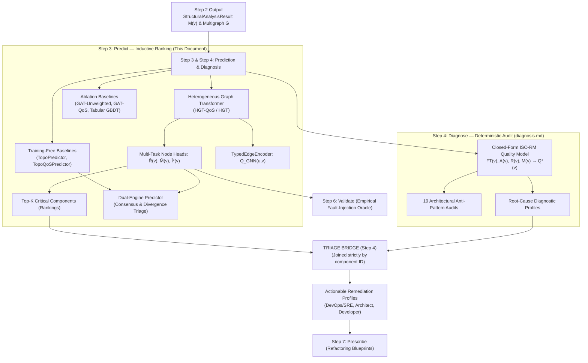
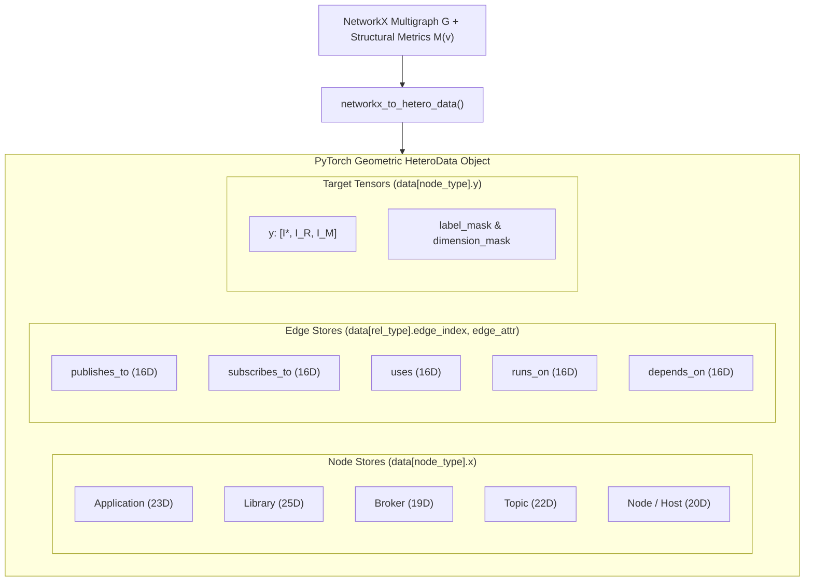
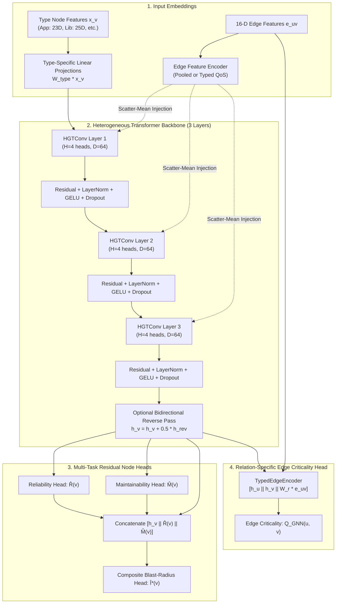
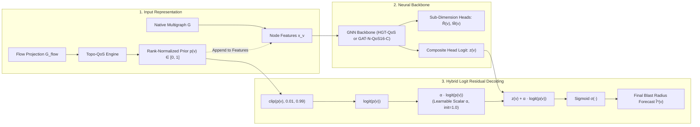
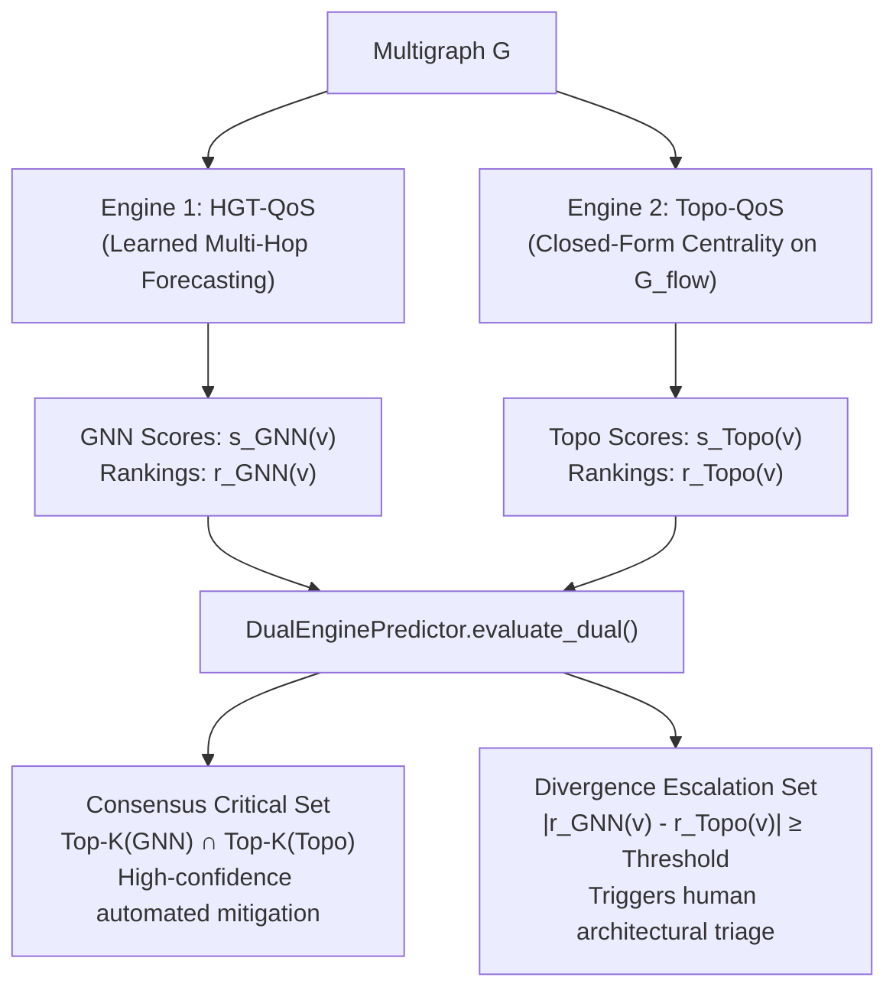

# Step 3: Predict — Criticality & Blast-Radius Forecasting

**Forecast architectural component and relationship failure blast radius using learned and structural graph models, ranking components by systemic risk without requiring live fault injection at runtime.**

← [Step 2: Analyze](structural-analysis.md) | [README](../README.md) | **Step 3: Predict** | → [Step 4: Diagnose](diagnosis.md)

---

## Table of Contents

1. [Overview & Dual-Pathway Architecture](#1-overview--dual-pathway-architecture)
2. [The Prediction Model Family at a Glance](#2-the-prediction-model-family-at-a-glance)
3. [Feature Representation & Data Preparation (`HeteroData`)](#3-feature-representation--data-preparation-heterodata)
   - 3.1 [Node Feature Schema (18-D Base + Type Extensions)](#31-node-feature-schema-18-d-base--type-extensions)
   - 3.2 [Edge Feature Schema (16-Dimensional QoS Encodings)](#32-edge-feature-schema-16-dimensional-qos-encodings)
   - 3.3 [Edge Injection: Pooled vs. Typed QoS Encoders](#33-edge-injection-pooled-vs-typed-qos-encoders)
   - 3.4 [Target Tensors & Dimension Masking](#34-target-tensors--dimension-masking)
4. [Primary Model: Heterogeneous Graph Transformer (HGT-QoS)](#4-primary-model-heterogeneous-graph-transformer-hgt-qos)
   - 4.1 [Model Motivation & High-Level Architecture](#41-model-motivation--high-level-architecture)
   - 4.2 [Type-Specific Projections & Message Passing](#42-type-specific-projections--message-passing)
   - 4.3 [Bidirectional Information Flow (Reverse Pass)](#43-bidirectional-information-flow-reverse-pass)
   - 4.4 [Multi-Task Residual Prediction Heads](#44-multi-task-residual-prediction-heads)
   - 4.5 [Relation-Specific Edge Criticality Head](#45-relation-specific-edge-criticality-head)
   - 4.6 [SaG-Hybrid Models: Learning a Residual Correction to the Closed-Form Prior](#46-sag-hybrid-models-learning-a-residual-correction-to-the-closed-form-prior)
     - 4.6.1 [Motivation: Resolving Complementary Engine Deficits](#461-motivation-resolving-complementary-engine-deficits)
     - 4.6.2 [Prior Formulation & Logit Residual Decoding](#462-prior-formulation--logit-residual-decoding)
     - 4.6.3 [Model Variants: SaG-Hybrid vs. SaG-Hybrid-GAT](#463-model-variants-sag-hybrid-vs-sag-hybrid-gat)
     - 4.6.4 [Empirical Results in the JSS Manuscript (Section 7.6)](#464-empirical-results-in-the-jss-manuscript-section-76)
5. [Ablation & Control Baseline Models](#5-ablation--control-baseline-models)
   - 5.1 [Homogeneous GAT Baselines (Unweighted & Scalar-Weighted)](#51-homogeneous-gat-baselines-unweighted--scalar-weighted)
   - 5.2 [Non-Graph Tabular Baseline (`tab_gbm` / GBM-Feat)](#52-non-graph-tabular-baseline-tab_gbm--gbm-feat)
   - 5.3 [Training-Free Structural Baselines (`TopoPredictor` & `TopoQoSPredictor`)](#53-training-free-structural-baselines-topopredictor--topoqospredictor)
   - 5.4 [Deterministic ISO-RM Cold-Start Fallback](#54-deterministic-iso-rm-cold-start-fallback)
6. [Dual-Engine Predictor: Consensus & Divergence Triage](#6-dual-engine-predictor-consensus--divergence-triage)
   - 6.1 [Dual-Engine vs. SaG-Hybrid: Architectural Distinction](#61-dual-engine-vs-sag-hybrid-architectural-distinction)
   - 6.2 [Dual-Engine Triage Sets](#62-dual-engine-triage-sets)
7. [Training Protocol & Multi-Task Loss Formulation](#7-training-protocol--multi-task-loss-formulation)
   - 7.1 [The Composite Criticality Loss Function](#71-the-composite-criticality-loss-function)
   - 7.2 [Detailed Loss Components & Mathematical Equations](#72-detailed-loss-components--mathematical-equations)
   - 7.3 [Optimization, Schedulers & Early Stopping](#73-optimization-schedulers--early-stopping)
   - 7.4 [Inductive Evaluation: Leave-One-System-Out (LOSO)](#74-inductive-evaluation-leave-one-system-out-loso)
8. [Programmatic Python SDK & Service Reference](#8-programmatic-python-sdk--service-reference)
   - 8.1 [Unified `PredictionService` Orchestration](#81-unified-predictionservice-orchestration)
   - 8.2 [Direct Use Case Execution (`saag.usecases`)](#82-direct-use-case-execution-saagusecases)
   - 8.3 [End-to-End High-Level `Pipeline` Builder](#83-end-to-end-high-level-pipeline-builder)
9. [CLI Reference & Workflows](#9-cli-reference--workflows)
   - 9.1 [Training Models (`cli/train_graph.py`)](#91-training-models-clitrain_graphpy)
   - 9.2 [Running Predictions (`cli/predict_graph.py`)](#92-running-predictions-clipredict_graphpy)
10. [Output Schemas & Artifact Examples](#10-output-schemas--artifact-examples)
11. [Known Methodological Invariants & Design Boundaries](#11-known-methodological-invariants--design-boundaries)
12. [What Comes Next](#12-what-comes-next)

For the complete CLI command reference (`predict_graph.py`, `train_graph.py`), see [cli-pipeline-guide.md — Step 3](cli-pipeline-guide.md#step-3-predict) and [Step 3b](cli-pipeline-guide.md#step-3b-train-gnn).

---

```
┌─────────────────────────────────────────────────────────────────────────────┐
│                             STEP 3 AT A GLANCE                              │
├───────────────────┬─────────────────────────────────────────────────────────┤
│ Primary Input     │ • M(v): 53-field StructuralMetrics vector from Step 2.  │
│                   │ • The multigraph G (native) or its DEPENDS_ON flow      │
│                   │   projection, depending on the variant.                 │
│                   │ • Optional: a trained GNN checkpoint.                   │
├───────────────────┼─────────────────────────────────────────────────────────┤
│ Core Engine       │ PredictionService (saag/prediction/service.py) running  │
│                   │ HGT-QoS, an ablation arm, a training-free baseline, or  │
│                   │ the deterministic RM fallback.                          │
├───────────────────┼─────────────────────────────────────────────────────────┤
│ Key Operations    │ 1. Build HeteroData: 18-D base + type extensions,       │
│                   │    16-D QoS edge encodings.                             │
│                   │ 2. Forward pass -> multi-task heads Î*(v), R̂(v), M̂(v).  │
│                   │ 3. Rank components; cut the Top-K shortlist.            │
│                   │ 4. Optionally run Topo-QoS alongside for dual-engine    │
│                   │    consensus/divergence triage.                         │
├───────────────────┼─────────────────────────────────────────────────────────┤
│ Primary Outputs   │ • Î*(v) blast-radius forecasts and a ranked ordering.   │
│                   │ • Top-K critical shortlist (K = round(0.20·|V_app|)).   │
│                   │ • Q̂(u,v): per-relationship edge criticality.            │
├───────────────────┼─────────────────────────────────────────────────────────┤
│ Zero-Checkpoint   │ With no trained model present, Step 3 falls back to the │
│ Behavior          │ deterministic RM composite Q*(v). It never fails hard.  │
├───────────────────┼─────────────────────────────────────────────────────────┤
│ Downstream Handoff│ • Step 4 (Diagnose): Top-K enters the Triage Bridge.    │
│                   │ • Step 6 (Validate): ranks scored against I*(v).        │
└───────────────────┴─────────────────────────────────────────────────────────┘
```

### Where this sits in the JSS paper

| | |
|:---|:---|
| **Manuscript section** | §4 (HGT architecture, 16-D edge encoding, multi-task heads, the loss), §6.2 (baselines and substrate parity), §7.2 (matched controls), and §7.6 (SaG-Hybrid models). |
| **Paper's name for this** | the **Predictive Pathway** — "Failure-Impact Forecasting, the primary task". This document calls it **Pathway B**. |
| **Symbols** | $\hat{I}^*(v)$, $\hat{R}(v)$, $\hat{M}(v)$, $\hat{Q}(u,v)$, prior $p(v)$, residual scalar $\alpha$ — identical. Variant names follow §6.2's `-N` / `-QoS` grammar; see §2 below. |
| **Results** | RQ1 (Table 7), RQ2 matched controls (Table 6), RQ3 ablations, RQ4 zero-shot transfer (Table 9b), RQ5 cost (§7.5), and §7.6 hybrid evaluation (Table 8). **Read the headline honestly:** On their own, HGT-QoS ($\rho = 0.638$) and Topo-QoS ($0.553$) are statistically on par ($+0.085$, $p = 0.151$, Holm $0.303$). However, combined in the hybrid engines (**SaG-Hybrid** at $\rho = 0.657$, Holm $p = 0.0068$; **SaG-Hybrid-GAT** at $\rho = 0.683$, Holm $p = 0.0029$), they **significantly outperform closed-form ranking** on 11 of 12 held-out folds. |

> [!NOTE]
> **Eight steps here, four stages in the paper.** This repository numbers the pipeline in eight
> executable steps (Model, Analyze, Predict, Diagnose, Simulate, Validate, Prescribe, Visualize),
> because that is what you run. The JSS manuscript describes a coarser **four-stage** pipeline —
> Typed Multigraph Formulation → QoS-Aware Dependency Projection → Heterogeneous Graph Learning
> (Predictive Pathway) → Explainable Quality Attribution (Explanation Layer) — because that is what
> it evaluates. Steps 1 and 2 together are the paper's stages 1–2; Step 3 is stage 3; Step 4 is
> stage 4. The paper also refers to a "Validate stage" and a "Prescribe stage" without numbering
> them: those are Steps 6 and 7.
>
> The two arms are named differently too. This documentation says **Pathway B** for the learned
> ranking arm and **Pathway A** for the deterministic diagnostic arm, matching `PredictiveUseCase`
> and `DiagnosticUseCase` in the code. The paper calls them the **Predictive Pathway** (§4) and the
> **Explanation Layer** (§5). They are the same two things.

---

## 1. Overview & Dual-Pathway Architecture

Steps 3 and 4 form the **predictive and analytical engine** of the Software-as-a-Graph (SaG) platform. Rather than forcing a single model to act simultaneously as an inductive statistical regressor and a transparent standards-compliance checker, SaG divides the problem into two distinct, cooperative pathways:

- **Step 3 (Predict) — Pathway B (Predictive Ranking Engine)**: Uses learned relational graph models (or training-free structural centralities) to forecast multi-hop, non-linear failure blast radius $I^*(v)$ and rank components by systemic criticality.
- **Step 4 (Diagnose) — Pathway A (Deterministic Diagnostic Engine)**: Computes closed-form ISO/IEC 25010 Quality Model attributions ($Q^*(v)$), audits 19 architectural anti-patterns, and produces causal root-cause explanations (see [diagnosis.md](diagnosis.md)).



### Core Methodological Invariants

> [!IMPORTANT]
> **Three Invariants Govern Step 3:**
> 1. **Parameter Independence**: Pathway A (Step 4) and Pathway B (Step 3) share no learned weights; neither is fitted to the other's output. By default, consistency regularization weight is set to `0.0`.
> 2. **Offline Oracle Separation**: The discrete-event simulation engine (Step 5) serves solely as an *offline supervisor* to generate ground-truth labels during training ($I^*(v)$ via `FaultInjector`) and as an empirical validation oracle in Step 6 (`FailureSimulator`). Step 3 operates strictly as an offline-trained inductive predictor and has **zero runtime dependency on simulation**.
> 3. **No Hallucination in Root-Cause Attribution**: Neural networks rank *which* components are critical, but they never hallucinate *why*. The Triage Bridge joins quantitative rankings to deterministic Step 4 anti-pattern findings strictly by component ID.

---

## 2. The Prediction Model Family at a Glance

SaG does not treat prediction as a monolithic black-box. `saag/prediction/` provides a suite of
learned, ablation, and closed-form models, each answering a precise scientific or operational
question.

**Two things to know before reading the table.** First, there are two different identifier
namespaces and it is easy to conflate them: the **variant id** (`hgl_qos`, `gl_full`, …) is the key
of `results/*.json`, of `output/loso_cache/`, and of the `--variant` CLI flag, whereas the
**model-class id** (`homo_unweighted`, `homo_scalar`) selects a Python class inside
[`saag/prediction/models/baselines.py`](../saag/prediction/models/baselines.py). The table below is
keyed on the variant id, because that is what the manuscript's tables are keyed on.

Second, display names come from a single source of truth,
[`saag/evaluation/variant_registry.py`](../saag/evaluation/variant_registry.py) — never hand-copy
them. The manuscript's naming grammar is encoded there: a **`-N` infix marks the native
multigraph**, its absence marks the derived Application–Library `DEPENDS_ON` flow projection, and a
**`-QoS` suffix** marks a configuration that consumes declared QoS contracts. *SaG* denotes the
framework and is never a variant name.

| Variant id | Display name | Model Class | Training? | Substrate & Feature Scope | Research Question / Operational Purpose | Output |
|:---|:---|:---|:---:|:---|:---|:---|
| `hgl_qos` | **HGT-QoS** | Heterogeneous Graph Transformer (`NodeCriticalityGNN`) | **Yes** | Native multigraph; heterogeneous nodes (19–25D) + 16D edge QoS | **Primary learned model**: do typed relations, multi-hop attention, and QoS contracts forecast multi-hop cascade blast radius? | $\hat{I}^*(v), \hat{R}(v), \hat{M}(v), \hat{Q}(u,v)$ |
| `hgl` | **HGT** | Heterogeneous Graph Transformer (`NodeCriticalityGNN`) | **Yes** | Native multigraph; heterogeneous nodes, QoS channel masked | **RQ3 ablation**: do multi-dimensional transport QoS profiles beat pure topological connectivity? | $\hat{I}^*(v), \hat{R}(v), \hat{M}(v)$ |
| `hgl_qos_prior` | **SaG-Hybrid** | Heterogeneous Graph Transformer (`NodeCriticalityGNN` + prior) | **Yes** | Native multigraph; heterogeneous nodes + 16D edge QoS + Topo-QoS prior | **JSS §7.6 headline hybrid (Amendment 5)**: HGT-QoS learning a residual correction to the rank-normalized Topo-QoS prior. Beats closed-form on 11/12 folds ($\rho = 0.657$, Holm $p = 0.0068$). | $\hat{I}^*(v), \hat{R}(v), \hat{M}(v)$ |
| `gl_qos16_prior` | **SaG-Hybrid-GAT** | Homogeneous GAT (`HomogeneousGAT_ScalarWeighted` + prior) | **Yes** | Native multigraph; flat nodes + 16D edge QoS + Topo-QoS prior | **JSS §7.6 capacity-matched hybrid (Amendment 6)**: untyped GAT (288 channels, 16-D QoS) learning a correction to Topo-QoS. Highest LOSO accuracy ($\rho = 0.683$, Holm $p = 0.0029$). | Criticality score $\in [0, 1]$ |
| `gl_full_qos` | **GAT-N-QoS** | Homogeneous GAT (`homo_scalar`) | **Yes** | **Native multigraph**; flat nodes + 1D scalar edge weight $w(e)$ | **RQ2 substrate-matched control**: with QoS present, does heterogeneous typing still add anything? | Criticality score $\in [0, 1]$ |
| `gl_full` | **GAT-N** | Homogeneous GAT (`homo_unweighted`) | **Yes** | **Native multigraph**; flat nodes, topology only | **RQ2 substrate-matched control**: the untyped, unweighted floor. | Criticality score $\in [0, 1]$ |
| `gl_qos` | **GAT-QoS** | Homogeneous GAT (`homo_scalar`) | **Yes** | Flow **projection**; flat nodes + scalar $w(e)$ | In-distribution ablation arm (JSS Table 5 only). | Criticality score $\in [0, 1]$ |
| `gl` | **GAT** | Homogeneous GAT (`homo_unweighted`) | **Yes** | Flow **projection**; topology only | Classic graph-attention baseline (JSS Table 5 only). | Criticality score $\in [0, 1]$ |
| `tab_gbm` | **GBM-Feat** | Gradient-Boosted Trees (`GradientBoostingRegressor`) | **Yes** | Identical typed node features, no message passing | **Non-graph control**: is the gain the aggregation, or just the features? Not a manuscript column. | Criticality score $\in [0, 1]$ |
| `topo_qos` | **Topo-QoS** | QoS-Weighted Structural Centrality (`TopoQoSPredictor`) | **No** | Flow projection with inverted QoS distance $d = 1/(w + \epsilon)$ | Training-free baseline $0.6 \cdot BT_{\text{QoS}} + 0.4 \cdot AP$. **The baseline every claim of learned superiority must clear.** | Topological score $\in [0, 1]$ |
| `topo_baseline` | **Topo** | Unweighted Structural Centrality (`TopoPredictor`) | **No** | Flow projection, unweighted | Classical structural baseline $0.6 \cdot BT + 0.4 \cdot AP$. | Topological score $\in [0, 1]$ |
| `topology_rm` | **RM** | Closed-Form Attribute Synthesis | **No** | Step 2 structural metrics + declared composite weights | **Cold-start fallback**: with no GNN checkpoint, Step 3 falls back to $Q^*(v)$. A *diagnostic reference*, not a ranking model. | $Q^*(v) \in [0, 1]$ |
| — | **Dual-Engine** | Ensemble & Consensus Evaluator (`DualEnginePredictor`) | Ensemble | Runs HGT-QoS and Topo-QoS concurrently | **Operational triage**: Consensus Critical Set (high confidence) and Divergence Escalation Set (human triage trigger). | Consensus & Divergence Sets |

The registry also carries four **RQ2 confound controls** (`gl_full_cap` / GAT-N-C, `gl_full_qos_cap` / GAT-N-QoS-C, `gl_full_qos16_cap` / GAT-N-QoS16-C, `hgl_qos_uni` / HGT-QoS-U) and the two **hybrid variants** (`hgl_qos_prior` / SaG-Hybrid, `gl_qos16_prior` / SaG-Hybrid-GAT).
Under Amendment 2, the capacity-matched and channel-matched controls were executed in a unified CPU sweep (JSS Table 6), proving that the 16-D QoS channel drives learned ranking ($+0.07$, $p = 0.016$), whereas relation-specific weights add nothing at matched capacity. Under Amendments 5 & 6, the hybrid engines synthesize the strengths of the closed-form and learned pathways, achieving the highest predictive accuracy under Leave-One-Scenario-Out (LOSO) cross-validation.

> [!IMPORTANT]
> **`gl` and `gl_qos` do not denote one substrate.** `reproduce/main_table.py` runs them on the
> flow projection, while `cli/loso_evaluate.py` and `cli/kfold_evaluate.py` route only the `topo_*`
> variants through the projection and hand `gl`/`gl_qos` the **native** graph. That is why the same
> stored variant id prints as **GAT-QoS** in the in-distribution table and **GAT-N-QoS** under LOSO
> and k-fold. `variant_registry.resolve()` encodes the aliasing and `label()` takes a `harness`
> argument for exactly this reason — never re-derive it in a caller, and never read a display name
> across harnesses without checking which one produced it.

> [!NOTE]
> **The RM composite's weights are declared constants, not AHP output.** $r_\alpha = 0.36$ and
> $(0.80, 0.20)$ were re-derived algebraically from the retired 4-D AHP vector (A=0.43, R=0.24,
> M=0.17, V=0.16) by dropping Vulnerability and renormalising; the paper states the same hedge in
> §5.2 ("declared constants with documented internal structure rather than independently elicited
> expert judgments"). AHP *is* live for the Topic QoS sub-weights and the intra-dimension vectors,
> with $\lambda = 0.70$ shrinkage. See
> [structural-analysis.md §9.4–9.5](structural-analysis.md#94-ahp-weight-derivation--consistency).

---

## 3. Feature Representation & Data Preparation (`HeteroData`)

The module [`saag/prediction/data_preparation.py`](../saag/prediction/data_preparation.py) converts the in-memory NetworkX multigraph into a PyTorch Geometric [`HeteroData`](../saag/prediction/data_preparation.py) structure via `networkx_to_hetero_data()`.



### 3.1 Node Feature Schema (18-D Base + Type Extensions)

Every node vector begins with an **18-dimensional shared topological base** (indices 0–17) computed during Step 2 (Analyze). Node types append domain-specific attributes (indices 18+), ensuring each entity presents its full physical and architectural context:

```
┌────────────────────────────────────────────────────────┬────────────────────────────────────────────┐
│         Indices 0–17: Shared Topological Base          │       Indices 18+: Type-Specific Ext       │
│  PR, RPR, BT, CL, EV, DG_in, DG_out, CC, AP, BR, ...   │  Code Quality, Topic Freq, Hardware Cores  │
└────────────────────────────────────────────────────────┴────────────────────────────────────────────┘
```

#### Shared Topological Base (Indices 0–17)

These are read straight out of Step 2's $M(v)$ vector — this stage computes none of them.
[structural-analysis.md §6](structural-analysis.md#6-the-7-phase-topological-analysis-engine) and
[§8](structural-analysis.md#8-formal-metric-definitions-tier-1--tier-2) are the definitional home;
the glosses below are one-line reminders, not independent definitions.

| Index | Symbol / Metric | Description & Normalization |
|:---:|:---|:---|
| **0** | $PR(v)$ | PageRank (downstream authority, teleport $\alpha = 0.85$) |
| **1** | $RPR(v)$ | Reverse PageRank (upstream dependency exposure) |
| **2** | $BT(v)$ | Betweenness Centrality (fraction of shortest paths routing through $v$) |
| **3** | $CL(v)$ | Closeness Centrality (mean shortest path to all reachable nodes) |
| **4** | $EV(v)$ | Eigenvector Centrality (influence weighted by neighbor centrality) |
| **5** | $DG_{\text{in}}(v)$ | Normalized In-Degree ($\deg^-(v) / (N - 1)$) |
| **6** | $DG_{\text{out}}(v)$ | Normalized Out-Degree ($\deg^+(v) / (N - 1)$) |
| **7** | $CC(v)$ | Local Clustering Coefficient (transitivity among neighbors) |
| **8** | $AP(v)$ | Undirected Articulation Score (biconnected-component cut-vertex indicator) — note indices 8 and 16 carry **two different** articulation metrics, undirected and directed |
| **9** | $BR(v)$ | Bridge Ratio (fraction of incident edges that are structural bridges) |
| **10** | $w(v)$ | Node QoS Weight (aggregate criticality of incident transport contracts) |
| **11** | $w_{\text{in}}(v)$ | QoS-Weighted In-Degree ($\sum_{u} w(u, v)$) |
| **12** | $w_{\text{out}}(v)$ | QoS-Weighted Out-Degree ($\sum_{u} w(v, u)$) |
| **13** | $MPCI(v)$ | Multi-Path Coupling Index — *afferent* multi-topic channel density: $\sum_{e \in \text{In}(v)} \max(\text{path\_count}(e) - 1, 0) \,/\, (\lvert V \rvert - 1)$ |
| **14** | $PC(v)$ | Path Complexity — mean *efferent* channel multiplicity: $\frac{1}{\lvert \text{Out}(v) \rvert}\sum_{e \in \text{Out}(v)} \log_2(1 + \text{path\_count}(e))$ |
| **15** | $FOC(v)$ | Fan-Out Criticality — **Topic nodes only**; rate-modulated subscriber blast radius, $0$ for every other type |
| **16** | $AP_c^{\text{dir}}(v)$ | Directed Articulation Point (strongly-connected component cut vertex) |
| **17** | $CDI(v)$ | Connectivity Degradation Index (change in pair connectivity upon removing $v$) |

#### Type-Specific Extensions (Indices 18+)

| Node Type | Total Dimensions | Extension Columns (Indices 18+) | Description & Rationale |
|:---|:---:|:---|:---|
| `Application` | **23** | `loc_norm`, `complexity_norm`, $I_{\text{code}}$, `lcom_norm`, $CQP$ | Code-level maintainability metrics: lines of code, cyclomatic complexity, code quality index, lack of cohesion in methods, and composite code penalty. |
| `Library` | **25** | 5 Code Quality metrics + `library_uses_reach_norm`, `library_downstream_subs_norm` | Applications depend on libraries via `USES`. Includes transitive dependency reach and downstream subscriber load. |
| `Broker` | **19** | `max_connections_norm` | Message broker capacity: maximum concurrent TCP/AMQP client connections. |
| `Topic` | **22** | `subscriber_count_norm`, `publisher_count_norm`, `log1p_frequency_norm`, `topic_qos_criticality_ord` | Message exchange dynamics: active subscriber and publisher counts, message throughput frequency, and ordinal QoS profile tier. |
| `Node` (Host) | **20** | `cpu_cores_norm`, `memory_gb_norm` | Infrastructure hardware capacity: physical CPU core count and RAM allocation. |

> [!NOTE]
> **SaG-Hybrid Prior Feature Extension (Index 23 / 25):**
> When training or evaluating hybrid variants (`hgl_qos_prior`, `gl_qos16_prior`) with `append_prior=True`, an additional column is appended to `Application` (index 23, total 24D) and `Library` (index 25, total 26D) node feature vectors. This column holds the rank-normalized `topo_prior` score $p(v) \in [0, 1]$. Infrastructure nodes (`Topic`, `Broker`, `Node`) receive $p(v) = 0.0$.

---

### 3.2 Edge Feature Schema (16-Dimensional QoS Encodings)

Edge features capture both topological connectivity and declared transport Quality-of-Service (QoS) delivery contracts. The 16-dimensional edge vector $\mathbf{e}_{uv} \in \mathbb{R}^{16}$ is defined as follows:

| Index | Feature Name | Representation / Range | Semantic Meaning |
|:---:|:---|:---:|:---|
| **0** | `qos_weight` | Continuous $[0, 1]$ | Aggregate continuous QoS weight $w(e)$ synthesized from delivery contracts |
| **1** | `path_count_norm` | Continuous $[0, 1]$ | Logarithmic normalized channel multiplicity: $\min\left(\frac{\log_2(1 + \text{paths})}{\log_2(17)}, 1.0\right)$ |
| **2–8** | `edge_type_one_hot` | One-hot $\in \{0, 1\}^7$ | 7 relation types: `PUBLISHES_TO`, `SUBSCRIBES_TO`, `ROUTES`, `RUNS_ON`, `CONNECTS_TO`, `USES`, `DEPENDS_ON` |
| **9** | `reliability_score` | Ordinal $\{0.0, 1.0\}$ | Transport reliability: `BEST_EFFORT` ($0.0$), `RELIABLE` ($1.0$) |
| **10** | `durability_score` | Ordinal $\{0.0, 0.5, 0.6, 1.0\}$ | Message durability: `VOLATILE` ($0.0$), `TRANSIENT_LOCAL` ($0.5$), `TRANSIENT` ($0.6$), `PERSISTENT` ($1.0$) |
| **11** | `priority_score` | Ordinal $\{0.0, 0.33, 0.66, 1.0\}$ | Priority tier: `LOW` ($0.0$), `MEDIUM` ($0.33$), `HIGH` ($0.66$), `URGENT` ($1.0$) |
| **12** | `has_deadline` | Binary $\{0.0, 1.0\}$ | Flag indicating whether a strict message delivery deadline contract is declared |
| **13** | `deadline_ns_log` | Continuous $[0, 1]$ | Normalized deadline duration: $\min\left(\frac{\log_{10}(1 + \text{deadline\_ms})}{10.0}, 1.0\right)$ |
| **14** | `max_blocking_ms_log` | Continuous $[0, 1]$ | Normalized blocking timeout for synchronous publishes |
| **15** | `qos_heterogeneity_flag`| Binary $\{0.0, 1.0\}$ | Flag indicating edge QoS contract diverges from the system-wide modal contract |

*(Note: Indices 9–15 are populated for pub/sub dataflow edges; structural edges such as `RUNS_ON` default to neutral 0.0 values).*

---

### 3.3 Edge Injection: Pooled vs. Typed QoS Encoders

Before convolving over nodes, edge features must be integrated into the message passing stream. SaG supports two edge injection architectures:

1. **Pooled Edge Feature Encoder (`EdgeFeatureEncoder`)**:
   Projects the entire 16-D edge vector through a single shared linear layer:
   $$\mathbf{e}'_{uv} = \text{GELU}(\mathbf{W}_{\text{edge}} \mathbf{e}_{uv} + \mathbf{b})$$
   Target nodes aggregate incoming edge embeddings via scatter-mean aggregation before each convolution layer:
   $$\mathbf{h}_d \leftarrow \mathbf{h}_d + \frac{1}{|\mathcal{N}_{\text{in}}(d)|} \sum_{u \in \mathcal{N}_{\text{in}}(d)} \mathbf{e}'_{ud}$$

2. **Typed QoS Edge Feature Encoder (`TypedQoSEdgeFeatureEncoder`)**:
   Disentangles structural relation type from transport QoS parameters. It maintains a **separate linear projection matrix for each relation type $r$** that maps the 7 continuous QoS features (indices 9–15) into the hidden space:
   $$\mathbf{e}'_{uv} = \text{GELU}(\mathbf{W}_r^{(\text{qos})} \mathbf{e}_{uv}[9:16] + \mathbf{b}_r)$$
   This ensures that a `RELIABLE` contract on a `PUBLISHES_TO` edge is parameterized independently from a `RELIABLE` contract on a `SUBSCRIBES_TO` or `ROUTES` edge.

---

### 3.4 Target Tensors & Dimension Masking

During supervised training, each node store in `HeteroData` carries labels and masking tensors:

| Tensor Name | Shape | Semantic Meaning & Usage |
|:---|:---:|:---|
| `data[type].y` | $(N, 3)$ | Ground-truth simulation targets in `LABEL_COLS` order: `[composite, reliability, maintainability]`. `FaultInjector` emits one scalar, so columns 0 and 1 both hold $I^*(v)$ and column 2 is an unmeasured zero (masked by `dimension_mask`). |
| `data[type].y_rm` | $(N, 3)$ | Rule-based ISO-RM scores: $[Q^*(v), R(v), M(v)]$. Used for consistency regularization when `rm_consistency_weight > 0`. |
| `data[type].label_mask` | $(N,)$ | Boolean mask indicating which nodes were targeted during fault injection simulation (prevents training on unsimulated nodes). Set by presence in the label file, so a simulated $I^*(v) = 0$ still counts as labelled. |
| `data[type].dimension_mask` | $(3,)$ | Boolean mask indicating which sub-dimensions were measured: a column counts only if its values vary across labelled nodes. `[True, True, False]` under `FaultInjector`. |
| `data[rel].y_edge` | $(E, 1)$ | Measured edge criticality: `combined_impact` from `FailureSimulator.simulate_edge_removal` (the edge is severed with both endpoints alive; no cascade), produced by `simulate_graph.py edge-criticality` as `edge_criticality.json`. Absent when no sweep is supplied, in which case $\mathcal{L}_{\text{edge}}$ is inactive. |
| `data[rel].y_edge_mask` | $(E,)$ | Edges the sweep actually evaluated (bridges + top edge-betweenness by default). Unevaluated edges are masked out rather than scored 0. |

> [!TIP]
> **Why Dimension Masking is Critical:**
> When fault injection simulates purely crash-stop failures (reliability faults), the empirical ground truth for *maintainability* ($I_M(v)$) is unmeasured. Without dimension masking, an MSE loss on all columns would regress maintainability predictions to zero. The `dimension_mask` zeroes out loss gradients for unmeasured columns, preserving multi-task representation integrity.

---

## 4. Primary Model: Heterogeneous Graph Transformer (HGT-QoS)

### 4.1 Model Motivation & High-Level Architecture

Software architectures are fundamentally heterogeneous multigraphs: an `Application` executing business logic has completely different failure modes than a message `Broker` routing traffic or a `Topic` serving as an asynchronous channel. Furthermore, failures cascade non-linearly across multiple hops.

To capture these dynamics, SaG implements a **Heterogeneous Graph Transformer (`NodeCriticalityGNN`)** parameterized with type-specific projection matrices and multi-head attention:



---

### 4.2 Type-Specific Projections & Message Passing

1. **Input Projection**:
   Raw feature vectors $\mathbf{x}_v$ of varying dimensions are projected into a common hidden representation $\mathbb{R}^D$ ($D=64$):
   $$\mathbf{h}_v^{(0)} = \text{GELU}\left(\text{LayerNorm}\left(\mathbf{W}_{\text{type}(v)} \mathbf{x}_v + \mathbf{b}_{\text{type}(v)}\right)\right)$$

2. **HGT Heterogeneous Attention Convolution**:
   At each layer $k \in \{1, 2, 3\}$, attention coefficients between source node $u$ and target node $v$ connected by relation $r = (\text{type}(u), \text{rel}, \text{type}(v))$ are computed using relation-specific Query, Key, and Value matrices:
   $$\alpha^{(k)}(u, r, v) = \text{Softmax}_{u \in \mathcal{N}_r(v)}\left(\frac{\left(\mathbf{K}^{(k)}_r \mathbf{h}_u^{(k-1)}\right)^T \mathbf{W}_{\text{rel}} \left(\mathbf{Q}^{(k)}_r \mathbf{h}_v^{(k-1)}\right)}{\sqrt{d_{\text{head}}}}\right)$$
   $$\mathbf{m}_{u \to v}^{(k)} = \mathbf{V}^{(k)}_r \mathbf{h}_u^{(k-1)}$$
   $$\mathbf{h}_v^{(k)} = \text{Dropout}\left(\text{GELU}\left(\text{LayerNorm}\left(\sum_{r} \sum_{u \in \mathcal{N}_r(v)} \alpha^{(k)}(u, r, v) \cdot \mathbf{m}_{u \to v}^{(k)} + \mathbf{h}_v^{(k-1)}\right)\right)\right)$$

---

### 4.3 Bidirectional Information Flow (Reverse Pass)

In publish-subscribe systems, messages flow downstream from publishers to subscribers via brokers and topics. However, **failure cascades and backpressure propagate upstream**: if a subscriber crashes or processes slowly, queues fill up and impact the publisher.

When `use_bidirectional=True`, the model applies an inverted reverse-graph convolution pass (`rev_conv`) and blends upstream representations with downstream representations:
$$\mathbf{h}_v \leftarrow \mathbf{h}_v + 0.5 \cdot \mathbf{h}_v^{\text{rev}}$$

---

### 4.4 Multi-Task Residual Prediction Heads

To enforce physical and dimensional coherence, predictions are produced by multi-task `ResidualMLP` networks bounded by sigmoid activations $\sigma(z) \in [0, 1]$:

$$\begin{aligned}
\hat{R}(v) &= \sigma\left(\text{MLP}_R(\mathbf{h}_v)\right) \quad &&\text{(Predicted Reliability Criticality)} \\
\hat{M}(v) &= \sigma\left(\text{MLP}_M(\mathbf{h}_v)\right) \quad &&\text{(Predicted Maintainability Criticality)} \\
\hat{I}^*(v) &= \sigma\left(\text{MLP}_C\left(\left[\mathbf{h}_v \parallel \hat{R}(v) \parallel \hat{M}(v)\right]\right)\right) \quad &&\text{(Predicted Composite Blast Radius)}
\end{aligned}$$

> [!NOTE]
> **Non-Linear Cross-Attribute Coupling:**
> The composite blast-radius head $\text{MLP}_C$ explicitly receives the outputs of the sub-dimension heads concatenated with the latent node representation $[\mathbf{h}_v \parallel \hat{R}(v) \parallel \hat{M}(v)]$. This enables the network to learn non-linear interactions (e.g., how high coupling combined with low reliability compounds systemic blast radius).

---

### 4.5 Relation-Specific Edge Criticality Head

The companion model `EdgeCriticalityGNN` evaluates the criticality of individual interaction links $e = (u, v)$ via `TypedEdgeEncoder`:
$$Q_{\text{GNN}}(u, v) = \sigma\left(\text{MLP}_{\text{edge}}\left(\left[\mathbf{h}_u \parallel \mathbf{h}_v \parallel \mathbf{W}_r \mathbf{e}_{uv}\right]\right)\right)$$
where $\mathbf{h}_u, \mathbf{h}_v$ are the node embeddings produced by the backbone and $\mathbf{W}_r \mathbf{e}_{uv}$ is a relation-specific projection of the 16-D edge feature vector.

---

### 4.6 SaG-Hybrid Models: Learning a Residual Correction to the Closed-Form Prior

#### 4.6.1 Motivation: Resolving Complementary Engine Deficits

Section 7.2.1 of the JSS manuscript revealed that pure learned models (`HGT-QoS`, `GAT-N-QoS16-C`) and the closed-form engine (`Topo-QoS`) exhibit **complementary failure modes**:
* **Where learned models win**: On dense, irregular architectures with sparse topological bottlenecks (e.g., Microservices $+0.229$, ATM $+0.210$), multi-head graph attention successfully captures multi-hop cascading dependencies where simple path centralities struggle.
* **Where closed-form ranking wins**: On large, dense projections (most notably Enterprise with 520 nodes and 26,276 flow edges), pure learned models collapsed ($\rho = 0.407 - 0.426$ vs. $0.795$ for `Topo-QoS`). Fixed 3-layer message passing cannot cover the full diameter of large graphs, causing learned engines to discard crucial structural signals that closed-form shortest-path betweenness preserves.

Neither graph size, edge density, nor dispersion alone can reliably predict which engine will win on an unseen architecture in advance. Rather than forcing a binary choice or replacing the closed-form engine, the **SaG-Hybrid** architecture directly unites them: it supplies the closed-form score as an explicit **inductive prior** and tasks the neural network with learning an additive residual correction.



#### 4.6.2 Prior Formulation & Logit Residual Decoding

1. **Prior Extraction & Normalization ($p(v)$)**:
   For every `Application` and `Library` component, the closed-form `Topo-QoS` score is computed on the derived dependency projection $G_{\text{flow}}$ by the exact same implementation as the published baseline ($0.6 \cdot BT_{\text{weighted}} + 0.4 \cdot AP_c$). Scores are then rank-normalized to $[0, 1]$ within the graph (using average ranks for ties):
   $$p(v) = \frac{\operatorname{rank}(\text{TopoQoS}(v)) - 1}{|V_{\text{eval}}| - 1} \in [0, 1]$$
   For all other node types (`Topic`, `Broker`, `Node`/Host), $p(v) = 0.0$.
   The scalar $p(v)$ is appended as an extra feature column in `HeteroData` (via `networkx_to_hetero_data(..., append_prior=True)`).

2. **Logit-Scale Residual Decoding**:
   Instead of directly computing $\hat{I}^*(v) = \sigma(z(v))$ from the composite MLP head output $z(v)$, the hybrid decoder blends the learned logit with the logit of the prior:
   $$\hat{I}^*(v) = \sigma\Big(z(v) + \alpha \cdot \operatorname{logit}\big(\operatorname{clip}(p(v), 0.01, 0.99)\big)\Big)$$
   where:
   * $z(v) = \text{MLP}_C([\mathbf{h}_v \parallel \hat{R}(v) \parallel \hat{M}(v)])$ is the unconstrained logit output of the composite prediction head.
   * $\alpha$ is a single learnable scalar parameter (initialized to $1.0$).
   * $\operatorname{clip}(p(v), 0.01, 0.99)$ prevents numerical divergence near boundary ranks $0$ and $1$.
   * $\sigma(x) = \frac{1}{1 + e^{-x}}$ is the standard logistic sigmoid function.

> [!TIP]
> **Mathematical Interpretation of $\alpha$:**
> * If $\alpha = 0.0$, the hybrid head strictly recovers the standard unaugmented composite GNN prediction.
> * If $z(v) = 0.0$ and $\alpha = 1.0$, the sigmoid invertibility property $\sigma(\operatorname{logit}(p)) = p$ perfectly reproduces the raw topological prior $p(v)$.
> * When optimized end-to-end ($\alpha > 0$), $z(v)$ acts as a learned *residual correction*—shifting component criticality up or down relative to its topological baseline based on relational QoS semantics.

#### 4.6.3 Model Variants: SaG-Hybrid vs. SaG-Hybrid-GAT

Following preregistration in JSS Amendments 5 and 6, two hybrid models were implemented and evaluated under identical protocols:

| Characteristic | **SaG-Hybrid** (`hgl_qos_prior`) | **SaG-Hybrid-GAT** (`gl_qos16_prior`) |
|:---|:---|:---|
| **Preregistration** | [PREREGISTRATION.md Amendment 5](../docs/research/jss/PREREGISTRATION.md#amendment-5--hybrid-engine-2026-09-23-before-any-hybrid-result) | [PREREGISTRATION.md Amendment 6](../docs/research/jss/PREREGISTRATION.md#amendment-6--hybrid-on-the-untyped-qos-engine-2026-09-24-before-any-result) |
| **Base Architecture** | Heterogeneous Graph Transformer (`HGT-QoS`) | Untyped Graph Attention Network (`GAT-N-QoS16-C`) |
| **Substrate** | Native Multigraph (Heterogeneous) | Native Multigraph (Homogeneous flat projection) |
| **Edge Features** | 16-D QoS Encodings + Relation One-Hot | 16-D QoS Encodings (including relation one-hot) |
| **Hidden Channels / Heads** | $D = 64$, $H = 4$, 3 layers | $D = 288$, $H = 4$, 3 layers (Capacity matched) |
| **Parameter Count** | **434,941** (+321 params over HGT-QoS) | **431,433** (+1,441 params over GAT-N-QoS16-C) |
| **Design Rationale** | Combines typed attention with topological prior. | Combines capacity-matched untyped GNN with prior (added after matched controls showed typing adds no gain at matched capacity). |

#### 4.6.4 Empirical Results in the JSS Manuscript (Section 7.6)

The hybrid engines were evaluated under Leave-One-Scenario-Out (LOSO) cross-validation across 12 synthetic architectures (5 seeds per fold in unified CPU sweeps) and zero-shot against 5 hand-authored open-source system models (Autoware.universe, EdgeX Foundry, Home Assistant, Online Boutique, Train-Ticket):

| Predictor | Substrate & Type | LOSO Mean $\rho$ [95% CI] | $\Delta\rho$ vs. Topo-QoS [95% CI] | Folds Won | $p$ ($p_{\text{Holm}}$) | Overlap@$K$ | Zero-Shot 5 Systems $\rho$ |
|:---|:---|:---:|:---:|:---:|:---:|:---:|:---:|
| **Topo** | Projection (Unweighted) | 0.349 $[0.254, 0.452]$ | $-0.204$ $[-0.286, -0.122]$ | 0/12 | 0.0005 | 0.366 | 0.511 |
| **Topo-QoS** | Projection (QoS-Weighted) | 0.553 $[0.443, 0.657]$ | — | — | — | 0.388 | 0.526 |
| **HGT-QoS** | Native (Heterogeneous) | 0.622 $[0.547, 0.690]$ | $+0.069$ $[-0.046, +0.174]$ | 8/12 | 0.266 | 0.426 | **0.760** |
| **GAT-N-QoS16-C** | Native (Homogeneous) | 0.635 $[0.567, 0.696]$ | $+0.082$ $[-0.046, +0.201]$ | 7/12 | 0.233 | 0.438 | **0.805** |
| **SaG-Hybrid** | Native (Heterogeneous + Prior) | 0.657 $[0.572, 0.733]$ | $+0.103$ $[+0.055, +0.152]$ | **11/12** | 0.0034 (0.0068) | 0.435 | 0.695 |
| **SaG-Hybrid-GAT** | Native (Homogeneous + Prior) | **0.683** $[0.603, 0.753]$ | $\mathbf{+0.130}$ $[+0.075, +0.190]$ | **11/12** | **0.0015** (**0.0029**) | **0.450** | 0.662 |

##### Key Insights from the JSS Evaluation:
1. **Statistically Significant Superiority Over Closed-Form Ranking**:
   Both hybrids significantly outperform `Topo-QoS` out of distribution: `SaG-Hybrid` reaches $\rho = 0.657$ ($+0.103$, Holm $p = 0.0068$) and `SaG-Hybrid-GAT` reaches $\rho = 0.683$ ($+0.130$, Holm $p = 0.0029$). They are the **only** engines in the entire study that statistically outperform closed-form ranking.
2. **Elimination of the Collapse on Dense Graphs**:
   On the Enterprise scenario (where pure learned models failed severely: $0.407 - 0.426$ vs. $0.795$ for `Topo-QoS`), the hybrid prior restored accuracy to **$0.735$** (SaG-Hybrid) and **$0.768$** (SaG-Hybrid-GAT). Enterprise became each hybrid's only loss to Topo-QoS (by a tiny margin of $-0.061$ and $-0.027$), while Telecom RAN flipped from a loss into a win.
3. **SaG-Hybrid-GAT Leads on Unseen Synthetic Topologies**:
   `SaG-Hybrid-GAT` achieved the highest correlation ($\rho = 0.683$), Overlap@$K$ ($0.450$), active-stratum correlation ($\rho_{>0} = 0.398$), and PR-AUC ($0.525$) of any engine evaluated under LOSO.
4. **Transfer Trade-Off and Registered Headline Decision Rule**:
   Anchoring to the prior trades slight zero-shot transfer for in-distribution accuracy. On the five open-source system models, both hybrids substantially outperform training-free scores ($0.695$ and $0.662$ vs. $0.51 - 0.53$), but sit below the pure learned models ($0.760$ and $0.805$).
   *Decision Rule*: Under JSS Amendment 6, `SaG-Hybrid-GAT` replaces `SaG-Hybrid` as the recommended hybrid *only if* its zero-shot transfer is at least as high as `SaG-Hybrid`'s $0.695$. Because $0.662 < 0.695$, **SaG-Hybrid remains the headline recommended hybrid engine** for architectures resembling the training corpus.

---

## 5. Ablation & Control Baseline Models

To isolate what actually contributes to predictive accuracy, SaG provides a complete family of baseline and control models:

```mermaid
graph LR
    subgraph HybridEngines["Hybrid Engines (JSS §7.6)"]
        SAG_HYB["SaG-Hybrid<br>(HGT-QoS + Topo-QoS Prior)"]
        SAG_HYB_GAT["SaG-Hybrid-GAT<br>(GAT-N-QoS16-C + Topo-QoS Prior)"]
    end

    subgraph GraphLearning["Graph Learning Arms"]
        HGT_QOS["HGT-QoS<br>(Heterogeneous + Typed QoS)"]
        HGT["HGT<br>(Heterogeneous + Topology Only)"]
        GAT_N_QOS16_C["GAT-N-QoS16-C<br>(Matched Untyped + 16D QoS)"]
        GAT_QOS["GAT-N-QoS / GAT-QoS<br>(Homogeneous + Scalar QoS)"]
        GAT["GAT-N / GAT<br>(Homogeneous + Topology Only)"]
    end

    subgraph Controls["Non-Graph & Structural Controls"]
        TAB["Tabular GBDT / Ridge<br>(No Message Passing)"]
        TOPO_QOS["Topo-QoS<br>(QoS-Weighted Centrality)"]
        TOPO["Topo<br>(Unweighted Centrality)"]
        RM["ISO-RM Composite<br>(Closed-Form Fallback)"]
    end

    HGT_QOS -->|Add Prior Residual| SAG_HYB
    TOPO_QOS -->|Prior Input p(v)| SAG_HYB
    GAT_N_QOS16_C -->|Add Prior Residual| SAG_HYB_GAT
    TOPO_QOS -->|Prior Input p(v)| SAG_HYB_GAT
    HGT_QOS -.->|Drop QoS| HGT
    HGT_QOS -.->|Unmatched Flatten| GAT_QOS
    HGT_QOS -.->|Matched Capacity Control| GAT_N_QOS16_C
    GAT_QOS -.->|Drop QoS| GAT
    HGT_QOS -.->|Remove Message Passing| TAB
    HGT_QOS -.->|Zero-Training Heuristics| TOPO_QOS
```

### 5.1 Homogeneous GAT Baselines (Unweighted & Scalar-Weighted)

Located in [`saag/prediction/models/baselines.py`](../saag/prediction/models/baselines.py), these models collapse heterogeneous entity types into a single homogeneous graph:

1. **`HomogeneousGAT_Unweighted` (Topology-Only Baseline / `GAT-N`)**:
   A standard multi-head Graph Attention Network operating on the flattened graph with no edge features.
   - *Scientific question answered*: The untyped, unweighted performance floor.
2. **`HomogeneousGAT_ScalarWeighted` (Scalar-QoS Baseline / `GAT-N-QoS`)**:
   A homogeneous GAT that incorporates edge weights as a single 1-D scalar attribute $w(e) \in [0, 1]$.
   - *Scientific question answered*: Does heterogeneous node typing and edge parameterization help over standard homogeneous graph learning when scalar QoS weights are available?

#### Control Arm Capacity & Channel Parity (Amendment 2 Controls)

> [!IMPORTANT]
> **Strict Capacity & Channel Matching:**
> A major confound in naive GNN benchmarking is that heterogeneous models have more parameters due to type-specific projection matrices ($434\text{k}$ vs. $28\text{k}$), as well as a wider 16-D edge feature channel. SaG enforces rigorous controls:
> * **`GAT-N-C` (`gl_full_cap`)**: Untyped GAT widened to 296 hidden channels ($437{,}496$ parameters, $1.01\times$ HGT), controlling for parameter volume without QoS.
> * **`GAT-N-QoS16-C` (`gl_full_qos16_cap`)**: Untyped GAT widened to 288 hidden channels ($429{,}992$ parameters) and reading the identical 16-D QoS edge channel as HGT-QoS (including relation one-hot encodings).
>
> In JSS Section 7.2 (Table 6), evaluating these matched arms in a unified CPU sweep revealed that **the 16-D QoS channel drives learned accuracy ($+0.07$, $p = 0.016$), while relation-specific weights add nothing at matched capacity** (typing main effect $-0.014$, interaction $+0.001$). This motivated **`SaG-Hybrid-GAT`** (`gl_qos16_prior`), which equips `GAT-N-QoS16-C` with the `Topo-QoS` residual prior head.

---

### 5.2 Non-Graph Tabular Baseline (`tab_gbm` / **GBM-Feat**)

Located in [`saag/prediction/models/tabular.py`](../saag/prediction/models/tabular.py), this control trains a **Gradient-Boosted Decision Tree regressor (`GradientBoostingRegressor`)** directly on the node feature vectors without any graph message passing:

- **The Core Scientific Question**: Indices 0–17 of every node vector already contain pre-computed structural metrics (betweenness, closeness, reverse PageRank, articulation scores). A tree ensemble can read these metrics directly. *Does GNN message passing add any predictive value over a standard regressor reading already-summarized graph metrics?*
- **Exact Data Parity**: The tabular model trains on the exact same tensor rows as the GNNs, extracted from `networkx_to_hetero_data`, eliminating any feature-construction bias. One model is fitted per node type to avoid column-padding artifacts.
- **Not a manuscript column.** JSS §6.2 enumerates four configurations from three families and does not report this arm. It is a repository control, kept because the question it answers is worth being able to answer on demand.

---

### 5.3 Training-Free Structural Baselines (`TopoPredictor` & `TopoQoSPredictor`)

Located in [`saag/prediction/structural_predictor.py`](../saag/prediction/structural_predictor.py), these predictors require **zero training data, zero checkpoints, and zero training epochs**.

#### The Logical Flow Projection Graph ($G_{\text{flow}}$)

In publish-subscribe systems, applications never send messages directly to one another—they route messages through topics and brokers. Consequently, raw betweenness centrality on an unprojected multigraph would report near-zero centrality for applications!

SaG resolves this by projecting the multigraph into a logical dependency flow graph $G_{\text{flow}} = (V_{\text{app}} \cup V_{\text{lib}}, E_{\text{dep}})$:
- **Rule 1 (app-to-app)**: If Application $A$ subscribes to Topic $T$ and Application $B$ publishes to $T$, a logical dependency edge $A \xrightarrow{\text{DEPENDS\_ON}} B$ is established.
- **Rule 5 (app-to-lib)**: If Application $A$ uses Library $L$, a direct dependency edge $A \xrightarrow{\text{DEPENDS\_ON}} L$ is established.

#### Predictor Formulations

1. **`TopoPredictor` (Unweighted Topological Baseline)**:
   Combines betweenness centrality and cut-vertex articulation score on $G_{\text{flow}}$:
   $$\text{Topo}(v) = 0.6 \cdot BT_{G_{\text{flow}}}(v) + 0.4 \cdot AP_{c}(v)$$
2. **`TopoQoSPredictor` (QoS-Weighted Topological Baseline)**:
   In NetworkX, edge weights represent *distance*, where higher weight means higher traversal cost. In transport QoS, higher weight $w(e)$ means higher priority/reliability (a more critical path). Therefore, `TopoQoSPredictor` inverts QoS weights into distances:
   $$\text{distance}(u, v) = \frac{1}{w(u, v) + \epsilon} \quad (\epsilon = 10^{-6})$$
   $$\text{TopoQoS}(v) = 0.6 \cdot BT_{\text{weighted}}(v) + 0.4 \cdot AP_{c}(v)$$

---

### 5.4 Deterministic ISO-RM Cold-Start Fallback

When running Step 3 in an uncalibrated deployment where no GNN checkpoint exists on disk, `PredictionService` automatically executes the deterministic ISO-RM Quality Model from Step 4 ($Q^*(v)$):
$$Q^*(v) = q_R \cdot R(v) + q_M \cdot M(v)$$
The system never crashes or refuses execution due to missing ML checkpoints.

---

## 6. Dual-Engine Predictor: Consensus & Divergence Triage

Operationalizing Section 8.1 of the JSS manuscript, the [`DualEnginePredictor`](../saag/prediction/structural_predictor.py) executes **learned relational forecasting (HGT-QoS)** and **closed-form structural centrality (Topo-QoS)** concurrently:



### 6.1 Dual-Engine vs. SaG-Hybrid: Architectural Distinction

It is vital to distinguish the **Dual-Engine Predictor** from the **SaG-Hybrid Models**:

| Dimension | **Dual-Engine Predictor** (`DualEnginePredictor`) | **SaG-Hybrid Models** (`SaG-Hybrid`, `SaG-Hybrid-GAT`) |
|:---|:---|:---|
| **Role & Purpose** | **Operational triage & consensus auditing** in production CI/CD pipelines. | **High-accuracy criticality ranking** on unseen software architectures. |
| **Mechanics** | Runs two independent predictors (`HGT-QoS` and `Topo-QoS`) side-by-side at inference time and compares their ranking outputs. | An integrated neural network that takes the `Topo-QoS` score as an input prior $p(v)$ and computes an additive residual logit correction $\hat{I}^*(v)$. |
| **Output** | Two ranking lists + partitioned sets: **Consensus Set** (automated fixes) and **Divergence Set** (human escalation). | A single, continuous, unified criticality forecast $\hat{I}^*(v) \in [0, 1]$ per component. |
| **Model Weights** | Unmodified base models; no shared parameters or joint training. | End-to-end trained model with a learned prior-scaling scalar $\alpha$. |

### 6.2 Dual-Engine Triage Sets

1. **Consensus Critical Set ($\text{Top-K}_{\text{GNN}} \cap \text{Top-K}_{\text{Topo}}$)**:
   Components identified as highly critical by *both* the learned relational model and the closed-form topological model. These represent unambiguous structural bottlenecks and single-points-of-failure with high automation confidence.
2. **Divergence Escalation Set ($| \text{rank}_{\text{GNN}}(v) - \text{rank}_{\text{Topo}}(v) | \ge \theta_{\text{div}}$)**:
   Components where the two models strongly disagree. For example:
   - A component with low topological betweenness that the GNN identifies as high-risk due to tight QoS deadlines and upstream cascade coupling.
   - A component with high betweenness that the GNN discounts because multi-path redundancy dampens failure propagation.
   These cases are escalated for **human architectural review**.

---

## 7. Training Protocol & Multi-Task Loss Formulation

### 7.1 The Composite Criticality Loss Function

The model is trained end-to-end using [`CriticalityLoss`](../saag/prediction/models/core.py), a balanced multi-task objective combining point regression, global ranking, pairwise margin separation, and edge loss:

$$\mathcal{L} = \mathcal{L}_{\text{composite}} + 0.5 \cdot \mathcal{L}_{\text{dimension}} + 0.3 \cdot \mathcal{L}_{\text{rank}} + 0.1 \cdot \mathcal{L}_{\text{pairwise}} + \lambda_{\text{rm}} \cdot \mathcal{L}_{\text{consistency}} + 0.3 \cdot \mathcal{L}_{\text{edge}}$$

*(By default, $\lambda_{\text{rm}} = 0.0$ to preserve strict Parameter Independence between predictive and diagnostic pathways).*

---

### 7.2 Detailed Loss Components & Mathematical Equations

| Loss Term | Equation | Semantic Purpose & Behavior |
|:---|:---|:---|
| **Composite MSE** ($\mathcal{L}_{\text{composite}}$) | $\frac{1}{|\mathcal{V}_{\text{sim}}|} \sum_{v \in \mathcal{V}_{\text{sim}}} \left(\hat{I}^*(v) - I^*(v)\right)^2$ | Enforces accurate absolute composite blast-radius prediction on all simulated components. |
| **Multitask Dimension MSE** ($\mathcal{L}_{\text{dimension}}$) | $\sum_{d \in \{R, M\}} \left[ \frac{1}{|\mathcal{V}_{\text{sim}}|} \sum_{v \in \mathcal{V}_{\text{sim}}} \left(\hat{d}(v) - I_d(v)\right)^2 \right] \cdot \mathbf{m}_d$ | Enforces sub-dimension accuracy while masking unmeasured target columns using $\mathbf{m}_d \in \{0, 1\}$. |
| **ListMLE Ranking Loss** ($\mathcal{L}_{\text{rank}}$) | $-\sum_{i=1}^{N} \log \frac{\exp(\hat{s}_{\pi(i)} / \tau)}{\sum_{j=i}^{N} \exp(\hat{s}_{\pi(j)} / \tau)}$ | Plackett-Luce ranking probability maximizing global rank correlation (Kendall $\tau$ and Spearman $\rho$) with temperature $\tau = 1.0$. |
| **Pairwise Margin Ranking** ($\mathcal{L}_{\text{pairwise}}$) | $\frac{1}{|\mathcal{P}|} \sum_{(i, j) \in \mathcal{P}} \max\left(0, \; m - (\hat{s}_i - \hat{s}_j)\right)$ | Margin ranking loss with margin $m=0.05$ over pairs where ground-truth difference $y_i - y_j > m$. Enforces clear separation between critical and non-critical components. |
| **Consistency Regularization** ($\mathcal{L}_{\text{consistency}}$) | $\frac{1}{|\mathcal{V}_{\text{unlabeled}}|} \sum_{u \in \mathcal{V}_{\text{unlabeled}}} \left(\hat{I}^*(u) - Q^*(u)\right)^2$ | Optional semi-supervised regularizer pulling predictions on unsimulated nodes toward deterministic ISO-RM scores (default weight $0.0$). |
| **Edge Criticality MSE** ($\mathcal{L}_{\text{edge}}$) | $\frac{1}{|\mathcal{E}|} \sum_{e \in \mathcal{E}} \left(Q_{\text{GNN}}(e) - y_{\text{edge}}(e)\right)^2$ | Supervised regression loss on relationship failure criticality. |

---

### 7.3 Optimization, Schedulers & Early Stopping

- **Optimizer**: `AdamW` with learning rate $\eta = 3 \times 10^{-4}$ and weight decay $10^{-4}$.
- **Gradient Clipping**: Norm clipped at $\|\mathbf{g}\|_2 \le 1.0$.
- **Learning Rate Schedule**: `CosineAnnealingWarmRestarts` with initial period $T_0 = \max(50, \text{epochs} // 4)$ and multiplier $T_{\text{mult}} = 2$.
- **Early Stopping**: Monitored on validation Spearman rank correlation $\rho_{\text{val}}$ and validation loss with a patience of 30 epochs:
  $$\text{Score}_{\text{val}} = 0.6 \cdot \rho_{\text{val}} + 0.4 \cdot \left(1 - \frac{\mathcal{L}_{\text{val}}}{\mathcal{L}_{\text{best}}}\right)$$
- **Multi-Seed Sweep**: Supports training across 5 random seeds (`--seeds 42 123 456 789 2024`) to guarantee numerical stability.

---

### 7.4 Inductive Evaluation: Leave-One-System-Out (LOSO)

To rigorously evaluate **inductive generalization** (predicting failure criticality on completely unseen software systems), SaG evaluates models using Leave-One-System-Out cross-validation across distinct application scenarios.

1. The model is trained on $K - 1$ distinct software architectures.
2. The holdout architecture is tested in a strict zero-shot inductive setting.
3. Ground-truth normalization is applied robustly per system to prevent inter-graph scale confounds.
4. **Hybrid Generalization under LOSO**:
   Across 12 held-out operational domains, `SaG-Hybrid` and `SaG-Hybrid-GAT` attain the highest rank correlations ($\rho = 0.657$ and $0.683$), beating the closed-form `Topo-QoS` baseline on 11 of 12 folds ($p_{\text{Holm}} \le 0.0068$).
5. **Zero-Shot Real-World Transfer**:
   When evaluated zero-shot on 5 independently authored open-source systems (Autoware.universe, EdgeX, Home Assistant, Online Boutique, Train-Ticket), `SaG-Hybrid` transfers at mean $\rho = 0.695$ and `SaG-Hybrid-GAT` at $0.662$, well above all training-free baselines ($0.51 - 0.53$), with `SaG-Hybrid` chosen as the recommended headline hybrid variant.

---

## 8. Programmatic Python SDK & Service Reference

### 8.1 Unified `PredictionService` Orchestration

The [`PredictionService`](../saag/prediction/service.py) provides a single entry point for all prediction modes (`"gnn"`, `"rm"`, `"topo"`, `"topo_qos"`, and `"dual"`):

```python
from saag.prediction.service import PredictionService
from saag.analysis.analyzer import StructuralAnalyzer

# 1. Compute Step 2 structural metrics
analyzer = StructuralAnalyzer()
structural_res = analyzer.analyze_graph(nx_graph, layer="system")

# 2. Initialize Prediction Service
service = PredictionService(
    gnn_checkpoint_dir="output/gnn_checkpoints/best_model",
    prefer_gnn=True,
)

# Mode A: Learned GNN Criticality Prediction
gnn_result = service.predict_quality_with_gnn(
    structural_result=structural_res,
    graph=nx_graph,
    predictor_mode="gnn",
)
print("Top GNN component:", list(gnn_result.node_scores.values())[0])

# Mode B: Training-Free Topo-QoS Prediction
topo_result = service.predict_structural(
    structural_result=structural_res,
    graph=nx_graph,
    use_qos=True,
)

# Mode C: Concurrent Dual-Engine Prediction (HGT-QoS + Topo-QoS)
dual_result = service.predict_dual(
    structural_result=structural_res,
    graph=nx_graph,
    k=10,
    divergence_threshold=5,
)
print("Consensus Top-K:", dual_result.dual_result.consensus_top_k)
print("Divergence Escalations:", dual_result.dual_result.divergence_escalations)

# Mode D: SaG-Hybrid Prediction (with Topo-QoS Residual Prior)
# Checkpoints trained with topo_prior=True store this in service_config.json;
# PredictionService and GNNService automatically compute and append p(v) on inference.
hybrid_service = PredictionService(
    gnn_checkpoint_dir="output/loso_cpu_hybrid/hgl_qos_prior",
    prefer_gnn=True,
)
hybrid_result = hybrid_service.predict_quality_with_gnn(
    structural_result=structural_res,
    graph=nx_graph,
    predictor_mode="gnn",
)
print("Top SaG-Hybrid component:", list(hybrid_result.node_scores.values())[0])
```

---

### 8.2 Direct Use Case Execution (`saag.usecases`)

For decoupled execution in headless CI/CD scripts without database dependencies:

```python
from saag.usecases import PredictiveUseCase

# Executes Pathway B blast-radius forecasting
predictor = PredictiveUseCase(gnn_checkpoint_dir="output/gnn_checkpoints/best_model")
result = predictor.execute(structural_result=structural_res, graph=nx_graph)
```

---

### 8.3 End-to-End High-Level `Pipeline` Builder

Chain Step 3 into the complete Software-as-a-Graph lifecycle:

```python
import saag

pipeline = (
    saag.Pipeline.from_json("data/scenarios/robotics_system.json", clear=True)
        .analyze(layer="system")
        .simulate(layer="system", mode="exhaustive")  # offline training supervisor
        .predict(predictor_mode="gnn")                 # Step 3: GNN blast-radius ranking
        .diagnose(k=10)                                # Step 4: ISO-RM + Triage Bridge
        .validate()                                    # Step 6: Empirical validation
        .prescribe()                                   # Step 7: Refactoring blueprints
        .run()
)
```

---

## 9. CLI Reference & Workflows

### 9.1 Training Models (`cli/train_graph.py`)

Train a Heterogeneous Graph Transformer using pre-computed structural metrics and simulation ground-truth labels. Labels come only from a `FaultInjector` file passed as `--simulated`; the script never runs a simulator itself, exits if the flag is missing, and rejects `FailureSimulator` output (the Validate-stage oracle):

```bash
# Produce FaultInjector I*(v) labels (writes output/simulation/impact_scores.json)
python cli/simulate_graph.py fault-inject \
  --input data/system.json \
  --output output/simulation/ \
  --node-types Application,Broker,Library \
  --seeds 42,123,456,789,2024 \
  --export-json

# Standard training on system layer across 5 random seeds
python cli/train_graph.py \
  --layer system \
  --simulated output/simulation/impact_scores.json \
  --epochs 300 \
  --hidden 64 \
  --heads 4 \
  --seeds 42 123 456 789 2024 \
  --checkpoint output/gnn_checkpoints/

# Train ablation baseline variants
python cli/train_graph.py --layer system --simulated output/simulation/impact_scores.json --variant homo_scalar      # GAT-QoS
python cli/train_graph.py --layer system --simulated output/simulation/impact_scores.json --variant homo_unweighted  # GAT Unweighted

# Multi-scenario inductive training across domain datasets
python cli/train_graph.py --layer system --simulated output/simulation/impact_scores.json --multi-scenario

# Evaluate SaG-Hybrid variants under Leave-One-Scenario-Out (LOSO) cross-validation
python cli/loso_evaluate.py --variant hgl_qos_prior --device cpu    # SaG-Hybrid (Amendment 5)
python cli/loso_evaluate.py --variant gl_qos16_prior --device cpu   # SaG-Hybrid-GAT (Amendment 6)

# Evaluate zero-shot transfer on 5 open-source system models
python reproduce/realworld_zeroshot.py --variant hgl_qos_prior --device cpu
python reproduce/realworld_zeroshot.py --variant gl_qos16_prior --device cpu

# Supply pre-computed JSON files to skip pipeline re-execution
python cli/train_graph.py \
  --layer system \
  --structural results/structural_metrics.json \
  --simulated  output/simulation/impact_scores.json
```

#### CLI Flag Reference (`cli/train_graph.py`)

| Flag | Type | Default | Description |
|:---|:---:|:---:|:---|
| `--simulated` | Path | — | **Required** (except `topology_rm`). `FaultInjector` label file (`impact_scores.json` from `simulate_graph.py fault-inject`); its `records` are flattened to `{composite, reliability}` per node. |
| `--variant` | Choice | `hetero_qos` | Model variant: `hetero_qos` (HGT-QoS), `homo_scalar` (GAT-QoS), `homo_unweighted` (GAT), `topology_rm` (RM only). |
| `--hidden` | Integer | `64` | Latent node embedding dimension $D$. |
| `--heads` | Integer | `4` | Number of multi-head attention channels. |
| `--layers` | Integer | `3` | Number of stacked convolution layers. |
| `--dropout` | Float | `0.2` | Dropout probability on message passing layers. |
| `--lr` | Float | `3e-4` | Initial AdamW learning rate. |
| `--patience` | Integer | `30` | Early stopping epoch patience on validation metric. |
| `--multitask-weight` | Float | `0.5` | Weight for per-dimension MSE loss ($\mathcal{L}_{\text{dimension}}$). |
| `--ranking-weight` | Float | `0.3` | Weight for ListMLE ranking loss ($\mathcal{L}_{\text{rank}}$). |
| `--pairwise-ranking-weight`| Float | `0.1` | Weight for pairwise margin loss ($\mathcal{L}_{\text{pairwise}}$). |
| `--rm-consistency-weight` | Float | `0.0` | Weight for RM regularizer on unsimulated nodes ($\mathcal{L}_{\text{consistency}}$). |

---

### 9.2 Running Predictions (`cli/predict_graph.py`)

Generate criticality predictions for an architecture:

```bash
# 1. GNN Criticality Prediction with Step 4 bundled for triage
python cli/predict_graph.py \
  --layer system \
  --gnn-model output/gnn_checkpoints/best_model \
  --triage-k 10 \
  --output output/predictions.json

# 2. SaG-Hybrid Inference (using a checkpoint trained with Topo-QoS residual prior)
python cli/predict_graph.py \
  --layer system \
  --gnn-model output/loso_cpu_hybrid/hgl_qos_prior \
  --triage-k 10 \
  --output output/predictions_hybrid.json

# 3. Dual-Engine Prediction (HGT-QoS + Topo-QoS consensus and divergence check)
python cli/predict_graph.py \
  --layer system \
  --predictor-mode dual \
  --gnn-model output/gnn_checkpoints/best_model \
  --divergence-threshold 5

# 4. Training-Free Topo-QoS Centrality (No GNN checkpoint needed)
python cli/predict_graph.py \
  --layer system \
  --predictor-mode topo_qos

# 5. Pure Step 3 Prediction Alone (Disable Step 4 anti-pattern bundling)
python cli/predict_graph.py \
  --layer system \
  --gnn-model output/gnn_checkpoints/best_model \
  --no-diagnose
```

---

## 10. Output Schemas & Artifact Examples

### Standard GNN Prediction Output

> [!NOTE]
> An **illustrative** payload showing the artifact's shape. The component ids and the
> `validation_metrics` block below are invented for the example — they are not measured results.
> For measured numbers, see the JSS manuscript's §7 tables and the artifacts under `results/`.

When executed via `cli/predict_graph.py --gnn-model <dir> --output prediction.json`, the output schema structure is:

```json
{
  "layers": {
    "system": {
      "total_components": 35,
      "gnn": {
        "prediction_mode": "gnn",
        "node_scores": {
          "NavigationController": {
            "component": "NavigationController",
            "composite_score": 0.8842,
            "reliability_score": 0.8615,
            "maintainability_score": 0.6210,
            "criticality_level": "CRITICAL",
            "source": "GNN"
          },
          "SensorFusionHub": {
            "component": "SensorFusionHub",
            "composite_score": 0.7412,
            "reliability_score": 0.7102,
            "maintainability_score": 0.5430,
            "criticality_level": "HIGH",
            "source": "GNN"
          }
        },
        "edge_scores": [
          {
            "source": "NavigationController",
            "target": "MotorActuator",
            "edge_type": "DEPENDS_ON",
            "composite_score": 0.8120,
            "reliability_score": 0.7850,
            "maintainability_score": 0.4200,
            "criticality_level": "CRITICAL"
          }
        ],
        "gnn_metrics": {
          "spearman_rho": 0.6820,
          "kendall_tau": 0.5210,
          "ndcg_10": 0.9340
        }
      }
    }
  }
}
```

### Dual-Engine Consensus & Divergence Output

When executed with `--predictor-mode dual`, the result attaches the `dual_result` block:

```json
{
  "dual_result": {
    "consensus_top_k": [
      "NavigationController",
      "SensorFusionHub"
    ],
    "divergence_escalations": [
      "DiagnosticsTelemetry"
    ],
    "gnn_ranks": {
      "NavigationController": 1,
      "SensorFusionHub": 2,
      "DiagnosticsTelemetry": 3
    },
    "topo_ranks": {
      "NavigationController": 1,
      "SensorFusionHub": 3,
      "DiagnosticsTelemetry": 12
    },
    "rank_divergences": {
      "NavigationController": 0,
      "SensorFusionHub": 1,
      "DiagnosticsTelemetry": 9
    },
    "metadata": {
      "k": 10,
      "divergence_threshold": 5,
      "n_common": 35
    }
  }
}
```

---

## 11. Known Methodological Invariants & Design Boundaries

| # | Boundary / Invariant | Operational Context & Mitigation |
|:--|:---|:---|
| **I1** | **Parameter Independence** | The GNN and RM models share zero weights. Default $\lambda_{\text{rm}} = 0.0$. |
| **I2** | **Offline Supervisor Separation** | Discrete-event simulation generates ground-truth labels offline; inference requires zero simulation calls. |
| **I3** | **No Hallucination in Root Causes** | The Triage Bridge correlates ranking to Step 4 anti-patterns strictly by component ID, preventing neural models from hallucinating architectural causes. |
| **I4** | **Deterministic Prior Purity** | The prior $p(v)$ in hybrid models is computed purely from the deterministic QoS-weighted flow projection $G_{\text{flow}}$. It requires zero simulation and shares no parameters with Pathway A. |
| **B1** | **Edge Labels Come From a Different Engine** | Edge targets are measured by `FailureSimulator.simulate_edge_removal` (see §3.4), not by `FaultInjector`, and have no QoS-free control arm. The edge head is disabled in every evaluation harness (`predict_edges=False`), so no reported number depends on edge labels. |
| **B2** | **Capacity Parity Requirement** | When comparing HGT against GAT baselines, ensure capacity parity within 5% to prevent parameter volume confounds (Amendment 2 matched controls). |
| **B3** | **Cold-Start Deployment** | If no trained checkpoint exists on disk, `PredictionService` automatically falls back to deterministic $Q^*(v)$ scores. |
| **B4** | **Prior Anchoring vs. Transfer Trade-off** | Hybrid models eliminate topological blind spots on dense projections (Enterprise $\rho = 0.74 - 0.77$ vs $0.41 - 0.43$) and lead in LOSO accuracy ($\rho = 0.683$), but trade off slight zero-shot transfer on radically unfamiliar topologies ($0.66 - 0.70$ vs $0.76 - 0.81$ for pure learned models). |

---

## 12. What Comes Next

- **For Root-Cause Attribution & Anti-Patterns**: Proceed to **[Step 4: Diagnose](diagnosis.md)** for the closed-form ISO-RM Quality Model, 19-pattern structural audits, and the Triage Bridge.
- **For Training Data Generation**: Execute **[Step 5: Simulate](failure-simulation.md)** to generate supervised ground-truth failure blast-radius labels $I^*(v)$.
- **For Empirical Statistical Validation**: Proceed to **[Step 6: Validate](validation.md)** to test model predictions against physical fault injection.
- **For Actionable Refactoring**: Proceed to **[Step 7: Prescribe](prescription.md)** to compile verified refactoring blueprints from Step 4's findings.

---

← [Step 2: Analyze](structural-analysis.md) | → [Step 4: Diagnose](diagnosis.md)
