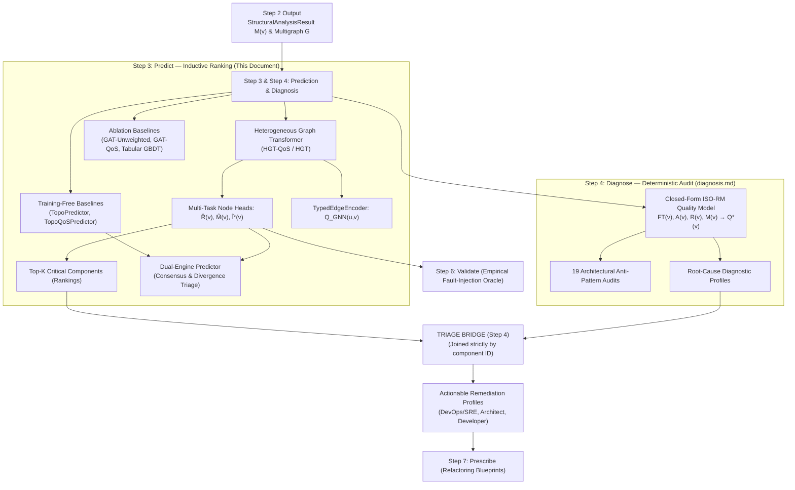
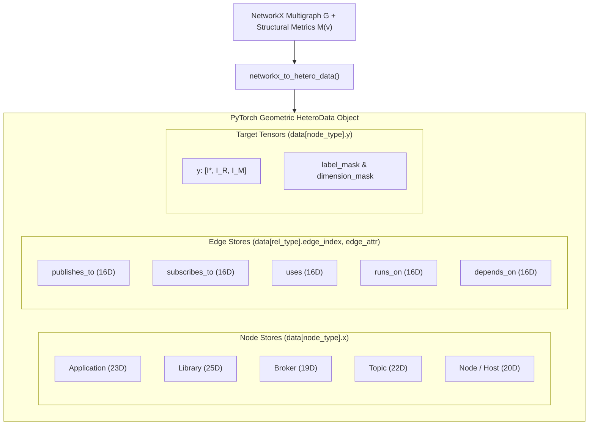
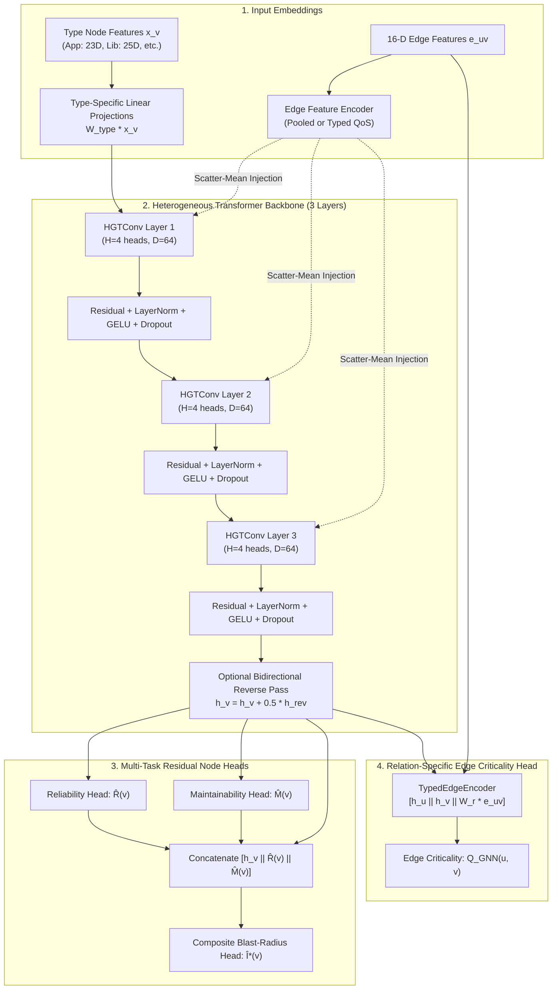
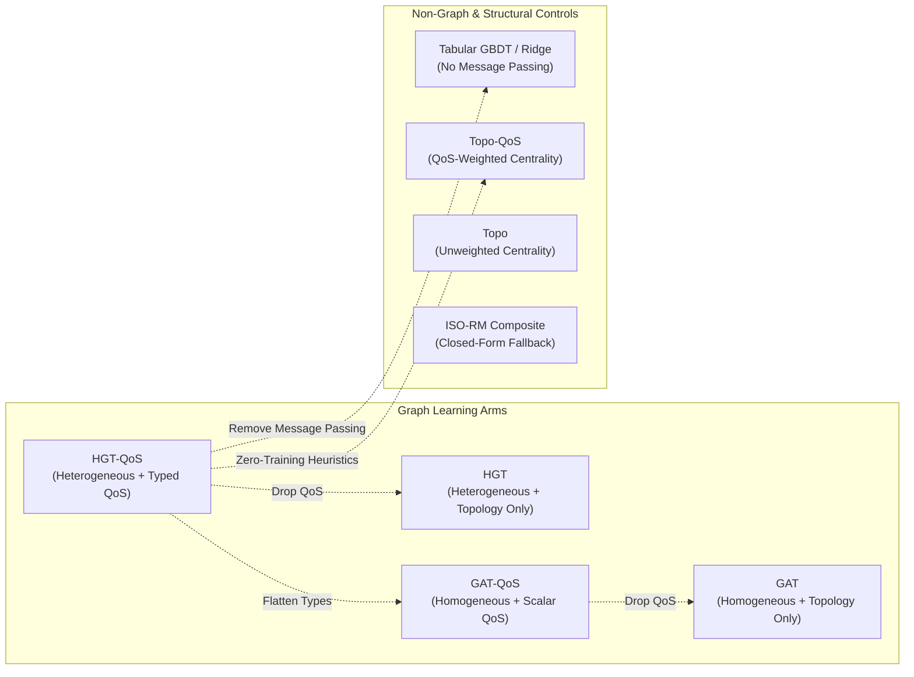
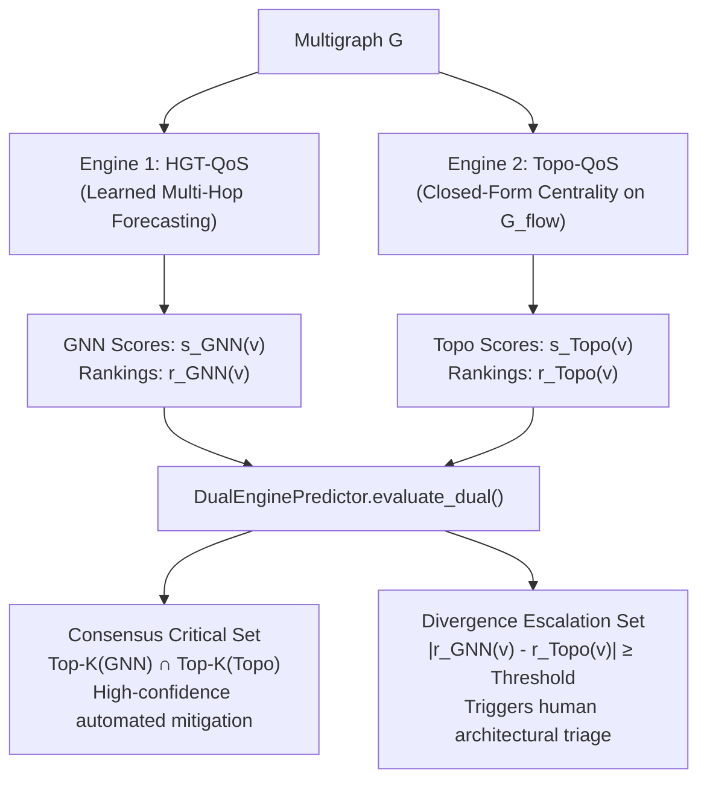

# Step 3: Predict — Criticality & Blast-Radius Forecasting

**Forecast architectural component and relationship failure blast radius using learned and structural graph models, ranking components by systemic risk without requiring live fault injection at runtime.**

← [Step 2: Analyze](structural-analysis.md) | → [Step 4: Diagnose](diagnosis.md)

---

## Table of Contents

1. [Overview & Dual-Pathway Architecture](#1-overview--dual-pathway-architecture)
2. [The Prediction Model Family at a Glance](#2-the-prediction-model-family-at-a-glance)
3. [Feature Representation & Data Preparation (`HeteroData`)](#3-feature-representation--data-preparation-heterodata)
   - 3.1 [Node Feature Schema (18-D Base + Type Extensions)](#31-node-feature-schema-18-d-base--type-extensions)
   - 3.2 [Edge Feature Schema (16-Dimensional QoS Encodings)](#32-edge-feature-schema-16-dimensional-qos-encodings)
   - 3.3 [Edge Injection: Pooled vs. Typed QoS Encoders](#33-edge-injection-pooled-vs-typed-qos-encoders)
   - 3.4 [Target Tensors & Dimension Masking](#34-target-tensors--dimension-masking)
4. [Primary Model: Heterogeneous Graph Transformer (HGT-QoS)](#4-primary-model-heterogeneous-graph-transformer-hgt-qos)
   - 4.1 [Model Motivation & High-Level Architecture](#41-model-motivation--high-level-architecture)
   - 4.2 [Type-Specific Projections & Message Passing](#42-type-specific-projections--message-passing)
   - 4.3 [Bidirectional Information Flow (Reverse Pass)](#43-bidirectional-information-flow-reverse-pass)
   - 4.4 [Multi-Task Residual Prediction Heads](#44-multi-task-residual-prediction-heads)
   - 4.5 [Relation-Specific Edge Criticality Head](#45-relation-specific-edge-criticality-head)
5. [Ablation & Control Baseline Models](#5-ablation--control-baseline-models)
   - 5.1 [Homogeneous GAT Baselines (Unweighted & Scalar-Weighted)](#51-homogeneous-gat-baselines-unweighted--scalar-weighted)
   - 5.2 [Non-Graph Tabular Baseline (Gradient Boosting / Ridge)](#52-non-graph-tabular-baseline-gradient-boosting--ridge)
   - 5.3 [Training-Free Structural Baselines (`TopoPredictor` & `TopoQoSPredictor`)](#53-training-free-structural-baselines-topopredictor--topoqospredictor)
   - 5.4 [Deterministic ISO-RM Cold-Start Fallback](#54-deterministic-iso-rm-cold-start-fallback)
6. [Dual-Engine Predictor: Consensus & Divergence Triage](#6-dual-engine-predictor-consensus--divergence-triage)
7. [Training Protocol & Multi-Task Loss Formulation](#7-training-protocol--multi-task-loss-formulation)
   - 7.1 [The Composite Criticality Loss Function](#71-the-composite-criticality-loss-function)
   - 7.2 [Detailed Loss Components & Mathematical Equations](#72-detailed-loss-components--mathematical-equations)
   - 7.3 [Optimization, Schedulers & Early Stopping](#73-optimization-schedulers--early-stopping)
   - 7.4 [Inductive Evaluation: Leave-One-System-Out (LOSO)](#74-inductive-evaluation-leave-one-system-out-loso)
8. [Programmatic Python SDK & Service Reference](#8-programmatic-python-sdk--service-reference)
   - 8.1 [Unified `PredictionService` Orchestration](#81-unified-predictionservice-orchestration)
   - 8.2 [Direct Use Case Execution (`saag.usecases`)](#82-direct-use-case-execution-saagusecases)
   - 8.3 [End-to-End High-Level `Pipeline` Builder](#83-end-to-end-high-level-pipeline-builder)
9. [CLI Reference & Workflows](#9-cli-reference--workflows)
   - 9.1 [Training Models (`cli/train_graph.py`)](#91-training-models-clitrain_graphpy)
   - 9.2 [Running Predictions (`cli/predict_graph.py`)](#92-running-predictions-clipredict_graphpy)
10. [Output Schemas & Artifact Examples](#10-output-schemas--artifact-examples)
11. [Known Methodological Invariants & Design Boundaries](#11-known-methodological-invariants--design-boundaries)
12. [What Comes Next](#12-what-comes-next)

---

## 1. Overview & Dual-Pathway Architecture

Steps 3 and 4 form the **predictive and analytical engine** of the Software-as-a-Graph (SaG) platform. Rather than forcing a single model to act simultaneously as an inductive statistical regressor and a transparent standards-compliance checker, SaG divides the problem into two distinct, cooperative pathways:

- **Step 3 (Predict) — Pathway B (Predictive Ranking Engine)**: Uses learned relational graph models (or training-free structural centralities) to forecast multi-hop, non-linear failure blast radius $I^*(v)$ and rank components by systemic criticality.
- **Step 4 (Diagnose) — Pathway A (Deterministic Diagnostic Engine)**: Computes closed-form ISO/IEC 25010 Quality Model attributions ($Q^*(v)$), audits 19 architectural anti-patterns, and produces causal root-cause explanations (see [diagnosis.md](diagnosis.md)).



### Core Methodological Invariants

> [!IMPORTANT]
> **Three Invariants Govern Step 3:**
> 1. **Parameter Independence**: Pathway A (Step 4) and Pathway B (Step 3) share no learned weights; neither is fitted to the other's output. By default, consistency regularization weight is set to `0.0`.
> 2. **Offline Oracle Separation**: The discrete-event simulation engine (Step 5) serves solely as an *offline supervisor* to generate ground-truth labels during training ($I^*(v)$ via `FaultInjector`) and as an empirical validation oracle in Step 6 (`FailureSimulator`). Step 3 operates strictly as an offline-trained inductive predictor and has **zero runtime dependency on simulation**.
> 3. **No Hallucination in Root-Cause Attribution**: Neural networks rank *which* components are critical, but they never hallucinate *why*. The Triage Bridge joins quantitative rankings to deterministic Step 4 anti-pattern findings strictly by component ID.

---

## 2. The Prediction Model Family at a Glance

SaG does not treat prediction as a monolithic black-box. Instead, `saag/prediction/` provides a comprehensive suite of learned, ablation, and closed-form models designed to answer precise scientific and operational questions:

| Model Identifier | Model Class | Training Required? | Feature Scope | Research Question / Operational Purpose | Output |
|:---|:---|:---:|:---|:---|:---|
| **HGT-QoS** (`hetero_qos`) | Heterogeneous Graph Transformer (`NodeCriticalityGNN`) | **Yes** (Supervised) | Heterogeneous nodes (19–25D) + 16D edge QoS | **Primary model**: Evaluates whether typed relations, multi-hop attention, and QoS contracts accurately forecast multi-hop cascade blast radius. | $\hat{I}^*(v), \hat{R}(v), \hat{M}(v), Q(u,v)$ |
| **HGT** (`hgl`) | Heterogeneous Graph Transformer (`NodeCriticalityGNN`) | **Yes** (Supervised) | Heterogeneous nodes + 9D edge topology (QoS masked) | **Ablation arm**: Tests whether multi-dimensional transport QoS profiles outperform pure topological connectivity. | $\hat{I}^*(v), \hat{R}(v), \hat{M}(v)$ |
| **GAT-QoS** (`homo_scalar`) | Homogeneous Graph Attention (`HomogeneousGAT_ScalarWeighted`) | **Yes** (Supervised) | Homogeneous node projection + 1D scalar edge weight $w(e)$ | **Ablation arm**: Tests whether heterogeneous typing outperforms a flat graph with scalar QoS weights. | Criticality score $\in [0, 1]$ |
| **GAT** (`homo_unweighted`) | Homogeneous Graph Attention (`HomogeneousGAT_Unweighted`) | **Yes** (Supervised) | Homogeneous node projection (topology only, no weights) | **Ablation arm**: Classic graph attention baseline testing topology-only message passing. | Criticality score $\in [0, 1]$ |
| **Tabular GBDT** (`tabular.py`) | Gradient-Boosted Decision Trees (`GradientBoostingRegressor`) | **Yes** (Supervised) | Flat node vectors (indices 0–17 topological metrics + type features) | **Non-graph control**: Tests whether message passing provides value beyond a non-graph regressor reading already-computed structural metrics. | Criticality score $\in [0, 1]$ |
| **Topo-QoS** (`TopoQoSPredictor`) | QoS-Weighted Structural Centrality | **No** (Training-Free) | $G_{\text{flow}}$ projection with inverted QoS distance $d = 1 / (w + \epsilon)$ | Closed-form baseline: $0.6 \cdot BT_{\text{QoS}} + 0.4 \cdot AP$. Out-of-the-box prediction without ground-truth training data. | Topological score $\in [0, 1]$ |
| **Topo** (`TopoPredictor`) | Unweighted Structural Centrality | **No** (Training-Free) | $G_{\text{flow}}$ projection (unweighted) | Classical structural baseline: $0.6 \cdot BT + 0.4 \cdot AP$. | Topological score $\in [0, 1]$ |
| **Dual-Engine** (`DualEnginePredictor`) | Ensemble & Consensus Evaluator | **Hybrid** | Concurrently runs HGT-QoS and Topo-QoS | **Operational triage**: Computes Consensus Critical Set (high confidence) and Divergence Escalation Set (human triage trigger). | Consensus & Divergence Sets |
| **ISO-RM Composite** (`rm`) | Closed-Form Attribute Synthesis | **No** (Deterministic) | Step 2 Structural Metrics + AHP weights | **Cold-start fallback**: When no GNN checkpoint exists, Step 3 falls back gracefully to $Q^*(v)$. | $Q^*(v) \in [0, 1]$ |

---

## 3. Feature Representation & Data Preparation (`HeteroData`)

The module [`saag/prediction/data_preparation.py`](../saag/prediction/data_preparation.py) converts the in-memory NetworkX multigraph into a PyTorch Geometric [`HeteroData`](file:///home/onuralpyigit/Workspace/SoftwareAsAGraph/saag/prediction/data_preparation.py) structure via `networkx_to_hetero_data()`.



### 3.1 Node Feature Schema (18-D Base + Type Extensions)

Every node vector begins with an **18-dimensional shared topological base** (indices 0–17) computed during Step 2 (Analyze). Node types append domain-specific attributes (indices 18+), ensuring each entity presents its full physical and architectural context:

```
┌────────────────────────────────────────────────────────┬────────────────────────────────────────────┐
│         Indices 0–17: Shared Topological Base          │       Indices 18+: Type-Specific Ext       │
│  PR, RPR, BT, CL, EV, DG_in, DG_out, CC, AP, BR, ...   │  Code Quality, Topic Freq, Hardware Cores  │
└────────────────────────────────────────────────────────┴────────────────────────────────────────────┘
```

#### Shared Topological Base (Indices 0–17)

| Index | Symbol / Metric | Description & Normalization |
|:---:|:---|:---|
| **0** | $PR(v)$ | PageRank (downstream authority, teleport $\alpha = 0.85$) |
| **1** | $RPR(v)$ | Reverse PageRank (upstream dependency exposure) |
| **2** | $BT(v)$ | Betweenness Centrality (fraction of shortest paths routing through $v$) |
| **3** | $CL(v)$ | Closeness Centrality (mean shortest path to all reachable nodes) |
| **4** | $EV(v)$ | Eigenvector Centrality (influence weighted by neighbor centrality) |
| **5** | $DG_{\text{in}}(v)$ | Normalized In-Degree ($\deg^-(v) / (N - 1)$) |
| **6** | $DG_{\text{out}}(v)$ | Normalized Out-Degree ($\deg^+(v) / (N - 1)$) |
| **7** | $CC(v)$ | Local Clustering Coefficient (transitivity among neighbors) |
| **8** | $AP(v)$ | Undirected Articulation Score (biconnected component cut vertex indicator) |
| **9** | $BR(v)$ | Bridge Ratio (fraction of incident edges that are structural bridges) |
| **10** | $w(v)$ | Node QoS Weight (aggregate criticality of incident transport contracts) |
| **11** | $w_{\text{in}}(v)$ | QoS-Weighted In-Degree ($\sum_{u} w(u, v)$) |
| **12** | $w_{\text{out}}(v)$ | QoS-Weighted Out-Degree ($\sum_{u} w(v, u)$) |
| **13** | $MPCI(v)$ | Multi-Path Coupling Index (alternative paths between dependent pairs) |
| **14** | $PC(v)$ | Path Complexity (structural density of transitive reachability graph) |
| **15** | $FOC(v)$ | Fan-Out Criticality (immediate dependent blast radius) |
| **16** | $AP_c^{\text{dir}}(v)$ | Directed Articulation Point (strongly-connected component cut vertex) |
| **17** | $CDI(v)$ | Connectivity Degradation Index (change in pair connectivity upon removing $v$) |

#### Type-Specific Extensions (Indices 18+)

| Node Type | Total Dimensions | Extension Columns (Indices 18+) | Description & Rationale |
|:---|:---:|:---|:---|
| `Application` | **23** | `loc_norm`, `complexity_norm`, $I_{\text{code}}$, `lcom_norm`, $CQP$ | Code-level maintainability metrics: lines of code, cyclomatic complexity, code quality index, lack of cohesion in methods, and composite code penalty. |
| `Library` | **25** | 5 Code Quality metrics + `library_uses_reach_norm`, `library_downstream_subs_norm` | Applications depend on libraries via `USES`. Includes transitive dependency reach and downstream subscriber load. |
| `Broker` | **19** | `max_connections_norm` | Message broker capacity: maximum concurrent TCP/AMQP client connections. |
| `Topic` | **22** | `subscriber_count_norm`, `publisher_count_norm`, `log1p_frequency_norm`, `topic_qos_criticality_ord` | Message exchange dynamics: active subscriber and publisher counts, message throughput frequency, and ordinal QoS profile tier. |
| `Node` (Host) | **20** | `cpu_cores_norm`, `memory_gb_norm` | Infrastructure hardware capacity: physical CPU core count and RAM allocation. |

---

### 3.2 Edge Feature Schema (16-Dimensional QoS Encodings)

Edge features capture both topological connectivity and declared transport Quality-of-Service (QoS) delivery contracts. The 16-dimensional edge vector $\mathbf{e}_{uv} \in \mathbb{R}^{16}$ is defined as follows:

| Index | Feature Name | Representation / Range | Semantic Meaning |
|:---:|:---|:---:|:---|
| **0** | `qos_weight` | Continuous $[0, 1]$ | Aggregate continuous QoS weight $w(e)$ synthesized from delivery contracts |
| **1** | `path_count_norm` | Continuous $[0, 1]$ | Logarithmic normalized channel multiplicity: $\min\left(\frac{\log_2(1 + \text{paths})}{\log_2(17)}, 1.0\right)$ |
| **2–8** | `edge_type_one_hot` | One-hot $\in \{0, 1\}^7$ | 7 relation types: `PUBLISHES_TO`, `SUBSCRIBES_TO`, `ROUTES`, `RUNS_ON`, `CONNECTS_TO`, `USES`, `DEPENDS_ON` |
| **9** | `reliability_score` | Ordinal $\{0.0, 1.0\}$ | Transport reliability: `BEST_EFFORT` ($0.0$), `RELIABLE` ($1.0$) |
| **10** | `durability_score` | Ordinal $\{0.0, 0.5, 0.6, 1.0\}$ | Message durability: `VOLATILE` ($0.0$), `TRANSIENT_LOCAL` ($0.5$), `TRANSIENT` ($0.6$), `PERSISTENT` ($1.0$) |
| **11** | `priority_score` | Ordinal $\{0.0, 0.33, 0.66, 1.0\}$ | Priority tier: `LOW` ($0.0$), `MEDIUM` ($0.33$), `HIGH` ($0.66$), `URGENT` ($1.0$) |
| **12** | `has_deadline` | Binary $\{0.0, 1.0\}$ | Flag indicating whether a strict message delivery deadline contract is declared |
| **13** | `deadline_ns_log` | Continuous $[0, 1]$ | Normalized deadline duration: $\min\left(\frac{\log_{10}(1 + \text{deadline\_ms})}{10.0}, 1.0\right)$ |
| **14** | `max_blocking_ms_log` | Continuous $[0, 1]$ | Normalized blocking timeout for synchronous publishes |
| **15** | `qos_heterogeneity_flag`| Binary $\{0.0, 1.0\}$ | Flag indicating edge QoS contract diverges from the system-wide modal contract |

*(Note: Indices 9–15 are populated for pub/sub dataflow edges; structural edges such as `RUNS_ON` default to neutral 0.0 values).*

---

### 3.3 Edge Injection: Pooled vs. Typed QoS Encoders

Before convolving over nodes, edge features must be integrated into the message passing stream. SaG supports two edge injection architectures:

1. **Pooled Edge Feature Encoder (`EdgeFeatureEncoder`)**:
   Projects the entire 16-D edge vector through a single shared linear layer:
   $$\mathbf{e}'_{uv} = \text{GELU}(\mathbf{W}_{\text{edge}} \mathbf{e}_{uv} + \mathbf{b})$$
   Target nodes aggregate incoming edge embeddings via scatter-mean aggregation before each convolution layer:
   $$\mathbf{h}_d \leftarrow \mathbf{h}_d + \frac{1}{|\mathcal{N}_{\text{in}}(d)|} \sum_{u \in \mathcal{N}_{\text{in}}(d)} \mathbf{e}'_{ud}$$

2. **Typed QoS Edge Feature Encoder (`TypedQoSEdgeFeatureEncoder`)**:
   Disentangles structural relation type from transport QoS parameters. It maintains a **separate linear projection matrix for each relation type $r$** that maps the 7 continuous QoS features (indices 9–15) into the hidden space:
   $$\mathbf{e}'_{uv} = \text{GELU}(\mathbf{W}_r^{(\text{qos})} \mathbf{e}_{uv}[9:16] + \mathbf{b}_r)$$
   This ensures that a `RELIABLE` contract on a `PUBLISHES_TO` edge is parameterized independently from a `RELIABLE` contract on a `SUBSCRIBES_TO` or `ROUTES` edge.

---

### 3.4 Target Tensors & Dimension Masking

During supervised training, each node store in `HeteroData` carries labels and masking tensors:

| Tensor Name | Shape | Semantic Meaning & Usage |
|:---|:---:|:---|
| `data[type].y` | $(N, 3)$ | Ground-truth simulation targets: $[I^*(v), I_R(v), I_M(v)]$ representing composite blast radius, reliability impact, and maintainability impact. |
| `data[type].y_rm` | $(N, 3)$ | Rule-based ISO-RM scores: $[Q^*(v), R(v), M(v)]$. Used for consistency regularization when `rm_consistency_weight > 0`. |
| `data[type].label_mask` | $(N,)$ | Boolean mask indicating which nodes were targeted during fault injection simulation (prevents training on unsimulated nodes). |
| `data[type].dimension_mask` | $(3,)$ | Boolean mask indicating which sub-dimensions were measured in the current simulation run. |
| `data[rel].y_edge` | $(E, 3)$ | Edge-level ground truth criticality: $I^*(u) \times \text{bridge\_multiplier}$. |

> [!TIP]
> **Why Dimension Masking is Critical:**
> When fault injection simulates purely crash-stop failures (reliability faults), the empirical ground truth for *maintainability* ($I_M(v)$) is unmeasured. Without dimension masking, an MSE loss on all columns would regress maintainability predictions to zero. The `dimension_mask` zeroes out loss gradients for unmeasured columns, preserving multi-task representation integrity.

---

## 4. Primary Model: Heterogeneous Graph Transformer (HGT-QoS)

### 4.1 Model Motivation & High-Level Architecture

Software architectures are fundamentally heterogeneous multigraphs: an `Application` executing business logic has completely different failure modes than a message `Broker` routing traffic or a `Topic` serving as an asynchronous channel. Furthermore, failures cascade non-linearly across multiple hops.

To capture these dynamics, SaG implements a **Heterogeneous Graph Transformer (`NodeCriticalityGNN`)** parameterized with type-specific projection matrices and multi-head attention:



---

### 4.2 Type-Specific Projections & Message Passing

1. **Input Projection**:
   Raw feature vectors $\mathbf{x}_v$ of varying dimensions are projected into a common hidden representation $\mathbb{R}^D$ ($D=64$):
   $$\mathbf{h}_v^{(0)} = \text{GELU}\left(\text{LayerNorm}\left(\mathbf{W}_{\text{type}(v)} \mathbf{x}_v + \mathbf{b}_{\text{type}(v)}\right)\right)$$

2. **HGT Heterogeneous Attention Convolution**:
   At each layer $k \in \{1, 2, 3\}$, attention coefficients between source node $u$ and target node $v$ connected by relation $r = (\text{type}(u), \text{rel}, \text{type}(v))$ are computed using relation-specific Query, Key, and Value matrices:
   $$\alpha^{(k)}(u, r, v) = \text{Softmax}_{u \in \mathcal{N}_r(v)}\left(\frac{\left(\mathbf{K}^{(k)}_r \mathbf{h}_u^{(k-1)}\right)^T \mathbf{W}_{\text{rel}} \left(\mathbf{Q}^{(k)}_r \mathbf{h}_v^{(k-1)}\right)}{\sqrt{d_{\text{head}}}}\right)$$
   $$\mathbf{m}_{u \to v}^{(k)} = \mathbf{V}^{(k)}_r \mathbf{h}_u^{(k-1)}$$
   $$\mathbf{h}_v^{(k)} = \text{Dropout}\left(\text{GELU}\left(\text{LayerNorm}\left(\sum_{r} \sum_{u \in \mathcal{N}_r(v)} \alpha^{(k)}(u, r, v) \cdot \mathbf{m}_{u \to v}^{(k)} + \mathbf{h}_v^{(k-1)}\right)\right)\right)$$

---

### 4.3 Bidirectional Information Flow (Reverse Pass)

In publish-subscribe systems, messages flow downstream from publishers to subscribers via brokers and topics. However, **failure cascades and backpressure propagate upstream**: if a subscriber crashes or processes slowly, queues fill up and impact the publisher.

When `use_bidirectional=True`, the model applies an inverted reverse-graph convolution pass (`rev_conv`) and blends upstream representations with downstream representations:
$$\mathbf{h}_v \leftarrow \mathbf{h}_v + 0.5 \cdot \mathbf{h}_v^{\text{rev}}$$

---

### 4.4 Multi-Task Residual Prediction Heads

To enforce physical and dimensional coherence, predictions are produced by multi-task `ResidualMLP` networks bounded by sigmoid activations $\sigma(z) \in [0, 1]$:

$$\begin{aligned}
\hat{R}(v) &= \sigma\left(\text{MLP}_R(\mathbf{h}_v)\right) \quad &&\text{(Predicted Reliability Criticality)} \\
\hat{M}(v) &= \sigma\left(\text{MLP}_M(\mathbf{h}_v)\right) \quad &&\text{(Predicted Maintainability Criticality)} \\
\hat{I}^*(v) &= \sigma\left(\text{MLP}_C\left(\left[\mathbf{h}_v \parallel \hat{R}(v) \parallel \hat{M}(v)\right]\right)\right) \quad &&\text{(Predicted Composite Blast Radius)}
\end{aligned}$$

> [!NOTE]
> **Non-Linear Cross-Attribute Coupling:**
> The composite blast-radius head $\text{MLP}_C$ explicitly receives the outputs of the sub-dimension heads concatenated with the latent node representation $[\mathbf{h}_v \parallel \hat{R}(v) \parallel \hat{M}(v)]$. This enables the network to learn non-linear interactions (e.g., how high coupling combined with low reliability compounds systemic blast radius).

---

### 4.5 Relation-Specific Edge Criticality Head

The companion model `EdgeCriticalityGNN` evaluates the criticality of individual interaction links $e = (u, v)$ via `TypedEdgeEncoder`:
$$Q_{\text{GNN}}(u, v) = \sigma\left(\text{MLP}_{\text{edge}}\left(\left[\mathbf{h}_u \parallel \mathbf{h}_v \parallel \mathbf{W}_r \mathbf{e}_{uv}\right]\right)\right)$$
where $\mathbf{h}_u, \mathbf{h}_v$ are the node embeddings produced by the backbone and $\mathbf{W}_r \mathbf{e}_{uv}$ is a relation-specific projection of the 16-D edge feature vector.

---

## 5. Ablation & Control Baseline Models

To isolate what actually contributes to predictive accuracy, SaG provides a complete family of baseline and control models:



### 5.1 Homogeneous GAT Baselines (Unweighted & Scalar-Weighted)

Located in [`saag/prediction/models/baselines.py`](../saag/prediction/models/baselines.py), these models collapse heterogeneous entity types into a single homogeneous graph:

1. **`HomogeneousGAT_Unweighted` (Topology-Only Ablation)**:
   A standard multi-head Graph Attention Network operating on the flattened graph with no edge features.
   - *Scientific question answered*: Does heterogeneous node typing and edge parameterization actually help over standard homogeneous graph learning?
2. **`HomogeneousGAT_ScalarWeighted` (Scalar-QoS Ablation)**:
   A homogeneous GAT that incorporates edge weights as a single 1-D scalar attribute $w(e) \in [0, 1]$.
   - *Scientific question answered*: Does a rich 16-dimensional transport QoS contract outperform a single scalar weight?

#### Control Arm Capacity Parity

> [!IMPORTANT]
> **Strict Parameter Count Matching ($\pm 5\%$):**
> A common confound in GNN benchmarking is that heterogeneous models have more parameters due to type-specific matrices. SaG enforces strict capacity parity in `test_baselines.py`: the hidden dimensions of `HomogeneousGAT_*` are widened so that their total trainable parameter count matches `NodeCriticalityGNN` within 5% ($\approx 108\text{k}$ parameters). This guarantees that performance differences reflect architectural inductive biases, not sheer parameter volume.

---

### 5.2 Non-Graph Tabular Baseline (Gradient Boosting / Ridge)

Located in [`saag/prediction/models/tabular.py`](../saag/prediction/models/tabular.py), this control trains a **Gradient-Boosted Decision Tree regressor (`GradientBoostingRegressor`)** directly on the node feature vectors without any graph message passing:

- **The Core Scientific Question**: Indices 0–17 of every node vector already contain pre-computed structural metrics (betweenness, closeness, reverse PageRank, articulation scores). A tree ensemble can read these metrics directly. *Does GNN message passing add any predictive value over a standard regressor reading already-summarized graph metrics?*
- **Exact Data Parity**: The tabular model trains on the exact same tensor rows as the GNNs, extracted from `networkx_to_hetero_data`, eliminating any feature-construction bias. One model is fitted per node type to avoid column-padding artifacts.

---

### 5.3 Training-Free Structural Baselines (`TopoPredictor` & `TopoQoSPredictor`)

Located in [`saag/prediction/structural_predictor.py`](../saag/prediction/structural_predictor.py), these predictors require **zero training data, zero checkpoints, and zero training epochs**.

#### The Logical Flow Projection Graph ($G_{\text{flow}}$)

In publish-subscribe systems, applications never send messages directly to one another—they route messages through topics and brokers. Consequently, raw betweenness centrality on an unprojected multigraph would report near-zero centrality for applications!

SaG resolves this by projecting the multigraph into a logical dependency flow graph $G_{\text{flow}} = (V_{\text{app}} \cup V_{\text{lib}}, E_{\text{dep}})$:
- **Rule 1 (app-to-app)**: If Application $A$ subscribes to Topic $T$ and Application $B$ publishes to $T$, a logical dependency edge $A \xrightarrow{\text{DEPENDS\_ON}} B$ is established.
- **Rule 5 (app-to-lib)**: If Application $A$ uses Library $L$, a direct dependency edge $A \xrightarrow{\text{DEPENDS\_ON}} L$ is established.

#### Predictor Formulations

1. **`TopoPredictor` (Unweighted Topological Baseline)**:
   Combines betweenness centrality and cut-vertex articulation score on $G_{\text{flow}}$:
   $$\text{Topo}(v) = 0.6 \cdot BT_{G_{\text{flow}}}(v) + 0.4 \cdot AP_{c}(v)$$
2. **`TopoQoSPredictor` (QoS-Weighted Topological Baseline)**:
   In NetworkX, edge weights represent *distance*, where higher weight means higher traversal cost. In transport QoS, higher weight $w(e)$ means higher priority/reliability (a more critical path). Therefore, `TopoQoSPredictor` inverts QoS weights into distances:
   $$\text{distance}(u, v) = \frac{1}{w(u, v) + \epsilon} \quad (\epsilon = 10^{-6})$$
   $$\text{TopoQoS}(v) = 0.6 \cdot BT_{\text{weighted}}(v) + 0.4 \cdot AP_{c}(v)$$

---

### 5.4 Deterministic ISO-RM Cold-Start Fallback

When running Step 3 in an uncalibrated deployment where no GNN checkpoint exists on disk, `PredictionService` automatically executes the deterministic ISO-RM Quality Model from Step 4 ($Q^*(v)$):
$$Q^*(v) = q_R \cdot R(v) + q_M \cdot M(v)$$
The system never crashes or refuses execution due to missing ML checkpoints.

---

## 6. Dual-Engine Predictor: Consensus & Divergence Triage

Operationalizing Section 8.1 of the JSS manuscript, the [`DualEnginePredictor`](file:///home/onuralpyigit/Workspace/SoftwareAsAGraph/saag/prediction/structural_predictor.py) executes **learned relational forecasting (HGT-QoS)** and **closed-form structural centrality (Topo-QoS)** concurrently:



### Dual-Engine Triage Sets

1. **Consensus Critical Set ($\text{Top-K}_{\text{GNN}} \cap \text{Top-K}_{\text{Topo}}$)**:
   Components identified as highly critical by *both* the learned relational model and the closed-form topological model. These represent unambiguous structural bottlenecks and single-points-of-failure with high automation confidence.
2. **Divergence Escalation Set ($| \text{rank}_{\text{GNN}}(v) - \text{rank}_{\text{Topo}}(v) | \ge \theta_{\text{div}}$)**:
   Components where the two models strongly disagree. For example:
   - A component with low topological betweenness that the GNN identifies as high-risk due to tight QoS deadlines and upstream cascade coupling.
   - A component with high betweenness that the GNN discounts because multi-path redundancy dampens failure propagation.
   These cases are escalated for **human architectural review**.

---

## 7. Training Protocol & Multi-Task Loss Formulation

### 7.1 The Composite Criticality Loss Function

The model is trained end-to-end using [`CriticalityLoss`](file:///home/onuralpyigit/Workspace/SoftwareAsAGraph/saag/prediction/models/core.py), a balanced multi-task objective combining point regression, global ranking, pairwise margin separation, and edge loss:

$$\mathcal{L} = \mathcal{L}_{\text{composite}} + 0.5 \cdot \mathcal{L}_{\text{dimension}} + 0.3 \cdot \mathcal{L}_{\text{rank}} + 0.1 \cdot \mathcal{L}_{\text{pairwise}} + \lambda_{\text{rm}} \cdot \mathcal{L}_{\text{consistency}} + 0.3 \cdot \mathcal{L}_{\text{edge}}$$

*(By default, $\lambda_{\text{rm}} = 0.0$ to preserve strict Parameter Independence between predictive and diagnostic pathways).*

---

### 7.2 Detailed Loss Components & Mathematical Equations

| Loss Term | Equation | Semantic Purpose & Behavior |
|:---|:---|:---|
| **Composite MSE** ($\mathcal{L}_{\text{composite}}$) | $\frac{1}{|\mathcal{V}_{\text{sim}}|} \sum_{v \in \mathcal{V}_{\text{sim}}} \left(\hat{I}^*(v) - I^*(v)\right)^2$ | Enforces accurate absolute composite blast-radius prediction on all simulated components. |
| **Multitask Dimension MSE** ($\mathcal{L}_{\text{dimension}}$) | $\sum_{d \in \{R, M\}} \left[ \frac{1}{|\mathcal{V}_{\text{sim}}|} \sum_{v \in \mathcal{V}_{\text{sim}}} \left(\hat{d}(v) - I_d(v)\right)^2 \right] \cdot \mathbf{m}_d$ | Enforces sub-dimension accuracy while masking unmeasured target columns using $\mathbf{m}_d \in \{0, 1\}$. |
| **ListMLE Ranking Loss** ($\mathcal{L}_{\text{rank}}$) | $-\sum_{i=1}^{N} \log \frac{\exp(\hat{s}_{\pi(i)} / \tau)}{\sum_{j=i}^{N} \exp(\hat{s}_{\pi(j)} / \tau)}$ | Plackett-Luce ranking probability maximizing global rank correlation (Kendall $\tau$ and Spearman $\rho$) with temperature $\tau = 1.0$. |
| **Pairwise Margin Ranking** ($\mathcal{L}_{\text{pairwise}}$) | $\frac{1}{|\mathcal{P}|} \sum_{(i, j) \in \mathcal{P}} \max\left(0, \; m - (\hat{s}_i - \hat{s}_j)\right)$ | Margin ranking loss with margin $m=0.05$ over pairs where ground-truth difference $y_i - y_j > m$. Enforces clear separation between critical and non-critical components. |
| **Consistency Regularization** ($\mathcal{L}_{\text{consistency}}$) | $\frac{1}{|\mathcal{V}_{\text{unlabeled}}|} \sum_{u \in \mathcal{V}_{\text{unlabeled}}} \left(\hat{I}^*(u) - Q^*(u)\right)^2$ | Optional semi-supervised regularizer pulling predictions on unsimulated nodes toward deterministic ISO-RM scores (default weight $0.0$). |
| **Edge Criticality MSE** ($\mathcal{L}_{\text{edge}}$) | $\frac{1}{|\mathcal{E}|} \sum_{e \in \mathcal{E}} \left(Q_{\text{GNN}}(e) - y_{\text{edge}}(e)\right)^2$ | Supervised regression loss on relationship failure criticality. |

---

### 7.3 Optimization, Schedulers & Early Stopping

- **Optimizer**: `AdamW` with learning rate $\eta = 3 \times 10^{-4}$ and weight decay $10^{-4}$.
- **Gradient Clipping**: Norm clipped at $\|\mathbf{g}\|_2 \le 1.0$.
- **Learning Rate Schedule**: `CosineAnnealingWarmRestarts` with initial period $T_0 = \max(50, \text{epochs} // 4)$ and multiplier $T_{\text{mult}} = 2$.
- **Early Stopping**: Monitored on validation Spearman rank correlation $\rho_{\text{val}}$ and validation loss with a patience of 30 epochs:
  $$\text{Score}_{\text{val}} = 0.6 \cdot \rho_{\text{val}} + 0.4 \cdot \left(1 - \frac{\mathcal{L}_{\text{val}}}{\mathcal{L}_{\text{best}}}\right)$$
- **Multi-Seed Sweep**: Supports training across 5 random seeds (`--seeds 42 123 456 789 2024`) to guarantee numerical stability.

---

### 7.4 Inductive Evaluation: Leave-One-System-Out (LOSO)

To rigorously evaluate **inductive generalization** (predicting failure criticality on completely unseen software systems), SaG evaluates models using Leave-One-System-Out cross-validation across distinct application scenarios.

1. The model is trained on $K - 1$ distinct software architectures.
2. The holdout architecture is tested in a strict zero-shot inductive setting.
3. Ground-truth normalization is applied robustly per system to prevent inter-graph scale confounds.

---

## 8. Programmatic Python SDK & Service Reference

### 8.1 Unified `PredictionService` Orchestration

The [`PredictionService`](file:///home/onuralpyigit/Workspace/SoftwareAsAGraph/saag/prediction/service.py) provides a single entry point for all prediction modes (`"gnn"`, `"rm"`, `"topo"`, `"topo_qos"`, and `"dual"`):

```python
from saag.prediction.service import PredictionService
from saag.analysis.analyzer import StructuralAnalyzer

# 1. Compute Step 2 structural metrics
analyzer = StructuralAnalyzer()
structural_res = analyzer.analyze_graph(nx_graph, layer="system")

# 2. Initialize Prediction Service
service = PredictionService(
    gnn_checkpoint_dir="output/gnn_checkpoints/best_model",
    prefer_gnn=True,
)

# Mode A: Learned GNN Criticality Prediction
gnn_result = service.predict_quality_with_gnn(
    structural_result=structural_res,
    graph=nx_graph,
    predictor_mode="gnn",
)
print("Top GNN component:", list(gnn_result.node_scores.values())[0])

# Mode B: Training-Free Topo-QoS Prediction
topo_result = service.predict_structural(
    structural_result=structural_res,
    graph=nx_graph,
    use_qos=True,
)

# Mode C: Concurrent Dual-Engine Prediction (HGT-QoS + Topo-QoS)
dual_result = service.predict_dual(
    structural_result=structural_res,
    graph=nx_graph,
    k=10,
    divergence_threshold=5,
)
print("Consensus Top-K:", dual_result.dual_result.consensus_top_k)
print("Divergence Escalations:", dual_result.dual_result.divergence_escalations)
```

---

### 8.2 Direct Use Case Execution (`saag.usecases`)

For decoupled execution in headless CI/CD scripts without database dependencies:

```python
from saag.usecases import PredictiveUseCase

# Executes Pathway B blast-radius forecasting
predictor = PredictiveUseCase(gnn_checkpoint_dir="output/gnn_checkpoints/best_model")
result = predictor.execute(structural_result=structural_res, graph=nx_graph)
```

---

### 8.3 End-to-End High-Level `Pipeline` Builder

Chain Step 3 into the complete Software-as-a-Graph lifecycle:

```python
import saag

pipeline = (
    saag.Pipeline.from_json("data/scenarios/robotics_system.json", clear=True)
        .analyze(layer="system")
        .simulate(layer="system", mode="exhaustive")  # offline training supervisor
        .predict(predictor_mode="gnn")                 # Step 3: GNN blast-radius ranking
        .diagnose(k=10)                                # Step 4: ISO-RM + Triage Bridge
        .validate()                                    # Step 6: Empirical validation
        .prescribe()                                   # Step 7: Refactoring blueprints
        .run()
)
```

---

## 9. CLI Reference & Workflows

### 9.1 Training Models (`cli/train_graph.py`)

Train a Heterogeneous Graph Transformer using pre-computed structural metrics and simulation ground-truth labels:

```bash
# Standard training on system layer across 5 random seeds
python cli/train_graph.py \
  --layer system \
  --epochs 300 \
  --hidden 64 \
  --heads 4 \
  --seeds 42 123 456 789 2024 \
  --checkpoint output/gnn_checkpoints/

# Train ablation baseline variants
python cli/train_graph.py --layer system --variant homo_scalar      # GAT-QoS
python cli/train_graph.py --layer system --variant homo_unweighted  # GAT Unweighted

# Multi-scenario inductive training across domain datasets
python cli/train_graph.py --layer system --multi-scenario

# Supply pre-computed JSON files to skip pipeline re-execution
python cli/train_graph.py \
  --layer system \
  --structural results/structural_metrics.json \
  --simulated  results/simulation_impact.json
```

#### CLI Flag Reference (`cli/train_graph.py`)

| Flag | Type | Default | Description |
|:---|:---:|:---:|:---|
| `--variant` | Choice | `hetero_qos` | Model variant: `hetero_qos` (HGT-QoS), `homo_scalar` (GAT-QoS), `homo_unweighted` (GAT), `topology_rm` (RM only). |
| `--hidden` | Integer | `64` | Latent node embedding dimension $D$. |
| `--heads` | Integer | `4` | Number of multi-head attention channels. |
| `--layers` | Integer | `3` | Number of stacked convolution layers. |
| `--dropout` | Float | `0.2` | Dropout probability on message passing layers. |
| `--lr` | Float | `3e-4` | Initial AdamW learning rate. |
| `--patience` | Integer | `30` | Early stopping epoch patience on validation metric. |
| `--multitask-weight` | Float | `0.5` | Weight for per-dimension MSE loss ($\mathcal{L}_{\text{dimension}}$). |
| `--ranking-weight` | Float | `0.3` | Weight for ListMLE ranking loss ($\mathcal{L}_{\text{rank}}$). |
| `--pairwise-ranking-weight`| Float | `0.1` | Weight for pairwise margin loss ($\mathcal{L}_{\text{pairwise}}$). |
| `--rm-consistency-weight` | Float | `0.0` | Weight for RM regularizer on unsimulated nodes ($\mathcal{L}_{\text{consistency}}$). |

---

### 9.2 Running Predictions (`cli/predict_graph.py`)

Generate criticality predictions for an architecture:

```bash
# 1. GNN Criticality Prediction with Step 4 bundled for triage
python cli/predict_graph.py \
  --layer system \
  --gnn-model output/gnn_checkpoints/best_model \
  --triage-k 10 \
  --output output/predictions.json

# 2. Dual-Engine Prediction (HGT-QoS + Topo-QoS consensus and divergence check)
python cli/predict_graph.py \
  --layer system \
  --predictor-mode dual \
  --gnn-model output/gnn_checkpoints/best_model \
  --divergence-threshold 5

# 3. Training-Free Topo-QoS Centrality (No GNN checkpoint needed)
python cli/predict_graph.py \
  --layer system \
  --predictor-mode topo_qos

# 4. Pure Step 3 Prediction Alone (Disable Step 4 anti-pattern bundling)
python cli/predict_graph.py \
  --layer system \
  --gnn-model output/gnn_checkpoints/best_model \
  --no-diagnose
```

---

## 10. Output Schemas & Artifact Examples

### Standard GNN Prediction Output

When executed via `cli/predict_graph.py --gnn-model <dir> --output prediction.json`, the output schema structure is:

```json
{
  "layers": {
    "system": {
      "total_components": 35,
      "gnn": {
        "prediction_mode": "gnn",
        "node_scores": {
          "NavigationController": {
            "component": "NavigationController",
            "composite_score": 0.8842,
            "reliability_score": 0.8615,
            "maintainability_score": 0.6210,
            "criticality_level": "CRITICAL",
            "source": "GNN"
          },
          "SensorFusionHub": {
            "component": "SensorFusionHub",
            "composite_score": 0.7412,
            "reliability_score": 0.7102,
            "maintainability_score": 0.5430,
            "criticality_level": "HIGH",
            "source": "GNN"
          }
        },
        "edge_scores": [
          {
            "source": "NavigationController",
            "target": "MotorActuator",
            "edge_type": "DEPENDS_ON",
            "composite_score": 0.8120,
            "reliability_score": 0.7850,
            "maintainability_score": 0.4200,
            "criticality_level": "CRITICAL"
          }
        ],
        "gnn_metrics": {
          "spearman_rho": 0.6820,
          "kendall_tau": 0.5210,
          "ndcg_10": 0.9340
        }
      }
    }
  }
}
```

### Dual-Engine Consensus & Divergence Output

When executed with `--predictor-mode dual`, the result attaches the `dual_result` block:

```json
{
  "dual_result": {
    "consensus_top_k": [
      "NavigationController",
      "SensorFusionHub"
    ],
    "divergence_escalations": [
      "DiagnosticsTelemetry"
    ],
    "gnn_ranks": {
      "NavigationController": 1,
      "SensorFusionHub": 2,
      "DiagnosticsTelemetry": 3
    },
    "topo_ranks": {
      "NavigationController": 1,
      "SensorFusionHub": 3,
      "DiagnosticsTelemetry": 12
    },
    "rank_divergences": {
      "NavigationController": 0,
      "SensorFusionHub": 1,
      "DiagnosticsTelemetry": 9
    },
    "metadata": {
      "k": 10,
      "divergence_threshold": 5,
      "n_common": 35
    }
  }
}
```

---

## 11. Known Methodological Invariants & Design Boundaries

| # | Boundary / Invariant | Operational Context & Mitigation |
|:--|:---|:---|
| **I1** | **Parameter Independence** | The GNN and RM models share zero weights. Default $\lambda_{\text{rm}} = 0.0$. |
| **I2** | **Offline Supervisor Separation** | Discrete-event simulation generates ground-truth labels offline; inference requires zero simulation calls. |
| **I3** | **No Hallucination in Root Causes** | The Triage Bridge correlates ranking to Step 4 anti-patterns strictly by component ID, preventing neural models from hallucinating architectural causes. |
| **B1** | **Heuristic Edge Labels** | During training, edge targets use $I^*(u) \times \text{bridge\_multiplier}$. Direct link failure injection in Step 5 provides exact ground truth for validation. |
| **B2** | **Capacity Parity Requirement** | When comparing HGT against GAT baselines, ensure capacity parity within 5% to prevent parameter volume confounds. |
| **B3** | **Cold-Start Deployment** | If no trained checkpoint exists on disk, `PredictionService` automatically falls back to deterministic $Q^*(v)$ scores. |

---

## 12. What Comes Next

- **For Root-Cause Attribution & Anti-Patterns**: Proceed to **[Step 4: Diagnose](diagnosis.md)** for the closed-form ISO-RM Quality Model, 19-pattern structural audits, and the Triage Bridge.
- **For Training Data Generation**: Execute **[Step 5: Simulate](failure-simulation.md)** to generate supervised ground-truth failure blast-radius labels $I^*(v)$.
- **For Empirical Statistical Validation**: Proceed to **[Step 6: Validate](validation.md)** to test model predictions against physical fault injection.
- **For Actionable Refactoring**: Proceed to **[Step 7: Prescribe](prescription.md)** to compile verified refactoring blueprints from Step 4's findings.

---

← [Step 2: Analyze](structural-analysis.md) | → [Step 4: Diagnose](diagnosis.md)
