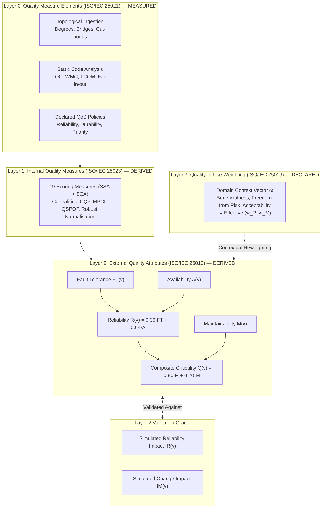
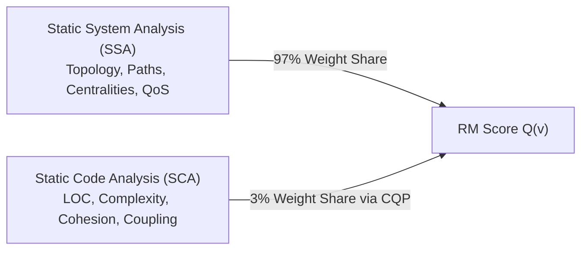
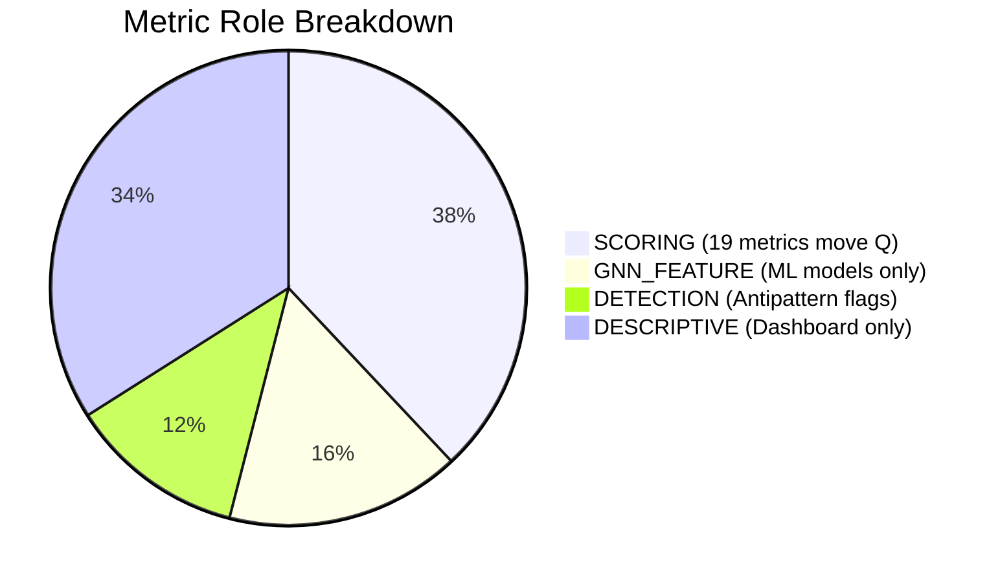
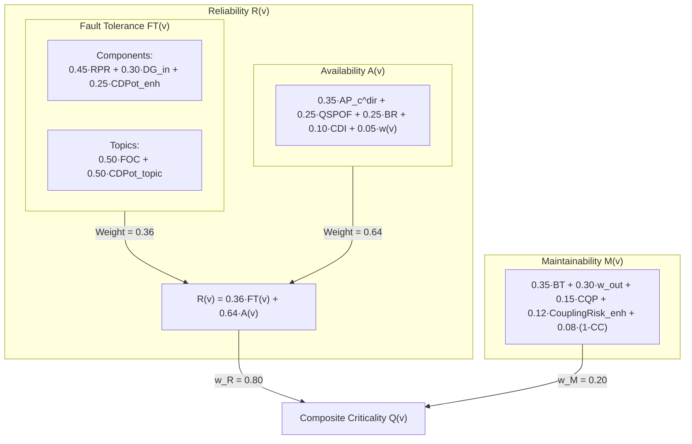
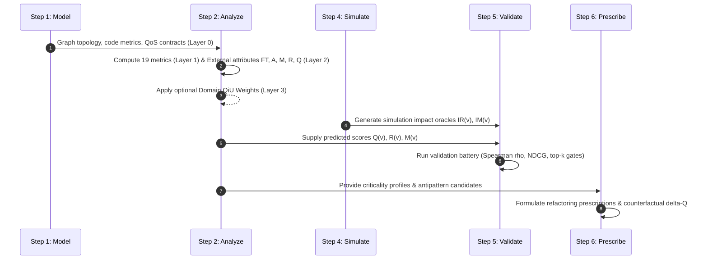

# The Reliability and Maintainability Quality Models

**A comprehensive, layer-by-layer reference for the Reliability–Maintainability (RM) quality model: attributes, operationalizing measures, coefficients, mathematical derivations, provenance, and code references for both components and relationships.**

[README](../README.md) | [criticality.md](criticality.md) | [structural-analysis.md](structural-analysis.md)

---

## Table of Contents

1. [Overview](#1-overview)
2. [The Four-Layer Model Architecture](#2-the-four-layer-model-architecture)
3. [Layer 0 — Quality Measure Elements (ISO/IEC 25021)](#3-layer-0--quality-measure-elements-isoiec-25021)
   - 3.1 [Topological Measure Elements](#31-topological-measure-elements)
   - 3.2 [Code Measure Elements](#32-code-measure-elements)
   - 3.3 [Declared QoS Measure Elements](#33-declared-qos-measure-elements)
4. [Layer 1 — Internal Quality Measures (ISO/IEC 25023)](#4-layer-1--internal-quality-measures-isoiec-25023)
   - 4.1 [Sources of Internal Evidence (SSA vs. SCA)](#41-sources-of-internal-evidence-ssa-vs-sca)
   - 4.2 [The 19 Scoring Measures](#42-the-19-scoring-measures)
   - 4.3 [Derived Composites](#43-derived-composites)
   - 4.4 [Normalisation Strategy](#44-normalisation-strategy)
   - 4.5 [Metric Roles and Unused Elements](#45-metric-roles-and-unused-elements)
5. [Layer 2 — External Quality Attributes (ISO/IEC 25010:2023)](#5-layer-2--external-quality-attributes-isoiec-250102023)
   - 5.1 [Reliability: Fault Tolerance, Availability, and Hierarchical Blend](#51-reliability)
   - 5.2 [Maintainability](#52-maintainability)
   - 5.3 [The Composite Criticality Score $Q(v)$](#53-the-composite-criticality-score-qv)
   - 5.4 [Weight Provenance and AHP Shrinkage](#54-weight-provenance-and-ahp-shrinkage)
   - 5.5 [The Simulation Oracle: $IR(v)$ and $IM(v)$](#55-the-simulation-oracle-irv-and-imv)
   - 5.6 [QoS-Profile Adaptation](#56-qos-profile-adaptation)
6. [Layer 3 — Quality-in-Use Weighting (ISO/IEC 25019:2023)](#6-layer-3--quality-in-use-weighting-isoiec-250192023)
   - 6.1 [The Three Quality-in-Use Characteristics](#61-the-three-quality-in-use-characteristics)
   - 6.2 [The RM-to-QiU Projection Matrix](#62-the-rm-to-qiu-projection-matrix)
   - 6.3 [Domain Context Vectors](#63-domain-context-vectors)
   - 6.4 [The Collapse Invariant](#64-the-collapse-invariant)
   - 6.5 [Empirical Evaluation](#65-empirical-evaluation)
7. [The Edge Quality Model](#7-the-edge-quality-model)
   - 7.1 [Layers 0 & 1: Edge Measure Elements](#71-layers-0--1-edge-measure-elements)
   - 7.2 [Layer 2: Edge Quality Attributes](#72-layer-2-edge-quality-attributes)
   - 7.3 [The Edge Simulation Oracle](#73-the-edge-simulation-oracle)
   - 7.4 [Layer 3 Weighting for Edges](#74-layer-3-weighting-for-edges)
8. [Coverage and Declared Gaps](#8-coverage-and-declared-gaps)
   - 8.1 [Unmodelled ISO/IEC 25010 Sub-Characteristics](#81-unmodelled-isoiec-25010-sub-characteristics)
   - 8.2 [Implementation Notes and Scope Limitations](#82-implementation-notes-and-scope-limitations)
9. [Constant Register](#9-constant-register)
10. [Pipeline Integration](#10-pipeline-integration)
11. [References](#11-references)

---

## 1. Overview

This framework evaluates software architecture criticality through two ISO/IEC 25010:2023 product-quality characteristics:
1. **Reliability ($R$)**: Modeled hierarchically as a combination of **Fault Tolerance ($FT$)** and **Availability ($A$)**.
2. **Maintainability ($M$)**: Modeled as structural modularity, coupling risk, and code complexity.

Together, they form the **RM Quality Model**, which produces the composite criticality score $Q(v)$ for components (vertices) and relationships (edges).

### Core Principle

> **Criticality is *computed* from internal quality evidence (Layers 0 & 1), *validated* against simulated external quality (Layer 2), and *defined* on Quality-in-Use (Layer 3).** *(See [criticality.md §1](criticality.md#1-overview))*

### Documentation Map

| Topic | Primary Reference |
|:---|:---|
| Layer-by-layer formulas, coefficients, provenance, and constants | **This document (`quality-model.md`)** |
| Stakeholder definitions, harm mappings, and theoretical validity | [criticality.md](criticality.md) |
| Formal graph-theoretic definitions ($RPR, MPCI, AP_c, \dots$) | [structural-analysis.md](structural-analysis.md) |
| Raw graph ingestion, entity modeling, and QoS weights | [graph-model.md](graph-model.md) |
| Simulation oracle design, failure injection, and change impact | [failure-simulation.md](failure-simulation.md) |
| Statistical validation batteries, gates, and metrics | [validation.md](validation.md) |
| Graph Neural Network (GNN) learning-based scoring path | [prediction.md](prediction.md) |

All formulas in this document directly mirror the production implementations in [`saag/analysis/analyzer.py`](../saag/analysis/analyzer.py) and [`saag/analysis/structural_analyzer.py`](../saag/analysis/structural_analyzer.py).

---

## 2. The Four-Layer Model Architecture

The quality model is structured into four distinct layers aligned with ISO/IEC SQuaRE standards, declared in [`saag/core/quality_model.py`](../saag/core/quality_model.py).

### Layer Summary and Provenance

Every metric and weight in the system carries an explicit **epistemic provenance**:

| Layer | Name | Standard | Provenance | Ground Truth / Oracle |
|:---|:---|:---|:---|:---|
| **0** | **Quality Measure Elements** | ISO/IEC 25021 | **MEASURED** | Direct observation (topology, code, config) |
| **1** | **Internal Quality Measures** | ISO/IEC 25023 | **DERIVED** | Deterministic algorithms over Layer 0 |
| **2** | **External Quality Attributes ($R, M$)** | ISO/IEC 25010:2023 | **DERIVED** | **Yes** — Simulation Oracles $IR(v), IM(v)$ |
| **3** | **Quality-in-Use Weighting** | ISO/IEC 25019:2023 | **DECLARED** | None (algebraic context mapping) |

> [!IMPORTANT]
> **The Provenance Rule**: A **DECLARED** quantity (design judgement) must never be presented as an empirical measurement (**MEASURED**) or an objective derivation (**DERIVED**). 
>
> **Layer 2 is the only layer with an empirical oracle.** Layers 0 and 1 are definitional. Layer 3 is an algebraic domain projection that reweights Layer 2 without introducing new independent ranks.

### Execution Flow
1. **Layers 0 → 2 run unconditionally** on every analysis (`StructuralAnalyzer` followed by `QualityAnalyzer._compute_rm`).
2. **Layer 3 is opt-in**. When a domain is specified (`QualityAnalyzer(domain_weights=...)`), domain derivation runs first, followed by optional QoS-profile adaptation.

---

## 3. Layer 0 — Quality Measure Elements (ISO/IEC 25021)

**Provenance: MEASURED.** Raw facts extracted directly from system artifacts without mathematical modeling or normalization.

### 3.1 Topological Measure Elements

Extracted directly from the typed architecture multigraph $G$ ([graph-model.md](graph-model.md)):

| Measure Element | Description |
|:---|:---|
| `in_degree_raw`, `out_degree_raw` | Raw count of incoming/outgoing dependencies in the flattened analysis graph |
| `bridge_count` | Number of incident cut-edges (graph bridges) |
| `is_articulation_point`, `is_directed_ap` | Boolean flags indicating if node removal disconnects the graph |
| `topic_publisher_count`, `topic_subscriber_count` | Publisher and subscriber counts on a Topic node |
| `path_count(e)` | Number of redundant communication paths establishing a `DEPENDS_ON` edge |
| `topic_frequency_hz` | Execution/publication rate assigned from the topic's QoS band |
| `size` | Topic message payload size in bytes |

*(Note: Global centralities like PageRank and Betweenness require algorithmic computation across the full graph and belong to Layer 1).*

### 3.2 Code Measure Elements

Ingested from static code analyzers (e.g., SonarQube) for `Application` and `Library` vertices:

| Measure Element | Internal Metric Key | Used in Scoring? | Role in Layer 1 |
|:---|:---|:---:|:---|
| `cm_total_loc` | `loc` | **Yes** | Normalised into `loc_norm` for $CQP$ |
| `cm_avg_wmc` | `cyclomatic_complexity` | **Yes** | Normalised into `complexity_norm` for $CQP$ |
| `cm_avg_lcom` | `lcom` | **Yes** | Normalised into `lcom_norm` for $CQP$ |
| `cm_avg_fanin` | `coupling_afferent` | **Yes** | Computes code instability $I_{\text{code}}$ |
| `cm_avg_fanout` | `coupling_efferent` | **Yes** | Computes code instability $I_{\text{code}}$ |
| `cm_avg_cbo` | `cbo` | **No** | Diagnostic display only (see [§4.5](#45-metric-roles-and-unused-elements)) |
| `cm_avg_rfc` | `rfc` | **No** | Diagnostic display only |
| `sqale_debt_ratio`, `bugs`, `vulnerabilities` | Various | **No** | Ingested for dashboard context, does not move score |

### 3.3 Declared QoS Measure Elements

QoS policies declare execution contract guarantees. In SQuaRE terms, they represent **declared external quality requirements** ([graph-model.md §4.3](graph-model.md#43-phase-3--intrinsic-weight-computation)).

`QoSPolicy` ([`saag/core/models.py`](../saag/core/models.py)) maps configuration enums to scalar scores:

$$\begin{aligned}
\text{Reliability Policy:}\quad &\text{BEST\_EFFORT} \to 0.0, \quad \text{RELIABLE} \to 1.0 \\
\text{Durability Policy:}\quad &\text{VOLATILE} \to 0.0, \quad \text{TRANSIENT\_LOCAL} \to 0.5, \quad \text{TRANSIENT} \to 0.6, \quad \text{PERSISTENT} \to 1.0 \\
\text{Transport Priority:}\quad &\text{LOW} \to 0.0, \quad \text{MEDIUM} \to 0.33, \quad \text{HIGH} \to 0.66, \quad \text{CRITICAL/URGENT} \to 1.0
\end{aligned}$$

#### Topic QoS and Weight Formulation

$$\text{QoS}(t) = 0.24 \cdot \text{Rel}(t) + 0.62 \cdot \text{Dur}(t) + 0.14 \cdot \text{Pri}(t)$$

$$w(t) = \max\left(0.01, \; \min\left(1.0,\; 0.75 \cdot \text{QoS}(t) + 0.15 \cdot \text{SizeNorm}(t) + 0.10 \cdot \text{FreqNorm}(t)\right)\right)$$

$$\text{SizeNorm}(t) = \min\left(\frac{\log_2(1 + \text{size\_bytes})}{20}, \; 1.0\right), \qquad
\text{FreqNorm}(t) = \min\left(\frac{\log_{10}(1 + f_t)}{3}, \; 1.0\right)$$

See [graph-model.md §4.3](graph-model.md#43-phase-3-intrinsic-topic-weighting) for the full three-term derivation, including the size/frequency design envelopes; the two-term form previously shown here (a bare $0.85/0.15$ QoS/size split with no frequency term) was retired.

- **Weight Rationale**: Durability ($0.62$) dominates Reliability ($0.24$) and Priority ($0.14$) because state preservation across network partitions and restarts is more consequential than either in-flight delivery quality signal in distributed pub/sub middleware; Reliability weighs somewhat more than Priority because an unconditional delivery guarantee precedes the scheduling of it.
- **AHP Provenance**: This $(0.24, 0.62, 0.14)$ distribution is the geometric-mean priority vector of an independently-stated pairwise Saaty matrix in `AHPMatrices.criteria_topic_qos`, with a small but genuinely nonzero Consistency Ratio ($CR \approx 0.016$). An earlier version of the matrix was solved backward from a target $(0.30, 0.40, 0.30)$ vector rather than stated independently, which is why its $CR \approx 0$ was an artifact of construction rather than evidence of a real judgement — see that matrix's docstring in `saag/analysis/weight_calculator.py`.

---

## 4. Layer 1 — Internal Quality Measures (ISO/IEC 25023)

**Provenance: DERIVED.** Deterministic calculations that transform Layer 0 elements into normalized structural metrics and composite penalties.

### 4.1 Sources of Internal Evidence (SSA vs. SCA)

Internal quality derives from two complementary analysis techniques:

1. **Static System Analysis (SSA)**: Analyzes system-level topology, interaction paths, and middleware contracts. Feeds $100\%$ of Fault Tolerance and Availability, and $85\%$ of Maintainability.
2. **Static Code Analysis (SCA)**: Analyzes source code complexity and modularity for `Application` and `Library` nodes. Feeds into $CQP$ ($15\%$ of Maintainability). With Maintainability weighted at $w_M = 0.20$, the overall contribution of raw code metrics to composite $Q(v)$ is $0.20 \times 0.15 = 3\%$.

### 4.2 The 19 Scoring Measures

Out of ~50 metrics computed on the graph, **exactly 19 measures drive the rule-based quality score $Q(v)$**. All 19 are registered in [`saag/core/metric_registry.py`](../saag/core/metric_registry.py):

#### Group 1: Fault Tolerance Inputs ($FT$)
| # | Metric Key | Symbol | Coefficient | Description & Formal Ref |
|:---:|:---|:---:|:---:|:---|
| 1 | `reverse_pagerank` | $RPR$ | $0.45$ | Cascade reach on transposed graph $G^{\mathsf T}$ ([§9.1](structural-analysis.md#91-reverse-pagerank-rpr)) |
| 2 | `in_degree_raw` | $DG_{in}$ | $0.30$ | Immediate dependent count ([§9.2](structural-analysis.md#92-in-degree-dg_in)) |
| 3 | `out_degree_raw` | $DG_{out}$ | Derived | Absorber vs. emitter ratio in $CDPot$ ([§11.3](structural-analysis.md#113-derived-terms)) |
| 4 | `mpci` | $MPCI$ | Multiplier | Multi-Path Coupling Index; amplifies $CDPot$ ([§9.3](structural-analysis.md#93-multi-path-coupling-index-mpci)) |
| 5 | `fan_out_criticality` | $FOC$ | $0.50$ | Topic fan-out risk (Topic branch only) ([§9.4](structural-analysis.md#94-fan-out-criticality-foc)) |
| 6 | `dependency_weight_in` | $w_{in}$ | Discount | QoS-weighted publisher redundancy discount ([§9.13](structural-analysis.md#913-qos-weighted-in-degree-w_in)) |

#### Group 2: Availability Inputs ($A$)
| # | Metric Key | Symbol | Coefficient | Description & Formal Ref |
|:---:|:---|:---:|:---:|:---|
| 7 | `ap_c_directed` | $AP_c^{\text{dir}}$ | $0.35$ | Continuous graph fragmentation upon node removal ([§9.8](structural-analysis.md#98-directed-ap-score-ap_c_directed)) |
| 8 | `bridge_ratio` | $BR$ | $0.25$ | Fraction of incident edges that are bridges ([§9.9](structural-analysis.md#99-bridge-ratio-br)) |
| 9 | `cdi` | $CDI$ | $0.10$ | Path lengthening upon node removal ([§9.10](structural-analysis.md#910-connectivity-degradation-index-cdi)) |
| 10 | `weight` | $w(v)$ | $0.05$ | Aggregated QoS criticality weight ([graph-model.md §4.5](graph-model.md#45-phase-5--aggregate-weight-propagation)) |

#### Group 3: Maintainability Inputs ($M$)
| # | Metric Key | Symbol | Coefficient | Description & Formal Ref |
|:---:|:---|:---:|:---:|:---|
| 11 | `betweenness` | $BT$ | $0.35$ | Shortest-path routing bottleneck ([§9.5](structural-analysis.md#95-betweenness-centrality-bt)) |
| 12 | `dependency_weight_out` | $w_{out}$ | $0.30$ | QoS-weighted outgoing dependency coupling ([§9.6](structural-analysis.md#96-qos-weighted-out-degree-w_out)) |
| 13 | `code_quality_penalty` | $CQP$ | $0.15$ | Composite code penalty from static code analysis |
| 14 | `path_complexity` | $PC$ | $\delta = 0.10$ | Channel diversity multiplier in $CouplingRisk_{\text{enh}}$ ([§9.14](structural-analysis.md#914-path-complexity-pc)) |
| 15 | `clustering_coefficient` | $CC$ | $0.08$ | Local isolation penalty scored as $(1 - CC)$ ([§9.7](structural-analysis.md#97-clustering-coefficient-cc)) |
| 16 | `loc_norm` | — | $0.10$ | Size penalty within $CQP$ |
| 17 | `complexity_norm` | — | $0.35$ | Cyclomatic complexity within $CQP$ |
| 18 | `instability_code` | — | $0.30$ | Efferent/(Afferent+Efferent) code coupling within $CQP$ |
| 19 | `lcom_norm` | — | $0.25$ | Lack of Cohesion of Methods within $CQP$ |

> [!NOTE]
> **Metric Orthogonality**: Every raw metric maps directly to **exactly one** sub-characteristic ($FT, A,$ or $M$). No single metric appears in multiple primary score formulas.

### 4.3 Derived Composites

Four specialized composites combine raw structural and code measures:

#### 1. Code Quality Penalty ($CQP$)
Combines normalized code metrics for `Application` and `Library` components:

$$CQP(v) = 0.10 \cdot \text{loc\_norm}(v) + 0.35 \cdot \text{complexity\_norm}(v) + 0.30 \cdot I_{\text{code}}(v) + 0.25 \cdot \text{lcom\_norm}(v)$$

*(For infrastructure nodes like Broker, Node, and Topic, $CQP = 0$).*

#### 2. Enhanced Cascade Depth Potential ($CDPot_{\text{enh}}$)
Identifies "absorber" components with high fan-in but low fan-out, amplified if incoming channels have multiple paths ($MPCI$):

$$\begin{aligned}
CDPot_{\text{base}}(v) &= \left(\frac{RPR(v) + DG_{in}(v)}{2}\right) \cdot \left(1 - \min\left(\frac{DG_{out}(v)}{\max(DG_{in}(v), \varepsilon)}, \; 1\right)\right) \\
CDPot_{\text{enh}}(v) &= \min\left(CDPot_{\text{base}}(v) \cdot (1 + MPCI(v)), \; 1.0\right)
\end{aligned}$$

#### 3. Coupling Risk with Path Complexity ($CouplingRisk_{\text{enh}}$)
Measures interface instability, peaking when afferent and efferent dependencies are equal (instability $= 0.5$):

$$\begin{aligned}
I_{\text{topo}}(v) &= \frac{DG_{out}(v)}{DG_{in}(v) + DG_{out}(v) + \varepsilon} \\
CouplingRisk(v) &= 1 - |2 \cdot I_{\text{topo}}(v) - 1| \\
CouplingRisk_{\text{enh}}(v) &= \min\left(1.0, \; CouplingRisk(v) \cdot (1 + 0.10 \cdot PC(v))\right)
\end{aligned}$$

#### 4. QoS-Weighted SPOF Severity ($QSPOF$)
Amplifies structural articulation points by the operational importance of the component:

$$QSPOF(v) = AP_c^{\text{dir}}(v) \cdot w(v)$$

### 4.4 Normalisation Strategy

To ensure robust score composition across graphs of varying scale:

1. **Rank-Normalised Metrics** (`_normalize_robust`): Metrics with open-ended distributions (e.g., $RPR, BT, DG_{in}, DG_{out}, w(v), w_{in}, w_{out}$) are winsorized at the 95th percentile and converted to fractional average ranks:
   $$\text{norm}(x_i) = \frac{\text{avg\_rank}(x_i)}{n - 1} \in [0, 1]$$
2. **Naturally Bounded Metrics** (Preserved as Raw $[0, 1]$): Metrics with natural mathematical bounds ($AP_c^{\text{dir}}, CDI, MPCI, FOC, CC, CQP$) are passed directly without ranking to preserve absolute interpretations (e.g., $AP_c = 0$ strictly means "not an articulation point").

### 4.5 Metric Roles and Unused Elements

To prevent confusion between scoring inputs and descriptive diagnostics, [`saag/core/metric_registry.py`](../saag/core/metric_registry.py) defines four metric roles:

- **SCORING**: The 19 metrics detailed in [§4.2](#42-the-19-scoring-measures) that directly compute $Q(v)$.
- **GNN_FEATURE**: Features ingested by the machine learning pipeline but not used in the rule-based equations.
- **DETECTION**: Structural flags used exclusively by `AntiPatternDetector` (e.g., cycle checks).
- **DESCRIPTIVE**: Exported for UI inspection and debugging (`blast_radius`, `cascade_depth`, `broker_exposure`, `sqale_debt_ratio`, `bugs`, `vulnerabilities`).

---

## 5. Layer 2 — External Quality Attributes (ISO/IEC 25010:2023)

**Provenance: DERIVED. Oracle: $IR(v)$ and $IM(v)$.** Layer 2 synthesizes internal metrics into estimates of observable product-quality characteristics.

### 5.1 Reliability

Reliability measures operational resilience and continuity under failure.

#### 1. Fault Tolerance — $FT(v)$
Estimates the extent to which faults propagate to dependent components before being contained.

- **For Components (`Application`, `Broker`, `Node`, `Library`):**
  $$FT(v) = 0.45 \cdot RPR(v) + 0.30 \cdot DG_{in}(v) + 0.25 \cdot CDPot_{\text{enh}}(v)$$
  *(PageRank on $G^{\mathsf T}$ leads because failure propagates against the dependency direction).*

- **For Topics:**
  $$\begin{aligned}
  FT_{\text{topic}}(v) &= 0.50 \cdot FOC(v) + 0.50 \cdot CDPot_{\text{topic}}(v) \\
  CDPot_{\text{topic}}(v) &= FOC(v) \cdot \left(1 - \min(w_{in}(v), \; 1)\right)
  \end{aligned}$$
  *($w_{in}$ is summed in-edge QoS weight across every incoming edge type — PUBLISHES\_TO and*
  *broker ROUTES — rank-normalised against the whole component population, not publisher count;*
  *see [§9.13](structural-analysis.md#913-qos-weighted-in-degree-w_in). It correlates with*
  *publisher redundancy but is not a direct count of publishers.)*

#### 2. Availability — $A(v)$
Estimates catastrophic service loss from structural graph partitioning:

$$A(v) = 0.35 \cdot AP_c^{\text{dir}}(v) + 0.25 \cdot QSPOF(v) + 0.25 \cdot BR(v) + 0.10 \cdot CDI(v) + 0.05 \cdot w(v)$$

#### 3. Hierarchical Blend — $R(v)$

$$R(v) = r_\alpha \cdot FT(v) + (1 - r_\alpha) \cdot A(v) \qquad \text{where } r_\alpha = 0.36$$

- **Causal Interpretation**: In dependability engineering, fault tolerance addresses *error propagation* (the intermediate stage), while availability addresses *service failure* (the terminal loss of function).

### 5.2 Maintainability

Maintainability ($M$) estimates the cost and ripple effect of software modifications.

$$M(v) = 0.35 \cdot BT(v) + 0.30 \cdot w_{out}(v) + 0.15 \cdot CQP(v) + 0.12 \cdot CouplingRisk_{\text{enh}}(v) + 0.08 \cdot (1 - CC(v))$$

- $BT$ ($0.35$): Structural routing bottlenecks are the most costly to modify.
- $w_{out}$ ($0.30$): Efferent coupling to high-QoS contracts creates ripple effects.
- $CQP$ ($0.15$): Internal code complexity and lack of cohesion.
- $CouplingRisk_{\text{enh}}$ ($0.12$): Efferent/afferent imbalance amplified by path complexity.
- $(1 - CC)$ ($0.08$): Low clustering indicates sole-integration points between uncoordinated modules.

> [!NOTE]
> **Maintainability's oracle is a structural traversal, not a fault injection.** Unlike Reliability, Maintainability cannot be observed through runtime execution — no amount of running the system reveals what changing it would cost. It is still a Layer 2 (External) quantity with a declared oracle, $IM(v)$, evaluated via change-propagation traversal over $G^\top$ rather than fault injection; see [docs/validation.md §3.1](validation.md#31-notation--three-quantities-three-symbols) for why $IM(v)$'s shared substrate with $M(v)$ makes it a consistency check rather than an independent behavioural test.

### 5.3 The Composite Criticality Score $Q(v)$

$$Q(v) = w_R \cdot R(v) + w_M \cdot M(v) \qquad \text{where } w_R = 0.80, \; w_M = 0.20$$

#### Derivation History and Re-parameterization
The parameters $(w_R=0.80, w_M=0.20, r_\alpha=0.36)$ algebraically recover the weights of the legacy 4-D model ($A=0.43, R=0.24, M=0.17, V=0.16$) after dropping Vulnerability:

$$\begin{aligned}
r_\alpha &= \frac{0.24}{0.24 + 0.43} = 0.3582 \approx 0.36 \\
w_R &= \frac{0.24 + 0.43}{0.84} = 0.7976 \approx 0.80 \\
w_M &= \frac{0.17}{0.84} = 0.2024 \approx 0.20
\end{aligned}$$

#### Classification Tiers
Scores are categorized into five tiers using adaptive box-plot fences calculated relative to the system's own distribution (falling back to fixed percentiles when sample size $N < 12$):
- **Tier 1 (CRITICAL)** $\to$ Top box-plot outliers ($> Q_3 + 1.5 \cdot IQR$)
- **Tier 2 (HIGH)** $\to$ Upper quartile ($> Q_3$)
- **Tier 3 (MEDIUM)** $\to$ Interquartile range ($Q_1 \le x \le Q_3$)
- **Tier 4 (LOW)** $\to$ Lower quartile ($< Q_1$)
- **Tier 5 (MINIMAL)** $\to$ Bottom outliers

### 5.4 Weight Provenance and AHP Shrinkage

Sub-weights within each dimension are derived from Saaty Analytic Hierarchy Process (AHP) matrices and regularized using **shrinkage toward a uniform prior** ($\lambda = 0.70$):

$$w_{\text{final}} = \lambda \cdot w_{\text{AHP}} + (1 - \lambda) \cdot \frac{1}{n}$$

| Dimension | AHP Matrix Dimension | Pre-Shrinkage (Judgement) | Post-Shrinkage ($\lambda = 0.70$) | Consistency Ratio ($CR$) |
|:---|:---:|:---|:---|:---:|
| **Fault Tolerance ($FT$)** | $3 \times 3$ | $(0.45, 0.30, 0.25)$ | $(0.422, 0.323, 0.255)$ | $+0.0028$ |
| **Maintainability ($M$)** | $5 \times 5$ | $(0.35, 0.30, 0.15, 0.12, 0.08)$ | $(0.305, 0.270, 0.165, 0.144, 0.116)$ | $+0.0005$ |
| **Availability ($A$)** | $5 \times 5$ | $(0.35, 0.25, 0.25, 0.10, 0.05)$ | $(0.305, 0.235, 0.235, 0.130, 0.095)$ | $-0.0008$ |
| **Topic QoS** | $3 \times 3$ | $(0.30, 0.40, 0.30)$ | $(0.300, 0.400, 0.300)$ | $-0.0014$ |
| **Simulation Impact** | $4 \times 4$ | $(0.393, 0.250, 0.250, 0.107)$ | $(0.347, 0.254, 0.254, 0.145)$ | $+0.0011$ |

*(All matrices have $|CR| < 0.003$, well below Saaty's $0.10$ inconsistency threshold).*

### 5.5 The Simulation Oracle: $IR(v)$ and $IM(v)$

Layer 2 quality scores are validated against simulated ground truth generated by [`FailureSimulator`](../saag/simulation/failure_simulator.py):

| Attribute | Oracle Metric | Simulation Formulation |
|:---|:---:|:---|
| **Reliability** | $IR(v)$ | $0.36 \cdot IFT(v) + 0.64 \cdot IA(v)$ |
| ↳ *Fault Tolerance* | $IFT(v)$ | $0.45 \cdot \text{cascade\_reach} + 0.35 \cdot \text{weighted\_impact} + 0.20 \cdot \text{norm\_depth}$ |
| ↳ *Availability* | $IA(v)$ | $0.50 \cdot \text{reachability\_loss} + 0.35 \cdot \text{fragmentation} + 0.15 \cdot \text{throughput\_loss}$ |
| **Maintainability** | $IM(v)$ | $0.45 \cdot \text{change\_reach} + 0.35 \cdot \text{weighted\_change\_impact} + 0.20 \cdot \text{norm\_change\_depth}$ |

### 5.6 QoS-Profile Adaptation

When enabled (`adapt_qos_weights=True`, default), system composite weights shift dynamically based on the system-wide QoS profile:

$$\text{rel\_signal} = \frac{\text{persistent\_fraction} + \text{reliable\_fraction} + \text{critical\_fraction}}{3}$$

$$\begin{aligned}
\text{If } \text{rel\_signal} \ge 0.6: \quad &\Delta = \min(0.15, \; (\text{rel\_signal} - 0.5) \cdot 0.30) \implies \text{Shift } \Delta \text{ to } w_R \\
\text{If } \text{rel\_signal} \le 0.4: \quad &\Delta = \min(0.15, \; (0.5 - \text{rel\_signal}) \cdot 0.30) \implies \text{Shift } \Delta \text{ to } w_M
\end{aligned}$$

*(Both weights are floored at $0.05$ and renormalized to sum to $1.0$).*

---

## 6. Layer 3 — Quality-in-Use Weighting (ISO/IEC 25019:2023)

**Provenance: DECLARED.** Re-expresses RM scores in terms of stakeholder-facing harm categories and context-specific priorities.

### 6.1 The Three Quality-in-Use Characteristics

| Characteristic | Primary Concern | Stakeholder Question |
|:---|:---|:---|
| **Beneficialness** | Effectiveness, efficiency, task satisfaction | Does the system fulfill its operational mission successfully? |
| **Freedom from Risk** | Health, human-life, economic, environmental safety | Does system failure cause physical or financial harm? |
| **Acceptability** | Trust, user experience, regulatory compliance | Do users and regulators trust the system? |

### 6.2 The RM-to-QiU Projection Matrix

Maps the RM vector $\mathbf{s}_{\text{RM}}(v) = [R(v), M(v)]^{\mathsf T}$ to the Quality-in-Use harm vector $\mathbf{h}_{\text{QiU}}(v)$:

$$\mathbf{h}_{\text{QiU}}(v) = \mathbf{M}_{\text{RM} \to \text{QiU}} \cdot \mathbf{s}_{\text{RM}}(v) = \begin{bmatrix} 0.75 & 0.25 \\ 0.80 & 0.20 \\ 0.60 & 0.40 \end{bmatrix} \begin{bmatrix} R(v) \\ M(v) \end{bmatrix}$$

- **Row 1 (Beneficialness)**: $75\% R$ (service continuity) $+ 25\% M$ (feature updates).
- **Row 2 (Freedom from Risk)**: $80\% R$ (fault containment) $+ 20\% M$ (MTTR: faster repairs reduce exposure time).
- **Row 3 (Acceptability)**: $60\% R$ (uptime reputation) $+ 40\% M$ (rapid bug fixing and evolvability).

### 6.3 Domain Context Vectors

Each domain specifies a priority vector $\vec{\omega} = [\omega_{\text{Ben}}, \omega_{\text{Risk}}, \omega_{\text{Acc}}]$ ($\sum \omega_i = 1.0$):

| Domain Identifier | $\vec{\omega} = (\text{Ben}, \text{Risk}, \text{Acc})$ | Primary Stakeholder Driver | Effective $(w_R, w_M)$ |
|:---|:---:|:---|:---:|
| `autoware_ros2`, `av` | $(0.20, 0.65, 0.15)$ | Life & safety risk | $(0.760, 0.240)$ |
| `finance` | $(0.35, 0.50, 0.15)$ | Economic & transaction risk | $(0.753, 0.248)$ |
| `healthcare` | $(0.40, 0.45, 0.15)$ | Patient safety & clinical utility | $(0.750, 0.250)$ |
| `air_traffic_management` | $(0.50, 0.30, 0.20)$ | Operational effectiveness | $(0.735, 0.265)$ |
| `iot` | $(0.50, 0.20, 0.30)$ | Fleet efficiency & device trust | $(0.715, 0.285)$ |
| `enterprise`, `microservices` | $(0.40, 0.20, 0.40)$ | Business agility & compliance | $(0.700, 0.300)$ |

### 6.4 The Collapse Invariant

Because every row of $\mathbf{M}_{\text{RM} \to \text{QiU}}$ sums to $1.0$, projecting onto QiU and scalarizing by $\vec{\omega}$ is mathematically equivalent to computing RM under an **effective composite weight** $(w_R, w_M)$:

$$Q_{\text{QiU}} = \vec{\omega}^{\mathsf T} (\mathbf{M} \, \mathbf{s}) = (\mathbf{M}^{\mathsf T} \vec{\omega})^{\mathsf T} \mathbf{s} = w_R^{\text{eff}} \cdot R(v) + w_M^{\text{eff}} \cdot M(v)$$

$$\text{where } \begin{bmatrix} w_R^{\text{eff}} \\ w_M^{\text{eff}} \end{bmatrix} = \mathbf{M}_{\text{RM} \to \text{QiU}}^{\mathsf T} \begin{bmatrix} \omega_{\text{Ben}} \\ \omega_{\text{Risk}} \\ \omega_{\text{Acc}} \end{bmatrix}, \quad \text{and } w_R^{\text{eff}} + w_M^{\text{eff}} = 1.0$$

> [!TIP]
> **Key Insight**: Layer 3 is not an extra prediction stage; it is a **principled generator of domain-specific composite weights**.

### 6.5 Empirical Evaluation

Across 7 synthetic and 3 real-world software graphs, ranking correlation vs. ground-truth simulated impact $I^*(v)$ shows:

| Weighting Configuration | Mean Spearman $\rho$ | vs. Static Default | Mean Kendall $\tau$ vs. Static |
|:---|:---:|:---:|:---:|
| Static Default ($w_R = 0.80, w_M = 0.20$) | $0.1223$ | — | $1.0000$ |
| **Domain-Derived** ($w_R \in [0.70, 0.76]$) | **$0.1488$** | **$+0.0265$** | **$0.9677$** |
| Equal Weights ($w_R = 0.50, w_M = 0.50$) | $0.2585$ | $+0.1362$ | $0.8520$ |

**Takeaway**: Domain weighting improves attribution and stakeholder alignment without destabilizing component rankings ($\tau = 0.9677$).

---

## 7. The Edge Quality Model

The edge quality model applies the identical 4-layer structure to **relationships**, evaluating partial service outages where both endpoints remain operational.

### 7.1 Layers 0 & 1: Edge Measure Elements

| Metric | Layer | Definition |
|:---|:---:|:---|
| `is_bridge` | 0 | Binary flag indicating if removing the edge disconnects a subgraph (`nx.bridges`) |
| `weight` $w(e)$ | 0 | Maximum QoS weight of carried topics: $w(e) = \max_{t} w(t)$ |
| `path_count` | 0 | Number of redundant communication channels establishing the edge |
| `betweenness` | 1 | Edge betweenness on the **inverted-weight graph** (edge length $= 1 / w(e)$) |

*(Using $1/w(e)$ as distance ensures shortest paths route preferentially through high-QoS links, giving them higher betweenness).*

### 7.2 Layer 2: Edge Quality Attributes

$$FT(u,v) = 0.35 \cdot \text{betweenness} + 0.30 \cdot w(e) + 0.20 \cdot \max(FT_u, FT_v)$$

$$A(u,v) = 0.30 \cdot \text{is\_bridge} + 0.20 \cdot \min(A_u, A_v)$$

$$M(u,v) = 0.35 \cdot \text{betweenness} + 0.30 \cdot \text{is\_bridge} + 0.15 \cdot w(e)$$

$$R(u,v) = 0.36 \cdot FT(u,v) + 0.64 \cdot A(u,v)$$

$$Q(u,v) = 0.80 \cdot R(u,v) + 0.20 \cdot M(u,v)$$

#### Summary of Edge Dimensions vs. Endpoints

| Dimension | Meaning for a Relationship | Endpoint Term | Weight Term $w(e)$ |
|:---|:---|:---:|:---:|
| **Fault Tolerance ($FT$)** | How much does this link conduct fault propagation? | $\max(FT_u, FT_v)$ | $0.30 \cdot w(e)$ |
| **Availability ($A$)** | Does severing this link partition communication? | $\min(A_u, A_v)$ | None (topological fact) |
| **Maintainability ($M$)** | How expensive is it to renegotiate this interface? | None | $0.15 \cdot w(e)$ |

### 7.3 The Edge Simulation Oracle

[`FailureSimulator.simulate_edge_removal`](../saag/simulation/failure_simulator.py) evaluates edge impact by severing the relationship while keeping both endpoints alive:
- Measures direct throughput loss, path destruction, and reachability degradation.
- Differences values against a pristine null baseline to eliminate background artifacts.

### 7.4 Layer 3 Weighting for Edges

Layer 3 domain weights apply to edges identically to nodes, preserving the collapse invariant and ensuring unified cross-entity ranking.

---

## 8. Coverage and Declared Gaps

### 8.1 Unmodelled ISO/IEC 25010 Sub-Characteristics

| Characteristic / Sub-Characteristic | Status in SAAG | Justification & Architectural Boundary |
|:---|:---:|:---|
| **Faultlessness** *(Reliability)* | **Excluded by definition** | Measures failure *frequency/likelihood*. SAAG strictly evaluates consequence severity (D3). |
| **Recoverability** *(Reliability)* | **Declared Data Gap** | Requires MTTR, auto-restart policies, or replica state not present in static schemas. |
| **Reusability, Testability** *(Maintainability)* | **Unmodelled** | Focuses on structural modularity and modifiability ($2$ of $5$ sub-characteristics). |
| **Safety** | **External Complement** | SAAG identifies structural exposure; safety cases require external integrity levels (SIL/ASIL). |
| **Performance Efficiency** | **Recorded, Not Scored** | Simulator logs latency/capacity, but they do not feed RM scores. |
| **Security** | **Retired** | Adversarial threats require threat modeling, not random fault injection. |

### 8.2 Implementation Notes and Scope Limitations

1. **Synthetic $CQP$ on Missing Code Data**: If an entire population (e.g., `Library`) lacks static code metrics, min-max normalisation defaults to $CQP = 0.70$. While within-population rank correlation ($\rho$) is unaffected, reported raw tiers for such components are synthetic.
2. **Hardcoded Topic $FT$ Split**: The $0.50/0.50$ split for topic fault tolerance is implemented directly in code rather than via `QualityWeights`, making it invariant to AHP weight perturbations.

---

## 9. Constant Register

A complete index of all numeric constants driving the RM quality model:

| Constant Symbol | Shipped Value | Provenance | Source File | Test Coverage Level |
|:---|:---:|:---:|:---|:---:|
| $r_\alpha$ (`RELIABILITY_ALPHA`) | $0.36$ | **DECLARED** | [`weight_calculator.py`](../saag/analysis/weight_calculator.py) | **Exact** (`TestCompositeReparameterisation`) |
| $w_R$ (`q_reliability`) | $0.80$ | **DECLARED** | [`weight_calculator.py`](../saag/analysis/weight_calculator.py) | **Exact** |
| $w_M$ (`q_maintainability`) | $0.20$ | **DECLARED** | [`weight_calculator.py`](../saag/analysis/weight_calculator.py) | **Exact** |
| $FT$ Weights ($RPR, DG_{in}, CDPot$) | $0.45, 0.30, 0.25$ | **DERIVED** (AHP) | [`weight_calculator.py`](../saag/analysis/weight_calculator.py) | *Structural* |
| $M$ Weights ($BT, w_{out}, CQP, CR, 1-CC$) | $0.35, 0.30, 0.15, 0.12, 0.08$ | **DERIVED** (AHP) | [`weight_calculator.py`](../saag/analysis/weight_calculator.py) | *Structural* |
| $A$ Weights ($AP_c^{\text{dir}}, QSPOF, BR, CDI, w$) | $0.35, 0.25, 0.25, 0.10, 0.05$ | **DERIVED** (AHP) | [`weight_calculator.py`](../saag/analysis/weight_calculator.py) | *Structural* |
| $CQP$ Weights (`loc`, `complexity`, $I_{\text{code}}$, `lcom`) | $0.10, 0.35, 0.30, 0.25$ | **DECLARED** | [`structural_analyzer.py`](../saag/analysis/structural_analyzer.py) | *Functional* |
| Edge Weights ($e_{BT}, e_{\text{bridge}}, e_{\text{endpoint}}, e_{\text{qos}}$) | $0.35, 0.30, 0.20, 0.15$ | **DECLARED** | [`weight_calculator.py`](../saag/analysis/weight_calculator.py) | *Default config* |
| Topic QoS Split (Rel, Dur, Pri) | $0.30, 0.40, 0.30$ | **DERIVED** (AHP) | [`core/models.py`](../saag/core/models.py) | **Exact** (`test_topic_qos_matrix`) |
| $\lambda$ (`AHP_SHRINKAGE_LAMBDA`) | $0.70$ | **DECLARED** | [`core/models.py`](../saag/core/models.py) | **Exact** |
| $\beta$ (`TOPIC_QOS_WEIGHT_BETA`) | $0.75$ | **DECLARED** | [`core/models.py`](../saag/core/models.py) | **Exact** |
| $\alpha$ (`TOPIC_SIZE_WEIGHT_ALPHA`) | $0.15$ | **DECLARED** | [`core/models.py`](../saag/core/models.py) | **Exact** |
| $\psi$ (`TOPIC_FREQ_WEIGHT_PSI`) | $0.10$ | **DECLARED** | [`core/models.py`](../saag/core/models.py) | **Exact** |
| $\delta$ (`COUPLING_PATH_DELTA`) | $0.10$ | **DECLARED** | [`core/models.py`](../saag/core/models.py) | **Exact** |
| $\mathbf{M}_{\text{RM} \to \text{QiU}}$ Rows | $(0.75,0.25),(0.80,0.20),(0.60,0.40)$ | **DECLARED** | [`quality_model.py`](../saag/core/quality_model.py) | **Exact** (`TestProjectionIsRowStochastic`) |

---

## 10. Pipeline Integration

---

## 11. References

- **ISO/IEC 25010:2023**: *Systems and software engineering — SQuaRE — Product quality model*.
- **ISO/IEC 25019:2023**: *Systems and software engineering — SQuaRE — Quality-in-use model*.
- **ISO/IEC 25021:2012**: *Systems and software engineering — SQuaRE — Quality measure elements*.
- **ISO/IEC 25023:2016**: *Systems and software engineering — SQuaRE — Measurement of system and software product quality*.
- **Avizienis et al. (2004)**: *Basic Concepts and Taxonomy of Dependable and Secure Computing*. IEEE TDSC, 1(1), 11–33.
- **Saaty, T. L. (1980)**: *The Analytic Hierarchy Process*. McGraw-Hill.

---

← [criticality.md](criticality.md) | → [structural-analysis.md](structural-analysis.md)
