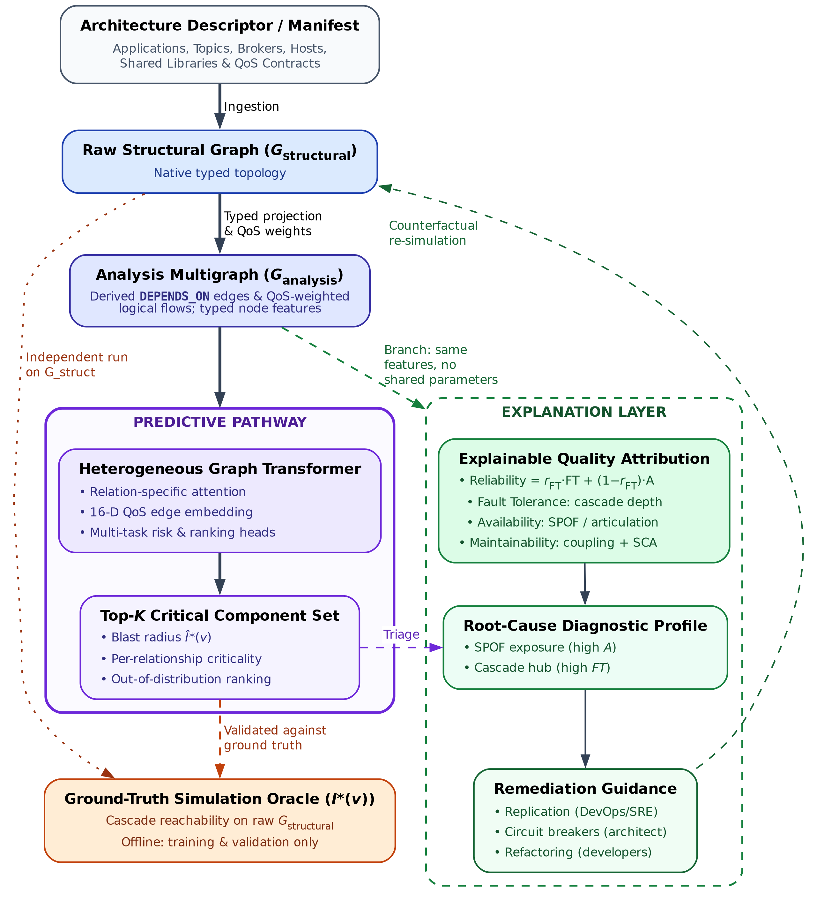
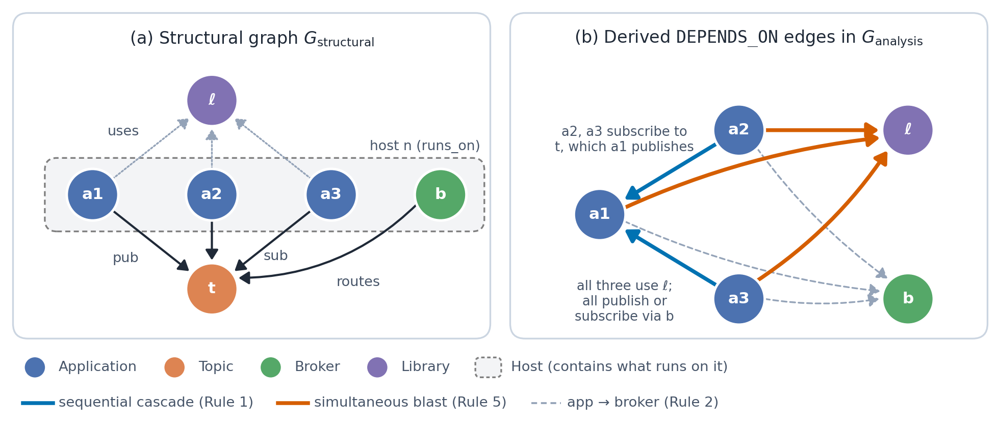
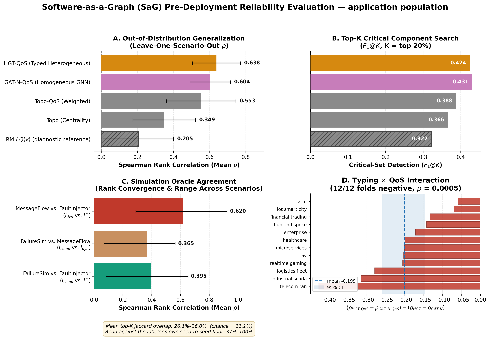

# Software-as-a-Graph: Heterogeneous Graph Learning for Pre-Deployment Dependability Analysis of Complex Distributed Systems

**Authors.** Ibrahim Onuralp Yigit, Feza Buzluca

**Affiliation.** Department of Computer Engineering, Istanbul Technical University, 34469 Maslak, Istanbul, Turkey

**Corresponding author.** Ibrahim Onuralp Yigit — yigiti@itu.edu.tr

> **Review model.** JSS uses a **single-anonymised** review process (confirmed against the
> Elsevier Guide for Authors, September 2026), so the manuscript body names its authors and
> `latex/title_page.tex` is uploaded as a separate Editorial Manager file. An earlier version
> of `outline.md` claimed double-anonymised review; that was wrong and has been corrected.

---

# Abstract

Modern asynchronous, publish--subscribe, and microservice architectures pose a critical pre-deployment visibility barrier: bug-free service code can still harbor catastrophic outages from hidden single points of failure or mismatched middleware contracts, a disconnect termed the Architecture--Code Gap. To evaluate reliability before deployment without runtime telemetry, we present Software-as-a-Graph (SaG), a static framework converting Architecture-as-Code manifests into typed multigraphs across five core entity types. SaG operates through two decoupled pathways: a relation-specific Heterogeneous Graph Transformer with Quality-of-Service edge encodings (HGT-QoS) forecasting cascade blast radii, and an interpretable ISO/IEC 25010 attribution layer guiding repairs.

Evaluated across twelve inductive scenarios and five open-source systems against simulation oracles, relation typing improves Spearman rank correlation by $\Delta\rho = +0.114$ over homogeneous learning under distribution shift ($p = 0.0122$, winning 11 of 12 folds), whereas in-distribution performance is indistinguishable. QoS edge encodings contribute an independent $+0.054$ ($p = 0.0093$). Against training-free QoS-weighted centrality, the learned model does not establish a statistically significant ranking advantage ($+0.127$, $p = 0.077$), indicating that teams requiring only scalar rankings can rely on topological heuristics. Zero-shot transfer achieves $\rho = 0.680$ overall, but drops to $+0.160$ on active failure-propagating components. Forward inference takes under $56\,\text{ms}$, leaving deterministic structural extraction as the primary bottleneck. Ultimately, training a deep heterogeneous model is justified not by scalar ranking alone, but by its relational inductive bias under distribution shift, per-relationship edge criticalities, and attention maps across heterogeneous schemas.

**Keywords:** Heterogeneous graph neural networks; Distributed systems dependability; Publish–subscribe architecture; Cascading failures; Static system analysis; Explainable AI.

---

# 1. Introduction

## 1.1 Motivation

Modern large-scale distributed software systems increasingly rely on asynchronous, event-driven, and publish–subscribe (pub-sub) architectures. Across diverse domains—from autonomous driving (ROS 2 [1]) and enterprise event streams (Apache Kafka [2]) to cyber-physical backbones (DDS [3]), IoT fleets (MQTT [4]), cloud-native microservices [5, 6], and distributed AI/LLM serving clusters—pub-sub decouples producers and consumers in space, time, and synchronization [7]. Components interact indirectly through intermediate message topics and brokers without maintaining direct static references. Furthermore, modern middleware specifications allow engineers to configure deployment-time Quality-of-Service (QoS) policies—such as reliability guarantees, durability, message priorities, and delivery deadlines—to govern how traffic behaves under peak load and network stress.

While this architectural decoupling confers elastic scalability and operational flexibility, it creates a formidable **visibility barrier** for system performance, reliability, and computational sustainability:

-   **Indirect Failure and Degradation Pathways:** In traditional synchronous architectures (e.g., RESTful HTTP or gRPC), component interactions follow explicit caller–callee invocation paths. In asynchronous pub-sub and event meshes, publishers and subscribers share no direct references. Cascading failures, queue head-of-line blocking, and backpressure propagate across hidden logical paths spanning brokers, shared topics, colocated execution nodes, and shared libraries.

-   **Distinct Degradation Mechanisms:** Disturbances in complex distributed systems do not propagate in a uniform manner. They manifest either as *sequential cascades* (e.g., a slow subscriber causing broker queue saturation and upstream backpressure) or as *simultaneous blast radii* (e.g., a shared runtime library crash, memory exhaustion, or host machine outage instantly disabling multiple colocated services). Conventional architectural diagrams and static call graphs fail to represent these multi-layer dependencies.

Addressing these architectural vulnerabilities is most effective and cost-efficient **prior to deployment**, during design and Continuous Integration / Continuous Delivery (CI/CD), adhering to established foundational principles of dependable computing [8]. However, at design and build time, **no runtime telemetry, distributed tracing, or operational logs exist**. Consequently, software architects, performance engineers, and Site Reliability Engineers (SREs) face two fundamental questions without operational data:

1.  *Which components, message topics, and communication links are systemically critical to system dependability and performance?*

2.  *Why are they critical, and what specific architectural repair (such as replicating a message broker, decoupling an over-subscribed topic, or sandboxing a shared library) will most effectively eliminate that risk?*

The same questions bear on computational sustainability, though we are careful about the form of the claim. Analyzing an architecture from a manifest requires no provisioned cluster, no running services, and no fault-injection harness — the resource it eliminates is infrastructure rather than CPU time. What it does not do is compute less: the deterministic structural analysis this framework depends on is expensive, and on our own corpus it costs substantially more than the discrete-event simulation it produces labels from (§§7.5 and 8.2). We measure wall-clock latency rather than energy counters, and we make no claim that the pipeline is computationally cheap in absolute terms. The narrow and supported statement is that the *learned* component is negligible within it — a $56\,\text{ms}$ forward pass against minutes of feature extraction — so applying graph neural networks to pre-deployment analysis does not itself introduce a meaningful cost.

## 1.2 Problem Statement: The Architecture–Code Gap and the Black-Box AI Challenge

We formulate pre-deployment dependability and performance analysis around two distinct, complementary tasks:

1.  **Failure-Impact Forecasting (Predictive Pathway) — the primary task.** We forecast dynamic cascading failure blast radii and identify critical components using a data-driven, relation-specific model over learned topological representations. Closed-form topological metrics capture broad connectivity cheaply; whether they also resolve multi-hop, relation-dependent cascade spread across heterogeneous channels is an empirical question, which we test directly against such a baseline (§7.1). Our predictive pathway is trained and evaluated against independent simulation ground truth as a ranking and critical-set identification model.

2.  **Explainable Criticality Attribution (Explanation Layer) — what a rank alone cannot say.** A ranked shortlist indicates *where* risk lies, but not *how to fix it*. We therefore pair the predictor with an interpretable structural quality profile grounded in ISO/IEC 25010 [9] and ISO/IEC 25019 [10]. This layer diagnoses the *qualitative root cause* of vulnerability—distinguishing, for instance, an unreplicated single point of failure from a high-coupling maintainability bottleneck—to guide concrete repairs. It serves strictly as an attribution model, not a ranking model.

This separation is architectural rather than merely presentational: both pathways operate on the same graph but share no parameters, and neither is trained on the other’s output. The coupling term that could connect them is disabled by default and reported only as an ablation (§4.2). Maintaining this independence allows SaG to identify components that are structurally central yet operationally low-impact—a nuanced diagnosis unattainable by either pathway alone.

Existing software engineering approaches fail to bridge what we define as the **Architecture–Code Gap**: *a distributed system can have pristine, bug-free source code within each individual service, yet remain fragile to catastrophic global outages caused by hidden architectural single points of failure (SPOFs) or mismatched middleware Quality-of-Service (QoS) contracts.* Classical architecture evaluation such as ATAM [11, 12], and the literature on architectural technical debt [13] and bad smells [14], identify architectural risks but rely on manual stakeholder elicitation rather than quantitative structural analysis. The automated paradigms each leave a different part of the gap unaddressed: static code analysis [15, 16, 17, 18] cannot see message queues or cross-host propagation; chaos engineering [19] needs a provisioned cluster and arrives after the architecture is fixed; and homogeneous centrality [20, 21, 22, 23] flattens the system into an untyped graph in which a topic, a library and a host are indistinguishable. §2 develops each in turn.

Furthermore, while machine learning has demonstrated remarkable success across software engineering, contemporary AI approaches applied to system dependability often function as uninterpretable black boxes. Deep neural models frequently output scalar risk scores or latent embeddings without providing transparent, actionable rationales for their predictions. In mission-critical software engineering, an opaque risk score is inadequate: developers and SREs cannot refactor code or reconfigure infrastructure without understanding *why* a component is vulnerable and *which* architectural mechanism is compromised.

## 1.3 The Software-as-a-Graph (SaG) Approach

To bridge the Architecture–Code Gap while overcoming the black-box AI challenge, this work introduces **Software-as-a-Graph (SaG)**, an AI-driven pre-deployment **Static System Analysis (SSA)** framework. SaG ingests Architecture-as-Code manifests and executes a four-stage pipeline:

1.  **Typed Multigraph Formulation:** SaG models the distributed architecture as a typed, directed multigraph over five core entity types: Applications, Brokers, Topics, Execution Nodes, and Shared Libraries (§3.1).

2.  **QoS-Aware Logical Dependency Projection:** Using six formal projection rules, SaG derives a semantic `DEPENDS_ON` dependency layer that captures both sequential cascades (via topics and brokers) and simultaneous blast radii (via shared libraries and node colocation), weighted by declared QoS contracts (§3.2).

3.  **Heterogeneous Graph Learning for Failure Forecasting (Predictive Pathway):** SaG trains a **Heterogeneous Graph Transformer (HGT)** whose relation-specific attention lets a `USES` edge into a shared library propagate differently from a `PUBLISHES_TO` edge into a topic. It forecasts cascading blast radii, ranks critical components, and outputs per-relationship criticality alongside multi-task quality outputs (§4).

4.  **Explainable Quality Attribution (Explanation Layer):** To explain *why* a flagged component is critical, SaG combines code-level SCA metrics with topological properties into a deterministic **Reliability–Maintainability (RM)** attribution model (§5). Reliability decomposes into **Fault Tolerance** (error propagation depth) and **Availability** (single-point-of-failure exposure), pointing to distinct repairs. Because it is a linear, propagation-free aggregate by design, it explains *why* a component is vulnerable rather than how far a cascade travels; its standalone rank correlation is correspondingly modest (§7.1).

To ensure methodological rigor, SaG enforces a strict **input–label independence guarantee**: learned models and attribution baselines operate exclusively on the analytical graph $G_{\text{analysis}}$, while ground-truth failure impacts are generated by independent discrete-event simulators operating on the raw structural topology $G_{\text{structural}}$ (§4.4).

Figure 1 shows how the two pathways relate. The predictive pathway is the primary one and is validated through a two-tier verification battery: Tier-1 core blocking validation against the structural cascade oracle (`FaultInjector`, §4.3) and Tier-2 targeted dynamic behavioral gating on top-$K$ candidates against discrete-event queueing flow (`MessageFlowSimulator`). Both oracles run strictly offline on $G_{\text{structural}}$ and are never online inference dependencies. The explanation layer then characterizes what the predictor flagged and the remediation that implies. The single link between them is triage rather than data flow: the architect applies the explanation to whatever the predictor ranked. The remediation guidance closes a loop of its own in the Prescribe stage (§5.3), in which candidate edits are counterfactually re-simulated by `FailureSimulator` on mutated copies of $G_{\text{structural}}$ and retained only if they beat the simulator's seed-to-seed noise.

```
+-----------------------------------------------------------------------------------+
|                            Software-as-a-Graph (SaG)                              |
+-----------------------------------------------------------------------------------+
|  Architecture Descriptor (Apps, Topics, Brokers, Hosts, Libraries, QoS Policies)   |
+------------------------------------------+----------------------------------------+
                                           |
                                           v
                  +----------------------------------------------+ ------+
                  |     Raw Structural Graph (G_structural)      |       | (Independent
                  +----------------------+-----------------------+       |  simulation,
                                         |                               |   §4.4)
                     [Typed projection & QoS weighting, §3.2]            |
                                         v                               |
                  +----------------------------------------------+       |
                  |       Analysis Multigraph (G_analysis)       |       |
                  |   (Derived DEPENDS_ON edges + typed node     |       |
                  |    features, §3.4)                           |       |
                  +----------------------+-----------------------+       |
                                         |                               |
            +----------------------------+----------------------------+  |
            |                                                         |  |
            v  PREDICTIVE PATHWAY (§4)            EXPLANATION LAYER (§5)  |
+-------------------------------------+   +-------------------------------------+
|  Heterogeneous Graph Transformer    |   |   Explainable Quality Attribution   |
|  - Relation-specific attention      |   |  - Fault Tolerance (cascade depth)  |
|  - 16-D QoS edge embedding          |   |  - Availability (SPOF/articulation) |
|  - Multi-task risk & ranking heads  |   |  - Maintainability (coupling + SCA) |
+------------------+------------------+   +------------------+------------------+
                   |                                         |                 |
                   v                                         v                 |
+-------------------------------------+   +-------------------------------------+
|  Top-K Critical Component Set       |-->|  Root-Cause Diagnostic Profile      |
|  - Blast radius C-hat(v) (§4.2)     |   |  - SPOF exposure (high A)           |
|  - Out-of-distribution ranking      |   |  - Cascade hub (high FT)            |
+------------------+------------------+   +------------------+------------------+
                   |  (Triage: A explains what B flagged)     |                 |
                   v                                         v                 |
+-------------------------------------+   +-------------------------------------+
| Ground-Truth Simulation Oracles     |<-+|  Remediation Verifier (§5.3, §8.1)  |
|  - Tier 1: FaultInjector (I*)       |   |  (FailureSimulator counterfactuals: |
|  - Tier 2: MessageFlow (I_dyn)      |   |   Replication / Circuit Breakers)   |
+-------------------------------------+   +-------------------------------------+
        [scores B's ranking only]
```



> **Figure numbering.** Figure files are named for the order in which they print, per the JSS Guide for Authors: Figure 1 pipeline (`Figure_1`), Figure 2 running example (`Figure_2`), Figure 3 results at a glance (`Figure_3`). The supplement's two figures are `Figure_S1` (AHP shrinkage) and `Figure_S2` (HGT attention). The ASCII schematics and Figure M1 are specific to this document. Supplementary Sections S1–S8 live in `latex/supplementary.tex` and are not reproduced here.

*Figure 1. End-to-end architecture of the SaG framework. The predictive pathway (§4) is the centre line: manifest ingestion → typed multigraph → QoS-weighted DEPENDS_ON projection → typed node features → heterogeneous graph learning → ranked critical set with per-relationship criticality → ground-truth simulation oracles (Tier-1 FaultInjector and Tier-2 MessageFlowSimulator) that validate it. The oracles close the predictive pathway's training-and-validation loop and run on Gstructural alone. The explanation layer (§5) is the branch off that line: it re-enters from the analysis multigraph, emits a standards-grounded quality profile from the same typed features, and feeds the Prescribe stage where candidate repairs are verified counterfactually via FailureSimulator.*

#### Rationale for Graph Learning vs. Direct Simulation

Since discrete-event simulation $I^*(v)$ defines ground-truth criticality here, it is fair to ask why train a graph model at all rather than run simulation sweeps or closed-form heuristics. Three reasons motivate the design, and §7.1 tests them adversarially. A trained model scores entity types no simulator sweep was run for, since message passing generalizes across labeled and unlabeled entities alike. Cascade simulation is stochastic and seed-sensitive (label standard deviation reaches $0.416$), whereas a trained model learns a smooth, threshold-marginalized surrogate that re-scores an already-analyzed architecture cheaply. And dynamic simulators need runnable containers or communication harnesses, whereas graph learning scores Architecture-as-Code manifests before any runtime infrastructure exists. A fourth motivation — that neither a simulator nor an unaugmented GNN returns a root cause in standardized quality terms — motivates the explanation layer rather than the predictor, and is taken up in §5. Whether these motivations are borne out empirically is a separate question, and §7.1 answers it only partly in the framework’s favor.

## 1.4 Research Questions

This empirical study investigates five research questions:

> **RQ1 (Predictive Efficacy):** *How accurately does heterogeneous graph learning predict cascading failure impact and identify the critical component set, compared with traditional, non-learning network metrics?*
>
> **RQ2 (Value of Architectural Typing):** *Does modeling distinct entity and dependency types (applications, topics, brokers, hosts, and libraries) yield better failure predictions than homogeneous graph models, and does that advantage hold on architectures the model has never seen?*
>
> **RQ3 (QoS Encoding and Robustness):** *Do middleware Quality-of-Service contracts carry signal a purely structural score discards, do the framework’s simulation oracles agree with one another, and are the reported orderings robust to the free parameters of the scorer and of the ground truth?*
>
> **RQ4 (Real-World Generalization):** *How effectively does the framework transfer zero-shot to authentic, real-world distributed systems across autonomous driving (ROS 2), cloud-native microservices, smart home IoT, and industrial edge computing?*
>
> **RQ5 (Analysis Cost):** *What does pre-deployment analysis cost at CI/CD time, which pipeline stage dominates that footprint, and how does it compare against the discrete-event simulation it is intended to displace?*

## 1.5 Key Contributions

This paper presents four principal contributions:

1.  **Heterogeneous Graph Learning for Pre-Deployment Dependability:** A relation-specific Heterogeneous Graph Transformer that forecasts cascading blast radii from Architecture-as-Code manifests, with a 16-D edge feature vector carrying 7 QoS dimensions and multi-task heads for component and relationship criticality (§4). Under inductive distribution shift across twelve architectures, typed learning leads untyped learning by $\Delta\rho = +0.114$ in Spearman rank correlation (winning 11 of 12 folds, $p = 0.0122$), while in-distribution the two are indistinguishable (§7.2). The QoS edge encoding independently contributes $+0.054$ ($p = 0.0093$; §7.3.1). However, against an unparameterized QoS-weighted centrality baseline, out-of-distribution ranking is not statistically surpassed ($+0.127$, $p = 0.077$), establishing clear empirical boundaries (§7.1).

2.  **A Formal Typed Architecture Model:** A multigraph representation that derives logical dependencies from physical pub-sub linkages and distinguishes sequential cascade propagation from simultaneous multi-consumer library failures (§3).

3.  **A Standards-Grounded Explanation Layer:** An interpretable Reliability–Maintainability model grounded in ISO/IEC 25010/25019 that turns ranked predictions into actionable diagnoses, separating single-point-of-failure exposure from error-propagation reach (§5).

4.  **Empirical Benchmark, Real-World Transfer, and Cost Profile:** An evaluation across twelve synthetic topologies (2,461 components) and five open-source systems (351 components) under strict graph-view separation. We characterize pipeline cost, showing that the neural model represents only $0.02\%$ of runtime, while deterministic feature analysis dominates ($82.7\,\text{s}$ vs. $7.2\,\text{s}$ for simulation), leading us to withdraw the conference version’s computational-efficiency claim (§§6–7).

#### Relationship to the authors’ prior work

An earlier conference paper [24] introduced the preliminary multigraph formulation and deterministic quality model on synthetic topologies. This JSS manuscript substantially extends that work by introducing: the entire predictive HGT pathway with 16-D QoS edge encoding and multi-task heads (§4); inductive LOSO cross-validation (§7.2); zero-shot evaluation across five open-source systems (§7.4); empirical cost and sustainability characterization (§7.5); multi-oracle convergent validity and graph-view separation (§§4.3–4.4); and global sensitivity analyses (§7.3). Retained formalisms from the conference paper are limited to restructured portions of §§3 and 5.

## 1.6 Paper Organization

The remainder of this paper is organized as follows: §2 reviews related work. §3 formalizes the SaG multigraph model and dependency projections. §4 details the Heterogeneous Graph Transformer and simulation oracles. §5 presents the ISO/IEC-grounded explanation layer. §6 outlines the experimental methodology, while §7 reports empirical results for RQ1–RQ5. §8 discusses practical implications, sustainability, threats to validity, and limitations. §9 concludes.

# 2. Related Work

This work builds upon and connects four foundational research areas: (1) dependability, performance, and sustainability in distributed software systems; (2) static code and system analysis; (3) software quality measurement and multi-criteria evaluation; and (4) graph representation learning and explainable AI (XAI).

## 2.1 Dependability, Performance, and Sustainability in Distributed Software Systems

The publish–subscribe (pub-sub) and asynchronous event-driven paradigms decouple communicating entities in space, time, and synchronization, enabling elastic scalability and high throughput [7]. Modern middleware standards—such as ROS 2 [1], Apache Kafka [2], DDS [3], and MQTT [4]—govern these exchanges through fine-grained Quality-of-Service (QoS) policies that regulate message durability, transport reliability, priorities, and delivery deadlines. In cloud-native microservice meshes and distributed AI/LLM serving backbones, asynchronous message passing and queueing topologies form the primary communication substrate, directly shaping tail latencies, throughput bottlenecks, and hardware resource utilization.

Prior dependability and performance research has focused predominantly on **runtime mechanisms**, including dynamic consensus protocols, broker clustering, adaptive backpressure throttling, autoscaling, and automated failover. In parallel, **chaos engineering and runtime verification** [19] inject faults or latency into staging or production clusters to observe degradation and recovery. While runtime fault injection delivers operational validation that no static method can match, it requires a fully provisioned cluster, carries the risk of real service disruption, and consumes cluster-hours per sweep — which places it, alongside model training, among the development-time computations whose energy cost green software engineering has argued should be accounted for rather than assumed away [25, 26, 27]. In practice this precludes its use during architectural design or lightweight commit-level CI/CD.

Our work addresses the complementary **pre-deployment phase**: predicting systemic cascading vulnerabilities and performance degradation directly from Architecture-as-Code descriptors before runtime infrastructure is provisioned. From a green software engineering perspective, the input is a manifest rather than an active deployment. We are careful about how far this argument reaches: it is a claim about what must be provisioned, not that the analysis uses less computation than alternatives—a distinction our measurements force, since the static gate proves more expensive than the simulation oracle it was intended to displace (§§7.5.1 and 8.2). Avoiding production restart storms remains motivating rather than an empirical claim.

#### Architecture-Based Reliability Prediction

Predicting dependability from an architectural description before deployment is not a new ambition, and SaG should be read against the tradition that pursued it analytically. Cheung’s absorbing-Markov-chain model [28] derives system reliability from component reliabilities and a transfer-of-control graph; Goseva-Popstojanova and Trivedi [29] systematize the state-based, path-based and additive families that followed, and Immonen and Niemelä [30] survey the resulting methods from the architectural perspective. Model-driven descendants such as the Palladio Component Model [31] and layered queueing networks [32] predict performance and reliability from parameterized component models with well-understood solution techniques.

A parallel tradition explicitly annotates architectural descriptions with fault behaviors or parameters. For example, the AADL Error Model Annex [33] allows architects to declare component error states and propagation paths to generate fault trees and Markov models automatically. Similarly, analytical reliability models require per-component failure probabilities, transition rates, or operational profiles [29, 31]. Where authored, such models answer strictly richer questions than ours. The critical distinction lies in required inputs: analytical and annex-based methods require deliberate, pre-calibrated failure semantics unavailable at commit time without operational telemetry. SaG asks a narrower question in exchange: given only declared deployment manifests, which components’ failures would propagate furthest through the declared topology? Where those parameters can be obtained, an analytical model answers a stronger question than a ranking does, and we make no claim to displace it.

#### Data-Driven Failure Prediction and Root-Cause Analysis in Microservices

A large recent literature localizes faults in microservice systems from operational data. Seer [34] and Sage [35] predict and debug QoS violations from traces and hardware telemetry; MicroRCA [36] and TraceRCA [37] localize root causes over service-dependency and trace graphs; DeepTraLog [38] and Eadro [39] combine traces, logs and metrics under graph-based deep models. This line is the closest methodological neighbor to our predictive pathway, and it consistently outperforms what a purely static analysis can achieve — because it observes the running system. That is precisely the boundary: every one of these approaches requires a deployed system emitting traces, logs or metrics, and therefore cannot answer a question posed at design or pull-request time. SaG occupies the pre-deployment complement, and accepts a correspondingly weaker evidential basis: simulated rather than observed failures, and topology rather than behavior.

## 2.2 Static Code Analysis (SCA) vs. Static System Analysis (SSA)

Traditional **Static Code Analysis (SCA)** tools (e.g., SonarQube [15]) inspect source code Abstract Syntax Trees (ASTs) within individual services. They evaluate cyclomatic complexity [16], class cohesion, module coupling (e.g., Lack of Cohesion in Methods [LCOM], Coupling Between Objects [CBO]) [17, 18], and code duplication to flag internal code smells and defect-prone modules [40, 41, 42, 43]. However, SCA cannot observe runtime communication topology: it is blind to inter-service messaging channels, message broker queue saturation, and cross-host failure propagation.

Recovering system-level structure statically is, however, an active area in its own right, and we do not claim the idea as novel. A body of work reconstructs microservice architecture from source and deployment artifacts without running the system: Bushong et al. [44] derive communication diagrams and bounded contexts from static code analysis of a service mesh, and a recent multivocal review compares nine such recovery tools and finds their outputs complementary enough that combining them improves detection [45]. That literature and ours differ in what the recovered graph is *for*: architecture recovery aims to reproduce a faithful description of the system as built, typically for comprehension or drift detection, whereas we take a declared topology as given and ask which of its components a failure would propagate furthest from. Recovery is, in that sense, an upstream complement — it could supply the manifests SaG consumes for a system whose Architecture-as-Code description is incomplete.

To bridge this “Architecture–Code Gap,” **Static System Analysis (SSA)** extends static analysis from single-service source code to the global system architecture. By modeling distributed applications, message topics, brokers, execution nodes, and shared libraries as a connected multigraph, SSA propagates code-level quality metrics across architectural dependencies. This allows engineering teams to detect structural anti-patterns [46, 47] and architectural technical debt [48] early during continuous integration (CI/CD) [49, 50], before defective topologies enter production.

## 2.3 Software Quality Models and Multi-Criteria Evaluation

Software product quality is standardized by the **ISO/IEC 25010:2023** product quality model [9] and the **ISO/IEC 25019:2023** Quality-in-Use model [10]. ISO/IEC 25010:2023 defines three closely intertwined characteristics critical to modern distributed systems:

-   **Reliability:** The degree to which a system performs specified functions under stated conditions, comprising Faultlessness, Availability, Fault Tolerance, and Recoverability.

-   **Maintainability:** The degree of effectiveness and efficiency with which software can be modified, comprising Modularity, Reusability, Analyzability, Modifiability, and Testability.

-   **Performance Efficiency:** Performance relative to resource consumption under stated conditions, comprising Time Behavior (latency, response time), Resource Utilization (CPU, memory, bandwidth), and Capacity.

SaG operationalizes a strict subset of these: Availability and Fault Tolerance under Reliability, and Modularity, Modifiability, and Analyzability under Maintainability (§5.1). Faultlessness, Recoverability, Reusability, and Testability are not derivable from deployment topology alone and are outside the scope of this work.

Software engineering measurement explicitly distinguishes between *internal quality* (measured on static artifacts at rest) and *external quality* (measured on executing software systems) [51, 52]. In distributed architectures, architectural debt (such as over-centralized message topics or unreplicated brokers) degrades internal quality and precipitates severe external performance bottlenecks, queue congestion, and outages.

Aggregating multi-attribute structural metrics into an auditable quality score constitutes a classic Multi-Criteria Decision Making (MCDM) problem. The **Analytic Hierarchy Process (AHP)** [53] delivers a structured pairwise-comparison method with an explicit Consistency Ratio ($CR \le 0.10$) intended to certify that elicited judgments are mutually coherent. That statistic detects *in*consistency; it cannot detect a matrix filled in from an answer already chosen, which is a limitation we take seriously for our own weights and quantify in Supplementary §S4. This study applies AHP to construct an audited, explainable Reliability–Maintainability (RM) quality baseline, in conjunction with learned graph models.

## 2.4 Graph Representation Learning and Explainable AI

Network science provides established centrality metrics to identify critical nodes, including degree, closeness, betweenness centrality [20, 22], articulation points, and PageRank [21, 23]. Foundational studies on network robustness [54], cascading overloads [55], and interdependent networks [56] model disruption propagation across connected topologies. While percolation models offer natural comparators, our training-free baselines are centrality-based (§6.2); evaluating targeted percolation fragmentation remains a recognized future baseline comparison.

However, standard network metrics suffer from two major limitations when applied to software architectures: (1) **Dimensional Collapse**, where a single centrality scalar cannot distinguish *why* a component is critical (e.g., an isolated single point of failure vs. an error-propagating cascade hub vs. an over-shared library); and (2) **Semantic Collapse**, where unweighted metrics treat all nodes and edges identically, conflating fundamentally different architectural entities such as asynchronous message topics, shared libraries, and physical execution hosts.

To overcome hand-engineered metrics, recent studies apply machine learning to network vulnerability (e.g., FINDER [57], DrBC [58], PowerGraph [59]). However, most models rely on **homogeneous message passing** (GCN [60], GraphSAGE [61], GAT [62]), averaging signals indiscriminately across connection types. Because distributed software architectures are inherently **heterogeneous**, homogeneous models blur entity boundaries and fail to generalize out-of-distribution. Heterogeneous Graph Neural Networks (RGCN [63], HAN [64], HGT [65], MAGNN [66]) resolve this via relation-specific transformations. We build upon the **Heterogeneous Graph Transformer (HGT)** [65] to preserve typed relational semantics when forecasting cascade blast radii.

#### Explainable AI (XAI) vs. The Black-Box Barrier

A critical hurdle in applying modern AI to software engineering is the **black-box barrier**: deep neural models output risk scores or continuous embeddings without explaining underlying structural causality. In production software engineering, uninterpretable risk rankings hinder actionable decision-making: developers and SREs cannot determine whether to replicate a host, configure circuit breakers, or refactor shared libraries.

Existing GNN explanation techniques, such as GNNExplainer [67] and PGExplainer [68], identify influential subgraphs through edge masking or parameterized learning. Although useful, these methods explain the model using internal latent representations rather than standardized software engineering concepts. SaG resolves this limitation through a decoupled dual-pathway design: the predictive HGT pathway reveals typed mutual-attention distributions indicating *which* architectural relations propagated the cascade (§7.3.4 and Supplementary §S8), while the deterministic explanation layer attributes fragility to standardized ISO/IEC quality sub-characteristics (§5), translating raw predictions into actionable, cost-effective remediations.

# 3. The Software-as-a-Graph (SaG) Architectural Model

This section formalizes the Software-as-a-Graph multigraph representation (§3.1), the QoS-aware weighting and logical dependency derivation rules (§3.2), the dual graph views (§3.3), and the typed node feature encodings (§3.4).

## 3.1 Formal Multigraph Definition

A complex distributed software system is formally modeled as a typed, weighted, directed multigraph: $$\mathcal{G} = (V, E, \tau_V, \tau_E, w_V, w_E)$$ where:

-   $V$ is the set of system entities, partitioned into five disjoint entity types: $$V = V_{\text{app}} \cup V_{\text{broker}} \cup V_{\text{topic}} \cup V_{\text{node}} \cup V_{\text{lib}}$$

-   $E$ is the set of directed edges connecting entities.

-   $\tau_V: V \to \mathcal{T}_V$ and $\tau_E: E \to \mathcal{T}_E$ are typing functions assigning node and edge categories.

-   $w_V: V \to [0, 1]$ and $w_E: E \to [0, 1]$ are weighting functions representing entity criticality and connection strength.

Table 1 summarizes the five entity types and six structural edge types formalized in the SaG model, along with their semantics and representative concrete distributed-system implementations.

**Table 1.** Entity and structural edge types in the SaG model.

| **Entity Type ($\mathcal{T}_V$)**     | **Architectural Role**                             | **Concrete System Examples**                   |
|:--------------------------------------|:---------------------------------------------------|:-----------------------------------------------|
| **Application** ($V_{\text{app}}$)    | Autonomous process producing/consuming messages    | ROS 2 node, Kafka microservice, MQTT client    |
| **Broker** ($V_{\text{broker}}$)      | Message routing and queuing intermediary           | RabbitMQ exchange, Mosquitto, EMQX broker      |
| **Topic** ($V_{\text{topic}}$)        | Named logical communication channel                | `/sensor/lidar`, `orders.payment.completed`    |
| **Node** ($V_{\text{node}}$)          | Physical host or virtualized execution environment | Bare-metal server, Kubernetes worker, Cloud VM |
| **Library** ($V_{\text{lib}}$)        | Shared software package or runtime dependency      | `librdkafka`, OpenCV, Protobuf runtime         |
| **Structural Edge ($\mathcal{T}_E$)** | **Direction**                                      | **Semantic Meaning**                           |
| `PUBLISHES_TO`                        | App/Library $\to$ Topic                            | Component publishes messages to topic          |
| `SUBSCRIBES_TO`                       | App/Library $\to$ Topic                            | Component consumes messages from topic         |
| `ROUTES`                              | Broker $\to$ Topic                                 | Broker manages and routes topic traffic        |
| `RUNS_ON`                             | App/Broker $\to$ Node                              | Process is hosted on physical/virtual host     |
| `CONNECTS_TO`                         | Node $\to$ Node                                    | Physical network link between hosts            |
| `USES`                                | App $\to$ Library                                  | Application links to shared library dependency |

Application and Library entities additionally incorporate static code metrics computed via Static Code Analysis (SCA) tools (`cm_` attributes: lines of code, cyclomatic complexity, coupling between objects, LCOM), linking code-level fragility directly to topological analysis.

## 3.2 QoS-Aware Weights and Logical Dependency Derivation

In distributed middleware, communication links vary in coupling strength based on their Quality-of-Service (QoS) contracts. For instance, a `RELIABLE` topic with `TRANSIENT_LOCAL` durability binds communicating services substantially more tightly than a `BEST_EFFORT` telemetry stream.

Each topic $t$ carries an intrinsic criticality weight $w(t) \in [0, 1]$ combining its declared QoS semantics with two runtime-stress modulators: payload size and publication frequency: $$\label{eq:3}
w(t) = \beta \cdot \text{QoS}(t) + \alpha \cdot \text{SizeNorm}(t) + \psi \cdot \text{FreqNorm}(t),
\quad (\beta, \alpha, \psi) = (0.75,\, 0.15,\, 0.10)$$ where the QoS term is an AHP-weighted aggregate of the declared contract: $$\text{QoS}(t) = w_{\text{rel}} \cdot q_{\text{rel}} + w_{\text{dur}} \cdot q_{\text{dur}} + w_{\text{prio}} \cdot q_{\text{prio}},
\quad (w_{\text{rel}}, w_{\text{dur}}, w_{\text{prio}}) = (0.24,\, 0.62,\, 0.14)$$ Here, $q_{\text{rel}}, q_{\text{dur}}, q_{\text{prio}} \in [0, 1]$ represent normalized reliability, durability, and transport-priority scores. Durability dominates because it governs whether data persists across restarts and network partitions. Reliability and transport priority both govern in-flight delivery quality, with reliability receiving higher weight because unconditional delivery guarantees precede message scheduling. The sub-weight vector is the geometric-mean priority vector of an independently stated Saaty pairwise-comparison matrix, printed with its consistency computation in Supplementary §S4; $CR = 0.016$, small but non-zero. The modulators are logarithmically compressed and clamped to $[0, 1]$: $\text{SizeNorm}(t) = \min(1.0, \log_2(1 + \text{bytes})/20)$ (a 1 MiB design envelope, representing the practical DDS sample ceiling before RTPS fragmentation dominates) and $\text{FreqNorm}(t) = \min(1.0, \log_{10}(1 + \text{Hz})/3)$. The final weight $w(t)$ is clamped to $[0.01, 1]$, ensuring that best-effort edges remain visible to graph traversals. Every structural communication edge incident on $t$ (`PUBLISHES_TO`, `SUBSCRIBES_TO`, `ROUTES`) inherits $w_E(e) = w(t)$ along with the topic’s QoS vector.

The outer split $(\beta, \alpha, \psi)$ is a declared convex combination. Sweeping it over the full simplex changes the induced ordering of $w(t)$ by at most $\rho = 0.076$ and downstream rank correlation by at most $0.020$, so it is a documented convention rather than a tuned parameter (Supplementary §S1).

### Logical Dependency Projection (`DEPENDS_ON`)

Structural edges capture explicit deployment connections but omit implicit runtime dependencies. For example, a subscriber depends upon a publisher, yet no direct edge connects them in pub-sub architectures. We therefore derive a single unified semantic relation, `DEPENDS_ON`, directed from *dependent* to *dependency* (“if target fails, source is impacted”), according to the six projection rules detailed in Table 2:

**Table 2.** The six `DEPENDS_ON` logical dependency projection rules.

| **Rule** | **Dependency Category** | **Structural Pattern ($\text{Dependent} \to \text{Dependency}$)**                    | **Derived Weight ($w$)**              |
|:--------:|:------------------------|:-------------------------------------------------------------------------------------|:--------------------------------------|
|  **1**   | `app_to_app`            | Subscriber $\to$ Publisher (via shared Topic, incl. transitive `USES`)               | $1 - \prod_{t \in T}(1 - w(t))$       |
|  **2**   | `app_to_broker`         | Publisher/Subscriber $\to$ Broker routing its topics                                 | $1 - \prod_{t \in T}(1 - w(t))$       |
|  **3**   | `node_to_node`          | Host $\to$ Host (lifted from inter-host app dependencies)                            | Lifted $\max w$                       |
|  **4**   | `node_to_broker`        | Host $\to$ Broker (lifted from hosted app dependencies)                              | Lifted $\max w$                       |
|  **5**   | `app_to_lib`            | Application $\to$ Shared Library it `USES`                                           | $H(w_V(\text{app}), w_V(\text{lib}))$ |
|  **6**   | `broker_to_broker`      | Broker $\leftrightarrow$ Broker (shared physical fault-domain colocation, symmetric) | $w_V(\text{node})$                    |

Rules 1 and 2 aggregate the set of topics $T$ connecting a component pair using a probabilistic union rather than a maximum [69, 70, 71]. This guarantees that additional parallel failure vectors increase coupling monotonically while keeping $w \in (0, 1]$. Rule 5 applies the harmonic mean $H(x, y) = 2xy/(x+y)$ [72] to combine the consuming Application’s and the shared Library’s vertex weights, balancing caller and dependency criticality. Rules 3 and 4 assign the maximum weight among component-level dependencies crossing the host boundary.

### Sequential Cascades vs. Simultaneous Blasts

A foundational principle of the SaG model is distinguishing between two fundamentally different degradation modes:

-   **Sequential Cascade (Rule 1):** When an application publisher fails, downstream subscribers suffer message starvation. The failure propagates hop by hop through message queues and topic buffers.

-   **Simultaneous Blast (Rule 5):** When a shared software library or execution node crashes, all consuming applications and colocated brokers fail *instantaneously* in a single shared-fate event.

Preserving architectural entity types and relation-specific projection rules enables SaG to model both mechanisms, whereas untyped homogeneous graphs collapse them into indistinguishable edges.

Rule 6 is intentionally the only symmetric projection rule. It does not imply that one broker functionally depends on another, but rather that two brokers colocated on the same host share that host’s physical failure domain. This follows the same simultaneous-blast principle as Rule 5, which is why the derived weight equals the shared Node’s weight and the relation is bidirectional. In production middleware deployments, colocated brokers compete for host resources (CPU cores, page cache, file descriptors, and NIC bandwidth); a host outage takes down all colocated instances simultaneously. Operational best practices for Kafka, RabbitMQ, and EMQX recommend distributing brokers across fault domains. Rule 6 does not model directional intra-cluster broker coupling (e.g., partition replication, controller quorum election, federation, or shovel links), which do not require physical colocation; extending the schema to capture these interactions is reserved for future work. Rule 6 applies in four of the eight scenarios forming the detection benchmark subset — the seven core synthetic topologies plus the ATM case study, the subset identified in Table 5 — and contributes only 12 directed edges across them. Because the simulation oracles operate strictly on $G_{\text{structural}}$ (§4.4), Rule 6 has zero influence on ground-truth failure labels.

## 3.3 Dual Graph Views and Architectural Layers

The SaG framework maintains two distinct representations of the system:

1.  **Structural Graph ($G_{\text{structural}}$):** The raw deployment graph containing physical and structural relations (such as `PUBLISHES_TO`, `ROUTES`, `RUNS_ON`, and `USES`). Discrete-event simulators consume this view exclusively to execute unbiased failure injections (§4.3).

2.  **Analysis Graph ($G_{\text{analysis}}$):** The projected graph containing derived `DEPENDS_ON` edges annotated with QoS weights and ingested SCA code metrics. All GNN feature representations, graph embeddings, and analytical metrics are computed on $G_{\text{analysis}}$.

Figure 2 illustrates this duality on a running example, contrasting the raw structural graph against the derived `DEPENDS_ON` projection.



*Figure 2. Running example: the raw structural graph (left) and the DEPENDS_ON projection derived from it (right). The projection makes implicit runtime dependencies explicit—a subscriber depends on the publishers of its topics even though no structural edge joins them—while the simulators continue to operate on the structural view alone.*

$G_{\text{analysis}}$ is further structured into four analytical layers (Application, Middleware, Infrastructure, and Global System), enabling evaluation of criticality at subsystem levels, consistent with hierarchical frameworks such as MIL-STD-498 [73].

## 3.4 Typed Node Feature Encoding

Both pathways read the same typed node properties from $G_{\text{analysis}}$: the predictive pathway (§4) projects them per entity type before heterogeneous message passing, and the explanation layer (§5) aggregates them into its quality profile. All five entity types share indices 0–17, a common block of topological metrics (in/out degree, betweenness, closeness, reverse PageRank, clustering coefficient, articulation score, bridge load) produced by the deterministic analysis stage whose cost is characterized in §7.5. Type-specific features extend that block:

-   **Application (23 dims):** indices 18–22 add source-code metrics from SCA — lines of code, cyclomatic complexity, Martin’s instability $I_{\text{code}} = C_e/(C_a + C_e)$ [74], Lack of Cohesion in Methods, and the composite Code Quality Penalty (CQP).

-   **Library (25 dims):** the Application block plus two library-specific blast-radius drivers (23–24): the normalized size of the transitive reverse-`USES` closure, and the normalized count of distinct subscribers reachable from topics published within that closure.

-   **Broker (19 dims):** index 18 is normalized queue buffer capacity.

-   **Topic (22 dims):** indices 18–21 are publisher count, subscriber count, log message frequency $\log(1 + \text{freq})$, and ordinal QoS criticality.

-   **Infrastructure Node (20 dims):** indices 18–19 are normalized CPU core allocation and physical memory.

# 4. Graph Learning for Failure-Impact Prediction

Cascading failure impact in distributed software systems is inherently non-linear, multi-hop, and relation-dependent. Outages propagate not merely based on neighbor count, but through architectural relations and dependencies extending multiple hops beyond the initial fault. Whether a closed-form combination of standard centrality metrics can capture these compound dynamics is an empirical question rather than a settled one. The primary predictive pathway of §1.2 therefore employs a learned graph model, and §7.1 evaluates it against exactly such a closed-form baseline — which, on out-of-distribution ranking, it does not significantly surpass.

This section details the Heterogeneous Graph Transformer (HGT) architecture and its typed edge encodings (§4.1), the multi-task prediction heads and dimension-masked loss formulation (§4.2), the ground-truth simulation oracles (§4.3), and the input–label independence guarantee that prevents data leakage (§4.4).

## 4.1 Heterogeneous Graph Transformer Architecture

Because distributed systems comprise heterogeneous entity types (Applications, Libraries, Brokers, Topics, Infrastructure Nodes) and diverse interaction semantics (`PUBLISHES_TO`, `SUBSCRIBES_TO`, `ROUTES`, `RUNS_ON`, `CONNECTS_TO`, `USES`, `DEPENDS_ON`), we employ a three-layer **Heterogeneous Graph Transformer (HGT)** architecture [65], implemented within PyTorch Geometric [75], with hidden dimension $D = 64$ and $H = 4$ attention heads. This architecture ensures that typed relations, rather than simple adjacency, govern failure-impact forecasting.

```
+-----------------------------------------------------------------------------------+
|               Heterogeneous Graph Transformer (HGT) Architecture                  |
+-----------------------------------------------------------------------------------+
|  Node Features (19-25 dims) + 16-dim QoS Edge Encodings injected into destinations|
+------------------------------------------+----------------------------------------+
                                           |
                                           v
+-----------------------------------------------------------------------------------+
| 1. Type-Specific Input Projection:                                               |
|    h_v^(0) = LayerNorm( GELU( W_tau(v) * x_v ) )                                 |
+------------------------------------------+----------------------------------------+
                                           |
                                           v
+-----------------------------------------------------------------------------------+
| 2. Relational Mutual Attention & Edge Feature Ingestion (L Layers):               |
|    e_uv' = W_edge * e_uv,   h_tilde_v = h_v + e_uv'                               |
|    Attention(u, e, v) = Softmax_u ( ( K(u) * W_att,phi(e) * Q(h_tilde_v)^T ) / d )|
|    Message(u, e, v)   = V(u) * W_msg,phi(e)                                       |
|    h_v^(l) = LayerNorm( h_v^(l-1) + Dropout( Sum_u Attention(u,e,v)*Message(u,e,v) ) )|
+------------------------------------------+----------------------------------------+
                                           |
                                           v
+-----------------------------------------------------------------------------------+
| 3. Multi-Task Residual Output Heads:                                              |
|    - Reliability Head (R):       y_R(v) = Sigmoid( MLP_R( h_v^(L) ) )             |
|    - Maintainability Head (M):   y_M(v) = Sigmoid( MLP_M( h_v^(L) ) )             |
|    - Global Cascade Impact Head: I_pred(v) = Sigmoid( MLP_C( h_v || y_R || y_M ) )|
|    - Edge Criticality Head:      Q(u,v) = Sigmoid( TypedEdgeEncoder(h_u, h_v, e) )|
+-----------------------------------------------------------------------------------+
```

*Figure M1 (this document only). Layered architecture of the Heterogeneous Graph Transformer predictor. The LaTeX sources carry no counterpart; the equations it summarises are those of §4.1.2 and §4.2.*

### 4.1.1 Continuous-Categorical Edge Feature Encoding (16-D)

To capture continuous QoS constraints and channel semantics, SaG encodes each directed edge $e = (u,v)$ as a 16-dimensional continuous-categorical vector $e_{uv} \in \mathbb{R}^{16}$. Index 0 is the scalar coupling weight $w_E(e) \in (0,1]$ of §3.2; index 1 is the normalized count of simple paths through $e$ in $G_{\text{analysis}}$; indices 2–8 one-hot encode the seven structural and derived relations (`PUBLISHES_TO`, `SUBSCRIBES_TO`, `ROUTES`, `RUNS_ON`, `CONNECTS_TO`, `USES`, `DEPENDS_ON`). Indices 9–15 encode middleware QoS parameters on `PUBLISHES_TO` and `SUBSCRIBES_TO` edges (zeroed elsewhere). Four of these dimensions are active in our evaluation corpus: reliability ($0$ best-effort, $1$ reliable); durability ($0$ volatile, $0.5$ transient-local, $0.6$ transient, $1$ persistent); message priority ($0$, $0.33$, $0.66$, $1$); and a heterogeneity flag set when the edge’s QoS triple departs from its scenario’s modal profile. The remaining three indices (deadline-active flag, $\log_{10}(1 + \text{deadline\_ns}/10^6)$, and $\log_{10}(1 + \text{max\_blocking\_ms})$) are architectural schema provisions designed to accommodate hard real-time DDS and ROS 2 microsecond profiles, and are zero-initialized in the current benchmarks.

An edge projection module maps $e_{uv}$ into the hidden space: $e_{uv}' = W_{\text{edge}} e_{uv}$. Prior to relational attention computation, this projection vector is incorporated directly into the target node representation: $\tilde{h}_v = h_v + e_{uv}'$.

### 4.1.2 Type-Specific Projection and Heterogeneous Message Passing

For each source node $u$ and target node $v$ connected by meta-relation $\tau(e) = (\tau(u), \phi(e), \tau(v))$:

1.  **Type-Specific Projection:** Node feature vectors $x_v$ (of dimension 19–25 depending on entity type $\tau(v)$) are mapped into the shared $D$-dimensional hidden space: $$h_v^{(0)} = \text{LayerNorm}\big(\text{GELU}(W_{\tau(v)} x_v)\big)$$

2.  **Relational Mutual Attention:** Type-parameterized Query ($Q$), Key ($K$), and Value ($V$) projections calculate relation-specific attention. For head $i \in \{1, \dots, H\}$, with the softmax taken over the incoming neighborhood $\mathcal{N}(v)$: $$\text{Attn}^{\,i}(u, e, v) = \underset{u \in \mathcal{N}(v)}{\text{Softmax}}\left( K^i(u)\, W^i_{\text{att},\phi(e)}\, Q^i(\tilde{h}_v)^\top \cdot \frac{\mu_{\langle \tau(u), \phi(e), \tau(v)\rangle}}{\sqrt{D/H}} \right)$$ where $\mu_{\langle \tau(u), \phi(e), \tau(v)\rangle}$ is the learned per-meta-relation scaling prior of Hu et al. [65], which lets the model weight an entire relation triple up or down independently of the node pair. We retain it: it is the parameter that most directly expresses “this relation type matters more than that one”, and the typing effect of §7.2 is what it exists to capture. The implementation is PyTorch Geometric’s `HGTConv` [75], whose `p_rel` parameter is this term. $$\text{Msg}(u, e, v) = V(u) W_{\text{msg},\phi(e)}$$

3.  **Bidirectional Message Passing:** To capture downstream consumer starvation and upstream backpressure simultaneously, message passing is executed over both forward and transposed relation views ($G_{\text{analysis}}$ and $G_{\text{analysis}}^\top$).

4.  **Residual Aggregation and Layer Normalization:** Target node representations are updated across layers $l \in \{1, \dots, L\}$ via residual connections and layer normalization: $$h_v^{(l)} = \text{LayerNorm}\left( h_v^{(l-1)} + \text{Dropout}\left(\sum_{u \in \mathcal{N}(v)} \text{Attn}(u, e, v) \cdot \text{Msg}(u, e, v)\right)\right)$$

#### Training Protocol and Optimization Hyperparameters

Models are optimized end-to-end using AdamW with initial learning rate $\eta = 3 \times 10^{-4}$, weight decay $10^{-4}$, and dropout probability $p = 0.10$ applied post-attention. Learning rates follow a cosine annealing schedule with warm restarts ($\text{CosineAnnealingWarmRestarts}$, $T_0 = 75$, $T_{\text{mult}} = 2$, $\eta_{\min} = 3 \times 10^{-6}$). Training executes for a maximum of 300 epochs with early stopping governed by a patience of 30 epochs monitored on validation loss over labeled nodes. Inductive subgraphs are processed per scenario using full-graph inductive packing without mini-batch subsampling, with validation masks isolating held-out nodes to prevent information leakage across data splits. Five independent random seeds $\{42, 123, 456, 789, 2024\}$ are evaluated across all runs, redrawing both partition masks and initializations. *Selection protocol:* the architectural hyperparameters ($D = 64$, $H = 4$, dropout, learning rate, and schedule) follow values conventional for HGT [65]. The loss coefficients of Equation (9) have no such precedent — the objective is bespoke to this task — and were set by judgment and left untuned; we state this rather than appeal to a convention that does not exist for a five-term multi-task loss. Neither group was tuned against the in-distribution test split or the LOSO folds; no search over them was performed there. The real-world evaluation of §7.4.1 is a separate case and is documented separately: it runs at a different depth and epoch budget from every other learned result in this paper, and §7.4.1 states that configuration and how it was arrived at. This avoids selection leakage, at the cost of leaving open whether either family is reported near its own optimum — a comparison between untuned configurations, which we state rather than treat as a like-for-like optimum comparison.

## 4.2 Multi-Task Prediction Heads and Dimension Masking

From the final node embeddings $h_v^{(L)}$, SaG utilizes specialized multi-task prediction heads:

-   **Reliability Head:** $\hat{R}(v) = \sigma(\text{MLP}_R(h_v)) \in [0, 1]$

-   **Maintainability Head:** $\hat{M}(v) = \sigma(\text{MLP}_M(h_v)) \in [0, 1]$

-   **Composite Failure Impact Head:** $\hat{I}^*(v) = \sigma(\text{MLP}_C(h_v \parallel \hat{R}(v) \parallel \hat{M}(v))) \in [0, 1]$

-   **Relationship Criticality Head:** $\hat{Q}(u,v) = \sigma(\text{TypedEdgeEncoder}_{\phi(e)}(h_u, h_v, e_{uv})) \in [0, 1]$

### 4.2.1 Dimension-Masked Loss Formulation

The combined optimization objective integrates regression accuracy, multi-task dimension learning, ranking fidelity, pairwise ordering, and edge prediction: $$\label{eq:loss}
\mathcal{L} = \mathcal{L}_{\text{composite}} + 0.5 \cdot \mathcal{L}_{\text{dimension}} + 0.3 \cdot \mathcal{L}_{\text{rank}} + 0.1 \cdot \mathcal{L}_{\text{pairwise}} + 0.3 \cdot \mathcal{L}_{\text{edge}} + \lambda_{\text{RM}} \cdot \mathcal{L}_{\text{consistency}}$$ where $I^*(v)$ is the simulated cascade impact defined by the primary oracle (§4.3), $\mathcal{L}_{\text{composite}} = \text{MSE}(\hat{I}^*(v), I^*(v))$, $\mathcal{L}_{\text{rank}}$ is the ListMLE ranking loss [76], $\mathcal{L}_{\text{pairwise}}$ is margin-ranking loss, and $\mathcal{L}_{\text{consistency}} = \text{MSE}\big([\hat{R}(v), \hat{M}(v)]_{v \in \text{unlabeled}}, [R_{\text{RM}}(v), M_{\text{RM}}(v)]_{v \in \text{unlabeled}}\big)$ regresses predicted heads toward the diagnostic pathway’s baseline (§5) on unlabeled nodes. Headline results use $\lambda_{\text{RM}} = 0$, guaranteeing that the predictive and explanatory pathways remain strictly independent.

**Dimension Masking:** Because dynamic cascade simulation ($I^*(v)$ via `FaultInjector`) observes runtime failure reachability rather than source-code maintainability, maintainability ground truth is unobserved during dynamic simulation. A separate change-propagation oracle $I_M(v)$ evaluates static structural change ripple at the Validate stage, but is never used as a training label to avoid circular supervision. We introduce a boolean dimension mask $m = [m_R, m_M] = [1, 0]$: $$\mathcal{L}_{\text{dimension}} = \frac{1}{\sum_{d} m_d} \sum_{d \in \{R, M\}} m_d \cdot \text{MSE}(\hat{d}(v), d^*(v))$$ This mask ensures the unobserved maintainability head is not artificially penalized or driven toward zero during backpropagation.

**What the reliability label is.** The surviving term deserves to be stated plainly, because it is weaker than a multi-task objective normally implies. `FaultInjector` emits a single scalar per component, and the label extractor assigns that same scalar to both the composite and the reliability columns: $R^*(v) = I^*(v)$ identically. $\mathcal{L}_{\text{dimension}}$ under $m = [1,0]$ therefore regresses $\hat{R}$ toward the very target $\mathcal{L}_{\text{composite}}$ regresses $\hat{I}^*$ toward. The two terms are not redundant — they train separate heads, and $\hat{R}$ re-enters the composite head as an input ($\hat{I}^* = \sigma(\text{MLP}_C(h_v \parallel \hat{R} \parallel \hat{M}))$), so the term acts as an auxiliary path to the same supervision rather than as a second source of information. But no dimension of the label is decomposed by this oracle: a reliability score distinct from overall impact would require an oracle that separates fault-tolerance from availability, which $I^*(v)$ does not. We report the objective as implemented rather than describing it as multi-dimensional supervision it does not receive.

### Domain-Reweighted Criticality ($Q_{\text{domain}}$)

To ground predictions in ISO/IEC 25019 Context of Use ($\vec{\omega} = [q_R, q_M]^\top$), the composite score can be evaluated as: $$Q_{\text{domain}}(v) = q_R \cdot \hat{R}(v) + q_M \cdot M_{\text{static}}(v)$$ where $M_{\text{static}}(v)$ is obtained directly from the structural analyzer’s maintainability baseline, combining learned dynamic reliability with static source-code maintainability. Because maintainability is unobserved in dynamic simulation ($m = [1, 0]$), headline results report $\hat{I}^*(v)$ directly, while domain reweighting sensitivity is evaluated against the static RM baseline in Supplementary §S3.

## 4.3 Ground-Truth Simulation Oracles

To evaluate predictive accuracy prior to deployment without relying on production runtime telemetry, SaG executes discrete-event failure simulations over the raw structural multigraph $G_{\text{structural}}$. We establish a formal taxonomy of four component-level oracles and one relationship-level oracle:

-   **Cascade Reachability Oracle ($I^*(v)$)**, via `FaultInjector`: crashes component $v$, propagates outages across dependent topics, brokers, and links by breadth-first traversal, and returns the mean fractional feed loss over the subscriber population, each subscriber contributing the unweighted mean loss of the topics it subscribes to. A topic’s feed loss is the fraction of its publishers that have failed (for a topic with no publisher, the fraction of its failed routers), scaled by a QoS ladder ($\times 1.2$ `RELIABLE`, $\times 1.15$ high/urgent priority, $\times 1.05$ medium) and clamped to $[0,1]$. The denominator is the full subscriber set of the intact graph, so subscribers that themselves fail are retained in the average rather than excluded. The implementation admits a per-publisher rate weighting, but rates are declared per topic throughout our corpus, so it reduces exactly to this publisher fraction. This is the **primary continuous target label** throughout.

-   **Multi-Metric Composite Oracle ($I_{\text{comp}}(v)$)**, via `FailureSimulator`: $$I_{\text{comp}}(v) = 0.35 \cdot \Delta\text{Reachability} + 0.25 \cdot \Delta\text{Fragmentation} + 0.25 \cdot \Delta\text{Throughput} + 0.15 \cdot \Delta\text{FlowDisruption}$$ each term weighted by operational severity $s(t) = w(t) \cdot \text{rate}(t)$. These four coefficients are AHP-derived on the same footing as the rest of the framework’s weights, from a Saaty pairwise-comparison matrix over the four impact criteria (Supplementary §S4): the raw priority vector is $(0.389, 0.255, 0.255, 0.100)$, and the $\lambda = 0.7$ shrinkage toward a uniform prior that the framework applies throughout yields $(0.347, 0.254, 0.254, 0.145)$, which the shipped constants round. That matrix is rank-one, so it records where the constants came from without independently justifying them. They are not fitted to any evaluation, and they are not swept in the supplementary sensitivity analysis — a gap we note because $I_{\text{comp}}$ supplies the labels for the real-world evaluation of the explanation layer (Supplementary §S7). $\text{rate}(t)$ reads from a runtime telemetry profile when one is attached; none is attached anywhere in this paper, so $s(t) = w(t)$ throughout and the rate channel should be read as an interface for deployment-time calibration rather than an active term. Publication frequency and payload size still reach $s(t)$ through $w(t)$’s own modulators (§3.2).

-   **Dynamic Queue-Flow Oracle ($I_{\text{dyn}}(v)$)**, via `MessageFlowSimulator` on SimPy [77]: simulates emission rates, stochastic latencies, broker buffer saturation, and queue drops under fault injection, extracting the drop in delivered message rate to surviving consumers.

-   **Change-Propagation Oracle ($I_M(v)$)**, via `ChangePropagationSimulator`: a deterministic reverse-dependency traversal quantifying maintenance change impact, $$\label{eq:change_prop}
        I_M(v) = 0.45\,\text{ChangeReach}(v) + 0.35\,\text{WeightedChangeImpact}(v) + 0.20\,\text{NormalizedChangeDepth}(v)$$

-   **Relationship (Edge) Removal Oracle ($I_{\text{edge}}(u,v)$):** the systemic impact of severing one dependency while both endpoints stay operational. Writing $\bar{I}_{\text{comp}}(G)$ for the mean composite impact over $G$: $$\label{eq:edge_crit}
        I_{\text{edge}}(u,v) = \bar{I}_{\text{comp}}\big(G \setminus \{(u,v)\}\big) - \bar{I}_{\text{comp}}(G)$$

**Simulation Engine Taxonomy and Stage Reorganization.** Because the reliability-facing and quality-facing oracles measure distinct operational constructs at different pipeline velocities, SaG aligns each engine with a dedicated architectural stage:
1. **`FaultInjector` ($I^*(v)$):** Owns the **Predict Stage** (generating supervised training labels for GNNs and topological baselines) and the **Validate Stage as the Tier-1 Primary Static & Structural Validation Gate** (the core blocking gate in CI/CD, enforcing ranking precision $\rho \ge 0.70$ and top-$K$ critical-set overlap).
2. **`MessageFlowSimulator` ($I_{\text{dyn}}(v)$):** Owns the **Validate Stage as the Tier-2 Dynamic Behavioral Gate** (a targeted runtime flow gate evaluating Top-$K$ critical components for SLA deadline violations, buffer drops, and dynamic delivery loss under SimPy queueing) as well as the independent convergent-validity probe across simulation paradigms.
3. **`FailureSimulator` ($I_{\text{comp}}(v)$, $I_{\text{edge}}(u,v)$):** Decoupled from predictive ranking validation to govern the **Explanatory Layer** (providing multi-dimensional ISO/IEC 25010 quality profiles: $IR, IM, IA, IS$) and the **Prescribe / Explain Stage** (serving as the counterfactual Remediation Verifier via `EditVerifier` to ensure refactorings reduce systemic degradation without introducing new SPOFs).
4. **`ChangePropagationSimulator` ($I_M(v)$):** Owns the Maintainability dimension in the **Explanatory Layer** (ISO/IEC 25010 quality profiling) and serves as the **Validate Stage Maintainability Reference** (internal structural consistency check on $G^\top$, never GNN supervision).

**Cross-Oracle Convergent Validity and Critical-Set Bounds.** Measured across the twelve inductive folds and five random seeds on the Application population, the mean Spearman rank correlation is $\rho = 0.620$ for $(I_{\text{dyn}}, I^*)$, $\rho = 0.395$ for $(I_{\text{comp}}, I^*)$, and $\rho = 0.366$ for $(I_{\text{comp}}, I_{\text{dyn}})$. The substantial but sub-ceiling agreement ($\rho = 0.620$, against a label test-retest ceiling of $0.817$–$1.000$) between the behavioral queue-flow oracle and the topological cascade injector provides independent convergent evidence across distinct simulation paradigms without collapsing into a re-measurement of the same construct. However, agreement on the top-$K$ critical set ($K = 0.2n$) is more conservative (mean Jaccard overlap of $0.36$ for the strongest pair and $0.27$–$0.28$ for the two $I_{\text{comp}}$ pairs, vs. $0.111$ expected by chance), highlighting the intrinsic sensitivity of discrete thresholding in non-linear cascades. Consequently, results established against one oracle are never transferred to another; every evaluation metric explicitly references its underlying simulation oracle.

## 4.4 Input–Label Independence Guarantee

To eliminate data leakage and ensure rigorous evaluation, SaG enforces strict architectural separation between inputs and labels:

-   **Feature Space:** Constructed exclusively from $G_{\text{analysis}}$ using static structural topology, static code analysis (SCA) metrics, and declared QoS contracts.

-   **Label Space:** Evaluated exclusively on raw $G_{\text{structural}}$ through independent simulation oracles (`FaultInjector`, `FailureSimulator`, `MessageFlowSimulator`).

No simulation outputs, failure trace histories, or dynamic execution telemetry are ever exposed as input features to the GNN or the explanation layer.

#### What this guarantee does and does not establish

The separation rules out circular feature construction: no predictor can read a transformation of the quantity it is scored against. It does not establish statistical independence between features and labels, and we do not claim it does. $G_{\text{analysis}}$ is a deterministic projection of $G_{\text{structural}}$ (§3.2), so the labels are — up to simulator seed — a deterministic function of the same topology the features are computed from. Two consequences follow, and both bound the results of §7.

First, $I^*(v)$ is itself a topological functional: a breadth-first reachability computation over $G_{\text{structural}}$ scaled by a QoS ladder. The predictive task is therefore to recover a closed-form function of a graph from features of that same graph. Read that way, it is unsurprising that an unparameterized centrality score is competitive with a trained model (§7.1); the parity we report there is the expected outcome of the setup rather than a surprising failure of graph learning, and we flag it here so the reader does not have to infer it.

Second, and more restrictively, no result in this paper is validated against an observed failure. Every label — on synthetic topologies and on the five open-source systems alike — is simulator-derived. What the evaluation can establish is whether a learned model recovers a simulator’s ordering on architectures it was not trained on. Whether that ordering corresponds to which components actually fail in production is a question this design cannot answer, and §8.3 treats it as the study’s principal construct-validity threat.

# 5. The Explanation Layer: Standards-Grounded Criticality Attribution

The predictor of §4 answers *where* to act. It does not answer *what to do*, and neither does the oracle that scores it — both return impact, not cause attributed in standardized quality terms. A component may be critical because it is a single point of failure, because it propagates errors widely, or because it is a high-coupling maintenance bottleneck. These diagnoses call for distinct architectural repairs: replicating the host or broker, decoupling the topic, or refactoring the module. This section presents the layer supplying that diagnosis. SaG decomposes component and relationship criticality into a standards-grounded quality profile, computed over the same typed node features (§3.4) but sharing no parameters with the predictor, and applied to whatever the predictor flagged — triage rather than data flow (Figure 1).

## 5.1 Grounding in ISO/IEC Standards

In accordance with **ISO/IEC 25010:2023** (Product Quality Model) [9], **ISO/IEC 25019:2023** (Quality-in-Use) [10], and **ISO/IEC 25022:2016** (Measurement of Quality-in-Use) [78], SaG formalizes two primary criticality constructs:

-   **Component Criticality ($D_1$):** The degree to which the sudden failure, unexpected termination, or severe degradation of an individual component reduces the system’s capacity to deliver required services within its operational context of use.

-   **Relationship Criticality ($D_2$):** The degree of systemic service degradation resulting from the severance, partitioning, or failure of a specific dependency or communication channel while both endpoint components remain operational.

Criticality is evaluated across two orthogonal quality characteristics: **Reliability ($R$)** and **Maintainability ($M$)**. The two are separated because they imply different repairs, not because they predict different runtime quantities: this layer attributes structural fragility and does not forecast latency, throughput, or queue occupancy. Table 3 outlines this Reliability–Maintainability (RM) quality decomposition, mapping ISO/IEC sub-characteristics to architectural questions, underlying graph metrics, and targeted engineering remediations.

**Table 3.** The Reliability–Maintainability (RM) quality decomposition.

| **Dimension**             | **Sub-Characteristic**       | **Architectural Question**          | **Underlying Graph Metrics**                                                                    | **Role / Remediation**                             |
|:--------------------------|:-----------------------------|:------------------------------------|:------------------------------------------------------------------------------------------------|:---------------------------------------------------|
| **Reliability ($R$)**     | **Fault Tolerance ($FT$)**   | How broadly does failure propagate? | Reverse PageRank on $G^\top$, in-degree, cascade depth                                          | Reliability Eng.: add redundancy, circuit breakers |
|                           | **Availability ($A$)**       | Is this a single point of failure?  | Directed articulation score (raw + QoS-weighted), bridge ratio, connectivity degradation        | DevOps/SRE: replicate host/broker                  |
| **Maintainability ($M$)** | **Modularity/Modifiability** | How complex and coupled is this?    | Betweenness, QoS-weighted out-degree, Code Penalty, coupling-risk imbalance, inverse clustering | Architect: refactor code, decouple                 |

*Coverage Scope:* SaG focuses specifically on Reliability and Maintainability. Safety (which requires domain-specific hazard logs, such as ISO 26262 Automotive Safety Integrity Level [ASIL] ratings) and Security (which requires explicit threat models, such as STRIDE [Spoofing, Tampering, Repudiation, Information Disclosure, Denial of Service, Elevation of Privilege]) fall outside purely structural topology analysis and are reserved for domain-specific extensions.

## 5.2 Composite Quality Score Formulation

All raw topological and code metrics are rank-normalized to $[0, 1]$. Quality sub-characteristics are formulated hierarchically using the Analytic Hierarchy Process (AHP) [53]:

1.  **Fault Tolerance ($FT(v)$):** Measures error cascade potential on the transpose graph $G_{\text{analysis}}^\top$ (where edges follow failure propagation from dependency to dependent): $$FT(v) = 0.45 \cdot \text{RPR}(v) + 0.30 \cdot \text{Deg}_{\text{in}}(v) + 0.25 \cdot \text{CDPot}_{\text{enh}}(v)$$ where $\text{RPR}(v)$ is Reverse PageRank, $\text{Deg}_{\text{in}}(v)$ is normalized in-degree, and $\text{CDPot}_{\text{enh}}(v)$ is the enhanced Cascade Depth Potential term.

2.  **Availability ($A(v)$):** Identifies structural single points of failure (SPOFs) across five terms — directed articulation severity, its QoS-weighted variant, edge-level irrecoverability, connectivity degradation, and the component’s own QoS weight: $$\label{eq:availability}
        A(v) = 0.2563 \cdot \text{AP}_c^{\text{dir}}(v) + 0.1998 \cdot \text{QSPOF}(v) + 0.1998 \cdot \text{BR}(v) + 0.2563 \cdot \text{CDI}(v) + 0.0878 \cdot w(v)$$ where $\text{AP}_c^{\text{dir}}(v)$ is Directed Articulation Point severity, $\text{QSPOF}(v)$ is QoS-weighted Single Point of Failure severity, $\text{BR}(v)$ is Bridge Ratio (edge-level irrecoverability), $\text{CDI}(v)$ is Connectivity Degradation Index, and $w(v)$ is the component’s intrinsic QoS weight.

3.  **Reliability ($R(v)$):** Blends Fault Tolerance and Availability hierarchically: $$R(v) = r_\alpha \cdot FT(v) + (1 - r_\alpha) \cdot A(v), \quad r_\alpha = 0.36$$ The blend weight $r_\alpha = 0.36$ is screened in Supplementary §S1. The intra-dimension weights apply $\lambda = 0.70$ shrinkage blending with a uniform prior (§7.3). Because three of the comparison matrices are rank-one by construction (implying near-zero $CR$ by construction, detailed in Supplementary §S4), these weights represent declared constants with documented internal structure rather than independently elicited expert judgments.

4.  **Maintainability ($M(v)$):** Evaluates structural coupling combined with code-level static analysis across five terms: $$M(v) = 0.35 \cdot \text{BT}(v) + 0.30 \cdot w_{\text{out}}(v) + 0.15 \cdot \text{CQP}(v) + 0.12 \cdot \text{CouplingRisk}_{\text{enh}}(v) + 0.08 \cdot (1 - \text{CC}(v))$$ where $\text{BT}(v)$ is Betweenness Centrality, $w_{\text{out}}(v)$ is QoS-weighted efferent coupling, $\text{CQP}(v)$ is Code Quality Penalty, $\text{CouplingRisk}_{\text{enh}}(v)$ is coupling imbalance, and $\text{CC}(v)$ is local Clustering Coefficient.

The baseline composite quality score $Q(v)$ combines both dimensions: $$Q(v) = 0.80 \cdot R(v) + 0.20 \cdot M(v)$$

When evaluating under a specific ISO/IEC 25019 Context of Use vector $\vec{\omega} = [q_R, q_M]^\top$, the score is reweighted dynamically: $$Q_{\text{domain}}(v) = q_R \cdot R(v) + q_M \cdot M_{\text{static}}(v)$$

Components are categorized into adaptive criticality tiers using Tukey quartile thresholds: **CRITICAL** ($Q > Q_3 + 1.5 \cdot \text{IQR}$), **HIGH** ($Q_3 < Q \le Q_3 + 1.5 \cdot \text{IQR}$), **MEDIUM** ($Q_1 < Q \le Q_3$), and **MINIMAL** ($Q \le Q_1$). This yields an actionable distinction: high $A$ with low $FT$ indicates a single point of failure calling for horizontal replication, whereas high $FT$ denotes an error-cascade hub requiring circuit breakers, rate limiting, and bulkhead isolation (§8.4).

## 5.3 Simulation-Backed Quality Profiling and Prescriptive Remediation

The diagnostic attributions produced by the explanation layer are grounded in two specialized simulation engines that operate independently of the primary predictive ranking:
1. **Multi-Dimensional ISO/IEC Quality Profiling:** `FailureSimulator` (§4.3) evaluates multi-layer physical and logical cascades across $G_{\text{structural}}$ to extract dimensional ground-truth sub-metrics: Reliability Impact ($IR$, combining reachability loss and throughput degradation) and Availability Impact ($IA$, evaluating partition count and stranded QoS capacity). Simultaneously, `ChangePropagationSimulator` executes reverse-dependency BFS on $G^\top$ to quantify Maintainability Impact ($IM$, Eq. \ref{eq:change_prop}) across coupling thresholds ($\theta_{\text{loose}} = \theta_{\text{stable}} = 0.20$). These decompositions substantiate the qualitative ISO/IEC quality profiles and ensure that flagged risks reflect distinct structural failure modes.
2. **Prescriptive Remediation Verification (The Prescribe Stage):** Once the explanation layer attributes a root cause, candidate automated architectural repairs (e.g., replicating a single-point-of-failure broker, inserting a circuit breaker, or decoupling feeds) are proposed. To verify these proposals before pull-request emission, SaG invokes `FailureSimulator` via the `EditVerifier`. The verifier re-simulates each candidate edit on an in-memory mutated copy of $G_{\text{structural}}$. A candidate refactoring is accepted if and only if it strictly reduces systemic composite impact beyond simulator seed noise ($\Delta \bar{I}_{\text{comp}} > \sigma_{\text{seed}}$) while introducing zero new single points of failure. Similarly, relationship-level interventions are evaluated via the edge removal oracle ($I_{\text{edge}}(u,v)$, Eq. \ref{eq:edge_crit}), verifying whether severing a fragile dependency genuinely relieves systemic vulnerability.

# 6. Experimental Setup

## 6.1 Datasets and System Corpus

The evaluation corpus comprises 2,812 components across seventeen system architectures — twelve synthetic topologies that form the inductive cross-validation folds, and five real-world reference systems withheld entirely from training — as detailed in Table 4:

**Table 4.** Experimental evaluation corpus. The twelve synthetic topologies are the inductive Leave-One-Scenario-Out folds of Table 8; the five real-world systems are withheld from every training fold and used only for zero-shot transfer (§7.4). Counts are read from the committed topology files rather than from the generator configurations.

| **Dataset / Architecture**                                            | **System Paradigm**       | **$|V|$** | **$|V_{\text{app}}|$** | **Topics** | **Brokers** | **Hosts** | **Libs** |  **$|E|$** |
|:----------------------------------------------------------------------|:--------------------------|----------:|-----------------------:|-----------:|------------:|----------:|---------:|-----------:|
| *Synthetic evaluation scenarios (`evaluation` role in the manifest)*  |                           |           |                        |            |             |           |          |            |
| **Autonomous Vehicle (AV)**                                           | ROS 2 Cyber-Physical      |       152 |                     80 |         40 |           4 |         8 |       20 |        773 |
| **Enterprise Pub-Sub**                                                | Kafka Event Mesh          |       520 |                    300 |        120 |          10 |        40 |       50 |      3,389 |
| **Financial Trading**                                                 | Low-Latency Pub-Sub       |       124 |                     60 |         35 |           5 |         6 |       18 |        583 |
| **Healthcare Integration**                                            | HL7/FHIR Event Mesh       |        98 |                     50 |         25 |           3 |         8 |       12 |        428 |
| **Hub-and-Spoke Enterprise**                                          | Broker-Centric Messaging  |       139 |                     70 |         30 |           2 |        12 |       25 |        751 |
| **IoT Smart City**                                                    | MQTT Telemetry Mesh       |       326 |                    200 |         80 |           6 |        30 |       10 |      1,331 |
| **Microservices Mesh**                                                | Cloud-Native Services     |       186 |                     90 |         45 |           6 |        15 |       30 |        680 |
| **Telecom RAN**                                                       | 5G Radio Access Network   |       225 |                    120 |         55 |           8 |        20 |       22 |        858 |
| **Industrial SCADA**                                                  | Plant Control Telemetry   |       254 |                    140 |         70 |           4 |        25 |       15 |        818 |
| **Real-Time Gaming**                                                  | Multiplayer State Sync    |       158 |                     75 |         38 |           5 |        12 |       28 |        643 |
| **Logistics Fleet**                                                   | Vehicle Telematics Mesh   |       205 |                    110 |         50 |           7 |        18 |       20 |        792 |
| *Synthetic case study (LOSO fold; `case_study` role in the manifest)* |                           |           |                        |            |             |           |          |            |
| **Air Traffic Management (ATM)**                                      | ICAO Global ATM Concept   |        74 |                     26 |         27 |           5 |         8 |        8 |        271 |
| *Real-world reference systems (never used as training folds)*         |                           |           |                        |            |             |           |          |            |
| **Autoware.universe [79]**                                          | Real-World ROS 2 Autoware |        75 |                     32 |         24 |           3 |         6 |       10 |        179 |
| **Cloud Microservices [80]**                                        | Real-World GCP Boutique   |        60 |                     22 |         20 |           4 |         6 |        8 |        128 |
| **Train-Ticket [81]**                                               | Real-World Microservices  |        90 |                     41 |         30 |           3 |         8 |        8 |        162 |
| **Home Assistant [82]**                                             | Real-World Smart Home     |        63 |                     24 |         22 |           3 |         6 |        8 |        119 |
| **EdgeX Foundry [83]**                                              | Real-World Industrial IoT |        63 |                     22 |         24 |           3 |         6 |        8 |        112 |
| **Synthetic subtotal (12 LOSO folds)**                                |                           | **2,461** |                  1,321 |        615 |          65 |       202 |      258 | **11,317** |
| **Real-world subtotal (5 systems)**                                   |                           |   **351** |                    141 |        120 |          16 |        32 |       42 |    **700** |
| **Total**                                                             |                           | **2,812** |                        |            |             |           |          | **12,017** |

Here, $|V|$ is the sum of all five entity-type counts per scenario. The twelve synthetic topologies total 2,461 components; the eleven carrying the manifest’s `evaluation` role account for 2,387 of these and the ATM case study for the remaining 74. The five real-world systems add 351. $|E|$ counts every raw structural relationship instance recorded in the scenario specification — the native substrate that simulation oracles traverse — rather than the derived `DEPENDS_ON` projection constructed for GNN training. All six structural relation types are included in that count (`PUBLISHES_TO`, `SUBSCRIBES_TO`, `ROUTES`, `RUNS_ON`, `CONNECTS_TO`, `USES`); we note the convention explicitly because the generator’s own build log omits `CONNECTS_TO` and therefore reports slightly lower per-scenario totals. Every count in Table 4 is read directly from the committed topology files, whose byte-identical regeneration from configuration is asserted in continuous integration (§6.1.1).

Five real-world architectures were transcribed from authentic open-source repositories using dedicated architectural adapters. The synthetic scenarios were produced by a parameterized topology generator: each is fully defined by a committed configuration specifying a random seed, per-entity-type counts, seven-number summaries (mean, median, standard deviation, minimum, maximum, $Q_1$, $Q_3$) for application publish and subscribe fan-out, applications per host, library fan-in, topic payload size, and categorical distributions over the three QoS dimensions. Graph degree distributions and clustering emerge directly from these parameters rather than being synthetically forced. Supplementary §S5 reports the generative parameters governing each topology’s shape; complete configurations are included in the replication package.

**Corpus Composition across Experimental Regimes.** The experimental evaluation spans three complementary regimes with precisely bounded corpora:

1.  *In-Distribution Evaluation (Table 6):* Evaluated on the seven core synthetic domains from Table 4 using stratified 60% train / 20% validation / 20% test node splits over five random seeds.

2.  *Inductive Leave-One-Scenario-Out (LOSO) Cross-Validation (Table 8):* Evaluated across twelve distinct inductive folds totaling 2,461 components: the seven core synthetic scenarios, four extended domain topologies (Telecom RAN, Industrial SCADA, Real-Time Gaming, and Logistics Fleet) — 2,387 components between them — and an Air Traffic Management (ATM) network scenario contributing the remaining 74. In each fold, models are trained on eleven graphs and tested zero-shot on the held-out twelfth graph.

3.  *Real-World Architectural Transfer (Table 11; Supplementary §S7):* The five open-source real-world systems (Autoware.universe, Cloud Microservices, Train-Ticket, Home Assistant, EdgeX Foundry) are never used as training folds; they are withheld entirely and used strictly for zero-shot architectural transfer validation.

Not every analysis in §7 runs on the full corpus: the sensitivity sweeps and the detection benchmark predate the four extended domains and operate on smaller cached subsets. Because a reader comparing figures across subsections would otherwise have no way to tell which population a number belongs to, Table 5 states the subset used by each analysis. Comparisons are made only within a row.

**Table 5.** Which corpus subset backs each analysis. Figures from different rows are not directly comparable, and we do not compare them.

| **Analysis**                           | **Scenario subset**                 | **$n$** | **Reported in**    |
|:---------------------------------------|:------------------------------------|:-------:|:-------------------|
| In-distribution ranking                | Seven core synthetic domains        |    7    | Tables 6–7         |
| Inductive LOSO                         | Eleven evaluation scenarios $+$ ATM |   12    | Table 8, §§7.1–7.2 |
| QoS edge-feature ablation              | Same twelve LOSO folds              |   12    | §7.3.1             |
| Weight sweeps and Morris screening     | Six–seven core synthetic domains    |   6–7   | Supplementary S1   |
| Cross-oracle convergent validity       | Same twelve LOSO folds              |   12    | Table 10           |
| Anti-pattern detection, stratification | Seven core domains $+$ ATM          |    8    | §7.3.3             |
| Relational attention illustration      | ATM case study alone                |    1    | Supplementary S8   |
| Real-world zero-shot transfer          | Five open-source systems            |    5    | Table 11, Supp. S7 |

### 6.1.1 Reproducibility of the Corpus

The benchmark corpus is designed to be fully regenerable rather than merely statically archived. Each dataset is deterministically generated from its configuration file via:

> `python cli/generate_graph.py batch –input-dir data/scenarios –output-dir <dir>`

A companion manifest records the random seed, entity counts, git commit hash, and a SHA-256 cryptographic digest for each emitted topology. Continuous integration regression tests assert that every committed dataset regenerates *byte-identically* from its configuration and that all disk digests match the manifest. This guarantees that third parties can reproduce the exact graphs used in our experiments, rather than simply sampling from similar distributions.

## 6.2 Baselines and Evaluated Predictors

We evaluate four primary predictor configurations drawn from three families. Predictor names state the family and the substrate: an `-N` suffix marks a model trained on the *native* multigraph, its absence the derived Application–Library flow projection, and a `-QoS` suffix marks a configuration that consumes declared QoS contracts. *SaG* throughout denotes the framework, never an individual predictor.

1.  **Heterogeneous graph learning (typed HGT).** **HGT-QoS** (proposed): relation-specific Heterogeneous Graph Transformer (§4) ingesting the complete native multigraph with 16-dimensional continuous-categorical edge features that encode middleware QoS contracts. Its ablation **HGT**, which masks those QoS dimensions, is reported in §7.3.1.

2.  **Homogeneous graph learning (untyped GAT).** **GAT-N-QoS**: homogeneous Graph Attention Network [62] trained on the identical native multigraph substrate with per-type input projections, but untyped, single-relation message passing. Its edge channel carries the scalar QoS aggregate $w(e)$ — dimension $0$ of the same 16-D encoding HGT-QoS consumes — rather than the per-dimension decomposition; no homogeneous architecture in our suite ingests the full 16-D vector. The HGT-QoS–GAT-N-QoS contrast therefore bounds the *joint* contribution of relational typing and per-dimension QoS encoding. §7.3.1 separates the second factor within the typed architecture, and the corresponding unweighted ablation is **GAT-N**.

3.  **QoS-weighted structural baseline (training-free).** **Topo-QoS**: QoS-weighted topological centrality evaluated on the derived application flow projection.

4.  **Unweighted structural baseline (training-free).** **Topo**: structural centrality combining unweighted betweenness centrality and articulation point scoring on the flow projection.

In addition, the out-of-distribution evaluation (Table 8) reports **RM** ($Q(v)$, the deterministic hierarchical quality attribution model of §5) as a diagnostic reference baseline. RM is not fitted to rank failure impact; its inclusion demonstrates how much learned relational prediction adds over static structural attribution (§1.2). Furthermore, deterministic RM scoring drives every sensitivity sweep in §7.3, where closed-form formulations isolate parameter effects from neural training stochasticity.

### 6.2.1 Evaluation Substrates and Parity Guarantee

Predictors in this study operate on matched substrates within their respective families:

-   **Graph Learning Models (GAT-N-QoS, HGT-QoS):** Both learned neural predictors ingest the complete native typed multigraph across all five entity types in both in-distribution (Table 6) and out-of-distribution Leave-One-Scenario-Out (Table 8) evaluations — which is what the shared `-N` suffix records — so the comparison carries no multi-entity visibility confound. Node type reaches homogeneous GAT-N-QoS only through its per-type input projection layer, while message passing uses untyped GATConv with shared weights across all edges; in contrast, heterogeneous HGT-QoS employs relation-specific HGTConv weight matrices per edge triple alongside edge-type encodings. Substrate and node features are matched; the edge channel is not, since GAT-N-QoS consumes the scalar QoS aggregate $w(e)$ where HGT-QoS consumes all 16 dimensions (§6.2). Comparisons between the two therefore isolate relation-specific parameterization jointly with per-dimension QoS encoding, and we report the QoS factor separately in §7.3.1 rather than attributing the whole margin to typing. Two further factors are also unmatched as published, and we state their magnitudes here rather than leave them to be inferred. *Parameter budget:* on the relation set of the LOSO primary training graph, HGT-QoS carries $434{,}620$ parameters against GAT-N-QoS's $28{,}168$, a factor of $15.4$. *Directionality:* HGT applies a reverse-direction HGTConv ($103{,}725$ parameters, $24\%$ of the model) so that a node can see its upstream neighbourhood, whereas the homogeneous baseline propagates along native edge direction only — a difference that matters because $I^*(v)$ is a downstream-reachability functional. §7.2.1 reports control arms that hold each of these constant, at $439{,}272$, $429{,}992$ and $330{,}895$ parameters respectively; they were added post-hoc after an internal audit and are not pre-registered.

-   **Training-Free Structural Baselines (Topo, Topo-QoS):** Topological baselines are evaluated on the derived Application–Library `DEPENDS_ON` projection (§3.2). This projected substrate is necessary because in raw publish–subscribe multigraphs, Application nodes never route messages directly, resulting in near-zero betweenness and bridge ratios that yield degenerate, uninformative scores.

-   **Ground-Truth Independence Guarantee:** Crucially, **no predictor in either group accesses $G_{\text{structural}}$**: that raw topology is strictly reserved as the substrate for ground-truth simulation oracles (§4.4), a guarantee formally verified by `tests/test_independence_guarantee.py`.

Regardless of substrate, all variants are scored on an identical, independently resolved Application node set ($V_{\text{app}}$, §6.3).

## 6.3 Evaluation Metrics and Protocols

**Figure accessibility.** All figures in this paper use the high-contrast, colorblind-safe Okabe–Ito palette together with distinct marker, hatching, and node-shape encodings, so that every distinction carried by color is also carried by form and remains legible in monochrome.

-   **Ranking Precision:** Evaluated via Spearman rank correlation ($\rho$) and Kendall’s rank correlation ($\tau$) between predicted component rankings and ground-truth simulated impact $I^*(v)$ from the primary oracle (§4.3).

-   **Critical-Set Identification:** Measured via $F_1@K$, Precision@$K$, and Recall@$K$ for top-$K$ critical components, where $K = \text{round}(0.20 \cdot |V_{\text{app}}|)$. Because predicted and ground-truth sets both contain exactly $K$ elements, Precision, Recall, and $F_1$ coincide identically as the top-$K$ set overlap.

-   **Statistical Significance:** Assessed through paired Wilcoxon signed-rank tests [84] ($p < 0.05$) and non-parametric bootstrap 95% confidence intervals ($B = 2{,}000$) over folds [85, 86]. In the 12-fold LOSO design, power floor is $p = 0.00049$. Applying Holm’s step-down correction across the ten full-population rank contrasts in §§7.1–7.3.1, three survive: Topo-QoS over Topo ($p = 0.0010$), Topo over RM ($p = 0.0005$), and unweighted typing HGT over GAT-N ($p = 0.0010$), while QoS-weighted typing ($p = 0.0122$) and QoS edge ablation ($p = 0.0093$) remain nominally significant with 11/12 directional fold consistency.

**Pre-registration.** The primary out-of-distribution contrast (HGT-QoS vs. `Topo-QoS` under LOSO, 5 fixed seeds, fold as unit of analysis) was pre-registered before results were obtained, committing to report measured outcomes regardless of significance. As reported in §7.1, the margin did not clear statistical significance.

### Evaluation Population

Every predictor within a given evaluation table is scored on an identical node population, resolved strictly from scenario topology and simulation ground truth — never from any model’s predictions. Unless otherwise noted, this population is the **Application** set ($V_{\text{app}}$). This aligns with the framework’s primary objective (forecasting application-layer cascading failures) and ensures a fair common denominator across both typed and untyped predictors. Pooling node types into a single global ranking conflates distinct base rates and impact distributions, shifting the resulting rank correlation outside the envelope of per-type correlations (§7.3). We therefore report stratified, single-population metrics throughout and explicitly identify any pooled figures.

### Evaluation Protocols

-   **In-Distribution Evaluation:** 60% train / 20% validation / 20% test node splits over five seeds $\{42, 123, 456, 789, 2024\}$. Splits are deterministic functions of node ID and seed, inducing partition and training noise reflected in reported standard deviations.

-   **Inductive Leave-One-Scenario-Out (LOSO):** Models train on eleven scenarios and test zero-shot on the held-out twelfth across all 12 folds. Parity is strictly enforced: every learned variant receives identical training sets of $N-1$ graphs, message-passing depth is fixed at three layers, and checkpoint selection uses an inner validation split within the primary graph under an identical early-stopping protocol (§8.4). The outer holdout scenario participates in no training or selection decisions.

-   **Real-World Architectural Transfer:** Models trained on synthetic topologies evaluate zero-shot on five open-source distributed systems without fine-tuning.

# 7. Results and Empirical Analysis

This section presents empirical results for RQ1–RQ5 across the twelve-fold inductive benchmark and five authentic open-source distributed systems. Evaluated populations are strictly stratified on the Application service set ($V_{\text{app}}$) under the input–label independence guarantee (§4.4).

## 7.1 RQ1: Graph Learning vs. Structural Baselines

Table 6 presents in-distribution held-out Spearman rank correlation ($\rho$) against simulated cascade impact $I^*(v)$ across seven representative distributed architecture domains.

**Table 6.** In-distribution held-out $\rho$ against $I^*(v)$: mean over five seeds $\pm$ spread; $n$ = held-out Application count. All four learned variants use the identical native multigraph, differing only in typing and edge channel (§6.2); topological baselines use the flow projection. Each seed redraws the 60/20/20 split as well as the initialization. Read with Table 7.

| **Scenario**          | **$n$** |              **Topo**               |         **Topo-QoS**         |          **GAT-N**           |      **GAT-N-QoS**       |           **HGT**            |         **HGT-QoS**          |
|:----------------------|--------:|:-----------------------------------:|:----------------------------:|:----------------------------:|:------------------------:|:----------------------------:|:----------------------------:|
| **AV System**         |      16 |      0.362 $\pm$0.169       |   0.762 $\pm$0.159   |   0.632 $\pm$0.224   | 0.758 $\pm$0.110 | **0.797** $\pm$0.092 |   0.737 $\pm$0.126   |
| **Enterprise**        |      60 |      0.421 $\pm$0.089       |   0.803 $\pm$0.060   |   0.638 $\pm$0.355   | 0.864 $\pm$0.033 |   0.726 $\pm$0.381   | **0.903** $\pm$0.014 |
| **Financial Trading** |      12 |      0.169 $\pm$0.375       |   0.636 $\pm$0.125   | **0.864** $\pm$0.047 | 0.573 $\pm$0.483 |   0.758 $\pm$0.189   |   0.590 $\pm$0.245   |
| **Healthcare**        |      10 | -0.275 $\pm$0.267 |   0.660 $\pm$0.190   | **0.863** $\pm$0.039 | 0.802 $\pm$0.068 |   0.475 $\pm$0.387   |   0.478 $\pm$0.327   |
| **Hub-and-Spoke**     |      14 |      0.025 $\pm$0.230       | **0.545** $\pm$0.260 |   0.538 $\pm$0.219   | 0.441 $\pm$0.308 |   0.367 $\pm$0.571   |   0.425 $\pm$0.462   |
| **IoT Smart City**    |      40 |      0.124 $\pm$0.129       |   0.361 $\pm$0.082   |   0.790 $\pm$0.103   | 0.639 $\pm$0.191 |   0.825 $\pm$0.053   | **0.848** $\pm$0.045 |
| **Microservices**     |      18 |      0.337 $\pm$0.202       | **0.635** $\pm$0.136 |   0.514 $\pm$0.105   | 0.497 $\pm$0.209 |   0.421 $\pm$0.301   |   0.428 $\pm$0.327   |
| **Mean**              |       — |              **0.166**              |          **0.629**           |          **0.691**           |        **0.653**         |          **0.624**           |          **0.630**           |

**Table 7.** Paired Wilcoxon signed-rank tests across in-distribution scenarios ($n = 7$, two-sided).

| **Comparison**             | **$\Delta\rho$** | **Won** | **Wilcoxon $W$** | **$p$-value** | **Significance**             |
|:---------------------------|-----------------:|:-------:|-----------------:|:-------------:|:-----------------------------|
| **HGT-QoS vs. Topo**       |       **+0.464** |   7/7   |              0.0 |  **0.0156**   | **Significant** ($p < 0.05$) |
| **Topo-QoS vs. Topo**      |       **+0.463** |   7/7   |              0.0 |  **0.0156**   | **Significant** ($p < 0.05$) |
| **GAT-N vs. HGT-QoS**      |         $+0.061$ |   4/7   |              9.0 |     0.469     | Not significant              |
| **HGT-QoS vs. GAT-N-QoS**  |         $-0.023$ |   3/7   |             12.0 |     0.813     | Not significant              |
| **HGT vs. GAT-N**          |         $-0.067$ |   3/7   |              8.0 |     0.375     | Not significant              |
| **HGT-QoS vs. HGT**        |         $+0.006$ |   5/7   |             11.0 |     0.688     | Not significant              |
| **HGT-QoS vs. Topo-QoS**   |         $+0.001$ |   2/7   |             10.0 |     0.578     | Not significant              |
| **GAT-N-QoS vs. Topo-QoS** |         $+0.024$ |   3/7   |             13.0 |     0.938     | Not significant              |

### Out-of-Distribution (LOSO) Generalization

In inductive Leave-One-Scenario-Out (LOSO) cross-validation, models are evaluated on their capacity to predict cascading criticality over completely unseen system topologies:

**Table 8.** Inductive LOSO evaluation, Application population, twelve folds. Learned variants share training set, substrate, depth, and selection rule (§6.3), differing only in typing and edge channel. Fold score = mean over five seeds; **Fold $\sigma$** = spread of the twelve fold means; **Seed $\sigma$** = median within-fold spread (zero by construction for deterministic baselines); CI = bootstrap over folds ($B = 2{,}000$).

| **Predictor / Reference**                                            | **Mean LOSO $\rho$** |    **95% CI**    | **Fold $\sigma$** | **Seed $\sigma$** | **Critical-Set $F_1@K$** | **Requires Training** |     |
|:---------------------------------------------------------------------|:--------------------:|:----------------:|:-----------------:|:-----------------:|:------------------------:|:---------------------:|:---:|
| *Training-free structural baselines*                                 |                      |                  |                   |                   |                          |                       |     |
| **Topo**                                                             |        0.250         | $[0.128, 0.356]$ |       0.200       |         —         |          0.306           |          No           |     |
| **Topo-QoS**                                                         |        0.568         | $[0.418, 0.686]$ |       0.237       |         —         |          0.353           |          No           |     |
| *Learned predictors (shared native substrate, matched training set)* |                      |                  |                   |                   |                          |                       |     |
| **GAT-N**                                                            |        0.493         | $[0.437, 0.541]$ |     **0.092**     |       0.158       |          0.417           |          Yes          |     |
| **GAT-N-QoS**                                                        |        0.581         | $[0.493, 0.657]$ |       0.141       |     **0.017**     |          0.474           |          Yes          |     |
| **HGT**                                                              |        0.640         | $[0.565, 0.716]$ |       0.138       |       0.069       |          0.466           |          Yes          |     |
| **HGT-QoS**                                                          |      **0.695**       | $[0.631, 0.748]$ |       0.103       |       0.053       |        **0.507**         |          Yes          |     |
| *Diagnostic reference — not a ranking model*                         |                      |                  |                   |                   |                          |                       |     |
| **RM / $Q(v)$**                                                      |        0.133         | $[0.009, 0.247]$ |       0.215       |         —         |          0.258           |          No           |     |

Twelve LOSO folds are reported, comprising the eleven synthetic evaluation scenarios and the ATM case study, all specified in Table 4 (§6.1). In each fold, one scenario is held out for zero-shot testing while the model is trained exclusively on the remaining eleven. All variants are evaluated on the identical Application node set per fold (§6.3); paired Wilcoxon tests are conducted across the twelve folds, where the smallest attainable two-sided $p$ is $0.00049$. Per-fold evaluated populations range from 26 to 300 Application nodes, so $K = \text{round}(0.20\,|V_{\text{app}}|)$ ranges from 5 to 60. On $F_1@K$, HGT-QoS beats Topo-QoS in 8 of 12 folds ($\Delta = +0.154$, $W = 12.0$, $p = 0.034$) but separates from untyped GAT-N-QoS in 8 of 12 without reaching significance ($\Delta = +0.034$, $W = 25.0$, $p = 0.301$): critical-set identification distinguishes the typed learned model from the training-free baseline, but not from untyped learning.

**Label-noise ceiling.** These correlations are bounded by the reproducibility of the target they are scored against. Re-running the ground-truth oracle across the five seeds gives a test–retest rank correlation between $0.817$ and $1.000$ across the twelve folds (median $0.979$; nine of twelve at or above $0.95$), with Microservices the least reproducible at $0.817$. HGT-QoS’s $\rho = 0.695$ therefore recovers roughly $71\%$ of the attainable signal against the median ceiling, and no predictor in Table 8 can exceed the reproducibility of its own labels. Top-$K$ critical sets are the noisier construct by a wide margin: their cross-seed Jaccard has a median of $0.778$ and falls to $0.481$ (Logistics Fleet), $0.500$ (Industrial SCADA), and $0.533$ (Telecom RAN). That instability is the main reason the $F_1@K$ margins are less stable than the ranking margins, and it bounds how much weight any single critical-set comparison can carry. Notably, Microservices is both the least reproducible fold and one of the two on which typed learning loses (§7.2.1) — part of that deficit may be label noise rather than model failure.

Figure 3 summarizes these results alongside critical-set identification and inter-oracle agreement.

**Key Insights for RQ1:**

1.  **Typed learning is the best configuration, but not demonstrably better than the QoS baseline.** HGT-QoS leads all predictors out-of-distribution ($\rho = 0.695$), and the typed-vs-untyped margin excludes zero decisively (§7.2). Against training-free *Topo-QoS*, HGT-QoS is $+0.127$ (9/12, $W = 16.0$, $p = 0.077$, CI $[+0.011, +0.255]$) and HGT is $+0.073$ (10/12, $p = 0.129$, CI $[-0.038, +0.196]$). We decline to read the first as a win: the margin is carried almost entirely by ATM, where Topo-QoS fails outright ($\rho = -0.086$, its only negative fold) against HGT-QoS’s $0.579$. Excluding that fold the margin falls to $+0.078$ (8/11, $p = 0.148$). A bootstrap interval that excludes zero on the strength of one fold is not evidence of general superiority, and we report interval and sensitivity together rather than quoting whichever is more favorable.

2.  **A QoS-weighted structural score is a genuinely strong baseline.** Topo-QoS reaches $\rho = 0.568$ zero-shot, beating unweighted Topo on 11 of 12 folds ($+0.318$, $p = 0.0010$) and remaining indistinguishable from untyped learning in both directions (GAT-N trails by $0.075$, $p = 0.077$; GAT-N-QoS leads by $0.013$, $p = 0.850$). Any claim that graph learning is *required* must be made against this baseline, not against unweighted centrality.

3.  **Power is not the limiting factor.** At $n = 12$ the design tolerates four lost folds and still reaches $\alpha = 0.05$, provided the losses are smallest in magnitude. HGT-QoS’s are not: it loses Enterprise ($-0.268$), Microservices ($-0.080$), and Real-Time Gaming ($-0.004$), and Enterprise is the largest $|\Delta|$ among them — which is what holds $W$ at $16.0$. Enlarging the corpus will not resolve this; the two substantive inversions must be understood instead (§7.2.1).

4.  **The explanation layer is weakly predictive, not noise.** RM/$Q(v)$ reaches $\rho = 0.133$, losing to unweighted Topo on all twelve folds ($-0.117$, $p = 0.0005$), so no ranking claim is made for it. Its interval $[0.009, 0.247]$ stays above zero and it supplies interpretable diagnostics without training (§5). It appears in Table 8 as a reference point, not a competitor.



*Figure 3. Results at a glance, Application population. (A) Out-of-distribution rank correlation per predictor across the twelve LOSO folds. (B) Critical-set identification at K = 20%. (C) Pairwise rank agreement between the three simulation oracles, against the chance baseline. Panels A and B are read directly from the same artifact as Table 8 and panel C from that behind Table 10; the ordering shown is whatever the data gives, which is why the untrained Topo-QoS baseline sits third rather than last.*

### 7.1.2 The Active Stratum: Ranking Quality Separated From Inertness Detection

Every LOSO figure above is a correlation over the full held-out Application population, and between $21\%$ (Microservices) and $52\%$ (Healthcare) of that population carries exactly zero simulated impact depending on the fold. A predictor can therefore score well by separating components that can propagate a failure from those that cannot, without ordering the propagating ones correctly. Because these are different capabilities with different operational value, we re-score all twelve folds on the *active stratum* — the $n_{>0}$ components with strictly positive ground-truth impact — using the same predictions, folds, and seeds. Table 9 reports both.

**Table 9.** LOSO means over twelve folds on the full Application population ($\rho$) and restricted to components with strictly positive ground-truth impact ($\rho_{>0}$). Same predictions, folds, and seeds; only the evaluated subset differs. Training-free baselines lose most of their apparent accuracy under the restriction; learned models lose far less.

| **Predictor**   | **$\rho$ (full)** | **$\rho_{>0}$ (active)** | **Retained** |
|:----------------|:-----------------:|:------------------------:|:------------:|
| **RM / $Q(v)$** |      $0.133$      |         $0.014$          |    $11\%$    |
| **Topo**        |      $0.250$      |         $0.064$          |    $26\%$    |
| **Topo-QoS**    |      $0.568$      |         $0.183$          |    $32\%$    |
| **GAT-N**       |      $0.493$      |         $0.322$          |    $65\%$    |
| **GAT-N-QoS**   |      $0.581$      |         $0.338$          |    $58\%$    |
| **HGT**         |      $0.640$      |         $0.382$          |    $60\%$    |
| **HGT-QoS**     | $\mathbf{0.695}$  |     $\mathbf{0.407}$     |    $59\%$    |

Three consequences follow, and they do not all favor the proposed model.

1.  **The training-free baselines are substantially weaker than their headline figures suggest.** Topo-QoS retains only $32\%$ of its full-population correlation on the active stratum, against $59\%$ for HGT-QoS, and it turns negative on three folds (ATM $-0.556$, Healthcare $-0.248$, and Topo on Financial Trading $-0.185$). Much of what a QoS-weighted centrality score contributes is the detection of inert components, which the degree-zero structure of the projection makes nearly free. This is the clearest evidence in the paper that learning contributes something a structural heuristic does not.

2.  **RQ1’s verdict is nonetheless unchanged.** On the active stratum HGT-QoS leads Topo-QoS by $+0.224$ (9/12, $W = 18.0$, $p = 0.110$) — a margin nearly twice the full-population $+0.127$, but with enough fold-level variance that it still does not reach significance. We report it as a widened but statistically undemonstrated margin, and the RQ1 conclusion of §7.1 stands as written.

3.  **The typed-versus-untyped result survives; the QoS ablation does not.** Typing remains significant under the restriction (HGT-QoS vs. GAT-N-QoS $+0.069$, 10/12, $p = 0.043$; HGT vs. GAT-N $+0.060$, 10/12, $p = 0.027$), so the central claim of §7.2 is not an artifact of zero-inflation. The QoS *encoding*, by contrast, loses its significance entirely: the $+0.054$ typed gain ($p = 0.009$) falls to $+0.025$ ($p = 0.151$), and the untyped gain from $+0.088$ ($p = 0.034$) to $+0.017$ ($p = 0.791$). We therefore narrow the RQ3 ablation claim in §7.3: declared QoS attributes help identify *which* components can propagate a failure, and we have no evidence that they help rank the ones that do.

## 7.2 RQ2: Value of Typed Heterogeneity

To evaluate the specific contribution of node and edge typing, we contrast the relation-specific Heterogeneous Graph Transformer against the homogeneous Graph Attention Network on the shared native multigraph substrate, with the identical training set, depth, and model-selection rule:

-   **In-Distribution Fitting (Table 6): typing does not help.** On familiar architectures, typed message passing carries no advantage at all. HGT-QoS reaches $\rho = 0.630$ against GAT-N-QoS’s $0.653$ ($\Delta\rho = -0.023$, won in 3 of 7, $W = 12.0$, $p = 0.813$), and the unweighted pair runs the same way (HGT $0.624$ vs. GAT-N $0.691$, $-0.067$, $p = 0.375$). The best in-distribution mean in the table belongs to *untyped* GAT-N. None of these differences is significant at $n = 7$, and per-seed dispersion is large (median within-scenario $\sigma$ of $0.105$–$0.301$ across the learned variants, reaching $0.571$ on Hub-and-Spoke), so the honest reading is parity rather than a reversal — but there is no in-distribution typing benefit to report.

-   **Out-of-Distribution Generalization (LOSO, Table 8):** Under inductive distribution shift, the typed advantage is the most robust effect in this study. HGT-QoS outperforms GAT-N-QoS by $+0.114$ ($\rho = 0.695$ vs. $0.581$), winning 11 of 12 folds ($W = 8.0$, $p = 0.0122$; 95% CI $[+0.048, +0.170]$). The unweighted pair replicates it and slightly exceeds it: HGT over GAT-N by $+0.147$, 11 of 12 folds, $W = 1.0$, $p = 0.0010$, CI $[+0.101, +0.185]$.

**Typing is an inductive bias, not a capacity advantage.** The contrast between the two regimes is the finding. Given training data from the same generator as the test split, untyped message passing matches typed and nominally exceeds it. Asked to transfer to an unseen architecture, the typed model wins 11 folds of 12 by $+0.114$, while the untyped model loses $0.088$ of its in-distribution standing ($0.653 \rightarrow 0.581$) and the typed model gains $0.065$ ($0.630 \rightarrow 0.695$). The reading is that relation-specific parameters add no fitting capacity — with enough same-distribution data an untyped attention mechanism recovers the same structure — but encode which distinctions survive a change of topology. Distinguishing `PUBLISHES_TO` dissemination from `RUNS_ON` placement is a constraint rather than extra expressiveness, and constraints pay off exactly where distribution shift would otherwise mislead. This is a more specific claim than we set out to test, and a more useful one for a pre-deployment gate, where every architecture analyzed is by construction new.

The single fold typed learning loses is the same in both contrasts: ATM, the smallest graph in the corpus (26 Applications) and the only one designated a case study. Excluding it, both contrasts win every remaining fold ($+0.139$ and $+0.161$, 11/11, $p = 0.0010$). We report the twelve-fold figure as the headline regardless, because excluding an inconvenient fold to recover unanimity is precisely the move a reader should distrust.

#### Methodological Controls and Substrate Parity

To ensure that the typed–untyped margin reflects genuine architectural inductive biases rather than experimental artifacts, all learned predictors in Table 8 operate under strict substrate and training-set parity: every model receives all $N-1$ training graphs, message-passing depth is fixed at three layers, and checkpoint selection follows the same rule — a validation split within the primary training graph (§6.3) — for every variant alike. Under these controlled conditions, homogeneous GAT-N reaches $\rho = 0.493$, so the observed heterogeneous advantage ($\Delta\rho = +0.114$, won in 11 of 12 folds, $p = 0.0122$) is attributable to relational typing rather than to substrate, training set, depth, or selection rule.

### 7.2.1 Where Typed Learning Fails, and How It Can Be Detected

HGT-QoS loses to Topo-QoS on three folds, but only two of them are substantive: Enterprise ($\rho = 0.569$ vs. $0.838$) and Microservices ($0.483$ vs. $0.563$). The third, Real-Time Gaming ($0.776$ vs. $0.780$), is a tie to within $0.004$ and carries no interpretive weight. It is the two substantive inversions that hold the RQ1 comparison below significance, and both are folds on which the training-free baseline is unusually strong, which suggests the model is discarding structural signal the baseline retains rather than failing to learn.

#### Absence of a Label-Free Confidence Signature

We evaluated whether the standard deviation of predicted scores $\hat{\sigma}$ over held-out applications could signal model reliability at inference time without labels. Although the two worst-performing folds (Enterprise, $\hat{\sigma} = 0.111$; Microservices, $0.138$) exhibit low dispersion, the correlation does not hold across the full benchmark: $\hat{\sigma}$ correlates with the margin over Topo-QoS at $\rho_s = -0.126$ ($p = 0.697$) for HGT-QoS, and the second-lowest dispersion fold (Healthcare, $0.123$) yields one of the largest positive margins ($+0.284$). Neither graph size (rank correlation with margin $-0.357, p = 0.255$) nor edge density reliably flags fold difficulty in advance.

Feature scale drift across scenarios (documented in `results/feature_shift_diagnostic.md`) remains the primary explanation for the Enterprise deficit, as Enterprise is the largest graph ($520$ nodes) where feature scaling disparities are most acute. Because model hyperparameters are strictly held constant across folds by protocol, a practitioner currently has no automated label-free signal to pre-determine whether an unseen architecture will favor the learned model or the training-free baseline (§8.4).

## 7.3 RQ3: Ablations and Sensitivity Analysis

This section reports the ablations that bear on a headline claim — the QoS edge encoding, cross-oracle agreement, and the per-type stratification that governs how every other result in this paper is read. The parameter-sensitivity sweeps over the explanation layer’s ten declared weight constants establish robustness rather than any finding of their own, and are reported in full in the supplementary material (Supplementary §§S1–S2). Their collective result is stated here so the body remains self-contained: of the ten constants, only the Fault-Tolerance/Availability blend $r_\alpha$ and the AHP shrinkage $\lambda$ carry appreciable influence on $\rho$ ($\mu^* = 0.144$ and $0.117$ under Morris screening, against $\le 0.023$ for the remaining eight), and no setting of the topic-weight or QoS sub-weight constants would change any comparison reported above. The elicited AHP weights are, notably, *anti*-predictive: rank correlation falls monotonically from $0.262$ under a uniform prior to $0.166$ under raw AHP judgment. We retain them because RM is an attribution instrument rather than a ranking model, and discuss that trade in §8.4.

### 7.3.1 QoS Feature Ablation

To isolate the specific empirical contribution of the continuous-categorical QoS edge features (§4.1.1), we evaluated **HGT**, an un-augmented ablation of HGT-QoS whose edge features contain only scalar coupling and relation one-hot encodings.

Under the inductive LOSO evaluation, the QoS edge encodings carry a ranking benefit in both architectures on the full held-out population. Mean LOSO rank correlation is $\rho = 0.695$ with the encodings and $0.640$ without them ($\Delta\rho = +0.054$, won in 11 of 12 folds, $W = 7.0$, $p = 0.0093$; 95% bootstrap CI $[+0.021, +0.091]$). The homogeneous architecture agrees in direction and magnitude: GAT-N-QoS achieves $0.581$ against GAT-N $0.493$ ($\Delta\rho = +0.088$, won in 9 of 12 folds, $W = 12.0$, $p = 0.034$, CI $[+0.021, +0.151]$). The typed result is robust to dropping the ATM fold ($+0.049$, 10 of 11, $p = 0.019$); the homogeneous one is not ($+0.071$, 8 of 11, $p = 0.067$), so we treat the typed evidence as the finding and the homogeneous replication as supporting.

#### The gain does not survive restriction to the active stratum, and we do not claim it does

Re-scoring the identical folds on the $n_{>0}$ components that carry strictly positive impact (§7.1.2) removes the effect in both architectures: the typed gain falls from $+0.054$ ($p = 0.0093$) to $+0.025$ (8 of 12, $W = 20.0$, $p = 0.151$), and the homogeneous gain from $+0.088$ ($p = 0.034$) to $+0.017$ (6 of 12, $W = 35.0$, $p = 0.791$) — the latter no better than a coin flip across folds. The full-population effect is therefore real but narrower than it first appears: declared QoS attributes help the model decide *which* components can propagate a failure at all, and this evaluation provides no evidence that they help order the components that do. That is a weaker claim than the one an earlier version of this section made, and it is the claim the data support. It matters for deployment, because a practitioner reading Table 8 would otherwise expect the QoS channel to sharpen a criticality ranking, which is the use it cannot be shown to serve. The typed-versus-untyped result, by contrast, does survive the same restriction (§7.1.2), which is why we treat typing rather than QoS encoding as this paper’s load-bearing architectural claim.

The encodings also improve optimization reproducibility, though less symmetrically than the ranking result. The median within-fold standard deviation across five random seeds is $0.053$ for HGT-QoS against $0.069$ for un-augmented HGT, and $0.017$ for GAT-N-QoS against $0.158$ for GAT-N — a large effect in the homogeneous pair and a modest one in the typed pair. We read the ranking gain as the primary result and the variance reduction as a secondary property, rather than the reverse.

#### QoS Parameter Variance

Modal QoS shares range from 29% to 89% across the twelve scenarios (Supplementary §S5), ensuring that every fold carries genuine variation in declared reliability, durability, and priority. As noted in §4.1.1, three schema dimensions (`has_deadline`, `deadline_ns_log`, `max_blocking_ms_log`) remain zero throughout the corpus as reserved extension points; reported gains stem from the four active dimensions alone.

### Convergent Validity Over Simulation Oracles

We evaluated inter-oracle agreement across $I^*(v)$ (`FaultInjector`), $I_{\text{comp}}(v)$ (`FailureSimulator`), and $I_{\text{dyn}}(v)$ (`MessageFlowSimulator`) over the twelve inductive folds of Table 4, summarized in Table 10:

**Table 10.** Inter-oracle agreement across simulation paradigms (chance top-$K$ Jaccard is $0.111$) over the twelve LOSO topologies of Table 4, Application population, five seeds. $I_{\text{dyn}}$ denotes the queue-flow discrete-event simulation oracle, $I^*$ denotes the graph topological cascade injection oracle, and $I_{\text{comp}}$ denotes the multi-criteria composite oracle. $\rho^{+}$ restricts the correlation to components both oracles score non-zero, separating directional agreement from agreement on which components are harmless. $I_{\text{dyn}}$ was measured under enforced QoS contracts at a calibrated operating point ($\rho_{\text{util}} = 0.65$, §5.4); the run is reproducible from the commit its artifact names.

| **Oracle pair**                        |     **Mean $\rho$ (range)**      | **Mean $\rho^{+}$** | **Mean $\tau$** | **Jaccard@$K$** | **Tie-robust** |
|:---------------------------------------|:--------------------------------:|:-------------------:|:---------------:|:---------------:|:--------------:|
| $I_{\text{dyn}}$ vs. $I^*$             | $\mathbf{0.620}$ ($0.290$–$0.924$) |      $0.441$        |     $0.478$     |     $0.365$     |    $0.361$     |
| $I_{\text{comp}}$ vs. $I^*$            |    $0.395$ ($0.083$–$0.653$)     |      $0.353$        |     $0.290$     |     $0.266$     |    $0.261$     |
| $I_{\text{comp}}$ vs. $I_{\text{dyn}}$ |    $0.366$ ($0.069$–$0.564$)     |      $0.343$        |     $0.253$     |     $0.276$     |    $0.276$     |

The queue-flow simulator and the topological cascade oracle agree substantially but not interchangeably ($\rho = 0.620$, Jaccard $0.365$ against $0.111$ expected by chance). **This is the reading the ceiling supports.** $I^*$'s own seed-to-seed test-retest across these same twelve folds runs $0.817$–$1.000$ (median $0.979$; §7.2.1), so $I_{\text{dyn}}$ agrees with $I^*$ distinctly *less* closely than $I^*$ agrees with itself. The gap is the point: a behavioural oracle that reproduced the topological one to within label noise would be re-measuring the topology rather than corroborating it. Ranking over discrete-event queueing traffic recovers most of the topological ordering while retaining content the cascade abstraction does not express.

Two boundaries qualify this. First, $\rho^{+} = 0.441$ against $\rho = 0.620$ shows that a substantial share of the agreement is the two oracles concurring on which components are *harmless*; restricted to components both score non-zero, agreement is weak in five of twelve folds (Autonomous Vehicle $0.101$, Microservices $0.099$, Hub-and-Spoke $0.113$). Second, Microservices is simultaneously the weakest fold ($\rho = 0.290$) and the least reproducible label in the corpus (test-retest $0.817$, top-$K$ Jaccard $0.680$), so part of that deficit is label noise rather than construct divergence. Results established against one oracle are never transferred to another; every evaluation metric explicitly references its underlying oracle.

### 7.3.3 Node-Type Stratification

One result from the detection benchmark governs how every other number in this paper is read. Measured against $I_{\text{comp}}(v)$ over the eight scenarios of that benchmark, stratified RM rank correlations are $\rho = 0.515$ (Application), $0.183$ (Broker), and $0.149$ (Node), while pooling all types collapses the correlation to $\rho = 0.057$ — below every per-type value it aggregates, which is Simpson’s paradox in its textbook form. This is why every evaluation in this paper is reported on a single stratum, and why pooled critical-set figures should be read as inflated wherever they appear (§7.4). The rule-based anti-pattern catalog evaluated on the same benchmark, its behavior under scaling, and the comparison against degree centrality are reported in Supplementary §S6; its summary is that the catalog flags $94.3\%$ of scored components and therefore does not discriminate, so critical-set identification is delegated to the continuous rankers of §§7.1–7.2.

### 7.3.4 HGT Attention Weight Analysis

Aggregated by relation type over the ATM case study, first-layer mean attention orders `USES` into libraries ($0.227$) above publish–subscribe channels ($0.163$–$0.176$). However, the spread across all eight relation types is narrow ($0.15$–$0.23$) and driven substantially by destination in-degree artifacts (such as destinations with in-degree one where $\alpha = 1.0$ holds by definition). Supplementary §S8 details the full layer-wise attention distribution and heatmap, confirming that multi-head heterogeneous attention remains active across relation types without establishing a statistically distinct relation ordering.

## 7.4 RQ4: Real-World Distributed Architecture Validation

We evaluated the framework on five open-source distributed systems transcribed from public repositories: Online Boutique, Train-Ticket, Home Assistant, Autoware.universe (ROS 2), and EdgeX Foundry. All carry labels from the same simulation oracles used throughout, testing topological transfer rather than agreement with field failures.

We conduct two distinct real-world evaluations. First, the closed-form explanation layer $Q(v)$ is evaluated against $I_{\text{comp}}(v)$ in Supplementary §S7, achieving strong correlation across all five systems ($\rho = 0.514$–$0.800$) and outperforming degree centrality. As noted in §8.4, `Topo-QoS` is omitted from Table 11 because its projection-level betweenness cache was not computed for the open-source adapters, leaving unweighted `Topo` as the available training-free baseline.

### 7.4.1 Zero-Shot Transfer of the Learned Model

To test generalization to architectures outside our generator, we trained HGT-QoS on all twelve synthetic scenarios and evaluated it zero-shot across the five open-source systems against $I^*(v)$ (five seeds). To mitigate cross-scenario feature-scale drift, this transfer evaluation applies within-graph rank normalization, 2 message-passing layers, and 150 epochs. No real-world system contributed training gradients or was used for checkpoint selection. Table 11 presents the resulting transfer performance.

**Table 11.** Zero-shot transfer to five open-source systems, scored against $I^*(v)$ on the Application population. HGT-QoS trains on all twelve synthetic scenarios ($\pm$ = spread over five seeds); RM and Topo are training-free, scored on identical labels and nodes. **$\rho_{>0}$ restricts the correlation to the $n_{>0}$ components that actually propagate a failure and is the column to read for ranking quality**; full-population $\rho$ conflates that with separating active from inert. `Topo-QoS` is absent (§8.4).

| **Real-World Architecture**        | **$|V_{\text{app}}|$** | **RM $\rho$** | **Topo $\rho$**  |         **HGT-QoS $\rho$**          | **HGT-QoS $\rho_{>0}$** | **$n_{>0}$** | **$F_1@K$** |
|:-----------------------------------|-----------------------:|:-------------:|:----------------:|:-----------------------------------:|:-----------------------:|:------------:|:-----------:|
| **Cloud Microservices Mesh**       |                     22 |    $0.777$    | $\mathbf{0.891}$ |     $0.492$ $\pm$0.199      |    $\mathbf{-0.314}$    |      18      |   $0.200$   |
| **Train-Ticket Booking Mesh**      |                     41 |    $0.713$    |     $0.528$      | $\mathbf{0.702}$ $\pm$0.071 |    $\mathbf{-0.244}$    |      22      |   $0.375$   |
| **Autoware.universe (ROS 2)**      |                     32 |    $0.357$    |     $0.307$      | $\mathbf{0.715}$ $\pm$0.067 |        $+0.549$         |      28      |   $0.567$   |
| **EdgeX Foundry (Industrial IoT)** |                     22 |    $0.470$    |     $0.534$      | $\mathbf{0.688}$ $\pm$0.086 |        $+0.247$         |      19      |   $0.500$   |
| **Home Assistant (Smart Home)**    |                     24 |    $0.265$    |     $0.297$      | $\mathbf{0.803}$ $\pm$0.032 |        $+0.564$         |      23      |   $0.480$   |
| **Mean**                           |                      — |    $0.516$    |     $0.511$      |          $\mathbf{0.680}$           |        $+0.160$         |      —       |   $0.424$   |

**Key Insights for Real-World Transfer:**

1.  **The full-population figure is not a ranking result.** On the whole Application population HGT-QoS reaches $\rho = 0.680$ against $0.511$ for Topo and $0.516$ for RM, leading on four of five systems. Read alone, that looks like successful zero-shot transfer. It is not, because between $4\%$ (Home Assistant) and $46\%$ (Train-Ticket) of Applications in these architectures carry exactly zero simulated impact, and a correlation computed over a population that is heavily tied at zero rewards separating the inert from the active at least as much as ordering the active correctly.

2.  **Restricted to components that actually propagate failures, transfer is not established.** On the active stratum the mean falls from $0.680$ to $+0.160$, and two of the five systems invert: Cloud Microservices to $\rho_{>0} = -0.314$ ($n = 18$) and Train-Ticket to $-0.244$ ($n = 22$). Both are the microservice call-tree architectures. The three pub-sub systems hold up ($+0.549$ Autoware, $+0.564$ Home Assistant, $+0.247$ EdgeX), so the pattern is architectural rather than random — but a method that anti-correlates with the truth on two of five held-out systems has not demonstrated zero-shot generalization, and we do not claim it. **We therefore report RQ4 as a negative result:** learned relational transfer to authentic open-source architectures is not established by this evidence.

3.  **What the full-population number does support.** Separating components that propagate failures from those that do not is itself the operationally useful half of the task — a gate that correctly identifies which two thirds of a system cannot cause a cascade has narrowed the review surface, even if it orders the remainder poorly. The $F_1@K$ column ($0.424$ mean) is the honest expression of that capability, and it is what a practitioner would act on. We separate the two claims rather than let the first stand in for the second.

4.  **Why the microservice architectures invert.** Both are deep synchronous RPC call trees rather than pub-sub meshes: a large fraction of services are terminal sinks whose failure reaches nobody, and among the minority that do propagate, impact is governed by position in a call hierarchy that the model, trained entirely on generated pub-sub topologies, has never seen. Topo captures the upstream bottleneck structure directly and leads on Cloud Microservices ($\rho = 0.891$). This is a domain-shift limit of the training corpus, not a defect of typed message passing, and it marks the boundary of what our synthetic corpus can prepare a model for.

## 7.5 RQ5: Analysis Cost and Its Comparison Against Simulation

RQ5 quantifies computational overhead and sustainability during CI/CD evaluation, with per-stage latencies reported in Table 12:

**Table 12.** Per-stage latency of the inference pipeline across scaling graph sizes (CPU, median of 3 runs).

| **$|V|$** | **$|E|$** | **Analyze (s)** | **Graph$\to$tensor (s)** | **HGT forward (ms)** | **Analyze : forward** |
|----------:|----------:|----------------:|-------------------------:|---------------------:|----------------------:|
|       249 |     1,127 |            1.74 |                    0.010 |                 26.5 |            66$\times$ |
|       499 |     2,402 |            8.32 |                    0.022 |                 16.4 |           509$\times$ |
|       999 |     6,422 |           44.54 |                    0.056 |                 21.1 |         2,108$\times$ |
|     1,998 |    19,301 |          239.34 |                    0.157 |                 56.2 |     **4,259$\times$** |

**The neural model is the cheapest stage, and the deterministic one is expensive.** At 2,000 components the HGT forward pass takes $56\,\text{ms}$ against $239\,\text{s}$ for deterministic structural analysis — a ratio of $4{,}259\times$. That ratio locates cost *inside* the pipeline; it is not the cost of evaluating an architecture. Indices 0–17 of every node feature vector (§3.4) — betweenness, closeness, reverse PageRank, articulation and bridge scores — are products of that same analysis stage, so the forward pass cannot run without it. End-to-end evaluation of an unseen 2,000-component architecture costs about four minutes, of which the learned model is $0.02\%$; the $56\,\text{ms}$ figure is the marginal cost of re-scoring an already-analyzed graph. Across the eight-scenario detection benchmark the complete gate (structural analysis plus 18 anti-pattern detectors) runs in $0.04$–$82.7\,\text{s}$, the upper bound being the 520-component Enterprise mesh.

**Cost is dominated by one metric, and it grew.** Measured cost now tracks the stage’s $O(|V|^2 + |V||E|)$ bound closely: from 249 to 1,998 components wall-clock rises $138\times$ against a $137\times$ growth in $|V||E|$. The dominant term is the Connectivity Degradation Index, which is computed for every node in the main connected component rather than for articulation points alone. That choice is deliberate and is a correctness requirement rather than an oversight: gating CDI to articulation points leaves it identically zero for every node whose removal does not literally disconnect the graph, which drives $A(v)$ to a near-constant in the redundant multi-publisher topologies this framework targets. The cost is the price of a non-degenerate Availability score, and we report it rather than the cheaper gated variant we could have measured.

### 7.5.1 The Gate Is Not Cheaper Than the Simulation It Replaces

The framing that motivated this analysis — static gating as a low-cost substitute for dynamic simulation — does not survive measurement against our own oracle. Timing the `FaultInjector` labeling sweep (five seeds, node types Application/Broker/Library, the full ground-truth run) on the same corpus and the same idle hardware gives $0.14$–$7.2\,\text{s}$ per scenario, against $0.04$–$82.7\,\text{s}$ for the analysis gate. Both maxima belong to the 520-component Enterprise mesh, so the largest scenario compares $7.2\,\text{s}$ of simulation against $82.7\,\text{s}$ of static analysis: **the gate costs roughly eleven times more than the simulation it is meant to displace.**

This finding refutes the assumption that static analysis is computationally cheaper than in-process simulation: breadth-first cascade traversal is simpler than computing all-pairs connectivity degradation. However, the operational distinction is what the two require: dynamic simulation and chaos engineering demand provisioned clusters and runtime execution, whereas SaG runs directly on manifests during CI/CD. The measurements support the claim that analyzing hundreds of components fits within pull-request budgets without runtime infrastructure, but they do not support general computational superiority over simulation.

# 8. Discussion, Threats to Validity, and Limitations

## 8.1 Discussion and Practical Implications

#### When to use Topo-QoS, and when to use HGT-QoS

The results do not support a simple recommendation of the learned model over the closed-form one, and we set out the trade-off as measured rather than as hoped.

1.  **Training-free ranking (`Topo-QoS`).** It requires no training, no checkpoint storage, and no retraining as a corpus evolves, reaching $\rho = 0.568$ zero-shot across twelve unseen synthetic architectures and $\approx 0.51$ across five open-source systems. Nothing in this study establishes that a learned model beats it on ranking: the margin is $+0.127$ ($p = 0.077$) and collapses to $+0.078$ when one fold is removed (§7.1). For a team that wants a criticality ordering and nothing more, this is the defensible default, and we say so despite proposing the alternative.

2.  **Learned relational prediction (`HGT-QoS`).** Its established advantage is over *untyped* learning under distribution shift ($+0.114$, 11 of 12 folds), not over closed-form centrality. It also leads on critical-set identification, where it does separate from the training-free baseline ($F_1@K$ $+0.154$, $p = 0.034$). Two further capabilities have no closed-form counterpart, and they are the substantive reason to prefer it where the extra machinery is affordable:

    -   *Typed relational attention* exposes *which* channels mediate a cascade, rather than only which components rank highly. Supplementary §S8 illustrates this on one topology and is explicitly not evidence of a general effect.

    -   *Relationship-level criticality* ($I_{\text{edge}}$, Eq. 14) scores individual dependencies rather than components, which is what circuit-breaker or bulkhead placement actually requires, and which a node ranking cannot express. We report this as a property of the formulation rather than an evaluated result: this paper defines the edge oracle and the model’s edge head but presents no evaluation of edge-level predictions against it, so the capability is available and untested.

    -   *QoS-conditioned ranking.* The 16-D edge encoding improves out-of-distribution ranking by $+0.054$ within the typed architecture (11 of 12 folds, $p = 0.0093$) and $+0.088$ within the untyped one, so declared middleware contracts carry signal a purely structural score discards.

#### A gate we can no longer recommend

An earlier version of this work proposed a tiered gate: run the learned model by default and fall back to `Topo-QoS` when the model’s prediction dispersion $\hat{\sigma}$ fell below a threshold. That heuristic does not replicate: across twelve folds, $\hat{\sigma}$ correlates with the margin over `Topo-QoS` at $\rho_s = -0.126$ for HGT-QoS (the wrong sign, §7.2.1). We therefore withdraw the automated fallback recommendation. Instead, because both engines run in seconds, our results support running both concurrently and escalating ranking disagreements to human architectural review.

#### Role of the Explanation Layer

The RM attribution profile ($Q(v)$, §5) provides transparent, standards-compliant architectural diagnostics aligned with ISO/IEC 25010. By separating single-point-of-failure exposure (Availability) from wide error propagation reach (Fault Tolerance), RM provides qualitative remediation guidance (e.g., distinguishing whether a component requires replication or decoupling) that purely numeric rankers and simulation oracles cannot provide.

## 8.2 Performance and Computational Sustainability Implications

#### What sustainability means for a pre-deployment gate

Green software engineering distinguishes the energy a system consumes from the energy its *development and assurance* consume [25], and the machine-learning literature has concentrated on the second: the cost of training and serving models [87, 88, 89], the frameworks that mediate it [90], and how to account for it at all [26, 27]. Reliability assurance sits in the same category and is rarely measured: chaos engineering, hardware-in-the-loop benches, and staging-cluster fault injection consume cluster-hours per sweep, and they do so on every pull request that triggers them. Two findings in this study bear on that, and we state them at the strength the measurements support.

The first is about the learned component, and it is unambiguous. *Within* the pipeline the neural model is negligible: the HGT forward pass is $56\,\text{ms}$ on a 2,000-component system against $239\,\text{s}$ for deterministic structural feature extraction, a ratio of $4{,}259\times$ (§7.5). Whatever pre-deployment dependability analysis costs, adding a graph neural network is not what makes it expensive. For a special issue asking whether AI techniques can be afforded in a sustainability-conscious engineering process, that is the directly relevant result: here, the AI is the cheap part by three orders of magnitude.

The second is about what the framework removes, and it is a difference in kind rather than in degree. The resource a manifest-time analysis eliminates is *infrastructure*, not CPU seconds. Chaos engineering and fault injection on a staging cluster require a provisioned, running system; SaG requires a file. Nothing must be deployed, kept warm, or torn down, and no fault is injected into anything a user could be holding. That is the honest form of the sustainability argument — but we have not measured a chaos-engineering baseline, so its magnitude is an assertion rather than a result.

#### The efficiency claim we withdraw

As quantified in §7.5.1, static analysis does not reduce computation relative to in-process simulation: global connectivity degradation ($82.7\,\text{s}$ on the Enterprise mesh) is roughly eleven times slower than BFS cascade traversal ($7.2\,\text{s}$). We explicitly withdraw any general claim of computational efficiency relative to simulation; the operational saving rests entirely on eliminating the need for live, provisioned staging infrastructure.

#### Where the cost actually sits, and why we paid it

The expense is concentrated in one metric and is a deliberate accuracy purchase. The Connectivity Degradation Index dominates because it is computed for every node in the main component rather than for articulation points alone; gating it to articulation points would restore roughly an order of magnitude of speed at the price of a degenerate Availability score (§7.5). A deployment that needed the speed more than the single-point-of-failure sensitivity could make the opposite trade, and we would rather document that choice than hide it behind a faster number. This also identifies where an optimization effort should go: the sustainability of this framework is a question about one graph-theoretic routine, not about its use of machine learning.

Settling this comprehensively requires energy counters rather than wall-clock time [26]. Furthermore, while preventing cascading failures plausibly reduces datacenter compute consumed by retry storms and restart loops, we treat this as motivation rather than an empirical claim.

## 8.3 Threats to Validity

#### Construct Validity

Our primary ground-truth impact oracle $I^*(v)$ is derived from discrete-event cascade simulation on structural models rather than live outages. Evaluating construct divergence against the queue-flow discrete-event simulator $I_{\text{dyn}}(v)$ and composite oracle $I_{\text{comp}}(v)$ (Table 10) reveals substantial but sub-ceiling correlation with $I_{\text{dyn}}$ ($\rho = 0.620$ against a $0.817$–$1.000$ label test-retest ceiling), which traverses related but not identical failure semantics. However, agreement with $I_{\text{comp}}$ is moderate ($\rho = 0.395$), and top-$K$ critical-set Jaccard reaches only $0.27$–$0.37$ due to non-linear cascade threshold sensitivity and tied zero-inflation (Supplementary §S2). Thus, convergent validity across simulation paradigms holds for ranking but is weaker for critical-set boundaries; no oracle is validated against live outages (§4.4). For Maintainability, $I_M(v)$ traverses the same dependency topology from which $M(v)$ is scored; independent churn validation remains future work.

#### Internal Validity

Potential feature leakage is prevented by strict graph view separation: predictors operate exclusively on $G_{\text{analysis}}$, whereas ground-truth simulation oracles operate on $G_{\text{structural}}$, formally asserted in continuous integration. Substrate parity is rigorously maintained: learned models (HGT-QoS, GAT-N-QoS) share identical training sets, depths, and early-stopping rule — a validation split within the primary training graph (§6.3), applied uniformly across variants. In the QoS schema, four dimensions (reliability, durability, transport priority, heterogeneity flag) capture active operational middleware configurations, and two further dimensions encode the declared deadline, which is populated for $75\%$ of topics across the twelve evaluation scenarios. The remaining dimension (max blocking) is a reserved extension point that is zero throughout the corpus.

#### External Validity

Our evaluation spans twelve synthetic architectures and five open-source systems. Zero-shot transfer to real systems is *not* demonstrated on active components (mean $\rho_{>0} = +0.160$, inverting on the two microservice call trees, §7.4.1). Because the training corpus consists of pub-sub meshes, deep synchronous RPC hierarchies represent out-of-domain topologies that additional pub-sub data cannot resolve. Furthermore, while synthetic QoS profiles exhibit genuine variance (modal shares $29$–$89\%$, §7.3.1), their alignment with production distributions remains unverified. Finally, our timing evaluations scale to 2,000 components; architectures an order of magnitude larger cannot be assumed to fit PR budgets given the $O(|V|^2 + |V||E|)$ dominant stage.

#### Conclusion Validity

Given heavy-tailed impact distributions, statistical analyses use non-parametric rank correlation (Spearman $\rho$, Kendall $\tau$), bootstrap confidence intervals ($B = 2{,}000$), and paired Wilcoxon signed-rank tests, with the fold or scenario as the unit of analysis. Two hazards recur and shape how we report. Pooling across heterogeneous entity types triggers Simpson’s paradox — pooled $\rho = 0.057$ sits below every per-type value it aggregates ($0.149$–$0.515$) — so all headline figures are stratified on a single population. And rank correlation over zero-inflated labels conflates ordering the active components with separating them from inert ones, which is why we report zero-excluded correlations alongside full-population ones wherever the label distribution permits. Where the two disagree, as on the real-world systems, we read the zero-excluded figure as the ranking result.

## 8.4 Limitations and Future Work

#### An incomplete baseline on real-world systems

`Topo-QoS` is omitted from Table 11 because its projection-graph cache was not preserved. Rather than report unreproducible figures, we compared against `Topo`; extending the cache is an immediate priority.

#### The explanation layer is not validated as an explanation

SaG separates Availability from Fault Tolerance on the hypothesis of distinct repairs, but we do not evaluate whether practitioners find this actionable. Furthermore, elicited AHP weights perform worse than a uniform prior at ranking (§7.3); counterfactual mutation tests and user studies are needed for validation.

#### Model selection is made on the training distribution

Early stopping in LOSO uses an inner validation split within the primary training graph (§6.3). While a protocol limitation under distribution shift, the rule is uniform across variants and cannot manufacture the typed-versus-untyped margin. Held-out scenario validation (`--inner-val-scenario auto`) is our prioritized extension.

#### No label-free reliability signal

Prediction dispersion does not replicate as a fallback indicator on this corpus (§7.2.1); discovering a reliable OOD confidence signal remains an open problem.

#### Future Directions: Distributed AI, Power Testbeds, and Self-Healing

We envision three primary extensions: (1) modeling distributed LLM serving clusters (e.g., vLLM, DeepSpeed) to mitigate straggler-induced GPU dissipation; (2) measuring hardware energy directly via RAPL/NVML to compare static gating against live chaos sweeps in joules; and (3) advancing from predictive diagnostics to prescriptive synthesis, automatically generating pull requests with circuit breakers, broker replicas, and tuned QoS parameters to resolve single points of failure.

# 9. Conclusion

This work introduced **Software-as-a-Graph (SaG)**, a pre-deployment Static System Analysis framework that combines a relation-specific Heterogeneous Graph Transformer for failure-impact forecasting with an interpretable ISO/IEC 25010 Reliability–Maintainability attribution layer, both operating on a typed multigraph derived from Architecture-as-Code manifests with no runtime telemetry.

The central empirical finding is about *when* architectural typing pays. Given training data from the same distribution as the test split, typed and untyped message passing are indistinguishable, and the best in-distribution mean belongs to the untyped model. Asked to rank an architecture it has never seen, the typed model wins 11 of 12 inductive folds by $\Delta\rho = +0.114$ ($p = 0.0122$), and the 16-D QoS edge encoding adds a further $+0.054$ ($p = 0.0093$) independently of typing. Relation-specific parameters therefore act as an inductive bias for unfamiliar topologies rather than as additional fitting capacity — which is the regime a pre-deployment gate always operates in, since every architecture it sees is by construction new.

We are equally clear about what is not established. Against an unparameterized QoS-weighted centrality score, learned ranking is not superior: the nominal margin of $+0.127$ ($p = 0.077$) rests almost entirely on a single fold and falls to $+0.078$ without it. On the five open-source systems, full-population correlation of $\rho = 0.680$ drops to $+0.160$ once restricted to components that actually propagate failures, and inverts on both microservice call-tree architectures, so zero-shot transfer to authentic systems is a negative result on this evidence. A label-free confidence signal we previously reported does not replicate. The explanation layer’s elicited AHP weights measurably worsen ranking relative to a uniform prior, and we have no independent evidence that they improve attribution — validating the attribution itself remains its principal open question.

What the work does contribute is a reproducible typed-multigraph formulation of pub-sub architecture, a corpus that regenerates byte-identically from committed configurations, a clean measurement of where relational typing helps and where it does not, and a pre-deployment analysis pipeline whose learned component is the cheapest stage by three orders of magnitude. Whether that pipeline predicts failures that actually occur — rather than failures a simulator produces — is the question we most want answered next, and it requires field data no static corpus can supply.

---

# References

[1] S. Macenski, T. Foote, B. Gerkey, C. Lalancette, W. Woodall, Robot operating
  system 2: Design, architecture, and uses in the wild, Science Robotics 7 (66)
  (2022) eabm6074.

[2] J. Kreps, N. Narkhede, J. Rao, Kafka: A distributed messaging system for log
  processing, in: Proc. 6th Int. Workshop on Networking Meets Databases
  (NetDB), 2011.

[3] Object Management Group, Data distribution service (dds), Tech. Rep.
  formal/2015-04-10, version 1.4, Object Management Group (2015).

[4] OASIS, MQTT version 5.0, OASIS Standard,
  <https://docs.oasis-open.org/mqtt/mqtt/v5.0/mqtt-v5.0.html> (accessed 9
  September 2026) (2019).

[5] N. Dragoni, S. Giallorenzo, A. L. Lafuente, M. Mazzara, F. Montesi,
  R. Mustafin, L. Safina, Microservices: Yesterday, today, and tomorrow, in:
  Present and Ulterior Software Engineering, Springer, 2017, pp. 195--216.

[6] S. Newman, Building Microservices: Designing Fine-Grained Systems, O'Reilly
  Media, 2015.

[7] P. T. Eugster, P. A. Felber, R. Guerraoui, A.-M. Kermarrec, The many faces of
  publish/subscribe, ACM Computing Surveys 35 (2) (2003) 114--131.

[8] A. Avizienis, J.-C. Laprie, B. Randell, C. Landwehr, Basic concepts and
  taxonomy of dependable and secure computing, IEEE Transactions on Dependable
  and Secure Computing 1 (1) (2004) 11--33.

[9] International Organization for Standardization, ISO/IEC 25010:2023 ---
  systems and software engineering --- systems and software quality
  requirements and evaluation (square) --- product quality model, Tech. rep.,
  International Organization for Standardization (2023).

[10] International Organization for Standardization, ISO/IEC 25019:2023 ---
  systems and software engineering --- systems and software quality
  requirements and evaluation (square) --- quality-in-use model, Tech. rep.,
  International Organization for Standardization (2023).

[11] R. Kazman, M. Klein, M. Barbacci, T. Longstaff, H. Lipson, J. Carriere, The
  architecture tradeoff analysis method, in: Proc. 4th IEEE Int. Conf. on
  Engineering of Complex Computer Systems (ICECCS), 1998, pp. 68--78.

[12] L. Bass, P. Clements, R. Kazman, Software Architecture in Practice, 3rd
  Edition, Addison-Wesley, 2012.

[13] W. Cunningham, The WyCash portfolio management system, in: Addendum to the
  Proc. Conf. on Object-Oriented Programming Systems, Languages, and
  Applications (OOPSLA), 1992, pp. 29--30.

[14] J. Garcia, D. Popescu, G. Edwards, N. Medvidovic, Identifying architectural bad
  smells, in: Proc. 13th European Conf. on Software Maintenance and
  Reengineering (CSMR), 2009, pp. 255--258.

[15] SonarSource, Clean as you code, SonarQube documentation,
  <https://docs.sonarsource.com/sonarqube-server/latest/core-concepts/clean-as-you-code/introduction/>
  (accessed 9 September 2026) (2024).

[16] T. J. McCabe, A complexity measure, IEEE Transactions on Software Engineering
  SE-2 (4) (1976) 308--320.

[17] S. R. Chidamber, C. F. Kemerer, A metrics suite for object oriented design,
  IEEE Transactions on Software Engineering 20 (6) (1994) 476--493.

[18] N. Fenton, J. Bieman, Software Metrics: A Rigorous and Practical Approach, 3rd
  Edition, CRC Press, 2014.

[19] A. Basiri, N. Behnam, R. de Rooij, L. Hochstein, L. Kosewski, J. Reynolds,
  C. Rosenthal, Chaos engineering, IEEE Software 33 (3) (2016) 35--41.

[20] L. C. Freeman, A set of measures of centrality based on betweenness, Sociometry
  40 (1) (1977) 35--41.

[21] S. Brin, L. Page, The anatomy of a large-scale hypertextual web search engine,
  Computer Networks and ISDN Systems 30 (1--7) (1998) 107--117.

[22] U. Brandes, A faster algorithm for betweenness centrality, Journal of
  Mathematical Sociology 25 (2) (2001) 163--177.

[23] M. E. J. Newman, Networks: An Introduction, Oxford University Press, 2010.

[24] I. O. Yigit, F. Buzluca, A graph-based dependency analysis method for
  identifying critical components in distributed publish--subscribe systems,
  in: Proc. IEEE Int. Conf. on Recent Advances in Systems Science and
  Engineering (RASSE), 2025, pp. 1--8.
https://doi.org/10.1109/RASSE64831.2025.11315354
  `doi:10.1109/RASSE64831.2025.11315354`.

[25] C. Calero, M. Piattini (Eds.), Green in Software Engineering, Springer, Cham,
  Switzerland, 2015.
https://doi.org/10.1007/978-3-319-08581-4
  `doi:10.1007/978-3-319-08581-4`.

[26] L. Lannelongue, J. Grealey, M. Inouye, Green algorithms: Quantifying the carbon
  footprint of computation, Advanced Science 8 (12) (2021) 2100707.
https://doi.org/10.1002/advs.202100707
  `doi:10.1002/advs.202100707`.

[27] R. Verdecchia, J. Sallou, L. Cruz, A systematic review of Green AI, WIREs
  Data Mining and Knowledge Discovery 13 (4) (2023) e1507.
https://doi.org/10.1002/widm.1507
  `doi:10.1002/widm.1507`.

[28] R. C. Cheung, A user-oriented software reliability model, IEEE Transactions on
  Software Engineering SE-6 (2) (1980) 118--125.

[29] K. Goseva-Popstojanova, K. S. Trivedi, Architecture-based approach to
  reliability assessment of software systems, Performance Evaluation 45 (2--3)
  (2001) 179--204.

[30] A. Immonen, E. Niemel\"a, Survey of reliability and availability prediction
  methods from the architectural perspective, Software and Systems Modeling
  7 (1) (2008) 49--65.

[31] S. Becker, H. Koziolek, R. Reussner, The Palladio component model for
  model-driven performance prediction, Journal of Systems and Software 82 (1)
  (2009) 3--22.

[32] G. Franks, T. Al-Omari, M. Woodside, O. Das, S. Derisavi, Enhanced modeling and
  solution of layered queueing networks, IEEE Transactions on Software
  Engineering 35 (2) (2009) 148--161.

[33] J. Delange, P. H. Feiler, Architecture fault modeling with the AADL
  error-model annex, in: 2014 40th EUROMICRO Conference on Software Engineering
  and Advanced Applications (SEAA), IEEE, 2014, pp. 361--368.
https://doi.org/10.1109/SEAA.2014.20
  `doi:10.1109/SEAA.2014.20`.

[34] Y. Gan, Y. Zhang, K. Hu, D. Cheng, Y. He, M. Pancholi, C. Delimitrou, Seer:
  Leveraging big data to navigate the complexity of performance debugging in
  cloud microservices, in: Proc. ACM Int. Conf. on Architectural Support for
  Programming Languages and Operating Systems (ASPLOS), 2019.

[35] Y. Gan, M. Liang, S. Dev, D. Lo, C. Delimitrou, Sage: Practical and scalable
  ML-driven performance debugging in microservices, in: Proc. ACM Int. Conf.
  on Architectural Support for Programming Languages and Operating Systems
  (ASPLOS), 2021.

[36] L. Wu, J. Tordsson, E. Elmroth, O. Kao, MicroRCA: Root cause localization of
  performance issues in microservices, in: Proc. IEEE/IFIP Network Operations
  and Management Symposium (NOMS), 2020.

[37] Z. Li, J. Chen, R. Jiao, N. Zhao, Z. Wang, S. Zhang, Y. Wu, L. Jiang, L. Yan,
  Z. Wang, Z. Chen, W. Zhang, X. Nie, K. Sui, D. Pei, Practical root cause
  localization for microservice systems via trace analysis, in: Proc. IEEE/ACM
  Int. Symposium on Quality of Service (IWQoS), 2021.

[38] C. Zhang, X. Peng, C. Sha, K. Zhang, Z. Fu, X. Wu, Q. Lin, D. Zhang,
  DeepTraLog: Trace-log combined microservice anomaly detection through
  graph-based deep learning, in: Proc. IEEE/ACM Int. Conf. on Software
  Engineering (ICSE), 2022.

[39] C. Lee, T. Yang, Z. Chen, Y. Su, Y. Yang, M. R. Lyu, Eadro: An end-to-end
  troubleshooting framework for microservices on multi-source data, in: Proc.
  IEEE/ACM Int. Conf. on Software Engineering (ICSE), 2023.

[40] V. R. Basili, L. C. Briand, W. L. Melo, A validation of object-oriented design
  metrics as quality indicators, IEEE Transactions on Software Engineering
  22 (10) (1996) 751--761.

[41] N. Nagappan, T. Ball, Static analysis tools as early indicators of pre-release
  defect density, in: Proc. 27th Int. Conf. on Software Engineering (ICSE),
  2005, pp. 580--586.

[42] T. Zimmermann, R. Premraj, A. Zeller, Predicting defects for Eclipse, in:
  Proc. 3rd Int. Workshop on Predictor Models in Software Engineering
  (PROMISE), 2007.

[43] T. Menzies, J. Greenwald, A. Frank, Data mining static code attributes to learn
  defect predictors, IEEE Transactions on Software Engineering 33 (1) (2007)
  2--13.

[44] V. Bushong, D. Das, A. Al Maruf, T. Cerny, Using static analysis to address
  microservice architecture reconstruction, in: 2021 36th IEEE/ACM
  International Conference on Automated Software Engineering (ASE), IEEE, 2021.
https://doi.org/10.1109/ASE51524.2021.9678749
  `doi:10.1109/ASE51524.2021.9678749`.

[45] S. Schneider, A. Bakhtin, X. Li, J. Soldani, A. Brogi, T. Cerny,
  R. Scandariato, D. Taibi, Comparison of static analysis architecture recovery
  tools for microservice applications, arXiv preprint (2024).
http://arxiv.org/abs/2412.08352 `arXiv:2412.08352`,
  https://doi.org/10.48550/arXiv.2412.08352
  `doi:10.48550/arXiv.2412.08352`.

[46] J. Garcia, D. Popescu, G. Edwards, N. Medvidovic, Toward a catalogue of
  architectural bad smells, in: Proc. 5th Int. Conf. on the Quality of Software
  Architectures (QoSA), LNCS 5581, 2009, pp. 146--162.

[47] D. Taibi, V. Lenarduzzi, On the definition of microservice bad smells, IEEE
  Software 35 (3) (2018) 56--62.

[48] Z. Li, P. Avgeriou, P. Liang, A systematic mapping study on technical debt and
  its management, Journal of Systems and Software 101 (2015) 193--220.

[49] J. Humble, D. Farley, Continuous Delivery: Reliable Software Releases through
  Build, Test, and Deployment Automation, Addison-Wesley, 2010.

[50] L. Chen, Continuous delivery: Huge benefits, but challenges too, IEEE Software
  32 (2) (2015) 50--54.

[51] International Organization for Standardization, ISO/IEC 25023:2016 ---
  systems and software engineering --- systems and software quality
  requirements and evaluation (square) --- measurement of system and software
  product quality, Tech. rep., International Organization for Standardization
  (2016).

[52] International Organization for Standardization, ISO/IEC 25021:2012 ---
  systems and software engineering --- systems and software quality
  requirements and evaluation (square) --- quality measure elements, Tech.
  rep., International Organization for Standardization (2012).

[53] T. L. Saaty, The Analytic Hierarchy Process: Planning, Priority Setting,
  Resource Allocation, McGraw-Hill, 1980.

[54] R. Albert, H. Jeong, A.-L. Barab\'asi, Error and attack tolerance of complex
  networks, Nature 406 (2000) 378--382.

[55] A. E. Motter, Y.-C. Lai, Cascade-based attacks on complex networks, Physical
  Review E 66 (2002) 065102(R).

[56] S. V. Buldyrev, R. Parshani, G. Paul, H. E. Stanley, S. Havlin, Catastrophic
  cascade of failures in interdependent networks, Nature 464 (2010) 1025--1028.

[57] C. Fan, L. Zeng, Y. Sun, Y.-Y. Liu, Finding key players in complex networks
  through deep reinforcement learning, Nature Machine Intelligence 2 (2020)
  317--324.

[58] C. Fan, L. Zeng, Y. Ding, M. Chen, Y. Sun, Z. Liu, Learning to identify high
  betweenness centrality nodes from scratch: A novel graph neural network
  approach, in: Proc. 28th ACM Int. Conf. on Information and Knowledge
  Management (CIKM), 2019, pp. 559--568.

[59] A. Varbella, K. Amara, M. El-Assady, B. Gjorgiev, G. Sansavini, PowerGraph: A
  power grid benchmark dataset for graph neural networks, in: Advances in
  Neural Information Processing Systems 37 (NeurIPS 2024), Datasets and
  Benchmarks Track, 2024, arXiv:2402.02827.

[60] T. N. Kipf, M. Welling, Semi-supervised classification with graph convolutional
  networks, in: Proc. Int. Conf. on Learning Representations (ICLR), 2017.

[61] W. L. Hamilton, R. Ying, J. Leskovec, Inductive representation learning on
  large graphs, in: Advances in Neural Information Processing Systems 30
  (NeurIPS), 2017, pp. 1024--1034.

[62] P. Velickovi\'c, G. Cucurull, A. Casanova, A. Romero, P. Li\`o,
  Y. Bengio, Graph attention networks, in: Proc. Int. Conf. on Learning
  Representations (ICLR), 2018.

[63] M. Schlichtkrull, T. N. Kipf, P. Bloem, R. van den Berg, I. Titov, M. Welling,
  Modeling relational data with graph convolutional networks, in: Proc.
  European Semantic Web Conference (ESWC), 2018, pp. 593--607.

[64] X. Wang, H. Ji, C. Shi, B. Wang, Y. Ye, P. Cui, P. S. Yu, Heterogeneous graph
  attention network, in: Proc. The Web Conference (WWW), 2019, pp. 2022--2032.

[65] Z. Hu, Y. Dong, K. Wang, Y. Sun, Heterogeneous graph transformer, in: Proc. The
  Web Conference (WWW), 2020, pp. 2704--2710.

[66] X. Fu, J. Zhang, Z. Meng, I. King, MAGNN: Metapath aggregated graph neural
  network for heterogeneous graph embedding, in: Proc. The Web Conference
  (WWW), 2020, pp. 2331--2341.

[67] Z. Ying, D. Bourgeois, J. You, M. Zitnik, J. Leskovec, GNNExplainer:
  Generating explanations for graph neural networks, in: Advances in Neural
  Information Processing Systems (NeurIPS), Vol. 32, 2019, pp. 9244--9255.

[68] D. Luo, W. Cheng, D. Xu, W. Yu, B. Zong, H. Chen, X. Zhang, Parameterized
  explainer for graph neural network, in: Advances in Neural Information
  Processing Systems (NeurIPS), Vol. 33, 2020, pp. 19620--19631.

[69] J. Pearl, Probabilistic Reasoning in Intelligent Systems: Networks of Plausible
  Inference, Morgan Kaufmann, 1988.

[70] G. Beliakov, A. Pradera, T. Calvo, Aggregation functions: A guide for
  practitioners, Studies in Fuzziness and Soft Computing 221 (2007).

[71] R. R. Yager, On ordered weighted averaging aggregation operators in
  multicriteria decisionmaking, IEEE Transactions on Systems, Man, and
  Cybernetics 18 (1) (1988) 183--190.

[72] G. H. Hardy, J. E. Littlewood, G. P\'olya, Inequalities, 2nd Edition,
  Cambridge University Press, 1952.

[73] U.S. Department of Defense, MIL-STD-498: Software development and
  documentation, Military standard, U.S. Department of Defense (1994).

[74] R. C. Martin, Agile Software Development: Principles, Patterns, and Practices,
  Prentice Hall, 2003.

[75] M. Fey, J. E. Lenssen, Fast graph representation learning with PyTorch
  geometric, in: ICLR Workshop on Representation Learning on Graphs and
  Manifolds, 2019.

[76] F. Xia, T.-Y. Liu, J. Wang, W.-S. Zhang, H. Li, Listwise approach to learning
  to rank: Theory and algorithm, in: Proc. 25th Int. Conf. on Machine Learning
  (ICML), 2008, pp. 1192--1199.

[77] Team SimPy, Simpy: Discrete event simulation for Python, Software,
  <https://simpy.readthedocs.io> (accessed 9 September 2026) (2020).

[78] International Organization for Standardization, ISO/IEC 25022:2016 ---
  systems and software engineering --- systems and software quality
  requirements and evaluation (square) --- measurement of quality in use, Tech.
  rep., International Organization for Standardization (2016).

[79] S. Kato, S. Tokunaga, Y. Maruyama, S. Maeda, M. Hirabayashi, Y. Kitsukawa,
  A. Monrroy, T. Ando, Y. Fujii, T. Azumi, Autoware on board: Enabling
  autonomous vehicles with embedded systems, in: Proc. ACM/IEEE 9th Int. Conf.
  on Cyber-Physical Systems (ICCPS), 2018, pp. 287--296.

[80] Google Cloud Platform, Online boutique: A cloud-native microservices demo
  application, Software,
  <https://github.com/GoogleCloudPlatform/microservices-demo> (accessed 9
  September 2026) (2024).

[81] X. Zhou, X. Peng, T. Xie, J. Sun, C. Ji, W. Li, D. Ding, Fault analysis and
  debugging of microservice systems: Industrial survey, benchmark system, and
  empirical study, IEEE Transactions on Software Engineering 47 (2) (2021)
  243--260.

[82] Home Assistant Community, Home assistant: Open source home automation that
  puts local control and privacy first, Software,
  <https://www.home-assistant.io/> (accessed 9 September 2026) (2024).

[83] Linux Foundation LF Edge, Edgex foundry: An open, vendor-neutral edge iot
  middleware platform, Software, <https://www.edgexfoundry.org/> (accessed
  9 September 2026) (2024).

[84] F. Wilcoxon, Individual comparisons by ranking methods, Biometrics Bulletin
  1 (6) (1945) 80--83.

[85] B. Efron, R. J. Tibshirani, An Introduction to the Bootstrap, Chapman \& Hall,
  1993.

[86] C. Spearman, The proof and measurement of association between two things,
  American Journal of Psychology 15 (1) (1904) 72--101.

[87] R. Schwartz, J. Dodge, N. A. Smith, O. Etzioni, Green AI, Communications of
  the ACM 63 (12) (2020) 54--63.
https://doi.org/10.1145/3381831 `doi:10.1145/3381831`.

[88] E. Strubell, A. Ganesh, A. McCallum, Energy and policy considerations for deep
  learning in NLP, in: Proceedings of the 57th Annual Meeting of the
  Association for Computational Linguistics (ACL), Florence, Italy, 2019, pp.
  3645--3650.
https://doi.org/10.18653/v1/P19-1355
  `doi:10.18653/v1/P19-1355`.

[89] D. Patterson, J. Gonzalez, Q. Le, C. Liang, L.-M. Munguia, D. Rothchild, D. So,
  M. Texier, J. Dean, Carbon emissions and large neural network training, arXiv
  preprint arXiv:2104.10350 (2021).
https://doi.org/10.48550/arXiv.2104.10350
  `doi:10.48550/arXiv.2104.10350`.

[90] S. Georgiou, M. Kechagia, T. Sharma, F. Sarro, Y. Zou, Green AI: Do deep
  learning frameworks have different costs?, in: Proceedings of the 44th
  International Conference on Software Engineering (ICSE), 2022, pp.
  1082--1094.
https://doi.org/10.1145/3510003.3510221
  `doi:10.1145/3510003.3510221`.

[91] I. O. Yigit, F. Buzluca, [dataset] software-as-a-graph: Replication package
  (datasets, generator configurations, simulation harnesses, model checkpoints,
  and analysis scripts), <https://doi.org/10.5281/zenodo.14922108> (2026).
https://doi.org/10.5281/zenodo.14922108
  `doi:10.5281/zenodo.14922108`.

---

# Declarations

**CRediT authorship contribution statement.** **Ibrahim Onuralp Yigit:** Conceptualization, Methodology, Software, Validation, Formal analysis, Investigation, Data curation, Writing — original draft, Visualization. **Feza Buzluca:** Conceptualization, Methodology, Validation, Writing — review and editing, Supervision, Project administration.

**Declaration of competing interest.** The authors declare that they have no known competing financial interests or personal relationships that could have appeared to influence the work reported in this paper.

**Funding.** This research did not receive any specific grant from funding agencies in the public, commercial, or not-for-profit sectors.

**Data availability.** The complete replication package — including synthetic scenario datasets, generator configurations, simulation harnesses, real-world architecture adapters, trained model checkpoints, and all analysis scripts — is openly available on Zenodo under DOI [10.5281/zenodo.14922108](https://doi.org/10.5281/zenodo.14922108) and cited as [91] in compliance with Option C of the Elsevier research data policy. The synthetic corpus is regenerable: each dataset carries its random seed and SHA-256 cryptographic digest in a committed manifest, with automated tests asserting byte-identical regeneration from configuration files (§6.1). Every table and figure is produced deterministically from committed artifacts by reproducible scripts; none of the reported values is transcribed manually.

**Declaration of generative AI and AI-assisted technologies in the manuscript preparation process.** During the preparation of this work, the authors used AI-assisted language tools to check grammar, improve readability, and support LaTeX typesetting. After using these tools, the authors reviewed and edited the content as needed and take full responsibility for the content of the published article.
