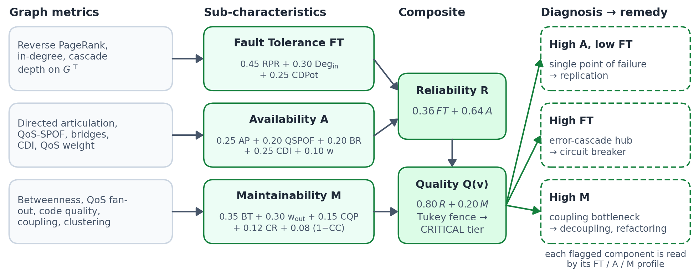

# Software-as-a-Graph: Predicting Cascading-Failure Impact in Publish–Subscribe Systems Before Deployment with QoS-Aware Graphs and Hybrid Learning

**Authors.** Ibrahim Onuralp Yigit, Feza Buzluca

**Affiliation.** Department of Computer Engineering, Istanbul Technical University, 34469 Istanbul, Turkey

**Corresponding author.** Ibrahim Onuralp Yigit — yigiti@itu.edu.tr

---

# Abstract

Publish–subscribe middleware decouples components in space and time, and in doing so hides the paths along which failures cascade. Architects need to know which components are systemically critical before deployment, when no runtime telemetry exists. We present Software-as-a-Graph (SaG), a framework that turns architecture descriptions into typed multigraphs with Quality-of-Service (QoS) weighted dependencies, ranks components by cascading-failure impact, and explains each flagged component with an ISO/IEC 25010 reliability and maintainability profile. SaG provides a training-free closed-form engine, graph-learning engines with 16-dimensional QoS edge encodings, and hybrid engines in which a learned model corrects the closed-form score. Under leave-one-scenario-out cross-validation over twelve synthetic architectures, the QoS-aware representation alone raises closed-form ranking from Spearman $\rho = 0.349$ to $0.553$, on every held-out architecture. Closed-form and learned engines are strongest on different architectures, and neither significantly beats the other alone. The hybrids that combine them are the most accurate engines on held-out architectures ($\rho = 0.657$ and $0.683$) and outperform the closed-form engine on 11 of 12 folds, under decision rules registered before their runs. Trained only on synthetic data, learned engines transfer zero-shot to hand-authored models of five open-source systems at $\rho = 0.760$–$0.805$, against $0.511$–$0.526$ for every training-free score, and roughly double top-$K$ critical-set overlap. Matched controls trace learned accuracy to per-component features, not to typed parameters, message passing or QoS edge encodings; gradient boosting on those features matches the learned engines on held-out architectures. Declaring QoS contracts in architecture models thus makes cascading-failure risk measurable, and explainable, before deployment.

**Keywords:** Graph neural networks; dependability; publish–subscribe; cascading failures; hybrid learning; quality of service; explainable AI

---

# 1. Introduction

## 1.1 Motivation and Problem

Large distributed systems increasingly communicate through asynchronous publish–subscribe (pub-sub) middleware: ROS 2 in autonomous driving [1], Apache Kafka in enterprise event streams [2], DDS in cyber-physical systems [3], MQTT in IoT [4], and cloud-native microservices [5, 6]. Pub-sub decouples producers and consumers in space, time and synchronization [7]. Components interact through topics and brokers rather than direct references, and deployment-time Quality-of-Service (QoS) policies govern reliability, durability, priority and deadlines.

The same decoupling hides how failures spread. Publishers and subscribers share no direct link, so outages, head-of-line blocking and backpressure propagate along concealed paths through brokers, shared topics, colocated hosts and shared libraries [8, 9]. These failures take two forms. In *sequential cascades*, a slow subscriber fills a broker queue and gradually starves its publishers [10]. In *simultaneous blasts*, a shared-library crash or host outage takes down every colocated service at once. Neither architecture diagrams nor static call graphs show these mechanisms. The cheapest time to reduce the risk is before deployment, at design and continuous-integration time [11, 12], when no runtime telemetry exists. Architects therefore need to know, from configuration manifests alone, which components, topics and links are systemically critical and why.

Existing practice leaves this gap open, which we call the **Architecture–Code Gap**: a system can have bug-free code in every service and still be fragile through hidden single points of failure or mismatched QoS contracts [13, 14]. Architecture evaluations such as ATAM rely on manual elicitation [15]. Static code analysis inspects services in isolation [16, 17]. Chaos engineering needs a provisioned cluster [18]. Homogeneous centrality flattens typed topologies into untyped graphs [19, 20]. Learned models could combine these structural cues, but on their own they produce risk scores without actionable explanations. What is missing is a representation that makes pub-sub failure paths explicit, and evidence on which analyzer to trust on it.

## 1.2 The Software-as-a-Graph (SaG) Approach

**Software-as-a-Graph (SaG)** is a pre-deployment static system analysis framework for event-driven architectures (Figure 1). It (1) models an architecture as a typed, directed multigraph over Applications, Brokers, Topics, Execution Hosts and Shared Libraries (§3.1); (2) derives a QoS-weighted `DEPENDS_ON` projection that captures both sequential cascades and simultaneous blasts (§3.2); (3) ranks components by predicted cascade impact with a training-free closed-form engine, graph-learning engines, and hybrid engines in which a learned model corrects the closed-form score (§4); and (4) explains flagged components with an ISO/IEC 25010 Reliability–Maintainability (RM) profile (§5). Predictors read only the analysis graph. Ground-truth impact comes from independent simulators that run on the raw structural topology (§4.4). The central thesis is that the representation, not the choice of analyzer, is the decisive investment: once declared QoS contracts are part of the graph, closed-form and learned engines both rank failure impact better, and each engine is the best choice in a distinct deployment context.

## 1.3 Research Questions

-   **RQ1 (Ranking accuracy):** *How accurately do SaG’s closed-form, learned and hybrid engines rank components by cascading-failure impact on unseen architectures, compared with standard structural baselines?*

-   **RQ2 (What learning needs):** *Where does the learned engines’ accuracy come from—relation-specific (typed) parameters, message passing, the QoS edge encoding, or the per-component features SaG extracts—once model capacity and edge-channel width are matched?*

-   **RQ3 (Transfer):** *How well do engines trained on synthetic architectures transfer zero-shot to independently authored models of five open-source systems?*

-   **RQ4 (Cost):** *What does the analysis cost at CI/CD time, which stage dominates, and how does it compare with running the simulation directly?*

The primary contrast, the matched control and both hybrid engines were each registered with a decision rule before their results existed. Supplementary §S24 logs every later change as an amendment and maps these four questions onto the five of the registered analysis plan. The attribution controls of §7.2, which separate message passing and the QoS node features from the edge encoding, were added after the matched control’s result. They are exploratory and are logged as Amendment 7; the feature-only regressor among them was declared in Amendment 3, also post hoc, and first run here.

## 1.4 Contributions

Evaluated under leave-one-scenario-out (LOSO) cross-validation over twelve synthetic architectures and zero-shot on five open-source system models, this paper contributes:

1.  **A QoS-aware typed architecture model** that derives logical dependencies from physical pub-sub linkages, weights them by declared QoS contracts, and distinguishes sequential cascades from simultaneous blasts (§3). This representation is the largest single gain in the study: ranking on it raises Spearman correlation with simulated cascade impact from $0.349$ (unweighted centrality) to $0.553$, on all twelve held-out architectures ($+0.204$, $p = 0.0005$).

2.  **Complementary closed-form, learned and hybrid engines** (§4). Closed-form and learned engines are strongest on different architectures, and neither significantly outperforms the other alone. Hybrid engines that learn a correction to the closed-form score exploit this complementarity. They are the most accurate engines on held-out architectures ($\rho = 0.657$ and $0.683$; $+0.103$ and $+0.130$ on 11 of 12 folds). Each meets the decision rule registered before its run and remains significant under a Holm correction pooled over all twelve registered contrasts.

3.  **Evidence on what the learned engines need and how far they transfer** (§7). Matched controls show that learned accuracy comes from the per-component features SaG’s analysis computes on the QoS-weighted graph, not from relation-specific weights, message passing or the QoS edge encoding. A gradient-boosted regressor on the same features matches the learned engines ($\rho = 0.642$ against $0.622$–$0.635$), and the untyped attention network’s gain from QoS is carried by three declared-coupling node features ($+0.095$), not by the 16-D edge channel ($-0.023$). Trained only on synthetic data, learned models transfer zero-shot to five open-source system models at $\rho = 0.757$–$0.831$, against $0.511$–$0.526$ for every training-free score, and raise top-$K$ critical-set overlap from $0.248$ to $0.40$–$0.55$.

4.  **A standards-grounded explanation layer** (§5) that attributes each flagged component to ISO/IEC 25010 Availability, Fault Tolerance or Maintainability, and so names the remediation it calls for: replication, circuit breakers or decoupling.

5.  **A reproducible benchmark and cost profile**: seventeen architectures totaling 2,812 components, twelve of which regenerate byte-identically from committed configurations. Every reported table value is mechanically reconciled against released artifacts. Neural inference takes $56\,\text{ms}$ on a 2,000-component architecture, and one structural metric dominates cost (§7.4).

A previous conference paper [21] introduced the preliminary multigraph and deterministic quality model on synthetic topologies. This paper adds the learned and hybrid engines, the QoS edge encoding, LOSO and zero-shot evaluation, the matched control, and the cost profile, and it repositions that quality model as the explanation layer.

§2 reviews related work, §§3–5 present the model, engines and explanation layer, §§6–7 the evaluation, §8 the discussion and threats, and §9 concludes.

# 2. Related Work

## 2.1 Dependability Analysis of Distributed Systems

Runtime approaches to dependability, such as broker clustering, backpressure, autoscaling, failover and chaos engineering [18], require a running cluster, can disrupt service, and consume substantial compute. That compute is itself a concern of green software engineering [22, 23, 24]. Architecture-based reliability prediction has a long history. Cheung’s absorbing Markov chain [25] and the state-, path- and additive models surveyed by Goseva-Popstojanova and Trivedi [26] and Immonen and Niemelä [27] are examples, as are the Palladio Component Model [28], layered queueing networks [29] and the AADL Error Model Annex [30]. These approaches answer broader questions but need operational profiles and failure rates that are unavailable at commit time. SaG asks a narrower question from manifests alone: whose failure reaches furthest in the declared topology?

Telemetry-driven methods diagnose faults in running microservices. Examples are Seer [31] and Sage [32], MicroRCA [33], TraceRCA [34], and GNN-based DeepTraLog [35], Eadro [36] and MicroCause [37] (reviewed in [38]). In synchronous microservices, cascades stem from thread-pool exhaustion, RPC timeouts and retry storms [39]. In pub-sub systems they spread through queue saturation and message starvation. All of these methods need traces or metrics from a live system; SaG works before any code runs. SaG’s question is also that of change impact analysis [40] and of dependency management in microservice fleets [41]. Ranking by impact relates to learning-to-rank defect prediction [42], which optimizes the ranking measure directly, as our listwise loss does (§4.2).

## 2.2 Static Code Analysis and Static System Analysis

Static code analysis (SCA) tools such as SonarQube [16] measure complexity [43], cohesion and coupling [17, 44] within individual services to flag defect-prone modules [45, 46, 47, 48]. SCA cannot see inter-service messaging, broker saturation or cross-host propagation. Architecture recovery tools reconstruct system-level structure from code [49, 50], and HAROS [51] checks ROS systems statically before launch. SaG’s static system analysis (SSA) uses the declared topology instead, propagating code-level metrics across architectural dependencies. This lets teams find structural anti-patterns [52, 53] and architectural technical debt [54] in CI/CD [55, 56].

## 2.3 Quality Models and Multi-Criteria Evaluation

ISO/IEC 25010:2023 [57] and ISO/IEC 25019:2023 [58] define product quality and quality in use. SaG covers the characteristics derivable from deployment topology, namely Availability, Fault Tolerance and the Maintainability sub-characteristics (§5.1), and links internal structural quality to external dependability [59, 60]. Aggregating metrics into an auditable score is a multi-criteria decision problem, for which the Analytic Hierarchy Process (AHP) [61] is standard. AHP’s consistency ratio detects inconsistent judgments but not matrices back-filled from a chosen answer, a distinction this study reports for its weights (Supplementary §S4).

## 2.4 Graph Learning and Explainability

Centrality indices [19, 20, 62, 63] and cascade models of network robustness [10, 8, 9] assume homogeneous, usually undirected graphs. A single untyped score conflates structurally different elements, such as topics, libraries and hosts, and cannot say *why* a component is critical. Learned node-importance methods, including FINDER [64], DrBC [65] and PowerGraph [66], share the homogeneity assumption. Homogeneous GNNs (GCN [67], GraphSAGE [68], GAT [69]) discard relation identity unless it is supplied as a feature. Heterogeneous GNNs (RGCN [70], HAN [71], HGT [72], MAGNN [73]) learn relation-specific transformations. We evaluate both families under matched capacity (§7.2). Khodabandeh et al. [74] apply graph attention to microservice call graphs to predict future interactions. We instead predict the impact of removing a node from a declared topology. GNN explainers such as GNNExplainer [75] and PGExplainer [76] explain models in terms of their internal features. SaG’s explanation layer (§5) instead names ISO/IEC quality sub-characteristics and a remediation class for each flagged component.

# 3. The Software-as-a-Graph (SaG) Architectural Model

Figure 1 presents the end-to-end architecture of the SaG framework. The shared front end processes Architecture-as-Code manifests, constructs a typed multigraph, projects implicit runtime interactions throughout a QoS-weighted logical dependency layer, and extracts typed node properties. These features feed the ranking engines (§4) and, separately and with no shared parameters, the explanation layer (§5).

*Figure 1. End-to-end architecture of the SaG framework. The predictive pathway runs down the centre: manifest ingestion, typed multigraph, QoS-weighted DEPENDS_ON projection with typed node properties, the ranking engines (closed-form, learned and hybrid; Figure 3), and the ranked critical set. The dashed edge marks the ground-truth simulation oracle, which operates only on Gstructural, trains the predictor offline and takes no part in inference. The explanation layer re-enters from the analysis multigraph and shares no parameters with the predictor, reaching flagged components through triage rather than data flow.*

## 3.1 Formal Multigraph Definition

A distributed system is described as a typed, weighted, directed multigraph:

$$\tag{1}
\mathcal{G} = (V, E, \tau_V, \tau_E, w_V, w_E)$$

where:

-   $V = V_{\text{app}} \cup V_{\text{broker}} \cup V_{\text{topic}} \cup V_{\text{host}} \cup V_{\text{lib}}$ holds the five entity types $\mathcal{T}_V$ of Table 1; $V_{\text{host}}$ denotes physical or virtual *Execution Hosts*.

-   $E$ is the set of directed edges, and $\tau_V: V \to \mathcal{T}_V$ and $\tau_E: E \to \mathcal{T}_E$ assign entity and relation types.

-   $w_V: V \to (0, 1]$ and $w_E: E \to (0, 1]$ weight entity criticality and connection strength. For Applications and Libraries, $w_V(v) = 1 - \text{CQP}(v)$, where CQP is a code-quality penalty computed from static code metrics (lines of code, cyclomatic complexity, coupling and cohesion); otherwise $w_V(v) = 1.0$.

**Table 1.** Entity types and structural edge types in the SaG model.

| **Entity Type ($\mathcal{T}_V$)**      | **Architectural Role**                        | **Concrete System Examples**                   |
|:---------------------------------------|:----------------------------------------------|:-----------------------------------------------|
| **Application** ($V_{\text{app}}$)     | Process producing/consuming messages          | ROS 2 node, Kafka microservice, MQTT client    |
| **Broker** ($V_{\text{broker}}$)       | Message routing and queuing intermediary      | RabbitMQ exchange, Mosquitto, EMQX broker      |
| **Topic** ($V_{\text{topic}}$)         | Named logical communication channel           | `/sensor/lidar`, `orders.payment.completed`    |
| **Execution Host** ($V_{\text{host}}$) | Physical or virtualized execution environment | Bare-metal server, Kubernetes worker, Cloud VM |
| **Library** ($V_{\text{lib}}$)         | Shared software package or runtime dependency | Kafka client, OpenCV, Protobuf runtime         |
| **Structural Edge ($\mathcal{T}_E$)**  | **Direction**                                 | **Semantic Meaning**                           |
| `PUBLISHES_TO` / `SUBSCRIBES_TO`       | App/Library $\to$ Topic                       | Component publishes to / consumes from topic   |
| `ROUTES`                               | Broker $\to$ Topic                            | Broker manages and routes topic traffic        |
| `RUNS_ON`                              | App/Broker $\to$ Host                         | Process is hosted on host                      |
| `CONNECTS_TO`                          | Host $\to$ Host                               | Network link between hosts                     |
| `USES`                                 | App $\to$ Library                             | Application links to shared library            |

**Table 2.** Notation used throughout. Entity and edge types: Table 1; simulation oracles: Table 4.

|                         |                                          |                                            |                                                   |
|:------------------------|:-----------------------------------------|:-------------------------------------------|:--------------------------------------------------|
| $G_{\text{structural}}$ | Raw multigraph; oracles only             | $Q(v)$                                     | RM composite quality score                        |
| $G_{\text{analysis}}$   | `DEPENDS_ON` projection; predictor input | $\rho$                                     | Spearman $\rho$, full population                  |
| $V_{\text{app}}$        | Application nodes; the scored population | $\rho_{>0}$                                | Spearman $\rho$, active stratum ($I^* > 0$)       |
| $w(t)$, $w(e)$          | QoS topic weight, edge weight            | Overlap@$K$                                | Top-$K$ set overlap, $K = 0.20\,|V_{\text{app}}|$ |
| $I^*(v)$                | Primary cascade-reachability oracle      | $I_{\text{comp}}$, $I_{\text{dyn}}$, $I_M$ | Further oracles (Table 4)                         |

## 3.2 QoS-Aware Weights and Logical Dependency Derivation

A link’s strength depends on its QoS contract: a `RELIABLE` topic with `TRANSIENT_LOCAL` durability couples services more strongly than a `BEST_EFFORT` telemetry stream. Each topic $t$ therefore carries a weight $w(t) \in (0, 1]$ combining its declared QoS with payload size and publication frequency:

$$\tag{2}
w(t) = \alpha_{\text{top}} \cdot \text{QoS}(t) + \beta_{\text{top}} \cdot \text{SizeNorm}(t) + \gamma_{\text{top}} \cdot \text{FreqNorm}(t),
\quad (\alpha_{\text{top}},\, \beta_{\text{top}},\, \gamma_{\text{top}}) = (0.75,\, 0.15,\, 0.10)$$ where the QoS term is an AHP-weighted aggregate of the declared contract:

$$\tag{3}
\text{QoS}(t) = w_{\text{rel}} \cdot q_{\text{rel}} + w_{\text{dur}} \cdot q_{\text{dur}} + w_{\text{prio}} \cdot q_{\text{prio}},
\quad (w_{\text{rel}}, w_{\text{dur}}, w_{\text{prio}}) = (0.24,\, 0.62,\, 0.14)$$

Here $q_{\text{rel}} \in \{0, 1\}$ (best-effort, reliable), $q_{\text{dur}} \in \{0, 0.5, 1\}$ (volatile, transient-local, persistent) and $q_{\text{prio}} \in \{0, 0.5, 1\}$ (low, medium, high). Durability carries the highest weight because it determines whether state and message history survive restarts. The sub-weights come from a Saaty pairwise matrix with genuine second-eigenvalue spread and $CR = 0.016$ (Supplementary §S4). Size and frequency are log-compressed and clamped:

$$\tag{4}
\text{SizeNorm}(t) = \min\left(1.0, \frac{\log_2(1 + B(t))}{20}\right), \quad
\text{FreqNorm}(t) = \min\left(1.0, \frac{\log_{10}(1 + F(t))}{3}\right)$$

where $B(t)$ is the payload in bytes (design envelope 1 MiB, the practical DDS sample limit) and $F(t)$ the publication frequency in Hz. $w(t)$ is clamped to $[0.01, 1]$ so that best-effort edges remain visible, and every `PUBLISHES_TO`, `SUBSCRIBES_TO` and `ROUTES` edge of $t$ carries $w_E(e) = w(t)$ and the topic’s QoS vector. The $(\alpha_{\text{top}}, \beta_{\text{top}}, \gamma_{\text{top}})$ split is a documented choice rather than a sensitive parameter: no point of its simplex changes any reported ordering (Supplementary §S1).

### Logical Dependency Projection (`DEPENDS_ON`)

Structural edges do not capture implicit runtime dependencies: a subscriber depends on a publisher, yet no edge joins them. SaG therefore derives one semantic relation, `DEPENDS_ON`, directed from *dependent* to *dependency* (“if the target fails, the source is impacted”), by the six rules of Table 3. Its weight $w \in (0, 1]$ expresses how likely a disruption of the dependency is to reach the dependent.

**Table 3.** The six `DEPENDS_ON` logical dependency projection rules.

| **Rule** | **Dependency Category** | **Structural Pattern ($\text{Dependent} \to \text{Dependency}$)**                    | **Derived Weight ($w$)**                                                                    |
|:--------:|:------------------------|:-------------------------------------------------------------------------------------|:--------------------------------------------------------------------------------------------|
|  **1**   | `app_to_app`            | Subscriber $\to$ Publisher (via shared Topic, incl. transitive `USES`)               | $1 - \prod_{t \in T}(1 - w(t))$                                                             |
|  **2**   | `app_to_broker`         | Publisher/Subscriber $\to$ Broker routing its topics                                 | $1 - \prod_{t \in T}(1 - w(t))$                                                             |
|  **3**   | `host_to_host`          | Host $\to$ Host (lifted from inter-host app dependencies)                            | $\max_{u \in \text{hosted}(h_1), v \in \text{hosted}(h_2)} w_{\text{DEPENDS\_ON}}(u \to v)$ |
|  **4**   | `host_to_broker`        | Host $\to$ Broker (lifted from hosted app dependencies)                              | $\max_{u \in \text{hosted}(h)} w_{\text{DEPENDS\_ON}}(u \to b)$                             |
|  **5**   | `app_to_lib`            | Application $\to$ Shared Library it `USES`                                           | $H(w_V(\text{app}), w_V(\text{lib}))$                                                       |
|  **6**   | `broker_to_broker`      | Broker $\leftrightarrow$ Broker (shared physical fault-domain colocation, symmetric) | $w_V(\text{host})$                                                                          |

Rules 1 and 2 combine the topics $T$ joining a pair by probabilistic union rather than maximum [77, 78, 79], so parallel failure paths always increase coupling. Rule 5 uses the harmonic mean $H(x, y) = 2xy/(x+y)$ [80], and Rules 3 and 4 lift dependencies to hosts by maximum.

**Sequential cascades and simultaneous blasts.** Rule 1 captures sequential cascades, in which a failed publisher starves subscribers through queues and topic buffers. Rule 5 captures simultaneous blasts, in which a crashed library or host takes down every consumer at once. Untyped graphs collapse the two into indistinguishable edges. Rule 6, the only symmetric rule, joins brokers colocated on a host, which share its failure domain. Figure 2 shows both mechanisms on a seven-entity example.

*Figure 2. Running example. (a) Three applications share topic t (routed by broker b) and library ℓ, and all run on host n. No structural edge joins two applications. (b) The derived DEPENDS_ON edges make the hidden dependencies explicit: the subscribers a2, a3 depend on the publisher a1 (Rule 1, a sequential cascade through the topic), every application depends on ℓ (Rule 5, a simultaneous blast if ℓ fails), and each application depends on the broker routing its topic (Rule 2). Simulation oracles run on view (a) only; predictors read view (b).*

## 3.3 Dual Graph Views

The **structural graph** $G_{\text{structural}}$ is the raw deployment topology. The **analysis graph** $G_{\text{analysis}}$ adds the derived, QoS-weighted `DEPENDS_ON` edges and the code metrics (Figure 2). All predictor features are computed on $G_{\text{analysis}}$, while simulation oracles run only on $G_{\text{structural}}$ (§4.4); Rule 6 therefore cannot influence any label.

## 3.4 Typed Node Feature Encoding

Both the predictive pathway (§4) and the explanation layer (§5) read the same typed node properties from $G_{\text{analysis}}$: the predictor projects them per entity type before message passing, the explanation layer aggregates them into a quality profile. All five entity types share a deterministic 18-dimensional base block of topological metrics, each normalized to $[0, 1]$ within its graph so that raw graph size does not drive cross-scenario transfer. The block comprises PageRank and Reverse PageRank; betweenness, closeness and eigenvector centrality; in- and out-degree; clustering; articulation and bridge scores; the node QoS weight and QoS-weighted in- and out-degree; multi-path coupling; path complexity; fan-out criticality; and the Connectivity Degradation Index (CDI), which removes each node and measures the resulting connectivity loss (full schema: Supplementary §S11). Type-specific blocks extend the vector to 19–25 dimensions: code metrics and CQP for Applications, reverse-`USES` blast radius for Libraries, queue capacity for Brokers, publisher/subscriber counts and QoS criticality for Topics, and CPU and memory for Hosts. PageRank, Reverse PageRank, betweenness and eigenvector centrality are computed on the QoS-weighted projection. They therefore carry QoS information into every predictor, including the “QoS-off” arms, which lack only the explicit QoS edge channel and QoS node columns. Because these topological summaries are available to any scorer, closed-form engines are genuine competitors rather than strawmen. CDI, at $O(|V|^2 + |V||E|)$, dominates analysis cost (§7.4).

# 4. Ranking Engines and Ground Truth

SaG ranks components with three kinds of engine. The **closed-form engine** `Topo-QoS` is QoS-weighted betweenness on the dependency projection (§6.2). The **learned engines** are graph neural networks trained on the typed multigraph (this section); only the typed engine propagates information into the Application nodes it scores (§6.2). The **hybrid engines** are learned engines that correct the closed-form score (§7.1.1). All are trained or scored against simulation oracles that run on a separate graph view (§§4.3–4.4). Figure 3 shows how the three engines relate and how they are evaluated. Full hyperparameters and training commands are on the experiment pages of the replication repository (§6.1).

*Figure 3. (a) SaG’s three ranking engines read the same analysis graph. The closed-form engine scores QoS-weighted betweenness p(v); the learned engine outputs a logit z(v). A hybrid engine gives the learned engine p(v) as an extra input feature and adds a learned correction to it on the logit scale, σ(z + α logit p), with one learnable scalar α. (b) Ground truth comes from simulation oracles on the structural graph, which no predictor reads. Engines are evaluated by leave-one-scenario-out cross-validation over twelve synthetic architectures (each row trains on eleven and tests on the held-out one) and zero-shot on five open-source system models.*

## 4.1 Heterogeneous Graph Transformer

The learned engine `HGT-QoS` is a three-layer Heterogeneous Graph Transformer (HGT) [72] in PyTorch Geometric [81], with hidden dimension $D = 64$ and $H = 4$ heads. Entity-specific projections map raw features $x_v \in \mathbb{R}^{19\text{--}25}$ (§3.4) into the hidden space, $h_v^{(0)} = \text{LayerNorm}(\text{GELU}(W_{\tau(v)} x_v))$. For each meta-relation $\langle \tau(u), \phi(e), \tau(v)\rangle$, attention uses type-parameterized keys $K(u) = h_u W_K^{\tau(u)}$, queries $Q(v) = \tilde{h}_v W_Q^{\tau(v)}$ and values $V(u) = h_u W_V^{\tau(u)}$, scaled by a learned per-meta-relation prior $\mu_{\langle \tau(u), \phi(e), \tau(v)\rangle}$. That prior is the relation-typing mechanism that RQ2 tests. Message passing runs over both $G_{\text{analysis}}$ and its transpose, to capture downstream starvation and upstream backpressure, with residual connections, dropout $0.10$ and layer normalization.

### 4.1.1 QoS Edge Encoding (16-D)

Each directed edge carries a vector $e_{uv} \in \mathbb{R}^{16}$. Index 0 is the coupling weight $w_E(e)$ (§3.2), index 1 the normalized count of simple paths through $e$, indices 2–8 a one-hot of the seven relation types, and indices 9–15 the middleware QoS parameters on `PUBLISHES_TO`/`SUBSCRIBES_TO` edges, zero elsewhere. Six QoS dimensions are active in our corpus: reliability, durability, priority, a flag for edges whose QoS departs from the scenario’s modal profile, and a deadline pair (active flag and log-deadline, populated on $463$ of $615$ topics). A seventh, max-blocking time, is reserved for hard real-time profiles and is zero throughout. The encoding is projected and added to the target representation before attention, $\tilde{h}_v = h_v + W_{\text{edge}} e_{uv}$.

## 4.2 Prediction Head and Training Objective

A composite head predicts cascade impact, $\hat{I}^*(v) = \sigma(\text{MLP}_C(h_v \parallel \hat{a}_1(v) \parallel \hat{a}_2(v)))$. The two auxiliary heads $\hat{a}_1, \hat{a}_2$ act only as learned feature enrichment: $\hat{a}_1$ is supervised on $I^*$ and $\hat{a}_2$ is unsupervised. The optimized objective combines regression with listwise and pairwise ranking: $$\tag{5}
\mathcal{L} = \text{MSE}(\hat{I}^*, I^*) + 0.5 \cdot \text{MSE}(\hat{a}_1, I^*) + 0.3 \cdot \mathcal{L}_{\text{rank}} + 0.1 \cdot \mathcal{L}_{\text{pairwise}},$$ where $\mathcal{L}_{\text{rank}}$ is ListMLE [82] over the ground-truth permutation $\pi$, $$\tag{6}
\mathcal{L}_{\text{rank}} = -\frac{1}{N}\sum_{i=1}^N \Big( \hat{s}_{\pi_i} - \log \sum_{j=i}^N \exp(\hat{s}_{\pi_j}) \Big),$$ and $\mathcal{L}_{\text{pairwise}}$ is a margin-ranking loss ($\gamma = 0.05$) over pairs whose true impacts differ by more than $\gamma$. A general form with a maintainability term and a consistency term tying the heads to the explanation layer exists but is switched off throughout, so the learned engines and the explanation layer share no parameters (Supplementary §S20).

Models are trained with AdamW ($\eta = 3 \times 10^{-4}$, weight decay $10^{-4}$) under cosine warm restarts for up to 300 epochs, with early stopping at patience 30 on an inner validation split. Five seeds $\{42, 123, 456, 789, 2024\}$ are used throughout. Architectural hyperparameters follow conventional HGT values, and the loss coefficients were set by judgment. Neither was tuned on any evaluation split, so every learned arm is compared untuned.

## 4.3 Ground-Truth Simulation Oracles

Ground truth comes from failure simulations over the raw structural multigraph $G_{\text{structural}}$. Table 4 summarizes the four oracles.

**Table 4.** Simulation oracles, operational constructs, and evaluation roles.

| **Oracle**           | **Physical Mechanism**                         | **Nature**          | **Role in Evaluation**                 |
|:---------------------|:-----------------------------------------------|:--------------------|:---------------------------------------|
| $I^*(v)$             | BFS cascade reachability + QoS ladder          | Seeded tie-breaking | Primary ranking target (RQ1–RQ3)       |
| $I_{\text{comp}}(v)$ | Severity mixture: reachability + fragmentation | Deterministic       | Explanation layer / Validate gate      |
| $I_{\text{dyn}}(v)$  | Discrete-event SimPy message queuing           | Stochastic          | Convergent-validity probe              |
| $I_M(v)$             | Reverse `DEPENDS_ON` traversal                 | Deterministic       | Unsupervised maintainability reference |

**Primary target, $I^*(v)$.** The oracle crashes component $v$, propagates the outage through dependent topics, brokers and links by breadth-first traversal, and returns the mean fractional feed loss over the intact graph’s subscriber population. A topic’s feed loss is the fraction of its publishers that failed. It is scaled by a declared QoS severity ladder ($\times 1.2$ `RELIABLE`, $\times 1.15$ high priority, $\times 1.05$ medium) and clamped to $[0, 1]$. Five seeds break ties in propagation order, and $I^*(v)$ is their mean. It is reproducible from a fixed seed set, as CI gating requires.

**How much QoS is in this label.** The ladder reads reliability and priority only, but that does not bound the label’s QoS content much: disabling QoS scaling entirely leaves the Application ordering nearly intact — mean Spearman $\rho = 0.965$ against the ladder across the twelve folds (range $0.891$–$0.999$) — and substituting a durability-aware $w(t)$ scaling moves it less still ($\rho = 0.977$). The top-$K$ set is the sensitive construct: ladder and topology-only labels agree at mean Jaccard $0.678$, so QoS changes *which* components are named critical rather than their order. $I^*$ is therefore a near-topological target, which bounds what any QoS-encoding result can be credited with (§7.2).

**Further oracles.** $I_{\text{comp}}(v)$ is a severity-weighted mixture of reachability loss, fragmentation, throughput loss and flow disruption, with unswept AHP coefficients $(0.35, 0.25, 0.25, 0.15)$. It labels the explanation layer’s evaluation and is never used for forecasting. $I_{\text{dyn}}(v)$ is a SimPy [83] message-flow simulation of emission rates, stochastic latencies and broker buffer saturation. It returns the drop in delivered message rate to surviving consumers and serves as an independent convergent-validity probe. It agrees with $I^*$ at $\rho = 0.627$, which is substantial but below $I^*$’s own seed-to-seed test–retest of $0.811$–$1.000$, so the two measure related but distinct constructs (Supplementary §S9). $I_M(v)$ is a reverse-dependency traversal kept as a structural maintainability reference; it is never a training label. Topic criticality is a predictor input, so it is masked out of every oracle’s severity term. Results established against one oracle are never transferred to another.

## 4.4 Input–Label Independence Guarantee

Features are built only from $G_{\text{analysis}}$: static topology, code metrics and declared QoS. Labels are computed only on $G_{\text{structural}}$ by the simulation oracles. No simulation output or runtime telemetry is exposed as a predictor input, and a CI test enforces the separation (`tests/test_independence_guarantee.py`). This rules out circular feature construction. It does not make features and labels independent of the topology they both derive from: $I^*(v)$ is a reachability functional of the same architecture. The learning task is therefore to combine pre-computed structural cues into a ranking that matches the simulator, which is why the closed-form engine is a strong reference.

# 5. The Explanation Layer: Standards-Grounded Criticality Attribution

A ranking says where risk is highest, not how to reduce it. A component may be critical because it is an unreplicated single point of failure, an error-propagating cascade hub, or a high-coupling maintainability bottleneck. Each of these calls for a different intervention: replication, circuit breakers, or decoupling. The explanation layer attributes these causes after ranking. It reads the same node properties (§3.4), shares no parameters with the engines, and is not used as a ranker; its ranking correlation is reported for reference in Supplementary §§S30 and S7.

## 5.1 Grounding in ISO/IEC Standards

Following ISO/IEC 25010:2023 [57] and ISO/IEC 25019:2023 [58], criticality is profiled along **Reliability ($R$)**, split into **Fault Tolerance ($FT$)** and **Availability ($A$)**, and **Maintainability ($M$)**. $FT$ captures error-cascade potential and informs circuit breakers and redundancy. $A$ captures structural single points of failure and informs replication. $M$ captures coupling and code-level complexity and informs decoupling and refactoring. Safety and security, which need hazard logs, are out of scope.

## 5.2 Composite Quality Score

Figure 4 summarizes the layer. All metrics are rank-normalized to $[0, 1]$ within the graph and combined with AHP-derived weights [61]:

-   $FT(v) = 0.45 \cdot \text{RPR}(v) + 0.30 \cdot \text{Deg}_{\text{in}}(v) + 0.25 \cdot \text{CDPot}_{\text{enh}}(v)$, over Reverse PageRank, normalized in-degree and normalized cascade depth on $G_{\text{analysis}}^\top$;

-   $A(v) = 0.25 \cdot \text{AP}_c^{\text{dir}}(v) + 0.20 \cdot \text{QSPOF}(v) + 0.20 \cdot \text{BR}(v) + 0.25 \cdot \text{CDI}(v) + 0.10 \cdot w(v)$, over directed articulation severity, QoS-weighted SPOF severity, bridge ratio, the Connectivity Degradation Index and the node QoS weight;

-   $R(v) = r_{\text{FT}} \cdot FT(v) + (1 - r_{\text{FT}}) \cdot A(v)$ with $r_{\text{FT}} = 0.36$;

-   $M(v) = 0.35 \cdot \text{BT}(v) + 0.30 \cdot w_{\text{out}}(v) + 0.15 \cdot \text{CQP}(v) + 0.12 \cdot \text{CouplingRisk}_{\text{enh}}(v) + 0.08 \cdot (1 - \text{CC}(v))$, over betweenness, QoS-weighted efferent coupling, code-quality penalty, coupling risk and clustering.

The composite is $Q(v) = 0.80 \cdot R(v) + 0.20 \cdot M(v)$, and an ISO/IEC 25019 context-of-use vector can reweight $R$ and $M$. Intra-dimension weights are shrunk towards a uniform prior ($\lambda = 0.70$). If $Q(v)$ is used to rank, a fully uniform prior is better ($0.319$ vs. $0.200$; Supplementary §S1). The AHP matrices and their consistency diagnostics are in Supplementary §S4. Components above the Tukey upper fence of $Q$ are flagged CRITICAL (mean $4.2\%$ of components). High $A$ with low $FT$ indicates a single point of failure that needs replication, while high $FT$ indicates a cascade hub that needs circuit breakers (example card: Supplementary §S19).

*Figure 4. The explanation layer. Rank-normalized graph metrics feed the ISO/IEC 25010 sub-characteristics Fault Tolerance, Availability and Maintainability (CR: coupling risk; CC: clustering coefficient), which combine into Reliability and the composite Q(v). A component above the Tukey fence of Q is flagged, and its FT/A/M profile names the remediation class.*

## 5.3 Counterfactual Verification of Remediation

Candidate repairs (broker replication, circuit-breaker insertion, topic decoupling) are generated for flagged components and verified counterfactually in memory. A repair is accepted only if it reduces systemic impact beyond seed noise ($\Delta \bar{I}_{\text{comp}} > \kappa \cdot \sigma_{\text{seed}}$, $\kappa \ge 1$) without introducing new articulation points. Developer studies and patch-synthesis benchmarks are future work.

# 6. Experimental Setup

## 6.1 Corpus and Replication Package

The corpus comprises 2,812 components across seventeen architectures (Table 5). Twelve synthetic topologies form the LOSO folds. They span autonomous vehicles, financial trading, healthcare, industrial SCADA, smart-city IoT, telecom RAN, logistics, gaming, microservices, enterprise integration and air-traffic management. All twelve come from one generator family, as do their code metrics, so LOSO measures transfer across configurations of that generator. Each regenerates byte-identically from a committed configuration, and CI verifies this against a SHA-256 manifest.

**Table 5.** Evaluation corpus. The twelve synthetic topologies are the LOSO folds; the five open-source system models are excluded from all training and used only for zero-shot transfer (§7.3). Counts are read from the committed topology files and verified in CI; per-scenario composition: Supplementary §S13.

| **Dataset**                            | **$|V|$** | **$|V_{\text{app}}|$** | **Topics** | **Brokers** | **Hosts** | **Libs** |  **$|E|$** |
|:---------------------------------------|----------:|-----------------------:|-----------:|------------:|----------:|---------:|-----------:|
| Synthetic evaluation scenarios (11)    |     2,387 |                  1,295 |        588 |          60 |       194 |      250 |     10,657 |
| Synthetic case study — ATM (1)         |        74 |                     26 |         27 |           5 |         8 |        8 |        261 |
| **Synthetic subtotal (12 LOSO folds)** | **2,461** |              **1,321** |    **615** |      **65** |   **202** |  **258** | **10,918** |
| **Open-source system models (5)**      |   **351** |                **141** |    **120** |      **16** |    **32** |   **42** |    **700** |
| **Total**                              | **2,812** |              **1,462** |    **735** |      **81** |   **234** |  **300** | **11,618** |

**The five open-source systems are hand-authored models.** Autoware.universe (ROS 2), EdgeX Foundry, Home Assistant, and two meshes modelled after Online Boutique and Train-Ticket were each written by one author as typed multigraphs from public documentation (`saag/adapters/realworld_adapter.py`). They are not mechanical extractions. Brokers, QoS profiles, code metrics and host specifications are partly assumed. Two models depart materially from their originals: the Online Boutique model is a 22-application pub-sub mesh with four brokers, whereas the original is about eleven gRPC services with no broker, and the Train-Ticket model represents its service-discovery server as a broker. Neither contains a synchronous call edge. RQ3 therefore tests transfer to independently authored architecture models, not to deployed systems.

**Replication package.** Datasets, harnesses, checkpoints and result artifacts are archived on Zenodo (see Data Availability). The public repository documents each experiment: its protocol, hyperparameters, `make` target, artifacts and the supplementary section holding its extended results (<https://github.com/onuralpyigit/software-as-a-graph/tree/jss-submission-v4/docs/research/jss/experiments>).

## 6.2 Predictors

SaG’s closed-form engine (`Topo-QoS`), learned engines (`HGT-QoS`, `GAT-QoS`) and hybrid engines are compared against unweighted centrality (Topo) and untyped GNNs (Table 6). On a GNN, `-QoS` means the 16-D QoS edge vector (§4.1.1), and `Hybrid-X` is engine X corrected by the closed-form prior. `GAT` and `GAT-QoS` are untyped GATs matched to HGT in parameter budget, and `GAT-QoS` reads the same 16-D edge vector as `HGT-QoS`, so the four learned models form a $2\times2$ over typing (GAT vs. HGT) and the QoS channel. Smaller and projection-based variants that the study also ran are listed in Supplementary §S29. All learned predictors ingest the native typed multigraph under LOSO. In QoS-off arms every edge weight is 1 and the QoS node columns are zeroed, though four centralities still carry QoS (§3.4).

**What each learned engine can see.** Every relation of the native multigraph points away from Applications (to Topics, Nodes and Libraries), and the untyped GATs aggregate along edge direction only. In `GAT`, `GAT-QoS` and Hybrid-GAT an Application therefore receives no messages, and its score is a function of its own feature vector: on the trained checkpoints, deleting every edge leaves every Application prediction unchanged. HGT reaches Applications through its reverse-direction pass, so an Application’s prediction depends on $35$–$59\%$ of its graph; without that pass, as in the registered directionality control `HGT-QoS-U`, HGT scores Applications per node as well. We report the untyped arms as registered and use this property as a control (§7.2). Alongside them we report the feature-only control declared in Amendment 3, `GBM-Feat`: gradient boosting (scikit-learn defaults, one model per entity type) on the identical feature tensors, trained on the same graphs and per-graph label transform, with no graph model at all.

**Table 6.** Predictors reported in this paper. `-QoS`: QoS-weighted distances (Topo) or the 16-D QoS edge vector (GNNs); `Hybrid-X`: engine X corrected by the `Topo-QoS` prior. Every predictor run in the study, with the earlier names used by the registered plan and the artifacts: Supplementary §S29.

| **Predictor**                                                        | **Evaluation Substrate**                |  **Typing**   |     **Edge Features**      | **Parameters** | **Trained?** | **Empirical Role**                                       |
|:---------------------------------------------------------------------|:----------------------------------------|:-------------:|:--------------------------:|:--------------:|:------------:|:---------------------------------------------------------|
| *Training-free*                                                      |                                         |               |                            |                |              |                                                          |
| **Topo**                                                             | $G_{\text{analysis}}$ (Flow Projection) |      No       |            None            |       0        |      No      | Standard centrality baseline                             |
| **Topo-QoS**                                                         | $G_{\text{analysis}}$ (Flow Projection) |      No       |       Scalar $w(e)$        |       0        |      No      | SaG closed-form engine                                   |
| *Learned: typing $\times$ QoS channel at matched parameter budget*   |                                         |               |                            |                |              |                                                          |
| **GAT**                                                              | Native Multigraph                       |  Homogeneous  |            None            |    437,496     |     Yes      | Untyped, no QoS; per-node at Applications                |
| **GAT-QoS**                                                          | Native Multigraph                       |  Homogeneous  |      16-D QoS Vector       |    429,992     |     Yes      | Untyped SaG learned engine; per-node at Applications     |
| **HGT**                                                              | Native Multigraph                       | Heterogeneous | Relation 1-hot; $w(e){=}1$ |    434,620     |     Yes      | Typed, no QoS channel                                    |
| **HGT-QoS**                                                          | Native Multigraph                       | Heterogeneous |      16-D QoS Vector       |    434,620     |     Yes      | Typed SaG learned engine                                 |
| *Hybrid engines: a learned engine corrected by the `Topo-QoS` prior* |                                         |               |                            |                |              |                                                          |
| **Hybrid-HGT**                                                       | Native Multigraph                       | Heterogeneous |      16-D QoS Vector       |    434,941     |     Yes      | `HGT-QoS` + prior                                        |
| **Hybrid-GAT**                                                       | Native Multigraph                       |  Homogeneous  |      16-D QoS Vector       |    431,433     |     Yes      | `GAT-QoS` + prior                                        |
| *Attribution and directionality controls (§7.2)*                     |                                         |               |                            |                |              |                                                          |
| **GBM-Feat**                                                         | Node features only                      |   Per type    |            None            | 100 trees/type |     Yes      | Feature-only control (Amendment 3)                       |
| **GBM-Feat-QoS**                                                     | Node features only                      |   Per type    |            None            | 100 trees/type |     Yes      | `GBM-Feat` + QoS node columns                            |
| **GAT-QoS-nf**                                                       | Native Multigraph                       |  Homogeneous  |      16-D QoS Vector       |    429,992     |     Yes      | `GAT-QoS` without QoS node columns                       |
| **HGT-QoS-U**                                                        | Native Multigraph                       | Heterogeneous |      16-D QoS Vector       |    330,895     |     Yes      | `HGT-QoS` without reverse pass; per-node at Applications |

**Closed-form scores.** Topo and `Topo-QoS` are computed on the Application–Library `DEPENDS_ON` projection (Rules 1 and 5), because on the raw multigraph messages route through topics and brokers and Application betweenness vanishes: $$\text{Topo}(v) = 0.6 \cdot \text{BT}(v) + 0.4 \cdot \text{AP}(v),
\qquad
\text{Topo-QoS}(v) = 0.6 \cdot \text{BT}_{w}(v) + 0.4 \cdot \text{AP}(v),$$ where BT is normalized betweenness, $\text{BT}_{w}$ is betweenness over edge distances $d(e) = 1/(w(e) + 10^{-6})$, so strongly coupled edges attract shortest paths, and AP flags articulation points. In the evaluated implementation the articulation term reads zero for every node, so the reported scores rank exactly as betweenness and QoS-weighted betweenness. Restoring it lowers both (Supplementary §S22), so the evaluated form is the stronger reference and is kept as registered. The whole `Topo-QoS` gain over Topo therefore comes from QoS weighting of shortest paths. No predictor reads $G_{\text{structural}}$ (§4.4).

## 6.3 Metrics, Protocols and Statistics

**Population.** Every predictor in a table is scored on the same node population, the Application set $V_{\text{app}}$. Pooling entity types conflates distinct base rates. Against $I_{\text{comp}}$, RM correlates at $\rho = 0.597$ on Applications but only $0.217$ pooled over all types (Supplementary §S6).

**Metrics.** Ranking is measured by Spearman $\rho$ against $I^*(v)$. Critical-set identification is measured by Overlap@$K$, the fraction of the true top-$K$ recovered by the predicted top-$K$ with $K = \text{round}(0.20\,|V_{\text{app}}|)$, at which top-$K$ precision, recall and $F_1$ coincide. PR-AUC, $F_1@\tau$ and nDCG@10 are reported in Supplementary §S15.

**Protocols.** Under *LOSO*, models train on eleven scenarios and are tested zero-shot on the twelfth, over all 12 folds and five seeds, with equal 3-layer depth and inner-split early stopping. Under *zero-shot transfer*, models trained on all twelve scenarios are evaluated without fine-tuning on the five system models. In-distribution node-split results are in Supplementary §S17.

**Statistics.** We use paired Wilcoxon signed-rank tests [84] and bootstrap 95% CIs ($B = 2{,}000$) over folds [85, 86]; with 12 folds, the smallest attainable two-sided $p$ is $0.00049$. Folds share ten of eleven training scenarios, so the tests are anti-conservative [87], and we read all $p$-values as nominal.

**Registered analysis plan.** Before the twelve-fold harness produced any result, we registered the primary contrast, `HGT-QoS` vs. `Topo-QoS`, together with `HGT` vs. `Topo-QoS` and Holm correction across the two. We call it *registered* rather than pre-registered, because the plan is a file in our repository with no third-party timestamp. Three amendments registered further contrasts, each before its run and each Holm-corrected within its own family: the matched $2\times2$ (Amendment 2), Hybrid-HGT (Amendment 5) and Hybrid-GAT (Amendment 6). Every other contrast is exploratory, including the attribution controls of §7.2 (Amendment 7, written after their results). Because the sequence was adaptive (Amendment 6 followed Amendment 2’s result), we also pool all twelve registered contrasts under one Holm correction (`reproduce/omnibus_holm.py`). Both hybrid primaries remain significant (Hybrid-GAT $p_{\text{omni}} = 0.018$, Hybrid-HGT $p_{\text{omni}} = 0.038$), and no other registered contrast reaches $\alpha = 0.05$ ($p_{\text{omni}} \ge 0.42$). Supplementary §S24 lists all seven amendments with dates and outcomes.

# 7. Results

All results are reported on the Application population ($V_{\text{app}}$) against the primary oracle $I^*(v)$, under the input–label independence guarantee (§4.4). Per-fold results, secondary strata and extended protocol notes are in the Supplementary Material and the experiment pages of the replication repository (§6.1). Figure 5 summarizes the three main findings.

*Figure 5. Main results at a glance, Application population. (A) Mean Spearman ρ with 95% bootstrap intervals under LOSO (filled circles; CPU sweeps of Table 7) and zero-shot on the five system models (open diamonds). The hybrids lead on unseen synthetic architectures; the pure learned engines transfer best. (B) Per held-out fold, the gain of HGT-QoS and of Hybrid-HGT over Topo-QoS; the arrow shows what the closed-form prior changes. It removes the learned engine’s losses where the closed-form engine is strongest (Enterprise, Telecom RAN) and trims its largest gains where it is weakest. (C) Cell means of the capacity- and channel-matched 2 × 2 (Table 8): QoS inputs raise both models by about 0.07, a gain §7.2 traces to three node features rather than the edge channel, while the typed and untyped lines stay together.*

## 7.1 RQ1: SaG’s Engines Against Structural Baselines

#### Summary

*SaG’s QoS-weighted closed-form engine (`Topo-QoS`, $\rho = 0.553$) outperforms unweighted centrality ($\rho = 0.349$) on all twelve held-out architectures ($+0.204$, $p = 0.0005$). On their own, the learned engines are statistically on par with it (`HGT-QoS` $0.622$, `GAT-QoS` $0.635$). The hybrid engines, in which a learned engine corrects the closed-form score, significantly outperform it ($+0.103$ and $+0.130$, each on 11/12 folds, Holm $p \le 0.0068$).*

Each of the twelve folds holds out one scenario and trains on the remaining eleven, and every predictor is scored on the same Application node set (26 to 300 nodes, $K$ between 5 and 60). Table 7 reports SaG’s six engines and baselines from one family of CPU runs, in which the shared comparator rows are bit-identical.

**Table 7.** Main results. SaG’s engines against the structural baselines under LOSO (twelve synthetic architectures, five seeds, Application population, CPU runs) and zero-shot on the five open-source system models (protocol of Table 10). $\Delta\rho$ is paired by fold against the registered comparator `Topo-QoS`, with a bootstrap 95% CI ($B = 2{,}000$) and a two-sided Wilcoxon test. $p_{\text{Holm}}$ is given for the hybrids, within each one’s registered family (vs. `Topo-QoS` and vs. its own learned engine). The registered GPU sweep of `HGT-QoS`: Supplementary §S30. Per-fold values: Supplementary §S23.

|                |                                          |                                           |           |                             |                 |                            |            |
|:---------------|:----------------------------------------:|:-----------------------------------------:|:---------:|:---------------------------:|:---------------:|:--------------------------:|:----------:|
|                | **LOSO, twelve synthetic architectures** |                                           |           |                             |                 |   **Five system models**   |            |
| **Predictor**  |        **Mean $\rho$ [95% CI]**        | **$\Delta\rho$ vs `Topo-QoS` [95% CI]** |  **Won**  | **$p$ ($p_{\text{Holm}}$)** | **Overlap@$K$** |   **$\rho$ [95% CI]**    | **PR-AUC** |
| **Topo**       |          0.349 $[0.254, 0.452]$          |        $-0.204$ $[-0.286, -0.122]$        |   0/12    |           0.0005            |      0.366      |   0.511 $[0.346, 0.703]$   |   0.474    |
| **Topo-QoS**   |          0.553 $[0.443, 0.657]$          |                     —                     |     —     |              —              |      0.388      |   0.526 $[0.357, 0.699]$   |   0.474    |
| **HGT-QoS**    |          0.622 $[0.547, 0.690]$          |        $+0.069$ $[-0.046, +0.174]$        |   8/12    |            0.266            |      0.426      |   0.760 $[0.714, 0.819]$   |   0.713    |
| **GAT-QoS**    |          0.635 $[0.567, 0.696]$          |        $+0.082$ $[-0.046, +0.201]$        |   7/12    |            0.233            |      0.438      | **0.805** $[0.759, 0.868]$ | **0.790**  |
| **Hybrid-HGT** |          0.657 $[0.572, 0.733]$          |        $+0.103$ $[+0.055, +0.152]$        |   11/12   |       0.0034 (0.0068)       |      0.435      |   0.695 $[0.643, 0.730]$   |   0.602    |
| **Hybrid-GAT** |        **0.683** $[0.603, 0.753]$        |   $\mathbf{+0.130}$ $[+0.075, +0.190]$    | **11/12** |   **0.0015** (**0.0029**)   |    **0.450**    |   0.662 $[0.597, 0.727]$   |   0.600    |

**The QoS-aware projection is the largest single gain.** Re-weighting shortest paths by declared QoS contracts lifts closed-form ranking from $\rho = 0.349$ to $0.553$ on every held-out architecture. Every learned model reads centralities computed on the same QoS-weighted projection (§3.4), and a regressor on those per-component features alone reaches $\rho = 0.642$ (§7.2), so the representation carries much of the signal the learned engines use.

**On their own, learned engines are on par with the closed-form engine.** `HGT-QoS` ($+0.069$, $p = 0.266$) and `GAT-QoS` ($+0.082$, $p = 0.233$) lead `Topo-QoS` numerically, with intervals spanning zero. The registered confirmatory contrast, run on the GPU sweep the plan specified, agrees ($+0.085$, $p = 0.151$, Holm $0.303$; Supplementary §S30).

**Both hybrids significantly outperform the closed-form engine.** Hybrid-HGT reaches $\rho = 0.657$ ($+0.103$, Holm $p = 0.0068$) and Hybrid-GAT reaches $\rho = 0.683$ ($+0.130$, CI $[+0.075, +0.190]$, Holm $p = 0.0029$), each on 11 of 12 folds. Each meets the decision rule registered before its run. Both remain significant under one Holm correction pooled over all twelve registered contrasts of the study ($p_{\text{omni}} = 0.038$ and $0.018$; §6.3). They are the only models in this study that significantly beat closed-form ranking: the feature-only regressor of §7.2 does not ($+0.089$, $p = 0.176$). Among the engines of Table 7, Hybrid-GAT has the highest Overlap@$K$ ($0.450$); the feature-only regressors reach $0.455$–$0.471$.

**Why the hybrids work: the engines are complementary.** `HGT-QoS` loses to `Topo-QoS` on four folds, all where the closed-form engine is strongest: Real-Time Gaming, Enterprise ($0.426$ vs. $0.795$), AV System and Telecom RAN ($0.427$ vs. $0.576$). Its largest gains come where the closed-form engine is weakest: Healthcare, IoT Smart City, ATM and Microservices, $+0.210$ to $+0.362$ (Figure 5B). The prior removes the failure mode: on Enterprise, Hybrid-HGT and Hybrid-GAT reach $0.735$ and $0.768$, and Telecom RAN turns from a loss into a win for both. The cost is a smaller gain on the weakest folds.

**Anchoring trades transfer for in-distribution accuracy.** On the five independently authored system models, both hybrids stay well above every training-free score ($0.695$ and $0.662$ vs. $0.511$–$0.526$) but below the pure learned engines ($0.760$ and $0.805$; §7.3). By the rule registered in Amendment 6, Hybrid-GAT therefore does not replace Hybrid-HGT as the recommended hybrid ($0.662 < 0.695$).

**Label noise and inert components.** Re-running the oracle across five seeds gives a test–retest rank correlation of $0.811$–$1.000$ (median $0.982$), well above every engine’s mean $\rho$. Between $21\%$ and $52\%$ of each held-out population carries zero simulated impact. In the registered sweep, restricting evaluation to components with positive impact halves every predictor’s correlation, learned or not, and leaves the method ordering unchanged (Supplementary §S25).

### 7.1.1 How the Hybrids Are Built

Each hybrid gives a learned engine the rank-normalized `Topo-QoS` score as one extra input per Application and Library, and adds a learned correction to that score on the logit scale, $\hat{I}^*(v) = \sigma\big(z(v) + \alpha\,\operatorname{logit}(p(v))\big)$, with one learnable $\alpha$ (Figure 3a). Everything else matches the underlying engine. Hybrid-HGT is built on `HGT-QoS` (Amendment 5; $321$ extra parameters) and Hybrid-GAT on `GAT-QoS` (Amendment 6; $1{,}441$ extra parameters). Each was registered with its contrasts and decision rule before any run, with no setting tuned, and evaluated in its own CPU sweep with its comparators re-run in the same invocation.

## 7.2 RQ2: What Learned Engines Need

#### Summary

*At matched capacity, relation-specific weights add nothing (typing main effect $-0.014$), and neither does message passing: a gradient-boosted regressor that reads the same per-component features and has no graph model matches the learned engines ($\rho = 0.642$, against $0.635$ for `GAT-QoS` and $0.622$ for `HGT-QoS`). The untyped engine’s QoS gain ($+0.072$) is carried by three declared-coupling node features ($+0.095$, 11 of 12 folds), not by the 16-D edge channel ($-0.023$). The registered directionality control confirms it for the typed engine: without its reverse pass, HGT receives no messages at Applications and loses nothing ($\rho = 0.632$ against $0.622$, $p = 0.91$).*

A first comparison against small untyped GATs ($28{,}168$ parameters against HGT’s $434{,}620$, reading at most a scalar edge weight) credited typing with a large gain ($+0.234$ without QoS). That gain is an effect of capacity and channel width (Supplementary §§S26 and S30), and the control registered in Amendment 2 removes both differences. `GAT` and `GAT-QoS` are untyped GATs at HGT’s parameter budget ($437{,}496$ and $429{,}992$), and `GAT-QoS` reads the same 16-D edge vector as `HGT-QoS`, including the relation one-hot. All four matched arms ran in one CPU sweep, and the decision rule was fixed before any control result existed (Table 8).

**Table 8.** The $2\times2$ with capacity and edge-channel width matched (Amendment 2): `GAT` ($\neg$T$\neg$Q, $437{,}496$ parameters), `HGT` (T$\neg$Q, $434{,}620$), `GAT-QoS` ($\neg$TQ, $429{,}992$), `HGT-QoS` (TQ, $434{,}620$). One CPU sweep, twelve LOSO folds, five seeds, Application population. Holm correction across the three orthogonal quantities; simple effects are descriptive. Cell means: $0.563$, $0.548$, $0.635$, $0.622$. The Q factor switches the 16-D edge channel and the three QoS node columns together; Table 9 separates them.

| **Quantity**                                                     | **Contrast**              |  **$\Delta\rho$** |     **95% CI**     | **Won** | **$W$** | **$p$** | **$p_{\text{Holm}}$** |
|:-----------------------------------------------------------------|:--------------------------|------------------:|:------------------:|:-------:|:-------:|:-------:|:----------------------|
| *Three orthogonal quantities, Holm-corrected across these three* |                           |                   |                    |         |         |         |                       |
| **Typing (main effect)**                                         | averaged over Q           |          $-0.014$ | $[-0.052, +0.023]$ |  4/12   |  29.0   |  0.470  | 0.940                 |
| **QoS inputs (main effect)**                                     | averaged over T           | $\mathbf{+0.073}$ | $[+0.013, +0.120]$ |  10/12  |  13.0   |  0.043  | 0.127                 |
| **Typing $\times$ QoS interaction**                              | difference of differences |          $+0.001$ | $[-0.050, +0.042]$ |  6/12   |  34.0   |  0.733  | 0.940                 |
| *Simple effects — descriptive, not separately corrected*         |                           |                   |                    |         |         |         |                       |
| **Typing, QoS absent**                                           | HGT vs. GAT               |          $-0.015$ | $[-0.064, +0.033]$ |  5/12   |  31.0   |  0.569  | —                     |
| **Typing, QoS present**                                          | HGT-QoS vs. GAT-QoS       |          $-0.013$ | $[-0.054, +0.026]$ |  4/12   |  27.0   |  0.380  | —                     |
| **QoS inputs, typing absent**                                    | GAT-QoS vs. GAT           | $\mathbf{+0.072}$ | $[+0.028, +0.109]$ |  10/12  |   9.0   |  0.016  | —                     |
| **QoS inputs, typing present**                                   | HGT-QoS vs. HGT           |          $+0.073$ | $[-0.002, +0.136]$ |  10/12  |  19.0   |  0.129  | —                     |

**Relation-specific weights add nothing once capacity is matched.** `HGT` and `HGT-QoS` are within $0.015$ of their untyped counterparts `GAT` and `GAT-QoS` and win only 4–5 of 12 folds against them. The untyped arms, however, receive no messages at the Applications they score (§6.2). The registered $2\times2$ therefore compares typed message passing with per-component learning, not two message-passing architectures, and Table 9 asks what each of its ingredients contributes.

**Table 9.** Attribution controls (exploratory; Amendment 7). One CPU sweep, twelve LOSO folds, five seeds, Application population, with `GAT` and `GAT-QoS` re-run in the same invocation (bit-identical to Table 8). `GAT-QoS-nf` is `GAT-QoS` reading `GAT`’s node features; each of its inputs is bit-identical to one parent arm. `GBM-Feat`(-`QoS`) is gradient boosting on `GAT`’s (`GAT-QoS`’s) node features. Holm correction across the five contrasts. Cell means: `GBM-Feat` $0.642$, `GBM-Feat-QoS` $0.632$, `GAT-QoS-nf` $0.539$. Per-fold values: Supplementary §S31.

| **Quantity**                             | **Contrast**              |  **$\Delta\rho$** |     **95% CI**     | **Won** | **$W$** | **$p$** | **$p_{\text{Holm}}$** |
|:-----------------------------------------|:--------------------------|------------------:|:------------------:|:-------:|:-------:|:-------:|:----------------------|
| **QoS node columns, edge channel held**  | GAT-QoS vs. GAT-QoS-nf    | $\mathbf{+0.095}$ | $[+0.048, +0.135]$ |  11/12  |   5.0   | 0.0049  | 0.024                 |
| **QoS edge channel, node features held** | GAT-QoS-nf vs. GAT        |          $-0.023$ | $[-0.046, -0.004]$ |  3/12   |  15.0   |  0.064  | 0.192                 |
| **QoS node columns, no graph model**     | GBM-Feat-QoS vs. GBM-Feat |          $-0.010$ | $[-0.028, +0.006]$ |  5/12   |  30.0   |  0.519  | 1.000                 |
| **Neural vs. trees, QoS-off features**   | GAT vs. GBM-Feat          |          $-0.079$ | $[-0.134, -0.028]$ |  1/12   |   7.0   | 0.0093  | 0.037                 |
| **Neural vs. trees, QoS-on features**    | GAT-QoS vs. GBM-Feat-QoS  |          $+0.003$ | $[-0.048, +0.054]$ |  7/12   |  39.0   |  1.000  | 1.000                 |

**The QoS gain is carried by three node features, not the edge channel.** The Q factor of Table 8 switches two inputs together: the 16-D edge vector and three node columns holding each component’s declared coupling weights ($w$, $w_{\text{in}}$, $w_{\text{out}}$; §3.4). Removing the three columns from `GAT-QoS` costs $0.095$ (11 of 12 folds, Holm $p = 0.024$), while adding the edge channel to `GAT` changes nothing ($-0.023$, 3 of 12). The training stabilization the channel appeared to provide follows the same columns: the median within-fold seed spread is $0.010$ for `GAT-QoS`, $0.083$ for `GAT` and $0.136$ for `GAT-QoS-nf`. The architecture explains this: no edge reaches an Application in the untyped engines, so the channel can affect Application scores only indirectly, through weights shared with other entity types during training.

**Message passing adds nothing measurable on this target.** The untyped engines score each Application from its own features, and the typed HGT, which aggregates over $35$–$59\%$ of the graph, does not outperform them. The directionality control registered in Amendment 2, run after Amendment 7, tests this within HGT: removing the reverse pass removes every message into an Application, and `HGT-QoS-U` ($330{,}895$ parameters) reaches $\rho = 0.632$ $[0.570, 0.687]$ against $0.622$ for `HGT-QoS` ($-0.010$ for `HGT-QoS`, 6 of 12 folds, $p = 0.91$; Supplementary §S31). Its median seed spread also falls, from $0.056$ to $0.020$. The feature-only regressor, `GBM-Feat` (declared in Amendment 3), reads the identical feature tensors with no graph model and reaches $\rho = 0.642$ $[0.547, 0.725]$. That is on par with `GAT-QoS` ($+0.003$ for the matched-feature pair) and with `HGT-QoS` ($+0.021$, 7 of 12 folds, paired across sweeps whose shared arms are bit-identical). The three QoS columns do not help the regressor ($-0.010$). The neural model needs them to reach what the trees extract from the QoS-weighted centralities: without them, `GAT` trails `GBM-Feat` on 11 of 12 folds ($-0.079$). The learned engines’ margin over closed-form ranking is therefore the learned combination of SaG’s per-component features, not aggregation over the graph. Only the hybrids, which add the closed-form score to those features, significantly beat closed-form ranking (§7.1).

**How much the target can reward.** $I^*(v)$ is a near-topological target: a topology-only relabeling recovers its ordering at mean $\rho = 0.965$, and QoS acts mainly at its top-$K$ boundary (§4.3). The learned models reach QoS through the QoS-weighted centralities and declared coupling weights among their node features, and on this target the edge encodings contribute nothing measurable. Two things are needed before either the encodings or message passing can be credited with contract semantics: oracles that express deadline misses, durability replay or priority inversion, and a substrate on which messages reach every scored component.

## 7.3 RQ3: Zero-Shot Transfer to Models of Open-Source Systems

#### Summary

*Learned models trained only on synthetic scenarios transfer to independently authored system models: `HGT-QoS` reaches $\rho = 0.760$ $[0.714, 0.819]$, `GAT-QoS` $0.805$ $[0.759, 0.868]$, and plain `GAT`, which reads no QoS input, $0.831$ $[0.788, 0.884]$. Every training-free score stays at $0.511$–$0.526$. The feature-only regressor reaches $0.757$, so most of the transfer margin comes from learning on SaG’s per-component features, not from message passing or QoS inputs. On components that actually propagate failures, the differences remain unresolved at five systems.*

The five systems are hand-authored models of Autoware.universe (ROS 2), EdgeX Foundry and Home Assistant, plus meshes modelled after Online Boutique and Train-Ticket (§6.1). They were written independently of the scenario generator but are models rather than extractions, and they carry labels from the same oracles. The test is therefore transfer to independently authored topologies under simulated reachability. `HGT-QoS`, `GAT-QoS`, `GAT` and `GBM-Feat` were trained on all twelve synthetic scenarios and evaluated zero-shot at the same 3-layer, 300-epoch budget as every other learned result. No system model contributed gradients or checkpoint selection. Where a system declares no QoS manifest, standard middleware defaults (ROS 2 Best-Effort/Reliable, MQTT QoS 0/1) are applied uniformly across all predictors.

**Table 10.** Zero-shot transfer to hand-authored models of five open-source systems: Spearman $\rho$ against $I^*(v)$ on the Application population. Learned engines were trained on all twelve synthetic scenarios (3 layers, 300 epochs; five seeds, $\pm$ = spread over seeds). Training-free scores are deterministic and scored on identical labels and node sets. The last column restricts `HGT-QoS` to components with positive impact. `GBM-Feat`: no graph model (§6.2). All five models are encoded as publish–subscribe graphs; the grouping follows the paradigm of the *original* system. Identification metrics: Supplementary Table S14; bootstrap intervals and the active stratum for every predictor: Supplementary §S27.

| **System model**                                  | **$|V_{\text{app}}|$** | **$n_{>0}$** |  **Topo** | **Topo-QoS** |    **HGT-QoS**    |    **GAT-QoS**    |        **GAT**        |     **GBM-Feat**      | **HGT-QoS $\rho_{>0}$** |
|:--------------------------------------------------|-----------------------:|-------------:|----------:|-------------:|:-----------------:|:-----------------:|:---------------------:|:---------------------:|------------------------:|
| *Originals are publish–subscribe systems*         |                        |              |           |              |                   |                   |                       |                       |                         |
| **Autoware.universe (ROS 2)**                     |                     32 |           19 |     0.307 |        0.378 | 0.716 $\pm$ 0.081 | 0.758 $\pm$ 0.019 | **0.778 $\pm$ 0.023** |   0.698 $\pm$ 0.009   |        $+$0.517 |
| **EdgeX Foundry (Industrial IoT)**                |                     22 |           10 |     0.534 |        0.534 | 0.793 $\pm$ 0.037 | 0.815 $\pm$ 0.055 | **0.853 $\pm$ 0.015** |   0.792 $\pm$ 0.005   |        $+$0.183 |
| **Home Assistant (Smart Home)**                   |                     24 |           17 |     0.297 |        0.289 | 0.864 $\pm$ 0.063 | 0.925 $\pm$ 0.023 | **0.927 $\pm$ 0.024** |   0.736 $\pm$ 0.008   |        $+$0.702 |
| *Originals are RPC systems (modelled as pub-sub)* |                        |              |           |              |                   |                   |                       |                       |                         |
| **Online Boutique (pub-sub model)**               |                     22 |            8 | **0.891** |        0.888 | 0.710 $\pm$ 0.070 | 0.750 $\pm$ 0.119 |   0.810 $\pm$ 0.008   |   0.747 $\pm$ 0.037   |        -0.031 |
| **Train-Ticket Booking Mesh**                     |                     41 |           14 |     0.528 |        0.541 | 0.717 $\pm$ 0.096 | 0.777 $\pm$ 0.007 |   0.786 $\pm$ 0.013   | **0.810 $\pm$ 0.002** |        -0.192 |
| **Mean**                                          |                      — |            — |     0.511 |        0.526 |       0.760       |       0.805       |       **0.831**       |         0.757         |        $+$0.236 |

**Transfer comes from learning on the features, not from typing, QoS inputs or message passing.** Every learned model leads the training-free scores on 4 of 5 systems. Among the learned models, each architectural addition lowers transfer slightly:

-   plain `GAT`, which reads no QoS input and, like every untyped engine, scores Applications from their own features, transfers best ($\rho = 0.831$, Overlap@$K$ $0.548$, PR-AUC $0.811$);

-   adding the edge channel gives $0.821$, and adding the QoS node columns as well (`GAT-QoS`) gives $0.805$;

-   `HGT-QoS`, the only engine that propagates information into Applications, transfers no better than the feature-only regressor ($0.760$ against $0.757$), and without its reverse pass (`HGT-QoS-U`) it transfers at $0.804$, higher on all five systems.

With five systems these orderings are descriptive. The robust finding is the gap to closed-form ranking. Top-$K$ overlap averages $0.40$–$0.55$ for the learned models against $0.248$ for the closed-form scores, and PR-AUC $0.71$–$0.81$ against $0.474$–$0.521$. On EdgeX, symmetric adapter-to-broker stars create betweenness ties that collapse closed-form triage entirely (Overlap@$K = 0.000$).

**Active components.** Restricted to components that propagate failures, `HGT-QoS` keeps a positive mean correlation ($\rho_{>0} = +0.236$) where every training-free score turns negative. The intervals of `HGT-QoS` and of every training-free score span zero at five systems, so this comparison is unresolved. Among the other learned models, plain `GAT` has the highest active-stratum correlation ($\rho_{>0} = +0.377$ $[+0.078, +0.677]$), `GAT-QoS` reaches $+0.319$ $[+0.001, +0.638]$ and the feature-only regressor $+0.156$ $[-0.066, +0.374]$. With five systems these percentile intervals carry no coverage guarantee, and we do not read the untyped engines’ lower bounds as resolving the comparison. $\rho_{>0}$ is positive on the three models of publish–subscribe systems and non-positive on the two modelled after RPC systems. Because both RPC-derived models are encoded as publish–subscribe graphs, this split cannot be attributed to call-tree semantics (§8.3). An earlier, non-blind 2-layer configuration leaves every conclusion unchanged (Supplementary §S29).

## 7.4 RQ4: Analysis Cost

#### Summary

*Neural inference is effectively free ($56\,\text{ms}$ for a 2,000-node architecture, $0.02\%$ of pipeline time). Cost is dominated by deterministic feature extraction, specifically the $O(|V|^2 + |V||E|)$ Connectivity Degradation Index, and it tracks the density of the derived dependency projection. Cold extraction takes $2$–$18\times$ (median $5.6\times$) as long as the in-process cascade simulation, so SaG’s advantage is avoiding staging infrastructure rather than saving CPU time.*

**Table 11.** Per-stage latency of the inference pipeline across graph sizes (CPU, median of 3 runs; 5 for the forward pass). The analysis stage is stable across repeats (p10–p90 within $1\%$ of the median), while the forward pass is dominated by interpreter and dispatch overhead; the 249-node row still carries first-call warm-up.

| **$|V|$** | **$|E|$** | **Analyze (s)** | **Graph $\to$ Tensor (s)** | **HGT Forward (ms)** | **Analyze : Forward** | **Forward p10–p90 (ms)** |
|:---------:|:---------:|:---------------:|:--------------------------:|:--------------------:|:---------------------:|:------------------------:|
|    249    |   1,127   |      1.74       |           0.010            |         26.5         |          66×          |        13.0–34.4         |
|    499    |   2,402   |      8.32       |           0.022            |         16.4         |         509×          |        15.6–16.4         |
|    999    |   6,422   |      44.54      |           0.056            |         21.1         |        2,108×         |        19.1–36.5         |
|   1,998   |  19,301   |     239.34      |           0.157            |         56.2         |      **4,259×**       |        43.8–57.8         |

At 2,000 components the HGT forward pass takes $56\,\text{ms}$ against $239\,\text{s}$ for structural analysis (Table 11). Because the analysis stage produces the node features the forward pass consumes, end-to-end evaluation of an unseen 2,000-component architecture takes about four minutes, of which the learned model is $0.02\%$. The $56\,\text{ms}$ is the marginal cost of re-scoring an already-analysed graph. The dominant term is the Connectivity Degradation Index, computed for every node in the main connected component. That is a correctness requirement: restricting CDI to articulation points leaves it identically zero in redundant multi-publisher topologies and makes $A(v)$ near-constant.

Across the corpus, the complete analysis gate (structural analysis plus 18 anti-pattern detectors) runs in $0.16$–$79.3\,\text{s}$ per scenario. That is $2.0$–$17.7\times$ (median $5.6\times$) the five-seed cascade labeling sweep measured in the same session, and the gate is more expensive on all twelve scenarios. The premium tracks the size of the derived projection rather than component count; Enterprise, with 300 applications on 120 topics, is the maximum (Supplementary §S28). On raw CPU time, direct simulation is therefore faster wherever its parameters are available. SaG additionally scores infrastructure components and dependency edges and avoids staging infrastructure. Training the four learned arms once took $7.7$ CPU-hours, amortized over every later evaluation.

# 8. Discussion, Threats to Validity, and Limitations

## 8.1 Practical Consequences

**The representation carries the signal.** The most robust result is that SaG’s QoS-aware dependency projection makes criticality legible to simple and learned analyzers alike. Closed-form centrality on the projection improves every held-out architecture over its unweighted form ($+0.204$). Every learned model we ran, including one with no graph model, draws its accuracy from per-component features computed on that projection (§7.2). Practitioners therefore gain most from modeling their architecture with typed entities and declared QoS contracts, and which model then reads it matters less. On that representation, closed-form scores and learned models fail on different architectures, so combining them is worth more than choosing between them.

**Choosing an engine.** Table 12 summarizes where each instrument fits. The closed-form engine needs no training and is the natural default for lightweight CI gates. The hybrids are the most accurate choice for architectures resembling the training corpus: they keep the closed-form engine’s strength on dense projections such as Enterprise while adding the learned engines’ gains elsewhere. Hybrid-HGT is the registered recommendation because it transfers better of the two. For substantially different systems, a learned model on SaG’s per-component features transfers best. Relation typing, the QoS edge channel and message passing each failed to improve transfer, so the untyped `GAT` is the simplest neural choice. A gradient-boosted regressor on the same features trains in seconds and reaches most of its accuracy. The explanation layer then names a remediation class for each flagged component.

**Table 12.** How the instruments in the SaG portfolio are best used, given the evidence in §7.

| **Instrument**                    | **Context**                                        | **Role and evidence**                                                                                                                          |
|:----------------------------------|:---------------------------------------------------|:-----------------------------------------------------------------------------------------------------------------------------------------------|
| **`Topo-QoS`** (Closed-form)      | Lightweight CI gates                               | Training-free, $\rho = 0.553$ out of distribution; $+0.204$ over unweighted centrality on 12/12 folds.                                         |
| **Learned model on SaG features** | Substantially different or irregular architectures | Best transfer (`GAT` $0.831$, `GAT-QoS` $0.805$, `HGT-QoS` $0.760$; feature-only regressor $0.757$) and identification (PR-AUC $0.71$–$0.81$). |
| **Hybrid-HGT / Hybrid-GAT**       | Architectures resembling the training corpus       | Best LOSO ranking ($\rho = 0.657$ / $0.683$); significantly above `Topo-QoS` ($+0.103$ / $+0.130$, 11/12 folds).                               |
| **RM explanation layer**          | Refactoring and root-cause discussion              | ISO/IEC 25010 attribution (Availability vs. Fault Tolerance vs. Maintainability).                                                              |

**Where learned engines help.** On this corpus, the learned engines gain most on irregular meshes (Healthcare, IoT Smart City, ATM, Microservices) and on symmetric stars that create betweenness ties for closed-form scores (EdgeX). They lose ground where the closed-form engine is strongest (Enterprise, Real-Time Gaming). The pattern belongs to the features, not to message passing:

-   the per-node `GAT-QoS` and the message-passing `HGT-QoS` rise and fall on the same folds (Spearman $0.71$ across folds);

-   every learned model falls short on Enterprise ($0.407$–$0.533$ against $0.795$);

-   the share of the graph within HGT’s receptive field predicts neither its per-fold accuracy nor its gain over `Topo-QoS` ($|\rho| \le 0.20$ across folds).

Each of these observations rests on one to three folds or systems. The replication repository tabulates them as working hypotheses.

**Computational sustainability.** Pre-deployment analysis avoids provisioning staging clusters for chaos sweeps [22, 24]; we state this as infrastructure avoidance, not a measured energy saving. At base SoC power ($28\,\text{W}$), one pass of the analysis gate over all twelve scenarios costs at most $0.83\,\text{Wh}$, and training the four learned arms once costs about $0.22\,\text{kWh}$, both upper bounds from wall-clock time. Direct RAPL/NVML measurement [23, 88] and incremental caching of structural metrics across commits are the main open levers.

## 8.2 Threats to Validity

**Construct validity.** All labels are simulator-derived rather than observed failures. The behavioral queue-flow oracle agrees with the primary cascade oracle at $\rho = 0.627$ (§4.3); much of that agreement concerns which components are harmless. Because $I^*(v)$ is a reachability functional of the topology the predictors read, a strong closed-form comparator is expected. Retargeting the LOSO contrasts on $I_{\text{dyn}}$ is the next experiment. The five system models are the most judgement-laden input: each was written by one author, no second modeler has re-derived them, and RQ3’s figures hold only for these models. The replication package includes a re-modeling protocol and an agreement tool (`reproduce/model_agreement.py`) so that this check is cheap to run.

**Internal validity.** Predictors consume $G_{\text{analysis}}$ and oracles traverse $G_{\text{structural}}$, which is enforced in CI. Substrate, training set, depth and early stopping are matched across learned arms. All typing conclusions rest on the capacity- and channel-matched control. The untyped arms receive no messages at the Applications they score (§6.2), so that control compares typed message passing with per-component learning, not two message-passing architectures. The attribution controls of §7.2 were added after the matched control’s result. None is registered: the feature-only regressor was declared post hoc in Amendment 3 and first run here, the others in Amendment 7. They are reported as exploratory with their own Holm correction. The feature-only regressor runs at scikit-learn defaults on the same graphs and per-graph label transform as the neural arms. The registered directionality control, `HGT-QoS-U`, removes HGT’s reverse pass and with it every message into an Application. It matches `HGT-QoS` with $103{,}725$ fewer parameters ($p = 0.91$), so directionality does not confound the typing result, and HGT’s message passing contributes nothing measurable. The capacity-only control `GAT-w` registered alongside it was not run. No hyperparameter was tuned on an evaluation split.

**Robustness to free parameters.** Under Morris screening only two of ten declared constants, the AHP shrinkage $\lambda$ and $r_{\text{FT}}$, have appreciable influence ($\mu^* \approx 0.13$ against $\le 0.025$ for the rest), and no setting of the topic-weight or QoS sub-weight constants changes any reported comparison (Supplementary §§S1–S4).

**External validity.** The synthetic corpus comes from one generator family, and the system models are small (22–41 applications). Scaling beyond 2,000 nodes would benefit from incremental caching or mini-batching [89].

**Conclusion validity and repeatability.** LOSO folds share training scenarios, so $p$-values are nominal [87] and are read alongside fold-level sign consistency and bootstrap intervals. At fixed code, seeds and device, every figure reproduces at its reported precision, and all training-free cells also reproduce across devices. Learned cells move across code revisions and devices (up to $0.172$ in a fold mean; `HGT-QoS` $0.041$), so learned figures are reported against the released artifacts, and every comparison is made within one sweep. The drift ledger is in the replication repository (`reproduce/rerun_drift.py`).

## 8.3 Limitations and Future Work

The explanation layer’s attributions have not been evaluated with developers or against injected faults, and no published learned-criticality model (FINDER [64], DrBC [65]) has been reproduced on this corpus. Next steps are: (1) an independent re-model of at least two of the five systems, with inter-modeler agreement reported; (2) combining the hybrids’ in-distribution accuracy with the pure engines’ transfer, for example by learning when to trust the prior; (3) retargeting RQ1 and RQ2 on $I_{\text{dyn}}$; (4) synchronous call edges and a backward-propagating oracle, so that RPC architectures can be modeled natively; (5) extracting system models from deployment manifests; (6) validating rankings against production incident data; and (7) a substrate or architecture on which messages reach every scored component, such as reverse edges for the untyped engines or the Application–Library projection, so that message passing is tested as a mechanism rather than left to edge direction.

# 9. Conclusion

Declared QoS contracts are what make cascading-failure risk in publish–subscribe systems measurable before deployment. SaG turns them into a typed, QoS-weighted architecture graph, and both closed-form and learned engines rank failure impact better on it. On twelve held-out synthetic architectures, the representation alone raises closed-form ranking from $\rho = 0.349$ to $0.553$, on every fold. Closed-form and learned engines prove complementary, each strongest where the other is weakest. Hybrid engines, in which a learned model corrects the closed-form score, are the most accurate in the study ($\rho = 0.657$ and $0.683$). They outperform the closed-form engine on 11 of 12 folds under decision rules registered before their runs, and remain significant under a Holm correction over all twelve registered contrasts. Trained only on synthetic data, learned models transfer zero-shot to independently authored models of five open-source systems ($\rho = 0.757$–$0.831$ against $0.511$–$0.526$) and raise top-$K$ critical-set overlap from $0.248$ to $0.40$–$0.55$. Matched controls show where the learned accuracy comes from: the per-component features SaG extracts from the QoS-weighted graph. Relation-specific parameters, the QoS edge encoding and message passing add nothing measurable on this target, and a gradient-boosted regressor on the same features matches the learned engines.

For practice, the most valuable step is to model the architecture with typed entities and declared QoS contracts. SaG then offers an engine for each context: the training-free closed-form engine for lightweight CI gates, a hybrid engine for architectures resembling the training corpus, and a learned model on SaG’s features for substantially different systems, with neural inference in milliseconds. Its ISO/IEC 25010 layer names the remediation each flagged component calls for. Because the synthetic corpus regenerates byte-identically and every reported value is reconciled against released artifacts, others can extend or challenge these results directly.

Four steps would widen their reach: learning when to trust the closed-form prior, so that one engine combines the hybrids’ in-distribution accuracy with the pure engines’ transfer; retargeting the engines on the behavioral queue-flow oracle and on independent re-models of the five systems; testing message passing on a substrate where it reaches every scored component; and extracting models from deployment manifests, so that rankings can be validated against production incidents.

---

# Declarations

**CRediT Authorship Contribution Statement.** **Ibrahim Onuralp Yigit:** Conceptualization, Methodology, Software, Validation, Formal analysis, Investigation, Data curation, Writing – original draft, Visualization. **Feza Buzluca:** Conceptualization, Methodology, Validation, Writing – review and editing, Supervision. **Declaration of Competing Interest.** The authors declare no competing financial interests or personal relationships that could have influenced this work. **Funding.** This research received no external grant.

**Data Availability.** The replication package (datasets, harnesses, checkpoints, scripts) is available on Zenodo under DOI [10.5281/zenodo.14922108](https://doi.org/10.5281/zenodo.14922108) [90] with `uv`/`pip` environments. The public repository documents every experiment reported here — protocol, hyperparameters, reproduction command, artifacts and extended results — at <https://github.com/onuralpyigit/software-as-a-graph/tree/jss-submission-v4/docs/research/jss/experiments>. Synthetic datasets regenerate byte-identically. The deposit ships all artifacts backing reported tables as a dated bundle (`SaG_JSS_Results_<stamp>`) with a `MANIFEST.json` recording SHA-256 digests, commit hashes, and corpus provenance. Four supplementary artifacts predate provenance stamping and carry no commit or corpus digest: `atm_scale_sweep_v3.json` (S6), `qos_label_ablation.json` (Section <a href="#sec:4.3" data-reference-type="ref" data-reference="sec:4.3">[sec:4.3]</a>), `threshold_sensitivity_v3.json` (S3) and `topic_weight_sensitivity_v3.json` (S1); their correspondence to the corpus is asserted by the bundle rather than recorded in the file. The verification script (`reproduce/reconcile_manuscript.py`) runs standalone against the deposit, mechanically verifying 511 reported figures in the manuscript and supplement against the JSON artifacts.

# Declaration of Generative AI and AI-assisted technologies in the manuscript preparation process

During the preparation of this work the authors used Anthropic’s Claude to assist with typesetting, LaTeX formatting, and the development of analysis and reporting scripts in the replication package. After using this tool the authors reviewed and edited the content as needed and take full responsibility for the content of the published article. The study design, the choice of experiments, the interpretation of results, and all scientific claims are the authors’ own.

---

# References

[1] S. Macenski, T. Foote, B. Gerkey, C. Lalancette, W. Woodall, Robot operating system 2: Design, architecture, and uses in the wild, Science Robotics 7 (66) (2022) eabm6074.

[2] J. Kreps, N. Narkhede, J. Rao, Kafka: A distributed messaging system for log processing, in: Proc. 6th Int. Workshop on Networking Meets Databases (NetDB), 2011.

[3] Object Management Group, Data distribution service (dds), Tech. Rep. formal/2015-04-10, version 1.4, Object Management Group (2015).

[4] OASIS, MQTT version 5.0, OASIS Standard, <https://docs.oasis-open.org/mqtt/mqtt/v5.0/mqtt-v5.0.html> (accessed 9 September 2026) (2019).

[5] N. Dragoni, S. Giallorenzo, A. L. Lafuente, M. Mazzara, F. Montesi, R. Mustafin, L. Safina, Microservices: Yesterday, today, and tomorrow, in: Present and Ulterior Software Engineering, Springer, 2017, pp. 195--216.

[6] S. Newman, Building Microservices: Designing Fine-Grained Systems, O'Reilly Media, 2015.

[7] P. T. Eugster, P. A. Felber, R. Guerraoui, A.-M. Kermarrec, The many faces of publish/subscribe, ACM Computing Surveys 35 (2) (2003) 114--131.

[8] A. E. Motter, Y.-C. Lai, Cascade-based attacks on complex networks, Physical Review E 66 (2002) 065102(R).

[9] S. V. Buldyrev, R. Parshani, G. Paul, H. E. Stanley, S. Havlin, Catastrophic cascade of failures in interdependent networks, Nature 464 (2010) 1025--1028.

[10] R. Albert, H. Jeong, A.-L. Barab\'asi, Error and attack tolerance of complex networks, Nature 406 (2000) 378--382.

[11] A. Avizienis, J.-C. Laprie, B. Randell, C. Landwehr, Basic concepts and taxonomy of dependable and secure computing, IEEE Transactions on Dependable and Secure Computing 1 (1) (2004) 11--33.

[12] L. Bass, P. Clements, R. Kazman, Software Architecture in Practice, 3rd Edition, Addison-Wesley, 2012.

[13] D. E. Perry, A. L. Wolf, Foundations for the study of software architecture, ACM SIGSOFT Software Engineering Notes 17 (4) (1992) 40--52.

[14] J. Garcia, D. Popescu, G. Edwards, N. Medvidovic, Identifying architectural bad smells, in: Proc. 13th European Conf. on Software Maintenance and Reengineering (CSMR), 2009, pp. 255--258.

[15] R. Kazman, M. Klein, M. Barbacci, T. Longstaff, H. Lipson, J. Carriere, The architecture tradeoff analysis method, in: Proc. 4th IEEE Int. Conf. on Engineering of Complex Computer Systems (ICECCS), 1998, pp. 68--78.

[16] SonarSource, Clean as you code, SonarQube documentation, <https://docs.sonarsource.com/sonarqube-server/latest/core-concepts/clean-as-you-code/introduction/> (accessed 9 September 2026) (2024).

[17] S. R. Chidamber, C. F. Kemerer, A metrics suite for object oriented design, IEEE Transactions on Software Engineering 20 (6) (1994) 476--493.

[18] A. Basiri, N. Behnam, R. de Rooij, L. Hochstein, L. Kosewski, J. Reynolds, C. Rosenthal, Chaos engineering, IEEE Software 33 (3) (2016) 35--41.

[19] L. C. Freeman, A set of measures of centrality based on betweenness, Sociometry 40 (1) (1977) 35--41.

[20] U. Brandes, A faster algorithm for betweenness centrality, Journal of Mathematical Sociology 25 (2) (2001) 163--177.

[21] I. O. Yigit, F. Buzluca, A graph-based dependency analysis method for identifying critical components in distributed publish--subscribe systems, in: Proc. IEEE Int. Conf. on Recent Advances in Systems Science and Engineering (RASSE), 2025, pp. 1--8. [doi:10.1109/RASSE64831.2025.11315354](https://doi.org/10.1109/RASSE64831.2025.11315354).

[22] C. Calero, M. Piattini (Eds.), Green in Software Engineering, Springer, Cham, Switzerland, 2015. [doi:10.1007/978-3-319-08581-4](https://doi.org/10.1007/978-3-319-08581-4).

[23] L. Lannelongue, J. Grealey, M. Inouye, Green algorithms: Quantifying the carbon footprint of computation, Advanced Science 8 (12) (2021) 2100707. [doi:10.1002/advs.202100707](https://doi.org/10.1002/advs.202100707).

[24] R. Verdecchia, J. Sallou, L. Cruz, A systematic review of Green AI, WIREs Data Mining and Knowledge Discovery 13 (4) (2023) e1507. [doi:10.1002/widm.1507](https://doi.org/10.1002/widm.1507).

[25] R. C. Cheung, A user-oriented software reliability model, IEEE Transactions on Software Engineering SE-6 (2) (1980) 118--125.

[26] K. Goseva-Popstojanova, K. S. Trivedi, Architecture-based approach to reliability assessment of software systems, Performance Evaluation 45 (2--3) (2001) 179--204.

[27] A. Immonen, E. Niemel\"a, Survey of reliability and availability prediction methods from the architectural perspective, Software and Systems Modeling 7 (1) (2008) 49--65.

[28] S. Becker, H. Koziolek, R. Reussner, The Palladio component model for model-driven performance prediction, Journal of Systems and Software 82 (1) (2009) 3--22.

[29] G. Franks, T. Al-Omari, M. Woodside, O. Das, S. Derisavi, Enhanced modeling and solution of layered queueing networks, IEEE Transactions on Software Engineering 35 (2) (2009) 148--161.

[30] J. Delange, P. H. Feiler, Architecture fault modeling with the AADL error-model annex, in: 2014 40th EUROMICRO Conference on Software Engineering and Advanced Applications (SEAA), IEEE, 2014, pp. 361--368. [doi:10.1109/SEAA.2014.20](https://doi.org/10.1109/SEAA.2014.20).

[31] Y. Gan, Y. Zhang, K. Hu, D. Cheng, Y. He, M. Pancholi, C. Delimitrou, Seer: Leveraging big data to navigate the complexity of performance debugging in cloud microservices, in: Proc. ACM Int. Conf. on Architectural Support for Programming Languages and Operating Systems (ASPLOS), 2019.

[32] Y. Gan, M. Liang, S. Dev, D. Lo, C. Delimitrou, Sage: Practical and scalable ML-driven performance debugging in microservices, in: Proc. ACM Int. Conf. on Architectural Support for Programming Languages and Operating Systems (ASPLOS), 2021.

[33] L. Wu, J. Tordsson, E. Elmroth, O. Kao, MicroRCA: Root cause localization of performance issues in microservices, in: Proc. IEEE/IFIP Network Operations and Management Symposium (NOMS), 2020.

[34] Z. Li, J. Chen, R. Jiao, N. Zhao, Z. Wang, S. Zhang, Y. Wu, L. Jiang, L. Yan, Z. Wang, Z. Chen, W. Zhang, X. Nie, K. Sui, D. Pei, Practical root cause localization for microservice systems via trace analysis, in: Proc. IEEE/ACM Int. Symposium on Quality of Service (IWQoS), 2021.

[35] C. Zhang, X. Peng, C. Sha, K. Zhang, Z. Fu, X. Wu, Q. Lin, D. Zhang, DeepTraLog: Trace-log combined microservice anomaly detection through graph-based deep learning, in: Proc. IEEE/ACM Int. Conf. on Software Engineering (ICSE), 2022.

[36] C. Lee, T. Yang, Z. Chen, Y. Su, Y. Yang, M. R. Lyu, Eadro: An end-to-end troubleshooting framework for microservices on multi-source data, in: Proc. IEEE/ACM Int. Conf. on Software Engineering (ICSE), 2023.

[37] X. Meng, P. Shen, Y. Sun, D. Liu, J. Lu, S. Zhang, D. Pei, Microcause: Root cause analysis for microservice systems through graph neural networks, in: Proc. IEEE International Conference on Software Maintenance and Evolution (ICSME), 2020, pp. 403--414.

[38] S. Zhang, S. Xia, W. Fan, B. Shi, X. Xiong, Z. Zhong, M. Ma, Y. Sun, D. Pei, Failure diagnosis in microservice systems: A comprehensive survey and analysis, ACM Transactions on Software Engineering and Methodology (2025). [doi:10.1145/3715005](https://doi.org/10.1145/3715005).

[39] X. Zhou, X. Peng, T. Xie, J. Sun, C. Ji, W. Li, D. Ding, Fault analysis and debugging of microservice systems: Industrial survey, benchmark system, and empirical study, IEEE Transactions on Software Engineering 47 (2) (2021) 243--260.

[40] S. A. Bohner, R. S. Arnold, Software Change Impact Analysis, IEEE Computer Society Press, Los Alamitos, CA, 1996.

[41] S. Esparrachiari, T. Reilly, A. Rentz, Tracking and controlling microservice dependencies, ACM Queue 16 (4) (2018). [doi:10.1145/3277539.3277541](https://doi.org/10.1145/3277539.3277541).

[42] X. Yang, K. Tang, X. Yao, A learning-to-rank approach to software defect prediction, IEEE Transactions on Reliability 64 (1) (2015) 234--246.

[43] T. J. McCabe, A complexity measure, IEEE Transactions on Software Engineering SE-2 (4) (1976) 308--320.

[44] N. Fenton, J. Bieman, Software Metrics: A Rigorous and Practical Approach, 3rd Edition, CRC Press, 2014.

[45] V. R. Basili, L. C. Briand, W. L. Melo, A validation of object-oriented design metrics as quality indicators, IEEE Transactions on Software Engineering 22 (10) (1996) 751--761.

[46] N. Nagappan, T. Ball, Static analysis tools as early indicators of pre-release defect density, in: Proc. 27th Int. Conf. on Software Engineering (ICSE), 2005, pp. 580--586.

[47] T. Zimmermann, R. Premraj, A. Zeller, Predicting defects for Eclipse, in: Proc. 3rd Int. Workshop on Predictor Models in Software Engineering (PROMISE), 2007.

[48] T. Menzies, J. Greenwald, A. Frank, Data mining static code attributes to learn defect predictors, IEEE Transactions on Software Engineering 33 (1) (2007) 2--13.

[49] V. Bushong, D. Das, A. Al Maruf, T. Cerny, Using static analysis to address microservice architecture reconstruction, in: 2021 36th IEEE/ACM International Conference on Automated Software Engineering (ASE), IEEE, 2021. [doi:10.1109/ASE51524.2021.9678749](https://doi.org/10.1109/ASE51524.2021.9678749).

[50] S. Schneider, A. Bakhtin, X. Li, J. Soldani, A. Brogi, T. Cerny, R. Scandariato, D. Taibi, Comparison of static analysis architecture recovery tools for microservice applications, arXiv preprint (2024). [arXiv:2412.08352](http://arxiv.org/abs/2412.08352), [doi:10.48550/arXiv.2412.08352](https://doi.org/10.48550/arXiv.2412.08352).

[51] A. Santos, A. Cunha, N. Macedo, Statistical and model-driven static analysis of ROS systems, IEEE Transactions on Software Engineering 47 (10) (2019) 2200--2218.

[52] J. Garcia, D. Popescu, G. Edwards, N. Medvidovic, Toward a catalogue of architectural bad smells, in: Proc. 5th Int. Conf. on the Quality of Software Architectures (QoSA), LNCS 5581, 2009, pp. 146--162.

[53] D. Taibi, V. Lenarduzzi, On the definition of microservice bad smells, IEEE Software 35 (3) (2018) 56--62.

[54] Z. Li, P. Avgeriou, P. Liang, A systematic mapping study on technical debt and its management, Journal of Systems and Software 101 (2015) 193--220.

[55] J. Humble, D. Farley, Continuous Delivery: Reliable Software Releases through Build, Test, and Deployment Automation, Addison-Wesley, 2010.

[56] L. Chen, Continuous delivery: Huge benefits, but challenges too, IEEE Software 32 (2) (2015) 50--54.

[57] International Organization for Standardization, ISO/IEC 25010:2023 --- systems and software engineering --- systems and software quality requirements and evaluation (square) --- product quality model, Tech. rep., International Organization for Standardization (2023).

[58] International Organization for Standardization, ISO/IEC 25019:2023 --- systems and software engineering --- systems and software quality requirements and evaluation (square) --- quality-in-use model, Tech. rep., International Organization for Standardization (2023).

[59] International Organization for Standardization, ISO/IEC 25023:2016 --- systems and software engineering --- systems and software quality requirements and evaluation (square) --- measurement of system and software product quality, Tech. rep., International Organization for Standardization (2016).

[60] International Organization for Standardization, ISO/IEC 25021:2012 --- systems and software engineering --- systems and software quality requirements and evaluation (square) --- quality measure elements, Tech. rep., International Organization for Standardization (2012).

[61] T. L. Saaty, The Analytic Hierarchy Process: Planning, Priority Setting, Resource Allocation, McGraw-Hill, 1980.

[62] S. Brin, L. Page, The anatomy of a large-scale hypertextual web search engine, Computer Networks and ISDN Systems 30 (1--7) (1998) 107--117.

[63] M. E. J. Newman, Networks: An Introduction, Oxford University Press, 2010.

[64] C. Fan, L. Zeng, Y. Sun, Y.-Y. Liu, Finding key players in complex networks through deep reinforcement learning, Nature Machine Intelligence 2 (2020) 317--324.

[65] C. Fan, L. Zeng, Y. Ding, M. Chen, Y. Sun, Z. Liu, Learning to identify high betweenness centrality nodes from scratch: A novel graph neural network approach, in: Proc. 28th ACM Int. Conf. on Information and Knowledge Management (CIKM), 2019, pp. 559--568.

[66] A. Varbella, K. Amara, M. El-Assady, B. Gjorgiev, G. Sansavini, PowerGraph: A power grid benchmark dataset for graph neural networks, in: Advances in Neural Information Processing Systems 37 (NeurIPS 2024), Datasets and Benchmarks Track, 2024, arXiv:2402.02827.

[67] T. N. Kipf, M. Welling, Semi-supervised classification with graph convolutional networks, in: Proc. Int. Conf. on Learning Representations (ICLR), 2017.

[68] W. L. Hamilton, R. Ying, J. Leskovec, Inductive representation learning on large graphs, in: Advances in Neural Information Processing Systems 30 (NeurIPS), 2017, pp. 1024--1034.

[69] P. Velickovi\'c, G. Cucurull, A. Casanova, A. Romero, P. Li\`o, Y. Bengio, Graph attention networks, in: Proc. Int. Conf. on Learning Representations (ICLR), 2018.

[70] M. Schlichtkrull, T. N. Kipf, P. Bloem, R. van den Berg, I. Titov, M. Welling, Modeling relational data with graph convolutional networks, in: Proc. European Semantic Web Conference (ESWC), 2018, pp. 593--607.

[71] X. Wang, H. Ji, C. Shi, B. Wang, Y. Ye, P. Cui, P. S. Yu, Heterogeneous graph attention network, in: Proc. The Web Conference (WWW), 2019, pp. 2022--2032.

[72] Z. Hu, Y. Dong, K. Wang, Y. Sun, Heterogeneous graph transformer, in: Proc. The Web Conference (WWW), 2020, pp. 2704--2710.

[73] X. Fu, J. Zhang, Z. Meng, I. King, MAGNN: Metapath aggregated graph neural network for heterogeneous graph embedding, in: Proc. The Web Conference (WWW), 2020, pp. 2331--2341.

[74] G. Khodabandeh, A. Ezaz, M. Babaei, N. Ezzati-Jivan, Utilizing graph neural networks for effective link prediction in microservice architectures, in: Proceedings of the 16th ACM/SPEC International Conference on Performance Engineering (ICPE), 2025.

[75] Z. Ying, D. Bourgeois, J. You, M. Zitnik, J. Leskovec, GNNExplainer: Generating explanations for graph neural networks, in: Advances in Neural Information Processing Systems (NeurIPS), Vol. 32, 2019, pp. 9244--9255.

[76] D. Luo, W. Cheng, D. Xu, W. Yu, B. Zong, H. Chen, X. Zhang, Parameterized explainer for graph neural network, in: Advances in Neural Information Processing Systems (NeurIPS), Vol. 33, 2020, pp. 19620--19631.

[77] J. Pearl, Probabilistic Reasoning in Intelligent Systems: Networks of Plausible Inference, Morgan Kaufmann, 1988.

[78] G. Beliakov, A. Pradera, T. Calvo, Aggregation functions: A guide for practitioners, Studies in Fuzziness and Soft Computing 221 (2007).

[79] R. R. Yager, On ordered weighted averaging aggregation operators in multicriteria decisionmaking, IEEE Transactions on Systems, Man, and Cybernetics 18 (1) (1988) 183--190.

[80] G. H. Hardy, J. E. Littlewood, G. P\'olya, Inequalities, 2nd Edition, Cambridge University Press, 1952.

[81] M. Fey, J. E. Lenssen, Fast graph representation learning with PyTorch geometric, in: ICLR Workshop on Representation Learning on Graphs and Manifolds, 2019.

[82] F. Xia, T.-Y. Liu, J. Wang, W.-S. Zhang, H. Li, Listwise approach to learning to rank: Theory and algorithm, in: Proc. 25th Int. Conf. on Machine Learning (ICML), 2008, pp. 1192--1199.

[83] Team SimPy, Simpy: Discrete event simulation for Python, Software, <https://simpy.readthedocs.io> (accessed 9 September 2026) (2020).

[84] F. Wilcoxon, Individual comparisons by ranking methods, Biometrics Bulletin 1 (6) (1945) 80--83.

[85] B. Efron, R. J. Tibshirani, An Introduction to the Bootstrap, Chapman \& Hall, 1993.

[86] C. Spearman, The proof and measurement of association between two things, American Journal of Psychology 15 (1) (1904) 72--101.

[87] C. Nadeau, Y. Bengio, Inference for the generalization error, Machine Learning 52 (2003) 239--281. [doi:10.1023/A:1024068626366](https://doi.org/10.1023/A:1024068626366).

[88] V. Schmidt, K. Goyal, A. Joshi, B. Feld, L. Conell, N. Laskaris, D. Sarthou, H. Verreault, J. Blank, S. Zhang, Codecarbon: Estimate and track carbon emissions from machine learning computing, Journal of Open Source Software (2021).

[89] H. Zeng, H. Zhou, A. Srivastava, R. Kannan, V. Prasanna, GraphSAINT: Graph sampling based inductive engine, in: Proc. International Conference on Learning Representations (ICLR), 2020.

[90] I. O. Yigit, F. Buzluca, [dataset] software-as-a-graph: Replication package (datasets, generator configurations, simulation harnesses, model checkpoints, and analysis scripts), <https://doi.org/10.5281/zenodo.14922108> (2026). [doi:10.5281/zenodo.14922108](https://doi.org/10.5281/zenodo.14922108).
