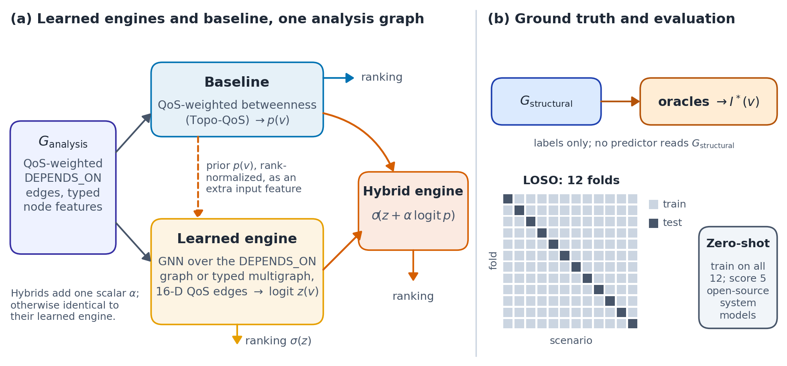

# Software-as-a-Graph: When Does Graph Learning Improve Cascade-Impact Ranking in Publish–Subscribe Systems?

**Authors.** Ibrahim Onuralp Yigit, Feza Buzluca

**Affiliation.** Department of Computer Engineering, Istanbul Technical University, 34469 Istanbul, Turkey

**Corresponding author.** Ibrahim Onuralp Yigit — yigiti@itu.edu.tr

---

# Abstract

Publish–subscribe middleware obscures failure propagation, which architects must assess before deployment, without telemetry. Graph learning has been applied to component criticality, but it is unclear whether its accuracy comes from the learning algorithm or the dependency representation. We present Software-as-a-Graph (SaG), which derives explicit dependency graphs from declared publish–subscribe architecture models, and compare analytical, hybrid, and learned rankers on twelve synthetic architectures, three failure simulators, and five stylized models of open-source systems. A reference criterion separates rankings that restate a simulator’s propagation rule from those that predict it.

On a reachability simulator, graph attention on the derived dependency graph reaches Spearman’s $\rho = 0.748$, $+0.072$ above the same model with reverse edges on the raw multigraph, also under sum aggregation; the registered co-primary contrasts on the raw multigraph were null. Counting direct dependents ($\rho = 0.764$), that is, afferent coupling, is not significantly different from the learned model, which approaches it as training architectures are added. For a queue-flow simulator requiring $12.7$ CPU-hours of labeling, a rate-weighted first-order approximation reaches $\rho = 0.830$ in milliseconds, above a gradient-boosted approximation trained on its labels ($\rho = 0.799$) and rate-fed graph networks; learners started from the formula do not improve on it.

Because these simulators propagate failures to first order by construction, the study shows when learning is unnecessary, not when it helps: representation mattered more than model complexity. Learned rankers should be evaluated against references aligned with the simulator, and training-free dependency analysis supports low-cost pre-deployment review.

**Keywords:** Dependency graphs; cascading failures; publish–subscribe; graph neural networks; reliability; software architecture; afferent coupling

---

# 1. Introduction

## 1.1 Motivation and Problem

Large distributed systems increasingly use asynchronous publish-subscribe (pub-sub) middleware: ROS 2 for autonomous driving [1], Apache Kafka for enterprise event streams [2], DDS in cyber-physical systems [3], MQTT in IoT [4], and cloud-native microservices [5, 6]. Pub-sub separates producers and consumers in space, time and synchronization [7]; components communicate via topics and brokers, and Quality-of-Service (QoS) policies set at deployment control reliability, durability, priority and deadlines. This decoupling also hides how failures spread. Outages and backpressure propagate through brokers, shared topics, colocated hosts and shared libraries, in sequential cascades (a failed publisher starves its subscribers, or a slow subscriber fills a broker queue) and in simultaneous blasts (a library crash takes down every service that uses it), much as overload cascades through complex and interdependent networks [8, 9]. Neither kind is visible in architecture diagrams or call graphs. Fault prevention and architecture evaluation belong to design time [10, 11], before deployment, when no telemetry exists, so architects must identify, from the declared architecture alone, the application services whose failures have the greatest cascading impact.

Current practice leaves a gap between service-level analysis and system dependability. Architectural properties arise from how components interact rather than from any single component [12], and architectural smells are invisible at the level of individual modules [13]: a system can have no defect in any service yet fail through hidden single points of failure or mismatched QoS contracts. The Architecture Tradeoff Analysis Method (ATAM) relies on manual input [14], static code analysis inspects services in isolation [15, 16], and chaos engineering [17], fault injection [18] and dependency tracing [19] require a running system and considerable computation [20, 21]. Graph representations have been used for reliability and defect analysis [22, 23], and graph learning has recently been applied to network criticality [24, 25] and microservices [26]. It remains unclear whether such models’ performance stems from the learning algorithm or from the dependency representation it reads, and whether and when graph learning adds measurable value beyond analytical methods based on the same dependencies. Software-as-a-Graph (SaG) addresses this question by deriving explicit dependency graphs from declared publish–subscribe architecture models and enabling a controlled comparison of analytical, hybrid, and learned approaches to cascade-impact ranking before deployment.

## 1.2 The Software-as-a-Graph (SaG) Approach

SaG models an event-driven architecture as a typed, directed multigraph over Applications, Brokers, Topics, Execution Hosts and Shared Libraries (Figure 1), derives an explicit `DEPENDS_ON` dependency graph through publish–subscribe rules (§3.3), and supports analytical, hybrid and learned cascade-impact rankings on it (§§4 and 5.2). Labels come from three simulators on the raw topology that encode different failure notions: structural reachability ($I^*$), discrete-event queue saturation ($I_{\text{dyn}}$) and multi-criteria fragmentation ($I_{\text{comp}}$) (§4.3). Because simulators and rankers read the same architecture, some analytical rankings restate a simulator’s rule; a reference criterion (§4.4) treats these as analytical truncations of the simulation rule and reports them as references rather than predictors, so circular agreement is not mistaken for predictive skill. The reachability simulator is fast, serving to calibrate the method; the queue-flow simulator models message rates and queues and costs hours to run, but because it propagates no failure beyond one hop by construction, a closed-form first-order approximation of it is to be expected (§4.3).

## 1.3 Findings in Brief

Explicit dependency representations provide most of the predictive signal for the reachability and queue-flow simulators.

*Making dependencies explicit enables graph learning.* On the raw multigraph every relation points away from Applications, so message passing never reaches the scored nodes, and the registered co-primary contrasts (a heterogeneous graph transformer, with and without the QoS channel, against the training-free baseline on that graph) were null (QoS-weighted: $\Delta\rho = +0.069$, $p = 0.266$). On the dependency graph, a graph attention network (`GAT-P-QoS`) reaches Spearman $\rho = 0.748$ against the reachability simulator, against $0.635$ on the raw multigraph. Neither edge direction ($+0.072$ over a GAT that passes every raw edge both ways, Holm $p = 0.014$) nor the input features that compute part of the simulator account for the gain: with all of them removed, the dependency-graph GAT beats an equally stripped reverse-edge control by $+0.231$ (Holm $p = 0.0068$). Nor does the attention aggregator: with sum aggregation on both graphs, which can count neighbors, the dependency graph still wins by $+0.239$ (12 of 12 folds, Holm $p = 0.0015$).

*The same representation yields analytical rankings that no learned model significantly exceeded.* Counting direct dependents, publish–subscribe afferent coupling, reaches $0.764$, not significantly different from the best learned model (equivalence not established). On the queue-flow simulator ($12.7$ CPU-hours to label the corpus), a rate-weighted first-order approximation reaches $0.830$ in milliseconds; a gradient-boosted approximation trained on the simulator’s labels reaches $0.799$, graph networks given the same declared rates at most $0.665$, and learners that start from the formula do not improve on it: as an extra input it leaves a gradient-boosted model at its value, and as a prior it leaves a graph attention network below it ($-0.018$).

*Against afferent coupling, no learned model showed additional skill.* The comparison that matters in practice is between a learned ranker and the dependency count an architect can compute directly; on the reachability simulator they are not significantly different, and under the registered nested selection protocol the learner falls further behind. The registered training-free baseline, QoS-weighted betweenness, is weaker: hybrids that correct it beat it ($+0.103$ and $+0.130$) but not their own base learners, and learned models transfer zero-shot better than it, while dependency counts rank higher still and ordering among active components remains weak. With fewer training architectures the dependency-graph learners were further from the dependency count, and the gap narrowed from $0.160$ to $0.017$ as their training set grew to eleven architectures, without closing (§6.2). In practice, the results favor training-free dependency analysis for routine use: it needs no training and runs in milliseconds. On $I^*$, recovering 80% of the critical set requires reviewing about 40–45% of Applications, so rankings suit prioritized review rather than blocking gates (§7.3); on $I_{\text{dyn}}$, the rate-weighted reference reaches 81% recall within a 20% review budget.

## 1.4 Research Questions

Knowing when learning is unnecessary is as useful as knowing when it succeeds. Because the three simulators studied here are dominated by first-order propagation by construction, this study answers the title question for that regime only: it tests whether learning exceeds aligned analytical truncations of such simulators, and it cannot characterize the regimes in which learning would exceed them, which require simulators with non-first-order mechanisms (§7.5). Software engineering research has repeatedly shown that simple metrics can match more complex models when the right information is available [23, 27, 28, 29]. We therefore evaluate learned models against analytical rankings derived from the same dependencies:

-   **RQ1 (Ranking accuracy):** *How accurately do analytical baselines, hybrid models, and learned approaches rank components by cascading-failure impact on unseen architectures, and can learned models exceed analytical truncations of the simulator’s propagation rule?*

-   **RQ2 (Sources of predictive performance):** *At matched model capacity, which factors contribute most to ranking performance: the dependency representation, degree information, relation typing, QoS information, the aggregator, the model family, or the number of training architectures?*

-   **RQ3 (Transfer):** *How well do learned models trained on synthetic architectures transfer zero-shot to stylized models of five open-source systems, and does their ordering of components that actually propagate failures hold?*

-   **RQ4 (Cost):** *What do analytical and learned approaches cost at CI/CD time in latency and estimated energy, and how does this compare with running each simulator directly?*

The evaluation follows an analysis plan pre-specified in the replication repository. Only its two co-primary contrasts are confirmatory, and both were null; the headline findings above are registered secondary or exploratory (§5.3).

## 1.5 Contributions

1.  **Dependency derivation for publish–subscribe architectures** (§3): typed rules that derive explicit dependency graphs from declared architecture models. The Application–Library projection evaluated here (Rules 1 and 5) extends the Application-level rule of [30] with library-mediated dependencies; four infrastructure rules are formalized but not evaluated.

2.  **An evaluation guideline for simulator-labeled benchmarks** (§4.4): an order-$k$ reference criterion, truncating a simulator’s own computation, against which learned rankers are compared to separate genuine cascading prediction from first-order topological rule restatement.

3.  **A controlled comparison of analytical, hybrid, and learned rankers** (§§6.1–6.3) that separates the effects of representation, degree information, relation typing, QoS information and model family.

4.  **Analytical and learned approximations of a queue-flow simulator** (§6.1): a rate-weighted first-order approximation (Eq. 7) of a simulator that is first-order by construction, compared with tabular and graph-learned approximations given the same declared rates.

5.  **A reproducible benchmark, cost analysis and practitioner guidance** (§§5.1, 6.4 and 7.3) over twelve synthetic architectures labeled by three simulators and five system models labeled by the reachability simulator.

A previous conference paper [30] introduced the publish–subscribe multigraph, the Application-level subscriber-to-publisher dependency (Rule 1 of Table 2) and a closed-form betweenness–articulation score similar to the training-free baseline (Eq. 5), validated against a reachability-loss simulation. Everything else here is new: the Library and infrastructure rules, QoS weighting, the reference criterion, the learned and hybrid rankers, the simulator approximations, leave-one-scenario-out (LOSO) cross-validation and zero-shot evaluation, the second and third simulators, the matched controls and the cost analysis. Under this broader evaluation, the closed-form score family of [30] is the weakest analytical ranker, and the present results supersede that paper’s implicit recommendation of it.

§2 reviews related work, §§3 and 4 present the model and the rankers, §§5 and 6 the evaluation, §7 the discussion and threats, and §8 concludes.

# 2. Related Work

## 2.1 Dependability and Failure-Impact Analysis of Distributed Systems

Runtime dependability methods such as broker clustering, backpressure, autoscaling, failover and chaos engineering [17] require a running cluster and significant computing resources, a concern in green software engineering [20, 21]. Pre-production methods such as service-level fault injection [18] and microservice dependency localization with PageRank (MicroRank [19]) are lighter, and benchmark platforms with cataloged, replayable faults such as Train-Ticket [31] measure failure impact on a running deployment. Architecture-based reliability prediction has a long history, from Cheung’s Markov model of control transfer between components [32] to Yacoub and Ammar [22], who combined component dependency graphs with complexity and failure severity to rank components by risk; state, path and additive reliability models [33] and the Palladio Component Model [34] are other classic examples.

Error propagation has also been analyzed at the architecture level [35, 36, 37, 38], and safety-critical practice uses model-based failure analysis such as HiP-HOPS [39] and the AADL Error Model Annex [40]. These frameworks derive propagation paths from structural descriptions, as SaG’s dependency projection does, but they need failure-mode annotations, propagation probabilities or operational profiles, which deployment manifests do not carry.

Telemetry-based methods localize faults in running microservices, among them Seer [41], Sage [42], MicroRCA [43] and GNN-based root-cause frameworks such as Eadro [44], reviewed by Zhang et al. [45]. All need data from a live system; SaG works before any code is run. Production traces show that real dependency graphs are large and dynamic [46], and that metastable failures are sustained by load feedback rather than by the structure that failed [47, 48], which a structural ranking cannot see. SaG’s focus is close to change impact analysis [49] and microservice dependency management [50], and ranking by impact relates to learning-to-rank defect prediction [51].

Failure-impact rankings are often evaluated against a simulator rather than observed outages, so a ranking may agree with a simulator because it encodes the simulator’s propagation rule rather than because it predicts its behavior. The concern is not new: simulation methodology treats a model used as ground truth as something to be validated [52], a node’s spreading influence is predicted by a simple structural index, its k-shell position [53], and learned models exploit shortcuts that encode the labeling rule [54, 55]. What we add is an operational check for simulator-labeled ranking benchmarks (§4.4).

## 2.2 Static Analysis and Architectural Dependency Metrics

Static code analysis tools such as SonarQube [15] measure complexity [56], cohesion and coupling [16] within individual services to identify defect-prone modules [57, 58]. In defect prediction, Zimmermann and Nagappan [23] applied network analysis to dependency graphs, and Premraj and Herzig’s replication [27] found that simple code and coupling metrics often perform as well. Such analysis cannot see inter-service messaging, broker saturation or cross-host propagation. Architecture recovery tools rebuild system structure from code [59], including microservice architecture reconstruction tools such as MicroART [60], and HAROS [61] and ROSDiscover [62] recover the run-time architecture of ROS systems, the kind of extraction SaG would need on real systems. Architecture-level coupling metrics count a service’s consumers: afferent coupling [63], the Absolute Importance of the Service [64] and service fan-in [65]. In publish–subscribe systems this count is a typed two-hop query (publisher to topic to subscriber), which SaG’s dependency rules define; because it matches the reachability oracle’s first propagation wave, this paper benchmarks it both as an established structural baseline and as an analytical reference (§4.4). Such analyses support the detection of anti-patterns [13, 66] and architectural technical debt [67] in CI/CD [68].

## 2.3 Graph Learning on Dependency Structures

Closed-form indices [69, 70, 71, 72], including this study’s training-free baseline, and cascade models of network robustness [73, 8, 9] assume homogeneous, usually undirected graphs, so a single untyped score mixes topics, libraries and hosts. Learned node-importance methods such as FINDER [24], DrBC [25] and PowerGraph [74], and learned approximations of betweenness and closeness [75], also assume homogeneity; GENI [76] estimates node importance on heterogeneous knowledge graphs. Closest to the present setting, InfGCN [77] and RCNN [78] train node rankers on labels from simulated SIR spreading and report gains over centrality indices; neither compares the learner with a truncation of the simulated process itself, the comparison §4.4 makes. Homogeneous GNNs such as GAT [79] ignore relation identity unless it is a feature, and softmax attention averages over neighbors and cannot count them, whereas sum aggregation can [80, 81]; message-passing GNNs are limited in counting substructures without explicit features [82]. Because the main reference here is a neighbor count, this difference matters (§6.2). Heterogeneous GNNs such as HGT [83] learn relation-specific transformations, but Lv et al. [84] found that they often fail to beat well-tuned homogeneous baselines; relation-typed models that sum rather than attend, such as R-GCN [85] and Lv et al.’s Simple-HGN, are not evaluated here (§7.4). GNN rankings are also sensitive to splits and tuning [86], and label propagation with shallow models can outperform GNNs [87]. Khodabandeh et al. [26] use graph attention on microservice call graphs to predict upcoming interactions; we predict the effect of removing a node from a declared topology. Learned performance models such as DeepPerf [88] likewise approximate an expensive measurement or simulation, connecting to classic simulation metamodeling [89], and performance engineering has long combined analytical models with machine learning, using the analytical model where it is accurate and learning only its residual [90]; SaG’s hybrids and its learners started from Eq. 7 follow that design. Where impact arises from interacting queues, learned models have succeeded without an analytical anchor: RouteNet [91] learns per-path delay and loss from simulated networks of queues and generalizes to unseen topologies, routing and traffic, the multi-hop regime that the simulators studied here do not implement (§7.2).

## 2.4 Positioning of This Study

This study builds on findings that simple or tuned shallow methods can match deep learning at a fraction of its cost [28, 29, 92, 93] and that network measures add little over simple coupling metrics [23, 27]. It differs from prior work in three ways: it derives explicit dependency graphs from publish–subscribe deployment manifests rather than starting from an existing architectural graph; it evaluates analytical, hybrid and learned rankers on the same representation and asks where their performance originates; and it applies an operational reference criterion to separate rankings that restate a simulator’s rule from those that predict its outcomes. Rather than asking whether graph learning can rank cascade impact, it asks whether learning adds measurable value beyond analytical baselines derived directly from the explicit dependency structure.

# 3. The Software-as-a-Graph (SaG) Architectural Model

Figure 1 shows the SaG framework. The front end reads a declared architecture model (the components, topics, hosts and library links that Architecture-as-Code manifests declare; the models evaluated here are generated or hand-authored, and no manifest importer is evaluated), builds a typed multigraph, derives a logical dependency layer that makes failure paths explicit, and extracts typed node properties, so that analytical, hybrid and learned rankings are computed from the same representation and can be compared under identical dependency information.

*Figure 1. End-to-end architecture of the SaG framework. The ranking pathway runs down the center: architecture-model ingestion, typed structural multigraph (Gstructural), DEPENDS_ON logical dependency projection (Ganalysis) with typed node properties, the ranking methods (analytical, hybrid, and learned; Figure 3), and the ranked critical set. The dashed edge marks the simulation oracles, which operate strictly on Gstructural, provide training and evaluation labels offline, and do not participate in inference.*

## 3.1 Multigraph Definition

A distributed system is described as a typed, weighted, directed multigraph $$\tag{1}
\mathcal{G} = (V, E, \tau_V, \tau_E, w_V, w_E),$$ where $V = V_{\text{app}} \cup V_{\text{broker}} \cup V_{\text{topic}} \cup V_{\text{host}} \cup V_{\text{lib}}$ holds the five entity types of Table 1, $\tau_V$ and $\tau_E$ assign entity and relation types, and $w_V, w_E \in (0, 1]$ weight entity criticality and connection strength; an entity’s $w_V$ aggregates the QoS weights $w(t)$ (§3.2) of its topics (Supplementary §S2). The raw multigraph is $G_{\text{structural}}$; the analysis graph $G_{\text{analysis}}$ adds the derived `DEPENDS_ON` edges (§3.3) and the node properties computed from them (§3.5). Supplementary §S1 lists the notation.

**Scope.** The evaluation ranks *Applications* only: microservice containers, service agents or communicating processes, the developer-authored code that changes in CI/CD. Brokers, Topics, Hosts and Libraries are modeled because failures propagate through them, but ranking them is a provisioning question rather than a commit-time one (§7.5).

**Table 1.** Entity types and structural edge types in the SaG model.

| **Panel A: Entity Types ($\mathcal{T}_V$)**          |                                               |                                                |
|:-----------------------------------------------------|:----------------------------------------------|:-----------------------------------------------|
| **Entity Type**                                      | **Architectural Role**                        | **Concrete System Examples**                   |
| **Application** ($V_{\text{app}}$)                   | Process producing/consuming messages          | ROS 2 node, Kafka microservice, MQTT client    |
| **Broker** ($V_{\text{broker}}$)                     | Message routing and queuing intermediary      | RabbitMQ exchange, Mosquitto, EMQX broker      |
| **Topic** ($V_{\text{topic}}$)                       | Named logical communication channel           | `/sensor/lidar`, `orders.payment.completed`    |
| **Execution Host** ($V_{\text{host}}$)               | Physical or virtualized execution environment | Bare-metal server, Kubernetes worker, Cloud VM |
| **Library** ($V_{\text{lib}}$)                       | Shared software package or runtime dependency | Kafka client, OpenCV, Protobuf runtime         |
| **Panel B: Structural Edge Types ($\mathcal{T}_E$)** |                                               |                                                |
| **Structural Edge**                                  | **Direction**                                 | **Semantic Meaning**                           |
| `PUBLISHES_TO` / `SUBSCRIBES_TO`                     | App/Library $\to$ Topic                       | Component publishes to / consumes from topic   |
| `ROUTES`                                             | Broker $\to$ Topic                            | Broker manages and routes topic traffic        |
| `RUNS_ON`                                            | App/Broker $\to$ Host                         | Process is hosted on host                      |
| `CONNECTS_TO`                                        | Host $\to$ Host                               | Network link between hosts                     |
| `USES`                                               | App $\to$ Library                             | Application links to shared library            |

## 3.2 Quality-of-Service Link Weighting

A `RELIABLE` topic with `TRANSIENT_LOCAL` durability couples services more strongly than a `BEST_EFFORT` telemetry stream. Each topic $t$ therefore has a weight $w(t) \in (0, 1]$ combining its QoS policies (reliability, durability, priority) with payload size and publication frequency, with policy weights from an Analytic Hierarchy Process (AHP) [94] matrix (Supplementary §S7). Declared QoS policies turned out to carry no measurable signal on either the reachability or the queue-flow simulator (§§6.1 and 6.2); for $I^*$ this is largely fixed by design, because it barely reads QoS (§4.3). The dependency counts reported in this paper are unweighted.

## 3.3 Logical Dependency Projection (`DEPENDS_ON`)

Structural edges do not show how failures spread: a subscriber depends on a publisher, but no edge joins them. SaG therefore derives `DEPENDS_ON` edges from the dependent to the dependency (if the target fails, the source is affected) using the rules of Table 2. The resulting graph is the common input of the analytical, hybrid and learned rankers.

**Table 2.** The `DEPENDS_ON` rules of the Application–Library projection evaluated in this study. Four infrastructure rules (Rules 2–4 and 6, for brokers and hosts) are formalized in Supplementary §S2 but are not exercised by the Application-level evaluation.

| **Rule** | **Dependency Category** | **Structural Pattern ($\text{Dependent} \to \text{Dependency}$)** | **Derived Weight ($w$)**              |
|:--------:|:------------------------|:------------------------------------------------------------------|:--------------------------------------|
|  **1**   | `app_to_app`            | Subscriber $\to$ Publisher (via shared Topic)                     | $1 - \prod_{t \in T}(1 - w(t))$       |
|  **5**   | `app_to_lib`            | Application $\to$ Shared Library it `USES`                        | $H(w_V(\text{app}), w_V(\text{lib}))$ |

Rule 1 combines the topics $T$ connecting a pair by probabilistic union [95], so multiple failure paths strengthen the connection; Rule 5 uses the harmonic mean $H(x, y) = 2xy/(x+y)$ [96]. Rule 1 captures sequential cascades (a failed publisher starves its subscribers) and Rule 5 simultaneous blasts (a crashed library fails every Application using it); neither is stated explicitly in a manifest.

**Remark 1 (the dependency count is a typed two-hop count).** Let $G_{\text{flow}}$ be the Application–Library projection (Rules 1 and 5) and $v$ an Application. By construction, $$\tag{2}
\texttt{InDeg}(v) \;=\; \bigl|\{\,u \neq v : \exists t \in V_{\text{topic}},\; (v, t) \in \texttt{PUBLISHES\_TO} \wedge (u, t) \in \texttt{SUBSCRIBES\_TO}\,\}\bigr|,$$ because Rule 5 edges end at Libraries, so every edge into an Application is a Rule 1 edge, and parallel topics between a pair collapse into one edge. The right side is publish–subscribe afferent coupling [63, 64], a typed two-hop query on the raw multigraph; the projection defines which query to use (the equality holds exactly on all seventeen corpus graphs). The derivation adds value beyond this count: including Rule 5 raises the agreement of transitive reach with $I^*$ by $+0.058$ (9 of 12 folds, Holm $p = 0.0068$; §6.1). Because $I^*$’s first propagation wave matches this set (§4.4), `InDeg` and its transitive version `Reach` serve as both established structural baselines and first-order analytical references. The in-degree *feature* the learners receive is the normalized in-degree on the full `DEPENDS_ON` graph, where Rule 1 is also applied through `USES` chains of up to three hops (an Application inherits the publications and subscriptions of the Libraries it uses) and Libraries can be dependents; the `InDeg` reference counts direct subscriptions only. The two differ for 940 of the 1,321 Applications, with per-fold rank agreement $\rho = 0.55$–$1.00$ (Supplementary §S14).

*Figure 2. Running example. (a) Three applications share topic t (routed by broker b) and library ℓ, and all run on host n. No structural edge joins two applications. (b) The derived DEPENDS_ON edges make the hidden dependencies explicit: subscribers a2, a3 depend on publisher a1 (Rule 1), all applications depend on ℓ (Rule 5), and each application depends on the broker (Rule 2; drawn for completeness, but not part of the Application–Library projection evaluated here). Simulation oracles run on view (a); the analytical rankings and the -P learners read view (b), and the raw-graph learners pass messages over view (a) with node features computed from (b).*

## 3.4 Dual Graph Views

The **structural graph** $G_{\text{structural}}$ is the raw deployment topology; the **analysis graph** $G_{\text{analysis}}$ adds the `DEPENDS_ON` edges and code metrics (Figure 2). Every ranker’s node features are computed on $G_{\text{analysis}}$, and no ranker reads simulator output. The learners pass messages either over $G_{\text{structural}}$ or over the `DEPENDS_ON` projection (the `-P` models), and the difference matters: on $G_{\text{structural}}$ every relation points away from Applications (`PUBLISHES_TO`, `RUNS_ON`, `USES`), so forward message passing never reaches them and forward GNNs collapse into per-node models over precomputed features. On the `DEPENDS_ON` graph each Application receives messages from its dependents. Because the views also differ in edge direction, §6.2 adds a raw-graph learner that passes every message in both directions, separating dependency semantics from direction.

## 3.5 Typed Node Feature Encoding

All five entity types share 18 normalized metrics computed on $G_{\text{analysis}}$, including PageRank, reverse PageRank, betweenness, closeness, in- and out-degree, an articulation score, QoS and dependency weights, multi-path coupling, fan-out criticality and the Connectivity Degradation Index (CDI); type-specific blocks extend the vector to 19–25 dimensions (Applications and Libraries add a code-quality penalty and its four static-code inputs). The full schema is in Supplementary §S14. Four centralities use QoS-weighted edges, so the QoS-off condition is not entirely free of QoS. Several features compute part of what the reachability simulator computes: in-degree and its QoS-weighted version $w_{\text{in}}$ are rank-correlated with `InDeg`, CDI is a removal-and-reachability computation, and multi-path coupling, reverse PageRank, fan-out criticality and the articulation score are also aligned with it. Every published learner reads these *oracle-aligned* features and so inherits part of the oracle’s circularity; §6.2 reports learners with all of them removed.

# 4. Ranking Methods, Simulation Oracles, and the Reference Criterion

The study compares analytical rankings derived directly from dependency structure (the training-free baseline `Topo-QoS` and the references of §5.2), hybrid methods that correct an analytical prior with a learned model, and learned methods: graph neural networks on the typed multigraph or the dependency graph, and gradient-boosted models on per-Application features (Figure 3). Full hyperparameters and training commands are in the replication repository’s experiment pages.

*Figure 3. (a) SaG’s ranking methods read the analysis graph. The training-free baseline scores QoS-weighted betweenness; p(v) is that Topo-QoS score, rank-normalized to [0, 1] within the graph; the learned model outputs a logit z(v). A hybrid model gives the learned model p(v) as an extra input feature and adds a learned correction to it on the logit scale, σ(z + α logit p), with one learnable scalar α, initialized to 1 and unconstrained; p is clipped to [0.01, 0.99] before the logit. (b) Labels come from simulation oracles on the structural graph, which no ranker reads. We evaluate the methods by leave-one-scenario-out cross-validation over twelve synthetic architectures and zero-shot on five open-source system models.*

## 4.1 Heterogeneous Graph Transformer and Attention Networks

The main learned ranker, `HGT-QoS`, is a three-layer Heterogeneous Graph Transformer [83] (PyTorch Geometric [97]; hidden dimension $64$, four heads) with entity-specific input projections and type-parameterized attention per meta-relation (Supplementary §S3). It passes messages over its input graph and its transpose: $G_{\text{structural}}$ for `HGT-QoS`, the `DEPENDS_ON` projection for `HGT-P-QoS` (width $100$, keeping parameters within $1\%$). The homogeneous Graph Attention Networks (`GAT-QoS`, and `GAT-P-QoS` on the dependency graph) use three `GATConv` layers with four heads at a matched parameter budget and pass messages forward only, except the direction control `GAT-QoS-R`, which also passes every edge in reverse. Each edge carries a 16-dimensional vector (coupling weight, path count, a one-hot relation encoding and seven middleware QoS parameters) that is projected and added before attention. Because the vector encodes the relation, the “untyped” GAT receives relation identity as a feature, but this matters only where messages reach Applications (§3.4); on the dependency projection every edge carries the same relation.

## 4.2 Prediction Head and Training Objective

A composite head predicts the simulated cascade impact, with an auxiliary head $\hat{a}_1$ regressing on $I^*_R$, the number of subscribers that the same simulator run marks as impacted (normalized like the main label). The training objective combines regression with listwise and margin-ranking terms: $$\tag{3}
\mathcal{L} = \text{MSE}(\hat{I}^*, I^*) + 0.5 \cdot \text{MSE}(\hat{a}_1, I^*_R) + 0.3 \cdot \mathcal{L}_{\text{rank}} + 0.1 \cdot \mathcal{L}_{\text{pairwise}},$$ where $\mathcal{L}_{\text{rank}}$ is the Listwise Maximum Likelihood Estimation (ListMLE) loss [98] over the permutation $\pi$ induced by the simulated labels, $$\tag{4}
\mathcal{L}_{\text{rank}} = -\frac{1}{N}\sum_{i=1}^N \Big( \hat{s}_{\pi_i} - \log \sum_{j=i}^N \exp(\hat{s}_{\pi_j}) \Big),$$ and $\mathcal{L}_{\text{pairwise}}$ is a margin-ranking loss with $\gamma = 0.05$. Tied labels (about 31% of Applications have $I^* = 0$) enter $\pi$ in the generator’s creation order; a node-order permutation control and a tie-aware variant of the loss, in which tied labels form groups that share one risk set, test whether this affects the results (§6.2).

Models are trained with AdamW ($\eta = 3 \times 10^{-4}$, weight decay $10^{-4}$) and cosine warm restarts for up to 300 epochs, with early stopping (patience 60) on a 20% node-level validation split of the largest training scenario of each fold, over five fixed seeds. The split never touches the held-out scenario; a held-out validation scenario instead would remove one of the eleven training graphs and score early stopping on 26–300 Applications, and the registered nested protocol that does so is reported as a sensitivity check (§6.2). All reported evaluations are inductive under leave-one-scenario-out cross-validation. Hyperparameters and loss coefficients were fixed before the first sweep and kept across all experiments, rather than selected by the registered nested procedure (§5.3); no model family received a separate tuning budget.

## 4.3 Simulation Oracles

Labels come from three failure simulators (“oracles”) that run on the raw multigraph $G_{\text{structural}}$ and define different notions of cascade impact rather than observations of real failures:

-   **Reachability cascade oracle ($I^*$, primary):** crashes component $v$, propagates outages through dependent topics, brokers and links by breadth-first traversal, and computes the mean fractional feed loss across intact subscribers, with each topic’s loss scaled by a declared, uncalibrated QoS severity ladder ($\times 1.2$ for `RELIABLE`, $\times 1.15$ or $\times 1.05$ for high or medium priority). A subscriber whose feed loss exceeds the propagation threshold ($0.2$) fails with a probability that is one in the first wave and decays by $0.15$ per later wave (floor $0.25$); these constants and the severity ladder are declared, not calibrated, and were not swept; the label averages five seeds of this stochastic propagation (pseudocode in Supplementary §S12). Disabling QoS scaling leaves the Application ordering largely intact ($\rho = 0.965$ across the twelve folds), and substituting durability-aware rescaling moves it less still ($\rho = 0.977$): $I^*$ is predominantly a topological reachability metric.

-   **Queue-flow oracle ($I_{\text{dyn}}$):** a discrete-event SimPy [99] simulation of message rates, bounded subscriber queues and service contention that measures the drop in delivered message rate for surviving consumers, using declared publication rates and QoS contracts (history depth, reliability, deadlines, lifespan, priority) that $I^*$ ignores. It does not read declared payload sizes (every message has the same size), model brokers or network links, block publishers on full queues, or retry; a consumer that loses its inputs keeps publishing. Its first-order effect, consumers losing a failed publisher’s messages, is therefore again subscriber loss, and by construction it propagates no failure beyond one hop. It labels all $1{,}321$ Applications (five seeds) in $12.7$ CPU-hours, against seconds for $I^*$, and agrees with $I^*$ at a mean $\rho = 0.711$. A single $I_{\text{dyn}}$ run agrees with another at $\rho = 0.43$–$0.96$ per fold; the five-seed mean used as the label has an estimated reliability of $r = 0.79$–$0.99$ (Spearman–Brown), so no ranker can agree with it by more than $\sqrt{r} \approx 0.89$–$0.996$ per fold, and every ranker in Table 7 stays below $r$, and therefore below $\sqrt{r}$, on every fold. The Spearman–Brown formula is an approximation for rank correlations, so these bounds are indicative.

-   **Composite multi-criteria oracle ($I_{\text{comp}}$):** the composite multi-criteria failure simulator, run on all Applications, scores each removal as $I_{\text{comp}}(v) = 0.35\,\text{RL}(v) + 0.25\,\text{FR}(v) + 0.25\,\text{TL}(v) + 0.15\,\text{FD}(v)$ over reachability loss, fragmentation, throughput loss and flow disruption. The weights are declared and uncalibrated, and the sensitivity of ranker order to them was not tested, so $I_{\text{comp}}$ is a multi-objective stress test rather than a measure of subscriber loss; it is never a training label.

## 4.4 Input–Label Separation and the Reference Criterion

No simulation output is used as an input (a regression test enforces this). Procedural separation does not remove construct overlap, however: a ranking may agree with a simulator because it reproduces the simulator’s rule rather than because it infers impact from independent evidence.

**The reference criterion.** Let an oracle $O$ compute the impact of removing $v$ by propagating the failure in waves over its inputs, and let $T_k(O)$ be the same computation stopped after wave $k$. A ranking $R$ is an *order-$k$ reference* for $O$, for $k \ge 1$ or $k = \infty$ (the cascade run to its fixpoint), if $R$ equals $T_k(O)$, computed from the inputs $O$ reads, after at most the following simplifications: (S1) the expectation in place of $O$’s seed-dependent stochastic propagation; (S2) omitting a severity rescaling that $O$ applies to each loss term; (S3) omitting the mechanisms $O$ adds on top of propagation (queueing, drops, deadlines); (S4) uniform weights in place of per-component rates or normalizations; and (S5) the support of a wave (the number of affected components) in place of its weighted loss. Each simplification removes exactly one mechanism that the oracle definitions of §4.3 state (seeded propagation, the severity ladder, queueing, per-topic rates and normalizations, the weighting of a wave’s loss); none changes which components a wave reaches or the direction in which failures propagate. No other simplification is admitted: in particular, no change of propagation edges or direction, no path-based or spectral score in place of a wave, and no parameter of $R$ fitted to the output of $O$. Whether a ranking qualifies is therefore decided by derivation from the simulator’s definition, not by its score, and the classification does not follow the scores: Eq. 7 is a reference for $I_{\text{dyn}}$ but a predictor for $I^*$, which reads no rates, although it reaches $0.756$ on $I^*$; `Reach`, a reference, scores below the best learned predictor; and a GAT given the direct-dependent count as its prior ($0.763$) and the gradient-boosted queue-flow approximation ($0.799$) are predictors that score at the level of the corresponding references. For $I^*$, whose first wave reaches exactly the direct subscribers of the failed component, the first-order expansion (Eq. 6) is $T_1(I^*)$ under S1, S2 and S4 (equal publication rates, and no division of a subscriber’s loss by its number of feeds), `InDeg` is its support (S5; Remark 1), and `Reach` is the support of the untruncated cascade, an order-$\infty$ reference (S1, S5). For $I_{\text{dyn}}$, the rate-weighted expansion (Eq. 7) is $T_1(I_{\text{dyn}})$ under S3 and S4, the delivered-rate loss after one wave without queueing. $I_{\text{dyn}}$ is a discrete-event simulation rather than a wave computation, but because it propagates no failure beyond one hop its whole effect is a single wave; Supplementary §S42 derives Eq. 7 from its delivery accounting. `Topo-QoS`, the hybrids and every learned ranker fail the definition and are *predictors*. For $I_{\text{comp}}$ no ranking is a truncation, but its fragmentation and flow terms respond to removing high-degree and high-betweenness nodes, so `Topo-QoS` and raw degree are *term-aligned* with it and read with the same caution.

A reference measures how much of $O$ its own rule recovers, a property of the oracle rather than predictive skill. Comparisons between a predictor and a reference are therefore descriptive anchors (how close a predictor comes to the oracle’s own first-order rule), not registered contrasts, and the statement that no learned model significantly exceeded a reference is descriptive; the one exception, the exploratory paired comparison of Eq. 7 with the learned queue-flow approximation, is flagged where it appears (§6.1). We defined the criterion post hoc, after simple dependency counts performed strongly; reclassifying them changed no number, but the criterion has not been applied to a corpus generated after the analysis was frozen (§7.5).

Learned methods are not references by this definition, but they are not less circular: they are fitted to the oracle they are scored against and read oracle-aligned features (§3.5). We therefore also report learners with those features removed and learners’ agreement with $I_{\text{dyn}}$ after $I^*$ or the first-order term is partialled out (§6). Neither replaces validation against real failures (§7.4).

# 5. Experimental Setup

The design asks whether ranking performance originates from the dependency representation or from the learning algorithm operating on it. If it arises from the representation, analytical and learned rankers built on that representation should perform similarly; if learning adds information, learned rankers should outperform analytical alternatives built on the same dependencies.

## 5.1 Corpus and Replication Package

The corpus includes 2,812 components from seventeen architectures (Table 3). Twelve synthetic topologies form the LOSO folds, covering autonomous vehicles, financial trading, healthcare, industrial SCADA, smart-city IoT, telecom RAN, logistics, gaming, microservices, enterprise integration and air-traffic management. All twelve come from one generator family, so LOSO tests transfer across its parameter settings, not across unrelated industrial systems; each topology regenerates exactly from its configuration, checked in CI against a SHA-256 manifest.

**Table 3.** Evaluation corpus. The twelve synthetic topologies are the LOSO folds; we exclude the five open-source system models from all training and use them only for zero-shot transfer (§6.3). Counts are read from the committed topology files and verified in CI; Supplementary §S16 gives per-scenario composition.

| **Dataset**                         | **$|V|$** | **$|V_{\text{app}}|$** | **Topics** | **Brokers** | **Hosts** | **Libs** |  **$|E|$** |
|:------------------------------------|----------:|-----------------------:|-----------:|------------:|----------:|---------:|-----------:|
| Synthetic evaluation scenarios (12) |     2,461 |                  1,321 |        615 |          65 |       202 |      258 |     10,918 |
| Open-source system models (5)       |       351 |                    141 |        120 |          16 |        32 |       42 |        700 |
| **Total**                           | **2,812** |              **1,462** |    **735** |      **81** |   **234** |  **300** | **11,618** |

The five open-source system models (Autoware.universe on ROS 2, EdgeX Foundry, Home Assistant, and meshes based on Online Boutique and Train-Ticket) were each hand-authored by the first author from public architectural documentation, not extracted from source code or manifests, and no second modeler re-derived any of them. Brokers, QoS profiles, code metrics and host specifications are partly assumed. Online Boutique and Train-Ticket are RPC systems re-expressed as event-driven publish–subscribe meshes: synchronous calls become one-way event, command or request topics on assumed brokers, with no reply topics, so the models drop request–reply coupling, timeouts, thread-pool exhaustion and synchronous backpressure (Supplementary §S16). No topology in this study therefore comes from a real deployment manifest, and RQ3 tests transfer to stylized single-modeler models, not to production systems.

All datasets, harnesses, checkpoints and result artifacts are on Zenodo (see Data Availability), and the public repository documents each experiment’s protocol, hyperparameters, `make` target and artifacts (<https://github.com/onuralpyigit/software-as-a-graph/tree/655489fb6cdb8b787725232f65fd6519d413fa95/docs/research/jss/experiments>). A script checks every figure reported in this paper against those artifacts, and the analysis scripts, some written with AI assistance (see the declarations), are covered by the repository’s regression tests.

## 5.2 Rankers and References

Table 4 groups the rankers as analytical, hybrid and learned; further training-free baselines and variants are in Supplementary §§S44 and S35. GAT and GAT-QoS are untyped GATs at HGT’s parameter budget (within $1.1\%$ of HGT’s 434,620 parameters: 429,992–437,496; Table 4), giving a $2\times2$ of typing and QoS channel. The “-P” models read the Application–Library `DEPENDS_ON` graph with node features and labels identical to the raw-multigraph models. QoS-off arms set edge weights to 1 and zero the three QoS node columns ($w$, $w_{\text{in}}$, $w_{\text{out}}$).

**Table 4.** Rankers and references reported in the main text. `-QoS`: QoS-weighted distances (`Topo-QoS`) or the 16-D QoS edge vector plus three QoS node columns (GNNs); `-P`: trained on the derived dependency graph; `Hybrid-X`: model X corrected by the `Topo-QoS` prior; $\to$dyn: trained on $I_{\text{dyn}}$ labels. Unsuffixed GNNs are raw-multigraph controls. Params: trainable parameters. References restate a simulator’s rule and carry no contrast (§4.4); control arms are in §6.2, where further suffixes mark the change made to an arm: `-R` reverse edges, `-deg`/`-min`/`-const` feature removal, `-AP` corrected prior, `-perm` permuted node order, `-tie` tie-aware listwise loss; `GIN` replaces attention by sum aggregation. $^\P$Articulation term zero by an implementation defect (see text).

| **Ranker**                                                                        | **Graph read**                                  | **Typing / edge input**                                       |        **Params** |
|:----------------------------------------------------------------------------------|:------------------------------------------------|:--------------------------------------------------------------|------------------:|
| *Analytical: training-free baseline (registered comparator)*                      |                                                 |                                                               |                   |
| `Topo-QoS`$^\P$                                                                   | App–Lib `DEPENDS_ON`                            | scalar $w(e)$; betweenness only (AP term zero; corr. $0.533$) |                 — |
| *Analytical: references (no contrast; §4.4)*                                      |                                                 |                                                               |                   |
| Analytic $I^*$ (Eq. 6)                                                            | topic publish/subscribe sets                    | first-order subscriber loss                                   |                 — |
| Rate-weighted (Eq. 7)                                                             | topic publish/subscribe sets                    | first-order loss weighted by declared rates                   |                 — |
| `InDeg` / `Reach`                                                                 | App–Lib `DEPENDS_ON`                            | direct / transitive dependents                                |                 — |
| *Hybrid: learned correction of the `Topo-QoS` prior*                              |                                                 |                                                               |                   |
| `Hybrid-GAT` / `Hybrid-HGT`                                                       | $G_{\text{structural}}$ + features              | as base + `Topo-QoS` prior                                    | 431,433 / 434,941 |
| *Learned: dependency graph*                                                       |                                                 |                                                               |                   |
| `GAT-P-QoS`, `HGT-P-QoS`                                                          | App–Lib `DEPENDS_ON`                            | homogeneous / heterogeneous                                   | 429,992 / 430,680 |
| *Learned: raw multigraph, typing $\times$ QoS channel at matched budget*          |                                                 |                                                               |                   |
| `GAT` / `GAT-QoS`                                                                 | $G_{\text{structural}}$ + features              | homogeneous; none / 16-D                                      | 437,496 / 429,992 |
| `HGT` / `HGT-QoS`                                                                 | $G_{\text{structural}}$ + features              | heterogeneous; 1-hot / 16-D                                   |           434,620 |
| *Learned approximations of $I_{\text{dyn}}$ (trained on $I_{\text{dyn}}$ labels)* |                                                 |                                                               |                   |
| `GBM-P-QoS`$\to$dyn                                                               | per-Application features (App–Lib `DEPENDS_ON`) | tabular S+Q design: 9 dependency counts + 9 QoS/rate columns  |                 — |
| `GAT-P-QoS`$\to$dyn                                                               | App–Lib `DEPENDS_ON`                            | homogeneous; 16-D                                             |           429,992 |
| `GAT-P-QoS`$\to$dyn+rate / +rate-e                                                | App–Lib `DEPENDS_ON`                            | \+ declared-rate node column / and edge column                | 431,432 / 432,296 |
| `GIN-P-QoS`$\to$dyn+rate-e                                                        | App–Lib `DEPENDS_ON`                            | sum aggregation; rate node and edge columns                   |           435,947 |

**Training-free baseline.** `Topo-QoS` is computed on the Application–Library `DEPENDS_ON` graph (Rules 1 and 5): $$\tag{5}
\text{Topo-QoS}(v) = 0.6 \cdot \text{BT}_{w}(v) + 0.4 \cdot \text{AP}(v),$$ where $\text{BT}_{w}$ is betweenness over edge distances $d(e) = 1/(w(e) + 10^{-6})$ and AP flags articulation points. Due to an implementation defect, the AP term is zero for every node: the scorer reads the articulation flag under a key (`ap_c_score`) that the cached metrics do not contain, and falls back to zero, so every table reports QoS-weighted betweenness alone. The defect slightly favors the baseline: restoring the term lowers `Topo-QoS` from $0.553$ to $0.533$, so it does not bias comparisons toward the learned models or the references. The hybrids’ prior $p(v)$ inherits the defect. The registered contrasts stay against the registered value, because replacing a comparator after its contrasts were registered would be an undeclared deviation; Table 6 reports the corrected value beside it, and hybrids retrained on the corrected prior are compared with it in §6.1 (Supplementary Table S71). The comparator was fixed when the analysis plan was written, before the dependency counts had been analyzed, and continues the score family of [30]; in hindsight, afferent coupling would have been the natural comparator, and it is reported beside the baseline as a reference.

**References.** Three training-free rankings restate the reachability oracle’s propagation rule. The first is the post hoc first-order expansion of $I^*$ (Analytic $I^*$): $$\tag{6}
\hat{I}^*_1(v) = \sum_{t \in \text{pub}(v)} \frac{|\text{sub}(t)|}{|\text{pub}(t)|},$$ where $|\text{pub}(t)| \ge 1$ for all topics published by $v$. The second is `InDeg`$(v)$, the number of direct dependents on the `DEPENDS_ON` graph (Remark 1), and the third `Reach`$(v)$, the number of transitive dependents normalized by $|V| - 1$. For the queue-flow simulator $I_{\text{dyn}}$, the corresponding reference weights each term of Eq. 6 by the topic’s declared publication frequency $r_t$: $$\hat{I}^{\mathrm{rate}}_{\mathrm{dyn},1}(v) \;=\; \sum_{t \in \mathrm{pub}(v)} \frac{r_t}{|\mathrm{pub}(t)|}\,\lvert \mathrm{sub}(t) \rvert.
\tag{7}$$ Here, $r_t$ is the declared publication rate (msg/s) of topic $t$. It is a first-order truncation of $I_{\text{dyn}}$, which reads the same rates, and was evaluated after the registered analyses (exploratory). References carry no contrast against `Topo-QoS`; the one exception is the exploratory paired comparison between Eq. 7 and the learned queue-flow approximation (§6.1).

## 5.3 Metrics, Protocols and Statistics

**Metrics and protocols.** Every ranker is scored on the Application set $V_{\text{app}}$ with Spearman $\rho$ against each oracle, the active-stratum $\rho_{>0}$ over components with true impact above zero, and Overlap@$K$, the fraction of the true top-$K$ recovered by the predicted top-$K$ ($K \approx 20\%$ of $|V_{\text{app}}|$); PR-AUC, $F_1@\tau$ and nDCG@10 are in Supplementary §S18. Under LOSO, learned models train on eleven scenarios and are tested on the twelfth, for all 12 folds and five seeds, and the reported value is the mean $\rho$ across seeds. For zero-shot transfer, models trained on all twelve scenarios are evaluated on the five system models without fine-tuning. Training-free rankers are scored on the same scenarios and labels.

**Statistics.** The summary $\rho$ is the mean over folds with a 95% bootstrap interval ($B = 2{,}000$) [100], or the mean over the five system models with their per-system range. Contrasts use paired two-sided Wilcoxon signed-rank tests across folds [101, 102], and, because LOSO folds share ten of eleven training scenarios, every registered contrast is also tested with the Nadeau–Bengio corrected resampled $t$-test [103]. The test was derived for repeated random splits, but its correction targets the same dependence LOSO creates, overlapping training sets across folds; we use the test-to-train ratio $1/11$, one held-out scenario per eleven training scenarios, and taking Applications as the unit instead changes no conclusion (for example, $p = 0.019$ vs. $0.020$ for Hybrid-HGT). “Won” is the number of folds on which a ranker beats its comparator, a sign count reported beside the paired $\Delta\rho$ and its interval, not an effect size in its own right. “Not significantly different” does not mean statistically equivalent; equivalence is claimed only where a two one-sided test at $\pm 0.05$ passes, and where the paper says one ranker “matches” another, it means the two are not significantly different. Overlap@$K$ breaks ties by a deterministic but arbitrary order (NumPy’s default sort over components ordered by identifier); Figure 5 resolves ties in expectation instead. Differences are computed from unrounded values, so a reported $\Delta\rho$ can differ in the last digit from the difference of two rounded means. Partial Spearman correlations (Table 7) are computed per fold as the Pearson correlation of the residuals of both ranks after linear regression on the rank of the controlled ranking, then averaged over folds with the same bootstrap interval.

**Analysis plan and the status of each result.** The protocol is pre-specified in the replication repository, not lodged with a third-party registry: the plan was committed on 6 September 2026 (commit `44713326`), before the revised harness produced any result, and every amendment is logged with its commit (Supplementary §S28). Table 5 gives the status of each headline result. *Confirmatory*: the plan’s two co-primary contrasts (`HGT-QoS` and `HGT` vs. `Topo-QoS`), both null. *Registered secondary*: arms committed before they ran but after the primary null was known (the matched $2\times2$, the hybrids, the reference counts, the derivation value, the full-population queue-flow labels and the control arms of §6.2), each Holm-corrected within its family. *Exploratory*: post hoc analyses, the dependency-graph learners’ contrasts, the reference reclassification (which changed no figure) and the rate-weighted reference with the attribution of the learned queue-flow approximation. **Plan deviation**: the registered nested hyperparameter selection was replaced by one fixed configuration, and the registered rule was run later as a sensitivity check (§6.2). An omnibus Holm correction across the 13 decision-bearing contrasts (Supplementary §S28) leaves the hybrid contrasts significant (Hybrid-GAT $p_{\text{omni}} = 0.019$, Hybrid-HGT $p_{\text{omni}} = 0.041$) and the primary contrast null ($p_{\text{omni}} \ge 0.46$). The headline findings of this paper are therefore registered secondary or exploratory, not confirmatory.

**Table 5.** Status of the headline results. Registered secondary arms were committed before they ran but after the primary null was known; $p_{\text{Holm}}$ is within each family, $p_{\text{omni}}$ across the 13 decision-bearing contrasts.

| **Status**           | **Claim**                                                                 | **Result (Section)**                                                                                      |
|:---------------------|:--------------------------------------------------------------------------|:----------------------------------------------------------------------------------------------------------|
| Confirmatory         | `HGT-QoS` and `HGT` vs. `Topo-QoS`                                        | both null; `HGT-QoS` $+0.069$, $p = 0.266$; $p_{\text{omni}} \ge 0.46$ (6.1)                              |
| Registered secondary | Hybrids vs. `Topo-QoS`                                                    | $+0.103$ and $+0.130$, $p_{\text{omni}} = 0.041$ and $0.019$; neither differs from its base learner (6.1) |
| Registered secondary | Typing and QoS inputs, capacity-matched $2\times2$                        | typing $-0.014$, QoS inputs $+0.073$, neither significant after Holm (6.2)                                |
| Registered secondary | Dependency graph beyond edge direction and oracle-aligned features        | $+0.072$ (Holm $p = 0.014$) and $+0.231$ (Holm $p = 0.0068$) (6.2)                                        |
| Registered secondary | Aggregator, rate inputs, tie-aware loss, training-set size (Amendment 19) | §6.2, Table 8                                                                                             |
| Exploratory          | `GAT-P-QoS` vs. afferent coupling on $I^*$                                | $-0.016$, not significant, equivalence not established (6.1)                                              |
| Exploratory          | Rate-weighted reference vs. learned queue-flow approximation              | $+0.031$, Holm $p = 0.009$ within its exploratory family (6.1)                                            |
| Exploratory          | Reclassification of dependency counts as references                       | changed no number (4.4)                                                                                   |

# 6. Results

All results are reported on the Application population against the primary oracle $I^*$ and, in Table 7, also against $I_{\text{dyn}}$ and $I_{\text{comp}}$ (§4.3). §5.3 gives the status of each result; per-fold values are in the experiment pages. Figure 4 summarizes the main findings.

*Figure 4. Main results for the Application population. (A) Mean Spearman ρ with 95% bootstrap intervals under LOSO (filled circles; Table 6) and zero-shot on five system models (open diamonds); grey hollow markers are references that restate I*’s rule (InDeg, Reach). GAT-P-QoS is not significantly different from InDeg, though equivalence within ± 0.05 is not established (TOST p = 0.17). (B) Per-fold improvement of GAT-P-QoS and Hybrid-GAT over Topo-QoS. (C) Cell means of the capacity-matched 2 × 2 on the raw multigraph (Supplementary Table S26): the “QoS” inputs, which include a QoS-weighted in-degree column, raise both models by about 0.07 (not significant after Holm), falling to + 0.030 with win held in both arms (Table 8).*

## 6.1 RQ1: Ranking Accuracy

Table 6 reports every ranker against $I^*$ (learned rankers trained on eleven scenarios and scored on the twelfth; 26 to 300 Applications per fold, $K$ between 5 and 60). Two patterns emerge. Reading the dependency graph instead of the raw multigraph improves attention-based learners (`GAT-P-QoS` $0.748$ vs. `GAT-QoS` $0.635$), although the typed transformer becomes unstable on it (`HGT-P-QoS` $0.514$). And no learned model significantly exceeded the references derived from the same dependencies ($0.732$–$0.808$, against at most $0.748$): the best learner lies above transitive reach and, as a five-seed ensemble ($0.772$, Table 7), above the direct-dependent count, but below the first-order expansion; of these differences only the one with the direct-dependent count was tested, and it is not significant. This is a descriptive comparison rather than a registered contrast (§4.4). Because the registered baseline `Topo-QoS` evaluates QoS-weighted betweenness alone due to an implementation defect, the meaningful structural reference is afferent coupling (`InDeg`, $0.764$). Weighting folds by $|V_{\text{app}}|$ keeps the top five rows but lifts `Topo-QoS` to $0.596$, level with the raw-multigraph learned rankers ($0.595$–$0.606$).

**Table 6.** Main results under LOSO across twelve synthetic architectures (Application population; learned rankers: five seeds, CPU sweeps). $\Delta\rho$ is paired by fold against `Topo-QoS`, with a bootstrap 95% CI and a two-sided Wilcoxon test; $p_{\text{Holm}}$ is within the registered hybrid family; $^\ddagger$exploratory. $\rho_{>0}$: Spearman over active components ($I^* > 0$). Overlap@$K$ ($K \approx 20\%$) breaks ties by deterministic identifier sort; Figure 5 resolves ties at zero in expectation. References restate $I^*$’s rule and carry no contrast. $^\P$Registered comparator, whose articulation term is zero because of an implementation defect (§5.2), so it acts as pure QoS-weighted betweenness; the indented row restores the term ($\rho = 0.533$), so the defect slightly favors the baseline, and no comparative conclusion changes. Further baselines and per-fold values: Supplementary §S44. Underlined: best predictor per column.

| **Ranker**                                                             |  **LOSO $\rho$ [95% CI]**   | **Active $\rho_{>0}$** | **$\Delta\rho$ vs `Topo-QoS` [95% CI]** | **Folds won** | **$p$ ($p_{\text{Holm}}$)** | **Overlap@$K$** |
|:-----------------------------------------------------------------------|:-----------------------------:|:----------------------:|:-----------------------------------------:|:-------------:|:---------------------------:|:---------------:|
| *Reference: restatements of $I^*$’s propagation rule (not predictors)* |                               |                        |                                           |               |                             |                 |
| **Analytic $I^*$**                                                     |    0.808 $[0.755, 0.853]$     |         0.631          |                     —                     |       —       |              —              |      0.536      |
| **InDeg (direct dependents)**                                          |    0.764 $[0.674, 0.840]$     |         0.516          |                     —                     |       —       |              —              |      0.504      |
| **Reach (transitive dependents)**                                      |    0.732 $[0.674, 0.782]$     |         0.286          |                     —                     |       —       |              —              |      0.344      |
| *Training-free baseline (registered comparator)$^\P$*                  |                               |                        |                                           |               |                             |                 |
| **Topo-QoS**                                                           |    0.553 $[0.443, 0.657]$     |         0.280          |                     —                     |       —       |              —              |      0.388      |
| corrected (articulation term restored)                                 |    0.533 $[0.404, 0.650]$     |           —            |                     —                     |       —       |              —              |        —        |
| *Learned, on the dependency graph*                                     |                               |                        |                                           |               |                             |                 |
| **GAT-P-QoS**                                                          | <u>0.748</u> $[0.704, 0.789]$ |      <u>0.440</u>      |  $\underline{+0.195}$ $[+0.100, +0.294]$  |     10/12     |      0.0068$^\ddagger$      |  <u>0.454</u>   |
| **HGT-P-QoS**                                                          |    0.514 $[0.392, 0.636]$     |         0.237          |        $-0.039$ $[-0.155, +0.077]$        |     4/12      |      0.622$^\ddagger$       |      0.380      |
| *Learned and hybrid, on the raw multigraph*                            |                               |                        |                                           |               |                             |                 |
| **HGT-QoS**                                                            |    0.622 $[0.547, 0.690]$     |         0.312          |        $+0.069$ $[-0.046, +0.174]$        |     8/12      |            0.266            |      0.426      |
| **GAT-QoS**                                                            |    0.635 $[0.567, 0.696]$     |         0.338          |        $+0.082$ $[-0.046, +0.201]$        |     7/12      |            0.233            |      0.438      |
| **Hybrid-HGT**                                                         |    0.657 $[0.572, 0.733]$     |         0.345          |        $+0.103$ $[+0.055, +0.152]$        |     11/12     |       0.0034 (0.0068)       |      0.435      |
| **Hybrid-GAT**                                                         |    0.683 $[0.603, 0.753]$     |         0.362          |        $+0.130$ $[+0.075, +0.190]$        |     11/12     |       0.0015 (0.0029)       |      0.450      |

**The reference level.** The references measure how much of $I^*$ restating its rule recovers, not predictive skill. The first-order expansion (Eq. 6) reaches $0.808$ ($\rho_{>0} = 0.631$): direct subscriber loss is most of what $I^*$ measures. `InDeg`, the support of that first wave (Remark 1), is a coarser version of it ($0.764$, $\rho_{>0} = 0.516$), and `Reach` reaches $0.732$. The derivation matters for the latter: without Rule 5, `Reach` drops by $0.058$ (9/12 folds, Holm $p = 0.0068$). Untyped raw-graph metrics do not recover the reference (total degree $0.199$, reverse PageRank $0.089$).

**Learners on the dependency graph approach the reference.** `GAT-P-QoS` reaches $\rho = 0.748$, $0.016$ below the direct-dependent count per seed and $0.008$ above it as a five-seed ensemble ($0.772$, Table 7). Neither difference is significant, and neither shows equivalence: the $90\%$ interval of the per-fold difference is $\pm 0.076$, so a two one-sided test at the registered margin of $\pm 0.05$ does not pass ($p = 0.17$ per seed, $0.13$ for the ensemble). Both differences are also smaller than the per-fold variation that node order alone induces in this learner (about $0.044$; §6.2). The closeness depends on the degree features (§6.2).

**Hybrids beat the baseline, not their base learners.** A hybrid takes the `Topo-QoS` score as an input and corrects its logit, so it nests its comparator. Hybrid-HGT ($+0.103$) and Hybrid-GAT ($+0.130$) beat `Topo-QoS` on 11 of 12 folds, also under the omnibus Holm correction ($p_{\text{omni}} = 0.041$ and $0.019$), the Nadeau–Bengio corrected $t$ ($p = 0.019$ and $0.014$) and $|V_{\text{app}}|$ weighting. Neither differs from its own base learner (Hybrid-HGT vs. `HGT-QoS` $+0.035$, $p = 0.73$; Hybrid-GAT vs. `GAT-QoS` $+0.048$, $p = 0.30$), and the same holds with the articulation defect corrected (Supplementary Table S71). The hybrid gain therefore reflects the weakness of the comparator, not the learned correction. Given `InDeg` as their prior instead, both hybrids land within $\pm 0.012$ of `InDeg` (F10): a learner handed the reference reproduces it.

**Table 7.** Rankers against three oracles, twelve LOSO folds, all $1{,}321$ Applications (registered secondary and exploratory). Feature inputs differ: Eq. 7 and GBM read declared rates, whereas GNNs receive topology and QoS properties without rate features. Partial $\rho$: Spearman with $I_{\text{dyn}}$ after the rank of $I^*$, or of the first-order expansion $\hat{I}^*_1$, is regressed out of both. The two learned blocks use different protocols: GNN rows trained on $I^*$ score the mean of five seeds’ *predictions* (hence higher $I^*$ values than Table 6’s per-seed means, e.g. $0.772$ vs. $0.748$), whereas rows trained on $I_{\text{dyn}}$ ($^\star$, approximations of it) report the mean of per-seed $\rho$, so the two blocks are not directly comparable. Underlined: highest predictor per column among the rows shown; on $I_{\text{comp}}$, raw total degree ($0.719$; Supplementary Table S76, with its $I^*$ and $I_{\text{dyn}}$ values) exceeds the underlined value.

| **Ranker**                                                                                     | $I^*$ $\rho$ | $I_{\text{dyn}}$ $\rho$ [95% CI] | Partial $\rho(\cdot, I_{\text{dyn}} \mid I^*)$ [95% CI] | Partial $\rho(\cdot, I_{\text{dyn}} \mid \hat{I}^*_1)$ | $I_{\text{comp}}$ $\rho$ |
|:-----------------------------------------------------------------------------------------------|:------------:|:----------------------------------:|:---------------------------------------------------------:|:------------------------------------------------------:|:------------------------:|
| *Reference: restatements of $I^*$’s propagation rule (not predictors)*                         |              |                                    |                                                           |                                                        |                          |
| **Analytic $I^*$**                                                                             |    0.808     |       0.706 $[0.629, 0.783]$       |                  0.318 $[0.234, 0.412]$                   |                           —                            |          0.636           |
| **InDeg**                                                                                      |    0.764     |       0.664 $[0.562, 0.758]$       |                  0.272 $[0.188, 0.366]$                   |                         0.079                          |          0.650           |
| **Reach**                                                                                      |    0.732     |       0.583 $[0.510, 0.651]$       |                  0.117 $[0.055, 0.184]$                   |                         0.102                          |          0.302           |
| *Reference: restatement of $I_{\text{dyn}}$’s first-order rule (not a predictor; exploratory)* |              |                                    |                                                           |                                                        |                          |
| **Rate-weighted** (Eq. 7)                                                                      |    0.756     |       0.830 $[0.778, 0.872]$       |                  0.578 $[0.471, 0.679]$                   |                         0.573                          |          0.551           |
| *Training-free baseline*                                                                       |              |                                    |                                                           |                                                        |                          |
| **Topo-QoS**                                                                                   |    0.553     |       0.471 $[0.381, 0.559]$       |                  0.134 $[0.061, 0.204]$                   |                        $-0.091$                        |       <u>0.702</u>       |
| *Learned GNNs (seed ensemble)*                                                                 |              |                                    |                                                           |                                                        |                          |
| **GAT-P-QoS**                                                                                  | <u>0.772</u> |       0.615 $[0.549, 0.673]$       |                  0.111 $[0.016, 0.213]$                   |                         0.182                          |          0.274           |
| **Hybrid-GAT**                                                                                 |    0.702     |       0.599 $[0.514, 0.669]$       |               <u>0.173</u> $[0.082, 0.267]$               |                         0.056                          |          0.585           |
| **Hybrid-HGT**                                                                                 |    0.672     |       0.573 $[0.497, 0.638]$       |                  0.162 $[0.074, 0.252]$                   |                         0.029                          |          0.582           |
| **HGT-QoS**                                                                                    |    0.667     |       0.549 $[0.464, 0.622]$       |                  0.130 $[0.035, 0.224]$                   |                         0.212                          |          0.201           |
| **GAT-QoS**                                                                                    |    0.647     |       0.523 $[0.436, 0.606]$       |                  0.107 $[0.018, 0.199]$                   |                      <u>0.217</u>                      |          0.144           |
| **HGT-P-QoS**                                                                                  |    0.618     |       0.496 $[0.395, 0.601]$       |                  0.112 $[0.033, 0.190]$                   |                         0.087                          |          0.334           |
| *Learned approximations of $I_{\text{dyn}}$ (trained on its labels)*                           |              |                                    |                                                           |                                                        |                          |
| **GBM-P-QoS$\to$dyn$^\star$**                                                                  |    0.764     |            <u>0.799</u>            |                             —                             |                           —                            |          0.477           |
| **GAT-P-QoS$\to$dyn$^\star$**                                                                  |    0.734     |               0.598                |                             —                             |                           —                            |          0.368           |

**Beyond the reachability oracle.** On $I_{\text{dyn}}$, which agrees with $I^*$ at $\rho = 0.711$, the references outperform all GNNs (first-order expansion $0.706$, `InDeg` $0.664$, GNNs $0.496$–$0.615$; Table 7). Partial correlations show what each ranking keeps beyond $I^*$. After removing the rank of $I^*$, `InDeg` keeps $0.272$ $[0.188, 0.366]$, `Reach` $0.117$, `Topo-QoS` $0.134$ and the GNNs $0.107$–$0.173$, all intervals excluding zero; after removing the first-order expansion instead, the raw-multigraph GNNs keep $0.212$–$0.217$, some queue-flow signal beyond the unweighted first-order term but less than the rate-weighted reference ($0.573$).

**What declared rates add on the queue-flow oracle.** Weighting each term of the first-order expansion ($0.706$ on $I_{\text{dyn}}$) by the topic’s declared publication rate (Eq. 7) raises it to $0.830$ $[0.778, 0.872]$ without training (exploratory). A gradient-boosted model trained on $I_{\text{dyn}}$ labels, reading counts, the first-order expansion, declared rates and payload sizes, reaches $0.799$: above the unweighted expansion ($+0.093$, Holm $p = 0.019$), but it falls below the rate-weighted reference, which exceeds it by $+0.031$ $[+0.013, +0.049]$ on 10 of 12 folds (Holm $p = 0.009$ within its exploratory family). The difference is small, comparable to the per-fold variation that node order alone induces in the GNNs (§6.2), so we read it as the learned approximation not exceeding the formula rather than as a margin of superiority. In an exploratory attribution (Supplementary §S42), the declared rate and payload columns alone add $+0.097$ (9/12 folds, Holm $p = 0.021$), and the seven QoS-derived columns ($w(t)$-weighted scores and policy shares) add $-0.005$ ($p = 0.68$). Because $I_{\text{dyn}}$ reads no payload (§4.3), that gain is rate signal; the payload columns cannot carry any. The GNN trained on the same labels, which received no rates, reaches only $0.598$. Given each node’s summed declared rate, and each Rule-1 edge’s share of Eq. 7 as an edge input, it improves on that ($+0.027$, 11 of 12 folds), and a sum-aggregation GNN, which can represent Eq. 7 exactly from these inputs, reaches $0.665$ ($+0.067$, 10 of 12 folds; Supplementary Table S73). Every rate-fed GNN stays far below the gradient-boosted approximation ($-0.134$ for the best) and below Eq. 7 itself ($-0.165$, Holm $p = 0.0015$; Table 8): with the rates in hand, the deficit is not one of missing inputs.

**Learning on top of the rate-weighted reference.** The direct test of whether learning adds value beyond the aligned approximation is a learner that starts from it (Table 8, F12). Given Eq. 7 as one more input column, the gradient-boosted approximation reaches $0.830$, the formula’s value ($+0.000$, 5 of 12 folds, Holm $p = 0.97$); trained to correct the formula’s residual, it reaches $0.824$ ($-0.006$, Holm $p = 0.68$); and the GAT trained on $I_{\text{dyn}}$ with the formula as its prior gains $+0.214$ over the same GAT without it (12 of 12 folds) but still falls below the formula ($0.812$, $-0.018$, 1 of 12 folds, Holm $p = 0.0029$). The learned approximations recover the formula’s information and add none that is detectable here. On $I_{\text{dyn}}$ this approaches equivalence: the interval of the gradient-boosted model given the formula ($[-0.013, +0.015]$) lies well inside $\pm 0.05$, unlike the comparison of `GAT-P-QoS` with `InDeg` on $I^*$.

**How much is left to learn.** The five-seed $I_{\text{dyn}}$ label has an estimated reliability of $r = 0.79$–$0.99$ per fold, so no ranker can exceed $\sqrt{r} \approx 0.89$–$0.996$ (§4.3). Per fold, the formula leaves $\sqrt{r_f} - \rho_f = 0.047$–$0.291$ of attainable agreement (mean $0.132$). The learners started from the formula captured none of it. Whether that residual reflects mechanisms a learner could exploit with more data or is reachable only by simulating queueing is not resolved by this corpus (§7.5).

**The multi-criteria oracle favors different rankers.** On $I_{\text{comp}}$, learned rankers without a prior perform poorly ($0.144$–$0.334$), the hybrids keep $0.58$, and training-free scores aligned with its fragmentation and flow terms rank highest (`Topo-QoS` $0.702$, raw total degree $0.719$), which again reflects overlap with the oracle’s terms. No ranker is best across all three oracles.

**Identifying the critical set.** Figure 5 shows the share of the true top-20% set that each ranker places in its top $k\%$, with ties resolved by averaging. At $k = 20\%$, `GAT-P-QoS` recovers $0.48$ of the critical set and `Topo-QoS` $0.38$; to recover 80%, `GAT-P-QoS` must flag the top 40% ($0.81$), and `Topo-QoS` does not reach 80% within 50%. The references do only slightly better: at $k = 20\%$, `InDeg` recovers $0.49$ (tie-breaking bounds $0.48$–$0.50$), and 80% recall requires the top 45% by `InDeg` ($0.83$) or by the first-order expansion ($0.89$). On $I_{\text{dyn}}$ (panel B), `GAT-P-QoS` reaches $0.74$ at 40% and $0.82$ at 50%, compared to $0.80$ at 40% for the `InDeg` reference; the rate-weighted reference, which restates $I_{\text{dyn}}$’s first-order rule, recovers $0.81$ of that set at 20% and $0.96$ at 30% (exploratory).

*Figure 5. Recall of the true top-20% set (tie-inclusive) by each ranker’s top k%, mean over the twelve LOSO folds, against I* (A) and Idyn (B), over all 1,321 Applications. Ties are resolved in expectation; grey dashed curves are references restating I*’s rule, the black dash-dotted curve in (B) is Eq. 7, and the shaded band gives InDeg’s tie-breaking bounds (Reach’s are much wider, 0.12–0.80 at k = 20%). The dotted line marks 80% recall.*

## 6.2 RQ2: Sources of Predictive Performance

Table 8 collects the registered controls; the full tables, with $I_{\text{dyn}}$, $I_{\text{comp}}$ and zero-shot columns, are in Supplementary §S43.

**Table 8.** Registered control arms (digest): twelve LOSO folds, five seeds, Application population, each run in one CPU invocation with every comparator re-run to an exact match. $\Delta\rho$ is paired by fold against the comparator, with a bootstrap 95% CI; $p_{\text{Holm}}$ is within each family. -deg: `in_degree` and $w_{\text{in}}$ zeroed. `-R`: every raw-graph edge also passed in reverse. `-AP`: articulation term restored. `-min`: every oracle-aligned feature zeroed (§3.5); `-const`: every node feature zeroed; `GIN`: sum aggregation; `+rate-e`: declared publication rates as node and edge inputs; `-tie`: tie-aware listwise loss. Rows trained and scored on $I_{\text{dyn}}$ are marked $\to$dyn; all others are on $I^*$. The node-order row is a registered gate, tested alone (unadjusted $p$). F-numbers name the registered families of the full tables (Supplementary Tables S70, S71, S72 and S73); families without a digest row are reported there only.

| Arm                                                                                                            | Comparator              | $\rho$ |   $\Delta\rho$ [95% CI]   | Folds won | $p_{\text{Holm}}$ |
|:---------------------------------------------------------------------------------------------------------------|:------------------------|:------:|:---------------------------:|:---------:|:-----------------:|
| *F1, F2, F4: degree features, aggregator, and the $2\times2$ with $w_{\text{in}}$ held*                        |                         |        |                             |           |                   |
| GAT-P-QoS-deg                                                                                                | GAT-P-QoS ($0.748$)     | 0.612  | $-0.136$ $[-0.205, -0.072]$ |   1/12    |      0.0049       |
| GIN-P-QoS-deg                                                                                                | GAT-P-QoS-deg         | 0.721  | $+0.108$ $[+0.027, +0.197]$ |   8/12    |       0.157       |
| “QoS” inputs (main effect)                                                                                     | averaged over T         |   —    | $+0.030$ $[-0.023, +0.085]$ |   9/12    |       0.330       |
| *F8, F10: edge direction; the direct-dependent count as a prior*                                               |                         |        |                             |           |                   |
| GAT-QoS-R                                                                                                      | GAT-QoS ($0.635$)       | 0.676  | $+0.041$ $[+0.000, +0.087]$ |   10/12   |       0.064       |
| GAT-P-QoS                                                                                                      | GAT-QoS-R               | 0.748  | $+0.072$ $[+0.034, +0.113]$ |   10/12   |       0.014       |
| GAT-QoS+InDeg                                                                                                  | GAT-QoS                 | 0.763  | $+0.128$ $[+0.063, +0.204]$ |   11/12   |      0.0049       |
| *F11: oracle-aligned features removed (last row descriptive)*                                                  |                         |        |                             |           |                   |
| GAT-P-QoS-min                                                                                                  | GAT-QoS-R-min ($0.378$) | 0.610  | $+0.231$ $[+0.128, +0.340]$ |   10/12   |      0.0068       |
| GIN-P-QoS-min                                                                                                  | GAT-P-QoS-min           | 0.724  | $+0.115$ $[+0.038, +0.199]$ |   9/12    |       0.027       |
| GIN-P-QoS-const                                                                                                | `InDeg` ($0.764$)       | 0.719  | $-0.045$ $[-0.069, -0.024]$ |   1/12    |         —         |
| *F14, F16: sum aggregation with reverse edges on the raw multigraph; tie-aware loss*                           |                         |        |                             |           |                   |
| GIN-P-QoS-min                                                                                                  | GIN-QoS-R-min ($0.485$) | 0.724  | $+0.239$ $[+0.151, +0.335]$ |   12/12   |      0.0015       |
| GIN-P-QoS                                                                                                      | GIN-QoS-R ($0.668$)     | 0.732  | $+0.064$ $[+0.031, +0.099]$ |   10/12   |      0.0049       |
| GAT-P-QoS-tie                                                                                                  | GAT-QoS-R-tie ($0.677$) | 0.747  | $+0.069$ $[+0.031, +0.115]$ |   9/12    |       0.019       |
| *F12, F15: learners started from Eq. 7 or given declared rates, on $I_{\text{dyn}}$; F13: node order permuted* |                         |        |                             |           |                   |
| GBM-P-QoS$\to$dyn+Eq7                                                                                          | Eq. 7 ($0.830$)         | 0.830  | $+0.000$ $[-0.013, +0.015]$ |   5/12    |       0.970       |
| GAT-P-QoS$\to$dyn+Eq7                                                                                          | Eq. 7                   | 0.812  | $-0.018$ $[-0.025, -0.012]$ |   1/12    |      0.0029       |
| GIN-P-QoS$\to$dyn+rate-e                                                                                       | Eq. 7 ($0.830$)         | 0.665  | $-0.165$ $[-0.231, -0.102]$ |   1/12    |      0.0015       |
| GAT-P-QoS-perm                                                                                                 | GAT-P-QoS               | 0.712  | $-0.035$ $[-0.055, -0.014]$ |   3/12    |      (0.012)      |

**The “QoS” factor was mostly the weighted in-degree.** In the capacity-matched $2\times2$ on the raw multigraph (Supplementary Table S26), relation typing has no effect ($-0.014$, $p_{\text{Holm}} = 0.940$) and the “QoS” inputs add $+0.073$ ($p_{\text{Holm}} = 0.127$). The QoS-off arms, however, also zero $w_{\text{in}}$, a QoS-weighted version of `InDeg`; with $w_{\text{in}}$ held in both arms (F4), the “QoS” effect drops to $+0.030$, so more than half of it was the weighted in-degree. Closed-form controls agree: unweighted betweenness ($0.591$) and constant topic weights ($0.595$) match or exceed QoS-weighted betweenness ($0.553$), and permuting QoS profiles across topics has no effect ($\Delta = -0.006$, $p = 0.733$). Because messages never reach Applications on the raw multigraph (§3.4), this $2\times2$ compares per-node models and says nothing about relational typing (§7.2).

**Degree features and the aggregator.** Removing the in-degree and $w_{\text{in}}$ columns lowers `GAT-P-QoS` by $0.136$ (F1). This confirms known expressivity results rather than adding a new one: softmax attention averages over neighbors and cannot count them, whereas sum aggregation can [80, 81], and a GIN of the same size (GINE layers, which add the edge vector to each message) keeps $0.721$ without the same columns (F2, not significant after Holm). In zero-shot transfer the degree columns matter little ($0.810$–$0.821$ without them), because the system models are ranked mostly by separating inert from active components.

**Direction versus dependency semantics.** The $+0.113$ gain of `GAT-P-QoS` over `GAT-QoS` could come from edge direction rather than dependency semantics, so a control passes every raw-graph edge in both directions, with shared weights and an unchanged parameter count (`GAT-QoS-R`, F8). It reaches $0.676$: direction alone recovers $+0.041$ of the gain, which is not significant (Holm $p = 0.064$), and `GAT-P-QoS` still exceeds it by $+0.072$ $[+0.034, +0.113]$ on 10 of 12 folds (Holm $p = 0.014$). The direction effect itself lies within the node-order spread reported below. Reverse edges also cost transfer ($0.744$ zero-shot, against $0.805$–$0.806$; Table 9).

**Without the oracle-aligned features.** Every published learner reads features that compute part of $I^*$ (§3.5). With all of them zeroed (F11), the raw-graph learners collapse (`GAT-QoS` to $0.369$, the reverse-edge control to $0.378$), whereas the dependency-graph GAT keeps $0.610$ and beats the equally stripped reverse-edge control by $+0.231$ (10 of 12 folds, Holm $p = 0.0068$). The oracle-aligned set costs `GAT-P-QoS` $0.138$, about what the two degree columns alone cost. Without them, sum aggregation beats attention on the dependency graph ($+0.115$, 9 of 12 folds, Holm $p = 0.027$), and without any node features at all, a sum-aggregation GNN on the dependency graph reaches $0.719$, $0.045$ below `InDeg` (1 of 12 folds): from structure alone it learns most of the dependent count, which the derived graph makes available and the raw multigraph does not. This too is what sum aggregation’s ability to count neighbors predicts [80, 82].

**Representation or aggregator?** On the raw multigraph a direct dependent is two typed hops away (publisher, topic, subscriber), and the reverse-edge control above averages with attention, so the dependency-graph gain could be an attention artefact that a counting aggregator on the raw graph would remove. A sum-aggregation GNN on the raw multigraph with every edge also reversed (`GIN-QoS-R`; Table 8) reaches $0.668$, level with its attention counterpart ($-0.008$), and with the oracle-aligned features removed it recovers $46\%$ of the gap between the stripped attention models ($0.485$ against $0.378$). The dependency graph still wins under matched sum aggregation: by $+0.239$ without the oracle-aligned features (12 of 12 folds, Holm $p = 0.0015$), by $+0.064$ with them (Holm $p = 0.0049$), and by $+0.289$ with no node features at all, where the raw-graph GNN reaches $0.430$ against the dependency-graph GNN’s $0.719$. The projection’s advantage is therefore not specific to attention: making each direct dependent an in-neighbor gives either aggregator the count that, on the raw multigraph, neither learned from the same eleven training graphs.

**Message passing, node order and the selection rule.** On the raw multigraph, a gradient-boosted model on the same per-node features and no graph (`GBM-Feat`) reaches $\rho = 0.642$ under LOSO, level with `GAT-QoS` ($0.635$), and removing HGT’s reverse pass, its only route to Applications, has no effect (`HGT-QoS-U`, $-0.010$, $p = 0.91$). ListMLE breaks label ties in input order (§4.2); permuting node order before training (F13; `GAT-P-QoS-perm`) scores $0.712$ against $0.748$ ($-0.035$, 3 of 12 folds, $p = 0.012$), which triggered the registered flag. Across three permutations, seeds 17, 18 and 19 give $0.712$, $0.740$ and $0.734$ (mean $0.729$), and the per-fold spread across the three permutations averages $0.044$. All three lie below the published order, so three permutations cannot separate variance from a favorable published order; at their mean, `GAT-P-QoS` sits $0.035$ below the direct-dependent count rather than $0.016$. Tie order is not its main source: with a tie-aware listwise loss, in which tied labels share one risk set, `GAT-P-QoS` is unchanged ($0.747$, $-0.001$, Holm $p = 0.97$), still exceeds the equally trained reverse-edge control ($+0.069$, Holm $p = 0.019$), and three node-order permutations still spread by $0.047$ per fold. The remaining order dependence lies in the order-dependent parts of training, such as the node-level validation split, not in the loss. Learned-ranker differences smaller than this spread should not be read as differences between models; a mixed-effects model with seeds nested in folds gives the same conclusions for the direction, oracle-aligned-feature, aggregator and tie-loss contrasts (Supplementary §S43). Finally, the plan’s nested hyperparameter selection, applied later on the stage-1 grid, changes `HGT-QoS` from $0.622$ to $0.677$ ($+0.055$) and `GAT-P-QoS` from $0.748$ to $0.693$ ($-0.054$), neither significant (Holm $p = 0.259$); nested `HGT-QoS` versus `Topo-QoS` is $+0.123$ on 9 of 12 folds, still not significant (Holm $p = 0.192$). That harness trains on one scenario fewer and stops early on a held-out scenario, so it compares two protocols, not only two configurations (§5.3). Under that protocol `GAT-P-QoS` falls $0.071$ below the direct-dependent count ($3$ of $12$ folds, $p = 0.11$). Configuration swings of $\pm 0.055$ are as large as several differences reported in this section, so every learned result here is conditional on one fixed configuration; no model family received its own tuning budget.

**Training-set size.** Figure 6 retrains three learners on $K$ of each fold’s eleven training scenarios (three nested draws per $K$). On the dependency graph the learners improve with more architectures: `GAT-P-QoS` rises from $0.605$ at $K = 1$ to $0.670$ at $K = 4$ and $0.748$ at $K = 11$ ($+0.078$ from four to eleven, Holm $p = 0.015$), narrowing its gap to the direct-dependent count from $0.160$ to $0.017$, and `GIN-P-QoS` rises from $0.645$ to $0.732$. The step from eight to eleven architectures is small ($+0.015$ and $+0.001$), but its interval for `GAT-P-QoS` ($[+0.003, +0.028]$) does not rule out further gains, so by the registered rule the curve neither saturates nor keeps rising (Supplementary Table S74). On the raw multigraph `GAT-QoS` is flat from $K = 4$ ($0.622$ to $0.635$). Within this generator family, more training architectures brought the dependency-graph learners closer to the dependency count without exceeding it; whether many more would is not tested. At width $64$ instead of $288$, `GAT-P-QoS` loses $0.110$ on every fold ($0.638$), so the published width is not over-parameterized for this task.

*Figure 6. Learning curve under LOSO: Spearman ρ against I* when each fold’s learner is trained on K of its eleven training scenarios (mean over three nested subset draws and five seeds; bands are 95% bootstrap intervals over folds). The dashed line is the direct-dependent count (afferent coupling), a reference that needs no training.*

## 6.3 RQ3: Zero-Shot Transfer to Models of Open-Source Systems

**Table 9.** Zero-shot transfer to hand-authored models of five open-source systems (Application population), without fine-tuning; “zero-shot” applies only to the learned rows. All rows use the same labels. $\rho_{>0}$: rank correlation over active components. Reference rows restate $I^*$’s rule. Brackets give the lowest and highest per-system $\rho$; with five systems a bootstrap interval would be uninformative. Underlined: best predictor per column.

| **Ranker**                                                             | **Evaluation Substrate** | **Mean $\rho$ [min, max]**  | **Active $\rho_{>0}$** |  **PR-AUC**  |
|:-----------------------------------------------------------------------|:-------------------------|:-----------------------------:|:----------------------:|:------------:|
| *Reference: restatements of $I^*$’s propagation rule (not predictors)* |                          |                               |                        |              |
| **Reach**                                                              | Dependency graph         |    0.938 $[0.836, 0.998]$     |         0.871          |    0.933     |
| **InDeg**                                                              | Dependency graph         |    0.863 $[0.620, 0.988]$     |         0.321          |    0.752     |
| *Training-free baseline*                                               |                          |                               |                        |              |
| **Topo-QoS**                                                           | Dependency graph         |    0.526 $[0.289, 0.888]$     |        $-0.088$        |    0.474     |
| *Learned and hybrid, raw multigraph*                                   |                          |                               |                        |              |
| **HGT-QoS**                                                            | Raw multigraph           |    0.760 $[0.710, 0.864]$     |         0.236          |    0.713     |
| **GAT-QoS**                                                            | Raw multigraph           |    0.805 $[0.750, 0.925]$     |         0.319          |    0.790     |
| **Hybrid-HGT**                                                         | Raw multigraph           |    0.695 $[0.596, 0.747]$     |         0.210          |    0.602     |
| **Hybrid-GAT**                                                         | Raw multigraph           |    0.662 $[0.576, 0.748]$     |         0.185          |    0.600     |
| *Learned, dependency graph*                                            |                          |                               |                        |              |
| **GAT-P-QoS**                                                          | Dependency graph         | <u>0.806</u> $[0.774, 0.841]$ |      <u>0.342</u>      | <u>0.838</u> |

Because $I^*$ can be run on any declared model in under a second, zero-shot transfer is not a practical substitute for it; RQ3 instead asks whether what the learners fitted generalizes beyond one generator, the property a learned approximation of an expensive oracle would need. The system models are labeled by $I^*$ only, so transfer of the $I_{\text{dyn}}$ approximations was not tested (§7.5). On the five system models (Table 9), the best learned rankers reach about $0.81$ (`GAT-P-QoS` $0.806$, `GAT-QoS` $0.805$), well above the training-free baseline ($0.526$), but the references rank higher still (`Reach` $0.938$, `InDeg` $0.863$). The difference is structural: half of the system models’ Applications have zero simulated impact ($0.51$, against $0.31$ on the folds) and their fan-in is more concentrated (Gini $0.65$ vs. $0.50$), so separating the inert half already yields a high full-population $\rho$, and `Reach` separates it well. On the active stratum, every predictor is weak (learned $0.185$–$0.342$, training-free baseline negative), as is `InDeg` ($0.321$), while `Reach` keeps $0.871$: on these models, transitive reach is nearly what $I^*$ computes. The baseline prior reduces transfer: both hybrids fall below their base learners ($0.695$ and $0.662$ against $0.760$ and $0.805$), also with the prior’s defect corrected ($0.702$ and $0.668$). Because all five models were written by one modeler (§5.1), these results show that learned rankers transfer broad topological partitioning across one modeler’s style, not reliable discrimination among active components in new architectures. Consequently, neither the learned rankers nor the direct-dependent count should be used to order the active components of an unfamiliar system; only transitive reach, which restates the oracle’s own cascade, does so on these models.

## 6.4 RQ4: Cost

**Table 10.** Like-for-like cost, every stage timed on the same graph in one session (CPU, one thread, median of 3 runs; once at $4{,}995$ components, where the three-type sweep was not run). Count: Application–Library projection plus `InDeg`. One $I^*$ pass: seed 42, Applications. Sweep: the published five-seed labeling run over Applications, Brokers and Libraries. Features: the analysis producing the learned rankers’ node features. Gate: system-layer analysis with 18 anti-pattern detectors, for reference. Corpus row: minimum–median–maximum over the twelve folds.

|  $|V|$ | Count (ms) | One $I^*$ pass (s) | Sweep (s) | Features (s) |   Gate (s) |          Pass : count |           Features : pass |
|-------:|-----------:|-------------------:|----------:|-------------:|-----------:|----------------------:|--------------------------:|
|    249 |        2.5 |               0.26 |      1.63 |         1.46 |       2.05 |           $105\times$ |               $5.7\times$ |
|    499 |        6.6 |               0.79 |      6.59 |         6.49 |      10.01 |           $119\times$ |               $8.2\times$ |
|    999 |       13.1 |               3.90 |     32.42 |        30.57 |      50.92 |           $297\times$ |               $7.8\times$ |
|  1,998 |       35.5 |              18.45 |    157.86 |       160.73 |     275.80 |           $521\times$ |               $8.7\times$ |
|  4,995 |      226.2 |              94.58 |         — |     1,768.81 |   3,072.60 |           $418\times$ |              $18.7\times$ |
| Corpus |   0.4–15.6 |          0.01–0.72 | 0.09–4.98 |   0.07–52.25 | 0.16–81.48 | $17$–$45$–$176\times$ | $4.5$–$16.9$–$72.5\times$ |

Measured like for like (Table 10), one labeling pass of the reachability oracle over a corpus architecture’s Applications takes $0.01$–$0.72$ s, the counting path that restates its first wave is $17$–$176\times$ cheaper (median $45\times$), and the feature extraction every learned ranker needs $4.5$–$72.5\times$ more (median $16.9\times$); the ordering holds on generated graphs of up to $5{,}000$ components. The articulation and CDI phase accounts for $88$–$91\%$ of feature extraction, so this cost belongs to the chosen feature set, not to learned ranking as such: a sum-aggregation GNN with no node features reaches $0.719$ (Table 8, F11) and would not pay it. Where the $I^*$ ranking itself is wanted, running the oracle is therefore cheaper than approximating it with a learned ranker at every size measured. Inference is negligible (tens of milliseconds at $2{,}000$ components); the count scales to $10{,}000$ components ($1.1$ s), `Reach` less well ($23$ s).

The computationally intensive oracle is $I_{\text{dyn}}$: labeling the corpus took $12.7$ CPU-hours (about $7$ s per fault run and seed). The cost comes from simulating every message event to measure an effect that is one hop deep by construction; the rate-weighted reference computes that first-order delivered-rate loss in at most about a millisecond per architecture. Estimating energy as wall-clock time multiplied by the processor’s $28$ W base power (§7.4), labeling the corpus with $I_{\text{dyn}}$ took about $355.6$ Wh, the five-seed $I^*$ labeling sweep $11.1$ s ($0.086$ Wh), and the full detection gate $106.9$ s ($0.83$ Wh). Summed over the twelve folds, the feature extraction that the learned rankers read took $70.0$ s (about $0.54$ Wh), and the dependency count $0.037$ s (about $1$ J). Training is a separate one-off cost per model version: the last sweep with recorded wall-clock took $7.7$ CPU-hours for four learned arms of 60 fits each (Supplementary §S33), about $0.22$ kWh by the same estimate. At these magnitudes, raw per-inference energy differences are practically negligible; what governs operational feasibility in continuous integration (CI/CD) is the amortized lifecycle break-even. A learned model incurs an upfront cost for simulator label generation (about $30$ Wh per corpus architecture, $355.6$ Wh over twelve) plus training ($0.22$ kWh), which must be amortized against recurrent CI evaluation runs. The training-free rate-weighted reference incurs neither cost and was at least as accurate on this corpus, so no learned approximation of $I_{\text{dyn}}$ evaluated here repays its labeling and training cost against it, whatever the number of CI runs.

# 7. Discussion, Threats to Validity, and Limitations

## 7.1 Dependency Representation versus Model Complexity

For the reachability and queue-flow simulators in this corpus, explicit dependency representations accounted for more of the ranking performance than model complexity did. The derived dependency graph enabled both analytical and learned approaches: learners improved on it relative to the raw multigraph, and the improvement survives a control for edge direction, the removal of every feature that computes part of the reachability simulator, and a change of aggregator from attention to sum aggregation. Yet rankings computed directly from the same graph were not significantly different from, or exceeded, the best learned models. In this corpus, explicit dependency derivation appears to be the principal source of predictive signal, not a preprocessing step for learning. Rule 1 encodes the same subscriber-on-publisher assumption as $I^*$’s first wave (Remark 1), so this is the advantage of a representation aligned with the simulators’ propagation mechanism; whether real failures propagate along Rules 1 and 5 is untested (§7.4). The multi-criteria simulator is the exception: there, raw degree and betweenness, whose terms align with fragmentation, ranked highest.

Several of the highest-scoring rankings largely restate a simulator’s propagation rule. The reference criterion (§4.4) separates recovering a simulator’s definition from predicting its outcomes, and it changes how learned results should be read: a learned model that approaches a reference has learned the simulator’s first-order rule, not necessarily anything beyond it. Because simulation-labeled benchmarks are common in architecture analysis, the criterion offers a general check: before crediting a learned model with predictive skill, compare it with the simplest ranking that restates the simulator’s own computation.

The circularity also bears on the simulators. That publish–subscribe afferent coupling, a coupling metric architects already compute, recovers most of $I^*$ is first a statement about $I^*$: as a ground truth for cascade impact, it adds little beyond that metric, and the same holds for $I_{\text{dyn}}$ and its rate-weighted expansion. The findings therefore bound what learning adds over analytical rankings on oracles of this kind, which are first-order by construction; they do not show that graph learning lacks value for cascade-impact analysis in general, where feedback such as backpressure, retries or synchronous call chains makes impact depend on more than a component’s direct dependents.

## 7.2 When Learning Adds Value, and Relative to What

Relative to the training-free baseline, learning helped in two ways, both weak evidence for learning. Hybrids outperformed the baseline they nest but not their own base learners, so the gain belongs to the baseline’s weakness; and learned models transferred zero-shot better than the baseline, mainly by separating inert from active components. Relative to analytical references built on the same dependencies, no learned model showed additional skill, and the most direct test, learners that start from the rate-weighted approximation, found no improvement on it. The learned queue-flow approximation beat the unweighted expansion only because it read declared rates; once rates enter the analytical expansion, the deficit is not one of missing inputs, and graph networks given the same rates stayed further below it. Learning is likely to contribute most where cascade impact depends on multi-hop, non-linear mechanisms that no low-order approximation captures, such as broker queue congestion, backpressure onto publishers, retry storms or heterogeneous service capacities; learned network models have succeeded in that regime [91]. None of the three simulators implements them (§4.3). Under the first-order reachability and rate-loss mechanisms they do implement, explicit dependency derivation supplied the structural signal directly, and learners trained on eleven architectures in one fixed configuration added none beyond it, although the dependency-graph learners were still approaching the dependency count as their training set grew. Whether learning helps where those mechanisms are present, or with many more training architectures, is untested here (§7.5). A per-regime breakdown by architecture type is given in Supplementary §S37.

**How message passing contributes.** On the raw multigraph, learning used node properties, not relations: a graph-free model on the same features matches the GAT, and removing HGT’s only route to Applications has no effect (§6.2). On the derived dependency graph, message passing gathers the dependent neighborhood; attention still needs the degree columns to approach the dependent count, whereas sum aggregation recovers most of it from structure alone. These observations confirm known results on the expressivity of aggregators [80, 81, 82]. The aggregator does not substitute for the representation, however: on the raw multigraph with reverse edges, where each dependent is two typed hops away, sum aggregation recovered less than half of the gap and, from structure alone, little of the dependent count.

**What the study can say about relation typing.** Little. On the raw multigraph, where typing was compared at matched capacity, messages never reach Applications, so that comparison is between per-node models. On the dependency graph the projection has only two relation types, and the heterogeneous transformer (`HGT-P-QoS`) ran in one untuned configuration in which some seeds converged to rankings anti-correlated with the oracle (mean within-fold seed standard deviation $0.254$, mean $\rho = 0.514$), while `GAT-P-QoS` was stable ($0.030$, $\rho = 0.748$). That is an optimization failure of one configuration, not evidence about typing; testing typing would need a substrate with active message passing, more relation types and a tuned heterogeneous model.

## 7.3 Practical Consequences

**Choosing a ranker.** Table 11 summarizes the evidence by failure notion; it is conditional on simulation fidelity, and neither simulator, nor any approximation of it, has been shown to predict real outages. If the simulator is cheap, like $I^*$, its ranking can be computed directly from the declared architecture model, and publish–subscribe afferent coupling [63, 64] costs a fraction of that; its value is cost, not predictive skill. If the simulator is expensive, like $I_{\text{dyn}}$, the rate-weighted expansion approximates it in milliseconds, and declared publication rates, not QoS policies, are the only declared information that carried signal. Training-free dependency analysis is therefore also the lower-energy choice at commit and staging time [21, 20].

Closed-form rankings are also deterministic, whereas learned rankings vary with the seed (within-fold standard deviation $0.024$–$0.030$ for the GATs, up to $0.254$ for the unstable `HGT-P-QoS`) and with node order (§6.2). Learned models transfer zero-shot better than the training-free baseline mainly by separating inert from active components, so they should not be relied on to order the components that actually propagate failures ($\rho_{>0} \le 0.342$). The same holds for the direct-dependent count ($\rho_{>0} = 0.321$ on the system models). Only transitive reach ordered the active components there ($0.871$), and it does so because it restates the oracle’s own cascade (§6.3); where $I^*$ is the impact definition, running $I^*$ gives that ordering directly.

**Table 11.** Which ranker the evidence supports, by the failure notion the oracle encodes (registered secondary and exploratory; conditional on simulation fidelity). Where a reference restating the simulator’s rule exists (§4.4), it is recommended because it is cheaper and at least as accurate in this corpus, a descriptive comparison; it is not credited with predictive skill.

| **Failure notion (oracle)**                      | **Ranker**                                                                                | **Evidence**                                                                                                                                                                                                                   |
|:-------------------------------------------------|:------------------------------------------------------------------------------------------|:-------------------------------------------------------------------------------------------------------------------------------------------------------------------------------------------------------------------------------|
| Reachability cascade ($I^*$)                     | If $I^*$ is accepted as the impact definition, run $I^*$ directly                         | $0.01$–$0.72$ s per pass; best predictor `GAT-P-QoS` $\rho = 0.748$, not significantly different from the direct-dependent count ($0.764$); equivalence not established                                                        |
| Queue-flow delivery loss ($I_{\text{dyn}}$)      | **Rate-weighted expansion (training-free)**                                               | $\rho = 0.830$ in milliseconds (Eq. 7); gradient-boosted approximation $0.799$, graph networks given declared rates $\le 0.665$, and learners started from the formula do not exceed it; unweighted expansion $0.706$          |
| Fragmentation and throughput ($I_{\text{comp}}$) | Raw total degree (training-free)                                                          | $\rho = 0.719$, term-aligned with fragmentation; `Topo-QoS` $0.702$ (its articulation term is zero by a defect); among learned models, only hybrids retain signal ($\rho = 0.585$), while pure learners collapse ($\le 0.334$) |
| Unfamiliar topology                              | Run $I^*$ on the declared model; `GAT-P-QoS` or `GAT-QoS` only to filter inert components | $\rho = 0.806$ / $0.805$ vs. baseline $0.526$; dependency counts rank higher ($0.863$–$0.938$); filters inert nodes, but active discrimination is weak ($\rho_{>0} \le 0.342$); five single-author models                      |

**A two-tiered triage protocol.** On $I^*$, recovering 80% of the true critical set takes the top 40–45% of Applications by the best rankers, and no predictor reaches 90% within the top 50% (Figure 5); on $I_{\text{dyn}}$, the rate-weighted reference recovers 81% within the top 20%, but it restates that simulator’s first-order rule. A gate that catches most critical components by $I^*$ would flag nearly half the system, so these rankers are unsuitable as automated pass/fail filters for reachability impact. We instead propose a two-tiered triage protocol as an inspection heuristic, which needs human-factors and workflow validation before adoption:

1.  **Tier 1 (commit stage):** compute the direct-dependent count and the rate-weighted expansion (milliseconds; the latter exploratory) and show the top five components by each as an informational note in pull-request review, without blocking developers.

2.  **Tier 2 (staging and sprint review):** run the simulators on the Tier-1 shortlist within a fixed inspection budget, such as the ten highest-ranked services, and reserve redundant broker routing or chaos fault injection for the components the simulation confirms.

## 7.4 Threats to Validity

**Construct validity and oracle circularity.** All labels are simulated: no ranker is validated against observed failures, so the findings establish what can be predicted within the evaluated simulators, not what predicts real failures. The simulators omit runtime dynamics such as buffer bloat, thread-pool exhaustion, garbage-collection pauses and retry storms, and some real outages are sustained by load feedback rather than structure [47, 48]. The circularity is analyzed in §4.4: because the simulation oracles are low-order by construction, low-order analytical truncations under Simplifications S1–S5 capture their primary signal ($I_{\text{dyn}}$ propagates no failure beyond one hop; §4.3). The representation and the primary oracle also share an assumption: Rule 1 and $I^*$’s first wave both let a failure pass from a publisher to its subscribers, which is why the direct-dependent count equals that wave’s support (Remark 1). The advantage of the derived graph is therefore conditional on real failures propagating along Rules 1 and 5, which this study does not test. $I^*$ and $I_{\text{dyn}}$ are well approximated by low-order functions of the dependency graph (a first-order expansion recovers $0.808$ of $I^*$ and a rate-weighted one $0.830$ of $I_{\text{dyn}}$), and $I_{\text{comp}}$’s terms track degree and betweenness, which rank highest on it ($0.70$–$0.72$). The benchmark therefore did not exhibit a regime in which learning exceeds an aligned analytical ranking. Its absence here is a property of these oracles, not evidence that none exists, and the study’s negative answer is bounded accordingly. The reverse-edge controls share one set of weights across both directions; `HGT-QoS` passes reverse relations as separate types but aggregates with attention, and summing relation-typed models (R-GCN [85], Simple-HGN [84]) were not tested. Rules 2–4 and 6 are untested.

**Internal validity and reproducibility.** No ranker reads simulator output (regression tests verify this). Capacity, depth and early stopping were held constant across arms, but every learned result is conditional on one fixed configuration (§5.3); the registered nested selection, run later, moved learned rankers by up to $\pm 0.055$. The learners were also trained in a small-data regime (eleven architectures, about $1{,}000$–$1{,}300$ labeled Applications per fold, roughly $430{,}000$ parameters). The learning curve shows the dependency-graph learners still approaching the dependency count at eleven architectures, so at this corpus size the comparison may favor the analytical side; more than eleven training architectures were not tested (§6.2). The learned rankers are seed-sensitive: the mean within-fold standard deviation of $\rho$ is $0.099$ for `HGT-QoS`, $0.254$ for `HGT-P-QoS` and $0.024$–$0.030$ for the GATs, and one of 60 `HGT-QoS` runs and four of 60 `HGT-P-QoS` runs converge to rankings anti-correlated with the oracle; they are kept in the per-seed means, as registered. Between earlier sweeps a learned fold mean moved by up to $0.172$, for three documented causes: a since-fixed device-placement defect in PyTorch Geometric, resumption from stale checkpoints, and non-deterministic CUDA reductions. Every learned-versus-learned contrast is therefore paired within one CPU sweep in which every comparator is re-run, and in each such sweep the re-run comparators reproduced their published per-seed values exactly; paired contrasts were not repeated on a second device. Node order adds a variance of about $0.04$ per fold, which a tie-aware loss does not remove (§6.2). CDI uses hash-dependent tie-breaking, so `PYTHONHASHSEED=0` is fixed, and all reported values are reconciled mechanically against released artifacts.

**External validity and the single-modeler threat.** Synthetic topologies come from a single generator family, which may induce regularities not representative of industrial architectures. The five system models (22–41 Applications) were each written by the first author from public documentation; no second modeler authored any of them, and no automated manifest extractor was used. They also differ structurally from the synthetic folds in ways that favor `Reach` (§6.3), and two are RPC systems re-expressed as publish–subscribe meshes. No topology was extracted from a real deployment manifest: the released tooling has no importer for launch files or for compose or Kubernetes manifests, and the five models are encoded by hand. No fault-injection experiment on a deployed system was run, and the replication package’s re-modeling protocol, which reports per-type Jaccard agreement between independently authored models (`reproduce/model_agreement.py`), has not yet been executed by an independent modeler. We timed the counting path up to $10{,}000$ components but did not evaluate rankers or oracles at that scale. We did not reproduce published learned criticality models (FINDER, DrBC), which do not support typed multigraphs or pub-sub semantics.

**Energy estimation and Green AI.** Energy figures are wall-clock time multiplied by the processor’s $28$ W base power (Intel Core i7-1370P; `reproduce/energy_estimate.py`), because RAPL counters required privileges unavailable to us. This is a nameplate estimate, not a bound in either direction: single-threaded work may draw less than the package’s base power and turbo frequencies more, and DRAM and idle power are ignored. At the magnitudes involved, fractions of a watt-hour per corpus for every training-free and learned ranking against $355.6$ Wh to label the corpus with $I_{\text{dyn}}$, the energy argument of this paper rests on the break-even of a learned $I_{\text{dyn}}$ approximation (§6.4), not on differences between rankers [21, 20]. The feature-extraction cost of the learned rankers belongs to the chosen feature set, not to learning as such.

**Conclusion validity.** Only the plan’s two co-primary contrasts are confirmatory, and both were null (§5.3). LOSO folds share ten of eleven training scenarios, so Wilcoxon $p$-values are anti-conservative; the Nadeau–Bengio corrected test leaves the hybrid contrasts significant and the primary null. Twelve folds from one generator make the study underpowered for equivalence at $\pm 0.05$: it is not established for any pair of independently derived rankers, and holds only for learners given a reference as their prior, which reproduce it (Table 8, F10); on $I_{\text{dyn}}$, the interval of the learner started from Eq. 7 also lies within that margin. Where the paper says one ranker “matches” another, it means the two are not significantly different (§5.3).

## 7.5 Limitations and Future Work

Five directions follow, in order of priority:

1.  **A confirmation corpus:** scenarios generated after the analysis is frozen, on which the reference criterion and the registered secondary and exploratory claims are re-tested. Because each topology regenerates exactly from its configuration and labeling with $I^*$ takes seconds, this is the cheapest way to make the present headline findings confirmatory.

2.  **Real topologies, real failures and independent modelers:** automatic extraction of SaG models from real artifacts (ROS 2 launch files with HAROS or ROSDiscover [61, 62], docker-compose and Kubernetes manifests); controlled fault injection on ROS 2, Kafka and MQTT deployments and on reference systems with known faults such as Train-Ticket [31]; distributed tracing to check whether declared dependency paths match runtime message flow; and re-authoring of the five system models by additional modelers with agreement reported.

3.  **Non-first-order impact models:** queue-flow variants with backpressure onto publishers, finite broker capacity, retry amplification and heterogeneous service capacity, and simulators with synchronous call semantics, where an aligned analytical approximation may not exist. These are the regimes in which learning could exceed analytical methods, and the only ones in which this study’s title question could receive a positive answer.

4.  **The learning regime:** learning curves beyond eleven training architectures, which need newly generated scenarios, caches and labels; a matched tuning budget for every model family; and relation-typed summing models (R-GCN, Simple-HGN).

5.  **Brokers and hosts:** evaluating Rules 2–4 and 6 by ranking Brokers and Hosts.

Further extensions include measured energy (RAPL or IPMI) in place of the nameplate estimate, a queue-flow run with QoS policies disabled, a payload-aware queue-flow oracle (registered but not run), the sensitivity of $I^*$ and $I_{\text{comp}}$ to their declared constants and weights, zero-shot transfer of the learned $I_{\text{dyn}}$ approximations (the system models carry $I^*$ labels only), and validation of the proposed explanation layer.

# 8. Conclusion

This paper presented Software-as-a-Graph (SaG), a pre-deployment framework that derives explicit dependency graphs from declared publish–subscribe architecture models, supporting analytical, hybrid, and learned approaches to cascade-impact ranking. Using twelve synthetic architectures, three failure simulators, and five stylized open-source system models, the study examined when graph learning improves rankings derived directly from explicit architectural dependencies. The registered co-primary contrasts were null, and the findings below are registered secondary or exploratory.

For the reachability and queue-flow simulators, which are dominated by first-order propagation by construction, explicit dependency representations provided most of the predictive signal observed in the evaluated corpus. Learners benefited from the derived dependency graph ($\rho = 0.748$ vs. $0.635$ on the raw multigraph), a gain that survives controls for edge direction, for features that compute part of the simulator and for the aggregator, but simple analytical rankings built on the same dependencies did not differ significantly from, or exceeded, the learned models. Counting direct dependents ($\rho = 0.764$) was not significantly different from the best learned model on the reachability simulator, and on the expensive queue-flow simulator a rate-weighted first-order approximation computed in milliseconds ($0.830$) exceeded a learned approximation trained on $12.7$ CPU-hours of simulation labels ($0.799$) and graph networks given the same declared rates; learners that start from that approximation matched it at best. In this simulated corpus, representation mattered more than model complexity.

Against afferent coupling, the dependency count an architect can compute directly, no learned model showed additional skill. With more training architectures the dependency-graph learners came closer to it, and whether many more would carry them past it is untested. Learning outperformed only the weak registered baseline, QoS-weighted betweenness, through hybrids that did not differ from their own base learners and through zero-shot transfer, where dependency counts ranked higher still and ordering among the components that actually propagate failures remained weak. These conclusions hold for learners trained on up to eleven synthetic architectures in one fixed configuration, against simulators rather than observed failures.

These results have implications for both research and practice. For researchers, they show the importance of evaluating graph-learning approaches against analytical alternatives aligned with the simulator, and of distinguishing prediction from restatement of a simulator’s rule. For practitioners, they suggest that training-free dependency analysis provides effective and inexpensive support for prioritizing architectural review. Learned models can be expected to add value only where no analytical approximation aligned with the simulator is available, as under backpressure, buffer-overflow drops or retry storms. Each simulator studied here is closely tracked by such an approximation, so this condition did not arise in this corpus.

§§7.4 and 7.5 discuss limitations, including the reliance on simulated failures; re-testing these findings on a corpus generated after the analysis was frozen, under non-first-order simulators and against real outages, is the natural next step. More broadly, the study suggests that the central challenge in architecture-level cascade-impact analysis is not selecting increasingly sophisticated learning algorithms, but deriving explicit dependency representations and understanding when learning adds value beyond them. By making this comparison explicit and releasing a reproducible benchmark, Software-as-a-Graph provides a foundation for more principled evaluation of analytical and learned methods for pre-deployment architecture analysis.

---

# Declarations

**CRediT Authorship Contribution Statement.** **Ibrahim Onuralp Yigit:** Conceptualization, Methodology, Software, Validation, Formal analysis, Investigation, Data curation, Writing – original draft, Visualization. **Feza Buzluca:** Conceptualization, Methodology, Validation, Writing – review and editing, Supervision.

**Declaration of Competing Interest.** The authors declare no competing financial interests or personal relationships that could have influenced this work.

**Funding.** This research did not receive any specific grant from funding agencies in the public, commercial, or not-for-profit sectors.

**Data Availability.** The complete replication package—including datasets, simulation harnesses, model checkpoints, analysis scripts, and reproduction workflows—is archived on Zenodo under DOI [10.5281/zenodo.23045204](https://doi.org/10.5281/zenodo.23045204) [104]. The software [105], environment specifications, and reproduction documentation are publicly available on GitHub at an immutable commit, <https://github.com/onuralpyigit/software-as-a-graph/tree/655489fb6cdb8b787725232f65fd6519d413fa95/docs/research/jss/experiments>. The script `reproduce/reconcile_manuscript.py` mechanically verifies $2{,}032$ reported figures against the released artifacts.

**Declaration of generative AI and AI-assisted technologies in the manuscript preparation process.** During the preparation of this work, the authors used Anthropic’s Claude Opus 5 and Opus 5.5, and Google’s Gemini Flash 3.8, to suggest revisions to the manuscript text, which the authors evaluated, edited, and verified against the results; for LaTeX typesetting and formatting assistance; and for developing analysis scripts in the replication package. They used Grammarly for grammar checking and language copy-editing. The authors reviewed and edited the output as needed and take full responsibility for the content of the published article. The study design, the choice of experiments, the interpretation of results, and all scientific claims are the authors’ own.

---

# References

[1] S. Macenski, T. Foote, B. Gerkey, C. Lalancette, W. Woodall, Robot operating system 2: Design, architecture, and uses in the wild, Science Robotics 7 (66) (2022) eabm6074. [doi:10.1126/scirobotics.abm6074](https://doi.org/10.1126/scirobotics.abm6074).

[2] J. Kreps, N. Narkhede, J. Rao, Kafka: A distributed messaging system for log processing, in: Proc. 6th Int. Workshop on Networking Meets Databases (NetDB), 2011.

[3] Object Management Group, Data Distribution Service (DDS), Tech. Rep. formal/2015-04-10, version 1.4, Object Management Group (2015).

[4] OASIS, MQTT version 5.0, OASIS Standard, <https://docs.oasis-open.org/mqtt/mqtt/v5.0/mqtt-v5.0.html> (accessed 9 September 2026) (2019).

[5] N. Dragoni, S. Giallorenzo, A. L. Lafuente, M. Mazzara, F. Montesi, R. Mustafin, L. Safina, Microservices: Yesterday, today, and tomorrow, in: Present and Ulterior Software Engineering, Springer, 2017, pp. 195--216. [doi:10.1007/978-3-319-67425-4_12](https://doi.org/10.1007/978-3-319-67425-4_12).

[6] S. Newman, Building Microservices: Designing Fine-Grained Systems, O'Reilly Media, 2015.

[7] P. T. Eugster, P. A. Felber, R. Guerraoui, A.-M. Kermarrec, The many faces of publish/subscribe, ACM Computing Surveys 35 (2) (2003) 114--131. [doi:10.1145/857076.857078](https://doi.org/10.1145/857076.857078).

[8] A. E. Motter, Y.-C. Lai, Cascade-based attacks on complex networks, Physical Review E 66 (2002) 065102(R). [doi:10.1103/PhysRevE.66.065102](https://doi.org/10.1103/PhysRevE.66.065102).

[9] S. V. Buldyrev, R. Parshani, G. Paul, H. E. Stanley, S. Havlin, Catastrophic cascade of failures in interdependent networks, Nature 464 (2010) 1025--1028. [doi:10.1038/nature08932](https://doi.org/10.1038/nature08932).

[10] A. Avizienis, J.-C. Laprie, B. Randell, C. Landwehr, Basic concepts and taxonomy of dependable and secure computing, IEEE Transactions on Dependable and Secure Computing 1 (1) (2004) 11--33. [doi:10.1109/TDSC.2004.2](https://doi.org/10.1109/TDSC.2004.2).

[11] L. Bass, P. Clements, R. Kazman, Software Architecture in Practice, 3rd Edition, Addison-Wesley, 2012.

[12] D. E. Perry, A. L. Wolf, Foundations for the study of software architecture, ACM SIGSOFT Software Engineering Notes 17 (4) (1992) 40--52. [doi:10.1145/141874.141884](https://doi.org/10.1145/141874.141884).

[13] J. Garcia, D. Popescu, G. Edwards, N. Medvidovic, Toward a catalogue of architectural bad smells, in: Proc. 5th Int. Conf. on the Quality of Software Architectures (QoSA), LNCS 5581, 2009, pp. 146--162. [doi:10.1007/978-3-642-02351-4_10](https://doi.org/10.1007/978-3-642-02351-4_10).

[14] R. Kazman, M. Klein, M. Barbacci, T. Longstaff, H. Lipson, J. Carriere, The architecture tradeoff analysis method, in: Proc. 4th IEEE Int. Conf. on Engineering of Complex Computer Systems (ICECCS), 1998, pp. 68--78. [doi:10.1109/ICECCS.1998.706657](https://doi.org/10.1109/ICECCS.1998.706657).

[15] SonarSource, Clean as you code, SonarQube documentation, <https://docs.sonarsource.com/sonarqube-server/latest/core-concepts/clean-as-you-code/introduction/> (accessed 9 September 2026) (2024).

[16] S. R. Chidamber, C. F. Kemerer, A metrics suite for object oriented design, IEEE Transactions on Software Engineering 20 (6) (1994) 476--493. [doi:10.1109/32.295895](https://doi.org/10.1109/32.295895).

[17] A. Basiri, N. Behnam, R. de Rooij, L. Hochstein, L. Kosewski, J. Reynolds, C. Rosenthal, Chaos engineering, IEEE Software 33 (3) (2016) 35--41. [doi:10.1109/MS.2016.60](https://doi.org/10.1109/MS.2016.60).

[18] C. S. Meiklejohn, A. Estrada, Y. Song, H. Miller, R. Padhye, Service-level fault injection testing, in: Proceedings of the ACM Symposium on Cloud Computing (SoCC '21), ACM, 2021, pp. 388--402. [doi:10.1145/3472883.3487005](https://doi.org/10.1145/3472883.3487005).

[19] G. Yu, P. Chen, H. Chen, Z. Guan, Z. Huang, L. Jing, T. Weng, X. Sun, X. Li, Microrank: End-to-end latency issue localization with extended spectrum analysis in microservice environments, in: Proceedings of The Web Conference 2021 (WWW '21), ACM, 2021, pp. 3087--3098. [doi:10.1145/3442381.3449905](https://doi.org/10.1145/3442381.3449905).

[20] R. Verdecchia, J. Sallou, L. Cruz, A systematic review of Green AI, WIREs Data Mining and Knowledge Discovery 13 (4) (2023) e1507. [doi:10.1002/widm.1507](https://doi.org/10.1002/widm.1507).

[21] R. Schwartz, J. Dodge, N. A. Smith, O. Etzioni, Green AI, Communications of the ACM 63 (12) (2020) 54--63. [doi:10.1145/3381831](https://doi.org/10.1145/3381831).

[22] S. M. Yacoub, H. H. Ammar, A methodology for architecture-level reliability risk analysis, IEEE Transactions on Software Engineering 28 (6) (2002) 529--547. [doi:10.1109/TSE.2002.1010058](https://doi.org/10.1109/TSE.2002.1010058).

[23] T. Zimmermann, N. Nagappan, Predicting defects using network analysis on dependency graphs, in: Proceedings of the 30th International Conference on Software Engineering (ICSE '08), ACM, 2008, pp. 531--540. [doi:10.1145/1368088.1368161](https://doi.org/10.1145/1368088.1368161).

[24] C. Fan, L. Zeng, Y. Sun, Y.-Y. Liu, Finding key players in complex networks through deep reinforcement learning, Nature Machine Intelligence 2 (2020) 317--324. [doi:10.1038/s42256-020-0177-2](https://doi.org/10.1038/s42256-020-0177-2).

[25] C. Fan, L. Zeng, Y. Ding, M. Chen, Y. Sun, Z. Liu, Learning to identify high betweenness centrality nodes from scratch: A novel graph neural network approach, in: Proc. 28th ACM Int. Conf. on Information and Knowledge Management (CIKM), 2019, pp. 559--568. [doi:10.1145/3357384.3357979](https://doi.org/10.1145/3357384.3357979).

[26] G. Khodabandeh, A. Ezaz, M. Babaei, N. Ezzati-Jivan, Utilizing graph neural networks for effective link prediction in microservice architectures, in: Proceedings of the 16th ACM/SPEC International Conference on Performance Engineering (ICPE), 2025, pp. 19--30. [doi:10.1145/3676151.3719362](https://doi.org/10.1145/3676151.3719362).

[27] R. Premraj, K. Herzig, Network versus code metrics to predict defects: A replication study, in: 2011 International Symposium on Empirical Software Engineering and Measurement (ESEM), IEEE, 2011, pp. 215--224. [doi:10.1109/ESEM.2011.30](https://doi.org/10.1109/ESEM.2011.30).

[28] V. J. Hellendoorn, P. Devanbu, Are deep neural networks the best choice for modeling source code?, in: Proceedings of the 2017 11th Joint Meeting on Foundations of Software Engineering (ESEC/FSE), 2017, pp. 763--773. [doi:10.1145/3106237.3106290](https://doi.org/10.1145/3106237.3106290).

[29] F. Errica, M. Podda, D. Bacciu, A. Micheli, A fair comparison of graph neural networks for graph classification, in: International Conference on Learning Representations (ICLR), 2020, <https://openreview.net/forum?id=HygDF6NFPB>.

[30] I. O. Yigit, F. Buzluca, A graph-based dependency analysis method for identifying critical components in distributed publish--subscribe systems, in: Proc. IEEE Int. Conf. on Recent Advances in Systems Science and Engineering (RASSE), 2025, pp. 1--9. [doi:10.1109/RASSE64831.2025.11315354](https://doi.org/10.1109/RASSE64831.2025.11315354).

[31] X. Zhou, X. Peng, T. Xie, J. Sun, C. Ji, W. Li, D. Ding, Fault analysis and debugging of microservice systems: Industrial survey, benchmark system, and empirical study, IEEE Transactions on Software Engineering 47 (2) (2021) 243--260. [doi:10.1109/TSE.2018.2887384](https://doi.org/10.1109/TSE.2018.2887384).

[32] R. C. Cheung, A user-oriented software reliability model, IEEE Transactions on Software Engineering SE-6 (2) (1980) 118--125. [doi:10.1109/TSE.1980.234477](https://doi.org/10.1109/TSE.1980.234477).

[33] K. Goseva-Popstojanova, K. S. Trivedi, Architecture-based approach to reliability assessment of software systems, Performance Evaluation 45 (2--3) (2001) 179--204. [doi:10.1016/S0166-5316(01)00034-7](https://doi.org/10.1016/S0166-5316(01)00034-7).

[34] S. Becker, H. Koziolek, R. Reussner, The Palladio component model for model-driven performance prediction, Journal of Systems and Software 82 (1) (2009) 3--22. [doi:10.1016/j.jss.2008.03.066](https://doi.org/10.1016/j.jss.2008.03.066).

[35] W. Abdelmoez, D. M. Nassar, M. Shereshevsky, N. Gradetsky, R. Gunnalan, H. H. Ammar, B. Yu, A. Mili, Error propagation in software architectures, in: Proc. 10th IEEE Int. Software Metrics Symp. (METRICS), 2004, pp. 384--393. [doi:10.1109/METRIC.2004.1357923](https://doi.org/10.1109/METRIC.2004.1357923).

[36] P. Popic, D. Desovski, W. Abdelmoez, B. Cukic, Error propagation in the reliability analysis of component based systems, in: Proc. 16th IEEE Int. Symp. on Software Reliability Engineering (ISSRE), 2005, pp. 53--62. [doi:10.1109/ISSRE.2005.18](https://doi.org/10.1109/ISSRE.2005.18).

[37] V. Cortellessa, V. Grassi, A modeling approach to analyze the impact of error propagation on reliability of component-based systems, in: Proc. 10th Int. Symp. on Component-Based Software Engineering (CBSE), Vol. 4608 of LNCS, Springer, 2007, pp. 140--156. [doi:10.1007/978-3-540-73551-9_10](https://doi.org/10.1007/978-3-540-73551-9_10).

[38] M. Hiller, A. Jhumka, N. Suri, EPIC: Profiling the propagation and effect of data errors in software, IEEE Transactions on Computers 53 (5) (2004) 512--530. [doi:10.1109/TC.2004.1275294](https://doi.org/10.1109/TC.2004.1275294).

[39] Y. Papadopoulos, J. A. McDermid, Hierarchically performed hazard origin and propagation studies, in: Computer Safety, Reliability and Security (SAFECOMP), Vol. 1698 of LNCS, Springer, 1999, pp. 139--152. [doi:10.1007/3-540-48249-0_13](https://doi.org/10.1007/3-540-48249-0_13).

[40] J. Delange, P. Feiler, Architecture fault modeling with the AADL Error-Model Annex, in: Proc. 40th EUROMICRO Conf. on Software Engineering and Advanced Applications (SEAA), 2014, pp. 361--368. [doi:10.1109/SEAA.2014.20](https://doi.org/10.1109/SEAA.2014.20).

[41] Y. Gan, Y. Zhang, K. Hu, D. Cheng, Y. He, M. Pancholi, C. Delimitrou, Seer: Leveraging big data to navigate the complexity of performance debugging in cloud microservices, in: Proc. ACM Int. Conf. on Architectural Support for Programming Languages and Operating Systems (ASPLOS), 2019, pp. 19--33. [doi:10.1145/3297858.3304004](https://doi.org/10.1145/3297858.3304004).

[42] Y. Gan, M. Liang, S. Dev, D. Lo, C. Delimitrou, Sage: Practical and scalable ML-driven performance debugging in microservices, in: Proceedings of the 26th ACM International Conference on Architectural Support for Programming Languages and Operating Systems (ASPLOS), 2021, pp. 135--151. [doi:10.1145/3445814.3446700](https://doi.org/10.1145/3445814.3446700).

[43] L. Wu, J. Tordsson, E. Elmroth, O. Kao, MicroRCA: Root cause localization of performance issues in microservices, in: Proc. IEEE/IFIP Network Operations and Management Symposium (NOMS), 2020, pp. 1--9. [doi:10.1109/NOMS47738.2020.9110353](https://doi.org/10.1109/NOMS47738.2020.9110353).

[44] C. Lee, T. Yang, Z. Chen, Y. Su, M. R. Lyu, Eadro: An end-to-end troubleshooting framework for microservices on multi-source data, in: Proc. 45th IEEE/ACM Int. Conf. on Software Engineering (ICSE), 2023, pp. 1750--1762. [doi:10.1109/ICSE48619.2023.00150](https://doi.org/10.1109/ICSE48619.2023.00150).

[45] S. Zhang, S. Xia, W. Fan, B. Shi, X. Xiong, Z. Zhong, M. Ma, Y. Sun, D. Pei, Failure diagnosis in microservice systems: A comprehensive survey and analysis, ACM Transactions on Software Engineering and Methodology 35 (1) (2025) 1--55. [doi:10.1145/3715005](https://doi.org/10.1145/3715005).

[46] S. Luo, H. Xu, C. Lu, K. Ye, G. Xu, L. Zhang, Y. Ding, J. He, C. Xu, Characterizing microservice dependency and performance: Alibaba trace analysis, in: Proceedings of the ACM Symposium on Cloud Computing (SoCC '21), ACM, 2021, pp. 412--426. [doi:10.1145/3472883.3487003](https://doi.org/10.1145/3472883.3487003).

[47] N. Bronson, A. Aghayev, A. Charapko, T. Zhu, Metastable failures in distributed systems, in: Proceedings of the Workshop on Hot Topics in Operating Systems (HotOS '21), ACM, 2021, pp. 221--227. [doi:10.1145/3458336.3465286](https://doi.org/10.1145/3458336.3465286).

[48] L. Huang, M. Magnusson, A. B. Muralikrishna, S. Estyak, R. Isaacs, A. Aghayev, T. Zhu, A. Charapko, [Metastable failures in the wild](https://www.usenix.org/conference/osdi22/presentation/huang-lexiang), in: 16th USENIX Symposium on Operating Systems Design and Implementation (OSDI '22), USENIX Association, 2022, pp. 73--90. <https://www.usenix.org/conference/osdi22/presentation/huang-lexiang>

[49] S. A. Bohner, R. S. Arnold, Software Change Impact Analysis, IEEE Computer Society Press, Los Alamitos, CA, 1996.

[50] S. Esparrachiari, T. Reilly, A. Rentz, Tracking and controlling microservice dependencies, ACM Queue 16 (4) (2018) 44--65. [doi:10.1145/3277539.3277541](https://doi.org/10.1145/3277539.3277541).

[51] X. Yang, K. Tang, X. Yao, A learning-to-rank approach to software defect prediction, IEEE Transactions on Reliability 64 (1) (2015) 234--246. [doi:10.1109/TR.2014.2370891](https://doi.org/10.1109/TR.2014.2370891).

[52] R. G. Sargent, Verification and validation of simulation models, Journal of Simulation 7 (1) (2013) 12--24. [doi:10.1057/jos.2012.20](https://doi.org/10.1057/jos.2012.20).

[53] M. Kitsak, L. K. Gallos, S. Havlin, F. Liljeros, L. Muchnik, H. E. Stanley, H. A. Makse, Identification of influential spreaders in complex networks, Nature Physics 6 (11) (2010) 888--893. [doi:10.1038/nphys1746](https://doi.org/10.1038/nphys1746).

[54] R. Geirhos, J.-H. Jacobsen, C. Michaelis, R. Zemel, W. Brendel, M. Bethge, F. A. Wichmann, Shortcut learning in deep neural networks, Nature Machine Intelligence 2 (11) (2020) 665--673. [doi:10.1038/s42256-020-00257-z](https://doi.org/10.1038/s42256-020-00257-z).

[55] S. Kapoor, A. Narayanan, Leakage and the reproducibility crisis in machine-learning-based science, Patterns 4 (9) (2023) 100804. [doi:10.1016/j.patter.2023.100804](https://doi.org/10.1016/j.patter.2023.100804).

[56] T. J. McCabe, A complexity measure, IEEE Transactions on Software Engineering SE-2 (4) (1976) 308--320. [doi:10.1109/TSE.1976.233837](https://doi.org/10.1109/TSE.1976.233837).

[57] N. Nagappan, T. Ball, Static analysis tools as early indicators of pre-release defect density, in: Proc. 27th Int. Conf. on Software Engineering (ICSE), 2005, pp. 580--586. [doi:10.1145/1062455.1062558](https://doi.org/10.1145/1062455.1062558).

[58] T. Zimmermann, R. Premraj, A. Zeller, Predicting defects for Eclipse, in: Proc. 3rd Int. Workshop on Predictor Models in Software Engineering (PROMISE), 2007, p. 9. [doi:10.1109/PROMISE.2007.10](https://doi.org/10.1109/PROMISE.2007.10).

[59] V. Bushong, D. Das, A. Al Maruf, T. Cerny, Using static analysis to address microservice architecture reconstruction, in: 2021 36th IEEE/ACM International Conference on Automated Software Engineering (ASE), IEEE, 2021, pp. 1199--1201. [doi:10.1109/ASE51524.2021.9678749](https://doi.org/10.1109/ASE51524.2021.9678749).

[60] G. Granchelli, M. Cardarelli, P. Di Francesco, I. Malavolta, L. Iovino, A. Di Salle, MicroART: A software architecture recovery tool for maintaining microservice-based systems, in: Proceedings of the IEEE International Conference on Software Architecture Workshops (ICSAW), 2017, pp. 298--302. [doi:10.1109/ICSAW.2017.9](https://doi.org/10.1109/ICSAW.2017.9).

[61] A. Santos, A. Cunha, N. Macedo, Static-time extraction and analysis of the ROS computation graph, in: 2019 Third IEEE International Conference on Robotic Computing (IRC), IEEE, 2019. [doi:10.1109/IRC.2019.00018](https://doi.org/10.1109/IRC.2019.00018).

[62] C. S. Timperley, T. D\"urschmid, B. Schmerl, D. Garlan, C. Le Goues, ROSDiscover: Statically detecting run-time architecture misconfigurations in robotics systems, in: 2022 IEEE 19th International Conference on Software Architecture (ICSA), 2022, pp. 112--123. [doi:10.1109/ICSA53651.2022.00019](https://doi.org/10.1109/ICSA53651.2022.00019).

[63] R. C. Martin, Agile Software Development: Principles, Patterns, and Practices, Prentice Hall, 2003.

[64] D. Rud, A. Schmietendorf, R. R. Dumke, Product metrics for service-oriented infrastructures, in: Applied Software Measurement: Proceedings of the International Workshop on Software Metrics and DASMA Software Metrik Kongress (IWSM/MetriKon 2006), Shaker Verlag, Aachen, Germany, 2006, pp. 161--174.

[65] J. Bogner, S. Wagner, A. Zimmermann, Automatically measuring the maintainability of service- and microservice-based systems: A literature review, in: Proceedings of the 27th International Workshop on Software Measurement and 12th International Conference on Software Process and Product Measurement (IWSM Mensura '17), ACM, 2017, pp. 107--115. [doi:10.1145/3143434.3143443](https://doi.org/10.1145/3143434.3143443).

[66] D. Taibi, V. Lenarduzzi, On the definition of microservice bad smells, IEEE Software 35 (3) (2018) 56--62. [doi:10.1109/MS.2018.2141031](https://doi.org/10.1109/MS.2018.2141031).

[67] Z. Li, P. Avgeriou, P. Liang, A systematic mapping study on technical debt and its management, Journal of Systems and Software 101 (2015) 193--220. [doi:10.1016/j.jss.2014.12.027](https://doi.org/10.1016/j.jss.2014.12.027).

[68] J. Humble, D. Farley, Continuous Delivery: Reliable Software Releases through Build, Test, and Deployment Automation, Addison-Wesley, 2010.

[69] L. C. Freeman, A set of measures of centrality based on betweenness, Sociometry 40 (1) (1977) 35--41. [doi:10.2307/3033543](https://doi.org/10.2307/3033543).

[70] U. Brandes, A faster algorithm for betweenness centrality, Journal of Mathematical Sociology 25 (2) (2001) 163--177. [doi:10.1080/0022250X.2001.9990249](https://doi.org/10.1080/0022250X.2001.9990249).

[71] S. Brin, L. Page, The anatomy of a large-scale hypertextual web search engine, Computer Networks and ISDN Systems 30 (1--7) (1998) 107--117. [doi:10.1016/S0169-7552(98)00110-X](https://doi.org/10.1016/S0169-7552(98)00110-X).

[72] M. E. J. Newman, Networks: An Introduction, Oxford University Press, 2010.

[73] R. Albert, H. Jeong, A.-L. Barab\'asi, Error and attack tolerance of complex networks, Nature 406 (2000) 378--382. [doi:10.1038/35019019](https://doi.org/10.1038/35019019).

[74] A. Varbella, K. Amara, M. El-Assady, B. Gjorgiev, G. Sansavini, PowerGraph: A power grid benchmark dataset for graph neural networks, in: Advances in Neural Information Processing Systems 37 (NeurIPS 2024), Datasets and Benchmarks Track, 2024, pp. 110784--110804. [doi:10.52202/079017-3517](https://doi.org/10.52202/079017-3517).

[75] S. K. Maurya, X. Liu, T. Murata, Graph neural networks for fast node ranking approximation, ACM Transactions on Knowledge Discovery from Data 15 (5) (2021) 78:1--78:32. [doi:10.1145/3446217](https://doi.org/10.1145/3446217).

[76] N. Park, A. Kan, X. L. Dong, T. Zhao, C. Faloutsos, Estimating node importance in knowledge graphs using graph neural networks, in: Proceedings of the 25th ACM SIGKDD International Conference on Knowledge Discovery \& Data Mining (KDD '19), ACM, 2019, pp. 596--606. [doi:10.1145/3292500.3330855](https://doi.org/10.1145/3292500.3330855).

[77] G. Zhao, P. Jia, A. Zhou, B. Zhang, InfGCN: Identifying influential nodes in complex networks with graph convolutional networks, Neurocomputing 414 (2020) 18--26. [doi:10.1016/j.neucom.2020.07.028](https://doi.org/10.1016/j.neucom.2020.07.028).

[78] E.-Y. Yu, Y.-P. Wang, Y. Fu, D.-B. Chen, M. Xie, Identifying critical nodes in complex networks via graph convolutional networks, Knowledge-Based Systems 198 (2020) 105893. [doi:10.1016/j.knosys.2020.105893](https://doi.org/10.1016/j.knosys.2020.105893).

[79] P. Velickovi\'c, G. Cucurull, A. Casanova, A. Romero, P. Li\`o, Y. Bengio, Graph attention networks, in: Proc. Int. Conf. on Learning Representations (ICLR), 2018.

[80] K. Xu, W. Hu, J. Leskovec, S. Jegelka, How powerful are graph neural networks?, in: International Conference on Learning Representations (ICLR), 2019.

[81] G. Corso, L. Cavalleri, D. Beaini, P. Li\`o, P. Velickovi\'c, Principal neighbourhood aggregation for graph nets, in: Advances in Neural Information Processing Systems (NeurIPS), Vol. 33, 2020, pp. 13260--13271.

[82] Z. Chen, L. Chen, S. Villar, J. Bruna, Can graph neural networks count substructures?, in: Advances in Neural Information Processing Systems (NeurIPS), Vol. 33, 2020, pp. 10383--10395.

[83] Z. Hu, Y. Dong, K. Wang, Y. Sun, Heterogeneous graph transformer, in: Proc. The Web Conference (WWW), 2020, pp. 2704--2710. [doi:10.1145/3366423.3380027](https://doi.org/10.1145/3366423.3380027).

[84] Q. Lv, M. Ding, Q. Liu, Y. Chen, W. Feng, S. He, C. Zhou, J. Jiang, Y. Dong, J. Tang, Are we really making much progress? Revisiting, benchmarking, and refining heterogeneous graph neural networks, in: Proc. 27th ACM SIGKDD Conf. on Knowledge Discovery and Data Mining (KDD), 2021, pp. 1150--1160. [doi:10.1145/3447548.3467350](https://doi.org/10.1145/3447548.3467350).

[85] M. Schlichtkrull, T. N. Kipf, P. Bloem, R. van den Berg, I. Titov, M. Welling, Modeling relational data with graph convolutional networks, in: The Semantic Web (ESWC 2018), Vol. 10843 of Lecture Notes in Computer Science, Springer, 2018, pp. 593--607. [doi:10.1007/978-3-319-93417-4_38](https://doi.org/10.1007/978-3-319-93417-4_38).

[86] O. Shchur, M. Mumme, A. Bojchevski, S. G\"unnemann, Pitfalls of graph neural network evaluation, arXiv preprint arXiv:1811.05868 [preprint] (2018). [doi:10.48550/arXiv.1811.05868](https://doi.org/10.48550/arXiv.1811.05868).

[87] Q. Huang, H. He, A. Singh, S.-N. Lim, A. R. Benson, Combining label propagation and simple models out-performs graph neural networks, in: Proc. Int. Conf. on Learning Representations (ICLR), 2021.

[88] H. Ha, H. Zhang, DeepPerf: Performance prediction for configurable software with deep sparse neural network, in: Proceedings of the 41st International Conference on Software Engineering (ICSE), 2019, pp. 1095--1106. [doi:10.1109/ICSE.2019.00113](https://doi.org/10.1109/ICSE.2019.00113).

[89] J. P. C. Kleijnen, Design and Analysis of Simulation Experiments, 2nd Edition, Springer, 2015. [doi:10.1007/978-3-319-18087-8](https://doi.org/10.1007/978-3-319-18087-8).

[90] D. Didona, F. Quaglia, P. Romano, E. Torre, Enhancing performance prediction robustness by combining analytical modeling and machine learning, in: Proceedings of the 6th ACM/SPEC International Conference on Performance Engineering (ICPE), 2015, pp. 145--156. [doi:10.1145/2668930.2688047](https://doi.org/10.1145/2668930.2688047).

[91] K. Rusek, J. Su\'arez-Varela, P. Almasan, P. Barlet-Ros, A. Cabellos-Aparicio, RouteNet: Leveraging graph neural networks for network modeling and optimization in SDN, IEEE Journal on Selected Areas in Communications 38 (10) (2020) 2260--2270. [doi:10.1109/JSAC.2020.3000405](https://doi.org/10.1109/JSAC.2020.3000405).

[92] W. Fu, T. Menzies, Easy over hard: A case study on deep learning, in: Proceedings of the 2017 11th Joint Meeting on Foundations of Software Engineering (ESEC/FSE), 2017, pp. 49--60. [doi:10.1145/3106237.3106256](https://doi.org/10.1145/3106237.3106256).

[93] S. Majumder, N. Balaji, K. Brey, W. Fu, T. Menzies, 500+ times faster than deep learning: A case study exploring faster methods for text mining StackOverflow, in: Proceedings of the 15th International Conference on Mining Software Repositories (MSR), 2018, pp. 554--563. [doi:10.1145/3196398.3196424](https://doi.org/10.1145/3196398.3196424).

[94] T. L. Saaty, The Analytic Hierarchy Process: Planning, Priority Setting, Resource Allocation, McGraw-Hill, 1980.

[95] J. Pearl, Probabilistic Reasoning in Intelligent Systems: Networks of Plausible Inference, Morgan Kaufmann, 1988.

[96] G. H. Hardy, J. E. Littlewood, G. P\'olya, Inequalities, 2nd Edition, Cambridge University Press, 1952.

[97] M. Fey, J. E. Lenssen, Fast graph representation learning with PyTorch geometric, in: ICLR Workshop on Representation Learning on Graphs and Manifolds, 2019.

[98] F. Xia, T.-Y. Liu, J. Wang, W.-S. Zhang, H. Li, Listwise approach to learning to rank: Theory and algorithm, in: Proc. 25th Int. Conf. on Machine Learning (ICML), 2008, pp. 1192--1199. [doi:10.1145/1390156.1390306](https://doi.org/10.1145/1390156.1390306).

[99] Team SimPy, Simpy: Discrete event simulation for Python [software], Version 4.1.1, <https://pypi.org/project/simpy/4.1.1/> (accessed 9 September 2026) (2023).

[100] B. Efron, R. J. Tibshirani, An Introduction to the Bootstrap, Chapman \& Hall, 1993.

[101] F. Wilcoxon, Individual comparisons by ranking methods, Biometrics Bulletin 1 (6) (1945) 80--83. [doi:10.2307/3001968](https://doi.org/10.2307/3001968).

[102] A. Arcuri, L. Briand, A practical guide for using statistical tests to assess randomized algorithms in software engineering, in: Proc. 33rd Int. Conf. on Software Engineering (ICSE), 2011, pp. 1--10. [doi:10.1145/1985793.1985795](https://doi.org/10.1145/1985793.1985795).

[103] C. Nadeau, Y. Bengio, Inference for the generalization error, Machine Learning 52 (2003) 239--281. [doi:10.1023/A:1024068626366](https://doi.org/10.1023/A:1024068626366).

[104] \.I. O. Yigit, F. Buzluca, [dataset] software-as-a-graph: Replication package (datasets, generator configurations, simulation harnesses, model checkpoints, and analysis scripts), <https://doi.org/10.5281/zenodo.23045204> (2026). [doi:10.5281/zenodo.23045204](https://doi.org/10.5281/zenodo.23045204).

[105] \.I. O. Yigit, F. Buzluca, Software-as-a-graph [software], GitHub, <https://github.com/onuralpyigit/software-as-a-graph/tree/655489fb6cdb8b787725232f65fd6519d413fa95> (accessed 8 October 2026) (2026).
