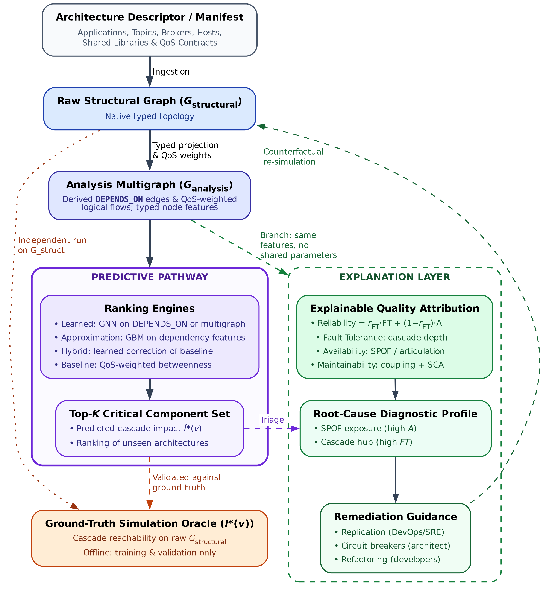
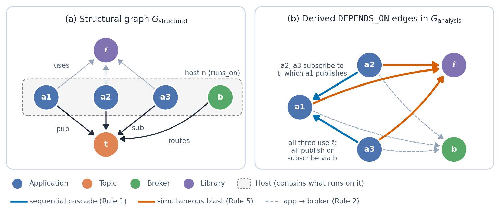

# 3. The Software-as-a-Graph (SaG) Architectural Model

Figure 1 shows the SaG framework. The front end reads Architecture-as-Code manifests, builds a typed multigraph, derives a logical dependency layer that makes failure paths explicit, and extracts typed node properties, so that analytical, hybrid and learned rankings are computed from the same representation and can be compared under identical dependency information.

*Figure 1. End-to-end architecture of the SaG framework. The ranking pathway runs down the center: manifest ingestion, typed structural multigraph (Gstructural), DEPENDS_ON logical dependency projection (Ganalysis) with typed node properties, the ranking methods (analytical, hybrid, and learned; Figure 3), and the ranked critical set. The dashed edge marks the simulation oracles, which operate strictly on Gstructural, provide training and evaluation labels offline, and do not participate in inference. The explanation layer is a conceptual proposal outside the empirical evaluation of this study (Supplementary §S26).*

## 3.1 Multigraph Definition

A distributed system is described as a typed, weighted, directed multigraph $$\tag{1}
\mathcal{G} = (V, E, \tau_V, \tau_E, w_V, w_E),$$ where $V = V_{\text{app}} \cup V_{\text{broker}} \cup V_{\text{topic}} \cup V_{\text{host}} \cup V_{\text{lib}}$ holds the five entity types of Table 1, $\tau_V$ and $\tau_E$ assign entity and relation types, and $w_V, w_E \in (0, 1]$ weight entity criticality and connection strength. An Application’s $w_V$ is the power mean ($p = 3$) of the QoS weights $w(t)$ (§3.2) of its topics. A Library $\ell$ takes the largest weight among its topics $T(\ell)$ and consuming Applications $C(\ell)$, amplified by its fan-out: $w_V(\ell) = \min\bigl(1,\; \max(\{w(t)\}_{t \in T(\ell)} \cup \{w_V(a)\}_{a \in C(\ell)}) \cdot (1 + 0.15 \log_2(1 + |C(\ell)|))\bigr)$. The raw multigraph is $G_{\text{structural}}$; the analysis graph $G_{\text{analysis}}$ adds the derived `DEPENDS_ON` edges (§3.3) and the node properties computed from them (§3.5). Supplementary §S1 lists the notation.

**Scope.** The evaluation ranks *Applications* only: microservice containers, service agents or communicating processes, the developer-authored code that changes in CI/CD. Brokers, Topics, Hosts and Libraries are modeled because failures propagate through them, but ranking them is a provisioning question rather than a commit-time one (§7.5).

**Table 1.** Entity types and structural edge types in the SaG model.

| **Entity Type ($\mathcal{T}_V$)**      | **Architectural Role**                        | **Concrete System Examples**                   |
|:---------------------------------------|:----------------------------------------------|:-----------------------------------------------|
| **Application** ($V_{\text{app}}$)     | Process producing/consuming messages          | ROS 2 node, Kafka microservice, MQTT client    |
| **Broker** ($V_{\text{broker}}$)       | Message routing and queuing intermediary      | RabbitMQ exchange, Mosquitto, EMQX broker      |
| **Topic** ($V_{\text{topic}}$)         | Named logical communication channel           | `/sensor/lidar`, `orders.payment.completed`    |
| **Execution Host** ($V_{\text{host}}$) | Physical or virtualized execution environment | Bare-metal server, Kubernetes worker, Cloud VM |
| **Library** ($V_{\text{lib}}$)         | Shared software package or runtime dependency | Kafka client, OpenCV, Protobuf runtime         |
| **Structural Edge ($\mathcal{T}_E$)**  | **Direction**                                 | **Semantic Meaning**                           |
| `PUBLISHES_TO` / `SUBSCRIBES_TO`       | App/Library $\to$ Topic                       | Component publishes to / consumes from topic   |
| `ROUTES`                               | Broker $\to$ Topic                            | Broker manages and routes topic traffic        |
| `RUNS_ON`                              | App/Broker $\to$ Host                         | Process is hosted on host                      |
| `CONNECTS_TO`                          | Host $\to$ Host                               | Network link between hosts                     |
| `USES`                                 | App $\to$ Library                             | Application links to shared library            |

## 3.2 Quality-of-Service Link Weighting

A `RELIABLE` topic with `TRANSIENT_LOCAL` durability couples services more strongly than a `BEST_EFFORT` telemetry stream. Each topic $t$ therefore has a weight $w(t) \in (0, 1]$ combining its QoS policies (reliability, durability, priority) with payload size and publication frequency. The policy weights come from an Analytic Hierarchy Process (AHP) [87] pairwise-comparison matrix defined independently of any target vector ($CR = 0.016$; Supplementary §S6). Declared QoS policies turned out to carry no measurable signal on either the reachability or the queue-flow simulator (§§6.1 and 6.2); for $I^*$ this is largely fixed by design, because it barely reads QoS (§4.3). The dependency counts reported in this paper are unweighted.

## 3.3 Logical Dependency Projection (`DEPENDS_ON`)

Structural edges do not show how failures spread: a subscriber depends on a publisher, but no edge joins them. SaG therefore derives `DEPENDS_ON` edges from the dependent to the dependency (if the target fails, the source is affected) using the rules of Table 2. The resulting graph is the common input of the analytical, hybrid and learned rankers.

**Table 2.** The `DEPENDS_ON` logical dependency projection rules. Rules 1 and 5 define the operational Application–Library projection evaluated in this study; $^\dagger$rules define broader infrastructure relations formalized for system-level completeness but unexercised by the Application-level evaluation.

|    **Rule**     | **Dependency Category** | **Structural Pattern ($\text{Dependent} \to \text{Dependency}$)**           | **Derived Weight ($w$)**                                                 |
|:---------------:|:------------------------|:----------------------------------------------------------------------------|:-------------------------------------------------------------------------|
|      **1**      | `app_to_app`            | Subscriber $\to$ Publisher (via shared Topic)                               | $1 - \prod_{t \in T}(1 - w(t))$                                          |
| **2**$^\dagger$ | `app_to_broker`         | Publisher/Subscriber $\to$ Broker routing its topics                        | $1 - \prod_{t \in T}(1 - w(t))$                                          |
| **3**$^\dagger$ | `host_to_host`          | Host $\to$ Host (lifted from inter-host app dependencies)                   | $\max_{u \in \text{hosted}(h_1), v \in \text{hosted}(h_2)} w_E(u \to v)$ |
| **4**$^\dagger$ | `host_to_broker`        | Host $\to$ Broker (lifted from hosted app dependencies)                     | $\max_{u \in \text{hosted}(h)} w_E(u \to b)$                             |
|      **5**      | `app_to_lib`            | Application $\to$ Shared Library it `USES`                                  | $H(w_V(\text{app}), w_V(\text{lib}))$                                    |
| **6**$^\dagger$ | `broker_to_broker`      | Broker $\leftrightarrow$ Broker (shared fault-domain colocation, symmetric) | $w_V(\text{host})$                                                       |

Rules 1 and 2 combine the topics $T$ connecting a pair by probabilistic union [88], so multiple failure paths strengthen the connection; Rule 5 uses the harmonic mean $H(x, y) = 2xy/(x+y)$ [89]. Rule 1 captures sequential cascades (a failed publisher starves its subscribers) and Rule 5 simultaneous blasts (a crashed library fails every Application using it); neither is stated explicitly in a manifest. Rules 2, 3, 4 and 6 are formalized for architectural completeness across host and broker tiers, but are not exercised in the present Application-level evaluation.

**Remark 1 (the dependency count is a typed two-hop count).** Let $G_{\text{flow}}$ be the Application–Library projection (Rules 1 and 5) and $v$ an Application. By construction, $$\tag{2}
\texttt{InDeg}(v) \;=\; \bigl|\{\,u \neq v : \exists t \in V_{\text{topic}},\; (v, t) \in \texttt{PUBLISHES\_TO} \wedge (u, t) \in \texttt{SUBSCRIBES\_TO}\,\}\bigr|,$$ because Rule 5 edges end at Libraries, so every edge into an Application is a Rule 1 edge, and parallel topics between a pair collapse into one edge. The right side is publish–subscribe afferent coupling [61, 62], a typed two-hop query on the raw multigraph; the projection defines which query to use (the equality holds exactly on all seventeen corpus graphs). The derivation adds value beyond this count: including Rule 5 raises the agreement of transitive reach with $I^*$ by $+0.058$ (9 of 12 folds, Holm $p = 0.0068$; §6.1). Because $I^*$’s first propagation wave matches this set (§4.4), `InDeg` and its transitive version `Reach` serve as both established structural baselines and first-order analytical references. The in-degree *feature* the learners receive also follows `USES` links; the two differ for 940 of the 1,321 Applications, with per-fold rank agreement $\rho = 0.55$–$1.00$ (Supplementary §S13).

*Figure 2. Running example. (a) Three applications share topic t (routed by broker b) and library ℓ, and all run on host n. No structural edge joins two applications. (b) The derived DEPENDS_ON edges make the hidden dependencies explicit: subscribers a2, a3 depend on publisher a1 (Rule 1), all applications depend on ℓ (Rule 5), and each application depends on the broker (Rule 2; drawn for completeness, but not part of the Application–Library projection evaluated here). Simulation oracles run on view (a); the analytical rankings and the -P learners read view (b), and the raw-graph learners pass messages over view (a) with node features computed from (b).*

## 3.4 Dual Graph Views

The **structural graph** $G_{\text{structural}}$ is the raw deployment topology; the **analysis graph** $G_{\text{analysis}}$ adds the `DEPENDS_ON` edges and code metrics (Figure 2). Every ranker’s node features are computed on $G_{\text{analysis}}$, and no ranker reads simulator output. The learners pass messages either over $G_{\text{structural}}$ or over the `DEPENDS_ON` projection (the `-P` models), and the difference matters: on $G_{\text{structural}}$ every relation points away from Applications (`PUBLISHES_TO`, `RUNS_ON`, `USES`), so forward message passing never reaches them and forward GNNs collapse into per-node models over precomputed features. On the `DEPENDS_ON` graph each Application receives messages from its dependents. Because the views also differ in edge direction, §6.2 adds a raw-graph learner that passes every message in both directions, separating dependency semantics from direction.

## 3.5 Typed Node Feature Encoding

All five entity types share 18 normalized metrics computed on $G_{\text{analysis}}$, including PageRank, reverse PageRank, betweenness, closeness, in- and out-degree, an articulation score, QoS and dependency weights, multi-path coupling, fan-out criticality and the Connectivity Degradation Index (CDI); type-specific blocks extend the vector to 19–25 dimensions (Applications and Libraries add a code-quality penalty and its four static-code inputs). The full schema is in Supplementary §S13. Four centralities use QoS-weighted edges, so the QoS-off condition is not entirely free of QoS. Several features compute part of what the reachability simulator computes: in-degree and its QoS-weighted version $w_{\text{in}}$ are close to `InDeg`, CDI is a removal-and-reachability computation, and multi-path coupling, reverse PageRank, fan-out criticality and the articulation score are also aligned with it. Every published learner reads these *oracle-aligned* features and so inherits part of the oracle’s circularity; §6.2 reports learners with all of them removed.
