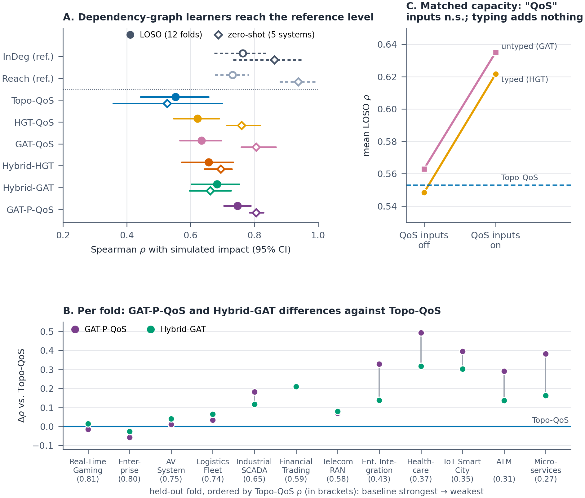
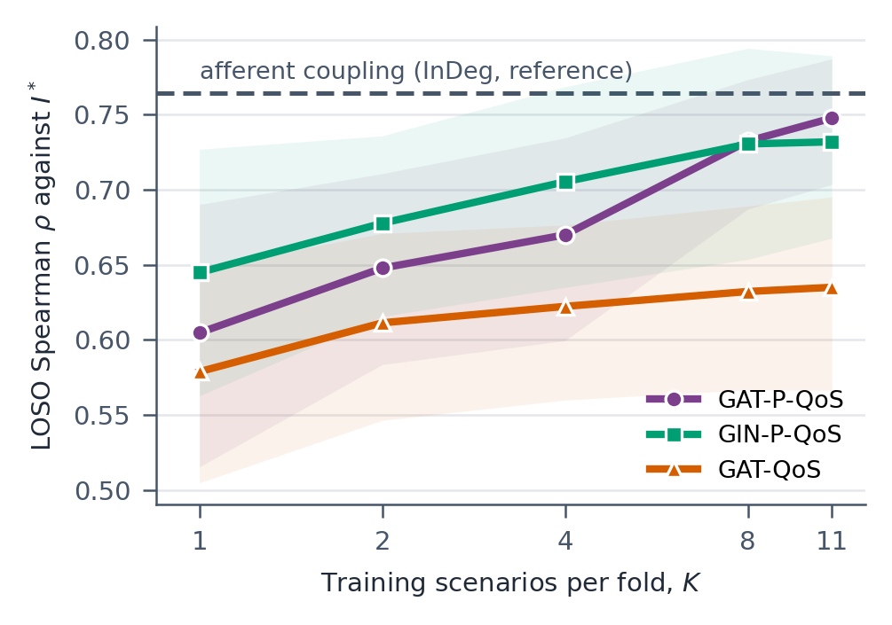

# 6. Results

All results are reported on the Application population against the primary oracle $I^*$ and, in Table 7, also against $I_{\text{dyn}}$ and $I_{\text{comp}}$ (§4.3). §5.3 gives the status of each result; per-fold values are in the experiment pages. Figure 4 summarizes the main findings.

*Figure 4. Main results for the Application population. (A) Mean Spearman ρ with 95% bootstrap intervals under LOSO (filled circles; Table 6) and zero-shot on five system models (open diamonds); grey hollow markers are references that restate I*’s rule (InDeg, Reach). GAT-P-QoS is not significantly different from InDeg, though equivalence within ± 0.05 is not established (TOST p = 0.17). (B) Per-fold improvement of GAT-P-QoS and Hybrid-GAT over Topo-QoS. (C) Cell means of the capacity-matched 2 × 2 on the raw multigraph (Supplementary Table S26): the “QoS” inputs, which include a QoS-weighted in-degree column, raise both models by about 0.07 (not significant after Holm), falling to + 0.030 with win held in both arms (Table 8).*

## 6.1 RQ1: Ranking Accuracy

Table 6 reports every ranker against $I^*$ (learned rankers trained on eleven scenarios and scored on the twelfth; 26 to 300 Applications per fold, $K$ between 5 and 60). Two patterns emerge. Reading the dependency graph instead of the raw multigraph improves attention-based learners (`GAT-P-QoS` $0.748$ vs. `GAT-QoS` $0.635$), although the typed transformer becomes unstable on it (`HGT-P-QoS` $0.514$). And no learned model significantly exceeded the references derived from the same dependencies ($0.732$–$0.808$, against at most $0.748$): the best learner lies above transitive reach and, as a five-seed ensemble ($0.772$, Table 7), above the direct-dependent count, but below the first-order expansion; of these differences only the one with the direct-dependent count was tested, and it is not significant. This is a descriptive comparison rather than a registered contrast (§4.4). Because the registered baseline `Topo-QoS` evaluates QoS-weighted betweenness alone due to an implementation defect, the meaningful structural reference is afferent coupling (`InDeg`, $0.764$). Weighting folds by $|V_{\text{app}}|$ keeps the top five rows but lifts `Topo-QoS` to $0.596$, level with the raw-multigraph learned rankers ($0.595$–$0.606$).

**Table 6.** Main results under LOSO across twelve synthetic architectures (Application population; learned rankers: five seeds, CPU sweeps). $\Delta\rho$ is paired by fold against `Topo-QoS`, with a bootstrap 95% CI and a two-sided Wilcoxon test; $p_{\text{Holm}}$ is within the registered hybrid family; $^\ddagger$exploratory. $\rho_{>0}$: Spearman over active components ($I^* > 0$). Overlap@$K$ ($K \approx 20\%$) breaks ties by deterministic identifier sort; Figure 5 resolves ties at zero in expectation. References restate $I^*$’s rule and carry no contrast. $^\P$Registered comparator, whose articulation term is zero because of an implementation defect (§5.2), so it acts as pure QoS-weighted betweenness; the indented row restores the term ($\rho = 0.533$), so the defect slightly favors the baseline, and no comparative conclusion changes. Further baselines and per-fold values: Supplementary §S44. Underlined: best predictor per column.

| **Ranker**                                                             |  **LOSO $\rho$ [95% CI]**   | **Active $\rho_{>0}$** | **$\Delta\rho$ vs `Topo-QoS` [95% CI]** | **Folds won** | **$p$ ($p_{\text{Holm}}$)** | **Overlap@$K$** |
|:-----------------------------------------------------------------------|:-----------------------------:|:----------------------:|:-----------------------------------------:|:-------------:|:---------------------------:|:---------------:|
| *Reference: restatements of $I^*$’s propagation rule (not predictors)* |                               |                        |                                           |               |                             |                 |
| **Analytic $I^*$**                                                     |    0.808 $[0.755, 0.853]$     |         0.631          |                     —                     |       —       |              —              |      0.536      |
| **InDeg (direct dependents)**                                          |    0.764 $[0.674, 0.840]$     |         0.516          |                     —                     |       —       |              —              |      0.504      |
| **Reach (transitive dependents)**                                      |    0.732 $[0.674, 0.782]$     |         0.286          |                     —                     |       —       |              —              |      0.344      |
| *Training-free baseline (registered comparator)$^\P$*                  |                               |                        |                                           |               |                             |                 |
| **Topo-QoS**                                                           |    0.553 $[0.443, 0.657]$     |         0.280          |                     —                     |       —       |              —              |      0.388      |
| corrected (articulation term restored)                                 |    0.533 $[0.404, 0.650]$     |           —            |                     —                     |       —       |              —              |        —        |
| *Learned, on the dependency graph*                                     |                               |                        |                                           |               |                             |                 |
| **GAT-P-QoS**                                                          | <u>0.748</u> $[0.704, 0.789]$ |      <u>0.440</u>      |  $\underline{+0.195}$ $[+0.100, +0.294]$  |     10/12     |      0.0068$^\ddagger$      |  <u>0.454</u>   |
| **HGT-P-QoS**                                                          |    0.514 $[0.392, 0.636]$     |         0.237          |        $-0.039$ $[-0.155, +0.077]$        |     4/12      |      0.622$^\ddagger$       |      0.380      |
| *Learned and hybrid, on the raw multigraph*                            |                               |                        |                                           |               |                             |                 |
| **HGT-QoS**                                                            |    0.622 $[0.547, 0.690]$     |         0.312          |        $+0.069$ $[-0.046, +0.174]$        |     8/12      |            0.266            |      0.426      |
| **GAT-QoS**                                                            |    0.635 $[0.567, 0.696]$     |         0.338          |        $+0.082$ $[-0.046, +0.201]$        |     7/12      |            0.233            |      0.438      |
| **Hybrid-HGT**                                                         |    0.657 $[0.572, 0.733]$     |         0.345          |        $+0.103$ $[+0.055, +0.152]$        |     11/12     |       0.0034 (0.0068)       |      0.435      |
| **Hybrid-GAT**                                                         |    0.683 $[0.603, 0.753]$     |         0.362          |        $+0.130$ $[+0.075, +0.190]$        |     11/12     |       0.0015 (0.0029)       |      0.450      |

**The reference level.** The references measure how much of $I^*$ restating its rule recovers, not predictive skill. The first-order expansion (Eq. 6) reaches $0.808$ ($\rho_{>0} = 0.631$): direct subscriber loss is most of what $I^*$ measures. `InDeg`, the support of that first wave (Remark 1), is a coarser version of it ($0.764$, $\rho_{>0} = 0.516$), and `Reach` reaches $0.732$. The derivation matters for the latter: without Rule 5, `Reach` drops by $0.058$ (9/12 folds, Holm $p = 0.0068$). Untyped raw-graph metrics do not recover the reference (total degree $0.199$, reverse PageRank $0.089$).

**Learners on the dependency graph approach the reference.** `GAT-P-QoS` reaches $\rho = 0.748$, $0.016$ below the direct-dependent count per seed and $0.008$ above it as a five-seed ensemble ($0.772$, Table 7). Neither difference is significant, and neither shows equivalence: the $90\%$ interval of the per-fold difference is $\pm 0.076$, so a two one-sided test at the registered margin of $\pm 0.05$ does not pass ($p = 0.17$ per seed, $0.13$ for the ensemble). Both differences are also smaller than the per-fold variation that node order alone induces in this learner (about $0.044$; §6.2). The closeness depends on the degree features (§6.2).

**Hybrids beat the baseline, not their base learners.** A hybrid takes the `Topo-QoS` score as an input and corrects its logit, so it nests its comparator. Hybrid-HGT ($+0.103$) and Hybrid-GAT ($+0.130$) beat `Topo-QoS` on 11 of 12 folds, also under the omnibus Holm correction ($p_{\text{omni}} = 0.041$ and $0.019$), the Nadeau–Bengio corrected $t$ ($p = 0.019$ and $0.014$) and $|V_{\text{app}}|$ weighting. Neither differs from its own base learner (Hybrid-HGT vs. `HGT-QoS` $+0.035$, $p = 0.73$; Hybrid-GAT vs. `GAT-QoS` $+0.048$, $p = 0.30$), and the same holds with the articulation defect corrected (Supplementary Table S71). The hybrid gain therefore reflects the weakness of the comparator, not the learned correction. Given `InDeg` as their prior instead, both hybrids land within $\pm 0.012$ of `InDeg` (F10): a learner handed the reference reproduces it.

**Table 7.** Rankers against three oracles, twelve LOSO folds, all $1{,}321$ Applications (registered secondary and exploratory). Feature inputs differ: Eq. 7 and GBM read declared rates, whereas GNNs receive topology and QoS properties without rate features. Partial $\rho$: Spearman with $I_{\text{dyn}}$ after the rank of $I^*$, or of the first-order expansion $\hat{I}^*_1$, is regressed out of both. The two learned blocks use different protocols: GNN rows trained on $I^*$ score the mean of five seeds’ *predictions* (hence higher $I^*$ values than Table 6’s per-seed means, e.g. $0.772$ vs. $0.748$), whereas rows trained on $I_{\text{dyn}}$ ($^\star$, approximations of it) report the mean of per-seed $\rho$, so the two blocks are not directly comparable. Underlined: highest predictor per column among the rows shown; on $I_{\text{comp}}$, raw total degree ($0.719$; Supplementary Table S76, with its $I^*$ and $I_{\text{dyn}}$ values) exceeds the underlined value.

| **Ranker**                                                                                     | $I^*$ $\rho$ | $I_{\text{dyn}}$ $\rho$ [95% CI] | Partial $\rho(\cdot, I_{\text{dyn}} \mid I^*)$ [95% CI] | Partial $\rho(\cdot, I_{\text{dyn}} \mid \hat{I}^*_1)$ | $I_{\text{comp}}$ $\rho$ |
|:-----------------------------------------------------------------------------------------------|:------------:|:----------------------------------:|:---------------------------------------------------------:|:------------------------------------------------------:|:------------------------:|
| *Reference: restatements of $I^*$’s propagation rule (not predictors)*                         |              |                                    |                                                           |                                                        |                          |
| **Analytic $I^*$**                                                                             |    0.808     |       0.706 $[0.629, 0.783]$       |                  0.318 $[0.234, 0.412]$                   |                           —                            |          0.636           |
| **InDeg**                                                                                      |    0.764     |       0.664 $[0.562, 0.758]$       |                  0.272 $[0.188, 0.366]$                   |                         0.079                          |          0.650           |
| **Reach**                                                                                      |    0.732     |       0.583 $[0.510, 0.651]$       |                  0.117 $[0.055, 0.184]$                   |                         0.102                          |          0.302           |
| *Reference: restatement of $I_{\text{dyn}}$’s first-order rule (not a predictor; exploratory)* |              |                                    |                                                           |                                                        |                          |
| **Rate-weighted** (Eq. 7)                                                                      |    0.756     |       0.830 $[0.778, 0.872]$       |                  0.578 $[0.471, 0.679]$                   |                         0.573                          |          0.551           |
| *Training-free baseline*                                                                       |              |                                    |                                                           |                                                        |                          |
| **Topo-QoS**                                                                                   |    0.553     |       0.471 $[0.381, 0.559]$       |                  0.134 $[0.061, 0.204]$                   |                        $-0.091$                        |       <u>0.702</u>       |
| *Learned GNNs (seed ensemble)*                                                                 |              |                                    |                                                           |                                                        |                          |
| **GAT-P-QoS**                                                                                  | <u>0.772</u> |       0.615 $[0.549, 0.673]$       |                  0.111 $[0.016, 0.213]$                   |                         0.182                          |          0.274           |
| **Hybrid-GAT**                                                                                 |    0.702     |       0.599 $[0.514, 0.669]$       |               <u>0.173</u> $[0.082, 0.267]$               |                         0.056                          |          0.585           |
| **Hybrid-HGT**                                                                                 |    0.672     |       0.573 $[0.497, 0.638]$       |                  0.162 $[0.074, 0.252]$                   |                         0.029                          |          0.582           |
| **HGT-QoS**                                                                                    |    0.667     |       0.549 $[0.464, 0.622]$       |                  0.130 $[0.035, 0.224]$                   |                         0.212                          |          0.201           |
| **GAT-QoS**                                                                                    |    0.647     |       0.523 $[0.436, 0.606]$       |                  0.107 $[0.018, 0.199]$                   |                      <u>0.217</u>                      |          0.144           |
| **HGT-P-QoS**                                                                                  |    0.618     |       0.496 $[0.395, 0.601]$       |                  0.112 $[0.033, 0.190]$                   |                         0.087                          |          0.334           |
| *Learned approximations of $I_{\text{dyn}}$ (trained on its labels)*                           |              |                                    |                                                           |                                                        |                          |
| **GBM-P-QoS$\to$dyn$^\star$**                                                                  |    0.764     |            <u>0.799</u>            |                             —                             |                           —                            |          0.477           |
| **GAT-P-QoS$\to$dyn$^\star$**                                                                  |    0.734     |               0.598                |                             —                             |                           —                            |          0.368           |

**Beyond the reachability oracle.** On $I_{\text{dyn}}$, which agrees with $I^*$ at $\rho = 0.711$, the references outperform all GNNs (first-order expansion $0.706$, `InDeg` $0.664$, GNNs $0.496$–$0.615$; Table 7). Partial correlations show what each ranking keeps beyond $I^*$. After removing the rank of $I^*$, `InDeg` keeps $0.272$ $[0.188, 0.366]$, `Reach` $0.117$, `Topo-QoS` $0.134$ and the GNNs $0.107$–$0.173$, all intervals excluding zero; after removing the first-order expansion instead, the raw-multigraph GNNs keep $0.212$–$0.217$, some queue-flow signal beyond the unweighted first-order term but less than the rate-weighted reference ($0.573$).

**What declared rates add on the queue-flow oracle.** Weighting each term of the first-order expansion ($0.706$ on $I_{\text{dyn}}$) by the topic’s declared publication rate (Eq. 7) raises it to $0.830$ $[0.778, 0.872]$ without training (exploratory). A gradient-boosted model trained on $I_{\text{dyn}}$ labels, reading counts, the first-order expansion, declared rates and payload sizes, reaches $0.799$: above the unweighted expansion ($+0.093$, Holm $p = 0.019$), but it falls below the rate-weighted reference, which exceeds it by $+0.031$ $[+0.013, +0.049]$ on 10 of 12 folds (Holm $p = 0.009$ within its exploratory family). The difference is small, comparable to the per-fold variation that node order alone induces in the GNNs (§6.2), so we read it as the learned approximation not exceeding the formula rather than as a margin of superiority. In an exploratory attribution (Supplementary §S42), the declared rate and payload columns alone add $+0.097$ (9/12 folds, Holm $p = 0.021$), and the seven QoS-derived columns ($w(t)$-weighted scores and policy shares) add $-0.005$ ($p = 0.68$). Because $I_{\text{dyn}}$ reads no payload (§4.3), that gain is rate signal; the payload columns cannot carry any. The GNN trained on the same labels, which received no rates, reaches only $0.598$. Given each node’s summed declared rate, and each Rule-1 edge’s share of Eq. 7 as an edge input, it improves on that ($+0.027$, 11 of 12 folds), and a sum-aggregation GNN, which can represent Eq. 7 exactly from these inputs, reaches $0.665$ ($+0.067$, 10 of 12 folds; Supplementary Table S73). Every rate-fed GNN stays far below the gradient-boosted approximation ($-0.134$ for the best) and below Eq. 7 itself ($-0.165$, Holm $p = 0.0015$; Table 8): with the rates in hand, the deficit is not one of missing inputs.

**Learning on top of the rate-weighted reference.** The direct test of whether learning adds value beyond the aligned approximation is a learner that starts from it (Table 8, F12). Given Eq. 7 as one more input column, the gradient-boosted approximation reaches $0.830$, the formula’s value ($+0.000$, 5 of 12 folds, Holm $p = 0.97$); trained to correct the formula’s residual, it reaches $0.824$ ($-0.006$, Holm $p = 0.68$); and the GAT trained on $I_{\text{dyn}}$ with the formula as its prior gains $+0.214$ over the same GAT without it (12 of 12 folds) but still falls below the formula ($0.812$, $-0.018$, 1 of 12 folds, Holm $p = 0.0029$). The learned approximations recover the formula’s information and add none that is detectable here. On $I_{\text{dyn}}$ this approaches equivalence: the interval of the gradient-boosted model given the formula ($[-0.013, +0.015]$) lies well inside $\pm 0.05$, unlike the comparison of `GAT-P-QoS` with `InDeg` on $I^*$.

**How much is left to learn.** The five-seed $I_{\text{dyn}}$ label has an estimated reliability of $r = 0.79$–$0.99$ per fold, so no ranker can exceed $\sqrt{r} \approx 0.89$–$0.996$ (§4.3). Per fold, the formula leaves $\sqrt{r_f} - \rho_f = 0.047$–$0.291$ of attainable agreement (mean $0.132$). The learners started from the formula captured none of it. Whether that residual reflects mechanisms a learner could exploit with more data or is reachable only by simulating queueing is not resolved by this corpus (§7.5).

**The multi-criteria oracle favors different rankers.** On $I_{\text{comp}}$, learned rankers without a prior perform poorly ($0.144$–$0.334$), the hybrids keep $0.58$, and training-free scores aligned with its fragmentation and flow terms rank highest (`Topo-QoS` $0.702$, raw total degree $0.719$), which again reflects overlap with the oracle’s terms. No ranker is best across all three oracles.

**Identifying the critical set.** Figure 5 shows the share of the true top-20% set that each ranker places in its top $k\%$, with ties resolved by averaging. At $k = 20\%$, `GAT-P-QoS` recovers $0.48$ of the critical set and `Topo-QoS` $0.38$; to recover 80%, `GAT-P-QoS` must flag the top 40% ($0.81$), and `Topo-QoS` does not reach 80% within 50%. The references do only slightly better: at $k = 20\%$, `InDeg` recovers $0.49$ (tie-breaking bounds $0.48$–$0.50$), and 80% recall requires the top 45% by `InDeg` ($0.83$) or by the first-order expansion ($0.89$). On $I_{\text{dyn}}$ (panel B), `GAT-P-QoS` reaches $0.74$ at 40% and $0.82$ at 50%, compared to $0.80$ at 40% for the `InDeg` reference; the rate-weighted reference, which restates $I_{\text{dyn}}$’s first-order rule, recovers $0.81$ of that set at 20% and $0.96$ at 30% (exploratory).

*Figure 5. Recall of the true top-20% set (tie-inclusive) by each ranker’s top k%, mean over the twelve LOSO folds, against I* (A) and Idyn (B), over all 1,321 Applications. Ties are resolved in expectation; grey dashed curves are references restating I*’s rule, the black dash-dotted curve in (B) is Eq. 7, and the shaded band gives InDeg’s tie-breaking bounds (Reach’s are much wider, 0.12–0.80 at k = 20%). The dotted line marks 80% recall.*

## 6.2 RQ2: Sources of Predictive Performance

Table 8 collects the registered controls; the full tables, with $I_{\text{dyn}}$, $I_{\text{comp}}$ and zero-shot columns, are in Supplementary §S43.

**Table 8.** Registered control arms (digest): twelve LOSO folds, five seeds, Application population, each run in one CPU invocation with every comparator re-run to an exact match. $\Delta\rho$ is paired by fold against the comparator, with a bootstrap 95% CI; $p_{\text{Holm}}$ is within each family. -deg: `in_degree` and $w_{\text{in}}$ zeroed. `-R`: every raw-graph edge also passed in reverse. `-AP`: articulation term restored. `-min`: every oracle-aligned feature zeroed (§3.5); `-const`: every node feature zeroed; `GIN`: sum aggregation; `+rate-e`: declared publication rates as node and edge inputs; `-tie`: tie-aware listwise loss. Rows trained and scored on $I_{\text{dyn}}$ are marked $\to$dyn; all others are on $I^*$. The node-order row is a registered gate, tested alone (unadjusted $p$). F-numbers name the registered families of the full tables (Supplementary Tables S70, S71, S72 and S73); families without a digest row are reported there only.

| Arm                                                                                                            | Comparator              | $\rho$ |   $\Delta\rho$ [95% CI]   | Folds won | $p_{\text{Holm}}$ |
|:---------------------------------------------------------------------------------------------------------------|:------------------------|:------:|:---------------------------:|:---------:|:-----------------:|
| *F1, F2, F4: degree features, aggregator, and the $2\times2$ with $w_{\text{in}}$ held*                        |                         |        |                             |           |                   |
| GAT-P-QoS-deg                                                                                                | GAT-P-QoS ($0.748$)     | 0.612  | $-0.136$ $[-0.205, -0.072]$ |   1/12    |      0.0049       |
| GIN-P-QoS-deg                                                                                                | GAT-P-QoS-deg         | 0.721  | $+0.108$ $[+0.027, +0.197]$ |   8/12    |       0.157       |
| “QoS” inputs (main effect)                                                                                     | averaged over T         |   —    | $+0.030$ $[-0.023, +0.085]$ |   9/12    |       0.330       |
| *F8, F10: edge direction; the direct-dependent count as a prior*                                               |                         |        |                             |           |                   |
| GAT-QoS-R                                                                                                      | GAT-QoS ($0.635$)       | 0.676  | $+0.041$ $[+0.000, +0.087]$ |   10/12   |       0.064       |
| GAT-P-QoS                                                                                                      | GAT-QoS-R               | 0.748  | $+0.072$ $[+0.034, +0.113]$ |   10/12   |       0.014       |
| GAT-QoS+InDeg                                                                                                  | GAT-QoS                 | 0.763  | $+0.128$ $[+0.063, +0.204]$ |   11/12   |      0.0049       |
| *F11: oracle-aligned features removed (last row descriptive)*                                                  |                         |        |                             |           |                   |
| GAT-P-QoS-min                                                                                                  | GAT-QoS-R-min ($0.378$) | 0.610  | $+0.231$ $[+0.128, +0.340]$ |   10/12   |      0.0068       |
| GIN-P-QoS-min                                                                                                  | GAT-P-QoS-min           | 0.724  | $+0.115$ $[+0.038, +0.199]$ |   9/12    |       0.027       |
| GIN-P-QoS-const                                                                                                | `InDeg` ($0.764$)       | 0.719  | $-0.045$ $[-0.069, -0.024]$ |   1/12    |         —         |
| *F14, F16: sum aggregation with reverse edges on the raw multigraph; tie-aware loss*                           |                         |        |                             |           |                   |
| GIN-P-QoS-min                                                                                                  | GIN-QoS-R-min ($0.485$) | 0.724  | $+0.239$ $[+0.151, +0.335]$ |   12/12   |      0.0015       |
| GIN-P-QoS                                                                                                      | GIN-QoS-R ($0.668$)     | 0.732  | $+0.064$ $[+0.031, +0.099]$ |   10/12   |      0.0049       |
| GAT-P-QoS-tie                                                                                                  | GAT-QoS-R-tie ($0.677$) | 0.747  | $+0.069$ $[+0.031, +0.115]$ |   9/12    |       0.019       |
| *F12, F15: learners started from Eq. 7 or given declared rates, on $I_{\text{dyn}}$; F13: node order permuted* |                         |        |                             |           |                   |
| GBM-P-QoS$\to$dyn+Eq7                                                                                          | Eq. 7 ($0.830$)         | 0.830  | $+0.000$ $[-0.013, +0.015]$ |   5/12    |       0.970       |
| GAT-P-QoS$\to$dyn+Eq7                                                                                          | Eq. 7                   | 0.812  | $-0.018$ $[-0.025, -0.012]$ |   1/12    |      0.0029       |
| GIN-P-QoS$\to$dyn+rate-e                                                                                       | Eq. 7 ($0.830$)         | 0.665  | $-0.165$ $[-0.231, -0.102]$ |   1/12    |      0.0015       |
| GAT-P-QoS-perm                                                                                                 | GAT-P-QoS               | 0.712  | $-0.035$ $[-0.055, -0.014]$ |   3/12    |      (0.012)      |

**The “QoS” factor was mostly the weighted in-degree.** In the capacity-matched $2\times2$ on the raw multigraph (Supplementary Table S26), relation typing has no effect ($-0.014$, $p_{\text{Holm}} = 0.940$) and the “QoS” inputs add $+0.073$ ($p_{\text{Holm}} = 0.127$). The QoS-off arms, however, also zero $w_{\text{in}}$, a QoS-weighted version of `InDeg`; with $w_{\text{in}}$ held in both arms (F4), the “QoS” effect drops to $+0.030$, so more than half of it was the weighted in-degree. Closed-form controls agree: unweighted betweenness ($0.591$) and constant topic weights ($0.595$) match or exceed QoS-weighted betweenness ($0.553$), and permuting QoS profiles across topics has no effect ($\Delta = -0.006$, $p = 0.733$). Because messages never reach Applications on the raw multigraph (§3.4), this $2\times2$ compares per-node models and says nothing about relational typing (§7.2).

**Degree features and the aggregator.** Removing the in-degree and $w_{\text{in}}$ columns lowers `GAT-P-QoS` by $0.136$ (F1). This confirms known expressivity results rather than adding a new one: softmax attention averages over neighbors and cannot count them, whereas sum aggregation can [80, 81], and a GIN of the same size (GINE layers, which add the edge vector to each message) keeps $0.721$ without the same columns (F2, not significant after Holm). In zero-shot transfer the degree columns matter little ($0.810$–$0.821$ without them), because the system models are ranked mostly by separating inert from active components.

**Direction versus dependency semantics.** The $+0.113$ gain of `GAT-P-QoS` over `GAT-QoS` could come from edge direction rather than dependency semantics, so a control passes every raw-graph edge in both directions, with shared weights and an unchanged parameter count (`GAT-QoS-R`, F8). It reaches $0.676$: direction alone recovers $+0.041$ of the gain, which is not significant (Holm $p = 0.064$), and `GAT-P-QoS` still exceeds it by $+0.072$ $[+0.034, +0.113]$ on 10 of 12 folds (Holm $p = 0.014$). The direction effect itself lies within the node-order spread reported below. Reverse edges also cost transfer ($0.744$ zero-shot, against $0.805$–$0.806$; Table 9).

**Without the oracle-aligned features.** Every published learner reads features that compute part of $I^*$ (§3.5). With all of them zeroed (F11), the raw-graph learners collapse (`GAT-QoS` to $0.369$, the reverse-edge control to $0.378$), whereas the dependency-graph GAT keeps $0.610$ and beats the equally stripped reverse-edge control by $+0.231$ (10 of 12 folds, Holm $p = 0.0068$). The oracle-aligned set costs `GAT-P-QoS` $0.138$, about what the two degree columns alone cost. Without them, sum aggregation beats attention on the dependency graph ($+0.115$, 9 of 12 folds, Holm $p = 0.027$), and without any node features at all, a sum-aggregation GNN on the dependency graph reaches $0.719$, $0.045$ below `InDeg` (1 of 12 folds): from structure alone it learns most of the dependent count, which the derived graph makes available and the raw multigraph does not. This too is what sum aggregation’s ability to count neighbors predicts [80, 82].

**Representation or aggregator?** On the raw multigraph a direct dependent is two typed hops away (publisher, topic, subscriber), and the reverse-edge control above averages with attention, so the dependency-graph gain could be an attention artefact that a counting aggregator on the raw graph would remove. A sum-aggregation GNN on the raw multigraph with every edge also reversed (`GIN-QoS-R`; Table 8) reaches $0.668$, level with its attention counterpart ($-0.008$), and with the oracle-aligned features removed it recovers $46\%$ of the gap between the stripped attention models ($0.485$ against $0.378$). The dependency graph still wins under matched sum aggregation: by $+0.239$ without the oracle-aligned features (12 of 12 folds, Holm $p = 0.0015$), by $+0.064$ with them (Holm $p = 0.0049$), and by $+0.289$ with no node features at all, where the raw-graph GNN reaches $0.430$ against the dependency-graph GNN’s $0.719$. The projection’s advantage is therefore not specific to attention: making each direct dependent an in-neighbor gives either aggregator the count that, on the raw multigraph, neither learned from the same eleven training graphs.

**Message passing, node order and the selection rule.** On the raw multigraph, a gradient-boosted model on the same per-node features and no graph (`GBM-Feat`) reaches $\rho = 0.642$ under LOSO, level with `GAT-QoS` ($0.635$), and removing HGT’s reverse pass, its only route to Applications, has no effect (`HGT-QoS-U`, $-0.010$, $p = 0.91$). ListMLE breaks label ties in input order (§4.2); permuting node order before training (F13; `GAT-P-QoS-perm`) scores $0.712$ against $0.748$ ($-0.035$, 3 of 12 folds, $p = 0.012$), which triggered the registered flag. Across three permutations, seeds 17, 18 and 19 give $0.712$, $0.740$ and $0.734$ (mean $0.729$), and the per-fold spread across the three permutations averages $0.044$. All three lie below the published order, so three permutations cannot separate variance from a favorable published order; at their mean, `GAT-P-QoS` sits $0.035$ below the direct-dependent count rather than $0.016$. Tie order is not its main source: with a tie-aware listwise loss, in which tied labels share one risk set, `GAT-P-QoS` is unchanged ($0.747$, $-0.001$, Holm $p = 0.97$), still exceeds the equally trained reverse-edge control ($+0.069$, Holm $p = 0.019$), and three node-order permutations still spread by $0.047$ per fold. The remaining order dependence lies in the order-dependent parts of training, such as the node-level validation split, not in the loss. Learned-ranker differences smaller than this spread should not be read as differences between models; a mixed-effects model with seeds nested in folds gives the same conclusions for the direction, oracle-aligned-feature, aggregator and tie-loss contrasts (Supplementary §S43). Finally, the plan’s nested hyperparameter selection, applied later on the stage-1 grid, changes `HGT-QoS` from $0.622$ to $0.677$ ($+0.055$) and `GAT-P-QoS` from $0.748$ to $0.693$ ($-0.054$), neither significant (Holm $p = 0.259$); nested `HGT-QoS` versus `Topo-QoS` is $+0.123$ on 9 of 12 folds, still not significant (Holm $p = 0.192$). That harness trains on one scenario fewer and stops early on a held-out scenario, so it compares two protocols, not only two configurations (§5.3). Under that protocol `GAT-P-QoS` falls $0.071$ below the direct-dependent count ($3$ of $12$ folds, $p = 0.11$). Configuration swings of $\pm 0.055$ are as large as several differences reported in this section, so every learned result here is conditional on one fixed configuration; no model family received its own tuning budget.

**Training-set size.** Figure 6 retrains three learners on $K$ of each fold’s eleven training scenarios (three nested draws per $K$). On the dependency graph the learners improve with more architectures: `GAT-P-QoS` rises from $0.605$ at $K = 1$ to $0.670$ at $K = 4$ and $0.748$ at $K = 11$ ($+0.078$ from four to eleven, Holm $p = 0.015$), narrowing its gap to the direct-dependent count from $0.160$ to $0.017$, and `GIN-P-QoS` rises from $0.645$ to $0.732$. The step from eight to eleven architectures is small ($+0.015$ and $+0.001$), but its interval for `GAT-P-QoS` ($[+0.003, +0.028]$) does not rule out further gains, so by the registered rule the curve neither saturates nor keeps rising (Supplementary Table S74). On the raw multigraph `GAT-QoS` is flat from $K = 4$ ($0.622$ to $0.635$). Within this generator family, more training architectures brought the dependency-graph learners closer to the dependency count without exceeding it; whether many more would is not tested. At width $64$ instead of $288$, `GAT-P-QoS` loses $0.110$ on every fold ($0.638$), so the published width is not over-parameterized for this task.

*Figure 6. Learning curve under LOSO: Spearman ρ against I* when each fold’s learner is trained on K of its eleven training scenarios (mean over three nested subset draws and five seeds; bands are 95% bootstrap intervals over folds). The dashed line is the direct-dependent count (afferent coupling), a reference that needs no training.*

## 6.3 RQ3: Zero-Shot Transfer to Models of Open-Source Systems

**Table 9.** Zero-shot transfer to hand-authored models of five open-source systems (Application population), without fine-tuning; “zero-shot” applies only to the learned rows. All rows use the same labels. $\rho_{>0}$: rank correlation over active components. Reference rows restate $I^*$’s rule. Brackets give the lowest and highest per-system $\rho$; with five systems a bootstrap interval would be uninformative. Underlined: best predictor per column.

| **Ranker**                                                             | **Evaluation Substrate** | **Mean $\rho$ [min, max]**  | **Active $\rho_{>0}$** |  **PR-AUC**  |
|:-----------------------------------------------------------------------|:-------------------------|:-----------------------------:|:----------------------:|:------------:|
| *Reference: restatements of $I^*$’s propagation rule (not predictors)* |                          |                               |                        |              |
| **Reach**                                                              | Dependency graph         |    0.938 $[0.836, 0.998]$     |         0.871          |    0.933     |
| **InDeg**                                                              | Dependency graph         |    0.863 $[0.620, 0.988]$     |         0.321          |    0.752     |
| *Training-free baseline*                                               |                          |                               |                        |              |
| **Topo-QoS**                                                           | Dependency graph         |    0.526 $[0.289, 0.888]$     |        $-0.088$        |    0.474     |
| *Learned and hybrid, raw multigraph*                                   |                          |                               |                        |              |
| **HGT-QoS**                                                            | Raw multigraph           |    0.760 $[0.710, 0.864]$     |         0.236          |    0.713     |
| **GAT-QoS**                                                            | Raw multigraph           |    0.805 $[0.750, 0.925]$     |         0.319          |    0.790     |
| **Hybrid-HGT**                                                         | Raw multigraph           |    0.695 $[0.596, 0.747]$     |         0.210          |    0.602     |
| **Hybrid-GAT**                                                         | Raw multigraph           |    0.662 $[0.576, 0.748]$     |         0.185          |    0.600     |
| *Learned, dependency graph*                                            |                          |                               |                        |              |
| **GAT-P-QoS**                                                          | Dependency graph         | <u>0.806</u> $[0.774, 0.841]$ |      <u>0.342</u>      | <u>0.838</u> |

Because $I^*$ can be run on any declared model in under a second, zero-shot transfer is not a practical substitute for it; RQ3 instead asks whether what the learners fitted generalizes beyond one generator, the property a learned approximation of an expensive oracle would need. The system models are labeled by $I^*$ only, so transfer of the $I_{\text{dyn}}$ approximations was not tested (§7.5). On the five system models (Table 9), the best learned rankers reach about $0.81$ (`GAT-P-QoS` $0.806$, `GAT-QoS` $0.805$), well above the training-free baseline ($0.526$), but the references rank higher still (`Reach` $0.938$, `InDeg` $0.863$). The difference is structural: half of the system models’ Applications have zero simulated impact ($0.51$, against $0.31$ on the folds) and their fan-in is more concentrated (Gini $0.65$ vs. $0.50$), so separating the inert half already yields a high full-population $\rho$, and `Reach` separates it well. On the active stratum, every predictor is weak (learned $0.185$–$0.342$, training-free baseline negative), as is `InDeg` ($0.321$), while `Reach` keeps $0.871$: on these models, transitive reach is nearly what $I^*$ computes. The baseline prior reduces transfer: both hybrids fall below their base learners ($0.695$ and $0.662$ against $0.760$ and $0.805$), also with the prior’s defect corrected ($0.702$ and $0.668$). Because all five models were written by one modeler (§5.1), these results show that learned rankers transfer broad topological partitioning across one modeler’s style, not reliable discrimination among active components in new architectures. Consequently, neither the learned rankers nor the direct-dependent count should be used to order the active components of an unfamiliar system; only transitive reach, which restates the oracle’s own cascade, does so on these models.

## 6.4 RQ4: Cost

**Table 10.** Like-for-like cost, every stage timed on the same graph in one session (CPU, one thread, median of 3 runs; once at $4{,}995$ components, where the three-type sweep was not run). Count: Application–Library projection plus `InDeg`. One $I^*$ pass: seed 42, Applications. Sweep: the published five-seed labeling run over Applications, Brokers and Libraries. Features: the analysis producing the learned rankers’ node features. Gate: system-layer analysis with 18 anti-pattern detectors, for reference. Corpus row: minimum–median–maximum over the twelve folds.

|  $|V|$ | Count (ms) | One $I^*$ pass (s) | Sweep (s) | Features (s) |   Gate (s) |          Pass : count |           Features : pass |
|-------:|-----------:|-------------------:|----------:|-------------:|-----------:|----------------------:|--------------------------:|
|    249 |        2.5 |               0.26 |      1.63 |         1.46 |       2.05 |           $105\times$ |               $5.7\times$ |
|    499 |        6.6 |               0.79 |      6.59 |         6.49 |      10.01 |           $119\times$ |               $8.2\times$ |
|    999 |       13.1 |               3.90 |     32.42 |        30.57 |      50.92 |           $297\times$ |               $7.8\times$ |
|  1,998 |       35.5 |              18.45 |    157.86 |       160.73 |     275.80 |           $521\times$ |               $8.7\times$ |
|  4,995 |      226.2 |              94.58 |         — |     1,768.81 |   3,072.60 |           $418\times$ |              $18.7\times$ |
| Corpus |   0.4–15.6 |          0.01–0.72 | 0.09–4.98 |   0.07–52.25 | 0.16–81.48 | $17$–$45$–$176\times$ | $4.5$–$16.9$–$72.5\times$ |

Measured like for like (Table 10), one labeling pass of the reachability oracle over a corpus architecture’s Applications takes $0.01$–$0.72$ s, the counting path that restates its first wave is $17$–$176\times$ cheaper (median $45\times$), and the feature extraction every learned ranker needs $4.5$–$72.5\times$ more (median $16.9\times$); the ordering holds on generated graphs of up to $5{,}000$ components. The articulation and CDI phase accounts for $88$–$91\%$ of feature extraction, so this cost belongs to the chosen feature set, not to learned ranking as such: a sum-aggregation GNN with no node features reaches $0.719$ (Table 8, F11) and would not pay it. Where the $I^*$ ranking itself is wanted, running the oracle is therefore cheaper than approximating it with a learned ranker at every size measured. Inference is negligible (tens of milliseconds at $2{,}000$ components); the count scales to $10{,}000$ components ($1.1$ s), `Reach` less well ($23$ s).

The computationally intensive oracle is $I_{\text{dyn}}$: labeling the corpus took $12.7$ CPU-hours (about $7$ s per fault run and seed). The cost comes from simulating every message event to measure an effect that is one hop deep by construction; the rate-weighted reference computes that first-order delivered-rate loss in at most about a millisecond per architecture. Estimating energy as wall-clock time multiplied by the processor’s $28$ W base power (§7.4), labeling the corpus with $I_{\text{dyn}}$ took about $355.6$ Wh, the five-seed $I^*$ labeling sweep $11.1$ s ($0.086$ Wh), and the full detection gate $106.9$ s ($0.83$ Wh). Summed over the twelve folds, the feature extraction that the learned rankers read took $70.0$ s (about $0.54$ Wh), and the dependency count $0.037$ s (about $1$ J). Training is a separate one-off cost per model version: the last sweep with recorded wall-clock took $7.7$ CPU-hours for four learned arms of 60 fits each (Supplementary §S33), about $0.22$ kWh by the same estimate. At these magnitudes, raw per-inference energy differences are practically negligible; what governs operational feasibility in continuous integration (CI/CD) is the amortized lifecycle break-even. A learned model incurs an upfront cost for simulator label generation (about $30$ Wh per corpus architecture, $355.6$ Wh over twelve) plus training ($0.22$ kWh), which must be amortized against recurrent CI evaluation runs. The training-free rate-weighted reference incurs neither cost and was at least as accurate on this corpus, so no learned approximation of $I_{\text{dyn}}$ evaluated here repays its labeling and training cost against it, whatever the number of CI runs.
