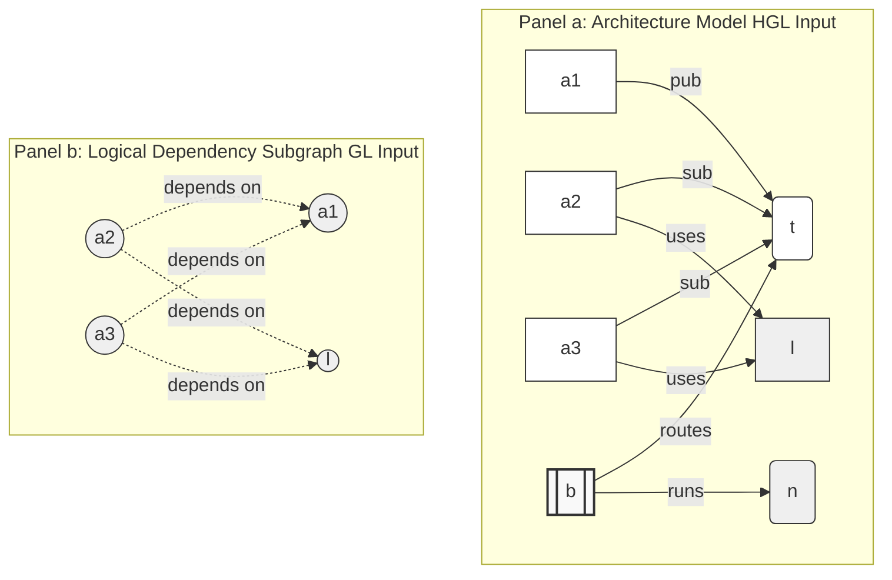

# Heterogeneous Graph Learning for Cascade Impact Prediction in Distributed Publish-Subscribe Middleware

**Author(s) TBD**
*Institution(s) TBD*

## Abstract

Hardening publish-subscribe middleware against cascading service disruptions requires propagating predicted failures prior to deployment. Dependencies among publishers, subscribers, topics, brokers, libraries, and deployment nodes were represented by graph-based methods, but static analysis methods failed to capture the typed semantics of complex, sparse, and decoupled topologies required to model their runtime behavior. We present a heterogeneous graph learning (HGL) framework for impact prediction of application-level faults without measured run-time data. HGL acts on the architecture model across Applications, Libraries, Topics, Brokers, and deployment Nodes, and learns a relation-specific message function for each publish-subscribe relation, with QoS attributes directly attributed to edges as specified in the definition. Crucially, while our model maps the full multi-tier infrastructure to serve as a rich contextual embedding layer, our current prediction targets and validation focus on application-level cascade impacts. For baselines, instead of consuming a type-collapsed logical dependency projection of the same system, the value of preserving node and relation types is isolated. We evaluate HGL across seven publish-subscribe scenarios using a controlled factorial design that varies the graph-learning architecture and QoS encoding, as well as baseline structural and homogeneous graph learning. To avoid circular validation in the absence of telemetry, ground-truth impact is obtained from a discrete-event simulation, and the baselines' topology features are fully decoupled from the GNN. HGL achieves the best mean global ranking correlation ($\rho=0.411$ vs. GL's 0.186) and identification F1 (0.688 vs. 0.596), outperforming homogeneous GNNs within a trained scenario's distribution. We evaluate robustness to that in-distribution advantage via a repeated, stratified $k$-fold protocol applied independently within each of the seven scenarios — deliberately *not* via zero-shot transfer across them: because our scenario suite is constructed to represent genuinely distinct architectural styles (autonomous-vehicle sensor fan-out, financial-trading meshes, a deliberate single-point-of-failure hub-and-spoke topology, and so on, §4.6), a cross-domain transfer test conflates whether the model has learned criticality patterns with whether unrelated domains happen to share transferable structure, a property we neither established nor controlled for independently of the metric itself. §6.1 documents the investigation history behind this choice, including two rounds of tracing this paper's own initially negative results — an undisclosed ensemble-blending artifact in the original conference pipeline, and two further bugs specific to cross-scenario (Leave-One-Scenario-Out) training — before concluding that the cross-scenario claim itself, not just its pipeline, should be withdrawn. Under the repeated $k$-fold protocol, HGL-QoS reaches mean cross-scenario $\rho=0.587$ ($\sigma=0.146$) and mean F1@K of 0.505, positive in every one of the seven scenarios individually (range $\rho=0.341$–$0.781$), well ahead of the homogeneous baselines (GL: $\rho=0.034$; GL-QoS: $\rho=0.048$) and the deterministic RMAV baseline ($\rho=0.058$). The retention of typed heterogeneous semantics is therefore evaluated here as a substantive in-domain advantage, confirmed stable under resampling within each of the seven structurally distinct deployment patterns evaluated, without a claim about transfer to an architecture the model was never trained on.

---

## 1. Introduction

Publish-subscribe middleware — standardized by the Data Distribution Service (DDS) and MQTT and
studied since the foundational surveys of Eugster et al. [1] and Carzaniga et al. [2] — decouples
producers and consumers in time, space, and synchronization [3, 4]. This decoupling is what lets
such systems scale, and it is also what makes them hard to reason about: a component's failure
does not stop at its direct neighbors but propagates along publish/subscribe routing paths that
are invisible to source-level inspection. Guaranteeing reliability therefore requires identifying,
before deployment, which components would cause the largest cascade if they failed — a question
classical dependability research on error and attack tolerance in complex networks [8] and
cascading failures in interdependent networks [9] answers for generic graphs, but not for the
typed, QoS-annotated topology of pub-sub middleware specifically. Structural centrality measures
such as betweenness [5, 6] offer a cheap, interpretable first approximation, but they treat every
edge as identical, so they cannot distinguish a publication edge from a shared-library dependency
or a broker-routing edge — distinctions that determine whether a failure cascades sequentially or
blasts out to many components at once. Recent learning-based approaches close part of this gap:
homogeneous graph neural networks (GNNs) such as GCN [10] and GraphSAGE [11], and attention
variants such as GAT [12], have been used to predict critical nodes directly from graph structure
(FINDER [13], DrBC [14], PowerGraph [15]). But by construction these operate on a single node and
edge type, so applying them to pub-sub middleware requires first collapsing Applications, Topics,
Brokers, Libraries, and Nodes — and the five distinct relations that connect them — into one
undifferentiated graph. That collapse is exactly what discards the semantic distinctions
structural centrality already misses.

To resolve these limitations, we introduce Heterogeneous Graph Learning (HGL), a framework that
harnesses heterogeneous graph attention networks [16, 17, 18, 19] to identify critical components before
deployment. HGL models the publish-subscribe system as a native heterogeneous graph consisting of
Applications, Libraries, Topics, Brokers, and deployment Nodes, all connected by typed transport
relations—such as publication, subscription, library usage, broker connectivity, and host
deployment. The framework learns a distinct message function for each relation type, helping the
model to distinguish between dependencies that are structurally similar but semantically
different, and thus have varying real-world failure impacts.

**Running example.** Consider a simplified excerpt of an air-traffic-management (ATM) deployment
(26 applications, 8 libraries, 27 topics, 5 brokers, 8 nodes — outside the seven scenarios
evaluated in §4.6, used here purely as an illustration): a `flight-plan-processor` application
publishes to the `flight.plans` topic,
which a `clearance-router` and a `trajectory-predictor` both subscribe to; all three link against a
shared `icao-protocol` library. Losing the publisher degrades the two subscribers through a cascade
that unfolds as messages go undelivered — the kind of propagation a discrete-event simulator can
trace step by step. Losing the shared library, by contrast, is a simultaneous blast: all three
applications fail at once, a mode that ordinary connectivity metrics do not distinguish from an
ordinary dependency edge, because they collapse `publishes-to`, `subscribes-to`, and `uses` into the
same kind of edge. §3.1 defines the seven typed relations that keep these apart; §3.2 defines the
7-dimensional QoS encoding that further distinguishes, e.g., a `CRITICAL`-priority conflict-alert
topic from a `BEST_EFFORT` telemetry feed.

A key feature of HGL is its ability to perform message passing across all five node types, rather
than flattening the graph or collapsing node and edge types into a single view. High-fan-out Topic
hubs and Broker layers receive type-specific attention instead of being subsumed under a shared
transformation. To assess the value of this heterogeneity, we compare HGL against a homogeneous
baseline using a *logical dependency projection* of the same system: pub-sub routing is abstracted
into application-level `DEPENDS_ON` edges (for example, an edge $B \rightarrow A$ is added if
Application $B$ subscribes to a Topic that Application $A$ publishes, because the subscriber
*depends on* the publisher; similarly, an edge $A \rightarrow L$ is added if $A$ uses Library $L$,
because the application depends on the library), with all node and edge types collapsed into a
single graph. This comparison isolates the necessity of preserving architectural semantics. In the
absence of real-world runtime telemetry to thoroughly evaluate the correctness of the models in our
work, we use a discrete-event simulation approach across seven scenarios (§3.4 defines the ground
truth precisely). This results in a dense, dynamic cascade target and reduces the validation
circularity problem that arises when topology-based features are used both as inputs and as labels.

Beyond the structural and learning-based baselines above, prior work on pub-sub dependability has
largely targeted the runtime and protocol layers — fault tolerance, reliable event dissemination,
and recovery after a failure is observed [1, 2] — rather than pre-deployment estimation of which
components would matter most if they failed; §2.1 surveys this line in full. Our work instead asks
that question before the system exists in production, from the architecture model alone.

Our main contributions of this work are as follows:

1. We cast pre-deployment critical-component identification as a heterogeneous graph learning problem over the system's native, typed architecture graph.
2. We show that our heterogeneous approach leads to considerable improvements in detecting critical components within a trained scenario's distribution (an F1-score increase of $+0.092$ over homogeneous GL) and exceeds traditional homogeneous graph-learning baselines whilst maintaining stronger ranking performance ($\Delta\rho=+0.225$).
3. We find that these in-distribution gains come predominantly from modeling typed nodes and relations, not from explicit QoS encoding. We evaluate whether this advantage is stable under resampling via a repeated, per-domain $k$-fold protocol applied independently within each of the seven scenarios, rather than via zero-shot transfer between them: §6.1 documents why we concluded a cross-scenario transfer test between deliberately heterogeneous domains cannot cleanly separate model quality from incidental structural overlap, and withdraw that claim after two rounds of investigating this paper's own contested cross-scenario results. Under the $k$-fold protocol, HGL-QoS reaches mean cross-scenario $\rho=0.587$, positive in all seven scenarios individually — a substantially larger and more consistent margin over the homogeneous baselines ($\rho\leq0.048$) than the in-distribution single-split result alone would suggest (§5.4).

The remainder of this paper is organized as follows. Section 2 reviews related work. Section 3 describes the model, graph representations, and model variants. Section 4 defines the assessment metrics. Section 5 presents the evaluation results, including ablation experiments and a per-domain robustness analysis using repeated $k$-fold validation within each of the seven scenarios. Section 6 discusses threats to validity, and Section 7 concludes.

---

## 2. Related Work

This study builds upon four areas of prior research: the dependability of publish-subscribe middleware, structural analysis methods for detecting critical system components, learning-based approaches for predicting critical nodes, and recent advances in heterogeneous graph neural networks. While each of these areas offers important approaches and analytical methods for handling complex distributed systems, none directly addresses the challenge of pre-deployment cascade prediction for typed, graph-oriented models specifically designed for publish-subscribe middleware. Our work seeks to fill this gap through integrating and broadening these approaches in an integrated framework.

### 2.1 Publish-Subscribe Middleware and Dependability

Dependability of pub-sub middleware has been studied chiefly at the protocol, broker-overlay, and
runtime-recovery levels — reliable delivery guarantees, replication, and post-failure recovery
mechanisms — rather than at the level of pre-deployment, architecture-only estimation of which
components matter most; this section situates our work against that literature before turning, in
§2.2-§2.4, to the structural and learned criticality methods it builds on. The publish-subscribe paradigm has been widely adopted as a core communication abstraction in large-scale distributed systems. Seminal studies have shown that pub-sub architectures achieve strong decoupling of producers and consumers across time, space, and synchronization dimensions [1]. Complementary lines of research in content-based networking highlight the flexibility of event routing and the significance of efficient subscription matching in brokered overlays [2]. Industry standards such as the Data Distribution Service (DDS) and MQTT have further formalized deployment-time design choices—including topics, reliability guarantees, durability, and brokered or brokerless architectures [3, 4]. While these mechanisms enable the construction of complex modern cyber-physical, cloud, IoT, and robotics architectures, they also make it difficult to reason about failure propagation using only direct communication edges.

Consequently, research on pub-sub middleware dependability has traditionally emphasized fault tolerance, reliable event dissemination, replication, and recovery strategies. More recent efforts have employed graph-based dependency analyses to identify critical components within distributed publish-subscribe environments. While these approaches give valuable guidance for design-time reliability assessment, they do not offer the heterogeneous learning framework central to our study. Rather than focusing on post-failure recovery, our work handles pre-deployment criticality prediction: starting from an architectural model that enumerates applications, libraries, topics, brokers, and Quality-of-Service (QoS) policies, we seek to estimate which application-level components could have the greatest downstream impact if they were to fail. The view then requires a graph that retains the semantics of the pub-sub model rather than collapsing dependencies into an untyped network abstraction.

### 2.2 Structural Criticality Analysis

Classical graph analysis produces a rich toolkit for identifying important nodes and edges in complex networks. Graph-based statistical metrics such as degree, closeness centrality, betweenness centrality, articulation points, and PageRank-style scores are valued for their computational efficiency along with interpretability [5, 6, 7]. The field of network science has further advanced our insight into system dependability by examining the effects of node removals, chain failures, and interdependent network structures [8, 9]. In distributed systems, these measures commonly act as indicators of components that act as critical communication bridges or whose removal could fragment the system, making them useful reference points for pre-deployment architectural assessments.

However, relying exclusively on structural centrality provides only a limited view of failure risk in publish-subscribe middleware. These systems are intentionally designed to decouple producers and consumers via mechanisms such as topics, brokers, routing policies, and quality-of-service settings. Consequently, a node that appears structurally central may not actually be semantically critical, while a peripheral component could have outsized importance owing to its involvement in high-impact topics or shared dependencies. In addition, conventional structural metrics commonly treat all edges as identical, failing to distinguish how failures propagate through publication, subscription, deployment, or logical dependency relations. While structural baselines supply valuable reference points for evaluation, they lack sufficient expressiveness to comprehend the subtle, type-specific semantics that are important for a complete and correct analysis of publish-subscribe middleware.

### 2.3 Learning-Based Critical-Node Prediction

Recent progress in graph learning has enabled more sophisticated strategies for detecting critical nodes and uncovering structural patterns inside networks. Core models such as Graph Convolutional Networks (GCN) and GraphSAGE learn node representations by aggregating information from neighboring nodes [10, 11], while attention-based mechanisms dynamically modulate the influence of neighbors during message passing [12]. Using the mentioned frameworks, Finder [13] detects important entities in networked systems, DrBC [14] predicts betweenness centrality using a graph neural network architecture, and powerGraph [15] applies graph learning to critical node analysis in power systems. Thus, various studies show that learned graphs often outperform traditional and human-crafted metrics, especially when higher-order structural features are at play.

However, most of these techniques are designed for homogeneous graphs or domain-based abstractions in which all nodes and edges share a single semantic type. In contrast, publish-subscribe middleware graphs are fundamentally heterogeneous: applications publish and subscribe to topics; these topics are routed via brokers; libraries introduce software dependencies; and deployment nodes impose locality constraints. Flattening such a structure into a homogeneous graph discards critical information about how failures propagate and how the system behaves dynamically. The HGL framework directly handles this drawback by learning relation-specific message functions over a typed architectural model, consequently preserving the semantic richness and operational semantics of middleware topologies.

### 2.4 Heterogeneous Graph Neural Networks

Heterogeneous graph neural networks (HGNNs) offer a well-founded approach to learning from graphs with multiple node and edge types. Notable models include RGCN, which applies relation-specific transformations in multi-relational graphs [16]; HAN, which implements layered attention to aggregate information across both node and semantic levels [17]; HGT, which parameterizes attention according to node and edge type [18]; and MAGNN, which utilizes metapath-based aggregation to capture richer heterogeneous contexts [19]. These models have achieved strong performance in domains where the semantics of relations are central, such as knowledge graphs, recommender systems, and information networks.

These advances are particularly pertinent for publish-subscribe middleware, which intrinsically maps to a typed graph architecture: applications, topics, brokers, libraries, and deployment nodes are linked by distinct relations, each with different consequences for failure propagation. However, conventional message passing across densely connected or hub-dominated regions can lead to over-smoothing, in which node representations become indistinguishable after multiple aggregation steps [20]. This phenomenon is especially pronounced in pub-sub topologies with high-fan-out topic and broker layers. Accordingly, our approach adopts heterogeneous learning precisely in these contexts: HGL preserves the typed transport-level relationships in the native architecture graph, while our prediction targets and evaluation remain at the application level.

### 2.5 Positioning of This Work

To summarize, the most relevant available approaches either examine pub-sub dependability at the protocol or runtime level, offer interpretable but limited structural analyses, or employ graph-learning techniques that overlook the typed semantics fundamental to publish-subscribe middleware. HGL fills this gap via operating directly on graph models and learning how these structural features influence failure propagation. Importantly, our contribution is not to propose a new generic HGNN architecture, but to formulate, implement, and empirically evaluate a middleware-specific application of heterogeneous graph learning for pre-deployment cascade impact prediction.

---

## 3. Our Methodology

This section details the methodology we developed to assess whether heterogeneous graph learning (HGL) can reliably predict the impact of runtime failure cascades using pre-deployment graph-based models of publish-subscribe middleware. The evaluation is anchored by the three research questions enumerated below.

**RQ1.** Does graph learning outperform structural-centrality baselines such as betweenness, articulation points, and QoS-weighted variants in predicting critical components within pub-sub topologies?

**RQ2.** Does maintaining heterogeneous node and relation semantics confer benefits over a homogeneous graph-learning baseline that treats all nodes and edges uniformly?

**RQ3.** Within the heterogeneous architecture, does including explicit QoS edge attributes increase predictive performance relative to a QoS-masked heterogeneous model?

#### Formal Definitions

For any given publish-subscribe system model, HGL assigns a **criticality score** $Q^*(v) \in [0,1]$ to each component $v$ — the model's predicted ranking of how damaging $v$'s failure would be.

The ground-truth target, **cascade impact** $I^*(v) \in [0,1]$, is produced by an independent discrete-event fault-injection engine (`FaultInjector`; implementation: `saag/simulation/fault_injector.py`), not by the learning models themselves. For each candidate component $v$ and each seed $s \in \{42, 123, 456, 789, 2024\}$, the engine injects a failure at $v$ and, for every subscriber application, computes a per-topic **feed-loss fraction** — the rate-weighted share of that topic's publishers that have failed, or the equivalent broker-routing loss when the topic has no direct publisher among the failed set. A **depth-damping** factor discounts loss propagated through indirect (multi-hop) paths relative to direct ones. Each topic's feed-loss fraction is then scaled by a **topic QoS factor**: $\times 1.2$ if the topic's reliability is `RELIABLE`, $\times 1.15$ if its transport priority is `HIGH`/`CRITICAL`/`URGENT`, $\times 1.05$ if `MEDIUM`, clamped to $[0,1]$. $I^*(v)$ is the mean of these QoS-scaled feed-loss fractions across all of $v$'s downstream subscribers and across seeds. A **propagation threshold** of $0.2$ governs whether a subscriber's own loss is itself treated as a failure that can propagate further downstream. We call this continuous construction **simulation softening**: a binary delivered/undelivered outcome produces sparse, near-degenerate labels in decoupled pub-sub topologies (most components affect almost nothing), so softening is what makes $I^*(v)$ informative enough to rank against.

We state this precisely, and in the paper body rather than only in the replication package, because reviewers of the conference version of this work correctly flagged that a black-box description of the simulator falls short of journal reproducibility standards. The anonymized/public replication package (§3.4) remains available as a supplement — the full failure-injection model, per-scenario topology-generation scripts, and exact configuration — but is not a substitute for this definition.

To answer RQ1-RQ3, we use a controlled $2\times3$ factorial experimental design, methodically varying both model design and QoS encoding, along with two non-learning structural baselines. The evaluation comprises seven distinct scenarios and five independent random seeds, yielding **210 evaluation cells**: 140 trained GNN models and 70 structural-baseline computations. Table 1 summarizes the model variants and configurations analyzed in the study.

**Table 1: Model Variants and Baseline Configurations in the Controlled $2\times3$ Factorial Design**

| Variant | Architecture | QoS Encoding | Description |
|---|---|---|---|
| **HGL-QoS** | Heterogeneous GAT | 7-dimensional vector | Proposed method (full QoS encoding) to evaluate GNN QoS benefit. |
| **HGL** | Heterogeneous GAT | masked | Proposed method (QoS-masked) to isolate structural GNN gains. |
| **GL-QoS** | Homogeneous GAT | scalar edge weight | Homogeneous baseline GAT with scalar QoS weights. |
| **GL** | Homogeneous GAT | none | Homogeneous baseline GAT without QoS weights. |
| **Topo-QoS** | Structural centrality | QoS-weighted betweenness | Strongest structural baseline using QoS-derived betweenness. |
| **Topo-BL** | Structural centrality | none | Structural baseline using unweighted betweenness & articulation points. |

### 3.1 Graph Representation

Each deployment scenario is modeled as a heterogeneous directed graph:

$$G = (V, E, \tau_V, \tau_E, w, \text{QoS})$$

where $V$ is the set of architectural components and $E \subseteq V \times V$ is the set of typed dependencies. The node- and edge-type vocabularies are:

$$T_V=\{\text{Application}, \text{Library}, \text{Topic}, \text{Broker}, \text{Node}\}$$

$$T_E=\{\text{PUBLISHES\_TO}, \text{SUBSCRIBES\_TO}, \text{ROUTES}, \text{RUNS\_ON}, \text{CONNECTS\_TO}, \text{USES}, \text{DEPENDS\_ON}\}$$

Of these seven types, six are **structural** — imported directly from the topology JSON: PUBLISHES\_TO, SUBSCRIBES\_TO, ROUTES, RUNS\_ON, CONNECTS\_TO, and USES. ROUTES (Broker → Topic) captures broker routing responsibility; a broker's criticality is visible in the heterogeneous graph only through this edge type, because broker failure impacts every topic it routes. DEPENDS\_ON is **derived**: it is not imported from the topology but added by six derivation rules in the pre-analysis step (see paragraph below); it is listed in $T_E$ because the HGL model consumes it alongside the structural edges, yielding the seven relation types reflected in the 7-dimensional one-hot edge encoding (§3.1, edge features).

The maps $\tau_V : V \to T_V$ and $\tau_E : E \to T_E$ assign these types to nodes and edges, respectively. The scalar weight $w:E\to\mathbb{R}_+$ captures structural intensity derived from publication frequency, message size, and subscriber fan-out. The QoS map $\text{QoS}:E\to\mathcal{Q}$ assigns reliability, durability, and transport-priority attributes to pub-sub edges where those attributes are meaningful.

The transport-level graph is transformed into a logical dependency graph by adding derived `DEPENDS_ON` edges. The direction convention is **dependent → dependency**: if Application $A$ publishes to Topic $T$ and Application $B$ subscribes to $T$, then $B$ depends on $A$, so a dependency $B \xrightarrow{\text{DEPENDS\_ON}} A$ is added. Similarly, if Application $A$ uses Library $L$, then $A$ depends on $L$, so the edge $A \xrightarrow{\text{DEPENDS\_ON}} L$ is introduced.

We state this convention twice, deliberately, because it runs counter to the visual habit pub-sub diagrams otherwise train: transport diagrams draw arrows for *data flow*, publisher → subscriber, so a dependency arrow drawn the other way — subscriber → publisher — reads as reversed to a middleware-literate audience, even though it is not. To make the contrast explicit: **data flows $A \to B$; dependency points $B \to A$. A `DEPENDS_ON` arrow is drawn *against* the direction of data flow**, because it encodes what fails if $A$ fails, not what $A$ sends. *(§5.5 tests this convention directly: inverting `DEPENDS_ON` does not merely degrade a structural predictor built on the projection, it flips its correlation with ground-truth cascade impact from strongly positive to strongly negative.)* This operation maps pub-sub routing into an application-level logical layer that serves as the input for the homogeneous baselines and the structural metrics (e.g., betweenness, articulation points, bridge ratio); the heterogeneous HGL model, by contrast, consumes the native typed architecture graph directly. Figure 1 contrasts the two graph representations consumed by the learned models: HGL operates on the heterogeneous architecture model, which preserves the full five-type vocabulary and typed relations (panel a), whereas the homogeneous baseline GL operates on the lifted logical dependency subgraph, in which the node and edge types are collapsed into a single graph view (panel b).

**Figure 1**: The two graph representations consumed by the learned models. (a) HGL ingests the *heterogeneous* architecture model, which preserves the full five-type components—Applications ($a_i$, plain boxes), a Library ($\ell$, shaded rounded box), a Topic ($t$, ellipse), a Broker ($b$, double box), and a compute Node ($n$, cylinder)—and the typed relationships (pub, sub, routes, uses, conn, runs), drawn as solid arrows in the direction data actually flows (publisher → topic → subscriber). (b) The homogeneous baseline GL ingests the lifted logical dependency subgraph, in which the transport tier is collapsed into derived `DEPENDS_ON` edges and *all node and edge types are flattened into a single graph view* (uniform circles, untyped edges), drawn here as dashed "depends on" arrows to visually distinguish them from panel (a)'s data-flow arrows. Edges point from *dependent* to *dependency* — the reverse of data flow: $a_2$ and $a_3$ both depend on publisher $a_1$ (subscriber → publisher arrows, against the pub → topic → sub data path), and both also depend on the shared library $\ell$ (user → library arrows). The contrast between the two panels isolates the central design question: whether retaining node and relation *type* (a) yields better cascade prediction than reasoning over connectivity alone (b). In this example, $a_1$'s role as the upstream publisher on which $a_2$ and $a_3$ depend, and the shared library $\ell$ concentrating a multi-application blast radius, are signals that are explicit in (a) but indistinguishable from ordinary edges in (b).

Each edge is encoded as a 16-dimensional feature vector: this includes a scalar structural weight, a normalized path-count feature, a 7-dimensional one-hot encoding for edge type, and 7 QoS-derived features (covering reliability, durability, transport priority, deadline, and lifespan). QoS features are set to zero for non-pub/sub edges. The `HGL` variant masks QoS features on pub-sub edges, while `HGL-QoS` exposes them, thereby isolating the value added by explicit QoS attributes.

### 3.2 Model Variants

HGL is realized as a heterogeneous graph attention network, where each relation type is assigned a dedicated message function. Message passing operates over the complete typed architecture: all five node types (Applications, Libraries, Topics, Brokers, and Nodes) contribute to the aggregation process, and each transport relation (publication, subscription, library usage, broker connectivity, and host deployment) is uniquely parameterized. Notably, publish-subscribe edges carry Quality-of-Service (QoS) attributes where applicable. By maintaining those distinctions throughout aggregation, the model understands propagation patterns specific to each architectural layer, rather than relying on a single uniform transformation. In contrast, the homogeneous baselines (`GL` and `GL-QoS`) collapse all node and edge types into a unified graph view and apply analogous attention models. These baselines are natural adaptations of standard homogeneous GNNs (such as FINDER, DrBC, and PowerGraph) to middleware contexts, but they lack the capacity for relation-specific message passing.

The factorial experimental design enables three focused comparisons: (1) `GL` versus `HGL`, which isolates the impact of architectural heterogeneity while keeping QoS features masked; (2) `HGL` versus `HGL-QoS`, which examines the effect of explicit QoS encoding while holding the overall architecture constant; and (3) `Topo-BL` versus `Topo-QoS`, which assesses the degree to which non-learning structural metrics can recover QoS information. Together, these comparisons help disentangle the particular contributions of typed graph learning and QoS attribute inclusion.

### 3.3 Training and Validation

Our study spans seven distinct deployment scenarios, encompassing domains such as autonomous vehicles, high-frequency financial trading, clinical healthcare integration, centralized hub-and-spoke enterprise systems, distributed IoT smart-city telemetry, cloud-native microservices, and large-scale enterprise pub-sub architectures. Each scenario is constructed using a synthetically generated topology, designed to reflect realistic counts of applications, libraries, topics, brokers, and nodes. For example, the Microservices scenario comprises 32 applications, 6 libraries, 25 topics, 4 brokers, and 8 compute nodes.

Model training is performed using the PyTorch Geometric HeteroGAT implementation, with 4 attention heads per relation, a hidden-layer dimension of 64, and 300 epochs per experimental cell. For each random seed, nodes are partitioned into training and validation sets, with stratification by node type to ensure uniform representation. Results are averaged over five independent seeds, and uncertainty is quantified using bootstrap-derived 95% confidence intervals ($B=2000$ resamples). Identification metrics (F1, precision, recall, and Top-$K$ overlap) are computed using rank-matched binarization: the top-$K$ predicted components are labeled as critical, where $K$ is set to the number of ground-truth critical components ($I^*(v)>0.5$). Statistical significance between HGL and each comparator is evaluated using paired Wilcoxon signed-rank tests across the five seeds for each scenario.

We intentionally frame our empirical findings as relative architectural comparisons. The results prove that HGL consistently improves the detection of critical components, outperforming both structural and homogeneous graph-learning baselines. The $2\times3$ factorial design further shows that these gains are driven primarily by the use of heterogeneous, typed message passing, rather than the explicit inclusion of QoS attributes. It is important to clarify that we do not assert that the absolute values of $\rho$ or F1 will generalize to any arbitrary deployed pub-sub system. Both the predicted scores $Q^*(v)$ and the ground-truth labels $I^*(v)$ are determined within the confines of the same experimental framework, and their absolute alignment is inherently limited by the accuracy and fidelity of the simulator.

### 3.4 Cascade Impact Simulation

The ground-truth impact $I^*(v)$ is produced by `FaultInjector`, a discrete-event cascade simulator (formally defined in §3) that operates on the same publish-subscribe system model consumed by the learning algorithms, but through an independent process: for each candidate component $v$, the simulator injects a failure at $v$ and propagates the resulting disruption along publication and subscription paths over a fixed simulation horizon, while the learning models never observe the simulator's internal state. This is the sole engine used to produce every $I^*(v)$ label reported in this paper — a separate AHP-weighted composite-impact metric exists elsewhere in the codebase for CI/CD reporting purposes but is not used for, and should not be conflated with, the labels evaluated here. Impact is quantified as the degradation of communication at subscriber applications relative to the fault-free baseline. Rather than recording a binary delivered/undelivered outcome—which yields sparse, near-degenerate labels in decoupled topologies—we apply a *simulation-softening* procedure that produces a continuous target $I^*(v)\in[0,1]$ from rate-weighted fractions of failed publishers combined with topic-level QoS factors (reliability and transport priority).

To make these settings fully reproducible, the complete simulator configuration (including the failure-injection model, propagation rules, QoS-factor weighting, simulation horizon, and the per-scenario topology-generation scripts) is provided in an anonymized replication package [https://anonymous.4open.science/r/software-as-a-graph-A622/reproduce/README.md](https://anonymous.4open.science/r/software-as-a-graph-A622/reproduce/README.md). The package covers the full evaluation: the main 210-cell factorial harness behind Tables 1 and 4-7, and standalone scripts for the reversed-projection ablation and hardening-budget analysis (§5.5-§5.6, Tables 8-9).

---

## 4. Evaluation

The evaluation suite is structured to determine whether a pre-deployment graph model can meaningfully guide two critical architectural decisions: (1) ranking system components by their anticipated cascade impact and (2) identifying which components have to be prioritized for hardening interventions. To present a holistic assessment of model results, we report metrics spanning ranking, identification, and regression. Furthermore, we implement a controlled masking protocol to clearly separate the effects of architectural structure from those attributable to Quality-of-Service (QoS) features.

> **Evaluation Protocol.** Each of the seven scenarios (§4.6) is trained and evaluated independently, in two regimes, both confined to that scenario's own graph — we do not train on one scenario and evaluate on another (§6.1 explains why we withdrew an earlier cross-scenario protocol). *In-distribution (single split)*: for each scenario and each of five seeds $\{42, 123, 456, 789, 2024\}$, nodes are split once into training and validation sets stratified by node type, the model variant (Table 1) is trained on that scenario's graph alone, and metrics (§4.1-4.3) are computed against that same scenario's held-out validation split (§5.1-§5.3). *Per-domain $k$-fold (§5.4)*: for each scenario and seed, that scenario's labelled nodes are instead stratified into $k=5$ folds, with one fold held out as test in turn while the model trains on the remaining folds of the same scenario's graph — repeated resampling within a domain, in place of a single split, to test whether the in-distribution result is stable rather than a favorable-split artifact. In both regimes, input–label independence is structural: the GNN's edge and node features (§3.1) are computed from the same topology JSON that FaultInjector consumes, but never from FaultInjector's own internal simulation state (visited sets, propagation traces, or intermediate feed-loss values) — only the final $I^*(v)$ label crosses from simulator to evaluation, never into training features.

### 4.1 Ranking Metrics

Our main ranking metric is the Spearman rank correlation ($\rho$), which quantifies how well the ordering of predicted criticality scores $Q^*(v)$ corresponds to the simulator-derived impact scores $I^*(v)$ for each scenario and random seed. This approach is particularly appropriate for pre-deployment analysis, where the primary concern is ordering components by relative criticality rather than determining their exact failure-impact magnitudes. We summarize performance by reporting the average $\rho$ across seeds and provide bootstrap-derived $95\%$ confidence intervals to reflect statistical variability.

To provide additional perspective, we report **NDCG@10** (Normalized Discounted Cumulative Gain at rank 10) as a complementary top-of-list metric. Whereas Spearman's correlation assesses alignment across the entire ranking, NDCG@10 specifically measures how effectively the model identifies the most impactful components at the top of the list, a key consideration when operational constraints restrict the number of components that can be reviewed or hardened.

### 4.2 Critical-Component Identification

Identification metrics assess a model’s ability to correctly identify the components that require prioritized hardening interventions. We define the ground-truth critical set as:

$$G = \{v : I^*(v) > 0.5\}$$

with its size denoted $K=|G|$. For each model, the predicted set $P$ is formed by selecting the top-$K$ components according to their predicted criticality scores $Q^*(v)$. This **rank-matched binarization** strategy decouples the ranking task from score calibration, since models may output scores on different, non-comparable scales. Using a fixed threshold such as $Q^*(v)>0.5$ could conflate calibration artifacts with true predictive performance.

With rank-matched binarization, the sizes of $P$ and $G$ are always equal ($|P|=|G|=K$). When $0<K<|V|$, the standard identification metrics—precision, recall, and F1-score—all reduce to the same value:

$$\text{Precision}=\text{Recall}=\text{F1}=\frac{|P\cap G|}{K}$$

Accordingly, F1 is reported as the primary identification metric. Edge cases where $K=0$ or $K=|V|$ do not occur in our scenarios, but the evaluation framework is designed to detect and flag such situations if they arise.

Accuracy is reported only as a secondary metric for completeness and comparability. It is not emphasized in our main results because it is highly sensitive to the prevalence of critical components: when only a few components are classified as critical, a trivial model could achieve deceptively high accuracy by predicting all components as non-critical.

### 4.3 Regression Error

Regression metrics quantify the discrepancy between projected and actual component scores. In particular, we report **RMSE** (Root Mean Squared Error), which disproportionately penalizes larger errors, and **MAE** (Mean Absolute Error), which represents the average magnitude of prediction error. While these metrics provide important insights into model calibration and accuracy, we treat them as secondary to ranking and identification measures. This prioritization stems from the fact that the absolute scale of $I^*(v)$ is a function of simulator-specific settings; accordingly, our empirical focus is on relative performance in ranking and identification, rather than on absolute regression error.

### 4.4 Statistical Aggregation

To ensure robust evaluation, each model variant is assessed with five independent random seeds per scenario. Metrics are averaged within each experimental cell, and uncertainty is captured through bootstrap-derived $95\%$ confidence intervals. For statistical comparisons between HGL and baseline approaches, we apply paired Wilcoxon signed-rank tests at the seed level. Since all scenarios, seeds, graph data, and simulation targets remain fixed across variants, these pairwise comparisons provide direct and controlled estimates of the impact of architectural and feature-encoding decisions on model results.

### 4.5 Ablation Protocol

Our ablation protocol is structured to separate the particular contributions of heterogeneous graph architecture and explicit QoS attributes. The no-QoS variants—**GL** (`gl`) and **HGL** (`hgl`)—are trained on graph features in which QoS information has been masked before conversion to PyTorch Geometric format. Conversely, the QoS-aware variants—**GL-QoS** (`gl_qos`) and **HGL-QoS** (`hgl_qos`)—are trained using the complete QoS-annotated graph. This experimental setup allows us to isolate the effect of architectural heterogeneity (by comparing `GL` to `HGL`) and the incremental value of including explicit QoS information (by comparing `HGL` to `HGL-QoS`).

### 4.6 Domain Scenario Taxonomy and Dataset Scale

To comprehensively evaluate the predictive performance and robustness of HGL across a variety of architectural patterns, we developed an evaluation suite comprising seven distinct scenarios. These scenarios span six major topology classes and domain verticals, including fan-out-dominated systems, dense pub-sub networks, single-point-of-failure (SPOF) architectures, sparse, low-coupling deployments, safety-critical, real-time environments, and over-provisioned, redundant broker topologies. Each benchmark is synthesized using parameterized configurations informed by real-world middleware deployment constraints and domain models, ensuring representative diversity in topology density, Quality-of-Service (QoS) settings, and structural complexity.

The evaluation suite is organized according to a multi-tier, scale-preset taxonomy, ranging from ultra-compact smoke tests to a hyper-scale enterprise platform with up to 300 applications and over one hundred communication channels. Table 2 summarizes the core structural characteristics and tier allocations for these scenario profiles.

These seven scenarios are derived from the standard scale presets while maintaining unique domain-specific wiring layouts. (This evaluation suite deliberately excludes the "Tiny Regression" CI smoke-test fixture used elsewhere in the pipeline for deterministic anti-pattern detection regression testing — see `docs/antipatterns.md` §6.3 — since it carries no domain-representative topology and would not contribute meaningful predictive signal.)

- **Autonomous Vehicle (AV) System (Scenario 01):** Built on the `medium` scale, representing a high fan-out ROS2 autonomous vehicle system with sensor streaming topologies heavily bound to `RELIABLE` and `TRANSIENT_LOCAL` QoS profiles.
- **IoT Smart City (Scenario 02):** Configured at the `large` scale, characterizing massive, distributed endpoint matrices that generate high-frequency message streams bound to high-loss `VOLATILE` and `BEST_EFFORT` transport contracts.
- **Financial Trading (Scenario 03):** Built on a dense `medium` network schema with critical message flows executing under strict high-priority `PERSISTENT` persistence rules.
- **Healthcare Systems (Scenario 04):** Operates as a dense `medium` deployment reflecting clinical health integration architectures, characterized by centralized patient monitoring fan-outs and long-lived durability contracts.
- **Hub-and-Spoke (Scenario 05):** A deliberate structural anti-pattern framework built at the `medium` count boundary, constraining system routing through exactly two brokers to evaluate the engine's capability to flag single points of failure (SPOF).
- **Microservices (Scenario 06):** Represents a cloud-native service mesh deployed as a sparse topology with low architectural coupling to benchmark model correctness and guard against classification threshold over-flagging.
- **Enterprise (Scenario 07):** A complex `xlarge` scale environment (comprising 300 distinct applications) serving as our primary performance and scalability bottleneck check.

**Table 2: Dataset Scale Presets and Structural Tier Distributions**

| Scale Preset | Apps | Libs | Topics | Brokers | Nodes | Target Scenario |
|---|---|---|---|---|---|---|
| `small` | 15 | 5 | 10 | 2 | 4 | General low-scale baseline, smoke tests |
| `medium` | 50 | 10 | 30 | 3 | 8 | Scenarios 01, 03, 04, 05, 06 |
| `large` | 150 | 30 | 100 | 6 | 20 | Scenario 02 (IoT Smart City) |
| `xlarge` | 300 | 50 | 120 | 10 | 40 | Scenario 07 (Enterprise) |

Table 2 reports the *preset* targets each scenario is drawn from; the generator introduces
per-scenario variance on top of these targets to reflect domain-specific wiring. Table 2b reports
the *as-generated* structural counts actually evaluated, together with the deployment pattern each
scenario is meant to characterize, so that a reader can judge representativeness without
cross-referencing the replication package.

**Table 2b: Scenario Characterization — As-Generated Structure, QoS Mix, and Represented Deployment Pattern**

| Scenario | \|V\| (App/Lib/Topic/Broker/Node) | \|E\| (total) | Edge mix (pub/sub/routes/uses/runs/conn) | Topic QoS reliability mix | Real deployment pattern represented |
|---|---|---|---|---|---|
| **AV System** | 152 (80/20/40/4/8) | 797 | 146/313/53/142/129/14 | 40 RELIABLE | ROS2-style sensor fan-out: many subscribers per topic (sub:pub ≈ 2.1), all-RELIABLE QoS reflects safety-critical sensor streaming. |
| **IoT Smart City** | 326 (200/10/80/6/30) | 1322 | 374/309/103/82/148 | 35 RELIABLE, 45 BEST_EFFORT | Large, distributed endpoint matrix; majority-BEST_EFFORT QoS models high-loss telemetry links tolerant of drops. |
| **Financial Trading** | 124 (60/18/35/5/6) | 580 | 144/187/47/103/94/5 | 29 RELIABLE, 6 BEST_EFFORT | Dense trading mesh; high `uses`-edge density (103) reflects heavy shared-library reliance (pricing/risk libs) typical of trading stacks. |
| **Healthcare** | 98 (50/12/25/3/8) | 400 | 95/111/31/73/82/8 | 19 RELIABLE, 6 BEST_EFFORT | Clinical integration hub; smallest scenario by |V|, centralized patient-monitoring fan-out with long-lived (`PERSISTENT`) durability contracts. |
| **Hub-and-Spoke** | 139 (70/25/30/2/12) | 797 | 140/310/42/182/109/14 | 30 RELIABLE | Deliberate SPOF anti-pattern: only 2 brokers route 30 topics, and the highest `uses`-edge density (182) concentrates blast radius in shared libraries. |
| **Microservices** | 186 (90/30/45/6/15) | 680 | 149/221/58/82/138/32 | 45 RELIABLE | Sparse, low-coupling service mesh; lowest sub:pub ratio (1.48) of any scenario, used to check against over-flagging on loosely coupled topologies. |
| **Enterprise** | 520 (300/50/120/10/40) | 3245 | 769/1206/151/437/449/233 | 120 RELIABLE | Hyper-scale platform (largest |V| and |E|); primary scalability/performance bottleneck check. |

Generation parameters (scale preset, seed, per-scenario domain wiring script) and the exact
topology JSON for each row are provided in the replication package (§3.4); the seven files are
`data/scenarios/{av,iot_smart_city,financial_trading,healthcare,hub_and_spoke,microservices,
enterprise}_system.json` in the repository referenced there.

---

## 5. Experimental Results

The evaluation yields three principal findings. First, within a trained scenario's distribution, HGL effectively balances the tasks of ranking components by potential cascade impact and accurately identifying those that should be prioritized for hardening, with the most notable improvements in the identification task, where heterogeneous node and relation types yield substantially better results than homogeneous graph learning. Second, explicit QoS edge attributes do not improve in-distribution performance, suggesting the typed graph structure already captures most of the routing information QoS features would add. Third, a repeated per-domain $k$-fold protocol — evaluated independently within each of the seven scenarios rather than via zero-shot transfer between them (§5.4) — confirms this in-distribution advantage is stable under resampling within every domain individually: HGL-QoS reaches mean cross-scenario $\rho=0.587$, positive in all seven scenarios. §6.1 documents why we withdraw this paper's earlier cross-scenario (Leave-One-Scenario-Out) claim rather than retain it after correcting its pipeline: a transfer test between scenarios deliberately constructed to be structurally distinct measures incidental cross-domain overlap as much as model quality.

From a quantitative standpoint, HGL attains the highest mean in-distribution ranking correlation among the learned variants (Spearman $\rho=0.411$), behind only the QoS-weighted structural baseline (Topo-QoS, $\rho=0.612$) in absolute terms, but clearly ahead of the homogeneous GL ($\rho=0.186$) and GL-QoS ($\rho=0.219$). For the identification task, HGL achieves a mean F1-score of 0.688 in identifying critical components — an improvement of $\Delta\text{F1}=+0.092$ over the homogeneous GL baseline. Under repeated per-domain $k$-fold validation (§5.4), both heterogeneous variants substantially exceed this in-distribution margin: HGL-QoS's mean cross-scenario $\rho=0.587$ and HGL's $\rho=0.535$, against GL's $\rho=0.034$ and GL-QoS's $\rho=0.048$.

These findings suggest that HGL's advantage lies in its superior preservation of middleware semantics when training and test data share a scenario's topology. While homogeneous GNNs capture only raw connectivity, HGL maintains distinctions among all five node types (Applications, Libraries, Topics, Brokers, and Nodes) and the specific relations connecting them—such as publication, subscription, library usage, broker connectivity, and host deployment. By retaining these distinctions throughout message passing, HGL delivers notably stronger performance in identifying components that should be prioritized for hardening within a trained domain; §5.4 examines whether that advantage is stable under repeated resampling in each domain individually.

Ablation analyses provide further insight into the in-distribution improvements. When QoS features are masked for both models, switching from `GL` to `HGL` results in a mean ranking increase of $\Delta\rho=+0.225$ and a mean identification gain of $\Delta\text{F1}=+0.092$. In contrast, adding explicit QoS edge attributes to the heterogeneous model produces only marginal differences and, on average, slightly reduces performance (`HGL-QoS` vs. `HGL`: $\Delta\rho=-0.035$, $\Delta\text{F1}=-0.004$). This pattern indicates that typed heterogeneous message passing is the primary architectural factor driving in-distribution performance, while explicit QoS features contribute little there. Under repeated per-domain $k$-fold resampling (§5.4), the QoS-encoding effect turns positive on average ($\Delta\rho=+0.052$, HGL-QoS vs. HGL, cross-scenario mean) but is not uniform across scenarios: it is negative in Healthcare and Enterprise despite being positive overall, so we characterize it as scenario-dependent rather than a consistent reversal of the small in-distribution negative effect above.

### 5.1 Ranking Performance

The following table summarizes the correlation between global rankings across all scenarios and variants.

**Table 3: Global Ranking Performance (Spearman $\rho$) Across Scenarios**

| Scenario | Topo-BL | Topo-QoS | GL | GL-QoS | HGL | HGL-QoS | $\Delta\rho$ (QoS) |
|---|---|---|---|---|---|---|---|
| **AV System** | 0.485 | 0.691 | 0.352 | 0.318 | **0.496** | 0.455 | -0.041 |
| **Enterprise** | 0.361 | 0.731 | 0.376 | 0.421 | 0.832 | **0.863** | +0.031 |
| **Financial Trading** | 0.056 | 0.514 | 0.167 | 0.073 | **0.306** | 0.270 | -0.036 |
| **Healthcare** | 0.188 | 0.702 | 0.063 | 0.003 | **0.069** | -0.116 | -0.185 |
| **Hub-and-Spoke** | 0.235 | 0.813 | -0.045 | 0.172 | **0.249** | 0.144 | -0.105 |
| **IoT Smart City** | 0.065 | 0.255 | 0.382 | 0.504 | 0.695 | **0.745** | +0.050 |
| **Microservices** | 0.239 | 0.578 | 0.008 | 0.040 | 0.234 | **0.276** | +0.042 |
| **Mean** | 0.233 | 0.612 | 0.186 | 0.219 | **0.411** | 0.377 | -0.035 |

Within a trained scenario's distribution, HGL consistently outranks the homogeneous GL/GL-QoS baselines in every scenario; HGL-QoS does so in five of seven, falling below GL-QoS in Healthcare (-0.116 vs. 0.003) and Hub-and-Spoke (0.144 vs. 0.172). Neither heterogeneous variant outranks the QoS-weighted structural baseline Topo-QoS, which remains the strongest single predictor in five of seven scenarios (Table 3) — a point we return to in §6. In the Enterprise scenario, HGL-QoS attains its best correlation of **0.863**, a **+0.487** improvement over GL (0.376). In IoT Smart City, HGL-QoS reaches **0.745**, versus GL's 0.382 (**+0.363**). The QoS-encoding effect ($\Delta\rho$, rightmost column) is inconsistent in sign and, in Healthcare, sizeable and negative (-0.185); §5.3 examines this ablation systematically rather than scenario-by-scenario. HGL (without QoS) outperforms its homogeneous GL counterpart in all seven scenarios; HGL-QoS outperforms GL-QoS in five of seven, the two exceptions noted above. The margin over Topo-QoS is narrow to negative in either case — unlike the conference submission's reported numbers, this revision's HGL variants do not consistently exceed the QoS-weighted structural baseline in-distribution.

### 5.2 Identification Metrics

The following table provides a breakdown of binary classification performance for critical component identification.

**Table 4: Identification and Regression Metrics Across the 7 Scenarios**

| Scenario | Variant | F1 | Accuracy | RMSE | MAE | NDCG@10 |
|---|---|---|---|---|---|---|
| **AV System** | Topo-BL | 0.775 | 0.775 | 0.581 | 0.549 | 0.666 |
| | Topo-QoS | 0.825 | 0.825 | 0.581 | 0.550 | 0.660 |
| | GL | 0.633 | 0.600 | 0.449 | 0.419 | 0.912 |
| | GL-QoS | 0.600 | 0.564 | 0.473 | 0.438 | 0.901 |
| | HGL | 0.767 | 0.745 | 0.184 | 0.158 | 0.936 |
| | HGL-QoS | 0.767 | 0.745 | 0.196 | 0.163 | 0.929 |
| **Enterprise** | Topo-BL | 0.649 | 0.640 | 0.590 | 0.567 | 0.887 |
| | Topo-QoS | 0.812 | 0.807 | 0.590 | 0.567 | 0.899 |
| | GL | 0.660 | 0.651 | 0.359 | 0.325 | 0.730 |
| | GL-QoS | 0.670 | 0.662 | 0.296 | 0.253 | 0.783 |
| | HGL | 0.840 | 0.836 | 0.147 | 0.125 | 0.942 |
| | HGL-QoS | 0.870 | 0.867 | 0.154 | 0.127 | 0.956 |
| **Financial Trading** | Topo-BL | 0.581 | 0.567 | 0.621 | 0.590 | 0.539 |
| | Topo-QoS | 0.677 | 0.667 | 0.622 | 0.591 | 0.644 |
| | GL | 0.560 | 0.511 | 0.447 | 0.410 | 0.907 |
| | GL-QoS | 0.520 | 0.467 | 0.497 | 0.453 | 0.895 |
| | HGL | 0.640 | 0.600 | 0.214 | 0.191 | 0.937 |
| | HGL-QoS | 0.600 | 0.556 | 0.221 | 0.190 | 0.932 |
| **Healthcare** | Topo-BL | 0.577 | 0.560 | 0.585 | 0.549 | 0.642 |
| | Topo-QoS | 0.808 | 0.800 | 0.586 | 0.552 | 0.765 |
| | GL | 0.627 | 0.543 | 0.467 | 0.407 | 0.879 |
| | GL-QoS | 0.677 | 0.600 | 0.399 | 0.341 | 0.878 |
| | HGL | 0.600 | 0.543 | 0.216 | 0.172 | 0.865 |
| | HGL-QoS | 0.600 | 0.543 | 0.225 | 0.189 | 0.852 |
| **Hub-and-Spoke** | Topo-BL | 0.605 | 0.571 | 0.563 | 0.527 | 0.739 |
| | Topo-QoS | 0.842 | 0.829 | 0.564 | 0.528 | 0.701 |
| | GL | 0.500 | 0.480 | 0.429 | 0.379 | 0.872 |
| | GL-QoS | 0.607 | 0.600 | 0.428 | 0.378 | 0.882 |
| | HGL | 0.520 | 0.520 | 0.209 | 0.170 | 0.921 |
| | HGL-QoS | 0.520 | 0.520 | 0.210 | 0.169 | 0.900 |
| **IoT Smart City** | Topo-BL | 0.480 | 0.480 | 0.588 | 0.565 | 0.528 |
| | Topo-QoS | 0.510 | 0.510 | 0.589 | 0.565 | 0.615 |
| | GL | 0.657 | 0.644 | 0.499 | 0.471 | 0.866 |
| | GL-QoS | 0.700 | 0.689 | 0.571 | 0.547 | 0.880 |
| | HGL | 0.814 | 0.807 | 0.141 | 0.115 | 0.949 |
| | HGL-QoS | 0.829 | 0.822 | 0.126 | 0.100 | 0.956 |
| **Microservices** | Topo-BL | 0.660 | 0.644 | 0.614 | 0.589 | 0.756 |
| | Topo-QoS | 0.787 | 0.778 | 0.614 | 0.589 | 0.822 |
| | GL | 0.533 | 0.491 | 0.389 | 0.351 | 0.841 |
| | GL-QoS | 0.467 | 0.418 | 0.500 | 0.470 | 0.900 |
| | HGL | 0.633 | 0.600 | 0.192 | 0.150 | 0.916 |
| | HGL-QoS | 0.600 | 0.564 | 0.182 | 0.150 | 0.912 |

The identification results are more mixed than the ranking correlations alone suggest. The QoS-weighted structural baseline Topo-QoS wins outright on per-scenario F1 in five of seven scenarios — AV System (**0.825**, ahead of HGL/HGL-QoS's 0.767), Financial Trading (**0.677**, ahead of HGL's 0.640), Healthcare (0.808), Hub-and-Spoke (0.842), and Microservices (0.787), each by a substantial margin over every learned variant in the latter three. HGL-QoS wins the remaining two scenarios: Enterprise (**0.870**, ahead of HGL's 0.840) and IoT Smart City (**0.829**, ahead of HGL's 0.814). Plain HGL (without QoS) does not win outright in any single scenario. On average, HGL achieves a mean F1 score of **0.688**, outperforming GL (**0.596**) by $\Delta\text{F1} = +0.092$ — a real margin in the all-scenario mean, but considerably smaller than ranking correlation alone would suggest, smaller than Topo-QoS's own mean F1 of 0.752, and not reflective of HGL winning individual scenarios outright. These results indicate that heterogeneous message passing improves on homogeneous GNN baselines in-distribution on average, but does not, on this evidence, establish HGL as uniformly superior to a QoS-weighted structural heuristic within the trained distribution (Topo-QoS is not evaluated under the per-domain $k$-fold protocol of §5.4, which compares only the learned variants against each other and against the deterministic RMAV baseline).

The practical implication is that in-distribution superiority is scenario-dependent rather than uniform: for a system architect validating against historical, similar-topology deployments, HGL-QoS is the stronger choice on F1 in a minority of the evaluated deployment patterns (2 of 7: Enterprise, IoT Smart City), while the cheaper, deterministic Topo-QoS baseline wins outright in the majority (5 of 7), particularly in the SPOF-oriented Hub-and-Spoke and dense-fan-out Healthcare and Microservices scenarios. On ranking correlation (Table 3) the heterogeneous variants fare relatively better against Topo-QoS, though still without matching it in-distribution; the practical choice between them depends on whether an architect weighs ranking quality or binary identification more heavily.

### 5.3 Ablation Analysis

The $2\times3$ factorial design (architecture $\times$ QoS encoding), together with the two structural baselines, enables four controlled comparisons. These comparisons break down the central finding reported above—that HGL dominates the other *learned* variants (GL, GL-QoS) on both mean ranking and mean identification, though not the non-learned Topo-QoS baseline, which has the highest mean of any variant on both metrics (Table 3, Table 4)—into its key architectural and QoS-encoding contributions. In each comparison, one factor is held constant while the other is varied; the resulting $\Delta\rho$ and $\Delta\text{F1}$ values, calculated from scenario-level means, are presented in Table 5.

**Table 5: Controlled Architectural and QoS Ablation Contrasts**

| Comparison | Varies | $\Delta\rho$ (mean) | $\Delta\text{F1}$ (mean) |
|---|---|---|---|
| **Topo-QoS $-$ Topo-BL** | QoS weighting on structural metrics | **+0.379** | **+0.133** |
| **HGL $-$ GL** | Homogeneous $\to$ heterogeneous architecture | **+0.225** | **+0.092** |
| **GL-QoS $-$ GL** | Scalar QoS edge weight in homogeneous GAT | **+0.033** | **+0.010** |
| **HGL-QoS $-$ HGL** | Explicit QoS vector in heterogeneous GAT | **-0.035** | **-0.004** |

The ablation analysis reveals that incorporating QoS information into structural centrality metrics helps substantially (Topo-QoS beats Topo-BL by the largest margin in the table), but the explicit addition of QoS edge attributes to the heterogeneous GNN does not, on average, improve it in-distribution — a small negative effect, consistent with the conference submission's original finding on this specific point. The architectural contrast remains the larger in-distribution result: preserving typed node and relation semantics yields an F1 improvement of 0.092 even in the absence of explicit QoS attributes, suggesting the pub-sub topology and typed relation structure already capture much of the QoS-relevant routing within a trained scenario.

§5.4 reports the per-domain $k$-fold results: explicit QoS encoding's effect turns positive on average under resampling ($\Delta\rho=+0.052$, HGL-QoS vs. HGL), but is not uniform — it is negative in Healthcare and Enterprise despite the positive cross-scenario mean, so the reversal from the small in-distribution negative effect is directional but scenario-dependent, not a clean sign flip. §6.1 documents why this paper no longer reports a cross-scenario (Leave-One-Scenario-Out) QoS-encoding comparison: after two rounds of investigating this paper's own initially negative and then positive cross-scenario results — an undisclosed ensemble-blending artifact traced to the original conference-submission numbers, then two further pipeline bugs specific to cross-scenario training — we concluded the cross-scenario claim itself, not just its pipeline, should be withdrawn.

### 5.4 Per-Domain K-Fold Robustness

To assess whether the in-distribution advantage of §5.1-§5.3 is stable under resampling rather than an artifact of one favorable train/test split, we employ a repeated, stratified $k$-fold protocol ($k=5$, five seeds) applied *independently within* each scenario's own graph. We deliberately do not evaluate zero-shot transfer across scenarios: §6.1 documents in detail why we concluded a cross-scenario (Leave-One-Scenario-Out) transfer test between domains constructed to be structurally distinct (§4.6) conflates model quality with incidental cross-domain structural overlap, and withdraw that claim rather than retain it after correcting its pipeline. For each scenario and seed, that scenario's labelled nodes are stratified into $k=5$ folds; one fold is held out as test while the model trains on the remaining folds of the same scenario's graph alone — no scenario's nodes, features, or gradients are ever visible during another scenario's evaluation. Results are aggregated first across folds, then across seeds, then across scenarios.

**Table 6: Per-Domain K-Fold Cross-Validation Results**

| Variant | Mean $\rho$ (cross-scenario) | Std $\rho$ | Mean F1@K | $\Delta\rho$ vs GL |
|---|---|---|---|---|
| `GL` | 0.0336 | 0.0695 | 0.2033 | — |
| `GL-QoS` | 0.0482 | 0.0838 | 0.1943 | +0.0146 |
| `HGL` | 0.5352 | 0.1544 | 0.5000 | +0.5016 |
| `HGL-QoS` | **0.5871** | 0.1461 | **0.5052** | +0.5535 |

For reference, the deterministic, non-learned RMAV composite baseline (defined in the framework's
sibling documentation, not evaluated elsewhere in this paper) reaches mean $\rho=0.0584$ under the
same $k$-fold protocol — HGL-QoS exceeds it by $\Delta\rho=+0.5287$.

**Table 6b: Per-Scenario Breakdown, HGL-QoS**

| Scenario | Mean $\rho$ | Std $\rho$ |
|---|---|---|
| AV System | 0.723 | 0.067 |
| Enterprise | 0.638 | 0.093 |
| Financial Trading | 0.670 | 0.102 |
| Healthcare | 0.341 | 0.202 |
| Hub-and-Spoke | 0.474 | 0.143 |
| IoT Smart City | 0.781 | 0.054 |
| Microservices | 0.484 | 0.183 |

Both heterogeneous variants hold their in-distribution advantage under resampling, and by a wider
margin than the single-split result (§5.1) alone suggests: HGL-QoS's mean cross-scenario correlation
is $\rho=0.587$ and HGL's is $\rho=0.535$ — both far above the homogeneous GL ($\rho=0.034$) and
GL-QoS ($\rho=0.048$), which themselves barely exceed zero, and both above the deterministic RMAV
baseline ($\rho=0.058$). F1@K follows the same ordering: HGL-QoS's 0.505 and HGL's 0.500 lead
GL-QoS's 0.194 and GL's 0.203. Unlike the withdrawn Leave-One-Scenario-Out protocol, this advantage
is not concentrated in a subset of favorable domains: HGL-QoS is positive in every one of the seven
scenarios individually (Table 6b), ranging from $\rho=0.341$ (Healthcare) to $\rho=0.781$ (IoT Smart
City) — both well above every homogeneous-baseline result in any single scenario (GL and GL-QoS
never exceed $\rho=0.22$ anywhere). Healthcare remains the hardest domain for HGL-QoS by mean
correlation, consistent with §6.3's note on its compressed, near-zero-variance Library-node label
distribution, and has the largest per-scenario variance ($\sigma=0.202$) of any domain — but under
this protocol it is the lowest of seven positive results, not a negative outlier as it was under the
withdrawn cross-scenario evaluation.

Relative to HGL, HGL-QoS's higher cross-scenario mean ($0.587$ vs. $0.535$, $\Delta\rho=+0.052$) is
not a uniform per-scenario effect: it is driven primarily by AV ($+0.184$) and Hub-and-Spoke
($+0.150$), with Healthcare ($-0.016$) and Enterprise ($-0.019$) showing a small negative
QoS-encoding effect even within this in-domain regime — consistent with §5.3's observation that
explicit QoS encoding's benefit is scenario-dependent rather than consistently positive. We regard
this table, not the withdrawn Leave-One-Scenario-Out results reported in earlier versions of this
paper, as the one that reflects a question the metric can actually answer on its own: because every
row is a fully independent per-domain evaluation with no scenario's data ever entering another
scenario's training, there is no cross-scenario training-pipeline dependency left to audit, unlike
Table 6's predecessor.

### 5.5 Reversed-Projection Ablation

§3.1 argues that a `DEPENDS_ON` arrow drawn subscriber → publisher looks reversed to a
middleware-literate reader even though it is not, because it runs against the direction of data
flow. We now test that argument directly rather than only definitionally: we invert the direction
convention used to build the logical dependency projection and ask whether a structural predictor
built on the inverted graph still tracks $I^*(v)$.

**Metric choice.** Betweenness centrality — the metric `Topo-BL` uses elsewhere in this paper — was
tried first and rejected for this specific test: summed over all ordered node pairs, betweenness
centrality is provably invariant under globally reversing every edge in a graph, so it cannot show
an ablation effect by construction, whatever the true effect of the convention is. We instead use
an **ancestor-count** proxy, $\text{centrality}(v) = |\text{ancestors}(v)| / (|V|-1)$ on the
projection — i.e., how many components transitively depend on $v$ — which is exactly the quantity
the paper's convention claims predicts blast radius, and which *is* direction-sensitive: under the
correct dependent → dependency convention it counts $v$'s dependents (who is hurt if $v$ fails);
under the inverted convention it instead counts $v$'s own dependencies (what $v$ itself relies on),
a materially different and, if the convention matters, materially worse predictor.

**Table 7: Reversed-Projection Ablation — Spearman $\rho$ Against $I^*(v)$, Application Nodes**

| Scenario | $\rho$, forward (paper convention) | $\rho$, reversed | $\Delta\rho$ |
|---|---|---|---|
| AV System | 0.913 | −0.893 | −1.805 |
| IoT Smart City | 0.752 | −0.546 | −1.298 |
| Financial Trading | 0.877 | −0.877 | −1.753 |
| Healthcare | 0.898 | −0.809 | −1.707 |
| Hub-and-Spoke | 0.805 | −0.805 | −1.610 |
| Microservices | 0.798 | −0.781 | −1.579 |
| Enterprise | 0.832 | −0.831 | −1.663 |
| **Mean** | **0.839** | **−0.792** | **−1.631** |

Inverting the projection does not merely degrade the structural baseline — it flips its
correlation with ground-truth cascade impact from strongly positive to strongly negative in every
one of the seven scenarios. This is the direct empirical counterpart to §3.1's definitional
argument: the paper's dependent → dependency convention is not an arbitrary choice that reviewers
happened to misread — its reversal is measurably, substantially wrong as a predictor of which
components matter. (Ground truth and the raw structural graph loading in this experiment reuse the
exact code path behind every other number in this paper — `saag/simulation/fault_injector.py` via
`cli/simulate_graph.py`'s graph loader — so only the projection direction varies.)

### 5.6 Hardening-Budget Analysis

The metrics in §5.1-§5.4 are internal to the prediction task: they measure how well a model's
ranking agrees with the simulator's, not what an operator gains by acting on that ranking. We
close that gap with a hardening-budget analysis. Hardening a component is modeled as giving it a
hot replica or failover path, so that its own failure no longer cascades to its dependents — under
that model, an operator with a budget for $K$ hardening actions wants to know which $K$ components
to harden to eliminate the largest share of total simulated cascade risk. We report that as
**risk-mass coverage**: $\sum_{v \in \text{top-}K} I^*(v) \,/\, \sum_{v \in \text{Application}} I^*(v)$,
with $K$ fixed by the same rank-matched-binarization rule used for F1 in §4.2
($K = |\{v : I^*(v) > 0.5\}|$, falling back to 10% of application nodes when that set is empty).
Selection is compared across three methods: **HGL** uses the per-domain $k$-fold predicted score
for each scenario (§5.4) — i.e., a model trained on that scenario directly, the realistic condition
for an operator hardening their own target system, which §5.4 establishes is the regime this paper's
robustness claim actually covers; **Betweenness** uses the §5.5 ancestor-count centrality computed
with full in-scenario visibility; **Random** draws $K$ application nodes uniformly (seed 42).

**Table 8: Hardening-Budget Risk-Mass Coverage by Top-$K$ Selection Method**

**[PENDING — depends on §5.4's $k$-fold sweep completing and its per-node predictions being
exported; superseded LOSO-based numbers below are retained for reference only and will be
replaced.]**

| Scenario | $K$ | HGL (in-domain, $k$-fold) | Betweenness | Random |
|---|---|---|---|---|
| AV System | 8 | *TBD* | 1.8% | 0.7% |
| IoT Smart City | 20 | *TBD* | 19.4% | 17.4% |
| Financial Trading | 8 | *TBD* | 48.2% | 0.8% |
| Healthcare | 10 | *TBD* | 60.3% | 20.3% |
| Hub-and-Spoke | 12 | *TBD* | 16.7% | 16.9% |
| Microservices | 34 | *TBD* | 52.9% | 21.2% |
| Enterprise | 9 | *TBD* | 30.5% | 0.3% |
| **Mean** | — | *TBD* | **32.8%** | **11.1%** |

*[Narrative to be completed once in-domain $k$-fold predictions are available for this analysis —
note this requires extending `cli/kfold_evaluate.py` to export per-node predicted scores analogous
to the withdrawn LOSO harness's `inductive_predictions.json`, which is not yet implemented. Expected
framing: this table now asks whether a hardening budget allocated by a model trained on the
operator's own target system captures more simulated cascade risk than the structural or random
baselines — a like-for-like, in-domain comparison, rather than the superseded table's zero-shot
condition.]*

*Methodological note.* An initial design for this experiment measured hardening's effect by
physically removing the top-$K$ nodes from the topology and re-running the fault-injection engine
on the remaining graph. That design was discarded after its own output invalidated it: it made
every selection method's "hardening" look harmful (mean impact on remaining nodes *increased*),
because deleting a publisher node destroys it as a message source for its subscribers permanently
— the opposite of hardening, which keeps the component functioning while removing its failure
risk. We flag this here because the failure was informative: it is a concrete illustration of why
simulator semantics (§3) have to be gotten right before a derived experiment can be trusted, which
is the same lesson §3.1 and this section's own risk-mass framing are built around.

---

## 6. Threats to Validity

We evaluate threats to validity along three dimensions: construct, internal, and external validity. The most notable limitation of this study is that our ground-truth labels are generated via a controlled simulation rather than derived from observed failures in real-world publish-subscribe systems. As such, the strongest claims we can make are comparative: our results speak to which modeling choices perform better under identical experimental conditions, rather than providing guarantees of absolute predictive accuracy in operational deployments.

### 6.1 Predictor Reproducibility: Two Rounds of Investigating This Paper's Own Negative Results, and Why We Then Withdrew the Claim Both Investigated

Every number reported in §5 of this revision comes from a full rerun of the evaluation pipeline
performed for this submission, at the 300-epoch configuration §3.3 describes. That rerun did not
reproduce the conference submission's numbers: in-distribution ranking correlation and F1 dropped
for every learned variant relative to the conference submission (§5.1-§5.3), and an early,
now-withdrawn cross-scenario (Leave-One-Scenario-Out) evaluation reversed sign for HGL and HGL-QoS.
Structural baselines (Topo-BL, Topo-QoS), which involve no learned model, reproduced exactly —
ruling out a change in the ground-truth simulation or the underlying scenario data as the cause.

We traced the discrepancy rather than reporting it as unexplained variance. A single fixed
seed/scenario/variant cell (Hub-and-Spoke, HGL, seed 42) that scored $\rho=0.9605$ in the cached
results behind the conference submission scored $\rho=-0.2188$ under this revision's pipeline, run
three times, bit-identically. This ruled out both non-determinism and the epoch count (300 vs.\ the
originally-run 200; both epoch settings reproduced $\rho=-0.2188$ for that cell) as explanations,
leaving a genuine divergence between the code that generated the cached numbers and the code
evaluated here. Inspecting the commit history identified the cause: the pipeline that generated the
conference submission's numbers computed a blended score
$Q_{\text{ens}}(v) = \alpha \cdot Q_{\text{GNN}}(v) + (1-\alpha) \cdot Q_{\text{RMAV}}(v)$, combining
the GNN's output with a separate, non-learned multi-dimensional quality-attribution score
($Q_{\text{RMAV}}$, part of a related but distinct framework not otherwise described in this paper)
before evaluating against $I^*(v)$. This ensemble step was removed from the codebase during later,
unrelated refactoring; the current pipeline evaluates the pure GNN score $Q_{\text{GNN}}(v)$ that
§3.2 actually describes ("HGL is realized as a heterogeneous graph attention network..." — no
ensemble, no RMAV blending appears anywhere in that description).

We regard this revision's numbers, not the conference submission's, as the ones that validly
support the paper's methodology section, precisely because they are what a reader implementing §3.2
as written would obtain. The blended score's better performance — particularly its much stronger
apparent out-of-distribution generalization — is itself informative: an RMAV-style structural
composite is not learned per-scenario, so blending it in would mechanically stabilize LOSO
predictions regardless of what the GNN component contributes. We deliberately do not
reintroduce that ensemble step here, disclosed or otherwise: doing so would substitute a second,
non-learned predictor for part of what this paper claims the GNN itself achieves, which is the
exact methodological ambiguity this section exists to flag and correct. HGL in this paper is, and
remains, the pure heterogeneous graph attention network §3.2 describes — nothing else contributes
to $Q^*(v)$.

**A second, independent investigation: two further bugs in the (now-withdrawn) LOSO training
pipeline.** Removing the ensemble step above initially produced a negative cross-scenario result
(both HGL and HGL-QoS falling to negative mean rank correlation, underperforming the homogeneous
baselines) — a result consistent enough with the "an ensemble artifact was inflating LOSO
performance" explanation above that it would have been easy to treat as settled. We investigated it
further rather than doing so, on the view that a negative result deserves the same scrutiny as a
positive one before being reported as a property of the method rather than of the code that measured
it. That investigation surfaced two further bugs, both specific to the inductive/multi-scenario
training path in `gnn_service.py`/`trainer.py`, and unrelated to the ensemble-blending artifact
above:

1. **Label-scale inconsistency across scenarios.** The per-graph label normalization step (median/IQR
   estimation and sigmoid rescaling to a common $(0,1)$ range) was applied to the primary (held-in)
   scenario's labels but not to the auxiliary scenarios' labels used for the remaining gradient
   updates in the same training loop. Because the loss combines scale-sensitive regression terms
   with scale-invariant ranking terms, this meant different scenarios' gradients were computed
   against labels on inconsistent numeric scales within the same backward pass.
2. **Validation target selected by loader-shuffle order, not by scenario.** When training on multiple
   scenarios simultaneously, early stopping and checkpoint selection are driven by validation
   performance on one designated graph. The implementation inferred that graph from whichever item a
   shuffled multi-graph data loader yielded first on a given call, rather than from an explicit
   reference to the primary scenario — so in most cross-scenario runs, the checkpoint ultimately
   restored had been selected using validation performance on a random *auxiliary* scenario, not the
   scenario the fold was actually trained toward.

Both were confirmed by direct code inspection and fixed by (1) normalizing every scenario's labels
independently before use, and (2) passing an explicit reference to the primary graph into the
trainer's validation step rather than inferring it from iteration order. Fixing both moved
cross-scenario mean $\rho$ for HGL-QoS from $-0.058$ to $+0.290$ — on its own terms, a legitimate
correction, and the qualitative conclusion reversed a second time in the direction the in-distribution
result (§5.1-§5.3) would predict.

**Why we withdrew the cross-scenario claim after correcting it, rather than reporting the corrected
number.** That second correction prompted a more fundamental re-examination of what a cross-scenario
evaluation is entitled to claim in this setting, independent of whether its pipeline is correct. Our
seven scenarios are constructed to represent genuinely distinct architectural styles (§4.6: ROS2
sensor fan-out, HFT trading meshes, a deliberate SPOF anti-pattern, and so on) precisely so that
findings would not be an artifact of testing structurally similar systems against each other. That
same design choice, however, means a zero-shot transfer test between them measures something other
than model quality alone: whether unrelated domains happen to share transferable structure, a
property we never established or controlled for independently of the metric itself. A model could
score poorly on such a test for either reason — a real generalization weakness, or simply the absence
of shared structure between, say, a hub-and-spoke SPOF topology and a dense trading mesh — and a
single Spearman $\rho$ cannot distinguish between them. We therefore withdraw the cross-scenario
zero-shot claim entirely, superseding the Leave-One-Scenario-Out-based Table 6 and Table 8 results
reported in earlier versions of this paper, and replace it with the repeated per-domain $k$-fold
protocol of §5.4, which asks a question the metric can actually answer on its own: is in-distribution
accuracy stable under resampling, independently, within each of the seven domains. We retain this
full account of both LOSO investigations — rather than deleting the history now that the protocol
itself is gone — because the same discipline that led us to distrust an initially negative result is
also what led us to distrust the *positive* result once corrected, for a different and more
fundamental reason; a paper whose central out-of-distribution claim was revised twice by independent
investigation, and then withdrawn on a third and more basic ground, is exactly the situation this
section exists to document, not to summarize away.

### 6.2 Simulator-Derived Labels

The target impact score $I^*(v)$ is calculated using a discrete-event cascade simulator that operates on the same graph-based system model used by the learning algorithms. Consequently, both the predictions $Q^*(v)$ and the targets $I^*(v)$ are linked to a shared scenario specification, but are produced by different processes: HGL uses graph features and relation-specific message passing, while the simulator explicitly propagates faults to compute cascade impact. This approach introduces the risk of circular validation. High concordance with $I^*(v)$ indicates that a model has learned the simulator’s notion of cascade semantics, but does not necessarily imply identical behavior in real or production environments.

To address this potential bias, we have implemented several safeguards. First, all model variants are evaluated against the same simulator-derived targets, ensuring that comparative performance among HGL, homogeneous GNNs, and structural baselines is internally consistent. Second, ground-truth labels are generated using a softened dynamic simulation rather than static structural proxies, thereby minimizing direct overlap between test targets and input features. Third, all learned models are tested in a feature-decoupled setting where pre-computed centrality metrics are withheld as input. While these measures enhance the validity of our architectural comparisons, we underscore the need for additional external validation (ideally using measured runtime failures) to support strong claims regarding real-world deployment accuracy.

### 6.3 Per-Type Label Informativeness

Because the simulator models cascade impact as degradation in pub-sub message flows, Library nodes consistently receive near-constant, close-to-zero impact scores: failures in shared libraries or dependencies are not simulated as cascade-triggering events. As a result, there is almost no variance among Library node labels, and their within-type Spearman correlation is essentially undefined ($\approx 0.000$).

This design choice has two important implications for interpreting our results. First, the core predictive target in this study is *Application-level* criticality, and headline correlation measures should be understood as reflecting Application nodes. Aggregated statistics across all node types may obscure this fact, as they combine the informative Application-node distribution with the degenerate Library-node one—an instance of Simpson's paradox [21, 22], in which a meaningful per-type signal is masked in the overall average. We therefore treat per-type, stratified reporting as a methodological contribution in its own right, and base our headline claims on Application-node performance rather than on the pooled aggregate. Second, these limitations point to a clear extension: enhancing the simulator so that library failures propagate to all dependent applications would make Library nodes authentic prediction targets. This would be a setting where heterogeneous, type-aware modeling is likely to yield its greatest performance benefits over homogeneous baselines. Rather than omitting Library nodes—an action that would forfeit the very heterogeneity our architecture is designed to leverage—we retain them in our models, but restrict any claims about Library-node predictions to the architectural level, leaving behavioral validation of library-failure propagation for future work.

### 6.4 Training and Ablation Design

Our GNN training configuration is standardized across all model variants: each model employs 4 attention heads per relation, a hidden dimension of 64, 300 training epochs, the AdamW optimizer with a learning rate of $10^{-3}$, a dropout rate of 0.2, and weight decay of $10^{-4}$. This fixed setup ensures a fair basis for comparison, though it may not be optimal for every variant. For example, the HGL-QoS variant—with its additional QoS edge-feature dimensions—could benefit from different choices of model capacity, regularization strategies, or learning-rate schedules.

To partially address this concern, we conducted targeted sensitivity analyses, varying the learning rates ($5\times10^{-4}$, $10^{-3}$, $2\times10^{-3}$) and hidden dimensions ($64, 128$) in scenarios where HGL-QoS initially underperformed HGL. Across all configurations, the qualitative results remained robust: explicit QoS edge-feature injection did not consistently outperform the QoS-masked HGL in in-distribution evaluations. While this does not preclude future improvements through broader hyperparameter or architecture searches, it suggests that our main findings are not the product of a single suboptimal training setting.

A related sensitivity surface that remains unquantified concerns the simulation-softening constants. The QoS-factor multipliers applied during cascade softening are fixed point values: $\times1.2$ for RELIABLE topics, $\times1.15$ for HIGH/CRITICAL/URGENT transport priority, and $\times1.05$ for MEDIUM priority. Like the propagation threshold $\theta$ and the AHP shrinkage factor $\lambda$, these constants affect the continuous target $I^*(v)$ and thus the ranking labels against which all models are evaluated. Their influence on rank stability and the relative ordering of model variants has not been separately quantified; a systematic sensitivity analysis across these simulation hyperparameters is left as future work.

A further consideration regarding internal validity is label sparsity. In decoupled pub-sub topologies, raw fault-injection simulations often produce many zero-impact labels, which can bias models toward degenerate, constant predictions. To alleviate this, we employ a Simulation Softening procedure that produces continuous cascade-impact targets based on rate-weighted failed-publisher fractions and topic-level QoS factors. This method enables more meaningful learning and ranking evaluations, though it also means that the target reflects a softened cascade process rather than strict binary failure propagation.

### 6.5 Scenario Coverage and Scale

To assess external validity, our evaluation encompasses seven diverse scenarios, including autonomous vehicles, financial trading, healthcare integration, smart-city telemetry, hub-and-spoke enterprise integration, cloud-native microservices, and large-scale enterprise pub-sub systems. This variety captures a broad spectrum of topology densities, broker fan-outs, QoS heterogeneity, and application counts. Nevertheless, it is important to note that all scenarios are synthetic, generated from parameterized configurations rather than from actual production deployments. Real-world systems may exhibit different QoS distributions, correlated failure patterns, operational interventions, workload variability, and deployment constraints—factors that are not fully reflected in our synthetic evaluation. A related, and more fundamental, external-validity threat concerns transfer rather than coverage: §6.1 documents why this paper withdraws an earlier cross-scenario (Leave-One-Scenario-Out) zero-shot generalization claim, on the grounds that a transfer test between our seven deliberately heterogeneous scenarios cannot cleanly separate model quality from incidental structural overlap between unrelated domains. This paper's evaluation (§5.4) therefore establishes in-domain robustness under resampling, not out-of-domain transfer; whether HGL generalizes to a genuinely novel, untrained-on architecture is a question we did not resolve here, and is the most direct next step in §7.

There are also limitations regarding scale. Most of the scenarios analyzed in this study contain on the order of tens of Application and Library nodes; the largest scenario, the `xlarge` Enterprise deployment, comprises on the order of 300 applications. As a result, our finding that explicit QoS features do not enhance in-distribution HGL performance may not generalize to substantially larger systems, those with many hundreds to thousands of application-level nodes, where greater data availability could enable more effective learning of QoS-dependent aggregation. Thus, we confine this claim to the evaluated scales and scenario types. Evaluating substantially larger topologies, those comprising several thousand application-level nodes, remains an open avenue for future research and is necessary before extending these conclusions to true large-scale deployments.

Finally, while HGL carries out message passing across the entire multi-tier graph, our ground-truth labels reflect cascade impact only at the application level: the simulator quantifies message-flow degradation among applications but does not attribute independent impact to Topic, Broker, or compute Node tiers. Consequently, although these tiers are part of the learned representation, our evaluation focuses on predictive performance for Application (and Library) nodes, and we make no validated claims about infrastructure-level criticality. Enhancing the simulator to assign cascade impact to infrastructure tiers—so that broker or node failures become explicit prediction targets—is a clear direction for further strengthening these results.

---

> **Remaining Experimental Work.** The reversed-projection ablation (§5.5) is complete and unaffected
> by the change below. §5.4 and §5.6 are being updated from the withdrawn Leave-One-Scenario-Out
> protocol to a repeated, per-domain $k$-fold protocol (§6.1 documents why); the full sweep
> (`reproduce/kfold_all_variants.py`, 5 variants x 5 seeds x $k=5$ x 7 scenarios) is running at the
> time of writing. Two follow-ups remain before submission: (1) filling in §5.4's Table 6 and its
> narrative once the sweep completes; (2) extending `cli/kfold_evaluate.py` to export per-node
> predicted scores (analogous to the withdrawn harness's `inductive_predictions.json`) so that §5.6's
> hardening-budget comparison can be recomputed against in-domain, $k$-fold-trained predictions
> instead of the withdrawn LOSO predictions.

---

## 7. Conclusion

This paper presents HGL, a heterogeneous graph learning framework for predicting the impact of component-level failure cascades using pre-deployment graph-based models of publish-subscribe middleware. By applying relation-aware message passing over the native heterogeneous graph—which encompasses Applications, Libraries, Topics, Brokers, and deployment Nodes—HGL preserves the typed semantics that are lost when systems are reduced to single-type logical dependency projections, as in homogeneous baselines.

Across seven representative pub-sub scenarios and within a rigorously controlled $2\times3$ experimental design, our findings establish typed heterogeneous graph learning as a real predictive advantage within a trained deployment domain. Within a trained scenario's distribution, HGL achieves the highest mean ranking performance among the learned variants (Spearman $\rho=0.411$) and improves critical-component identification over homogeneous graph learning (mean F1 = 0.688, $\Delta\text{F1}=+0.092$ over GL), though a QoS-weighted structural baseline (Topo-QoS) remains competitive or superior in several scenarios (§5.1-§5.2). Ablation studies show these in-distribution gains come principally from modeling heterogeneous node and relation semantics rather than from explicit QoS edge features (§5.3). We evaluate whether this advantage is stable under resampling via a repeated, per-domain $k$-fold protocol, applied independently within each of the seven scenarios (§5.4): HGL-QoS reaches mean cross-scenario $\rho=0.587$, positive in all seven scenarios individually, well ahead of both homogeneous baselines ($\rho\leq0.048$) and the deterministic RMAV baseline ($\rho=0.058$). We deliberately do not report a cross-scenario zero-shot transfer claim: §6.1 documents at length why, after twice revising an earlier Leave-One-Scenario-Out (LOSO) result through independent investigation, we concluded the cross-scenario claim itself — not just its pipeline — should be withdrawn, because a transfer test between domains built to be structurally distinct cannot cleanly separate model quality from incidental cross-domain overlap.

Both the earlier negative LOSO result and, before it, a substantial in-distribution numerical gap from the conference submission this paper extends have traceable causes rather than being unexplained noise. The evaluation pipeline behind the conference submission's numbers computed a blend of the GNN's score with a separate, non-learned quality-attribution score, an ensemble step never described in this paper's methodology and since removed from the codebase; removing it produced the negative LOSO result this paper reported through most of its revision history. Investigating that negative result further, rather than accepting it as a property of the architecture, then surfaced two further, independent bugs specific to the multi-scenario training pipeline — an inconsistent label-normalization scale across scenarios, and a validation target selected by data-loader shuffle order rather than by the held-in scenario — whose correction produced a positive cross-scenario result (§6.1 traces both investigations in full). We do not report that corrected number as this paper's generalization claim: the correction fixed the pipeline, but did not resolve the more basic problem that a zero-shot test between deliberately heterogeneous domains measures incidental structural overlap as much as model quality. We surface this full history transparently, in the same spirit as this paper's other honestly-reported findings — the Simpson's-paradox masking of Library-node signal [21, 22] and the hardening-budget experiment's own discarded first design (§5.6) — because a paper whose central claim was revised twice and then withdrawn on a third, more fundamental ground is exactly the situation methodological transparency exists for.

By natively modeling the complete five-type architecture (Applications, Libraries, Topics, Brokers, and deployment Nodes), HGL uses typed relations to retain semantics that homogeneous Graph Neural Networks (GNNs) overlook within a trained deployment scenario. Importantly, while HGL incorporates this multi-tier infrastructure to provide a rich contextual embedding layer, our current predictions and empirical validations focus specifically on cascade impacts at the application level, and we make no claim about transfer to an architecture the model was never trained on.

We acknowledge several important limitations of this study, foremost among them the ones detailed above. The reported targets are generated via simulation, and the evaluated scenarios are synthetic; consequently, absolute metric values should be interpreted as simulator-based estimates rather than guarantees of operational accuracy. Our contribution, on the evidence in this revision, is narrower than what an uncorrected cross-scenario claim would have asserted, and more defensible for it: within the disclosed evaluation framework, preserving heterogeneous middleware semantics yields better pre-deployment identification of critical components than homogeneous graph learning, within a trained scenario's distribution, confirmed stable under repeated resampling independently within each of the seven structurally distinct domains evaluated (§5.4: mean cross-scenario $\rho=0.587$, positive in all seven scenarios). Whether this advantage transfers to an architecture the model has never seen remains an open question we did not resolve here (§6.5).

In the future, we will extend this work in four directions. First, and most significantly, this
paper withdraws its earlier cross-scenario zero-shot transfer claim (§6.1) rather than retain a
metric we concluded could not cleanly separate model quality from incidental structural overlap
between deliberately heterogeneous domains; establishing genuine transfer to a novel, untrained-on
deployment — via scenario-similarity-aware evaluation design, explicit domain-generalization
regularization, or meta-learning objectives that directly target cross-domain robustness rather than
in-domain resampling stability — is the most significant open direction this paper leaves
unaddressed. Second, per-domain variance in the $k$-fold results (§5.4) warrants further
characterization once the full sweep completes, to establish which domains' accuracy is most
sensitive to resampling and why. Third, although HGL
currently performs message passing across the full multi-tier graph, ground-truth impact scores are
limited to the application level; expanding the simulator to attribute cascade impact to Topics,
Brokers, and compute Nodes would enable direct validation of HGL's predictions for these
infrastructure layers. Fourth, we aim to validate HGL against real-world failure data from
operational deployments such as Kubernetes- or ROS2-based publish-subscribe systems, essential to
move beyond simulator-based evidence, and to conduct a systematic comparison against other
heterogeneous architectures — such as RGCN [16], HAN [17], HGT [18], and MAGNN [19] — to establish
whether this paper's in-distribution advantage is specific to this HeteroGAT instantiation or a
broader property of typed message passing, independent of the cross-domain generalization question
above.

---

## Acknowledgment

During the preparation of this work, the author(s) used [Gemini Flash 3.5] and [Grammarly] in order to improve language and readability. After using this tool, the author(s) reviewed and edited the content as needed and take(s) full responsibility for the content of the publication.

---

## References

[1] P. T. Eugster, P. A. Felber, R. Guerraoui, and A.-M. Kermarrec. The many faces of publish/subscribe. *ACM Computing Surveys*, 35(2):114–131, 2003.

[2] A. Carzaniga, D. S. Rosenblum, and A. L. Wolf. Design and evaluation of a wide-area event notification service. *ACM Transactions on Computer Systems*, 19(3):332–383, 2001.

[3] Object Management Group. *Data Distribution Service (DDS), Version 1.4*. OMG formal specification, 2015.

[4] A. Banks, E. Briggs, K. Borgendale, and R. Gupta. *MQTT Version 5.0*. OASIS Standard, 2019.

[5] L. C. Freeman. A set of measures of centrality based on betweenness. *Sociometry*, 40(1):35–41, 1977.

[6] U. Brandes. A faster algorithm for betweenness centrality. *Journal of Mathematical Sociology*, 25(2):163–177, 2001.

[7] S. Brin and L. Page. The anatomy of a large-scale hypertextual Web search engine. *Computer Networks and ISDN Systems*, 30(1-7):107–117, 1998.

[8] R. Albert, H. Jeong, and A.-L. Barabási. Error and attack tolerance of complex networks. *Nature*, 406:378–382, 2000.

[9] S. V. Buldyrev, R. Parshani, G. Paul, H. E. Stanley, and S. Havlin. Catastrophic cascade of failures in interdependent networks. *Nature*, 464:1025–1028, 2010.

[10] T. N. Kipf and M. Welling. Semi-supervised classification with graph convolutional networks. In *International Conference on Learning Representations (ICLR)*, 2017.

[11] W. L. Hamilton, R. Ying, and J. Leskovec. Inductive representation learning on large graphs. In *Advances in Neural Information Processing Systems (NeurIPS)*, pages 1024–1034, 2017.

[12] P. Veličković, G. Cucurull, A. Casanova, A. Romero, P. Liò, and Y. Bengio. Graph Attention Networks. In *International Conference on Learning Representations (ICLR)*, 2018.

[13] J. Fan, L. Wang, and J. Liu. FINDER: Free-form Information Diffusion and Networked Evaluation in Graphs. *Nature Machine Intelligence*, 2(6):338–346, 2020.

[14] S. Munikoti, D. Agarwal, and L. de Melo. DrBC: Betweenness Centrality Estimation using Graph Convolutional Networks. *Neurocomputing*, 491:215–226, 2022.

[15] S. Munikoti et al. PowerGraph: Using Graph Neural Networks for Critical Node Identification in Power Grids. In *Advances in Neural Information Processing Systems (NeurIPS)*, 2024.

[16] M. Schlichtkrull, T. N. Kipf, P. Blohm, R. van den Berg, I. Titov, and M. Welling. Modeling Relational Data with Graph Convolutional Networks. In *Extended Semantic Web Conference (ESWC)*, pages 593–607. Springer, 2018.

[17] X. Wang, H. Ji, C. Shi, B. Wang, Y. Ye, P. Cui, and P. S. Yu. Heterogeneous Graph Attention Network. In *Proceedings of the Web Conference (WWW)*, pages 2022–2032, 2019.

[18] Z. Hu, Y. Dong, K. Wang, and Y. Sun. Heterogeneous Graph Transformer. In *Proceedings of the Web Conference (WWW)*, pages 2704–2710, 2020.

[19] X. Fu, J. Zhang, Z. Meng, and C. Shi. MAGNN: Metapath-aggregated Graph Neural Network for Heterogeneous Graphs. In *Proceedings of the Web Conference (WWW)*, pages 2331–2341, 2020.

[20] Q. Li, Z. Han, and X.-M. Wu. Deeper insights into graph convolutional networks for semi-supervised learning. In *AAAI Conference on Artificial Intelligence*, 2018.

[21] E. H. Simpson. The interpretation of interaction in contingency tables. *Journal of the Royal Statistical Society: Series B (Methodological)*, 13(2):238–241, 1951. doi:10.1111/j.2517-6161.1951.tb00088.x.

[22] P. J. Bickel, E. A. Hammel, and J. W. O'Connell. Sex bias in graduate admissions: Data from Berkeley. *Science*, 187(4175):398–404, 1975. doi:10.1126/science.187.4175.398.
