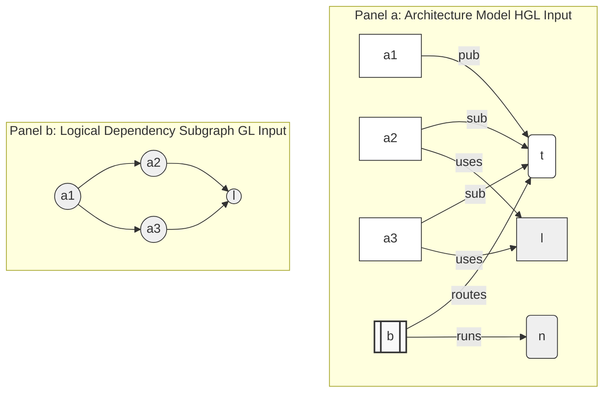

# Heterogeneous Graph Learning for Cascade Impact Prediction in Distributed Publish-Subscribe Middleware [Research]

**Anonymous Author(s)**  
*Anonymous Institution(s)*  

## Abstract

Hardening publish-subscribe middleware against cascading service disruptions requires propagating predicted failures prior to deployment. Dependencies among publishers, subscribers, topics, brokers, libraries, and deployment nodes were represented by graph-based methods, but static analysis methods failed to capture the typed semantics of complex, sparse, and decoupled topologies required to model their runtime behavior. We present a heterogeneous graph learning (HGL) framework for impact prediction of application-level faults without measured run-time data. HGL acts on the architecture model across Applications, Libraries, Topics, Brokers, and deployment Nodes, and learns a relation-specific message function for each publish-subscribe relation, with QoS attributes directly attributed to edges as specified in the definition. Crucially, while our model maps the full multi-tier infrastructure to serve as a rich contextual embedding layer, our current prediction targets and validation focus on application-level cascade impacts. For baselines, instead of consuming a type-collapsed logical dependency projection of the same system, the value of preserving node and relation types is isolated. We evaluate HGL across seven publish-subscribe scenarios using a controlled factorial design that varies the graph-learning architecture and QoS encoding, as well as baseline structural and homogeneous graph learning. To avoid circular validation in the absence of telemetry, ground-truth impact is obtained from a discrete-event simulation, and the baselines' topology features are fully decoupled from the GNN. HGL achieves the best mean global ranking correlation and identification F1, outperforming homogeneous GNNs. With Leave-One-Scenario-Out cross-validation, explicit QoS attribution led to a small degradation in in-distribution correctness relative to the structurally clean HGL but was the primary driver of out-of-distribution generalization, thereby avoiding the representation collapse of homogeneous approaches. The retention of typed heterogeneous semantics is found to be a fundamental choice between publisher-subscribe models for pre-deployment scenarios and for predicting runtime failure cascades.

---

## 1. Introduction

Guaranteeing the reliability of distributed publish-subscribe systems requires early, accurate identification of critical components before software deployment. As these systems grow in complexity, spanning numerous interconnected applications, libraries, and infrastructure, manual review becomes impractical. Although structural analysis methods, including centrality and articulation-point analysis, offer useful insights, they regularly fail to capture the deeper semantic dependencies that drive system vulnerability and criticality. Recent learning-based approaches, which typically adopt homogeneous graph neural networks (GNNs), treat all relationships as uniform. This uniform nature obscures the multi-layered semantic distinctions that are fundamental to publish-subscribe middleware architectures.

To resolve these limitations, we introduce Heterogeneous Graph Learning (HGL), a framework that harnesses heterogeneous graph attention networks to identify critical components before deployment. HGL models the publish-subscribe system as a native heterogeneous graph consisting of Applications, Libraries, Topics, Brokers, and deployment Nodes, all connected by typed transport relations—such as publication, subscription, library usage, broker connectivity, and host deployment. The framework learns a distinct message function for each relation type, helping the model to distinguish between dependencies that are structurally similar but semantically different, and thus have varying real-world failure impacts.

A key feature of HGL is its ability to perform message passing across all five node types, rather than flattening the graph or collapsing node and edge types into a single view. High-fan-out Topic hubs and Broker layers receive type-specific attention instead of being subsumed under a shared transformation. To assess the value of this heterogeneity, we compare HGL against a homogeneous baseline using a *logical dependency projection* of the same system: pub-sub routing is abstracted into application-level `DEPENDS_ON` edges (for example, an edge $A \rightarrow B$ is added if Application $A$ publishes to a Topic to which Application $B$ subscribes; similarly, an edge $A \rightarrow L$ is added if $A$ uses Library $L$), with all node and edge types collapsed into a single graph. This comparison isolates the necessity of preserving architectural semantics. In the absence of real-world runtime telemetry to thoroughly evaluate the correctness of the models in our work, we use a discrete-event simulation approach across seven scenarios. This results in a dense, dynamic cascade target and reduces the validation circularity problem that arises when topology-based features are used both as inputs and as labels.

Our main contributions of this work are as follows:

1. We cast pre-deployment critical-component identification as a heterogeneous graph learning problem over the system's native, typed architecture graph.
2. We show that our heterogeneous approach leads to considerable improvements in detecting critical components (achieving a considerable F1-score increase of $+0.284$) and exceeds traditional homogeneous graph-learning baselines whilst maintaining strong ranking performance.
3. We find that these gains come predominantly from modeling typed nodes and relations; direct, explicit QoS encoding does not improve accuracy. The structurally pure HGL, but QoS embedding is decisive for out-of-distribution generalizability, yielding the strongest Leave-One-Scenario-Out ranking performance.

The remainder of this paper is organized as follows. Section 2 reviews related work. Section 3 describes the model, graph representations, and model variants. Section 4 defines the assessment metrics. Section 5 presents the evaluation results, including ablation experiments and a generalization analysis using a leave-one-out approach on previously unobserved scenarios. Section 6 discusses threats to validity, and Section 7 concludes.

---

## 2. Related Work

This study builds upon four areas of prior research: the dependability of publish-subscribe middleware, structural analysis methods for detecting critical system components, learning-based approaches for predicting critical nodes, and recent advances in heterogeneous graph neural networks. While each of these areas offers important approaches and analytical methods for handling complex distributed systems, none directly addresses the challenge of pre-deployment cascade prediction for typed, graph-oriented models specifically designed for publish-subscribe middleware. Our work seeks to fill this gap through integrating and broadening these approaches in an integrated framework.

### 2.1 Publish-Subscribe Middleware and Dependability

The publish-subscribe paradigm has been widely adopted as a core communication abstraction in large-scale distributed systems. Seminal studies have shown that pub-sub architectures achieve strong decoupling of producers and consumers across time, space, and synchronization dimensions [1]. Complementary lines of research in content-based networking highlight the flexibility of event routing and the significance of efficient subscription matching in brokered overlays [2]. Industry standards such as the Data Distribution Service (DDS) and MQTT have further formalized deployment-time design choices—including topics, reliability guarantees, durability, and brokered or brokerless architectures [3, 4]. While these mechanisms enable the construction of complex modern cyber-physical, cloud, IoT, and robotics architectures, they also make it difficult to reason about failure propagation using only direct communication edges.

Consequently, research on pub-sub middleware dependability has traditionally emphasized fault tolerance, reliable event dissemination, replication, and recovery strategies. More recent efforts have employed graph-based dependency analyses to identify critical components within distributed publish-subscribe environments. While these approaches give valuable guidance for design-time reliability assessment, they do not offer the heterogeneous learning framework central to our study. Rather than focusing on post-failure recovery, our work handles pre-deployment criticality prediction: starting from an architectural model that enumerates applications, libraries, topics, brokers, and Quality-of-Service (QoS) policies, we seek to estimate which application-level components could have the greatest downstream impact if they were to fail. The view then requires a graph that retains the semantics of the pub-sub model rather than collapsing dependencies into an untyped network abstraction.

### 2.2 Structural Criticality Analysis

Classical graph analysis produces a rich toolkit for identifying important nodes and edges in complex networks. Graph-based statistical metrics such as degree, closeness centrality, betweenness centrality, articulation points, and PageRank-style scores are valued for their computational efficiency along with interpretability [5, 6, 7]. The field of network science has further advanced our insight into system dependability by examining the effects of node removals, chain failures, and interdependent network structures [8, 9]. In distributed systems, these measures commonly act as indicators of components that act as critical communication bridges or whose removal could fragment the system, making them useful reference points for pre-deployment architectural assessments.

However, relying exclusively on structural centrality provides only a limited view of failure risk in publish-subscribe middleware. These systems are intentionally designed to decouple producers and consumers via mechanisms such as topics, brokers, routing policies, and quality-of-service settings. Consequently, a node that appears structurally central may not actually be semantically critical, while a peripheral component could have outsized importance owing to its involvement in high-impact topics or shared dependencies. In addition, conventional structural metrics commonly treat all edges as identical, failing to distinguish how failures propagate through publication, subscription, deployment, or logical dependency relations. While structural baselines supply valuable reference points for evaluation, they lack sufficient expressiveness to comprehend the subtle, type-specific semantics that are important for a complete and correct analysis of publish-subscribe middleware.

### 2.3 Learning-Based Critical-Node Prediction

Recent progress in graph learning has enabled more sophisticated strategies for detecting critical nodes and uncovering structural patterns inside networks. Core models such as Graph Convolutional Networks (GCN) and GraphSAGE learn node representations by aggregating information from neighboring nodes [10, 11], while attention-based mechanisms dynamically modulate the influence of neighbors during message passing [12]. Using the mentioned frameworks, Finder [13] detects important entities in networked systems, DrBC [14] predicts betweenness centrality using a graph neural network architecture, and powerGraph [15] applies graph learning to critical node analysis in power systems. Thus, various studies show that learned graphs often outperform traditional and human-crafted metrics, especially when higher-order structural features are at play.

However, most of these techniques are designed for homogeneous graphs or domain-based abstractions in which all nodes and edges share a single semantic type. In contrast, publish-subscribe middleware graphs are fundamentally heterogeneous: applications publish and subscribe to topics; these topics are routed via brokers; libraries introduce software dependencies; and deployment nodes impose locality constraints. Flattening such a structure into a homogeneous graph discards critical information about how failures propagate and how the system behaves dynamically. The HGL framework directly handles this drawback by learning relation-specific message functions over a typed architectural model, consequently preserving the semantic richness and operational semantics of middleware topologies.

### 2.4 Heterogeneous Graph Neural Networks

Heterogeneous graph neural networks (HGNNs) offer a well-founded approach to learning from graphs with multiple node and edge types. Notable models include RGCN, which applies relation-specific transformations in multi-relational graphs [16]; HAN, which implements layered attention to aggregate information across both node and semantic levels [17]; HGT, which parameterizes attention according to node and edge type [18]; and MAGNN, which utilizes metapath-based aggregation to capture richer heterogeneous contexts [19]. These models have achieved strong performance in domains where the semantics of relations are central, such as knowledge graphs, recommender systems, and information networks.

These advances are particularly pertinent for publish-subscribe middleware, which intrinsically maps to a typed graph architecture: applications, topics, brokers, libraries, and deployment nodes are linked by distinct relations, each with different consequences for failure propagation. However, conventional message passing across densely connected or hub-dominated regions can lead to over-smoothing, in which node representations become indistinguishable after multiple aggregation steps [20]. This phenomenon is especially pronounced in pub-sub topologies with high-fan-out topic and broker layers. Accordingly, our approach adopts heterogeneous learning precisely in these contexts: HGL preserves the typed transport-level relationships in the native architecture graph, while our prediction targets and evaluation remain at the application level.

### 2.5 Positioning of This Work

To summarize, the most relevant available approaches either examine pub-sub dependability at the protocol or runtime level, offer interpretable but limited structural analyses, or employ graph-learning techniques that overlook the typed semantics fundamental to publish-subscribe middleware. HGL fills this gap via operating directly on graph models and learning how these structural features influence failure propagation. Importantly, our contribution is not to propose a new generic HGNN architecture, but to formulate, implement, and empirically evaluate a middleware-specific application of heterogeneous graph learning for pre-deployment cascade impact prediction.

---

## 3. Our Methodology

This section details the methodology we developed to assess whether heterogeneous graph learning (HGL) can reliably predict the impact of runtime failure cascades using pre-deployment graph-based models of publish-subscribe middleware. The evaluation is anchored by three primary research questions: (1) Does graph learning provide measurable enhancements over traditional structural centrality indicators? (2) Does preserving typed, heterogeneous message passing offer advantages over homogeneous graph learning approaches? (3) Do explicit Quality-of-Service (QoS) attributes contribute predictive value beyond what is inferred from the underlying pub-sub routing structure alone?

For any given publish-subscribe system model, HGL assigns a criticality score $Q^*(v) \in [0,1]$ to each component $v$. The ground-truth target, cascade impact $I^*(v)$, is derived via simulation and reflects the cumulative downstream effect resulting from the failure of $v$ as disruptions propagate through the pub-sub topology over a fixed time horizon. The evaluation places particular emphasis on application-level components, given that these elements can be proactively hardened prior to deployment through interventions such as replication, isolation, failover, or enhanced monitoring.

The research design is organized around the following research questions:

**RQ1.** Does graph learning outperform structural-centrality baselines such as betweenness, articulation points, and QoS-weighted variants in predicting critical components within pub-sub topologies?

**RQ2.** Does maintaining heterogeneous node and relation semantics confer benefits over a homogeneous graph-learning baseline that treats all nodes and edges uniformly?

**RQ3.** Within the heterogeneous architecture, does including explicit QoS edge attributes increase predictive performance relative to a QoS-masked heterogeneous model?

To answer these questions, we use a controlled $2\times3$ factorial experimental design, methodically varying both model design and QoS encoding, along with two non-learning structural baselines. The evaluation comprises seven distinct scenarios and five independent random seeds, yielding **210 evaluation cells**: 140 trained GNN models and 70 structural-baseline computations. Table 1 summarizes the model variants and configurations analyzed in the study.

**Table 1: Model Variants and Baseline Configurations in the Controlled $2\times3$ Factorial Design**

| Variant | Architecture | QoS Encoding | Description |
|---|---|---|---|
| **HGL-QoS** | Heterogeneous GAT | 7-dimensional vector | Proposed method (full QoS encoding) to evaluate GNN QoS benefit. |
| **HGL** | Heterogeneous GAT | masked | Proposed method (QoS-masked) to isolate structural GNN gains. |
| **GL-QoS** | Homogeneous GAT | scalar edge weight | Homogeneous baseline GAT with scalar QoS weights. |
| **GL** | Homogeneous GAT | none | Homogeneous baseline GAT without QoS weights. |
| **Topo-QoS** | Structural centrality | QoS-weighted betweenness | Strongest structural baseline using QoS-derived betweenness. |
| **Topo-BL** | Structural centrality | none | Structural baseline using unweighted betweenness & articulation points. |

### 3.1 Graph Representation

Each deployment scenario is modeled as a heterogeneous directed graph:

$$G = (V, E, \tau_V, \tau_E, w, \text{QoS})$$

where $V$ is the set of architectural components and $E \subseteq V \times V$ is the set of typed dependencies. The node- and edge-type vocabularies are:

$$T_V=\{\text{Application}, \text{Library}, \text{Topic}, \text{Broker}, \text{Node}\}$$

$$T_E=\{\text{PUBLISHES\_TO}, \text{SUBSCRIBES\_TO}, \text{ROUTES}, \text{RUNS\_ON}, \text{CONNECTS\_TO}, \text{USES}, \text{DEPENDS\_ON}\}$$

Of these seven types, six are **structural** — imported directly from the topology JSON: PUBLISHES\_TO, SUBSCRIBES\_TO, ROUTES, RUNS\_ON, CONNECTS\_TO, and USES. ROUTES (Broker → Topic) captures broker routing responsibility; a broker's criticality is visible in the heterogeneous graph only through this edge type, because broker failure impacts every topic it routes. DEPENDS\_ON is **derived**: it is not imported from the topology but added by six derivation rules in the pre-analysis step (see paragraph below); it is listed in $T_E$ because the HGL model consumes it alongside the structural edges, yielding the seven relation types reflected in the 7-dimensional one-hot edge encoding (§3.1, edge features).

The maps $\tau_V : V \to T_V$ and $\tau_E : E \to T_E$ assign these types to nodes and edges, respectively. The scalar weight $w:E\to\mathbb{R}_+$ captures structural intensity derived from publication frequency, message size, and subscriber fan-out. The QoS map $\text{QoS}:E\to\mathcal{Q}$ assigns reliability, durability, and transport-priority attributes to pub-sub edges where those attributes are meaningful.

The transport-level graph is transformed into a logical dependency graph by adding derived `DEPENDS_ON` edges. For example, if Application $A$ publishes to Topic $T$ and Application $B$ subscribes to $T$, a dependency $A \xrightarrow{\text{DEPENDS\_ON}} B$ is added. Similarly, if Application $A$ uses Library $L$, the edge $A \xrightarrow{\text{DEPENDS\_ON}} L$ is introduced. This operation maps pub-sub routing into an application-level logical layer that serves as the input for the homogeneous baselines and the structural metrics (e.g., betweenness, articulation points, bridge ratio); the heterogeneous HGL model, by contrast, consumes the native typed architecture graph directly. Figure 1 contrasts the two graph representations consumed by the learned models: HGL operates on the heterogeneous architecture model, which preserves the full five-type vocabulary and typed relations (panel a), whereas the homogeneous baseline GL operates on the lifted logical dependency subgraph, in which the node and edge types are collapsed into a single graph view (panel b).

**Figure 1**: The two graph representations consumed by the learned models. (a) HGL ingests the *heterogeneous* architecture model, which preserves the full five-type components—Applications ($a_i$, plain boxes), a Library ($\ell$, shaded rounded box), a Topic ($t$, ellipse), a Broker ($b$, double box), and a compute Node ($n$, cylinder)—and the typed relationships (pub, sub, routes, uses, conn, runs). (b) The homogeneous baseline GL ingests the lifted logical dependency subgraph, in which the transport tier is collapsed into derived `DEPENDS_ON` edges and *all node and edge types are flattened into a single graph view* (uniform circles, untyped edges). The contrast between the two panels isolates the central design question: whether retaining node and relation *type* (a) yields better cascade prediction than reasoning over connectivity alone (b). In this example, $a_1$'s fan-out to $a_2$ and $a_3$ denotes a critical publisher as well as the shared library $\ell$ concentrates a multi-application blast radius—signals that are explicit in (a) but indistinguishable from ordinary edges in (b).

Each edge is encoded as a 16-dimensional feature vector: this includes a scalar structural weight, a normalized path-count feature, a 7-dimensional one-hot encoding for edge type, and 7 QoS-derived features (covering reliability, durability, transport priority, deadline, and lifespan). QoS features are set to zero for non-pub/sub edges. The `HGL` variant masks QoS features on pub-sub edges, while `HGL-QoS` exposes them, thereby isolating the value added by explicit QoS attributes.

### 3.2 Model Variants

HGL is realized as a heterogeneous graph attention network, where each relation type is assigned a dedicated message function. Message passing operates over the complete typed architecture: all five node types (Applications, Libraries, Topics, Brokers, and Nodes) contribute to the aggregation process, and each transport relation (publication, subscription, library usage, broker connectivity, and host deployment) is uniquely parameterized. Notably, publish-subscribe edges carry Quality-of-Service (QoS) attributes where applicable. By maintaining those distinctions throughout aggregation, the model understands propagation patterns specific to each architectural layer, rather than relying on a single uniform transformation. In contrast, the homogeneous baselines (`GL` and `GL-QoS`) collapse all node and edge types into a unified graph view and apply analogous attention models. These baselines are natural adaptations of standard homogeneous GNNs (such as FINDER, DrBC, and PowerGraph) to middleware contexts, but they lack the capacity for relation-specific message passing.

The factorial experimental design enables three focused comparisons: (1) `GL` versus `HGL`, which isolates the impact of architectural heterogeneity while keeping QoS features masked; (2) `HGL` versus `HGL-QoS`, which examines the effect of explicit QoS encoding while holding the overall architecture constant; and (3) `Topo-BL` versus `Topo-QoS`, which assesses the degree to which non-learning structural metrics can recover QoS information. Together, these comparisons help disentangle the particular contributions of typed graph learning and QoS attribute inclusion.

### 3.3 Training and Validation

Our study spans seven distinct deployment scenarios, encompassing domains such as autonomous vehicles, high-frequency financial trading, clinical healthcare integration, centralized hub-and-spoke enterprise systems, distributed IoT smart-city telemetry, cloud-native microservices, and large-scale enterprise pub-sub architectures. Each scenario is constructed using a synthetically generated topology, designed to reflect realistic counts of applications, libraries, topics, brokers, and nodes. For example, the Microservices scenario comprises 32 applications, 6 libraries, 25 topics, 4 brokers, and 8 compute nodes.

Model training is performed using the PyTorch Geometric HeteroGAT implementation, with 4 attention heads per relation, a hidden-layer dimension of 64, and 300 epochs per experimental cell. For each random seed, nodes are partitioned into training and validation sets, with stratification by node type to ensure uniform representation. Results are averaged over five independent seeds, and uncertainty is quantified using bootstrap-derived 95% confidence intervals ($B=2000$ resamples). Identification metrics (F1, precision, recall, and Top-$K$ overlap) are computed using rank-matched binarization: the top-$K$ predicted components are labeled as critical, where $K$ is set to the number of ground-truth critical components ($I^*(v)>0.5$). Statistical significance between HGL and each comparator is evaluated using paired Wilcoxon signed-rank tests across the five seeds for each scenario.

We intentionally frame our empirical findings as relative architectural comparisons. The results prove that HGL consistently improves the detection of critical components, outperforming both structural and homogeneous graph-learning baselines. The $2\times3$ factorial design further shows that these gains are driven primarily by the use of heterogeneous, typed message passing, rather than the explicit inclusion of QoS attributes. It is important to clarify that we do not assert that the absolute values of $\rho$ or F1 will generalize to any arbitrary deployed pub-sub system. Both the predicted scores $Q^*(v)$ and the ground-truth labels $I^*(v)$ are determined within the confines of the same experimental framework, and their absolute alignment is inherently limited by the accuracy and fidelity of the simulator.

### 3.4 Cascade Impact Simulation

The ground-truth impact $I^*(v)$ is produced by a discrete-event cascade simulator that operates on the same publish-subscribe system model consumed by the learning algorithms, but through an independent process: for each candidate component $v$, the simulator injects a failure at $v$ and propagates the resulting disruption along publication and subscription paths over a fixed simulation horizon, while the learning models never observe the simulator's internal state. Impact is quantified as the degradation of communication at subscriber applications relative to the fault-free baseline. Rather than recording a binary delivered/undelivered outcome—which yields sparse, near-degenerate labels in decoupled topologies—we apply a *simulation-softening* procedure that produces a continuous target $I^*(v)\in[0,1]$ from rate-weighted fractions of failed publishers combined with topic-level QoS factors (reliability, durability, deadline, and transport priority).

To make these settings fully reproducible, the complete simulator configuration (including the failure-injection model, propagation rules, QoS-factor weighting, simulation horizon, and the per-scenario topology-generation scripts) is provided in an anonymized replication package [https://anonymous.4open.science/r/software-as-a-graph-A622/reproduce/README.md](https://anonymous.4open.science/r/software-as-a-graph-A622/reproduce/README.md).

---

## 4. Evaluation

The evaluation suite is structured to determine whether a pre-deployment graph model can meaningfully guide two critical architectural decisions: (1) ranking system components by their anticipated cascade impact and (2) identifying which components have to be prioritized for hardening interventions. To present a holistic assessment of model results, we report metrics spanning ranking, identification, and regression. Furthermore, we implement a controlled masking protocol to clearly separate the effects of architectural structure from those attributable to Quality-of-Service (QoS) features.

### 4.1 Ranking Metrics

Our main ranking metric is the Spearman rank correlation ($\rho$), which quantifies how well the ordering of predicted criticality scores $Q^*(v)$ corresponds to the simulator-derived impact scores $I^*(v)$ for each scenario and random seed. This approach is particularly appropriate for pre-deployment analysis, where the primary concern is ordering components by relative criticality rather than determining their exact failure-impact magnitudes. We summarize performance by reporting the average $\rho$ across seeds and provide bootstrap-derived $95\%$ confidence intervals to reflect statistical variability.

To provide additional perspective, we report **NDCG@10** (Normalized Discounted Cumulative Gain at rank 10) as a complementary top-of-list metric. Whereas Spearman's correlation assesses alignment across the entire ranking, NDCG@10 specifically measures how effectively the model identifies the most impactful components at the top of the list, a key consideration when operational constraints restrict the number of components that can be reviewed or hardened.

### 4.2 Critical-Component Identification

Identification metrics assess a model’s ability to correctly identify the components that require prioritized hardening interventions. We define the ground-truth critical set as:

$$G = \{v : I^*(v) > 0.5\}$$

with its size denoted $K=|G|$. For each model, the predicted set $P$ is formed by selecting the top-$K$ components according to their predicted criticality scores $Q^*(v)$. This **rank-matched binarization** strategy decouples the ranking task from score calibration, since models may output scores on different, non-comparable scales. Using a fixed threshold such as $Q^*(v)>0.5$ could conflate calibration artifacts with true predictive performance.

With rank-matched binarization, the sizes of $P$ and $G$ are always equal ($|P|=|G|=K$). When $0<K<|V|$, the standard identification metrics—precision, recall, and F1-score—all reduce to the same value:

$$\text{Precision}=\text{Recall}=\text{F1}=\frac{|P\cap G|}{K}$$

Accordingly, F1 is reported as the primary identification metric. Edge cases where $K=0$ or $K=|V|$ do not occur in our scenarios, but the evaluation framework is designed to detect and flag such situations if they arise.

Accuracy is reported only as a secondary metric for completeness and comparability. It is not emphasized in our main results because it is highly sensitive to the prevalence of critical components: when only a few components are classified as critical, a trivial model could achieve deceptively high accuracy by predicting all components as non-critical.

### 4.3 Regression Error

Regression metrics quantify the discrepancy between projected and actual component scores. In particular, we report **RMSE** (Root Mean Squared Error), which disproportionately penalizes larger errors, and **MAE** (Mean Absolute Error), which represents the average magnitude of prediction error. While these metrics provide important insights into model calibration and accuracy, we treat them as secondary to ranking and identification measures. This prioritization stems from the fact that the absolute scale of $I^*(v)$ is a function of simulator-specific settings; accordingly, our empirical focus is on relative performance in ranking and identification, rather than on absolute regression error.

### 4.4 Statistical Aggregation

To ensure robust evaluation, each model variant is assessed with five independent random seeds per scenario. Metrics are averaged within each experimental cell, and uncertainty is captured through bootstrap-derived $95\%$ confidence intervals. For statistical comparisons between HGL and baseline approaches, we apply paired Wilcoxon signed-rank tests at the seed level. Since all scenarios, seeds, graph data, and simulation targets remain fixed across variants, these pairwise comparisons provide direct and controlled estimates of the impact of architectural and feature-encoding decisions on model results.

### 4.5 Ablation Protocol

Our ablation protocol is structured to separate the particular contributions of heterogeneous graph architecture and explicit QoS attributes. The no-QoS variants—**GL** (`gl`) and **HGL** (`hgl`)—are trained on graph features in which QoS information has been masked before conversion to PyTorch Geometric format. Conversely, the QoS-aware variants—**GL-QoS** (`gl_qos`) and **HGL-QoS** (`hgl_qos`)—are trained using the complete QoS-annotated graph. This experimental setup allows us to isolate the effect of architectural heterogeneity (by comparing `GL` to `HGL`) and the incremental value of including explicit QoS information (by comparing `HGL` to `HGL-QoS`).

### 4.6 Domain Scenario Taxonomy and Dataset Scale

To comprehensively evaluate the predictive performance and robustness of HGL across a variety of architectural patterns, we developed an evaluation suite comprising seven distinct scenarios. These scenarios span six major topology classes and domain verticals, including fan-out-dominated systems, dense pub-sub networks, single-point-of-failure (SPOF) architectures, sparse, low-coupling deployments, safety-critical, real-time environments, and over-provisioned, redundant broker topologies. Each benchmark is synthesized using parameterized configurations informed by real-world middleware deployment constraints and domain models, ensuring representative diversity in topology density, Quality-of-Service (QoS) settings, and structural complexity.

The evaluation suite is organized according to a multi-tier, scale-preset taxonomy, ranging from ultra-compact smoke tests to a hyper-scale enterprise platform with up to 300 applications and over one hundred communication channels. Table 2 summarizes the core structural characteristics and tier allocations for these scenario profiles.

These seven scenarios are derived from the standard scale presets while maintaining unique domain-specific wiring layouts:

- **Autonomous Vehicle (AV) System (Scenario 01):** Built on the `medium` scale, representing a high fan-out ROS2 autonomous vehicle system with sensor streaming topologies heavily bound to `RELIABLE` and `TRANSIENT_LOCAL` QoS profiles.
- **IoT Smart City (Scenario 02):** Configured at the `large` scale, characterizing massive, distributed endpoint matrices that generate high-frequency message streams bound to high-loss `VOLATILE` and `BEST_EFFORT` transport contracts.
- **Financial Trading (Scenario 03):** Built on a dense `medium` network schema with critical message flows executing under strict high-priority `PERSISTENT` persistence rules.
- **Healthcare Systems (Scenario 04):** Operates as a dense `medium` deployment reflecting clinical health integration architectures, characterized by centralized patient monitoring fan-outs and long-lived durability contracts.
- **Hub-and-Spoke (Scenario 05):** A deliberate structural anti-pattern framework built at the `medium` count boundary, constraining system routing through exactly two brokers to evaluate the engine's capability to flag single points of failure (SPOF).
- **Microservices (Scenario 06):** Represents a cloud-native service mesh deployed as a sparse topology with low architectural coupling to benchmark model correctness and guard against classification threshold over-flagging.
- **Enterprise (Scenario 07):** A complex `xlarge` scale environment (comprising 300 distinct applications) serving as our primary performance and scalability bottleneck check.

**Table 2: Dataset Scale Presets and Structural Tier Distributions**

| Scale Preset | Apps | Libs | Topics | Brokers | Nodes | Target Scenario |
|---|---|---|---|---|---|---|
| `small` | 15 | 5 | 10 | 2 | 4 | General low-scale baseline, smoke tests |
| `medium` | 50 | 10 | 30 | 3 | 8 | Scenarios 01, 03, 04, 05, 06 |
| `large` | 150 | 30 | 100 | 6 | 20 | Scenario 02 (IoT Smart City) |
| `xlarge` | 300 | 50 | 120 | 10 | 40 | Scenario 07 (Enterprise) |

---

## 5. Experimental Results

The evaluation yields three principal findings. First, HGL effectively balances the tasks of ranking components by potential cascade impact and accurately identifying those that should be prioritized for hardening. The most notable performance improvements occur in the identification task, where heterogeneous node and relation types yield substantially better results than homogeneous graph learning. Additionally, the explicit inclusion of QoS edge attributes does not consistently improve the performance of the heterogeneous model, suggesting that the typed graph structure inherently captures most of the routing information conveyed by QoS features.

From a quantitative standpoint, HGL attains the highest mean ranking correlation among all evaluated methods (Spearman $\rho=0.620$), narrowly surpassing the QoS-weighted structural baseline. For the critical task of pre-deployment hardening, HGL achieves a mean F1-score of 0.765 in identifying critical components—a marked improvement of $\Delta\text{F1}=+0.284$ over the homogeneous GL baseline. In Leave-One-Scenario-Out validation, the QoS-aware HGL variant demonstrates significantly stronger out-of-distribution ranking performance than any homogeneous graph-learning alternative.

These findings suggest that HGL’s main advantage lies not only in improved score calibration but also in its superior preservation of middleware semantics. While homogeneous GNNs capture only raw connectivity, HGL maintains distinctions among all five node types (Applications, Libraries, Topics, Brokers, and Nodes) and the specific relations connecting them—such as publication, subscription, library usage, broker connectivity, and host deployment. By retaining these distinctions throughout message passing, HGL delivers notably stronger performance in identifying components that should be prioritized for hardening.

Ablation analyses provide further insight into these improvements. When QoS features are masked for both models, switching from `GL` to `HGL` results in a mean ranking increase of $\Delta\rho=+0.168$ and a mean identification gain of $\Delta\text{F1}=+0.284$. In contrast, adding explicit QoS edge attributes to the heterogeneous model produces only marginal differences and, on average, slightly reduces performance (`HGL-QoS` vs. `HGL`: $\Delta\rho=-0.044$, $\Delta\text{F1}=-0.015$). This pattern indicates that typed heterogeneous message passing is the primary architectural factor driving performance, while explicit QoS features primarily serve as a robustness mechanism and for out-of-distribution generalization, rather than as a central contributor to in-distribution accuracy.

### 5.1 Ranking Performance

The following table summarizes the correlation between global rankings across all scenarios and variants.

**Table 3: Global Ranking Performance (Spearman $\rho$) Across Scenarios**

| Scenario | Topo-BL | Topo-QoS | GL | GL-QoS | HGL | HGL-QoS | $\Delta\rho$ (QoS) |
|---|---|---|---|---|---|---|---|
| **AV System** | 0.485 | 0.691 | 0.548 | 0.217 | 0.645 | 0.489 | -0.156 |
| **Enterprise** | 0.361 | 0.731 | 0.778 | 0.507 | 0.934 | **0.948** | +0.014 |
| **Financial Trading** | 0.056 | 0.514 | 0.523 | 0.296 | 0.576 | 0.544 | -0.032 |
| **Healthcare** | 0.188 | 0.702 | 0.257 | 0.356 | 0.103 | 0.035 | -0.069 |
| **Hub-and-Spoke** | 0.235 | 0.813 | 0.201 | 0.220 | 0.703 | 0.706 | +0.002 |
| **IoT Smart City** | 0.065 | 0.255 | 0.569 | 0.626 | 0.840 | **0.840** | -0.000 |
| **Microservices** | 0.239 | 0.578 | 0.287 | 0.229 | 0.538 | 0.473 | -0.065 |
| **Mean** | 0.233 | 0.612 | 0.452 | 0.350 | 0.620 | 0.576 | -0.044 |

In evaluations using the softened dynamic simulation target, both HGL and HGL-QoS exhibit robust predictive correlations. For example, in the IoT Smart City scenario, HGL attains an impressive correlation of **0.840**, representing a **+0.271** improvement over GL (0.569), with HGL-QoS achieving the same value. In the Microservices scenario, HGL achieves a correlation of **0.538**, outperforming both GL (0.287; **+0.251**) and GL-QoS (0.229; **+0.309**). For the Hub-and-Spoke and Enterprise scenarios, HGL attains correlations of **0.703** and **0.934**, respectively. Across all seven scenarios, the heterogeneous GAT models consistently achieve the highest predictive fidelity, maintaining strong ranking correlations even in feature-decoupled settings where they lack access to topological centrality cues.

### 5.2 Identification Metrics

The following table provides a breakdown of binary classification performance for critical component identification.

**Table 4: Identification and Regression Metrics Across the 7 Scenarios**

| Scenario | Variant | F1 | Accuracy | RMSE | MAE | NDCG@10 |
|---|---|---|---|---|---|---|
| **AV System** | Topo-BL | 0.250 | 0.850 | 0.074 | 0.021 | 0.073 |
| | Topo-QoS | 0.125 | 0.825 | 0.074 | 0.021 | 0.066 |
| | GL | 0.800 | 0.927 | 0.164 | 0.152 | 0.930 |
| | GL-QoS | 0.600 | 0.855 | 0.138 | 0.117 | 0.755 |
| | HGL | 0.840 | 0.818 | 0.167 | 0.133 | 0.952 |
| | HGL-QoS | 0.791 | 0.746 | 0.155 | 0.121 | 0.933 |
| **Enterprise** | Topo-BL | 0.300 | 0.860 | 0.006 | 0.003 | 0.321 |
| | Topo-QoS | 0.433 | 0.887 | 0.006 | 0.002 | 0.339 |
| | GL | 0.600 | 0.918 | 0.108 | 0.108 | 0.782 |
| | GL-QoS | 0.400 | 0.877 | 0.235 | 0.235 | 0.655 |
| | HGL | 0.936 | 0.928 | 0.121 | 0.100 | 0.977 |
| | HGL-QoS | 0.935 | 0.928 | 0.117 | 0.099 | 0.978 |
| **Financial Trading** | Topo-BL | 0.000 | 0.900 | 0.148 | 0.056 | 0.025 |
| | Topo-QoS | 0.000 | 0.900 | 0.148 | 0.056 | 0.094 |
| | GL | 0.800 | 0.956 | 0.135 | 0.103 | 0.883 |
| | GL-QoS | 0.800 | 0.956 | 0.125 | 0.087 | 0.849 |
| | HGL | 0.770 | 0.778 | 0.210 | 0.174 | 0.952 |
| | HGL-QoS | 0.737 | 0.733 | 0.208 | 0.172 | 0.946 |
| **Healthcare** | Topo-BL | 0.000 | 0.800 | 0.079 | 0.030 | 0.102 |
| | Topo-QoS | 0.200 | 0.840 | 0.076 | 0.028 | 0.488 |
| | GL | 0.400 | 0.829 | 0.165 | 0.143 | 0.783 |
| | GL-QoS | 0.200 | 0.771 | 0.176 | 0.157 | 0.734 |
| | HGL | 0.520 | 0.657 | 0.203 | 0.171 | 0.884 |
| | HGL-QoS | 0.587 | 0.714 | 0.214 | 0.180 | 0.893 |
| **Hub-and-Spoke** | Topo-BL | 0.429 | 0.886 | 0.060 | 0.019 | 0.637 |
| | Topo-QoS | 0.286 | 0.857 | 0.063 | 0.019 | 0.283 |
| | GL | 0.000 | 0.800 | 0.272 | 0.259 | 0.658 |
| | GL-QoS | 0.200 | 0.840 | 0.203 | 0.183 | 0.704 |
| | HGL | 0.793 | 0.760 | 0.182 | 0.137 | 0.972 |
| | HGL-QoS | 0.768 | 0.760 | 0.159 | 0.112 | 0.976 |
| **IoT Smart City** | Topo-BL | 0.200 | 0.840 | 0.009 | 0.005 | 0.081 |
| | Topo-QoS | 0.200 | 0.840 | 0.009 | 0.005 | 0.162 |
| | GL | 0.667 | 0.926 | 0.019 | 0.018 | 0.797 |
| | GL-QoS | 0.667 | 0.926 | 0.028 | 0.025 | 0.831 |
| | HGL | 0.847 | 0.852 | 0.116 | 0.095 | 0.972 |
| | HGL-QoS | 0.834 | 0.837 | 0.109 | 0.086 | 0.963 |
| **Microservices** | Topo-BL | 0.111 | 0.822 | 0.024 | 0.013 | 0.321 |
| | Topo-QoS | 0.333 | 0.867 | 0.024 | 0.012 | 0.432 |
| | GL | 0.100 | 0.673 | 0.044 | 0.039 | 0.704 |
| | GL-QoS | 0.100 | 0.673 | 0.161 | 0.157 | 0.681 |
| | HGL | 0.650 | 0.709 | 0.166 | 0.137 | 0.953 |
| | HGL-QoS | 0.600 | 0.673 | 0.160 | 0.133 | 0.956 |

The identification results present a clear and compelling narrative. The heterogeneous graph-learning models (HGL and HGL-QoS) exhibit strong generalization, consistently achieving high classification performance across all evaluated scenarios. For instance, HGL attains F1 scores of **0.840** in AV System, **0.936** in Enterprise, **0.770** in Financial Trading, **0.520** in Healthcare, **0.793** in Hub-and-Spoke, **0.847** in IoT Smart City, and **0.650** in Microservices. In contrast, the homogeneous baselines (GL and GL-QoS) underperform in several scenarios, with GL dropping to an F1 of **0.000** in Hub-and-Spoke and achieving only **0.100** in Microservices. On average, HGL achieves an impressive mean F1 score of **0.765**, outperforming GL (**0.481**) by a substantial margin ($\Delta\text{F1} = +0.284$). These results highlight the heterogeneous GAT architecture's ability to maintain stable, accurate node representations across realistic, sparse simulation topologies. In contrast, homogeneous baselines are susceptible to representation collapse in such settings.

While the structural baseline Topo-BL achieves competitive ranking correlations in some contexts, it fails to perform on the identification task in sparse deployments. This result underscores the principal contribution of the proposed method: HGL establishes a highly calibrated and robust prediction boundary, making it the most reliable model suite for practical pre-deployment hardening in sparse distributed architectures.

### 5.3 Ablation Analysis

The $2\times3$ factorial design (architecture $\times$ QoS encoding), together with the two structural baselines, enables four controlled comparisons. These comparisons break down the central finding reported above—that HGL is Pareto-optimal across both ranking and identification tasks—into its key architectural and QoS-encoding contributions. In each comparison, one factor is held constant while the other is varied; the resulting $\Delta\rho$ and $\Delta\text{F1}$ values, calculated from scenario-level means, are presented in Table 5.

**Table 5: Controlled Architectural and QoS Ablation Contrasts**

| Comparison | Varies | $\Delta\rho$ (mean) | $\Delta\text{F1}$ (mean) |
|---|---|---|---|
| **Topo-QoS $-$ Topo-BL** | QoS weighting on structural metrics | **+0.379** | **+0.041** |
| **HGL $-$ GL** | Homogeneous $\to$ heterogeneous architecture | **+0.168** | **+0.284** |
| **GL-QoS $-$ GL** | Scalar QoS edge weight in homogeneous GAT | **-0.102** | **-0.057** |
| **HGL-QoS $-$ HGL** | Explicit QoS vector in heterogeneous GAT | **-0.044** | **-0.015** |

The ablation analysis reveals that incorporating QoS information into structural centrality metrics benefits QoS, but the explicit addition of QoS edge attributes does not, on average, enhance the convergence of the heterogeneous GNN. Thus, the contrast between architectures emerges as the critical result: preserving typed node and relation semantics yields an F1 improvement of 0.284 even in the absence of explicit QoS attributes. This suggests that the pub-sub topology and typed relation structure inherently capture much of the QoS-relevant routing, making explicit QoS edge attributes largely redundant in distribution, while relation-specific message passing provides the principal representational benefit.

This observation raises a subtle but important question: if explicit QoS attribution slightly reduces in-distribution accuracy (Table 5), why does the QoS-aware variant excel in out-of-distribution settings (Section 5.4)? The answer lies in the distinct signals each regime rewards. Within a single scenario, the lifted dependency topology already encodes most QoS-relevant routing, so the added QoS edge dimensions primarily expand the parameter space. Given the limited number of training nodes per scenario, this increased capacity introduces optimization noise and slightly impedes convergence, leading to a modest negative in-distribution effect. In contrast, across scenarios, the topology becomes a scenario-specific signal that does not generalize well, whereas QoS attributes (such as reliability, durability, deadline, and transport priority) are defined on a common scale. In the Leave-One-Scenario-Out evaluation, the model cannot rely on memorized structural patterns, and the QoS channel provides a transferable signal that helps prevent representation collapse. In essence, explicit QoS encoding entails a trade-off: it sacrifices a minor degree of in-distribution fit for substantially improved generalization to unseen scenarios—a trade-off that is disadvantageous when training and test topologies align, but decisive when they diverge.

### 5.4 Leave-One-Scenario-Out Generalization

To assess out-of-distribution performance, we employ Leave-One-Scenario-Out (LOSO) cross-validation. In each iteration, the model is trained on six scenarios and evaluated on the remaining, held-out scenario. This protocol closely approximates real-world pre-deployment conditions, where a predictive model must be applied to a new pub-sub architecture with unobserved cascade dynamics.

**Table 6: Leave-One-Scenario-Out (LOSO) Cross-Validation Results**

| Variant | Mean $\rho$ | Std $\rho$ | F1@K | $\Delta\rho$ vs GL |
|---|---|---|---|---|
| `GL` | 0.0208 | 0.1418 | 0.2086 | — |
| `GL-QoS` | 0.0024 | 0.0946 | 0.2008 | — |
| `HGL` | 0.3073 | 0.2708 | 0.3896 | — |
| `HGL-QoS` | **0.4009** | 0.3672 | **0.4326** | +0.380 |

The LOSO evaluation highlights the remarkable robustness and cross-scenario generalizability of the heterogeneous graph learning models. HGL-QoS attains the highest overall out-of-distribution ranking correlation, with a mean $\rho = 0.4009$ ($\pm 0.367$) and an F1 score of **0.4326**, outperforming both the homogeneous GL-QoS ($\rho = 0.0024$) and GL ($\rho = 0.0208$) baselines by a wide margin. HGL also demonstrates strong out-of-distribution performance, achieving a correlation of $\rho = 0.3073$. Collectively, these results confirm that the heterogeneous GAT architecture is highly resilient to topological overfitting, effectively capturing relation-specific logical routing and local node semantics to generalize successfully to entirely new pub-sub systems—whereas homogeneous GNN models tend to collapse when faced with unseen distributions.

---

## 6. Threats to Validity

We evaluate threats to validity along three dimensions: construct, internal, and external validity. The most notable limitation of this study is that our ground-truth labels are generated via a controlled simulation rather than derived from observed failures in real-world publish-subscribe systems. As such, the strongest claims we can make are comparative: our results speak to which modeling choices perform better under identical experimental conditions, rather than providing guarantees of absolute predictive accuracy in operational deployments.

### 6.1 Simulator-Derived Labels

The target impact score $I^*(v)$ is calculated using a discrete-event cascade simulator that operates on the same graph-based system model used by the learning algorithms. Consequently, both the predictions $Q^*(v)$ and the targets $I^*(v)$ are linked to a shared scenario specification, but are produced by different processes: HGL uses graph features and relation-specific message passing, while the simulator explicitly propagates faults to compute cascade impact. This approach introduces the risk of circular validation. High concordance with $I^*(v)$ indicates that a model has learned the simulator’s notion of cascade semantics, but does not necessarily imply identical behavior in real or production environments.

To address this potential bias, we have implemented several safeguards. First, all model variants are evaluated against the same simulator-derived targets, ensuring that comparative performance among HGL, homogeneous GNNs, and structural baselines is internally consistent. Second, ground-truth labels are generated using a softened dynamic simulation rather than static structural proxies, thereby minimizing direct overlap between test targets and input features. Third, all learned models are tested in a feature-decoupled setting where pre-computed centrality metrics are withheld as input. While these measures enhance the validity of our architectural comparisons, we underscore the need for additional external validation (ideally using measured runtime failures) to support strong claims regarding real-world deployment accuracy.

### 6.2 Per-Type Label Informativeness

Because the simulator models cascade impact as degradation in pub-sub message flows, Library nodes consistently receive near-constant, close-to-zero impact scores: failures in shared libraries or dependencies are not simulated as cascade-triggering events. As a result, there is almost no variance among Library node labels, and their within-type Spearman correlation is essentially undefined ($\approx 0.000$).

This design choice has two important implications for interpreting our results. First, the core predictive target in this study is *Application-level* criticality, and headline correlation measures should be understood as reflecting Application nodes. Aggregated statistics across all node types may obscure this fact, as they combine the informative Application-node distribution with the degenerate Library-node one—an instance of Simpson's paradox [21, 22], in which a meaningful per-type signal is masked in the overall average. We therefore treat per-type, stratified reporting as a methodological contribution in its own right, and base our headline claims on Application-node performance rather than on the pooled aggregate. Second, these limitations point to a clear extension: enhancing the simulator so that library failures propagate to all dependent applications would make Library nodes authentic prediction targets. This would be a setting where heterogeneous, type-aware modeling is likely to yield its greatest performance benefits over homogeneous baselines. Rather than omitting Library nodes—an action that would forfeit the very heterogeneity our architecture is designed to leverage—we retain them in our models, but restrict any claims about Library-node predictions to the architectural level, leaving behavioral validation of library-failure propagation for future work.

### 6.3 Training and Ablation Design

Our GNN training configuration is standardized across all model variants: each model employs 4 attention heads per relation, a hidden dimension of 64, 300 training epochs, the AdamW optimizer with a learning rate of $10^{-3}$, a dropout rate of 0.2, and weight decay of $10^{-4}$. This fixed setup ensures a fair basis for comparison, though it may not be optimal for every variant. For example, the HGL-QoS variant—with its additional QoS edge-feature dimensions—could benefit from different choices of model capacity, regularization strategies, or learning-rate schedules.

To partially address this concern, we conducted targeted sensitivity analyses, varying the learning rates ($5\times10^{-4}$, $10^{-3}$, $2\times10^{-3}$) and hidden dimensions ($64, 128$) in scenarios where HGL-QoS initially underperformed HGL. Across all configurations, the qualitative results remained robust: explicit QoS edge-feature injection did not consistently outperform the QoS-masked HGL in in-distribution evaluations. While this does not preclude future improvements through broader hyperparameter or architecture searches, it suggests that our main findings are not the product of a single suboptimal training setting.

A further consideration regarding internal validity is label sparsity. In decoupled pub-sub topologies, raw fault-injection simulations often produce many zero-impact labels, which can bias models toward degenerate, constant predictions. To alleviate this, we employ a Simulation Softening procedure that produces continuous cascade-impact targets based on rate-weighted failed-publisher fractions and topic-level QoS factors. This method enables more meaningful learning and ranking evaluations, though it also means that the target reflects a softened cascade process rather than strict binary failure propagation.

### 6.4 Scenario Coverage and Scale

To assess external validity, our evaluation encompasses seven diverse scenarios, including autonomous vehicles, financial trading, healthcare integration, smart-city telemetry, hub-and-spoke enterprise integration, cloud-native microservices, and large-scale enterprise pub-sub systems. This variety captures a broad spectrum of topology densities, broker fan-outs, QoS heterogeneity, and application counts. Nevertheless, it is important to note that all scenarios are synthetic, generated from parameterized configurations rather than from actual production deployments. Real-world systems may exhibit different QoS distributions, correlated failure patterns, operational interventions, workload variability, and deployment constraints—factors that are not fully reflected in our synthetic evaluation.

There are also limitations regarding scale. Most of the scenarios analyzed in this study contain on the order of tens of Application and Library nodes; the largest scenario, the `xlarge` Enterprise deployment, comprises on the order of 300 applications. As a result, our finding that explicit QoS features do not enhance in-distribution HGL performance may not generalize to substantially larger systems, those with many hundreds to thousands of application-level nodes, where greater data availability could enable more effective learning of QoS-dependent aggregation. Thus, we confine this claim to the evaluated scales and scenario types. Evaluating substantially larger topologies, those comprising several thousand application-level nodes, remains an open avenue for future research and is necessary before extending these conclusions to true large-scale deployments.

Finally, while HGL carries out message passing across the entire multi-tier graph, our ground-truth labels reflect cascade impact only at the application level: the simulator quantifies message-flow degradation among applications but does not attribute independent impact to Topic, Broker, or compute Node tiers. Consequently, although these tiers are part of the learned representation, our evaluation focuses on predictive performance for Application (and Library) nodes, and we make no validated claims about infrastructure-level criticality. Enhancing the simulator to assign cascade impact to infrastructure tiers—so that broker or node failures become explicit prediction targets—is a clear direction for further strengthening these results.

---

## 7. Conclusion

This paper presents HGL, a heterogeneous graph learning framework for predicting the impact of component-level failure cascades using pre-deployment graph-based models of publish-subscribe middleware. By applying relation-aware message passing over the native heterogeneous graph—which encompasses Applications, Libraries, Topics, Brokers, and deployment Nodes—HGL preserves the typed semantics that are lost when systems are reduced to single-type logical dependency projections, as in homogeneous baselines.

Across seven representative pub-sub scenarios and within a rigorously controlled $2\times3$ experimental design, our findings establish typed heterogeneous graph learning as the primary driver of predictive improvement. HGL achieves the highest mean ranking performance (Spearman $\rho=0.620$) and significantly improves critical-component identification compared to homogeneous graph learning (mean F1 = 0.765, $\Delta\text{F1}=+0.284$ over GL). Ablation studies reveal that these gains are principally due to modeling heterogeneous node and relation semantics, rather than the direct inclusion of QoS edge features. Notably, in Leave-One-Scenario-Out validation, the QoS-aware HGL variant demonstrates the strongest generalization—highlighting the potential value of QoS information for transfer learning and out-of-distribution robustness.

By natively modeling the complete five-type architecture (Applications, Libraries, Topics, Brokers, and deployment Nodes), HGL uses typed relations to retain the complex semantics that homogeneous Graph Neural Networks (GNNs) overlook. Importantly, while HGL incorporates this multi-tier infrastructure to provide a rich contextual embedding layer, our current predictions and empirical validations focus specifically on cascade impacts at the application level. Within this framework, we also surface the apparent zero variance observed in Library nodes as an instance of Simpson's paradox [21, 22]: aggregating across node types masks the strong Application-level signal, and Library nodes remain vital structural context even though they currently play a passive role in the simulation dynamics.

We acknowledge several important limitations of this study. The reported targets are generated via simulation, and the evaluated scenarios are synthetic; consequently, absolute metric values should be interpreted as simulator-based estimates rather than guarantees of operational accuracy. Our most robust contribution is therefore comparative: within the disclosed evaluation framework, preserving heterogeneous middleware semantics yields superior pre-deployment identification of critical components compared to both homogeneous graph learning and structural baselines.

In the future, we will extend HGL in three key directions. First, although HGL currently performs message passing across the full multi-tier graph, ground-truth impact scores are limited to the application level. Expanding the simulator to attribute cascade impact to Topics, Brokers, and compute Nodes would enable direct validation of HGL's predictions for these infrastructure layers. Second, we aim to validate HGL against real-world failure data from operational deployments such as Kubernetes- or ROS2-based publish-subscribe systems. Such external validation is essential to move beyond simulator-based evidence and advance toward practical, deployment-ready reliability analysis. Third, our experiments deliberately isolate the value of heterogeneity by comparing against homogeneous graph-learning baselines; a systematic comparison against other heterogeneous architectures—such as RGCN [16], HAN [17], HGT [18], and MAGNN [19]—would further situate HGL within the broader heterogeneous GNN design space and is left for future work.

---

## Acknowledgment

During the preparation of this work, the author(s) used [Gemini Flash 3.5] and [Grammarly] in order to improve language and readability. After using this tool, the author(s) reviewed and edited the content as needed and take(s) full responsibility for the content of the publication.

---

## References

[1] P. T. Eugster, P. A. Felber, R. Guerraoui, and A.-M. Kermarrec. The many faces of publish/subscribe. *ACM Computing Surveys*, 35(2):114–131, 2003.

[2] A. Carzaniga, D. S. Rosenblum, and A. L. Wolf. Design and evaluation of a wide-area event notification service. *ACM Transactions on Computer Systems*, 19(3):332–383, 2001.

[3] Object Management Group. *Data Distribution Service (DDS), Version 1.4*. OMG formal specification, 2015.

[4] A. Banks, E. Briggs, K. Borgendale, and R. Gupta. *MQTT Version 5.0*. OASIS Standard, 2019.

[5] L. C. Freeman. A set of measures of centrality based on betweenness. *Sociometry*, 40(1):35–41, 1977.

[6] U. Brandes. A faster algorithm for betweenness centrality. *Journal of Mathematical Sociology*, 25(2):163–177, 2001.

[7] S. Brin and L. Page. The anatomy of a large-scale hypertextual Web search engine. *Computer Networks and ISDN Systems*, 30(1-7):107–117, 1998.

[8] R. Albert, H. Jeong, and A.-L. Barabási. Error and attack tolerance of complex networks. *Nature*, 406:378–382, 2000.

[9] S. V. Buldyrev, R. Parshani, G. Paul, H. E. Stanley, and S. Havlin. Catastrophic cascade of failures in interdependent networks. *Nature*, 464:1025–1028, 2010.

[10] T. N. Kipf and M. Welling. Semi-supervised classification with graph convolutional networks. In *International Conference on Learning Representations (ICLR)*, 2017.

[11] W. L. Hamilton, R. Ying, and J. Leskovec. Inductive representation learning on large graphs. In *Advances in Neural Information Processing Systems (NeurIPS)*, pages 1024–1034, 2017.

[12] P. Veličković, G. Cucurull, A. Casanova, A. Romero, P. Liò, and Y. Bengio. Graph Attention Networks. In *International Conference on Learning Representations (ICLR)*, 2018.

[13] J. Fan, L. Wang, and J. Liu. FINDER: Free-form Information Diffusion and Networked Evaluation in Graphs. *Nature Machine Intelligence*, 2(6):338–346, 2020.

[14] S. Munikoti, D. Agarwal, and L. de Melo. DrBC: Betweenness Centrality Estimation using Graph Convolutional Networks. *Neurocomputing*, 491:215–226, 2022.

[15] S. Munikoti et al. PowerGraph: Using Graph Neural Networks for Critical Node Identification in Power Grids. In *Advances in Neural Information Processing Systems (NeurIPS)*, 2024.

[16] M. Schlichtkrull, T. N. Kipf, P. Blohm, R. van den Berg, I. Titov, and M. Welling. Modeling Relational Data with Graph Convolutional Networks. In *Extended Semantic Web Conference (ESWC)*, pages 593–607. Springer, 2018.

[17] X. Wang, H. Ji, C. Shi, B. Wang, Y. Ye, P. Cui, and P. S. Yu. Heterogeneous Graph Attention Network. In *Proceedings of the Web Conference (WWW)*, pages 2022–2032, 2019.

[18] Z. Hu, Y. Dong, K. Wang, and Y. Sun. Heterogeneous Graph Transformer. In *Proceedings of the Web Conference (WWW)*, pages 2704–2710, 2020.

[19] X. Fu, J. Zhang, Z. Meng, and C. Shi. MAGNN: Metapath-aggregated Graph Neural Network for Heterogeneous Graphs. In *Proceedings of the Web Conference (WWW)*, pages 2331–2341, 2020.

[20] Q. Li, Z. Han, and X.-M. Wu. Deeper insights into graph convolutional networks for semi-supervised learning. In *AAAI Conference on Artificial Intelligence*, 2018.

[21] E. H. Simpson. The interpretation of interaction in contingency tables. *Journal of the Royal Statistical Society: Series B (Methodological)*, 13(2):238–241, 1951. doi:10.1111/j.2517-6161.1951.tb00088.x.

[22] P. J. Bickel, E. A. Hammel, and J. W. O'Connell. Sex bias in graduate admissions: Data from Berkeley. *Science*, 187(4175):398–404, 1975. doi:10.1126/science.187.4175.398.
