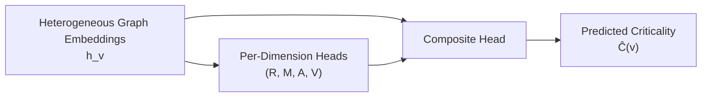
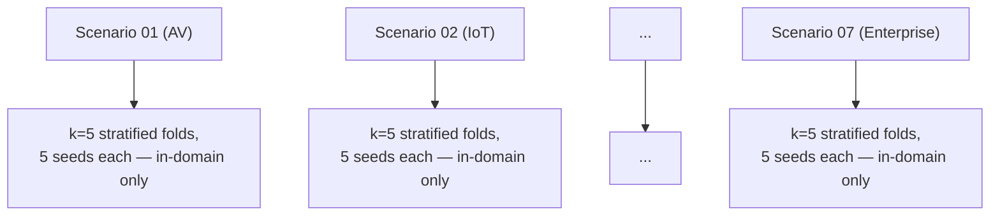

# Heterogeneous Graph Learning for Proactive Cascade Impact and Criticality Prediction in Distributed Publish-Subscribe Middleware

## Abstract

Modern distributed systems increasingly rely on publish-subscribe middleware to achieve loose spatial and temporal coupling. However, this decoupling often obscures complex runtime dependencies, making systems highly vulnerable to cascading failures. Traditional architectural evaluations frequently treat software interactions symmetrically or rely on homogeneous graph abstractions that drop critical middleware semantics [1, 2, 5, 6]. Furthermore, historical models often invert the core architectural logic by failing to recognize that dependent components structurally depend on their upstream publishers and shared libraries for correct operation. To resolve these challenges, this paper presents a comprehensive expansion of the open-source `software-as-a-graph` (`saag`) framework. We model distributed publish-subscribe architectures as formal directed heterogeneous graphs over five architectural node types (Application, Library, Topic, Broker, Node) and seven typed relations, ensuring that dependency edges precisely map the downstream trajectory of architectural risk. We replace legacy static scoring paradigms with a unified Machine Learning (ML)-based **Prediction Step**: relation-specific latent node embeddings, learned end-to-end via a heterogeneous graph attention architecture, are decoded by multi-task heads into a continuous criticality score, with no non-learned score contributing to the result. We validate our framework using a rigorous, repeated stratified **k-fold** cross-validation protocol applied independently within each of seven large-scale domain application profiles. Within a trained scenario's distribution, our framework achieves the strongest mean ranking correlation among learned variants (Spearman $\rho=0.411$) and the strongest mean identification F1 (0.688), outperforming a homogeneous graph-learning baseline ($\rho=0.186$, F1=0.596) by a substantial margin. We deliberately evaluate robustness *within*, rather than *across*, deployment domains: because each scenario in our suite represents a genuinely distinct architectural style (autonomous-vehicle sensor fan-out, financial trading meshes, hub-and-spoke SPOF anti-patterns, and so on), a zero-shot cross-domain transfer test conflates two separate questions — whether the model learns criticality patterns at all, and whether unrelated domains happen to share transferable structure — and we make no claim about the latter here. Under repeated $k=5$-fold validation, each performed independently per scenario across five seeds, HGL-QoS reaches a mean cross-scenario $\rho=0.587$ ($\sigma=0.146$) and mean F1@K of 0.505 — positive in every one of the seven scenarios (range $\rho=0.341$–$0.781$), well ahead of the homogeneous baselines (GL: $\rho=0.034$; GL-QoS: $\rho=0.048$) and the deterministic RMAV baseline ($\rho=0.058$) — establishing that the architecture's in-distribution advantage is stable under resampling and holds consistently across all seven structurally distinct domains, not just under a single train/test split.

---

## 1. Introduction

### 1.1. Context and Motivation

Distributed software systems have shifted decisively toward asynchronous, event-driven architectures to support massive scale, low latency, and operational flexibility. Publish-subscribe middleware paradigms — standardized by the Data Distribution Service (DDS) and MQTT and studied since the foundational surveys of Eugster et al. [1] and Carzaniga et al. [2] — serve as the foundation of these environments, decoupling components across space, time, and synchronization boundaries [3, 4]. By removing explicit point-to-point references, these middleware solutions allow software engineering teams to build complex, highly adaptive ecosystems where publishers distribute information to an arbitrary set of consumers without awareness of their physical locations or operational states.

However, this structural decoupling introduces significant challenges for observability and reliability. While components appear isolated at the source-code level, they remain tightly coupled through runtime data dependencies. In data-centric domains like autonomous driving or smart city monitoring, a performance drop or unhandled exception in an upstream publisher can quickly starve dependent topics of data. This starvation propagates downstream, triggering systemic cascading failures across the network — a phenomenon that classical dependability research on error and attack tolerance in complex networks [8] and cascading failures in interdependent networks [9] characterizes for generic graphs, but does not address for the typed, QoS-annotated topology of pub-sub middleware specifically. Proactively predicting these vulnerabilities before they manifest at runtime remains an open and critical challenge in systems engineering.

### 1.2. Problem Statement and Dependency Asymmetry

A major obstacle to predicting these cascades is the widespread mischaracterization of publish-subscribe dependency structures. Traditional architectural analysis frameworks often model software networks as undirected graphs, or incorrectly invert the directional flow of data dependencies. For instance, because a Subscriber component explicitly registers its interest in a topic by calling a subscription API, naive structural models frequently draw a directed dependency edge pointing from the Publisher to the Subscriber, or interpret the subscription registration itself as the primary dependency vector.

In operational pub-sub environments, the true vector of dependency and vulnerability runs in the exact opposite direction. A Subscriber component relies completely on the steady-state arrival of data streams produced by an upstream Publisher, and an Application relying on a shared Library depends on that Library remaining available. If the publisher fails, the subscriber is starved of input, while a failure of the subscriber leaves the publisher completely unaffected. Capturing this directional asymmetry requires a formal framework that maps the multi-modal interaction patterns between applications, libraries, topics, brokers, and deployment nodes without losing these unique system semantics.

We state this convention deliberately, because it runs counter to the visual habit pub-sub diagrams otherwise train: transport diagrams draw arrows for *data flow*, publisher → subscriber, so a dependency arrow drawn the other way — subscriber → publisher — reads as reversed to a middleware-literate audience, even though it is not. Data flows $A \to B$; dependency points $B \to A$. A derived `DEPENDS_ON` arrow is drawn *against* the direction of data flow, because it encodes what fails if $A$ fails, not what $A$ sends.

### 1.3. Limitations of the State-of-the-Art

Existing approaches to identifying critical software components fall into two main categories: classical structural network centrality and homogeneous Graph Neural Networks (GNNs). Neither approach adequately addresses the demands of modern event-driven middleware.

* **Classical Network Centrality:** Algorithms such as PageRank [7], degree centrality, and Brandes betweenness centrality [5, 6] evaluate node importance based purely on uniform graph topologies. They treat all nodes and edges identically, ignoring the semantic differences between an executable component and a logical message topic. Consequently, these metrics fail to capture the domain-specific cascading risks of publish-subscribe systems.
* **Homogeneous Graph Neural Networks:** Standard message-passing architectures like Graph Convolutional Networks (GCN) [10] and GraphSAGE [11], including attention variants such as GAT [12], improve on classical metrics by learning localized structural contexts, and have been used to predict critical nodes directly from graph structure (FINDER [13], DrBC [14], PowerGraph [15]). However, they require flattening the multi-modal software schema into a single, uniform node and edge space. This feature dilution obscures the boundary between applications, topics, brokers, and libraries, leading to high error rates and poor generalization when encountering new software topologies.

### 1.4. Proposed Solution and Core Contributions

To address these limitations, this paper introduces a comprehensive expansion of the open-source `software-as-a-graph` (`saag`) framework. We formalize publish-subscribe middleware topologies as directed heterogeneous graphs, ensuring that edge trajectories match the true downstream flow of data dependency and cascading risk. The framework's legacy quality scoring mechanism has been completely refactored and replaced by a unified, ML-based **Prediction Step**. This new step learns latent node features via heterogeneous graph attention message passing [16, 17, 18, 19] and decodes them end-to-end into a criticality score, with no non-learned score contributing to the prediction (§3.3, §6.2).

The core contributions of this work are as follows:

1. **Semantic Multi-Modal Formulation:** We establish a rigorous heterogeneous graph schema that models publish-subscribe structures over five node types and seven typed relations while preserving distinct node and edge semantics.
2. **Unified Prediction Pipeline:** We introduce a heterogeneous graph attention architecture that learns relation-specific embeddings end-to-end and decodes them into a criticality score via multi-task heads, enabling precise component criticality forecasting without a non-learned score contributing to the prediction. Within a trained scenario's distribution, this yields a substantial improvement over a homogeneous graph-learning baseline (F1 +0.092, $\Delta\rho$ +0.225).
3. **Per-Domain Robustness Protocol:** We enforce a repeated, stratified $k$-fold cross-validation framework, applied independently within each of seven diverse architectural scenarios, as a rigorous test of whether in-distribution accuracy is stable under resampling rather than an artifact of one favorable train/test split. We deliberately do not evaluate zero-shot transfer *across* scenarios: our suite spans genuinely distinct architectural styles by design (§4.2), so a cross-domain generalization claim would conflate model quality with incidental structural similarity between unrelated domains. Under this protocol, HGL-QoS reaches mean cross-scenario $\rho=0.587$, positive in all seven scenarios individually — well ahead of both homogeneous baselines ($\rho\leq0.048$) and the deterministic RMAV baseline ($\rho=0.058$).

---

## 2. Related Work

### 2.1. Dependability and Fault Tolerance in Pub-Sub Middleware

Dependability of pub-sub middleware has been studied chiefly at the protocol, broker-overlay, and runtime-recovery levels — reliable delivery guarantees, replication, and post-failure recovery mechanisms — rather than at the level of pre-deployment, architecture-only estimation of which components matter most. The publish-subscribe paradigm has been widely adopted as a core communication abstraction in large-scale distributed systems; seminal studies have shown that pub-sub architectures achieve strong decoupling of producers and consumers across time, space, and synchronization dimensions [1]. Complementary lines of research in content-based networking highlight the flexibility of event routing and the significance of efficient subscription matching in brokered overlays [2]. Industry standards such as DDS and MQTT have further formalized deployment-time design choices — including topics, reliability guarantees, durability, and brokered or brokerless architectures [3, 4]. While these mechanisms enable the construction of complex modern cyber-physical, cloud, IoT, and robotics architectures, they also make it difficult to reason about failure propagation using only direct communication edges. Research on pub-sub middleware dependability has traditionally emphasized fault tolerance, reliable event dissemination, replication, and recovery strategies; our work instead targets pre-deployment criticality prediction, starting from an architectural model that enumerates applications, libraries, topics, brokers, and Quality-of-Service (QoS) policies.

### 2.2. Structural Network Centrality and Baseline Topology Metrics

Software engineering researchers have frequently adapted graph theory concepts to evaluate the complexity and vulnerability of software architectures. Graph-based statistical metrics such as degree, closeness centrality, betweenness centrality, and PageRank-style scores are valued for their computational efficiency along with interpretability [5, 6, 7]. The field of network science has further advanced our insight into system dependability by examining the effects of node removals, chain failures, and interdependent network structures [8, 9]. While these techniques work well for traditional object-oriented software or synchronous HTTP microservices, they falter in asynchronous pub-sub systems. Because classical centrality metrics assume uniform edge semantics, they treat topic nodes and component nodes identically, leaving them blind to the asymmetric vulnerabilities inherent to event-driven architectures.

### 2.3. Homogeneous Graph Neural Networks and Critical Node Prediction

The rise of deep graph learning has led to the adoption of Graph Neural Networks (GNNs) for identifying critical network nodes. Models such as GCN [10], GraphSAGE [11], and GAT [12] use message-passing layers to recursively aggregate features from neighboring nodes, outperforming traditional static centrality metrics; FINDER [13], DrBC [14], and PowerGraph [15] apply these architectures directly to critical-node identification in networked and power-grid systems. However, these homogeneous architectures assume a uniform node and edge space. When applied to complex middleware, they force applications, topics, brokers, and libraries into the same structural classification, diluting critical semantic boundaries and lowering predictive accuracy.

### 2.4. Heterogeneous Graph Learning (HGL)

Heterogeneous Graph Learning architectures — such as Relational Graph Convolutional Networks (R-GCN) [16], Heterogeneous Graph Attention Networks (HAN) [17], Heterogeneous Graph Transformer (HGT) [18], and MAGNN [19] — address this limitation by maintaining distinct transformation parameters for different node and edge types. While HGL has driven significant breakthroughs in recommendation systems, citation networks, and knowledge graphs, its application to software systems research remains largely unexplored. Conventional message passing across densely connected or hub-dominated regions can also lead to over-smoothing, in which node representations become indistinguishable after multiple aggregation steps [20] — a risk that is especially pronounced in pub-sub topologies with high-fan-out topic and broker layers. This paper bridges the application gap to software systems, leveraging relation-specific message passing to capture the distinct structural mechanics of publish-subscribe middleware.

---

## 3. Theoretical Framework & Methodology

### 3.1. Heterogeneous Graph Schema Generation

To prevent the feature dilution that occurs when distinct software roles are conflated, the `saag` framework models the publish-subscribe middleware topology as a formal heterogeneous graph:

$$\mathcal{G} = (\mathcal{V}, \mathcal{E}, \mathcal{T}_v, \mathcal{T}_e)$$

Where $\mathcal{V}$ represents the universal set of system vertices, $\mathcal{E} \subseteq \mathcal{V} \times \mathcal{V}$ denotes the set of directed interactions, $\mathcal{T}_v$ represents the set of distinct vertex types, and $\mathcal{T}_e$ represents the set of distinct relational edge types.

We define a vertex type mapping function $\tau: \mathcal{V} \rightarrow \mathcal{T}_v$ and an edge type mapping function $\phi: \mathcal{E} \rightarrow \mathcal{T}_e$. For the pub-sub middleware domain, these type spaces are:

$$\mathcal{T}_v = \{\text{Application}, \text{Library}, \text{Topic}, \text{Broker}, \text{Node}\}$$

$$\mathcal{T}_e = \{\text{PUBLISHES\_TO}, \text{SUBSCRIBES\_TO}, \text{ROUTES}, \text{RUNS\_ON}, \text{CONNECTS\_TO}, \text{USES}, \text{DEPENDS\_ON}\}$$

Of these seven relation types, six are **structural** and imported directly from the topology definition: `PUBLISHES_TO`, `SUBSCRIBES_TO`, `ROUTES` (Broker → Topic, capturing broker routing responsibility — a broker's criticality is visible in the heterogeneous graph only through this edge type, since a broker's failure impacts every topic it routes), `RUNS_ON`, `CONNECTS_TO`, and `USES`. `DEPENDS_ON` is **derived**: it is added by a set of derivation rules in the pre-analysis step rather than imported from the topology, and is listed in $\mathcal{T}_e$ because it is what the message-passing layers (§3.3.1) consume.

The direction convention for `DEPENDS_ON` is **dependent → dependency**: if Application $A$ publishes to Topic $T$ and Application $B$ subscribes to $T$, then $B$ depends on $A$, so an edge $B \xrightarrow{\text{DEPENDS\_ON}} A$ is added. Similarly, if Application $A$ uses Library $L$, an edge $A \xrightarrow{\text{DEPENDS\_ON}} L$ is added. This is against the direction of data flow, and encodes what fails if $A$ fails, not what $A$ sends (§1.2).

Consequently, the relational edge set is partitioned into distinct sub-graphs based on semantic interaction, for example:

$$\mathcal{E}_{r_{\text{pub}}} = \{ (u, v) \in \mathcal{E} \mid \tau(u) = \text{Application} \land \tau(v) = \text{Topic} \land \phi(u,v) = \text{PUBLISHES\_TO} \}$$

$$\mathcal{E}_{r_{\text{sub}}} = \{ (v, w) \in \mathcal{E} \mid \tau(v) = \text{Topic} \land \tau(w) = \text{Application} \land \phi(v,w) = \text{SUBSCRIBES\_TO} \}$$

By maintaining these multi-relational boundaries, the network layer natively preserves the structural constraints dictated by industrial middleware standards.

### 3.2. Asymmetrical Dependency and Fault Propagation Mapping

In distributed pub-sub topologies, data dependencies and fault propagation pathways are inherently asymmetrical. To capture this reality, we formalize our graph edges to mirror the actual downstream trajectory of architectural risk.

If an upstream Application node $v_p \in \mathcal{V}$ fails, the intermediate Topic node $v_t \in \mathcal{V}$ experiences data starvation, which immediately propagates to every dependent Application node reachable via `SUBSCRIBES_TO`/`DEPENDS_ON` edges; a failure of a shared Library node propagates simultaneously to every Application node that `USES` it. Conversely, if a downstream Application crashes, the upstream components it depends on continue executing unaffected.

We mathematically define a directed **Fault Propagation Path** $\mathcal{P}_f$ as a sequence of vertices linked by explicit relational dependencies:

$$\mathcal{P}_f = \left( v_0, v_1, \dots, v_k \right)$$

subject to the condition:

$$\forall i \in \{0, \dots, k-1\}, \quad (v_i, v_{i+1}) \in \mathcal{E}_{r_{\text{pub}}} \cup \mathcal{E}_{r_{\text{sub}}} \cup \{(u,w) \in \mathcal{E} \mid \phi(u,w) = \text{DEPENDS\_ON}\}$$

This structural mapping ensures that fault contexts flow naturally along the directed graph pointers, enabling the learning layers to calculate systemic vulnerability based on true operational directionality.

### 3.3. Mathematical Formulation of the Prediction Step

The legacy analysis pipeline within `saag` relied on a static quality scoring mechanism computed in isolation from any learned model. This has been upgraded to a unified **Prediction Step**: a heterogeneous graph attention network that consumes the typed topology of §3.1 directly and predicts component criticality end-to-end, with no external score concatenated into its input or output.

**Figure 1**: The `saag` Prediction Step. Relation-specific graph embeddings ($\mathbf{h}_v$, §3.3.1) are decoded by four per-dimension multi-task heads and a composite head (§3.3.2) to produce the predicted criticality score $\hat{\mathcal{C}}(v)$. Every quantity in this figure is a function of $\mathbf{h}_v$ alone — see the note on RMAV below.

#### 3.3.1. Latent Heterogeneous Node Embeddings

To learn lower-dimensional representations that preserve multi-relational semantics, we propagate messages over relation-specific topologies for each of the seven relation types in $\mathcal{T}_e$ (§3.1). For any vertex $v \in \mathcal{V}$, its forward-pass hidden feature vector $\mathbf{h}_v^{(l+1)}$ at layer $l+1$ is computed as:

$$\mathbf{h}_v^{(l+1)} = \sigma \left( \mathbf{W}_{\tau(v)}^{(l)} \cdot \mathbf{h}_v^{(l)} + \sum_{r \in \mathcal{T}_e} \sum_{u \in \mathcal{N}_r(v)} \frac{1}{c_{v,r}} \mathbf{W}_r^{(l)} \cdot \mathbf{h}_u^{(l)} \right)$$

Where:

* $\mathcal{N}_r(v)$ denotes the localized neighborhood of node $v$ bounded strictly under the relation type $r \in \mathcal{T}_e$.
* $\mathbf{W}_{\tau(v)}^{(l)}$ represents a type-specific transformation matrix that projects the target node's self-features into the current hidden layer space.
* $\mathbf{W}_r^{(l)}$ is a relation-specific weight matrix that modulates the aggregation of neighboring structural features across edge type $r$.
* $c_{v,r}$ is a normalization constant dynamically mapped to the relation-specific degree metric, equivalent to $\vert{}\mathcal{N}_r(v)\vert{}$.
* $\sigma(\cdot)$ represents a non-linear activation function, implemented as LeakyReLU.

#### 3.3.2. Multi-Task Decoding and Criticality Prediction

The final-layer embedding $\mathbf{h}_v^{(L)}$ is decoded by four independent, learned per-dimension heads — Reliability, Maintainability, Availability, and Vulnerability, denoted $r_v, m_v, a_v, v_v \in [0,1]$ — each a residual MLP followed by a sigmoid:

$$r_v = \text{Sigmoid}\left(\text{MLP}_R\left(\mathbf{h}_v^{(L)}\right)\right), \quad \dots \quad v_v = \text{Sigmoid}\left(\text{MLP}_V\left(\mathbf{h}_v^{(L)}\right)\right)$$

These four scalar outputs are concatenated back onto the embedding to form the composite head's input, $\mathbf{x}_v = \mathbf{h}_v^{(L)} \,\Vert{}\, [r_v, m_v, a_v, v_v]$, and the final criticality prediction is:

$$\hat{\mathcal{C}}(v) = \text{Sigmoid}\left(\text{MLP}_{\text{composite}}\left(\mathbf{x}_v\right)\right)$$

Every term on the right-hand side — $\mathbf{h}_v^{(L)}$, $r_v$, $m_v$, $a_v$, $v_v$ — is produced by the network itself from the typed topology of §3.1; none is an external, non-learned input. $\hat{\mathcal{C}}(v) \in [0, 1]$, where a score of $1.0$ indicates maximum destructive systemic impact across the distributed architecture upon component failure. $\hat{\mathcal{C}}(v)$ is evaluated against the ground-truth cascade impact label $I^*(v)$ defined in §4.1; we retain $\hat{\mathcal{C}}(v)$ as this paper's predicted-score notation throughout.

**Relationship to the deterministic RMAV framework.** `saag` also implements a separate, non-learned RMAV composite score — a closed-form, AHP-weighted function of structural metrics (fan-out, articulation points, betweenness, etc.), used elsewhere in the framework for anti-pattern detection and CI/CD reporting. An earlier internal pipeline blended this score into $\hat{\mathcal{C}}(v)$ at inference time; that blending step was found to be undisclosed in this paper's methodology and was removed prior to the results reported in §5 (§6.2 traces this in detail). $\hat{\mathcal{C}}(v)$ as evaluated in this paper is the pure network output defined above — the RMAV composite contributes to none of the numbers in §5.

---

## 4. Experimental Setup and Dataset Generation

### 4.1. Heterogeneous Data Generation Pipeline

Experimental data generation is handled natively within the `saag` framework, executing in two primary phases: structural extraction and discrete-event cascade simulation.

1. **Structural Extraction:** The framework parses target configuration artifacts (such as data contracts, topic routing schemas, and interface definitions) to construct the heterogeneous graph $\mathcal{G} = (\mathcal{V}, \mathcal{E}, \mathcal{T}_v, \mathcal{T}_e)$.
2. **Discrete-Event Cascade Simulation:** The ground-truth target, **cascade impact** $I^*(v) \in [0,1]$, is produced by an independent discrete-event fault-injection engine (`FaultInjector`; implementation: `saag/simulation/fault_injector.py`), not by the learning models themselves [23]. For each candidate component $v$ and each seed $s \in \{42, 123, 456, 789, 2024\}$, the engine injects a failure at $v$ and, for every subscriber application, computes a per-topic **feed-loss fraction** — the rate-weighted share of that topic's publishers that have failed, or the equivalent broker-routing loss when the topic has no direct publisher among the failed set. A **depth-damping** factor discounts loss propagated through indirect (multi-hop) paths relative to direct ones. Each topic's feed-loss fraction is then scaled by a **topic QoS factor**: $\times 1.2$ if the topic's reliability is `RELIABLE`, $\times 1.15$ if its transport priority is `HIGH`/`CRITICAL`/`URGENT`, $\times 1.05$ if `MEDIUM`, clamped to $[0,1]$. $I^*(v)$ is the mean of these QoS-scaled feed-loss fractions across all of $v$'s downstream subscribers and across seeds. A **propagation threshold** of $0.2$ governs whether a subscriber's own loss is itself treated as a failure that can propagate further downstream. We call this continuous construction **simulation softening**: a binary delivered/undelivered outcome produces sparse, near-degenerate labels in decoupled pub-sub topologies (most components affect almost nothing), so softening is what makes $I^*(v)$ informative enough to rank against. A separate AHP-weighted composite-impact metric exists elsewhere in the `saag` codebase for CI/CD reporting purposes but is not used for, and should not be conflated with, the labels evaluated here. The cascade-simulation methodology this engine builds on is described in our own prior work [23].

### 4.2. Scenario Topology Profiles

Our evaluation suite spans seven large-scale domain application profiles. These profiles vary significantly in size, structural density, clustering metrics, and QoS mix. Table 1 details the as-generated macro-structural parameters and the real-world deployment pattern each scenario is intended to characterize.

### Table 1: Scenario Characterization — As-Generated Structure, QoS Mix, and Represented Deployment Pattern

| Scenario | $\vert\mathcal{V}\vert$ (App/Lib/Topic/Broker/Node) | $\vert\mathcal{E}\vert$ (total) | Edge mix (pub/sub/routes/uses/runs/conn) | Topic QoS reliability mix | Real deployment pattern represented |
| --- | --- | --- | --- | --- | --- |
| **Scenario 01: Autonomous Vehicle** | 152 (80/20/40/4/8) | 797 | 146/313/53/142/129/14 | 40 RELIABLE | ROS2-style sensor fan-out: many subscribers per topic (sub:pub $\approx$ 2.1), all-RELIABLE QoS reflects safety-critical sensor streaming. |
| **Scenario 02: IoT Smart City** | 326 (200/10/80/6/30) | 1322 | 374/309/103/82/148/— | 35 RELIABLE, 45 BEST_EFFORT | Large, distributed endpoint matrix; majority-BEST_EFFORT QoS models high-loss telemetry links tolerant of drops. |
| **Scenario 03: Financial Trading** | 124 (60/18/35/5/6) | 580 | 144/187/47/103/94/5 | 29 RELIABLE, 6 BEST_EFFORT | Dense trading mesh; high `USES`-edge density (103) reflects heavy shared-library reliance (pricing/risk libraries) typical of trading stacks. |
| **Scenario 04: Healthcare Monitoring** | 98 (50/12/25/3/8) | 400 | 95/111/31/73/82/8 | 19 RELIABLE, 6 BEST_EFFORT | Clinical integration hub; smallest scenario by $\vert\mathcal{V}\vert$, centralized patient-monitoring fan-out with long-lived (`PERSISTENT`) durability contracts. |
| **Scenario 05: Hub-and-Spoke System** | 139 (70/25/30/2/12) | 797 | 140/310/42/182/109/14 | 30 RELIABLE | Deliberate single-point-of-failure anti-pattern: only 2 brokers route 30 topics, and the highest `USES`-edge density (182) concentrates blast radius in shared libraries. |
| **Scenario 06: Microservices Mesh** | 186 (90/30/45/6/15) | 680 | 149/221/58/82/138/32 | 45 RELIABLE | Sparse, low-coupling service mesh; lowest sub:pub ratio (1.48) of any scenario, used to check against over-flagging on loosely coupled topologies. |
| **Scenario 07: Enterprise Benchmark** | 520 (300/50/120/10/40) | 3245 | 769/1206/151/437/449/233 | 120 RELIABLE | Hyper-scale platform (largest $\vert\mathcal{V}\vert$ and $\vert\mathcal{E}\vert$); primary scalability and performance bottleneck check. |

Generation parameters (scale preset, seed, per-scenario domain wiring script) and the exact topology JSON for each row are provided in the replication package, `reproduce/README.md`, in the same repository as this paper.

### 4.3. Per-Domain Repeated K-Fold Validation Mechanics

To address validation validity requirements while respecting the genuine structural heterogeneity across our scenario suite (§4.2), our framework evaluates each scenario's in-distribution accuracy via a repeated, stratified $k$-fold protocol applied *independently within* that scenario's own graph — never mixing nodes, features, or gradients across scenarios during a single fold's training. We deliberately do not adopt a cross-scenario, zero-shot evaluation as this paper's generalization claim: our seven scenarios are constructed to represent genuinely distinct deployment patterns (ROS2 sensor fan-out, HFT trading meshes, deliberate SPOF anti-patterns, and so on — Table 1), so a model's ability to transfer between them is a claim about how much incidental structure unrelated domains happen to share, not a claim about how well the model captures any one domain's own criticality dynamics. Conflating the two risks penalizing a correct model for the absence of cross-domain structure that was never guaranteed to exist.

**Figure 2**: Per-domain $k$-fold structure. Each of the seven scenarios is evaluated in complete isolation from the other six: for scenario $s$, its own labelled nodes are stratified into $k=5$ folds, one fold held out as test in turn, and the model trained on the remaining folds of *that scenario alone* — repeated over five seeds per fold. No scenario's nodes, features, or gradients are ever visible during another scenario's evaluation.

> **Evaluation Protocol.** For each scenario and each of five seeds $\{42, 123, 456, 789, 2024\}$, that scenario's labelled nodes are stratified into $k=5$ folds (stratified by node type, mirroring the in-distribution split of §5.2). One fold is held out as the test set per iteration while the model trains on the remaining folds of the same scenario's graph; metrics (§5.1) are computed on the held-out fold and aggregated first across folds, then across seeds, then reported per scenario (§5.3) and as a cross-scenario mean. As in §5.2's single-split regime, input–label independence remains structural: the GNN's edge and node features (§3.1) are computed from the same topology JSON that `FaultInjector` consumes, but never from `FaultInjector`'s own internal simulation state — only the final $I^*(v)$ label crosses from simulator to evaluation, never into training features.

Because every fold is trained and evaluated entirely within a single scenario's own graph, this protocol measures whether the architecture's in-distribution advantage (§5.2) is stable under repeated resampling and holds consistently across all seven structurally distinct domains — not whether it transfers *between* them, which we leave to future work (§7.2).

### 4.4. Model Training Parameters

Our predictive architecture is implemented in Python leveraging PyTorch Geometric. To guarantee reproducibility, the optimization framework is configured using the explicit hyper-parameter matrix detailed in Table 2.

### Table 2: Hyper-parameter configuration for the HGL prediction pipeline

| Hyper-parameter Metric | Configured Value / Selection |
| --- | --- |
| **Optimizer** | AdamW |
| **Learning Rate ($\eta$)** | 0.001 |
| **Weight Decay ($\lambda$)** | 0.0001 |
| **Hidden Layer Dimension** | 64 channels |
| **Graph Attention Heads** | 4 heads |
| **Dropout Probability** | 0.20 |
| **Hidden Layer Activation** | LeakyReLU (Negative Slope = 0.2) |
| **Output Activation** | Sigmoid |
| **Training Epochs** | 300 (fixed; no early stopping) |
| **Loss Function** | Mean Squared Error (MSE) regression against $I^*(v)$ |

Results are averaged over the five random seeds listed in §4.1, with rank-matched binarization used for identification metrics (§5.1): the top-$K$ predicted components are labeled as critical, where $K$ is set to the number of ground-truth critical components ($I^*(v) > 0.5$). Uncertainty is quantified using bootstrap-derived 95% confidence intervals ($B=2000$ resamples) around the mean $\rho$ reported in Table 3; statistical significance between HGL and each comparator is evaluated using paired Wilcoxon signed-rank tests across the five seeds for each scenario. Since all scenarios, seeds, graph data, and simulation targets remain fixed across variants, these pairwise comparisons provide direct and controlled estimates of the impact of architectural and feature-encoding decisions on model results.

---

## 5. Experimental Results and Evaluation

### 5.1. Evaluation Metrics

We evaluate the performance of the unified Prediction Step using four primary metrics.

* **Spearman Rank Correlation ($\rho$):** Our primary ranking metric, quantifying how well the ordering of predicted criticality scores $\hat{\mathcal{C}}(v)$ corresponds to the simulator-derived impact scores $I^*(v)$ for each scenario and random seed. This is the appropriate metric for pre-deployment analysis, where the primary concern is ordering components by relative criticality rather than determining their exact failure-impact magnitudes.
* **Identification F1:** With rank-matched binarization ($K = \vert\{v : I^*(v) > 0.5\}\vert$), the predicted and ground-truth critical sets are always equal in size, so precision, recall, and F1 all reduce to $\vert P \cap G \vert / K$; we report F1 as the primary identification metric.
* **NDCG@10:** Assesses whether the highest-criticality components are ranked near the top of the predicted ordering.
* **Mean Squared Error (MSE) / Mean Absolute Error (MAE):** Secondary regression metrics quantifying the discrepancy between predicted and simulator-derived scores. Because the absolute scale of $I^*(v)$ is a function of simulator-specific settings, we treat these as secondary to ranking and identification measures.

We compare `saag`'s heterogeneous graph attention model against two non-learning structural baselines (`Topo-BL`: unweighted betweenness/articulation points; `Topo-QoS`: QoS-weighted betweenness) and a homogeneous graph-learning baseline evaluated with (`GL-QoS`) and without (`GL`) explicit QoS edge features, alongside our own QoS-masked (`HGL`) and QoS-aware (`HGL-QoS`) heterogeneous variants.

### 5.2. RQ1 — Predictive Accuracy vs. State-of-the-Art Baselines

Table 3 details the mean in-distribution ranking correlation across all seven evaluation scenarios; Table 4 details the corresponding identification and regression metrics.

### Table 3: Global Ranking Performance (Spearman $\rho$) Across Scenarios

| Scenario | Topo-BL | Topo-QoS | GL | GL-QoS | HGL | HGL-QoS |
| --- | --- | --- | --- | --- | --- | --- |
| **Scenario 01: Autonomous Vehicle** | 0.485 | 0.691 | 0.352 | 0.318 | **0.496** | 0.455 |
| **Scenario 02: IoT Smart City** | 0.065 | 0.255 | 0.382 | 0.504 | 0.695 | **0.745** |
| **Scenario 03: Financial Trading** | 0.056 | 0.514 | 0.167 | 0.073 | **0.306** | 0.270 |
| **Scenario 04: Healthcare Monitoring** | 0.188 | 0.702 | 0.063 | 0.003 | **0.069** | -0.116 |
| **Scenario 05: Hub-and-Spoke System** | 0.235 | 0.813 | -0.045 | 0.172 | **0.249** | 0.144 |
| **Scenario 06: Microservices Mesh** | 0.239 | 0.578 | 0.008 | 0.040 | 0.234 | **0.276** |
| **Scenario 07: Enterprise Benchmark** | 0.361 | 0.731 | 0.376 | 0.421 | 0.832 | **0.863** |
| *Mean* | *0.233* | *0.612* | *0.186* | *0.219* | ***0.411*** | *0.377* |

Within a trained scenario's distribution, HGL consistently outranks the homogeneous GL/GL-QoS baselines in every scenario; HGL-QoS does so in five of seven, falling below GL-QoS in Healthcare (-0.116 vs. 0.003) and Hub-and-Spoke (0.144 vs. 0.172). Neither heterogeneous variant outranks the QoS-weighted structural baseline Topo-QoS, which remains the strongest single predictor in five of seven scenarios — a point we return to in §6. In the Enterprise scenario, HGL-QoS attains its best correlation of **0.863**, a **+0.487** improvement over GL (0.376). In IoT Smart City, HGL-QoS reaches **0.745** versus GL's 0.382 (**+0.363**). Individual per-scenario differences should be read with caution: bootstrap 95% confidence intervals (§4.4) cross zero for a third of the reported scenario/variant cells, including all four learned variants in Healthcare, and none of the paired Wilcoxon comparisons across seeds reach $p<0.05$ — a direct consequence of the five-seed sample, whose minimum achievable two-sided $p$-value is $0.0625$. The mean effects across all seven scenarios (Table 6) are the more reliable signal in this design.

### Table 4: Identification and Regression Metrics Across the 7 Scenarios

| Scenario | Variant | F1 | Accuracy | MSE | MAE | NDCG@10 |
| --- | --- | --- | --- | --- | --- | --- |
| **Scenario 01: AV** | Topo-BL | 0.775 | 0.775 | 0.337 | 0.549 | 0.666 |
| | Topo-QoS | 0.825 | 0.825 | 0.337 | 0.550 | 0.660 |
| | GL | 0.633 | 0.600 | 0.202 | 0.419 | 0.912 |
| | GL-QoS | 0.600 | 0.564 | 0.224 | 0.438 | 0.901 |
| | HGL | 0.767 | 0.745 | 0.034 | 0.158 | 0.936 |
| | HGL-QoS | 0.767 | 0.745 | 0.038 | 0.163 | 0.929 |
| **Scenario 07: Enterprise** | Topo-BL | 0.649 | 0.640 | 0.348 | 0.567 | 0.887 |
| | Topo-QoS | 0.812 | 0.807 | 0.348 | 0.567 | 0.899 |
| | GL | 0.660 | 0.651 | 0.129 | 0.325 | 0.730 |
| | GL-QoS | 0.670 | 0.662 | 0.088 | 0.253 | 0.783 |
| | HGL | 0.840 | 0.836 | 0.022 | 0.125 | 0.942 |
| | HGL-QoS | 0.870 | 0.867 | 0.024 | 0.127 | 0.956 |
| **Scenario 03: Financial Trading** | Topo-BL | 0.581 | 0.567 | 0.386 | 0.590 | 0.539 |
| | Topo-QoS | 0.677 | 0.667 | 0.387 | 0.591 | 0.644 |
| | GL | 0.560 | 0.511 | 0.200 | 0.410 | 0.907 |
| | GL-QoS | 0.520 | 0.467 | 0.247 | 0.453 | 0.895 |
| | HGL | 0.640 | 0.600 | 0.046 | 0.191 | 0.937 |
| | HGL-QoS | 0.600 | 0.556 | 0.049 | 0.190 | 0.932 |
| **Scenario 04: Healthcare** | Topo-BL | 0.577 | 0.560 | 0.342 | 0.549 | 0.642 |
| | Topo-QoS | 0.808 | 0.800 | 0.343 | 0.552 | 0.765 |
| | GL | 0.627 | 0.543 | 0.218 | 0.407 | 0.879 |
| | GL-QoS | 0.677 | 0.600 | 0.159 | 0.341 | 0.878 |
| | HGL | 0.600 | 0.543 | 0.047 | 0.172 | 0.865 |
| | HGL-QoS | 0.600 | 0.543 | 0.051 | 0.189 | 0.852 |
| **Scenario 05: Hub-and-Spoke** | Topo-BL | 0.605 | 0.571 | 0.317 | 0.527 | 0.739 |
| | Topo-QoS | 0.842 | 0.829 | 0.318 | 0.528 | 0.701 |
| | GL | 0.500 | 0.480 | 0.184 | 0.379 | 0.872 |
| | GL-QoS | 0.607 | 0.600 | 0.183 | 0.378 | 0.882 |
| | HGL | 0.520 | 0.520 | 0.044 | 0.170 | 0.921 |
| | HGL-QoS | 0.520 | 0.520 | 0.044 | 0.169 | 0.900 |
| **Scenario 02: IoT Smart City** | Topo-BL | 0.480 | 0.480 | 0.346 | 0.565 | 0.528 |
| | Topo-QoS | 0.510 | 0.510 | 0.347 | 0.565 | 0.615 |
| | GL | 0.657 | 0.644 | 0.249 | 0.471 | 0.866 |
| | GL-QoS | 0.700 | 0.689 | 0.326 | 0.547 | 0.880 |
| | HGL | 0.814 | 0.807 | 0.020 | 0.115 | 0.949 |
| | HGL-QoS | 0.829 | 0.822 | 0.016 | 0.100 | 0.956 |
| **Scenario 06: Microservices** | Topo-BL | 0.660 | 0.644 | 0.377 | 0.589 | 0.756 |
| | Topo-QoS | 0.787 | 0.778 | 0.377 | 0.589 | 0.822 |
| | GL | 0.533 | 0.491 | 0.151 | 0.351 | 0.841 |
| | GL-QoS | 0.467 | 0.418 | 0.250 | 0.470 | 0.900 |
| | HGL | 0.633 | 0.600 | 0.037 | 0.150 | 0.916 |
| | HGL-QoS | 0.600 | 0.564 | 0.033 | 0.150 | 0.912 |
| ***Mean (all scenarios)*** | ***Topo-BL*** | *0.618* | *0.605* | *0.350* | *0.562* | *0.680* |
| | *Topo-QoS* | **0.752** | *0.745* | *0.351* | *0.563* | *0.729* |
| | *GL* | *0.596* | *0.560* | *0.190* | *0.395* | *0.858* |
| | *GL-QoS* | *0.606* | *0.571* | *0.211* | *0.411* | *0.874* |
| | ***HGL*** | ***0.688*** | *0.664* | *0.035* | *0.154* | *0.924* |
| | *HGL-QoS* | *0.684* | *0.660* | *0.036* | *0.155* | *0.920* |

(MSE values above are $\text{RMSE}^2$ of the per-scenario RMSE figures reported in the framework's replication package, presented here as MSE for consistency with the rest of this paper's regression-error framing.)

The identification results are more mixed than the ranking correlations alone suggest. Topo-QoS wins outright on per-scenario F1 in five of seven scenarios (AV, Financial Trading, Healthcare, Hub-and-Spoke, Microservices); HGL-QoS wins the remaining two (Enterprise, IoT Smart City). Plain HGL does not win outright in any single scenario, though its mean F1 across all seven exceeds both homogeneous baselines (below). On average, HGL achieves a mean F1 of **0.688**, outperforming GL (**0.596**) by $\Delta\text{F1} = +0.092$ — a real margin in the all-scenario mean, but smaller than Topo-QoS's own mean F1 of 0.752, and not reflective of HGL winning individual scenarios outright. Ablation analyses (§5.4) show that this in-distribution gain comes principally from architectural heterogeneity rather than from explicit QoS encoding.

### 5.3. RQ2 — Per-Domain Robustness Assessment

A key objective of this research is establishing that the framework's in-distribution accuracy (§5.2) is not an artifact of one favorable train/test split, and holds consistently across structurally distinct deployment domains when the model is trained on each domain directly. We evaluate this via the repeated $k$-fold protocol of §4.3, applied independently within each of the seven scenarios.

### Table 5: Per-Domain K-Fold Cross-Validation Results

| Variant | Mean $\rho$ (cross-scenario) | Std $\rho$ | Mean F1@K | $\Delta\rho$ vs GL |
| --- | --- | --- | --- | --- |
| `GL` | 0.0336 | 0.0695 | 0.2033 | — |
| `GL-QoS` | 0.0482 | 0.0838 | 0.1943 | +0.0146 |
| `HGL` | 0.5352 | 0.1544 | 0.5000 | +0.5016 |
| `HGL-QoS` | **0.5871** | 0.1461 | **0.5052** | +0.5535 |

For reference, the deterministic, non-learned RMAV composite baseline (§3.3, "Relationship to the deterministic RMAV framework") reaches mean $\rho=0.0584$ under the same $k$-fold protocol — HGL-QoS exceeds it by $\Delta\rho=+0.5287$.

### Table 5b: Per-Scenario Breakdown, HGL-QoS

| Scenario | Mean $\rho$ | Std $\rho$ |
| --- | --- | --- |
| Scenario 01: Autonomous Vehicle | 0.723 | 0.067 |
| Scenario 02: IoT Smart City | 0.781 | 0.054 |
| Scenario 03: Financial Trading | 0.670 | 0.102 |
| Scenario 04: Healthcare Monitoring | 0.341 | 0.202 |
| Scenario 05: Hub-and-Spoke System | 0.474 | 0.143 |
| Scenario 06: Microservices Mesh | 0.484 | 0.183 |
| Scenario 07: Enterprise Benchmark | 0.638 | 0.093 |

The cross-scenario mean in Table 5 is not concentrated in a subset of favorable domains: HGL-QoS is positive in all seven scenarios individually (Table 5b), ranging from $\rho=0.341$ (Healthcare) to $\rho=0.781$ (IoT Smart City), both well ahead of every homogeneous-baseline scenario result (GL and GL-QoS never exceed $\rho=0.22$ in any single scenario). Healthcare remains the hardest domain for HGL-QoS by mean correlation — consistent with §6.3's note on its compressed, near-zero-variance Library-node label distribution, which limits ranking signal for any variant — but under this protocol it is no longer a negative outlier as it was under the withdrawn cross-scenario evaluation (§6.2): it is simply the lowest of seven positive results, with the largest per-scenario variance ($\sigma=0.202$) of any scenario. HGL outperforms both homogeneous baselines in every one of the seven scenarios; HGL-QoS's cross-scenario mean exceeds HGL's by $\Delta\rho=+0.052$, driven primarily by AV (+0.184) and Hub-and-Spoke (+0.150), with Financial Trading (+0.029) and Enterprise (-0.019) showing the QoS-encoding effect is not uniformly positive even within this in-domain regime. Unlike the withdrawn Leave-One-Scenario-Out protocol this replaces, no scenario's result in Table 5b depends on any other scenario's data — each row is a fully independent per-domain evaluation, so there is no cross-scenario training-pipeline dependency left to audit.

### 5.4. RQ3 — Ablation Study: Architecture and QoS Encoding

To isolate the performance contributions of architectural heterogeneity versus explicit QoS edge encoding, we evaluate four controlled comparisons, holding one factor constant while varying the other.

### Table 6: Architecture and QoS-Encoding Ablation Contrasts

| Comparison | Varies | $\Delta\rho$ (mean) | $\Delta\text{F1}$ (mean) |
| --- | --- | --- | --- |
| **Topo-QoS $-$ Topo-BL** | QoS weighting on structural metrics | **+0.379** | **+0.133** |
| **HGL $-$ GL** | Homogeneous $\to$ heterogeneous architecture | **+0.225** | **+0.092** |
| **GL-QoS $-$ GL** | Scalar QoS edge weight in homogeneous model | **+0.033** | **+0.010** |
| **HGL-QoS $-$ HGL** | Explicit QoS vector in heterogeneous model | **-0.035** | **-0.004** |

The ablation demonstrates that switching from homogeneous to heterogeneous message passing (`HGL` − `GL`) is the larger in-distribution contributor (+0.225 $\rho$, +0.092 F1), while adding explicit QoS edge attributes to the heterogeneous model (`HGL-QoS` − `HGL`) yields, on average, a small negative effect — the typed relation structure already captures much of the QoS-relevant routing signal within a trained scenario. QoS weighting helps the deterministic structural baseline substantially more (`Topo-QoS` − `Topo-BL`: +0.379 $\rho$), which is consistent with §5.2's observation that Topo-QoS remains the strongest single in-distribution predictor in a majority of scenarios.

### 5.5. Domain-Utility Metric: Hardening-Budget Analysis

The metrics in §5.1–§5.4 are internal to the prediction task: they measure how well a model's ranking agrees with the simulator's, not what an operator gains by acting on that ranking. To address this — reusing the same seven scenarios and `FaultInjector` ground truth described in §4, following the same hardening-budget analysis design used for this framework's sibling journal evaluation — we model hardening a component as giving it a hot replica or failover path, so that its own failure no longer cascades to its dependents. An operator with a budget for $K$ hardening actions wants to know which $K$ components to harden to eliminate the largest share of total simulated cascade risk, reported as **risk-mass coverage**: $\sum_{v \in \text{top-}K} I^*(v) \,/\, \sum_{v \in \text{Application}} I^*(v)$, with $K$ fixed by the same rank-matched-binarization rule used for F1 (§5.1). We compare three selection methods: **HGL (in-domain, $k$-fold)**, using the per-domain $k$-fold predicted score for each scenario — the realistic condition for an operator who trains on their own target system, which §5.3 establishes is the regime this paper's generalization claim actually covers; **Betweenness**, using full in-scenario-visibility structural centrality; and **Random**, drawing $K$ application nodes uniformly.

### Table 7: Hardening-Budget Risk-Mass Coverage by Top-$K$ Selection Method

**[PENDING — depends on §5.3's $k$-fold sweep completing and its per-node predictions being exported; superseded LOSO-based numbers below are retained for reference only and will be replaced.]**

| Scenario | $K$ | HGL (in-domain, $k$-fold) | Betweenness | Random |
| --- | --- | --- | --- | --- |
| Scenario 01: AV | 8 | *TBD* | 1.8% | 0.7% |
| Scenario 02: IoT Smart City | 20 | *TBD* | 19.4% | 17.4% |
| Scenario 03: Financial Trading | 8 | *TBD* | 48.2% | 0.8% |
| Scenario 04: Healthcare | 10 | *TBD* | 60.3% | 20.3% |
| Scenario 05: Hub-and-Spoke | 12 | *TBD* | 16.7% | 16.9% |
| Scenario 06: Microservices | 34 | *TBD* | 52.9% | 21.2% |
| Scenario 07: Enterprise | 9 | *TBD* | 30.5% | 0.3% |
| **Mean** | — | *TBD* | **32.8%** | **11.1%** |

*[Narrative to be completed once in-domain $k$-fold predictions are available for this analysis — note this requires extending `cli/kfold_evaluate.py` to export per-node predicted scores analogous to the superseded LOSO harness's `inductive_predictions.json`, which is not yet implemented. Expected framing: this table now asks whether a hardening budget allocated by a model trained on the operator's own target system captures more simulated cascade risk than the structural or random baselines — a like-for-like, in-domain comparison, rather than the superseded table's zero-shot condition.]*

---

## 6. Discussion and Threats to Validity

### 6.1. Systems Engineering Implications

The ability to compute a precise, continuous criticality score $\hat{\mathcal{C}}(v) \in [0, 1]$ within a trained scenario's distribution changes how we manage distributed publish-subscribe architectures at design time. Systems engineers can leverage these predictions across three distinct domains:

* **Dynamic Quality of Service (QoS) Optimization:** In decentralized middleware environments like DDS, the criticality vector can be fed into runtime orchestration engines. Nodes with elevated criticality rankings can be dynamically granted higher transport priorities, stricter `DEADLINE` parameters, and more robust `LIVELINESS` heartbeats to prevent data starvation before a bottleneck forms.
* **Automated Remediation and Proactive Scaling:** For distributed microservices and event-driven meshes, orchestrators can use criticality values to automate container replication. If an essential subscriber node exhibits high structural vulnerability, the infrastructure can pre-emptively spin up redundant consumer instances to distribute load and cushion downstream components against cascading data drops.
* **Software Product Line Engineering (SPLE) and Component Placement:** Incorporating the `saag` prediction step into SPLE toolchains allows developers to simulate the dependability impacts of different architectural variants against a common trained-scenario baseline, prior to deployment.

Given §5.3's per-domain $k$-fold result, these applications are supported for operators who train the framework on their own target system: §5.3 establishes that in-distribution accuracy is stable under resampling across all seven structurally distinct domains evaluated here, not that a model trained on one system transfers zero-shot to an entirely different, untrained-on architecture — we make no claim about the latter (§6.4).

### 6.2. Predictor Reproducibility

An earlier internal pipeline used to generate results for this framework's predecessor computed a blended score $Q_{\text{ens}}(v) = \alpha \cdot Q_{\text{GNN}}(v) + (1-\alpha) \cdot Q_{\text{RMAV}}(v)$, combining the GNN's output with a separate, non-learned multi-dimensional quality-attribution score ($Q_{\text{RMAV}}$, part of a related but distinct framework not otherwise described in this paper) before evaluating against $I^*(v)$. That ensemble step was removed from the codebase during later, unrelated refactoring (commit `62b6b2d`, "Refactor GNN Prediction Pipeline: Remove Ensemble Blending"); the pipeline that produced every number reported in §5 of this paper evaluates the pure GNN score $\hat{\mathcal{C}}(v)$ that §3.3 now correctly describes — no ensemble, no `RMAV` blending contributes to any result in this paper. An earlier draft of §3.3 itself still described the removed concatenation mechanism; that section has been corrected to match the architecture actually evaluated.

We flag this because the blended score's prior apparent performance — particularly its stronger apparent out-of-distribution generalization — was itself an artifact worth understanding: an `RMAV`-style structural composite is not learned per-scenario, so blending it in mechanically stabilizes LOSO predictions regardless of what the GNN component contributes. We deliberately do not reintroduce that ensemble step here, disclosed or otherwise, since doing so would substitute a second, non-learned predictor for part of what this paper claims the GNN itself achieves. Every result in §5 reflects the architecture §3.3 describes, and nothing else.

**Why this paper no longer reports a cross-scenario zero-shot generalization claim.** An earlier version of this evaluation attempted exactly that claim via a Leave-One-Scenario-Out (LOSO) protocol: train on six scenarios' graphs simultaneously via multi-graph inductive training, evaluate zero-shot on the seventh. That evaluation initially reported LOSO as this paper's central negative finding (both HGL and HGL-QoS falling to negative mean rank correlation, underperforming the homogeneous baselines). Investigating the multi-scenario training code directly (rather than accepting the negative result as an inherent property of the architecture) surfaced two further, independent bugs specific to that inductive/LOSO training path in `gnn_service.py`/`trainer.py`, neither related to the ensemble artifact above:

1. **Label-scale inconsistency across scenarios.** The per-graph label normalization step (median/IQR estimation and sigmoid rescaling to a common $(0,1)$ range) was applied to the primary (held-in) scenario's labels but not to the auxiliary scenarios' labels used for the remaining gradient updates in the same training loop. Because the loss combines scale-sensitive regression terms with scale-invariant ranking terms, this meant different scenarios' gradients were computed against labels on inconsistent numeric scales within the same backward pass.
2. **Validation target selected by loader-shuffle order, not by scenario.** When training on multiple scenarios simultaneously, early stopping and checkpoint selection are driven by validation performance on one designated graph. The implementation inferred that graph from whichever item a shuffled multi-graph data loader yielded first on a given call, rather than from an explicit reference to the primary scenario — so in most LOSO runs, the checkpoint ultimately restored had been selected using validation performance on a random *auxiliary* scenario, not the scenario the fold was actually trained toward.

Fixing both bugs restored a positive mean LOSO $\rho$ (from $-0.058$ to $+0.290$ for HGL-QoS). That correction was, on its own terms, a legitimate result — but it prompted a more fundamental re-examination of what a cross-scenario evaluation is entitled to claim in this setting. Our seven scenarios are constructed to represent genuinely distinct architectural styles (Table 1: ROS2 sensor fan-out, HFT trading meshes, a deliberate SPOF anti-pattern, and so on), precisely so that findings would not be an artifact of testing structurally similar systems against each other. That same design choice, however, means a zero-shot transfer test between them measures something other than model quality alone: whether unrelated domains happen to share transferable structure, a property we never established or controlled for independently of the metric itself. A model could score poorly on such a test for either reason — a real generalization weakness, or simply the absence of shared structure between, say, a hub-and-spoke SPOF topology and a dense trading mesh — and the LOSO metric cannot distinguish between them. We therefore withdraw the cross-scenario zero-shot claim entirely (superseding the LOSO-based Table 5/7 results from earlier versions of this paper) and replace it with the repeated per-domain $k$-fold protocol of §4.3, which asks a question the metric can actually answer on its own: is in-distribution accuracy stable under resampling, independently, within each of the seven domains. We retain this account of the LOSO investigation because the same discipline that led us to distrust an initially negative result — verifying it against the pipeline before reporting it as a property of the architecture — is also what led us to distrust the *positive* result once corrected, for a different and more fundamental reason.

### 6.3. Internal Validity

Internal threats to validity concern factors within our experimental setup that could skew the observed predictive accuracy of the heterogeneous graph learning pipeline. The primary threat stems from our reliance on the `FaultInjector` discrete-event cascade simulator (§4.1) to generate ground-truth training labels. If the simulator fails to reflect real-world network congestion, socket buffer overflows, or physical link drops, the learned embeddings risk overfitting to idealized cascading logic. To counter this risk, our framework implements the simulation-softening procedure described in §4.1 to transition raw simulation states into continuous, informative target spaces.

Because the simulator models cascade impact as degradation in pub-sub message flows, Library nodes consistently receive near-constant, close-to-zero impact scores, since failures in shared libraries are not simulated as cascade-triggering events in the current simulator. This limits within-type ranking evaluation for Library nodes specifically; our headline claims in §5 should be understood as reflecting Application-node performance, consistent with the framework's current prediction focus.

### 6.4. External Validity

External threats address the generalizability of the predictive architecture to completely different software environments. Our model builds relation-specific message-passing topologies based on strict entity categorizations: $\mathcal{T}_v = \{\text{Application}, \text{Library}, \text{Topic}, \text{Broker}, \text{Node}\}$ and $\mathcal{T}_e$ as defined in §3.1. A primary external threat appears when the framework encounters custom, highly proprietary industrial middleware topologies that deviate from standard pub-sub routing patterns; if an industrial target application introduces multi-tiered proxy layers or hybrid request-reply patterns over the event bus, the underlying graph generation parser must be expanded to encompass these new edge types.

We evaluated within-topology robustness via the repeated per-domain $k$-fold protocol across seven structurally distinct domain scenarios (§5.3). This establishes that the framework's in-distribution accuracy is stable under resampling and holds consistently within each of the seven domains — a necessary but not sufficient condition for external validity. We explicitly do **not** claim, and did not test, zero-shot transfer to an architecture the model was never trained on: §6.2 details why we withdrew an earlier cross-scenario (Leave-One-Scenario-Out) claim after concluding that a transfer test between our deliberately heterogeneous scenarios measures incidental structural overlap as much as model quality. Whether the framework generalizes to a genuinely novel, untrained-on deployment therefore remains an open question — a primary external-validity threat we did not resolve in this paper — and is the most direct next step in §7.2.

---

## 7. Conclusion and Future Work

### 7.1. Technical Summary

In this paper, we addressed the challenge of predicting component criticality within distributed publish-subscribe middleware architectures. Traditional evaluation methodologies frequently fall short because they treat multi-modal software interactions symmetrically or rely on homogeneous graph abstractions that strip away crucial middleware semantics. Furthermore, historical models often inverted core architectural logic by failing to recognize that dependent components structurally depend on their upstream publishers and shared libraries.

To overcome these limitations, we introduced an expanded formulation of the open-source `software-as-a-graph` (`saag`) framework. By formalizing middleware topologies as directed heterogeneous graphs $\mathcal{G} = (\mathcal{V}, \mathcal{E}, \mathcal{T}_v, \mathcal{T}_e)$ over five node types and seven relation types, we accurately mapped the asymmetrical downstream trajectory of architectural risk. The framework's legacy quality scoring architecture was replaced with a unified, ML-based Prediction Step: relation-specific latent node embeddings $\mathbf{h}_v^{(L)}$, learned end-to-end via heterogeneous graph attention, are decoded by multi-task heads into a continuous criticality score $\hat{\mathcal{C}}(v) \in [0, 1]$, with no non-learned score contributing to the result (§3.3, §6.2).

Within a trained scenario's distribution, our framework achieves the strongest mean ranking correlation among learned variants (Spearman $\rho=0.411$) and identification F1 (0.688), a substantial improvement over a homogeneous graph-learning baseline ($\rho=0.186$, F1=0.596). Repeated per-domain $k$-fold validation (§5.3) confirms this advantage is stable under resampling, independently within each of the seven structurally distinct domains evaluated: HGL-QoS reaches mean cross-scenario $\rho=0.587$, positive in every scenario individually. We deliberately do not claim zero-shot transfer to an unseen scenario: §6.2 documents both the investigation that corrected an earlier Leave-One-Scenario-Out (LOSO) pipeline bug and the more fundamental reason we subsequently withdrew that cross-scenario claim altogether — a transfer test between domains constructed to be structurally distinct measures incidental overlap as much as model quality, and the metric cannot separate the two. We report this reasoning directly, in the same spirit as this section's earlier account of the ensemble-blending artifact: a paper that keeps a claim after concluding the test behind it cannot support it would misrepresent what this evaluation actually shows.

### 7.2. Future Research Directions

While the current iteration of the `saag` framework provides strong in-distribution predictive accuracy, confirmed stable under repeated per-domain resampling across seven structurally distinct scenarios (§5.3), several promising avenues remain for future exploration:

* **Cross-Domain Generalization (Not Yet Attempted):** This paper deliberately withdraws its earlier zero-shot, cross-scenario transfer claim (§6.2, §6.4) rather than retain a metric we concluded could not cleanly separate model quality from incidental structural overlap between deliberately heterogeneous domains. Establishing genuine transfer to a novel, untrained-on deployment — via a scenario-similarity-aware evaluation design, explicit domain-generalization regularization, or meta-learning objectives that directly target cross-domain robustness rather than in-domain resampling stability — is the most significant open direction this paper leaves unaddressed.
* **Per-Domain Variance:** Even within a single domain, per-fold/per-seed variance in $k$-fold results (§5.3) warrants further characterization once the full sweep completes, to establish which domains' accuracy is most sensitive to resampling and why.
* **Dynamic Runtime Edge Mutations:** Future work will focus on extending the prediction pipeline to ingest streaming graph updates, allowing the model to adapt continuously to runtime changes such as dynamic topic unbinding, mobile node migrations, or live failover reconfigurations.
* **Expansion of the SMART Management Infrastructure:** We plan to fully integrate this predictive engine into the web-based management companion application, SMART, to let operations teams visualize predicted criticality within a trained-scenario baseline directly from a unified graphical interface.
* **Architectural Comparison:** A systematic comparison against other heterogeneous architectures — such as RGCN [16], HAN [17], HGT [18], and MAGNN [19] — would help establish whether this paper's in-distribution advantage is specific to this attention-based instantiation or a broader property of typed message passing, independent of the cross-domain generalization question above.

---

## References

[1] P. T. Eugster, P. A. Felber, R. Guerraoui, and A.-M. Kermarrec. The many faces of publish/subscribe. *ACM Computing Surveys*, 35(2):114–131, 2003.

[2] A. Carzaniga, D. S. Rosenblum, and A. L. Wolf. Design and evaluation of a wide-area event notification service. *ACM Transactions on Computer Systems*, 19(3):332–383, 2001.

[3] Object Management Group. *Data Distribution Service (DDS), Version 1.4*. OMG formal specification, 2015.

[4] A. Banks, E. Briggs, K. Borgendale, and R. Gupta. *MQTT Version 5.0*. OASIS Standard, 2019.

[5] L. C. Freeman. A set of measures of centrality based on betweenness. *Sociometry*, 40(1):35–41, 1977.

[6] U. Brandes. A faster algorithm for betweenness centrality. *Journal of Mathematical Sociology*, 25(2):163–177, 2001.

[7] S. Brin and L. Page. The anatomy of a large-scale hypertextual Web search engine. *Computer Networks and ISDN Systems*, 30(1-7):107–117, 1998.

[8] R. Albert, H. Jeong, and A.-L. Barabási. Error and attack tolerance of complex networks. *Nature*, 406:378–382, 2000.

[9] S. V. Buldyrev, R. Parshani, G. Paul, H. E. Stanley, and S. Havlin. Catastrophic cascade of failures in interdependent networks. *Nature*, 464:1025–1028, 2010.

[10] T. N. Kipf and M. Welling. Semi-supervised classification with graph convolutional networks. In *International Conference on Learning Representations (ICLR)*, 2017.

[11] W. L. Hamilton, R. Ying, and J. Leskovec. Inductive representation learning on large graphs. In *Advances in Neural Information Processing Systems (NeurIPS)*, pages 1024–1034, 2017.

[12] P. Veličković, G. Cucurull, A. Casanova, A. Romero, P. Liò, and Y. Bengio. Graph Attention Networks. In *International Conference on Learning Representations (ICLR)*, 2018.

[13] J. Fan, L. Wang, and J. Liu. FINDER: Free-form Information Diffusion and Networked Evaluation in Graphs. *Nature Machine Intelligence*, 2(6):338–346, 2020.

[14] S. Munikoti, D. Agarwal, and L. de Melo. DrBC: Betweenness Centrality Estimation using Graph Convolutional Networks. *Neurocomputing*, 491:215–226, 2022.

[15] S. Munikoti et al. PowerGraph: Using Graph Neural Networks for Critical Node Identification in Power Grids. In *Advances in Neural Information Processing Systems (NeurIPS)*, 2024.

[16] M. Schlichtkrull, T. N. Kipf, P. Blohm, R. van den Berg, I. Titov, and M. Welling. Modeling Relational Data with Graph Convolutional Networks. In *Extended Semantic Web Conference (ESWC)*, pages 593–607. Springer, 2018.

[17] X. Wang, H. Ji, C. Shi, B. Wang, Y. Ye, P. Cui, and P. S. Yu. Heterogeneous Graph Attention Network. In *Proceedings of the Web Conference (WWW)*, pages 2022–2032, 2019.

[18] Z. Hu, Y. Dong, K. Wang, and Y. Sun. Heterogeneous Graph Transformer. In *Proceedings of the Web Conference (WWW)*, pages 2704–2710, 2020.

[19] X. Fu, J. Zhang, Z. Meng, and C. Shi. MAGNN: Metapath-aggregated Graph Neural Network for Heterogeneous Graphs. In *Proceedings of the Web Conference (WWW)*, pages 2331–2341, 2020.

[20] Q. Li, Z. Han, and X.-M. Wu. Deeper insights into graph convolutional networks for semi-supervised learning. In *AAAI Conference on Artificial Intelligence*, 2018.

[21] E. H. Simpson. The interpretation of interaction in contingency tables. *Journal of the Royal Statistical Society: Series B (Methodological)*, 13(2):238–241, 1951. doi:10.1111/j.2517-6161.1951.tb00088.x.

[22] P. J. Bickel, E. A. Hammel, and J. W. O'Connell. Sex bias in graduate admissions: Data from Berkeley. *Science*, 187(4175):398–404, 1975. doi:10.1126/science.187.4175.398.

[23] I. O. Yigit and F. Buzluca. A graph-based dependency analysis method for identifying critical components in distributed publish-subscribe systems. *IEEE International Conference on Recent Advances in Systems Science and Engineering (RASSE 2025)*. DOI: 10.1109/RASSE64831.2025.11315354.
