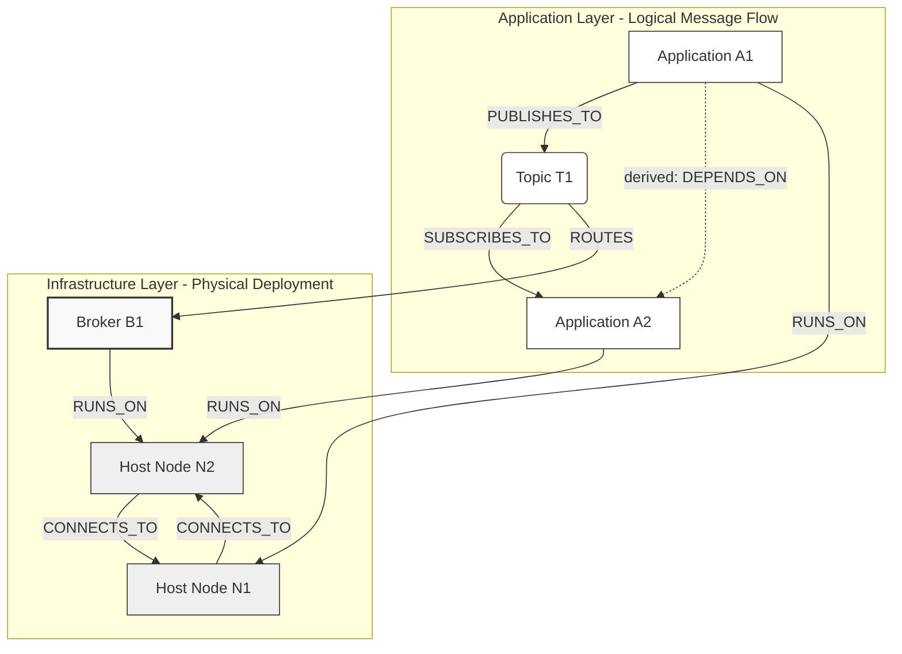

# A Graph-Based Dependency Analysis Method for Identifying Critical Components in Distributed Publish-Subscribe Systems

This document summarizes the research study and findings presented in the IEEE RASSE 2025 paper: [IEEE_RASSE_2025.pdf](file:///home/onuralpyigit/Workspace/SoftwareAsAGraph/docs/research/rasse2025/IEEE_RASSE_2025.pdf).

---

## 1. Executive Summary

Distributed publish-subscribe (pub-sub) architectures enable decoupled, asynchronous, and highly scalable communication across microservices, IoT environments, and robotic systems (such as ROS 2). However, their decoupled nature makes it extremely challenging to analyze system-wide dependencies, predict cascading failure propagation, and identify single points of failure (SPOFs) at design time.

The RASSE 2025 paper introduces a **multi-layer graph-based dependency analysis framework** that captures both:
* **Application-level dependencies**: How applications depend on each other via shared topics.
* **Infrastructure-level dependencies**: How broker hosting and compute node layouts introduce physical bottleneck risks.

By applying classic graph-theoretic metrics—specifically **Betweenness Centrality** and **Articulation Point Detection**—the framework computes a composite **Criticality Score ($CS$)** to pinpoint vulnerabilities before deployment. The method was validated against dynamic simulations (reachability loss) across simulated networks and real-world ROS 2 benchmarks, demonstrating an outstanding average correlation coefficient of **$\rho = 0.94$** between predicted criticality and actual failure impact.

---

## 2. Multi-Layer Graph Model

The core methodology represents a publish-subscribe system as a directed, multi-layer graph containing multiple node types and typed edges.

### 2.1 Formal System Definition
A distributed pub-sub system is modeled as a tuple:

$$\mathcal{S} = (A, T, B, N, P, S, H)$$

where:
* $A = \{A_1, A_2, \dots, A_m\}$: Set of applications (services/processes).
* $T = \{T_1, T_2, \dots, T_k\}$: Set of communication topics.
* $B = \{B_1, B_2, \dots, B_q\}$: Set of message brokers (can be empty in broker-less setups).
* $N = \{N_1, N_2, \dots, N_p\}$: Set of physical or virtual compute nodes (hosts).
* $P \subseteq A \times T$: Publication relationships (application publishes to topic).
* $S \subseteq A \times T$: Subscription relationships (application subscribes to topic).
* $H: (A \cup B) \to N$: Hosting mapping (where applications/brokers are deployed).

The resulting graph $G = (V, E, w)$ extends this representation with:
* $V = A \cup T \cup B \cup N$ (Vertex set)
* $E \subseteq V \times V \times L$ (Typed directed edges with labels $L$)

### 2.2 Edge Taxonomy ($L$)
Six distinct relationship types are captured:
1. **`PUBLISHES_TO`** ($A_i \to T_x$): Flow of messages from an application to a topic.
2. **`SUBSCRIBES_TO`** ($T_x \to A_i$): Message consumption from a topic by an application.
3. **`ROUTES`** ($B_k \to T_x$): Responsibility of a broker for managing a topic.
4. **`RUNS_ON`** ($(A \cup B) \to N$): Physical deployment mapping of software to hardware.
5. **`DEPENDS_ON`** ($A_i \to A_j$): *Derived* logical dependency where $A_i$ consumes a topic published to by $A_j$.
6. **`CONNECTS_TO`** ($N_i \to N_j$): Underlying network links between compute nodes or brokers.

### 2.3 Layered Visual Architecture
The framework separates concerns into two primary views, enabling operators to analyze logical flow and physical layout:

---

## 3. Graph Analysis & Criticality Scoring

The framework identifies critical components using purely topological metrics, meaning it does **not** require instrumentation, runtime agents, or dynamic traffic monitoring.

### 3.1 Topological Metrics
1. **Betweenness Centrality ($C_B$)**: Quantifies the extent to which a component acts as a communication bridge.
   
   $$C_B(v) = \sum_{s \neq v \neq t \in V} \frac{\sigma_{st}(v)}{\sigma_{st}}$$

   where $\sigma_{st}$ is the number of shortest paths from node $s$ to $t$, and $\sigma_{st}(v)$ is the number of those paths that pass through node $v$.

2. **Articulation Points ($AP$)**: Detects structural bottlenecks whose failure or removal would split the network into disconnected subgraphs (representing single points of failure).
   
   $$AP(v) = \begin{cases} 1 & \text{if } |CC(G - v)| > |CC(G)| \\ 0 & \text{otherwise} \end{cases}$$

   where $CC(G)$ is the set of connected components in the graph $G$.

### 3.2 Composite Criticality Score ($CS$)
To capture both bridge-like communication properties and structural vulnerability, a composite score is defined:

$$CS(v) = \alpha \cdot C_B(v) + \beta \cdot AP(v)$$

where $\alpha, \beta \in [0,1]$ are weights such that $\alpha + \beta = 1$. The paper sets $\alpha = 0.7$ and $\beta = 0.3$, prioritizing the bridge density while giving significant weight to articulation points.

---

## 4. Failure Simulation & Validation

To prove that the topological $CS(v)$ successfully predicts real-world failure impacts, the paper introduces a validation phase based on **Reachability Loss ($RL$)**.

### 4.1 Reachability Loss
For each component $v$, the algorithm simulates its removal and computes the percentage of message paths that are broken:

$$RL(v) = \frac{R_{\text{original}} - R_{\text{after}}(v)}{R_{\text{original}}} \times 100\%$$

where:
* $R_{\text{original}}$ is the number of reachability paths (directed paths between all application pairs) in the healthy graph.
* $R_{\text{after}}(v)$ is the reachability count after removing vertex $v$.

### 4.2 Additional Impact Metrics
* **Graph Fragmentation ($\Delta CC(v)$)**: Measures how many new disconnected subgraphs are created.
* **Isolated Applications ($IA(v)$)**: Counts how many applications lose all communication channels (incoming and outgoing).
* **SCC Degradation**: Monitors changes in the count of Strongly Connected Components.

---

## 5. Case Studies & Experimental Results

The methodology was evaluated across a simulated publish-subscribe setup and two robotic benchmarks using the iRobot ROS 2 Performance Evaluation Framework.

### 5.1 Case Study 1: Simulated System
* **Setup**: 2 brokers, 4 nodes, 10 applications, 25 topics.
* **Key Application Findings**:
  * **`App_2`** emerged as the most critical application: $CS = 0.592$ ($C_B = 0.417$, $AP = 1$). Simulating its failure resulted in **66.7% Reachability Loss** and **isolated 4 applications**.
  * **`App_1`** was second: $CS = 0.097$, causing **18.5% Reachability Loss**.
* **Key Infrastructure Findings**:
  * **`Node_1`** was highly critical: $CS = 0.650$ ($C_B = 0.500$, $AP = 1$), causing **45.2% Reachability Loss** if lost.
* **Correlation**: Spearman's rank correlation coefficient between $CS$ and $RL$ reached **$\rho = 0.94$** (App) and **$\rho = 1.00$** (Infra), showing near-perfect alignment.

### 5.2 Case Study 2: ROS 2 - iRobot Benchmarks
The framework was tested on two ROS 2 topologies:
1. **Sierra Nevada** (10 apps, 16 topics, 26 vertices, 59 edges)
2. **Mont Blanc** (20 apps, 27 topics, 47 vertices, 120 edges)

**Key Structural Comparison**:

| Metric | Sierra Nevada | Mont Blanc |
| :--- | :---: | :---: |
| Applications | 10 | 20 |
| Topics | 16 | 27 |
| Total Vertices | 26 | 47 |
| Total Edges | 59 | 120 |
| Density | 0.089 | 0.056 |
| Articulation Points | 2 (`ponce`, `geneva`) | 5 (`ponce`, `hamburg`, `geneva`, `mandalay`, `lyon`) |
| Max $CS$ | 0.485 (`ponce`) | 0.454 (`ponce`) |
| Spearman Correlation ($\rho$) | **0.89** | **0.91** |

* **Analysis**: *Sierra Nevada* exhibits a highly concentrated vulnerability pattern (one dominant bottleneck application `ponce`), whereas *Mont Blanc* distributes its vulnerability across five articulation points. This makes Sierra Nevada more vulnerable to single-point-of-failure triggers, while Mont Blanc requires coordinated failures to fully fragment.

---

## 6. Computational Performance & Scalability

The algorithms scale efficiently to large systems, allowing offline verification of systems during design phases:
* **Betweenness Centrality**: Calculated in $O(V \cdot E)$ using Brandes' algorithm.
* **Articulation Points**: Calculated in $O(V + E)$ using Tarjan's algorithm.
* **Scalability Sweep**:
  * **Small (100 vertices)**: 0.19 seconds
  * **Medium (500 vertices)**: 5.47 seconds
  * **Large (1000 vertices)**: 24.40 seconds
  * **Very Large (5000 vertices)**: 457.30 seconds

---

## 7. Evolution: From RASSE 2025 to Middleware 2026

The structural analysis proposed in RASSE 2025 laid the groundwork for the more advanced learning-based framework developed in the **Middleware 2026** study ([middleware2026.md](file:///home/onuralpyigit/Workspace/SoftwareAsAGraph/docs/research/middleware2026/middleware2026.md)).

The table below illustrates this research evolution:

| Dimensions | RASSE 2025 (Baseline) | Middleware 2026 (Advancement) |
| :--- | :--- | :--- |
| **Methodology** | Classic structural graph algorithms (Betweenness, Tarjan's AP) | **Heterogeneous Graph Learning (HGL)** using a Graph Attention Network (GAT) |
| **Node/Edge Type Treatment** | Computes metrics on derived projections (collapsing types) | **Relation-Specific Message Passing** over native heterogeneous architecture |
| **QoS Integration** | Purely topological metrics (uniform edge weights) | **7-Dimensional QoS Attribute Vectors** on pub-sub edges (durability, reliability, etc.) |
| **Generalizability** | Tied to a specific static topology | **Leave-One-Scenario-Out (LOSO) Generalization** to unseen systems |
| **Prediction Focus** | Post-hoc topological correlation | Pre-deployment simulation-softened cascade forecasting |

By demonstrating that topological properties encode rich failure-impact information in RASSE 2025, this research justified moving to Graph Neural Networks (GNNs) in Middleware 2026, which learn specialized, multi-relational aggregation policies directly from QoS configurations and heterogeneous schemas.

---

## 8. Reproducibility

The RASSE 2025 analyses can be fully replicated using:
* Python alongside **NetworkX** (for centrality and articulation points).
* **Neo4j** and **Cypher** query scripts for layered dependency modeling.
* Publicly available ROS 2 benchmarks JSON topologies.
