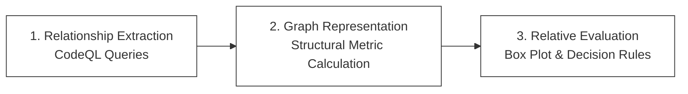

# A Graph-Based Static Analysis of Structural Interaction Patterns in Publish-Subscribe Based Distributed Systems

This document summarizes the research study and findings presented in the UYMS 2026 paper: *"Yayınla-Abone Ol Tabanlı Dağıtık Sistemlerde Yapısal Etkileşim Örüntülerinin Çizge Tabanlı Statik Analiz ile İncelenmesi"* (written in Turkish). The original publication PDF is available here: [Yayınla-Abone Ol Tabanlı Dağıtık Sistemlerde Yapısal Etkileşim Örüntülerinin Çizge Tabanlı Statik Analiz ile İncelenmesi.pdf].

---

## 1. Introduction & Motivation

While publish-subscribe (pub-sub) architectures provide loose coupling and high scalability at runtime, they obscure application-level interactions at the source-code level. This makes holistic architectural analysis, system evolution tracking, and design-time bottleneck detection extremely difficult.

This research study proposes a **static-analysis-supported, graph-based, and rule-driven approach** to reveal such implicit structural patterns. By extracting messaging relations directly from the source code and configuration files, the framework models the system topology without requiring runtime execution logs or traffic monitoring instrumentation.

---

## 2. Proposed Methodology

The proposed analysis framework operates in three main phases:

1. **Static Analysis & Relationship Extraction**: An entrypoint-based static analysis approach is used. Call chains originating from the main execution points (`main`) are traced. Using **CodeQL queries**, the system identifies only accessible publish and subscribe calls. Compute node deployment information is gathered from system configuration files.
2. **Graph Representation**: Extracted interactions are modeled on a directed, multi-layer graph consisting of *Application*, *Topic*, *Node*, and *Library* vertices. From this unified representation, structural metrics are calculated at multiple architectural tiers.
3. **Rule-Based Relative Evaluation**: Instead of relying on rigid, absolute thresholds, metrics are evaluated relative to the system's overall distribution using box plot statistics to identify structural anomalies (disharmonies).

---

## 3. Structural Metrics Formulation

The framework defines quantitative metrics across four distinct architectural levels:

### 3.1 Application-Level Metrics
* **Reach ($R(a)$)**: The total number of unique applications application $a$ interacts with through shared topics.
* **Amplification ($AMP(a)$)**: Measures how widely an application reaches others relative to its active publication channels:
  
  $$AMP(a) = \frac{R(a)}{|PUB(a)| + 1}$$

* **Role Asymmetry ($RA(a)$)**: Identifies the imbalance between publisher (producer) and subscriber (consumer) roles:
  
  $$RA(a) = \frac{|PUB(a)| - |SUB(a)|}{|PUB(a)| + |SUB(a)| + 1}$$

* **Topic Context Diversity ($TC(a)$)**: Measures the diversity of topic category namespaces (inferred from hierarchical prefix tokens in topic naming schemes).
* **Library Exposure ($LE(a)$)**: The count of shared libraries used by application $a$: $LE(a) = |USES(a)|$.

### 3.2 Topic-Level Metrics
* **Coverage ($C(t)$)**: The total number of applications connected to topic $t$: $C(t) = |SUB(t)| + |PUB(t)|$.
* **Imbalance ($I(t)$)**: The publisher/subscriber ratio imbalance of topic $t$:
  
  $$I(t) = \frac{\big| |SUB(t)| - |PUB(t)| \big|}{|SUB(t)| + |PUB(t)| + 1}$$

* **Physical Spread ($PS(t)$)**: Measures how many compute nodes the applications communicating via topic $t$ are deployed across.
* **Low Connectivity Ratio ($LCR(t)$)**: The ratio of applications connected to topic $t$ that have very low overall topic connectivity (less than parameter $k$) across the system.

### 3.3 Compute Node-Level Metrics
* **Node Density ($ND(n)$)**: The number of applications deployed on node $n$: $ND(n) = |RUNS(n)|$.
* **Node Interaction Density ($NID(n)$)**: The intensity of logical pub-sub communication between applications running on the same compute node $n$.

### 3.4 Library-Level Metrics
* **Library Coverage ($LC(l)$)**: The number of applications utilizing library $l$: $LC(l) = |USES(l)|$.
* **Library Concentration ($LCon(l)$)**: The maximum deployment concentration of library $l$ on a single compute node.

---

## 4. Relative Evaluation & Structural Disharmonies

To identify atypical structures, each metric $M$ is categorized based on box plot quartiles ($Q_1$ for low values, $Q_3$ for high values):

$$M(x)\uparrow \iff M(x) \ge Q_3(M) \quad \text{and} \quad M(x)\downarrow \iff M(x) \le Q_1(M)$$

### 4.1 Structural Disharmony Patterns
* **Wide Reach**: An application showing both high reachability and high amplification. ($R(a)\uparrow \ \wedge \ AMP(a)\uparrow$)
* **Role Skew**: An application heavily skewed towards either pure publishing or pure subscribing. ($RA(a)\uparrow \ \vee \ RA(a)\downarrow$)
* **Communication Backbone**: A topic exhibiting high coverage and low imbalance, acting as a major system highway. ($C(t)\uparrow \ \wedge \ I(t)\downarrow$)
* **Interaction Hotspot**: A compute node hosting a high density of applications that also interact heavily with each other. ($ND(n)\uparrow \ \wedge \ NID(n)\uparrow$)
* **Concentrated Library**: A library whose usage is highly concentrated on a single compute node. ($LCon(l)\uparrow$)

---

## 5. Industrial Case Study: HAVELSAN ADVENT CMS

The applicability and validity of the framework were evaluated using **ADVENT Combat Management System** (ADVENT Savaş Yönetim Sistemi) developed by HAVELSAN. ADVENT is an enterprise-scale distributed system deployed on naval platforms, heavily relying on publish-subscribe communication.

### Validation Methodology & Results
The top anomalies detected by the tool were evaluated by 5 domain experts (subject-matter experts) to determine if they represented authentic architectural concerns.

* **Expert Agreement**: Measured using **Fleiss' $\kappa$**, indicating moderate-to-high agreement ($0.65 - 0.76$) across all component categories.
* **Precision@k** (proportion of true positives in the top $k$ ranks) and **nDCG@k** (ranking quality) results are detailed in Tablo 1:

| Component Type | k | Prec@k | nDCG@k | Fleiss' $\kappa$ |
| :--- | :---: | :---: | :---: | :---: |
| Application | 5 / 10 | 0.80 / 0.70 | 0.82 / 0.74 | 0.71 |
| Topic | 5 / 10 | 0.80 / 0.80 | 0.85 / 0.81 | 0.76 |
| Compute Node | 5 / 10 | 0.60 / 0.60 | 0.63 / 0.58 | 0.65 |
| Library | 5 / 10 | 0.80 / 0.70 | 0.78 / 0.72 | 0.70 |

* **Discussion**: The results prove that the tool matches expert evaluations with high precision, especially for Topics and Applications. The slightly lower scores on Compute Nodes reflect the fact that node placement decisions are often driven by hardware resource constraints and physical redundancy requirements rather than logical software structure alone.

---

## 6. Evolutionary Path: From RASSE 2025 to Middleware 2026

This UYMS 2026 study represents a key milestone in this research trajectory:
1. **RASSE 2025** ([rasse2025.md]) established the core multi-layer graph model. This study extends it by integrating **shared code libraries (Library)** as first-class vertices.
2. Rather than relying on reachability simulation, this work introduces an automated relationship extraction layer using **CodeQL** directly against the static design-time code repository.
3. This static structural analysis provides the structural, relation-specific schemas and features that feed into the GNN-based Heterogeneous Graph Learning (HGL) approach designed for **Middleware 2026** ([middleware2026.md]).
