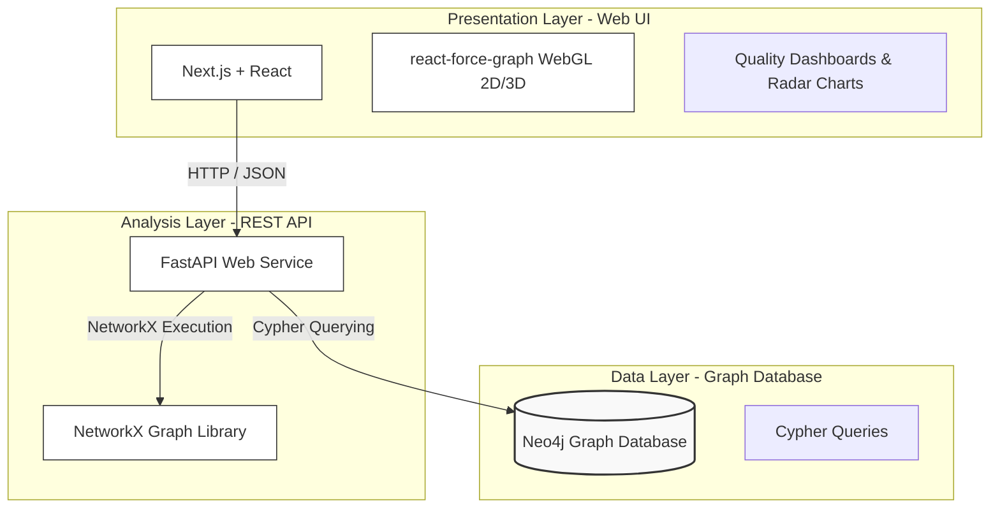

# Visualization of Distributed Publish-Subscribe Systems Using Graph Models for Analysis

This document summarizes the research study and findings presented in the UYMS 2026 paper: *"Yayınla–Abone Ol Tabanlı Dağıtık Sistemlerin Analizine Yönelik Çizge Modeli ile Görselleştirilmesi"* (written in Turkish). The original publication PDF is available here: [Yayınla–Abone Ol Mimari Tabanlı Dağıtık Sistemlerin Çizge Modeli ile Görselleştirilmesi.pdf].

---

## 1. Introduction & Motivation

As event-driven publish-subscribe architectures scale, managing software and deployment complexity becomes a major hurdle. When a system spans dozens of brokers, hundreds of applications, and thousands of communication topics, mapping dependencies manually is impossible. 

This paper introduces an **enterprise-grade interactive visualization web platform** to represent and analyze pub-sub systems using graph models. Built on top of pre-deployment static analysis, the platform helps developers and architects interactively explore dependencies, evaluate metrics, and identify critical nodes before deployment, eliminating runtime tracing costs.

---

## 2. 3-Tier Platform Architecture

The visualization platform is organized into three distinct layers to ensure modularity and scalability:

* **Presentation Layer**: A responsive `Next.js` and `React` frontend. To render complex layouts at 60 FPS, it utilizes WebGL-based `react-force-graph-2d` and `react-force-graph-3d` libraries. Components are color-coded by node type (Application: Blue, Infrastructure Node: Red, Broker: Grey, Topic: Yellow, Library: Cyan).
* **Analysis Layer**: Powered by a `FastAPI` REST service and `NetworkX`. It performs topological calculations (PageRank, betweenness centrality, articulation point detection) in real time.
* **Data Layer**: Integrates a `Neo4j` graph database, enabling rapid querying of complex, multi-layered dependencies via `Cypher`.

---

## 3. R-M-A-V Quality Model & BoxPlot Classification

Topological centrality metrics are mapped to four core architectural quality dimensions, representing the **R-M-A-V Quality Framework**:

1. **Reliability ($R(v)$)**: Quantifies the upstream failure impact and exposure.
   
   $$R(v) = 0.60 \times PageRank(v) + 0.40 \times DG\_in(v)$$

2. **Maintainability ($M(v)$)**: Measures code intervention complexity and dependency coupling.
   
   $$M(v) = 0.70 \times BC(v) + 0.30 \times (1 - CC(v))$$

3. **Availability ($A(v)$)**: Highlights structural bottleneck and single point of failure (SPOF) risks.
   
   $$A(v) = 0.70 \times AP(v) + 0.30 \times SPOF(v)$$

4. **Vulnerability ($V(v)$)**: Evaluates outward dependency loads.
   
   $$V(v) = 0.55 \times DG\_out(v) + 0.45 \times DD(v)$$

*Where: $BC$: Betweenness Centrality, $CC$: Clustering Coefficient, $AP$: Articulation Point, $SPOF$: Single Point of Failure, $DG$: Degree, $DD$: Depth Density.*

### 3.1 Composite Quality Score ($K(v)$) & Statistical Classification
Using the Analytic Hierarchy Process (AHP), these four quality dimensions are weighted to compute a composite quality/criticality score $K(v)$:

$$K(v) = 0.43 \cdot A(v) + 0.24 \cdot R(v) + 0.17 \cdot M(v) + 0.16 \cdot V(v)$$

Components are statistically classified into 5 criticality levels based on box plot distributions ($Q_1, Q_3, IQR$) to adapt dynamically to different system scales:
* **CRITICAL**: $K(v) > Q_3 + 1.5 \times IQR$
* **HIGH**: $K(v) > Q_3$
* **MEDIUM**: $K(v) > Q_2$ (Median)
* **LOW**: $K(v) > Q_1$
* **MINIMAL**: $K(v) \le Q_1$

---

## 4. Empirical Evaluation

The visualization platform was validated across three representative distributed configurations:

1. **ROS2 Autonomous System**: 15 compute nodes, 3 brokers, 45 applications, 120 topics.
2. **IoT Smart City**: 50 compute nodes, 5 brokers, 200 applications, 500 topics.
3. **Kafka Financial Platform**: 10 compute nodes, 8 brokers, 80 applications, 300 topics.

### 4.1 Validation Performance
Spearman rank correlation ($\rho$) and classification F1-score comparing topologically predicted $Q(v)$ quality metrics with simulator-derived ground-truth failure cascade impact $I(v)$:

| Scenario / Metric | Spearman $\rho$ | F1 Score | Precision | Recall | Top-5 Overlap |
| :--- | :---: | :---: | :---: | :---: | :---: |
| ROS2 Autonomous System | 0.865 | 0.750 | 0.750 | 0.750 | %40 |
| IoT Smart City | 0.890 | 0.840 | 0.840 | 0.840 | %100 |
| Kafka Financial Platform | **0.900** | **0.867** | **0.867** | **0.867** | %80 |

### 4.2 Computational Performance & Scalability
The platform maintains high interactive performance (60 FPS rendering) and scales efficiently to large enterprise deployments:

| Node Count | Dependency Edges | Load Time | Analysis Time | View Rendering (2D/3D) |
| :--- | :---: | :---: | :---: | :---: |
| 25 | 69 | 0.28 s | 0.02 s | 1.73 s / 1.39 s |
| 100 | 335 | 0.48 s | 0.05 s | 1.68 s / 1.62 s |
| 500 | 1,437 | 1.66 s | 0.32 s | 2.25 s / 3.64 s |
| 1,000 | 4,267 | 4.57 s | 4.60 s | 2.65 s / 6.50 s |
| **10,000** | **11,313** | **104.50 s** | **11.02 s** | **4.30 s / 6.38 s** |

---

## 5. Research Evolution: From RASSE 2025 to Middleware 2026

This visualization platform plays a key role in the research timeline:
1. It translates the abstract graph abstractions and validation formulas from **RASSE 2025** ([rasse2025.md]) into an interactive, visual tool suitable for real-world software engineering pipelines.
2. The AHP-derived quality metrics ($R, M, A, V$) and BoxPlot classifiers provide a baseline comparison layer. This baseline is utilized in the GNN-based **Middleware 2026** ([middleware2026.md]) study to evaluate the performance of Heterogeneous Graph Learning models against traditional centrality indicators.
