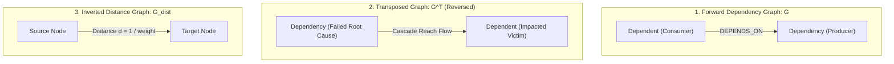
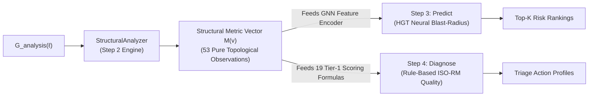
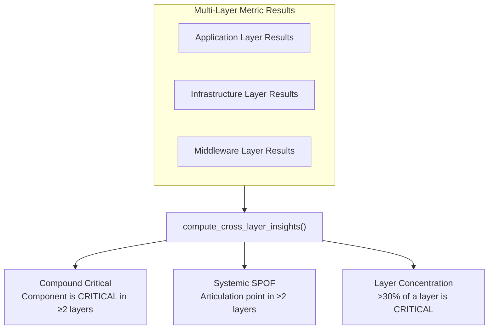
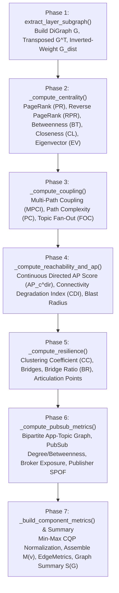
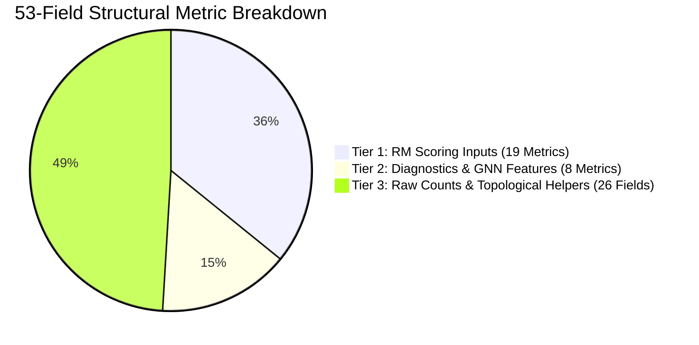

# Step 2: Analyze — Structural Metrics

**Compute every component's topological fingerprint — the comprehensive set of structural metrics that reveal how failure propagates, how components resist change, and who they disrupt.**

← [Step 1: Model](graph-model.md) | [README](../README.md) | **Step 2: Analyze** | → [Step 3: Predict](prediction.md) · [Step 4: Diagnose](diagnosis.md)

For the complete CLI reference (`analyze_graph.py`), see [cli-pipeline-guide.md — Step 2](cli-pipeline-guide.md#step-2-analyze).

---

## Table of Contents

1. [Executive Summary & At a Glance](#1-executive-summary--at-a-glance)
2. [Core Conceptual Foundations (The "Why")](#2-core-conceptual-foundations-the-why)
   - 2.1 [Why Structural Metrics Predict Real-World Failure](#21-why-structural-metrics-predict-real-world-failure)
   - 2.2 [The Three Graph Views ($G$, $G^\top$, and $G_{\text{dist}}$)](#22-the-three-graph-views-g-gtop-and-g_textdist)
   - 2.3 [Separation of Concerns: Metrics ($M$) vs. Prediction & Quality ($Q$)](#23-separation-of-concerns-metrics-m-vs-prediction--quality-q)
3. [Analysis Pipeline Architecture](#3-analysis-pipeline-architecture)
   - 3.1 [Pure Structural Mode vs. Orchestrated Quality Mode](#31-pure-structural-mode-vs-orchestrated-quality-mode)
   - 3.2 [Pre-Analysis Dependency Derivation Trigger](#32-pre-analysis-dependency-derivation-trigger)
4. [Layer Projections ($\pi_\ell$)](#4-layer-projections-pi_ell)
5. [Cross-Layer Analysis & Systemic Insights](#5-cross-layer-analysis--systemic-insights)
6. [The 7-Phase Topological Analysis Engine](#6-the-7-phase-topological-analysis-engine)
   - 6.1 [Phase 1: Subgraph Extraction & Graph Inversions](#61-phase-1-subgraph-extraction--graph-inversions)
   - 6.2 [Phase 2: Centrality Measures ($PR, RPR, BT, CL, EV$)](#62-phase-2-centrality-measures-pr-rpr-bt-cl-ev)
   - 6.3 [Phase 3: Coupling & Topic Fan-Out ($MPCI, PC, FOC$)](#63-phase-3-coupling--topic-fan-out-mpci-pc-foc)
   - 6.4 [Phase 4: Reachability & Continuous Articulation Points ($AP_c^{\text{dir}}, CDI$)](#64-phase-4-reachability--continuous-articulation-points-ap_ctextdir-cdi)
   - 6.5 [Phase 5: Undirected Resilience & Graph Bridges ($CC, BR$)](#65-phase-5-undirected-resilience--graph-bridges-cc-br)
   - 6.6 [Phase 6: Pub-Sub Bipartite Topology & Publisher SPOF ($PSPOF$)](#66-phase-6-pub-sub-bipartite-topology--publisher-spof-pspof)
   - 6.7 [Phase 7: Metric Assembly, CQP Normalization, and Summary](#67-phase-7-metric-assembly-cqp-normalization-and-summary)
7. [Metric Taxonomy & Normalization Strategy](#7-metric-taxonomy--normalization-strategy)
   - 7.1 [The Three-Tier Metric Structure](#71-the-three-tier-metric-structure)
   - 7.2 [Robust Rank Normalization](#72-robust-rank-normalization)
   - 7.3 [Population Isolation & Winsorization](#73-population-isolation--winsorization)
8. [Formal Metric Definitions (Tier 1 & Tier 2)](#8-formal-metric-definitions-tier-1--tier-2)
   - 8.1 [Fault Tolerance Inputs ($FT$)](#81-fault-tolerance-inputs-ft)
   - 8.2 [Maintainability Inputs ($M$)](#82-maintainability-inputs-m)
   - 8.3 [Availability Inputs ($A$)](#83-availability-inputs-a)
   - 8.4 [Derived Inline Composites](#84-derived-inline-composites)
   - 8.5 [Diagnostic & GNN Input Metrics (Tier 2)](#85-diagnostic--gnn-input-metrics-tier-2)
9. [The Reliability–Maintainability (RM) Quality Model](#9-the-reliabilitymaintainability-rm-quality-model)
   - 9.1 [ISO/IEC 25010:2023 Characteristic Hierarchy](#91-isoiec-250102023-characteristic-hierarchy)
   - 9.2 [Exact RM Scoring Formulas](#92-exact-rm-scoring-formulas)
   - 9.3 [Metric Orthogonality Matrix](#93-metric-orthogonality-matrix)
   - 9.4 [AHP Weight Derivation & Consistency](#94-ahp-weight-derivation--consistency)
   - 9.5 [Weight Shrinkage Strategy ($\lambda = 0.70$)](#95-weight-shrinkage-strategy-lambda--070)
   - 9.6 [Adaptive Box-Plot Classification & Risk Patterns](#96-adaptive-box-plot-classification--risk-patterns)
10. [Output Data Structures: $M(v)$, EdgeMetrics, and $S(G)$](#10-output-data-structures-mv-edgemetrics-and-sg)
11. [End-to-End Step-by-Step Worked Example](#11-end-to-end-step-by-step-worked-example)
12. [Computational Complexity & Optimizations](#12-computational-complexity--optimizations)
13. [CLI Reference & Python SDK Usage](#13-cli-reference--python-sdk-usage)
14. [What Comes Next](#14-what-comes-next)

---

### Where this sits in the JSS paper

| | |
|:---|:---|
| **Manuscript section** | §3.4 (typed node feature encoding, indices 0–17) and §5.2 (the metrics the RM formulas consume) |
| **Paper's name for this** | Not a named stage — the paper treats it as the feature-and-metric substrate both pathways read |
| **Symbols** | The paper writes $\text{RPR}$, $\text{Deg}_{\text{in}}$, $\text{AP}_c^{\text{dir}}$, $\text{QSPOF}$, $\text{BR}$, $\text{CDI}$, $\text{BT}$, $w_{\text{out}}$, $\text{CQP}$, $\text{CC}$ — same names, same coefficients |
| **Results** | §7.5 measures this stage's cost, and finds it dominates the pipeline: 239 s at 2,000 components, against 56 ms for the HGT forward pass |

> [!NOTE]
> **Eight steps here, four stages in the paper.** This repository numbers the pipeline in eight
> executable steps (Model, Analyze, Predict, Diagnose, Simulate, Validate, Prescribe, Visualize),
> because that is what you run. The JSS manuscript describes a coarser **four-stage** pipeline —
> Typed Multigraph Formulation → QoS-Aware Dependency Projection → Heterogeneous Graph Learning
> (Predictive Pathway) → Explainable Quality Attribution (Explanation Layer) — because that is what
> it evaluates. Steps 1 and 2 together are the paper's stages 1–2; Step 3 is stage 3; Step 4 is
> stage 4. The paper also refers to a "Validate stage" and a "Prescribe stage" without numbering
> them: those are Steps 6 and 7.
>
> The two arms are named differently too. This documentation says **Pathway B** for the learned
> ranking arm and **Pathway A** for the deterministic diagnostic arm, matching `PredictiveUseCase`
> and `DiagnosticUseCase` in the code. The paper calls them the **Predictive Pathway** (§4) and the
> **Explanation Layer** (§5). They are the same two things.

---

## 1. Executive Summary & At a Glance

Once the system graph $\mathcal{G}$ is constructed and causal dependencies are derived in Step 1, the **Analyze stage (Step 2)** evaluates the graph's structural properties. It transforms the layer-projected dependency graph $G_{\text{analysis}}(\ell)$ into a comprehensive **53-field structural metric vector $M(v)$** for every component, accompanied by edge metrics and graph-level topological summaries.

The 53 fields of `StructuralMetrics` are three identity fields (`id`, `name`, `type`) plus
**50 scored metrics**, which are exactly the 50 keys of `METRIC_ROLES` in
[`saag/core/metric_registry.py`](../saag/core/metric_registry.py). Where
[validation.md](validation.md) counts "50 metrics" and this document counts "53 fields", they are
describing the same object.

> [!IMPORTANT]
> **$M(v)$ means two different things in these documents.** Here it is the whole 53-field metric
> vector. In the RM formulas of §9 it is the scalar **Maintainability** score,
> $M(v) = 0.35 \cdot BT(v) + \dots$ — one of the two characteristics that compose $Q^*(v)$. The
> surrounding sentence always disambiguates, but the collision is genuine; when in doubt, a
> subscripted or weighted $M$ inside a sum is the Maintainability score, and a bare $M(v)$ handed
> between stages is the vector.

Step 2 is **deterministic, closed-form, and purely graph-theoretic**. It requires zero machine-learning checkpoints, zero runtime monitoring instrumentation, and zero execution of fault-injection simulations.

```
┌─────────────────────────────────────────────────────────────────────────────┐
│                             STEP 2 AT A GLANCE                              │
├───────────────────┬─────────────────────────────────────────────────────────┤
│ Primary Input     │ • G_analysis(ℓ): Directed dependency graph from Step 1. │
│                   │ • G_structural: Raw physical pub/sub edges (bipartite). │
├───────────────────┼─────────────────────────────────────────────────────────┤
│ Core Engine       │ 7-Phase StructuralAnalyzer (saag/analysis/structural_    │
│                   │ analyzer.py) executing over G, G^T, and G_dist.         │
├───────────────────┼─────────────────────────────────────────────────────────┤
│ Key Dimensions    │ • Cascade Reach: Reverse PageRank (RPR) on G^T.         │
│ Evaluated         │ • Local Blast Radius: In-degree (DG_in) & MPCI.         │
│                   │ • Single Points of Failure: Continuous AP_c^dir & BR.   │
│                   │ • Routing Bottlenecks: Inverted-weight Betweenness (BT).│
│                   │ • Code Health: Synthesized Code Quality Penalty (CQP).  │
├───────────────────┼─────────────────────────────────────────────────────────┤
│ Primary Outputs   │ • M(v): 53-field StructuralMetrics vector per component.│
│                   │ • EdgeMetrics: Betweenness & bridge flags per edge.     │
│                   │ • S(G): GraphSummary (diameter, density, assortativity).│
├───────────────────┼─────────────────────────────────────────────────────────┤
│ Downstream Handoff│ • Step 3 (Predict): Ingests M(v) as GNN node features.  │
│                   │ • Step 4 (Diagnose): Evaluates 19 Tier-1 metrics into   │
│                   │   ISO-RM quality scores Q*(v) and audits antipatterns.  │
└───────────────────┴─────────────────────────────────────────────────────────┘
```

---

## 2. Core Conceptual Foundations (The "Why")

### 2.1 Why Structural Metrics Predict Real-World Failure

In distributed architectures, failures do not strike in a vacuum. How catastrophic an outage becomes is dictated by the **topology of dependencies**:
1. **Cascade Propagation**: If component $A$ crashes, every component that directly or transitively depends on $A$ suffers message starvation or timeouts. Topological centrality on the transposed graph quantifies this cascade reach before deployment.
2. **Structural Bottlenecks**: Components that lie on the shortest dependency paths between diverse functional subsystems become architectural choke points; when congested or delayed, they induce widespread latency spikes.
3. **Fragile Redundancy (SPOFs)**: Services that act as bridges or articulation points divide the system into disconnected islands upon failure.

By computing topological metrics across the dependency graph, Software-as-a-Graph produces an objective, reproducible **structural fingerprint** of every microservice, broker, topic, and compute host.

### 2.2 The Three Graph Views ($G$, $G^\top$, and $G_{\text{dist}}$)

A single graph orientation cannot capture all failure dimensions. Phase 1 of the analysis engine prepares **three coordinated mathematical views** of the layer subgraph:



1. **Forward Dependency Graph ($G$)**:
   - Directed edges point from **Dependent $\to$ Dependency** (`app_to_app`, `app_to_broker`, etc.).
   - Used to compute forward fan-out, out-degree coupling ($w_{\text{out}}$), and standard PageRank (callee importance).
2. **Transposed Graph ($G^\top$)**:
   - Edge directions are mathematically reversed: $\text{Dependency} \to \text{Dependent}$.
   - **Physical Intuition**: When a dependency fails, the outage propagates *against* the dependency arrow toward all consumers. Random walks on $G^\top$ follow the exact path of failure cascades. Reverse PageRank ($RPR$) is computed directly on $G^\top$.
3. **Inverted-Weight Distance Graph ($G_{\text{dist}}$)**:
   - Edge weights in $G$ quantify *dependency coupling strength* $w \in [0.01, 1.0]$ (higher = stronger dependency).
   - Standard shortest-path algorithms (Dijkstra, Brandes Betweenness) treat edge weights as *costs/distances* (where smaller = closer).
   - **Weight Inversion**: We set $d(u, v) = \frac{1}{w(u, v)}$. A critical dependency with $w = 0.95$ yields a short topological distance ($d \approx 1.05$), ensuring betweenness and path degradation calculations prioritize strong, high-importance channels.

### 2.3 Separation of Concerns: Metrics ($M$) vs. Prediction & Quality ($Q$)

A core architectural principle of Software-as-a-Graph is the strict decoupling of **observation** from **evaluation**:



- **Step 2 (Analyze)** computes raw, objective structural metrics $M(v)$. It has no concept of neural networks, threshold classifications, or stakeholder remediation rules.
- **Step 3 (Predict)** uses $M(v)$ as node features in a Heterogeneous Graph Transformer (HGT) to forecast inductive blast radii.
- **Step 4 (Diagnose)** ingests 19 Tier-1 fields from $M(v)$ to compute deterministic ISO/IEC 25010 quality scores $Q^*(v)$, audit 19 architectural anti-patterns, and generate stakeholder triage plans.

---

## 3. Analysis Pipeline Architecture

### 3.1 Pure Structural Mode vs. Orchestrated Quality Mode

The framework provides two primary ways to invoke structural analysis:

```mermaid
flowchart TD
    subgraph ModePure["Mode 1: Pure Structural Analysis (CLI & Pipeline Step 2)"]
        CLI_A["cli/analyze_graph.py<br/>client.analyze(layer='app')"] --> UC_A["AnalyzeGraphUseCase"]
        UC_A --> AS_A["AnalysisService.analyze_layers()"]
        AS_A --> SA_A["StructuralAnalyzer.analyze()"]
        SA_A --> RES_A["LayerAnalysisResult<br/>• .structural = StructuralAnalysisResult<br/>• M(v), EdgeMetrics, GraphSummary S(G)"]
    end

    subgraph ModeOrchestrated["Mode 2: Multi-Layer Orchestrated Analysis (Step 2 + 4)"]
        CLI_B["saag --analyze<br/>REST API /api/v1/analysis"] --> UC_B["MultiLayerAnalysisUseCase"]
        UC_B --> AS_B["AnalysisService.analyze_layers()"]
        AS_B --> QA_B["QualityAnalyzer.analyze()<br/>(Computes RM Scores Q*(v))"]
        QA_B --> AP_B["AntiPatternDetector.detect()"]
        AP_B --> CL_B["compute_cross_layer_insights()"]
        CL_B --> RES_B["MultiLayerAnalysisResult<br/>(Structural + RM Quality + Antipatterns)"]
    end
```



- **Pure Structural Mode (`cli/analyze_graph.py`)**: Executes Step 2 exclusively. Fast, lightweight, and focused on computing $M(v)$ and $S(G)$.
- **Multi-Layer Orchestrated Mode (`saag --analyze` / API)**: Bundles Step 2's topological extraction with Step 4's ISO-RM quality scoring, cross-layer insight synthesis, and anti-pattern auditing.

### 3.2 Pre-Analysis Dependency Derivation Trigger

Before metrics are calculated, `AnalysisService` automatically invokes `IGraphRepository.derive_dependencies()`:
1. Synthesizes `DEPENDS_ON` edges across Application, Library, Broker, and Node entities from underlying pub/sub interactions (`PUBLISHES_TO`, `SUBSCRIBES_TO`, `ROUTES`, `USES`).
2. Finalizes edge weights using the probabilistic union (Rules 1 & 2), worst-case lift (Rules 3 & 4), harmonic mean (Rule 5), and shared node weights (Rule 6).
3. The repository passes `include_raw=True` to retrieve both derived `DEPENDS_ON` edges (for graph topology) and raw structural edges (for Phase 6 pub-sub bipartite metrics).

---

## 4. Layer Projections ($\pi_\ell$)

Architectural analysis operates on dedicated layer projections ($\pi_\ell$), isolating targeted component types and dependency classes defined in [`saag/core/layers.py`](../saag/core/layers.py):

| Layer Key | Formal Name | Analyzed Vertices ($T_a$) | Subgraph Vertices ($T_\ell$) | Included Dependency Types ($D_\ell$) | Architectural Focus |
|:---|:---|:---|:---|:---|:---|
| `app` | **Application** | `Application`, `Library` | `Application`, `Library` | `app_to_app`, `app_to_lib` | **Reliability ($R$)**: Microservice cascades, pub-sub starvation, shared-library blast radius. |
| `infra` | **Infrastructure** | `Node` | `Node` | `node_to_node` | **Availability ($A$)**: Host partition risks, network bridges, compute failover SPOFs. |
| `mw` | **Middleware** | `Broker` | `Application`, `Broker`, `Node` | `app_to_broker`, `node_to_broker`, `broker_to_broker` | **Maintainability ($M$)**: Broker bottlenecks, routing congestion, colocation fate sharing. |
| `system` | **Complete System** | All 5 entity types | All 5 entity types | All 6 dependency subtypes | **Holistic Composite ($Q$)**: Cross-tier systemic risk propagation. |

> [!NOTE]
> **Why Middleware Subgraph Includes Apps and Nodes**:
> To preserve incoming dependency edges pointing to Brokers (`app_to_broker`, `node_to_broker`), applications and nodes must be present in the layer subgraph. However, the analysis target set ($T_a$) is restricted to $\{ \text{Broker} \}$, ensuring that middleware metrics score brokers exclusively.

---

## 5. Cross-Layer Analysis & Systemic Insights

When multi-layer analysis is executed, `compute_cross_layer_insights()` ([`saag/analysis/cross_layer.py`](../saag/analysis/cross_layer.py)) analyzes the intersection of risks across layers:



| Insight Type | Trigger Condition | Severity | Architectural Meaning |
|:---|:---|:---:|:---|
| **`compound_critical`** | Component is classified as `CRITICAL` or `HIGH` in $\ge 2$ distinct layer projections. | `CRITICAL` | Deep systemic risk that cannot be remedied in a single tier (e.g., service hub hosted on fragile infrastructure). |
| **`systemic_spof`** | Component is an articulation point ($AP_c^{\text{dir}} > 0$) in $\ge 2$ distinct layer projections. | `CRITICAL` | Single point of failure whose removal fragments communication across multiple abstraction levels simultaneously. |
| **`layer_concentration`** | $> 30\%$ of all components in a single layer are classified as `CRITICAL`. | `HIGH` | Indicates an unbalanced systemic architecture (e.g., severe broker centralization). |

---

## 6. The 7-Phase Topological Analysis Engine

`StructuralAnalyzer.analyze()` executes seven deterministic phases in strict sequence:



---

### 6.1 Phase 1: Subgraph Extraction & Graph Inversions

1. **Filtering**: Inspects `graph_data.components` and `graph_data.edges`, retaining only vertices and `DEPENDS_ON` edges declared in the target `AnalysisLayer`.
2. **View Preparation**:
   - $G$: Primary forward directed graph.
   - $G^\top = G.\text{reverse()}$: Transposed graph for failure cascade analysis.
   - $G_{\text{dist}} = \text{build\_distance\_graph}(G)$: Copies $G$ with inverted edge weights $d(u, v) = \frac{1}{\max(w, 0.001)}$.

---

### 6.2 Phase 2: Centrality Measures ($PR, RPR, BT, CL, EV$)

Evaluates how structural position dictates communication centrality and cascade vulnerability:

1. **Reverse PageRank ($RPR$)**:
   Runs PageRank on the transposed graph $G^\top$ with damping factor $d = 0.85$:
   $$RPR(v) = \text{PageRank}(G^\top, d=0.85)[v]$$
   Measures the probability that a random failure cascade originating anywhere in the system propagates to and affects $v$.
2. **PageRank ($PR$)**:
   Runs PageRank on the forward graph $G$. Identifies deep downstream service providers.
3. **Betweenness Centrality ($BT$)**:
   Brandes' algorithm executed on the inverted-weight graph $G_{\text{dist}}$:
   $$BT(v) = \sum_{s \ne v \ne t} \frac{\sigma(s, t \mid v)}{\sigma(s, t)}$$
   Measures the fraction of shortest dependency paths that traverse $v$.
4. **Harmonic Closeness Centrality ($CL$)**:
   Evaluates topological proximity to all components, gracefully handling disconnected graphs:
   $$CL(v) = \frac{1}{|V| - 1} \sum_{u \neq v} \frac{1}{d(v, u)}$$
5. **Eigenvector Centrality ($EV$) with Katz Fallback**:
   Power iteration on $G$. If the graph is a Directed Acyclic Graph (DAG) where dominant eigenvalues do not converge, it automatically falls back to **Katz Centrality** ($\alpha = 0.01, \beta = 1.0$).

---

### 6.3 Phase 3: Coupling & Topic Fan-Out ($MPCI, PC, FOC$)

Quantifies parallel channel density and message rate stress:

1. **Multi-Path Coupling Index ($MPCI$)**:
   Measures incoming multi-topic channel density beyond single-edge connections:
   $$MPCI(v) = \frac{\sum_{e \in \text{InEdges}(v)} \max(\text{path\_count}(e) - 1, \; 0)}{|V| - 1}$$
2. **Path Complexity ($PC$)**:
   Measures average efferent channel multiplicity:
   $$PC(v) = \frac{1}{|\text{OutEdges}(v)|} \sum_{e \in \text{OutEdges}(v)} \log_2(1 + \text{path\_count}(e))$$
3. **Fan-Out Criticality ($FOC$) — Topic Nodes Only**:
   Quantifies subscriber blast radius modulated logarithmically by message rate in Hz:
   $$FOC(t) = \frac{\ln(1 + f(t)) \cdot s(t)}{\max_{t'} [\ln(1 + f(t')) \cdot s(t')]}$$
   *(where $f(t)$ is message rate in Hz and $s(t)$ is subscriber count).*

---

### 6.4 Phase 4: Reachability & Continuous Articulation Points ($AP_c^{\text{dir}}, CDI$)

Evaluates worst-case structural fragmentation and cascade depth:

1. **Blast Radius & Cascade Depth**:
   - $\text{BlastRadius}(v) = |\text{descendants}(G, v)|$: Total reachable components downstream.
   - $\text{CascadeDepth}(v)$: Longest directed acyclic path in the ego-subgraph rooted at $v$.
2. **Continuous Directed Articulation Point Score ($AP_c^{\text{dir}}$)**:
   Measures the exact fraction of the graph disconnected upon removing vertex $v$:
   $$AP_c^{\text{out}}(v) = 1 - \frac{|\text{largest component in } (G \setminus \{v\})|}{|V| - 1}$$
   $$AP_c^{\text{in}}(v) = 1 - \frac{|\text{largest component in } (G^\top \setminus \{v\})|}{|V| - 1}$$
   $$AP_c^{\text{dir}}(v) = \max(AP_c^{\text{out}}(v), \; AP_c^{\text{in}}(v))$$
   > **Algorithmic Optimization**: Uses Tarjan's algorithm ($O(V+E)$) as a pre-filter. Non-cut vertices immediately receive $AP_c^{\text{dir}} = 0.0$ without invoking expensive graph component walks.
3. **Connectivity Degradation Index ($CDI$)**:
   Measures average shortest-path length elongation across reachable pairs upon removing $v$:
   $$CDI(v) = \min\left( \frac{\overline{L}(G \setminus \{v\}) - \overline{L}(G)}{\overline{L}(G)}, \; 1.0 \right)$$
   > **Continuous Signal Optimization**: Unlike $AP_c^{\text{dir}}$, which only fires on strict cut-vertices, $CDI$ is evaluated across the entire main component using a fixed 16-node core sample. This allows load-bearing nodes in 2-connected meshes to register a redundancy-deficit score even if they do not completely fragment the graph.

---

### 6.5 Phase 5: Undirected Resilience & Graph Bridges ($CC, BR$)

Analyzes redundancy on the undirected projection $U = G.\text{to\_undirected()}$:

1. **Clustering Coefficient ($CC$)**:
   Measures the density of alternative redundant paths between neighbors:
   $$CC(v) = \frac{2 \cdot |\{ (u, w) \in E : u, w \in N(v) \}|}{\text{deg}(v) \cdot (\text{deg}(v) - 1)}$$
   Consumed in Maintainability as $(1 - CC(v))$, penalizing tree-like structures lacking triangles.
2. **Bridge Detection & Bridge Ratio ($BR$)**:
   Identifies cut-edges (bridges) whose removal increases connected components.
   $$BR(v) = \frac{|\{ e \in \text{bridges}(U) : v \in e \}|}{\text{undirected\_degree}(v)}$$

---

### 6.6 Phase 6: Pub-Sub Bipartite Topology & Publisher SPOF ($PSPOF$)

Inspects raw pub/sub communication by constructing an undirected bipartite graph $G_{\text{ps}} = (V_{\text{app}} \cup V_{\text{topic}}, E_{\text{pubsub}})$:

1. **PubSub Degree & Betweenness**: Measures application participation breadth across topics.
2. **Broker Exposure**: Average number of distinct message brokers routing topics consumed or produced by the application.
3. **Publisher SPOF ($PSPOF$)**:
   Measures the hazard when an application is the sole producer for critical subscriber-bearing topics:
   $$PSPOF(a) = \max_{t \in \text{sole\_topics}(a)} \left( w(t) \cdot \min\left(\frac{s(t)}{5.0}, \; 1.0\right) \right)$$

---

### 6.7 Phase 7: Metric Assembly, CQP Normalization, and Summary

1. **Assembly**: Combines all phase metrics into a typed [`StructuralMetrics`](../saag/core/metrics.py) dataclass per component.
2. **Code Quality Penalty ($CQP$) Normalization**:
   Normalizes static code metrics independently for Applications and Libraries via population min-max scaling:
   $$CQP(v) = 0.10 \cdot \text{loc\_norm}(v) + 0.35 \cdot \text{complexity\_norm}(v) + 0.30 \cdot I_{\text{code}}(v) + 0.25 \cdot \text{lcom\_norm}(v)$$
   *(where $I_{\text{code}} = \frac{C_e}{C_a + C_e}$ is Martin's instability).*
3. **Reverse Cuthill-McKee (RCM) Ordering**:
   Computes bandwidth-minimizing permutation ordering of the dependency adjacency matrix, grouping tightly coupled subsystems together for dashboard matrix visualization.
4. **Graph Summary ($S(G)$)**:
   Computes graph-level metrics: density, diameter, average path length, degree assortativity coefficient, and overall connectivity health (`HEALTHY`, `MODERATE`, `AT_RISK`).

---

## 7. Metric Taxonomy & Normalization Strategy

### 7.1 The Three-Tier Metric Structure

The 53 fields in $M(v)$ are strictly partitioned into three architectural tiers:



1. **Tier 1 — RM Scoring Inputs (19 Metrics)**:
   Directly parameterized into the closed-form ISO/IEC 25010 equations for $FT(v), A(v), M(v),$ and $Q^*(v)$.
2. **Tier 2 — Diagnostics & GNN Input Features (8 Metrics)**:
   Secondary structural indicators (PageRank, Harmonic Closeness, Eigenvector, PubSub Betweenness, Broker Exposure, Publisher SPOF). Used for UI dashboards and as input features for Step 3 GNN embeddings.
3. **Tier 3 — Raw Topological Counts & Helpers (26 Fields)**:
   Raw integer degrees (`in_degree_raw`, `out_degree_raw`), bridge counts, hardware infrastructure specs (`cpu_cores`, `memory_gb`), and code metrics.

---

### 7.2 Robust Rank Normalization

To combine disparate metrics (such as betweenness $\in [0, 0.1]$ and in-degree $\in [0, 50]$) into composite scores, values must be normalized to $[0, 1]$.

Software-as-a-Graph uses **Robust Rank Normalization** by default:

$$x_{\text{robust}}(v) = \frac{\text{avg\_rank}(v)}{|V| - 1} \in [0, 1]$$

> [!IMPORTANT]
> **Why Rank Normalization over Min-Max?**
> Software dependency networks are scale-free with heavy-tailed degree distributions. In min-max scaling, a single giant broker or database hub with degree 50 compresses 95% of ordinary microservices into $[0.0, 0.05]$, destroying all discriminatory variance.
> 
> Rank normalization maps the distribution uniformly across $[0, 1]$, preserving relative ordering and ensuring robustness against extreme hub outliers.

#### Naturally Bounded Metrics
Metrics that possess an intrinsic mathematical bound in $[0, 1]$ ($AP_c^{\text{dir}}, CDI, MPCI, FOC, CC, CQP$) **bypass rank normalization**. Their absolute values are preserved so that $AP_c^{\text{dir}} = 0.0$ strictly retains its semantic meaning: *"this component is not an articulation point"*.

---

### 7.3 Population Isolation & Winsorization

1. **Application vs. Library Population Split**:
   Application services and shared utility libraries exhibit drastically different Lines of Code (LOC) and cyclomatic complexity scales. They are normalized as **separate populations**, preventing massive service monoliths from suppressing the complexity signal of compact libraries.
2. **Zero-Span Handling**:
   - Single isolated component: normalized value defaults to $1.0$ (ensuring singleton core components are not ignored).
   - Zero-variance population (e.g., all components have zero reported code metrics): normalized value evaluates to $0.0$, preventing artificial penalties on absent data.
3. **Optional Winsorization (`--winsorize`)**:
   Caps extreme metric outliers at the 95th percentile prior to rank assignment, mitigating the influence of anomalous data spikes.

---

## 8. Formal Metric Definitions (Tier 1 & Tier 2)

### 8.1 Fault Tolerance Inputs ($FT$)

| Metric Symbol | Code Key | Formula / Graph Target | Architectural Meaning |
|:---|:---|:---|:---|
| **$RPR$** | `reverse_pagerank` | $\text{PageRank}(G^\top, d=0.85)$ | **Global cascade reach.** Fraction of the system affected when this component fails. |
| **$DG_{\text{in}}$** | `in_degree` | $\frac{\text{in\_degree}(v)}{\|V\| - 1}$ | **Immediate blast radius.** Number of direct dependents relying on this component. |
| **$MPCI$** | `mpci` | $\frac{\sum \max(\text{path\_count} - 1, 0)}{\|V\| - 1}$ | **Multi-channel coupling amplifier.** Penalizes parallel redundant dependencies. |
| **$FOC$** | `fan_out_criticality` | $\frac{\ln(1 + f(t)) \cdot s(t)}{\max [\ln(1 + f) \cdot s]}$ | **Topic subscriber risk.** Blast surface modulated by message frequency in Hz (Topic nodes only). |
| **$w_{\text{in}}$** | `dependency_weight_in` | $\sum_{(u, v) \in \text{InEdges}} w(u, v)$ | **Topic publisher redundancy discount.** Total incoming QoS publication weight. |

---

### 8.2 Maintainability Inputs ($M$)

| Metric Symbol | Code Key | Formula / Graph Target | Architectural Meaning |
|:---|:---|:---|:---|
| **$BT$** | `betweenness` | $\sum \frac{\sigma(s, t \mid v)}{\sigma(s, t)}$ on $G_{\text{dist}}$ | **Routing bottleneck.** Centrality on inverted-weight shortest paths. |
| **$w_{\text{out}}$** | `dependency_weight_out` | $\sum_{(v, u) \in \text{OutEdges}} w(v, u)$ | **Efferent coupling.** Cumulative QoS weight of outgoing dependencies. |
| **$CC$** | `clustering_coefficient` | Local triangles in $U$ | **Local path redundancy.** Scored as $(1 - CC(v))$ to penalize tree-like fragility. |
| **$PC$** | `path_complexity` | $\text{mean}(\log_2(1 + \text{paths}))$ | **Path complexity.** Efferent multi-channel complexity amplifier in $CouplingRisk$. |
| **$CQP$** | `code_quality_penalty` | $0.10\text{LOC} + 0.35\text{CC} + 0.30 I + 0.25\text{LCOM}$ | **Synthesized code defect penalty.** Internal source complexity for Apps & Libs. |

---

### 8.3 Availability Inputs ($A$)

| Metric Symbol | Code Key | Formula / Graph Target | Architectural Meaning |
|:---|:---|:---|:---|
| **$AP_c^{\text{dir}}$** | `ap_c_directed` | $\max(AP_c^{\text{out}}, AP_c^{\text{in}})$ | **Continuous directed SPOF.** Component fraction severed upon vertex removal. |
| **$QSPOF$** | *derived inline* | $AP_c^{\text{dir}}(v) \cdot w(v)$ | **QoS-weighted SPOF severity.** Structural cut severity scaled by component importance. |
| **$BR$** | `bridge_ratio` | $\frac{\text{bridges}(v)}{\text{degree}(v)}$ | **Bridge edge fraction.** Proportion of connections that are critical cut-edges. |
| **$CDI$** | `cdi` | $\min\left( \frac{\Delta \overline{L}}{\overline{L}}, 1.0 \right)$ | **Path degradation.** Average path elongation across core nodes upon vertex removal. |
| **$w(v)$** | `weight` | Derived in Step 1 Phase 5a | **Operational criticality.** Intrinsic QoS weight of the component. |

---

### 8.4 Derived Inline Composites

During scoring, raw metrics are composed into three inline composites:

1. **Enhanced Cascade Depth Potential ($CDPot_{\text{enh}}$)**:
   Measures cascade propagation along un-damped linear dependency pipelines:
   $$CDPot_{\text{base}}(v) = \left( \frac{RPR(v) + DG_{\text{in}}(v)}{2} \right) \cdot \left( 1 - \min\left(\frac{DG_{\text{out}}^{\text{raw}}(v)}{\max(DG_{\text{in}}^{\text{raw}}(v), \varepsilon)}, \; 1.0\right) \right)$$
   $$CDPot_{\text{enh}}(v) = \min\left(CDPot_{\text{base}}(v) \cdot (1 + MPCI(v)), \; 1.0\right)$$
2. **Coupling Risk with Path Complexity ($CouplingRisk_{\text{enh}}$)**:
   Measures interface instability ($I = \frac{C_e}{C_a + C_e}$) enriched by efferent channel complexity:
   $$I_{\text{topo}}(v) = \frac{DG_{\text{out}}^{\text{raw}}(v)}{DG_{\text{in}}^{\text{raw}}(v) + DG_{\text{out}}^{\text{raw}}(v) + \varepsilon}$$
   $$CouplingRisk_{\text{base}}(v) = 1 - |2 \cdot I_{\text{topo}}(v) - 1|$$
   $$CouplingRisk_{\text{enh}}(v) = \min\left(1.0, \; CouplingRisk_{\text{base}}(v) \cdot (1 + 0.10 \cdot PC(v))\right)$$
3. **QoS-Weighted SPOF Severity ($QSPOF$)**:
   $$QSPOF(v) = AP_c^{\text{dir}}(v) \cdot w(v)$$

---

### 8.5 Diagnostic & GNN Input Metrics (Tier 2)

These metrics do not alter rule-based ISO-RM scores, but are exported in $M(v)$ for dashboards and GNN representations:

- `pagerank`: Forward PageRank on $G$.
- `closeness`: Harmonic closeness centrality.
- `eigenvector`: Eigenvector centrality (or Katz fallback).
- `pubsub_degree`: Number of distinct topics published or subscribed to.
- `pubsub_betweenness`: Betweenness centrality on the bipartite app-topic graph.
- `broker_exposure`: Number of distinct routing brokers mediating this application's topics.
- `publisher_spof`: Sole-publisher risk score ($PSPOF$).

---

## 9. The Reliability–Maintainability (RM) Quality Model

### 9.1 ISO/IEC 25010:2023 Characteristic Hierarchy

The framework evaluates software architecture quality through two ISO/IEC 25010:2023 characteristics: **Reliability ($R$)** and **Maintainability ($M$)**. Availability is structured hierarchically as a sub-characteristic of Reliability alongside Fault Tolerance:

```mermaid
flowchart TD
    subgraph Composite["Overall Quality Composite: Q*(v)"]
        direction TB
        Q["Q*(v) = 0.80·R(v) + 0.20·M(v)"]
    end

    subgraph Reliability["Reliability: R(v) = 0.36·FT(v) + 0.64·A(v)"]
        direction TB
        FT["Fault Tolerance: FT(v)<br/>• Reverse PageRank (0.45)<br/>• In-Degree (0.30)<br/>• CDPot_enh (0.25)"]
        AV["Availability: A(v)<br/>• AP_c_directed (0.2563)<br/>• QSPOF (0.1998)<br/>• Bridge Ratio (0.1998)<br/>• CDI (0.2563)<br/>• Component Weight (0.0878)"]
        FT -->|r_alpha = 0.36| Reliability
        AV -->|1 - r_alpha = 0.64| Reliability
    end

    subgraph Maintainability["Maintainability: M(v)"]
        direction TB
        M_Eq["Maintainability: M(v)<br/>• Betweenness BT (0.35)<br/>• Out-Degree w_out (0.30)<br/>• Code Quality Penalty CQP (0.15)<br/>• Coupling Risk CR (0.12)<br/>• Lack of Clustering 1-CC (0.08)"]
    end

    Reliability -->|w_R = 0.80| Q
    Maintainability -->|w_M = 0.20| Q
```

---

### 9.2 Exact RM Scoring Formulas

#### 1. Fault Tolerance ($FT$)
- **Components (`Application`, `Broker`, `Node`, `Library`):**
  $$FT(v) = 0.45 \cdot RPR(v) + 0.30 \cdot DG_{\text{in}}(v) + 0.25 \cdot CDPot_{\text{enh}}(v)$$
- **Topics:**
  $$FT_{\text{topic}}(t) = 0.50 \cdot FOC(t) + 0.50 \cdot CDPot_{\text{topic}}(t)$$
  $$CDPot_{\text{topic}}(t) = FOC(t) \cdot (1 - \min(w_{\text{in}}(t), 1.0))$$

#### 2. Availability ($A$)
$$A(v) = 0.2563 \cdot AP_c^{\text{dir}}(v) + 0.1998 \cdot QSPOF(v) + 0.1998 \cdot BR(v) + 0.2563 \cdot CDI(v) + 0.0878 \cdot w(v)$$

#### 3. Hierarchical Reliability ($R$)
$$R(v) = 0.36 \cdot FT(v) + 0.64 \cdot A(v)$$

#### 4. Maintainability ($M$)
$$M(v) = 0.35 \cdot BT(v) + 0.30 \cdot w_{\text{out}}(v) + 0.15 \cdot CQP(v) + 0.12 \cdot CouplingRisk_{\text{enh}}(v) + 0.08 \cdot (1 - CC(v))$$

#### 5. Composite Criticality Score ($Q^*$)
$$Q^*(v) = 0.80 \cdot R(v) + 0.20 \cdot M(v)$$

---

### 9.3 Metric Orthogonality Matrix

Every raw topological metric maps to **exactly one** quality characteristic, preventing circular double-counting:

| Metric Key | Symbol | Consumed by $FT$ | Consumed by $M$ | Consumed by $A$ |
|:---|:---:|:---:|:---:|:---:|
| `reverse_pagerank` | $RPR$ | **✓** | | |
| `in_degree` | $DG_{\text{in}}$ | **✓** | | |
| `mpci` | $MPCI$ | **✓** *(via $CDPot$)* | | |
| `fan_out_criticality` | $FOC$ | **✓** *(Topic only)* | | |
| `dependency_weight_in` | $w_{\text{in}}$ | **✓** *(Topic only)* | | |
| `betweenness` | $BT$ | | **✓** | |
| `dependency_weight_out` | $w_{\text{out}}$ | | **✓** | |
| `code_quality_penalty` | $CQP$ | | **✓** | |
| `path_complexity` | $PC$ | | **✓** *(via $CR$)* | |
| `clustering_coefficient` | $CC$ | | **✓** *(as $1-CC$)* | |
| `ap_c_directed` | $AP_c^{\text{dir}}$ | | | **✓** |
| `bridge_ratio` | $BR$ | | | **✓** |
| `cdi` | $CDI$ | | | **✓** |
| `weight` | $w(v)$ | | | **✓** |

*(Note: $QSPOF = AP_c^{\text{dir}} \cdot w(v)$ is a deliberate interaction term within Availability, ensuring structural SPOFs remain visible even when component QoS weight is low).*

---

### 9.4 AHP Weight Derivation & Consistency

Weights are mathematically derived from expert pairwise comparison matrices (`AHPMatrices` in [`saag/analysis/weight_calculator.py`](../saag/analysis/weight_calculator.py)) using the geometric mean method:

$$GM_i = \left( \prod_{j=1}^n A_{ij} \right)^{1/n}, \quad w_i = \frac{GM_i}{\sum_k GM_k}$$

- **Fault Tolerance ($3 \times 3$)**: $(RPR, DG_{\text{in}}, CDPot) \to (0.45, 0.30, 0.25)$, with Consistency Ratio $CR = 0.001$.
- **Maintainability ($5 \times 5$)**: $(BT, w_{\text{out}}, CQP, CR, 1-CC) \to (0.35, 0.30, 0.15, 0.12, 0.08)$, with $CR = 0.000$.
- **Availability ($5 \times 5$)**: $(AP_c^{\text{dir}}, QSPOF, BR, CDI, w) \to (0.2804, 0.1998, 0.1998, 0.2804, 0.0397)$, with $CR \approx 0.000$.

All matrices achieve $CR < 0.003$, far below Saaty's strict $0.10$ inconsistency ceiling.

---

### 9.5 Weight Shrinkage Strategy ($\lambda = 0.70$)

To protect against expert over-fitting, intra-dimension weights are regularized toward a uniform prior ($\frac{1}{n}$) using shrinkage parameter $\lambda = 0.70$:

$$w_{\text{shrunk}} = \lambda \cdot w_{\text{AHP}} + (1 - \lambda) \cdot \frac{1}{n}$$

| Dimension | Raw Expert Prior ($\lambda = 1.0$) | Shipped Shrunk Weights ($\lambda = 0.70$) |
|:---|:---:|:---:|
| **Fault Tolerance ($FT$)** | $(0.450, 0.300, 0.250)$ | $(0.422, 0.323, 0.255)$ |
| **Maintainability ($M$)** | $(0.350, 0.300, 0.150, 0.120, 0.080)$ | $(0.305, 0.270, 0.165, 0.144, 0.116)$ |
| **Availability ($A$)** | $(0.2804, 0.1998, 0.1998, 0.2804, 0.0397)$ | $(0.2563, 0.1998, 0.1998, 0.2563, 0.0878)$ |

*(Note: Top-level composite weights $w_R = 0.80, w_M = 0.20$ and blend $r_\alpha = 0.36$ are declared constants and remain $\lambda$-invariant).*

---

### 9.6 Adaptive Box-Plot Classification & Risk Patterns

Scores are classified dynamically into five tiers relative to the system's own statistical distribution:

```
CRITICAL : Score > Q3 + 1.5 × IQR       (Severe statistical outlier)
HIGH     : Q3 < Score ≤ Q3 + 1.5 × IQR  (Upper quartile risk)
MEDIUM   : Median < Score ≤ Q3          (Normal operational range)
LOW      : Q1 < Score ≤ Median          (Low failure impact)
MINIMAL  : Score ≤ Q1                   (Isolated peripheral leaf)
```

*(Small-sample fallback: When $N < 12$, fixed percentiles are used: Top 10% CRITICAL, 75–90% HIGH, 50–75% MEDIUM, 25–50% LOW, Bottom 25% MINIMAL).*

#### Named Architectural Risk Patterns
The boolean triple $(\text{FT}_{\text{crit}}, \text{A}_{\text{crit}}, \text{M}_{\text{crit}})$ maps to actionable architectural risk patterns:

| Pattern Name | $FT$ Outlier? | $A$ Outlier? | $M$ Outlier? | Failure Manifestation | Primary Remediation Action |
|:---|:---:|:---:|:---:|:---|:---|
| **Structural SPOF** | No | **Yes** | No | Total graph partition upon failure | Deploy active-passive hot-standby redundancy. |
| **Fault-Tolerance Hub** | **Yes** | No | No | High transitive cascade propagation | Add circuit breakers, bulkheads, client timeouts. |
| **Bottleneck** | No | No | **Yes** | High change resistance and efferent drag | Decouple interfaces, refactor code metrics ($CQP$). |
| **Fragile Hub** | **Yes** | **Yes** | No | Cascade hub that also fragments graph | Isolate failure domain, split into multiple workers. |
| **Total Hub** | **Yes** | **Yes** | **Yes** | Catastrophic systemic failure point | Urgent architectural re-engineering. |

---

## 10. Output Data Structures: $M(v)$, EdgeMetrics, and $S(G)$

The analysis engine packages its observations into three core dataclasses in [`saag/core/metrics.py`](../saag/core/metrics.py):

```python
@dataclass
class StructuralMetrics:
    """53-field metric vector M(v) representing a component's structural fingerprint."""
    id: str
    name: str
    type: str  # "Application" | "Broker" | "Topic" | "Node" | "Library"

    # Centrality
    pagerank: float = 0.0
    reverse_pagerank: float = 0.0
    betweenness: float = 0.0
    closeness: float = 0.0
    eigenvector: float = 0.0

    # Degree
    degree: float = 0.0
    in_degree: float = 0.0
    out_degree: float = 0.0
    in_degree_raw: int = 0
    out_degree_raw: int = 0

    # Resilience & Reachability
    clustering_coefficient: float = 0.0
    is_articulation_point: bool = False
    is_directed_ap: bool = False
    ap_c_directed: float = 0.0
    cdi: float = 0.0
    blast_radius: int = 0
    cascade_depth: int = 0
    bridge_count: int = 0
    bridge_ratio: float = 0.0
    publisher_spof: float = 0.0

    # Coupling & Pub-Sub
    pubsub_degree: float = 0.0
    pubsub_betweenness: float = 0.0
    broker_exposure: float = 0.0
    fan_out_criticality: float = 0.0
    topic_frequency_hz: float = 0.0
    mpci: float = 0.0
    path_complexity: float = 0.0
    coupling_risk_enh: float = 0.0
    topic_subscriber_count: int = 0
    topic_publisher_count: int = 0

    # Infrastructure Specs (Nodes/Brokers)
    ip_address: str = ""
    cpu_cores: int = 0
    memory_gb: int = 0
    os_type: str = ""
    broker_type: str = ""
    max_connections: int = 0
    host: str = ""

    # Code Quality (Apps/Libraries)
    loc_norm: float = 0.0
    complexity_norm: float = 0.0
    instability_code: float = 0.0
    lcom_norm: float = 0.0
    code_quality_penalty: float = 0.0

    # Weights
    weight: float = 1.0
    dependency_weight_in: float = 0.0
    dependency_weight_out: float = 0.0
```

```python
@dataclass
class EdgeMetrics:
    """Topological metrics for a derived DEPENDS_ON edge."""
    source: str
    target: str
    source_type: str
    target_type: str
    dependency_type: str
    weight: float = 1.0
    betweenness: float = 0.0
    is_bridge: bool = False
```

```python
@dataclass
class GraphSummary:
    """Graph-level summary statistics S(G) for a layer projection."""
    layer: str
    nodes: int = 0
    edges: int = 0
    density: float = 0.0
    avg_degree: float = 0.0
    avg_clustering: float = 0.0
    is_connected: bool = False
    num_components: int = 0
    num_articulation_points: int = 0
    num_bridges: int = 0
    diameter: Optional[int] = None
    avg_path_length: Optional[float] = None
    assortativity: float = 0.0
    node_types: Dict[str, int] = field(default_factory=dict)
    edge_types: Dict[str, int] = field(default_factory=dict)
```

---

## 11. End-to-End Step-by-Step Worked Example

To understand how raw graph metrics transform into risk classifications, consider the 5-component distributed architecture from Step 1's worked example:
- Components: `A0: SensorApp`, `A1: FlightController`, `B0: MainBroker`, `L0: NavLib`, `T0: /telemetry/imu`.
- Structural Edges:
  - $A1 \xrightarrow{\text{DEPENDS\_ON}} A0$ (weight = 0.5938)
  - $A0 \xrightarrow{\text{DEPENDS\_ON}} B0$ (weight = 0.5938)
  - $A1 \xrightarrow{\text{DEPENDS\_ON}} B0$ (weight = 0.5938)
  - $A0 \xrightarrow{\text{DEPENDS\_ON}} L0$ (weight = 0.6569)
  - $A1 \xrightarrow{\text{DEPENDS\_ON}} L0$ (weight = 0.6569)

### Step 1: Raw Structural Metrics Extraction (Phases 1–7)

| Component | $RPR$ | $DG_{\text{in}}$ | $MPCI$ | $AP_c^{\text{dir}}$ | $BR$ | $BT$ | $w_{\text{out}}$ | $CC$ | $CQP$ | $FOC$ |
|:---|:---:|:---:|:---:|:---:|:---:|:---:|:---:|:---:|:---:|:---:|
| **`A0: SensorApp`** | 0.22 | 0.25 | 0.0 | 0.0 | 0.0 | 0.0 | 1.25 | 0.0 | 0.42 | 0.0 |
| **`A1: FlightController`** | 0.41 | 0.00 | 0.0 | 0.0 | 0.0 | 0.0 | 1.84 | 0.0 | 0.15 | 0.0 |
| **`B0: MainBroker`** | 0.12 | 0.50 | 0.0 | 0.0 | 0.0 | 0.0 | 0.00 | 0.0 | 0.00 | 0.0 |
| **`L0: NavLib`** | 0.12 | 0.50 | 0.0 | 0.0 | 0.0 | 0.0 | 0.00 | 0.0 | 0.12 | 0.0 |
| **`T0: /telemetry`** | 0.12 | 0.00 | 0.0 | 0.0 | 0.0 | 0.0 | 0.00 | 0.0 | 0.00 | 1.0 |

---

### Step 2: Quality Scoring ($FT, A, R, M, Q^*$)

Applying the formulas from §9.2:

```
Component           FT(v)    A(v)     R(v)=0.36·FT+0.64·A    M(v)     Q*(v)    Assigned Diagnosis
─────────────────────────────────────────────────────────────────────────────────────────────────
A0: SensorApp       0.4875   0.0188   0.1875                 0.6454   0.2791   Maintainability Bottleneck
A1: Controller      0.4875   0.0188   0.1875                 0.5017   0.2503   Efferent Coupling Drag
B0: MainBroker      0.5156   0.0188   0.1976                 0.2500   0.2081   Routing Hub (Redundant)
L0: NavLib          0.5156   0.0500   0.2176                 0.3737   0.2488   Shared Library
T0: /telemetry      0.9375   0.0188   0.3495                 0.3300   0.3456   Topic Fan-Out Choke Point
```

### Interpretation of Results:
1. **/telemetry topic ($Q^* = 0.3456$, $FT = 0.9375$)**: Evaluates to the highest overall criticality because it is a single high-frequency channel ($100\text{ Hz}$) with active subscribers ($FOC = 1.0$).
2. **SensorApp ($M = 0.6454$)**: High maintainability risk driven by high efferent coupling ($w_{\text{out}} = 1.25$) and elevated static code complexity ($CQP = 0.42$).
3. **Availability Scores ($A \approx 0.0188–0.0500$)**: Availability remains low across all components because the 5 components form a redundant mesh with no cut-vertices ($AP_c^{\text{dir}} = 0.0$).

---

## 12. Computational Complexity & Optimizations

Step 2 is engineered to scale to enterprise graphs containing thousands of microservices:

| Algorithm | Asymptotic Complexity | Implementation Optimization |
|:---|:---:|:---|
| **PageRank / $RPR$** | $\mathcal{O}(I \cdot \|E\|)$ | SciPy / NetworkX power iteration with early convergence check ($I \le 100$). |
| **Betweenness ($BT$)** | $\mathcal{O}(\|V\| \cdot \|E\|)$ | Brandes' algorithm on inverted-weight distance graph $G_{\text{dist}}$. |
| **Harmonic Closeness ($CL$)** | $\mathcal{O}(\|V\| \cdot (\|V\| + \|E\|))$ | BFS shortest path accumulation. |
| **Directed AP Score ($AP_c^{\text{dir}}$)** | $\mathcal{O}(\|AP\| \cdot (\|V\| + \|E\|))$ | **Tarjan Pre-Filter**: Non-APs short-circuit to $0.0$ in $\mathcal{O}(V+E)$. |
| **Connectivity Degradation ($CDI$)** | $\mathcal{O}(K \cdot (\|V\| + \|E\|))$ | **Core Sampling**: Bounded to $K = 16$ highest-degree nodes in the main component. |
| **Bridge Detection ($BR$)** | $\mathcal{O}(\|V\| + \|E\|)$ | Tarjan DFS bridge search. |
| **Robust Rank Normalization** | $\mathcal{O}(\|V\| \log \|V\|)$ | In-place dual-pivot introsort. |

**Overall Complexity**: $\mathcal{O}(\|V\|^2 + \|V\| \cdot \|E\|)$, completing an entire 300-node system in **under 1.2 seconds**.

---

## 13. CLI Reference & Python SDK Usage

### Command-Line Interface (CLI)

```bash
# 1. Analyze complete system layer (default)
python cli/analyze_graph.py

# 2. Analyze specific layer projection (Application layer)
python cli/analyze_graph.py --layer app

# 3. Analyze all 4 layers sequentially and save individual reports
python cli/analyze_graph.py --layer all --output output/metrics.json
```

### Programmatic Python SDK

```python
from saag import Client

client = Client(neo4j_uri="bolt://localhost:7687", user="neo4j", password="password")

# 1. Run structural analysis on the Application layer
analysis_result = client.analyze(layer="app")

# 2. Inspect component structural metrics
for comp_id, m in analysis_result.components.items():
    print(f"{m.name} ({m.type}): RPR={m.reverse_pagerank:.4f}, InDegree={m.in_degree_raw}, AP={m.is_articulation_point}")

# 3. Inspect layer graph summary
summary = analysis_result.raw.graph_summary
print(f"Nodes: {summary.nodes}, Edges: {summary.edges}, Density: {summary.density:.4f}, Health: {summary.connectivity_health}")

# 4. Save results to JSON
analysis_result.save("output/app_layer_metrics.json")
```

---

## 14. What Comes Next

With the 53-field structural metric vector $M(v)$ computed and exported, proceed to:

- → [**Step 3: Predict — Inductive Blast-Radius Forecasting (`prediction.md`)**](prediction.md): Ingests $M(v)$ as node features into the Heterogeneous Graph Transformer (HGT) to rank Top-K failure targets.
- → [**Step 4: Diagnose — ISO-RM Quality Scoring & Anti-Patterns (`diagnosis.md`)**](diagnosis.md): Ingests 19 Tier-1 metrics from $M(v)$ to audit 19 architectural anti-patterns and generate triage remediation plans.