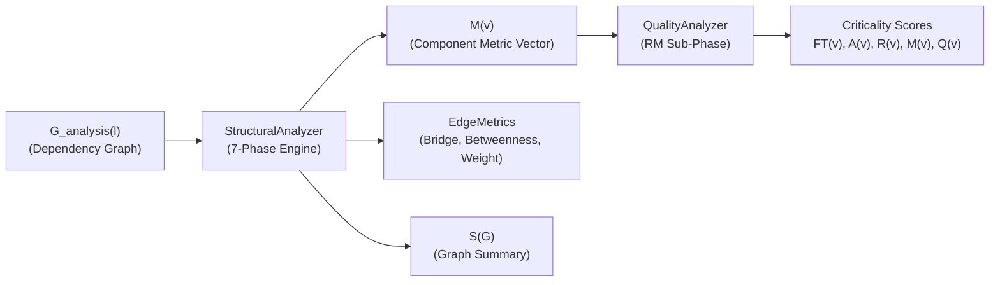
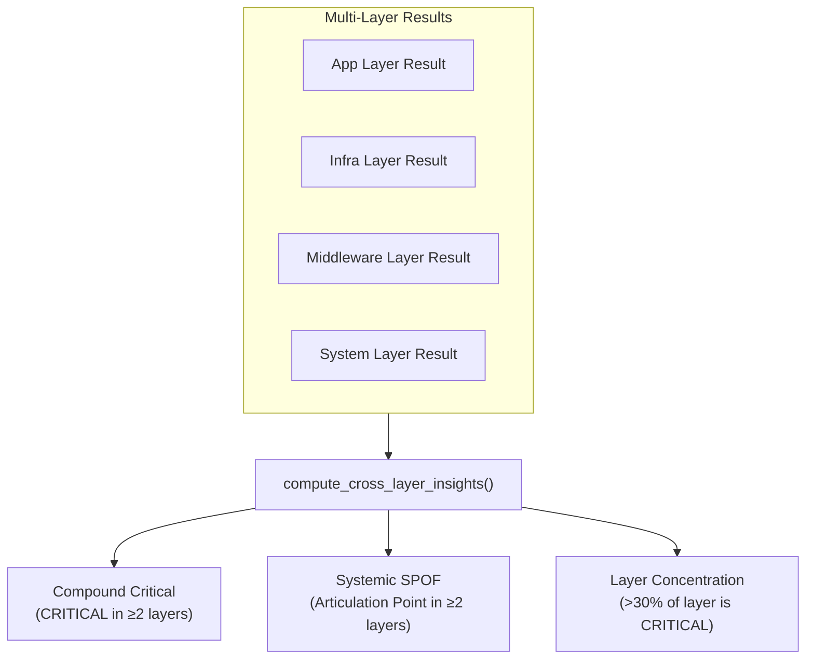
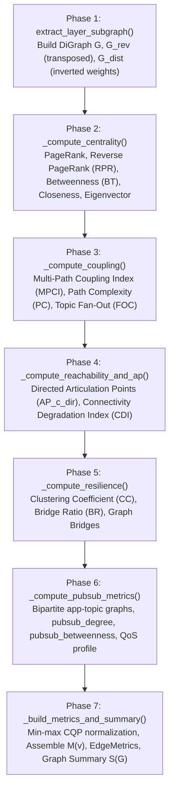
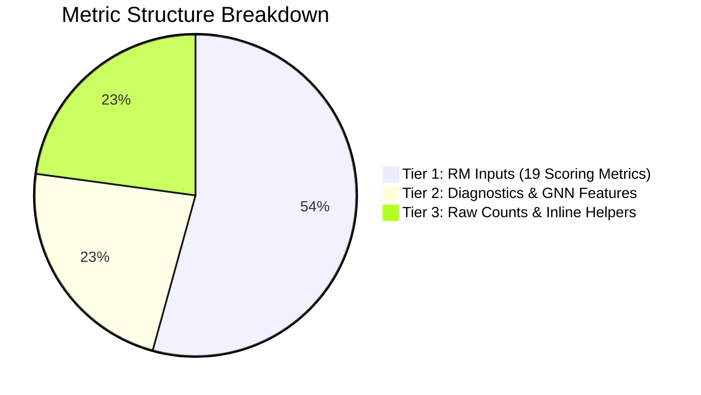

# Step 2: Analyze — Structural Metrics

**Compute every component's structural fingerprint — the set of numbers that explain how it can fail, how it resists change, and who it takes down with it.**

← [Step 1: Import](graph-model.md) | → [Step 3: Predict](prediction.md)

---

## Table of Contents

1. [Overview](#1-overview)
2. [Analysis Pipeline Architecture](#2-analysis-pipeline-architecture)
   - 2.1 [Execution Paths (Path A vs. Path B)](#21-execution-paths-path-a-vs-path-b)
   - 2.2 [Pre-Analysis Dependency Derivation](#22-pre-analysis-dependency-derivation)
3. [Layer Projections](#3-layer-projections)
4. [Cross-Layer Analysis & Multi-Layer Insights](#4-cross-layer-analysis--multi-layer-insights)
5. [Topological Analysis Flow (7-Phase Engine)](#5-topological-analysis-flow-7-phase-engine)
6. [Metric Taxonomy & Normalisation](#6-metric-taxonomy--normalisation)
   - 6.1 [The Three-Tier Metric Structure](#61-the-three-tier-metric-structure)
   - 6.2 [Normalisation Strategy (`robust` Rank Normalisation)](#62-normalisation-strategy-robust-rank-normalisation)
   - 6.3 [Normalisation Scope Caveats](#63-normalisation-scope-caveats)
7. [Formal Metric Definitions](#7-formal-metric-definitions)
   - 7.1 [Fault Tolerance Inputs ($FT$)](#71-fault-tolerance-inputs-ft)
   - 7.2 [Maintainability Inputs ($M$)](#72-maintainability-inputs-m)
   - 7.3 [Availability Inputs ($A$)](#73-availability-inputs-a)
   - 7.4 [Derived Inline Composites](#74-derived-inline-composites)
   - 7.5 [Diagnostic Metrics (Tier 2)](#75-diagnostic-metrics-tier-2)
8. [Metric Catalogue Reference](#8-metric-catalogue-reference)
9. [Analyze Stage — Rule-Based RM Scoring](#9-analyze-stage--rule-based-rm-scoring)
   - 9.1 [The Reliability–Maintainability (RM) Hierarchy](#91-the-reliabilitymaintainability-rm-hierarchy)
   - 9.2 [Exact Scoring Formulas](#92-exact-scoring-formulas)
   - 9.3 [Metric Orthogonality Matrix](#93-metric-orthogonality-matrix)
   - 9.4 [AHP Weight Derivation & Consistency](#94-ahp-weight-derivation--consistency)
   - 9.5 [Weight Shrinkage Strategy ($\lambda = 0.70$)](#95-weight-shrinkage-strategy-lambda--070)
   - 9.6 [Adaptive Box-Plot Classification](#96-adaptive-box-plot-classification)
   - 9.7 [Criticality Interpretation Patterns](#97-criticality-interpretation-patterns)
10. [Output Data Structures: $M(v)$ and $S(G)$](#10-output-data-structures-mv-and-sg)
11. [Worked Example (5-Node Distributed Architecture)](#11-worked-example-5-node-distributed-architecture)
12. [Computational Complexity](#12-computational-complexity)
13. [CLI Reference & Usage](#13-cli-reference--usage)
14. [What Comes Next](#14-what-comes-next)

---

## 1. Overview

Structural Analysis transforms the layer-projected dependency graph $G_{\text{analysis}}(l)$ produced in Step 1 into a comprehensive **structural metric vector $M(v)$** for every component.

Each metric captures an independent topological dimension of architectural risk:
- **Cascade Reach**: How broadly failure propagates outward to transitive dependents ($RPR$).
- **Immediate Blast Radius**: Number of direct incoming dependencies ($DG_{in}$).
- **Single Points of Failure (SPOFs)**: Whether node removal disconnects the graph ($AP_c^{\text{dir}}, BR$).
- **Structural Bottlenecks**: Shortest-path routing concentration and efferent coupling ($BT, w_{out}$).
- **Code Health**: Synthesized penalty from static code complexity, instability, and cohesion ($CQP$).



> [!IMPORTANT]
> **Separation of Concerns**: $M(v)$ contains pure structural observations. Criticality scoring ($Q(v)$) occurs in the rule-based RM sub-phase ([§9](#9-analyze-stage--rule-based-rm-scoring)). Structural analysis never imports simulation ground truth, preserving the **Independence Guarantee**.

---

## 2. Analysis Pipeline Architecture

### 2.1 Execution Paths (Path A vs. Path B)

The framework provides two entry routes that funnel through `AnalysisService.analyze_layers()`:

```mermaid
flowchart TD
    subgraph PathA["Path A: Pure Structural Analysis"]
        CLI_A["cli/analyze_graph.py<br>client.analyze(layer)"] --> UC_A["AnalyzeGraphUseCase"]
        UC_A --> AS_A["AnalysisService.analyze_layers()"]
        AS_A --> SA_A["StructuralAnalyzer.analyze()"]
        SA_A --> RES_A["LayerAnalysisResult<br>(.structural populated only)"]
    end

    subgraph PathB["Path B: Structural + RM + Antipatterns"]
        CLI_B["saag --analyze<br>REST API /api/v1/analysis"] --> UC_B["MultiLayerAnalysisUseCase"]
        UC_B --> AS_B["AnalysisService.analyze_layers()"]
        AS_B --> PS_B["PredictionService.predict_quality()<br>(Computes RM Scores)"]
        PS_B --> AP_B["AntiPatternDetector.detect()"]
        AP_B --> CL_B["compute_cross_layer_insights()"]
        CL_B --> RES_B["MultiLayerAnalysisResult<br>(Full RM + Insights + Antipatterns)"]
    end
```



- **Path A (`cli/analyze_graph.py`)**: Computes structural metrics $M(v)$ and graph summary $S(G)$ only. Fast, lightweight, and completely decoupled from scoring models.
- **Path B (`saag --analyze` / API)**: Computes structural metrics, evaluates rule-based RM criticality ($Q(v)$), runs graph antipattern detection, and synthesizes multi-layer cross-tier insights.

### 2.2 Pre-Analysis Dependency Derivation

Before metrics are calculated, `AnalysisService` triggers `IGraphRepository.derive_dependencies()`. This step:
1. Synthesizes `DEPENDS_ON` edges across Application, Library, Broker, and Node entities from underlying pub/sub interactions (`PUBLISHES_TO`, `SUBSCRIBES_TO`, `ROUTES`, `USES`).
2. Assigns QoS-derived dependency weights $w(e) = \max_t w(t)$ and records channel multiplicities (`path_count`).
3. Runs **once per execution** across all requested layers to maximize performance.

---

## 3. Layer Projections

Analysis operates on specified architectural projections ($\pi_l$), isolating targeted component types and dependency classes:

| Layer Key | Formal Name | Analyzed Vertices ($V_l$) | Dependency Edge Types Included | Focus Area |
|:---|:---|:---|:---|:---|
| `app` | **Application Layer** | `Application`, `Library` | `app_to_app`, `app_to_lib` | Service reliability & cascade depth |
| `infra` | **Infrastructure Layer** | `Node` (Physical/Virtual Hosts) | `node_to_node` | Host-level hardware SPOFs |
| `mw` | **Middleware Layer** | `Broker` *(Apps/Nodes in subgraph for edges)* | `app_to_broker`, `node_to_broker`, `broker_to_broker` | Message routing bottlenecks |
| `system` | **Complete System** | `Application`, `Broker`, `Node`, `Topic`, `Library` | All 6 dependency subtypes | End-to-end holistic architecture |

- **Library Inclusion in `app`**: `app_to_lib` edges are included so shared library blast radii are visible without requiring a full `system` layer analysis.
- **`all` Shorthand**: Running `--layer all` executes all four layers sequentially (`app`, `infra`, `mw`, `system`), saving individual reports as `<output>_<layer>.json`.

---

## 4. Cross-Layer Analysis & Multi-Layer Insights

When multiple layers are evaluated in Path B, `compute_cross_layer_insights()` ([saag/analysis/cross_layer.py](../saag/analysis/cross_layer.py)) identifies systemic architectural liabilities that cross layer boundaries:



### Insight Types & Triggers

| Insight Type | Trigger Condition | Severity | Architectural Impact |
|:---|:---|:---:|:---|
| **`compound_critical`** | Component classified as `CRITICAL` or `HIGH` in $\ge 2$ distinct layer projections | `CRITICAL` | Represents an architectural liability that cannot be resolved in a single tier (e.g., service hub hosted on fragile infrastructure). |
| **`systemic_spof`** | Component is an articulation point ($AP_c^{\text{dir}} > 0$) in $\ge 2$ distinct layer projections | `CRITICAL` | Single point of failure whose loss fragments communication across multiple abstraction levels simultaneously. |
| **`layer_concentration`** | $> 30\%$ of all components in a single layer are classified as `CRITICAL` | `HIGH` | Indicates an unbalanced systemic design pattern (e.g., over-centralized single-broker bottleneck). |

---

## 5. Topological Analysis Flow (7-Phase Engine)

`StructuralAnalyzer.analyze()` executes seven deterministic phases in strict sequence:



> [!NOTE]
> **Weight Semantics**: Edge weights on `DEPENDS_ON` represent *dependency guarantee strength*. 
> - Forward/Reverse PageRank and Katz centrality use weights directly as importance multipliers.
> - Shortest-path algorithms (Betweenness Centrality, CDI) use **inverted weights** ($1/w$) as distances, ensuring shortest paths route preferentially through high-guarantee dependencies.

---

## 6. Metric Taxonomy & Normalisation

### 6.1 The Three-Tier Metric Structure

Every computed field in $M(v)$ belongs to one of three architectural tiers:



- **Tier 1 — RM Scoring Inputs**: Directly drive $FT(v), A(v), M(v),$ and composite $Q(v)$ (see [§8](#8-metric-catalogue-reference)).
- **Tier 2 — Diagnostics & GNN Features**: Computed for dashboards, UI inspection, and machine learning models; do not alter rule-based RM scores.
- **Tier 3 — Raw Topological Counts**: Integer degrees, bridge counts, and raw flags used as helper terms in derived composite equations.

### 6.2 Normalisation Strategy (`robust` Rank Normalisation)

All Tier 1 metrics are bounded in $[0, 1]$ before RM composition. The default method is **robust rank normalisation**:

$$x_{\text{robust}}(v) = \frac{\text{avg\_rank}(v)}{|V| - 1} \in [0, 1]$$

- **Why Rank Normalisation?** Min-max scaling is highly vulnerable to hub outliers (e.g., compressing 50 peripheral nodes into $[0, 0.05]$ when one giant hub has degree 50). Rank normalisation preserves ordinal relationships across the entire distribution.
- **Naturally Bounded Metrics Passed Raw**: Metrics with intrinsic mathematical bounds in $[0, 1]$ ($AP_c^{\text{dir}}, CDI, MPCI, FOC, CC, CQP$) are passed directly without ranking to preserve absolute semantic meaning (e.g., $AP_c = 0$ strictly means "not an articulation point").

### 6.3 Normalisation Scope Caveats

1. **Single-Node Populations**: If a layer contains only a single node (span $= 0$), normalisation defaults to $1.0$ to ensure singleton core components are not ignored.
2. **Type-Split Normalisation**: Applications and Libraries are normalized as **separate populations** for code metrics, preventing large legacy monoliths from zeroing out library complexity.
3. **Optional Winsorization (`--winsorize`)**: Extreme outliers above the 95th percentile can be capped prior to rank assignment.

---

## 7. Formal Metric Definitions

### 7.1 Fault Tolerance Inputs ($FT$)

#### 1. Reverse PageRank ($RPR$)
Measures global cascade reach on the transposed graph $G^{\mathsf T}$ ($d=0.85$):

$$RPR(v) = \text{PageRank}(G^{\mathsf T}, d=0.85)[v]$$

- **Why Reverse?** In `DEPENDS_ON`, edges point $\text{Dependent} \to \text{Dependency}$. Failure propagates in reverse ($\text{Dependency} \to \text{Dependent}$). Reversing edge directions aligns PageRank random walks with the failure propagation direction.
- *Citation*: Page et al. (1999); Chepelianskii (2010); Gleich (2015).

#### 2. In-Degree ($DG_{in}$)
Immediate local dependent count (local blast radius):

$$DG_{in}(v) = \frac{\text{in\_degree}(v)}{|V| - 1}$$

#### 3. Multi-Path Coupling Index ($MPCI$)
Quantifies multi-channel dependency intensity across incoming edges:

$$MPCI(v) = \frac{\sum_{e \in \text{InEdges}(v)} \max(\text{path\_count}(e) - 1, \; 0)}{|V| - 1}$$

- *Citation*: Henry & Kafura (1981); Chidamber & Kemerer (1994).

#### 4. Fan-Out Criticality ($FOC$) — Topic Nodes Only
Measures subscriber blast surface modulated by publication frequency:

$$FOC(t) = \frac{\ln(1 + f(t)) \cdot s(t)}{\max_{t'} [\ln(1 + f(t')) \cdot s(t')]}$$

*(where $f(t)$ is topic message frequency in Hz and $s(t)$ is subscriber count).*

#### 5. QoS-Weighted In-Degree ($w_{in}$) — Topic Nodes Only
Summed in-edge QoS weight across every incoming edge type (`PUBLISHES_TO` and
broker `ROUTES`), rank-normalised against the whole component population, not
against topics alone:

$$w_{in}(v) = \sum_{(u,v) \in \text{InEdges}(v)} \text{weight}(u,v)$$

`dependency_weight_in` was the QADS (QoS-weighted Attack-Dependent Surface)
Tier-1 input to $V(v)$ before Vulnerability/Security was retired from the
composite; the field was not retired with it — it was repurposed as the
$CDPot_{\text{topic}}$ publisher-redundancy discount in $FT_{\text{topic}}(v)$
(§9.2). Non-Topic node types read $0.0$.

---

### 7.2 Maintainability Inputs ($M$)

#### 1. Betweenness Centrality ($BT$)
Shortest-path routing concentration on the inverted-weight graph ($1/w$):

$$BT(v) = \sum_{s \ne v \ne t} \frac{\sigma(s, t \mid v)}{\sigma(s, t)}$$

- *Citation*: Freeman (1977); Brandes (2001).

#### 2. QoS-Weighted Out-Degree ($w_{out}$)
Priority-weighted efferent coupling to downstream providers:

$$w_{out}(v) = \sum_{(v, u) \in \text{OutEdges}(v)} w(v, u)$$

#### 3. Clustering Coefficient ($CC$)
Local graph redundancy, consumed as $(1 - CC(v))$:

$$CC(v) = \frac{2 \cdot |\{ (u, w) \in E : u, w \in N(v) \}|}{\text{deg}(v) \cdot (\text{deg}(v) - 1)}$$

- *Citation*: Watts & Strogatz (1998).

#### 4. Code Quality Penalty ($CQP$)
Synthesized code complexity for `Application` and `Library` vertices:

$$CQP(v) = 0.10 \cdot \text{loc\_norm}(v) + 0.35 \cdot \text{complexity\_norm}(v) + 0.30 \cdot I_{\text{code}}(v) + 0.25 \cdot \text{lcom\_norm}(v)$$

---

### 7.3 Availability Inputs ($A$)

#### 1. Directed Articulation Point Score ($AP_c^{\text{dir}}$)
Continuous graph fragmentation upon vertex removal:

$$\begin{aligned}
AP_c^{\text{out}}(v) &= 1 - \frac{|\text{largest component in } (G \setminus \{v\})|}{|V| - 1} \\
AP_c^{\text{in}}(v) &= 1 - \frac{|\text{largest component in } (G^{\mathsf T} \setminus \{v\})|}{|V| - 1} \\
AP_c^{\text{dir}}(v) &= \max(AP_c^{\text{out}}(v), \; AP_c^{\text{in}}(v))
\end{aligned}$$

- *Citation*: Tarjan (1972).

#### 2. Bridge Ratio ($BR$)
Fraction of incident edges that are cut-edges (graph bridges):

$$BR(v) = \frac{|\{ e \in \text{bridges}(G_{\text{undirected}}) : v \in e \}|}{\text{undirected\_degree}(v)}$$

#### 3. Connectivity Degradation Index ($CDI$)
Average path lengthening across reachable pairs upon vertex removal:

$$CDI(v) = \min\left( \frac{\text{avg\_path\_length}(G \setminus \{v\}) - \text{avg\_path\_length}(G)}{\text{avg\_path\_length}(G)}, \; 1.0 \right)$$

- *Citation*: Albert, Jeong & Barabási (2000).

---

### 7.4 Derived Inline Composites

Computed inline during RM scoring:

1. **Enhanced Cascade Depth Potential ($CDPot_{\text{enh}}$)**:
   $$\begin{aligned}
   CDPot_{\text{base}}(v) &= \left( \frac{RPR(v) + DG_{in}(v)}{2} \right) \cdot \left( 1 - \min\left(\frac{DG_{out}^{\text{raw}}(v)}{\max(DG_{in}^{\text{raw}}(v), \varepsilon)}, \; 1\right) \right) \\
   CDPot_{\text{enh}}(v) &= \min\left(CDPot_{\text{base}}(v) \cdot (1 + MPCI(v)), \; 1.0\right)
   \end{aligned}$$
2. **Coupling Risk with Path Complexity ($CouplingRisk_{\text{enh}}$)**:
   $$\begin{aligned}
   I_{\text{topo}}(v) &= \frac{DG_{out}^{\text{raw}}(v)}{DG_{in}^{\text{raw}}(v) + DG_{out}^{\text{raw}}(v) + \varepsilon} \\
   CouplingRisk_{\text{base}}(v) &= 1 - |2 \cdot I_{\text{topo}}(v) - 1| \\
   CouplingRisk_{\text{enh}}(v) &= \min(1.0, \; CouplingRisk_{\text{base}}(v) \cdot (1 + 0.10 \cdot PC(v)))
   \end{aligned}$$
3. **QoS-Weighted SPOF Severity ($QSPOF$)**:
   $$QSPOF(v) = AP_c^{\text{dir}}(v) \cdot w(v)$$

---

### 7.5 Diagnostic Metrics (Tier 2)

| Metric | Graph Representation | Purpose |
|:---|:---|:---|
| **PageRank ($PR$)** | Forward $G$ | Identifies callee components receiving heavy transitive dependency flows. |
| **Closeness Centrality ($CL$)** | Harmonic on $G$ | Measures forward reachability propagation speed. |
| **Eigenvector Centrality ($EV$)** | Power iteration on $G$ | Measures influence through highly-connected neighbors. |
| **PubSub Bipartite Metrics** | Bipartite app-topic graph | Quantifies topic cluster participation and broker exposure. |
| **Publisher SPOF ($PSPOF$)** | Sole-published topics | Blast risk when an application is the only producer for active subscribers. |

---

## 8. Metric Catalogue Reference

The complete index of metrics in `StructuralMetrics` ([saag/core/metrics.py](../saag/core/metrics.py)):

| Metric Key | Symbol | Tier | RM Target | Direction | Key Semantics |
|:---|:---:|:---:|:---:|:---:|:---|
| `reverse_pagerank` | $RPR$ | 1 | $FT$ | ↑ | Global cascade reach on $G^{\mathsf T}$ |
| `in_degree` | $DG_{in}$ | 1 | $FT$ | ↑ | Immediate dependent count |
| `mpci` | $MPCI$ | 1 | $FT$ | ↑ | Multi-channel coupling amplifier in $CDPot_{\text{enh}}$ |
| `fan_out_criticality` | $FOC$ | 1 | $FT$ | ↑ | Topic subscriber fan-out risk (Topic nodes only) |
| `dependency_weight_in` | $w_{in}$ | 1 | $FT$ | ↑ | Topic publisher redundancy discount |
| `betweenness` | $BT$ | 1 | $M$ | ↑ | Shortest-path routing bottleneck |
| `dependency_weight_out` | $w_{out}$ | 1 | $M$ | ↑ | QoS-weighted efferent coupling |
| `clustering_coefficient` | $CC$ | 1 | $M$ | ↓ | Local path redundancy (scored as $1 - CC$) |
| `path_complexity` | $PC$ | 1 | $M$ | ↑ | Multi-path complexity amplifier in $CouplingRisk_{\text{enh}}$ |
| `code_quality_penalty` | $CQP$ | 1 | $M$ | ↑ | Combined code metrics penalty |
| `ap_c_directed` | $AP_c^{\text{dir}}$ | 1 | $A$ | ↑ | Directed graph fragmentation score |
| `bridge_ratio` | $BR$ | 1 | $A$ | ↑ | Incident bridge edge fraction |
| `cdi` | $CDI$ | 1 | $A$ | ↑ | Path elongation on vertex removal |
| `weight` | $w(v)$ | 1 | $A$ | ↑ | Component QoS operational weight |
| `pagerank` | $PR$ | 2 | — | ↑ | Forward transitive importance |
| `closeness` | $CL$ | 2 | — | ↑ | Forward propagation speed |
| `eigenvector` | $EV$ | 2 | — | ↑ | Forward neighbor influence |
| `pubsub_degree` | — | 2 | — | ↑ | Bipartite topic participation breadth |
| `pubsub_betweenness` | — | 2 | — | ↑ | Bipartite topic cluster bridging |
| `broker_exposure` | — | 2 | — | ↑ | Number of distinct brokers routing node traffic |
| `publisher_spof` | $PSPOF$ | 2 | — | ↑ | Sole-publisher blast risk |

---

## 9. Analyze Stage — Rule-Based RM Scoring

### 9.1 The Reliability–Maintainability (RM) Hierarchy

Scoring evaluates two ISO/IEC 25010:2023 characteristics: **Reliability ($R$)** (hierarchical over Fault Tolerance and Availability) and **Maintainability ($M$)**.

```mermaid
flowchart TD
    subgraph Reliability["Reliability R(v) = 0.36·FT(v) + 0.64·A(v)"]
        direction TB
        FT["Fault Tolerance FT(v)<br>0.45·RPR + 0.30·DG_in + 0.25·CDPot_enh"]
        AV["Availability A(v)<br>0.35·AP_c^dir + 0.25·QSPOF + 0.25·BR + 0.10·CDI + 0.05·w(v)"]
        FT -->|alpha = 0.36| Reliability
        AV -->|1 - alpha = 0.64| Reliability
    end

    subgraph Maintainability["Maintainability M(v)"]
        direction TB
        M_Eq["0.35·BT + 0.30·w_out + 0.15·CQP + 0.12·CouplingRisk_enh + 0.08·(1-CC)"]
    end

    Reliability -->|w_R = 0.80| Q["Composite Score Q(v)"]
    Maintainability -->|w_M = 0.20| Q
```

### 9.2 Exact Scoring Formulas

#### 1. Fault Tolerance ($FT$)
- **Components (`Application`, `Broker`, `Node`, `Library`):**
  $$FT(v) = 0.45 \cdot RPR(v) + 0.30 \cdot DG_{in}(v) + 0.25 \cdot CDPot_{\text{enh}}(v)$$
- **Topics:**
  $$\begin{aligned}
  FT_{\text{topic}}(v) &= 0.50 \cdot FOC(v) + 0.50 \cdot CDPot_{\text{topic}}(v) \\
  CDPot_{\text{topic}}(v) &= FOC(v) \cdot (1 - \min(w_{in}(v), 1))
  \end{aligned}$$

#### 2. Availability ($A$)
$$A(v) = 0.35 \cdot AP_c^{\text{dir}}(v) + 0.25 \cdot QSPOF(v) + 0.25 \cdot BR(v) + 0.10 \cdot CDI(v) + 0.05 \cdot w(v)$$

#### 3. Hierarchical Reliability ($R$)
$$R(v) = r_\alpha \cdot FT(v) + (1 - r_\alpha) \cdot A(v) \qquad (r_\alpha = 0.36)$$

#### 4. Maintainability ($M$)
$$M(v) = 0.35 \cdot BT(v) + 0.30 \cdot w_{out}(v) + 0.15 \cdot CQP(v) + 0.12 \cdot CouplingRisk_{\text{enh}}(v) + 0.08 \cdot (1 - CC(v))$$

#### 5. Composite Criticality Score ($Q$)
$$Q(v) = w_R \cdot R(v) + w_M \cdot M(v) \qquad (w_R = 0.80, \; w_M = 0.20)$$

---

### 9.3 Metric Orthogonality Matrix

Every raw metric maps to **exactly one** sub-characteristic ($FT, M,$ or $A$), ensuring clean attribution:

| Metric | Symbol | Consumed by $FT$ | Consumed by $M$ | Consumed by $A$ |
|:---|:---:|:---:|:---:|:---:|
| Reverse PageRank | $RPR$ | **✓** | | |
| In-Degree | $DG_{in}$ | **✓** | | |
| Multi-Path Coupling Index | $MPCI$ | **✓** *(via $CDPot$)* | | |
| Fan-Out Criticality | $FOC$ | **✓** *(Topic only)* | | |
| QoS In-Degree | $w_{in}$ | **✓** *(Topic only)* | | |
| Betweenness Centrality | $BT$ | | **✓** | |
| QoS Out-Degree | $w_{out}$ | | **✓** | |
| Code Quality Penalty | $CQP$ | | **✓** | |
| Path Complexity | $PC$ | | **✓** *(via $CR$)* | |
| Clustering Coefficient | $CC$ | | **✓** *(as $1-CC$)* | |
| Directed AP Score | $AP_c^{\text{dir}}$ | | | **✓** |
| QoS SPOF Severity | $QSPOF$ | | | **✓** |
| Bridge Ratio | $BR$ | | | **✓** |
| Connectivity Degradation Index | $CDI$ | | | **✓** |
| Component QoS Weight | $w(v)$ | | | **✓** |

---

### 9.4 AHP Weight Derivation & Consistency

Sub-weights are calibrated using Saaty pairwise comparison matrices in `AHPMatrices` ([saag/analysis/weight_calculator.py](../saag/analysis/weight_calculator.py)):

$$\text{Geometric Mean: } GM_i = \left( \prod_{j=1}^n A_{ij} \right)^{1/n}, \quad w_i = \frac{GM_i}{\sum_k GM_k}$$

- **Fault Tolerance ($3 \times 3$)**: RPR, $DG_{in}$, CDPot $\to (0.45, 0.30, 0.25)$ with $CR = 0.001$.
- **Maintainability ($5 \times 5$)**: BT, $w_{out}$, CQP, CR, $(1-CC) \to (0.35, 0.30, 0.15, 0.12, 0.08)$ with $CR = 0.000$.
- **Availability ($5 \times 5$)**: $AP_c^{\text{dir}}$, QSPOF, BR, CDI, $w \to (0.35, 0.25, 0.25, 0.10, 0.05)$ with $CR = 0.001$.

*(All matrices have $CR < 0.003$, well below Saaty's $0.10$ threshold).*

### 9.5 Weight Shrinkage Strategy ($\lambda = 0.70$)

Intra-dimension weights are regularized toward a uniform prior using shrinkage parameter $\lambda = 0.70$:

$$w_{\text{final}} = \lambda \cdot w_{\text{AHP}} + (1 - \lambda) \cdot \frac{1}{n}$$

| Dimension | Pre-Shrinkage Judgement ($\lambda = 1.0$) | Shipped Shrunk Weights ($\lambda = 0.70$) |
|:---|:---:|:---:|
| **Fault Tolerance ($FT$)** | $(0.450, 0.300, 0.250)$ | $(0.422, 0.323, 0.255)$ |
| **Maintainability ($M$)** | $(0.350, 0.300, 0.150, 0.120, 0.080)$ | $(0.305, 0.270, 0.165, 0.144, 0.116)$ |
| **Availability ($A$)** | $(0.350, 0.250, 0.250, 0.100, 0.050)$ | $(0.305, 0.235, 0.235, 0.130, 0.095)$ |

*(Note: Composite weights $w_R=0.80, w_M=0.20$ and blend $r_\alpha=0.36$ are declared constants and remain $\lambda$-invariant).*

---

### 9.6 Adaptive Box-Plot Classification

Scores are categorized into five actionable tiers relative to the system's own distribution:

```
CRITICAL  :  Score > Q3 + 1.5 × IQR       (Severe statistical outlier)
HIGH      :  Q3 < Score ≤ Q3 + 1.5 × IQR  (Upper quartile)
MEDIUM    :  Median < Score ≤ Q3          (Typical operational component)
LOW       :  Q1 < Score ≤ Median          (Peripheral component)
MINIMAL   :  Score ≤ Q1                   (Isolated leaf component)
```

*(Small-sample fallback: When $N < 12$, fixed percentiles are used: Top 10% CRITICAL, 75–90% HIGH, 50–75% MEDIUM, 25–50% LOW, Bottom 25% MINIMAL).*

---

### 9.7 Criticality Interpretation Patterns

| Architectural Risk Pattern | $FT$ | $A$ | $M$ | Primary Failure Mode | Recommended Remedy |
|:---|:---:|:---:|:---:|:---|:---|
| **Structural SPOF** | Low | **High** | Low | Total service partition | Add redundant instance, deploy active-passive failover |
| **Fault Propagation Hub** | **High** | Low | Low | Wide cascade reach | Introduce circuit breakers, bulkheads, rate limiting |
| **Maintainability Bottleneck** | Low | Low | **High** | Severe change friction | Decouple interfaces, reduce fan-out, refactor $CQP$ |
| **Compound SPOF + Hub** | **High** | **High** | **High** | Catastrophic compound risk | Fundamental architectural redesign |
| **Multi-Path Sink** | **High** | Low | Med | Multi-vector cascade | Reduce redundant topic channels between endpoints |

---

## 10. Output Data Structures: $M(v)$ and $S(G)$

`StructuralMetrics` represents $M(v)$ per node, while `GraphSummary` represents $S(G)$:

```python
@dataclass
class GraphSummary:
    layer: str                     # "app" | "infra" | "mw" | "system"
    nodes: int                     # Vertex count
    edges: int                     # DEPENDS_ON edge count
    density: float                 # Graph density
    avg_degree: float              # Mean undirected degree
    avg_clustering: float          # Mean clustering coefficient
    is_connected: bool             # Weak connectivity flag
    num_components: int            # Connected component count
    num_articulation_points: int   # Strict AP count
    num_bridges: int               # Bridge edge count
    diameter: int                  # Longest shortest path in largest CC
    avg_path_length: float         # Average shortest path length
    assortativity: float           # Degree assortativity coefficient
    connectivity_health: str       # "HEALTHY" | "MODERATE" | "AT_RISK"
```

---

## 11. Worked Example (5-Node Distributed Architecture)

**Topology**: `SensorApp` $\to$ `/temperature` $\gets$ `MonitorApp`; both $\to$ `MainBroker`; both $\to$ `NavLib`.

```
Component        RPR    DG_in   MPCI   AP_c_dir   BR     BT     w_in   FOC
────────────────────────────────────────────────────────────────────────
SensorApp        0.22   0.25    0.0    0.0        0.0    0.0    0.59   0.0
MonitorApp       0.41   0.00    0.0    0.0        0.0    0.0    0.00   0.0
MainBroker       0.12   0.50    0.0    0.0        0.0    0.0    1.19   0.0
NavLib           0.12   0.50    0.0    0.0        0.0    0.0    1.19   0.0
/temperature     0.12   0.00    0.0    0.0        0.0    0.0    0.00   1.0
```

### Computed RM Scores and Criticality:

```
Component        FT(v)    A(v)     R(v)=0.36·FT+0.64·A    M(v)     Q(v)     Diagnosis
───────────────────────────────────────────────────────────────────────────────────────────
SensorApp        0.4875   0.0188   0.1875                 0.6454   0.3478   Maintainability Bottleneck
MonitorApp       0.4875   0.0188   0.1875                 0.5017   0.2975   Efferent Coupling Risk
MainBroker       0.5156   0.0188   0.1976                 0.2500   0.2160   Routing Hub (Redundant)
NavLib           0.5156   0.0500   0.2176                 0.3737   0.2723   Shared Library
/temperature     0.9375   0.0188   0.3495                 0.3300   0.3427   Topic Fan-Out Choke Point
```

- **/temperature ($FT = 0.9375$)**: Highest fault tolerance risk due to sole-subscriber fan-out ($FOC = 1.0$).
- **SensorApp ($M = 0.6454$)**: High maintainability risk driven by coupling instability and $CQP$.
- **Zero Articulation Points**: $A(v)$ remains low ($0.0188–0.0500$) because the 4 components form a 5-edge redundant subgraph with no cut-vertices.

---

## 12. Computational Complexity

| Algorithm | Complexity | Optimization & Acceleration |
|:---|:---:|:---|
| **PageRank / $RPR$** | $O(I \cdot |E|)$ | Power iteration with damping $d=0.85$ ($I \le 100$) |
| **Betweenness Centrality ($BT$)** | $O(|V| \cdot |E|)$ | Brandes' algorithm on inverted-weight graph |
| **Closeness Centrality ($CL$)** | $O(|V| \cdot (|V| + |E|))$ | Harmonic closeness BFS |
| **Directed AP Score ($AP_c^{\text{dir}}$)** | $O(|V| \cdot (|V| + |E|))$ | Consolidated reachability pass across in/out components |
| **Connectivity Degradation ($CDI$)** | $O(|V| \cdot (|V| + |E|))$ | **Deterministic Top-50 Core Sampling** for $|V| > 300$ |
| **Bridge Detection ($BR$)** | $O(|V| + |E|)$ | DFS-based bridge search |
| **Rank Normalisation** | $O(|V| \log |V|)$ | Per-metric introsort |

**Overall Complexity**: $O(|V|^2 + |V| \cdot |E|)$, completing large systems ($N = 200, E = 600$) in $\approx 20\text{s}$.

---

## 13. CLI Reference & Usage

### Basic Commands

```bash
# Analyze full system layer (default)
PYTHONPATH=. python cli/analyze_graph.py

# Analyze specific layer projections
PYTHONPATH=. python cli/analyze_graph.py --layer app
PYTHONPATH=. python cli/analyze_graph.py --layer infra
PYTHONPATH=. python cli/analyze_graph.py --layer mw

# Analyze all layers and export results
PYTHONPATH=. python cli/analyze_graph.py --layer all --output results/metrics.json
```

### Full Multi-Layer Analysis with RM Scoring & Antipatterns

```bash
# Run full analysis pipeline with cross-layer insights
saag --analyze --layers app,infra,mw,system --output results/analysis.json

# Predict scores with custom normalization and AHP settings
PYTHONPATH=. python cli/predict_graph.py --layer system --norm robust --use-ahp
```

---

## 14. What Comes Next

Step 2 computes baseline structural metrics and rule-based RM scores $Q(v)$. To capture nonlinear multi-hop motifs and predict direct edge criticalities, proceed to **[Step 3: Predict](prediction.md)**.

---

← [Step 1: Import](graph-model.md) | → [Step 3: Predict](prediction.md)