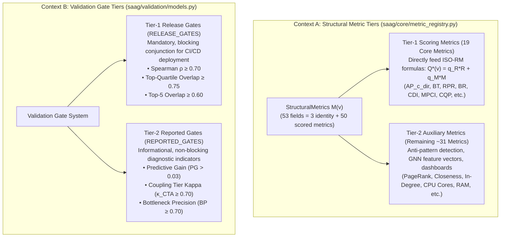
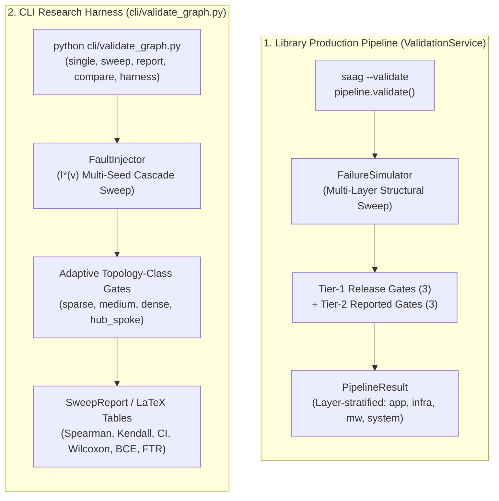
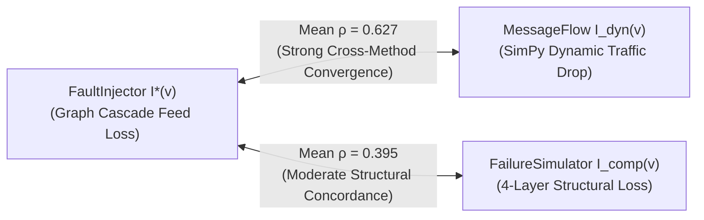
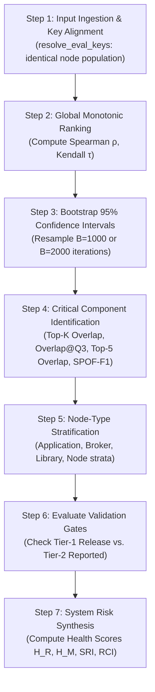

# Step 6: Validate — Empirical Validation & Quality Gating

**Statistically prove that pre-deployment architectural predictions $Q(v)$ agree with simulation-derived failure cascades $I(v)$, establishing empirical validity through Tier-1 release gates and Tier-2 diagnostic telemetry.**

← [Step 5: Simulate](failure-simulation.md) | [README](../README.md) | **Step 6: Validate** | → [Step 7: Prescribe](prescription.md)

---

## Table of Contents

1. [Overview & The Validation Mental Model](#1-overview--the-validation-mental-model)
2. [Tier-1 vs. Tier-2: Concepts, Metrics & Gates Explained](#2-tier-1-vs-tier-2-concepts-metrics--gates-explained)
   - 2.1 [Architectural & Structural Metric Tiers ($M(v)$)](#21-architectural--structural-metric-tiers-mv)
   - 2.2 [Validation Gate Tiers (Release vs. Reported Gates)](#22-validation-gate-tiers-release-vs-reported-gates)
3. [Two Validation Harnesses & Execution Modes](#3-two-validation-harnesses--execution-modes)
4. [Ground-Truth Oracles & Simulation Taxonomy](#4-ground-truth-oracles--simulation-taxonomy)
   - 4.1 [The Simulation Oracles ($I^*, I_{\text{comp}}, I_{\text{dyn}}, IM$)](#41-the-simulation-oracles-i-i_textcomp-i_textdyn-im)
   - 4.2 [Oracle Convergence & Behavioral Validation ($I_{\text{dyn}}(v)$)](#42-oracle-convergence--behavioral-validation-i_textdynv)
5. [How to Validate Prediction Results: Step-by-Step Guide](#5-how-to-validate-prediction-results-step-by-step-guide)
   - 5.1 [Step 1: Input Ingestion & Population Alignment](#51-step-1-input-ingestion--population-alignment)
   - 5.2 [Step 2: Global Monotonic Ranking (Spearman $\rho$ & Kendall $\tau$)](#52-step-2-global-monotonic-ranking-spearman-rho--kendall-tau)
   - 5.3 [Step 3: Bootstrap 95% Confidence Intervals](#53-step-3-bootstrap-95-confidence-intervals)
   - 5.4 [Step 4: Critical Component Capture Rate (Top-$K$ & SPOF-$F_1$)](#54-step-4-critical-component-capture-rate-top-k--spof-f_1)
   - 5.5 [Step 5: Node-Type Stratification (Preventing Simpson's Paradox)](#55-step-5-node-type-stratification-preventing-simpsons-paradox)
   - 5.6 [Step 6: Evaluate Tier-1 and Tier-2 Validation Gates](#56-step-6-evaluate-tier-1-and-tier-2-validation-gates)
   - 5.7 [Step 7: System-Wide Health & Risk Index Synthesis](#57-step-7-system-wide-health--risk-index-synthesis)
6. [Validation Gate Systems & Adaptive Thresholds](#6-validation-gate-systems--adaptive-thresholds)
   - 6.1 [Library Gate Suite (`ValidationService`)](#61-library-gate-suite-validationservice)
   - 6.2 [CLI Adaptive Topology-Class Gates (`validate_graph.py`)](#62-cli-adaptive-topology-class-gates-validate_graphpy)
7. [Programmatic Python SDK & Service Reference](#7-programmatic-python-sdk--service-reference)
8. [CLI Reference & Validation Workflows](#8-cli-reference--validation-workflows)
9. [Output Schemas & Validation Artifacts](#9-output-schemas--validation-artifacts)
10. [Diagnostic Troubleshooting Table](#10-diagnostic-troubleshooting-table)
11. [Methodological Boundaries & Design Invariants](#11-methodological-boundaries--design-invariants)
12. [What Comes Next](#12-what-comes-next)

For the complete CLI command reference (`validate_graph.py`), see [cli-pipeline-guide.md — Step 6](cli-pipeline-guide.md#step-6-validate).

---

```
┌─────────────────────────────────────────────────────────────────────────────┐
│                             STEP 6 AT A GLANCE                              │
├───────────────────┬─────────────────────────────────────────────────────────┤
│ Primary Input     │ • A prediction Q(v): GNN ranks, Topo-QoS, or RM Q*(v).  │
│                   │ • A ground-truth oracle I(v) from Step 5.               │
│                   │ Both must name which oracle produced them.              │
├───────────────────┼─────────────────────────────────────────────────────────┤
│ Core Engine       │ ValidationService (library gates) or validate_graph.py  │
│                   │ (research harness). See §3 for which to use.            │
├───────────────────┼─────────────────────────────────────────────────────────┤
│ Key Operations    │ 1. Align keys; filter to the evaluation population.     │
│                   │ 2. Spearman ρ and Kendall τ, with bootstrap 95% CIs.    │
│                   │ 3. Top-K capture rate and SPOF-F1.                      │
│                   │ 4. Stratify by node type (Simpson's paradox is real     │
│                   │    here — pooled ρ sits below every per-type value).    │
│                   │ 5. Score the six gates; synthesize SRI/RCI.             │
├───────────────────┼─────────────────────────────────────────────────────────┤
│ Primary Outputs   │ • Correlations, CIs, capture rates, per-type breakdown. │
│                   │ • Gate verdicts: PASSED or WEAK.                        │
│                   │ • A gate value of None means NEVER MEASURED — which is  │
│                   │   not the same as a failure. Never coerce it to 0.0.    │
├───────────────────┼─────────────────────────────────────────────────────────┤
│ What This Does    │ It validates the RANKING pathway. Step 4's diagnosis is │
│ Not Cover         │ deliberately out of scope — a quality profile is not a  │
│                   │ ranking, so there is nothing to correlate it against.   │
├───────────────────┼─────────────────────────────────────────────────────────┤
│ Downstream Handoff│ • Step 7 (Prescribe): the baseline SRI each candidate   │
│                   │   edit must improve on.                                 │
└───────────────────┴─────────────────────────────────────────────────────────┘
```

### Where this sits in the JSS paper

| | |
|:---|:---|
| **Manuscript section** | §6.3 (metrics, Holm correction, pre-registration, the three evaluation protocols), §5.3 (the Prescribe acceptance rule this stage feeds), §7.3.2 and Supplementary §S9 (oracle agreement) |
| **Paper's name for this** | the **Validate stage** — used in §4.2.1 and §4.3 but never given a number in the paper's four-stage list |
| **Symbols** | $\rho$, $\tau$, $F_1@K$ with $K = \text{round}(0.20 \cdot \lvert V_{\text{app}} \rvert)$, $\sigma_{\text{seed}}$, $\kappa$. Note the paper's $\hat{\sigma}$ is *prediction dispersion*, a label-free confidence signal it proposed and then **withdrew** (§7.2.3, §8.1) — not simulator noise. |
| **Results** | §7.1–7.3. The numbers to hold onto: LOSO Spearman tops out at $0.638$ (HGT-QoS) against $0.553$ for a training-free baseline; precision, recall and $F_1$ coincide identically at top-$K$ because both sets are the top quartile; and LOSO folds are **not independent replicates**, so the $p$-values are optimistic by an unquantified amount. |

> [!NOTE]
> **Eight steps here, four stages in the paper.** This repository numbers the pipeline in eight
> executable steps (Model, Analyze, Predict, Diagnose, Simulate, Validate, Prescribe, Visualize),
> because that is what you run. The JSS manuscript describes a coarser **four-stage** pipeline —
> Typed Multigraph Formulation → QoS-Aware Dependency Projection → Heterogeneous Graph Learning
> (Predictive Pathway) → Explainable Quality Attribution (Explanation Layer) — because that is what
> it evaluates. Steps 1 and 2 together are the paper's stages 1–2; Step 3 is stage 3; Step 4 is
> stage 4. The paper also refers to a "Validate stage" and a "Prescribe stage" without numbering
> them: those are Steps 6 and 7.
>
> The two arms are named differently too. This documentation says **Pathway B** for the learned
> ranking arm and **Pathway A** for the deterministic diagnostic arm, matching `PredictiveUseCase`
> and `DiagnosticUseCase` in the code. The paper calls them the **Predictive Pathway** (§4) and the
> **Explanation Layer** (§5). They are the same two things.

---

## 1. Overview & The Validation Mental Model

Step 6 closes the scientific loop of the Software-as-a-Graph (SaG) methodology. It evaluates whether **pre-deployment predictions $Q(v)$**—whether generated by learned Graph Neural Networks (`HGT-QoS`), topological centralities (`TopoQoSPredictor`), or the closed-form ISO-RM Quality Model ($Q^*(v)$)—accurately forecast **empirical runtime failure cascades $I(v)$**.

```
┌─────────────────────────────────────────┐          ┌─────────────────────────────────────────┐
│   Step 3 / Step 4: Prediction Q(v)      │          │     Step 5: Simulation Ground Truth     │
│  • Learned GNN: Q_GNN(v)                │          │  • FaultInjector: I*(v) (Feed Loss)     │
│  • Topological: Topo-QoS(v)             │          │  • FailureSimulator: I_comp(v) (Struct) │
│  • Rule-Based: ISO-RM Q*(v)             │          │  • ChangePropagation: I_M(v) (Ripple)   │
└─────────────────────────────────────────┘          └─────────────────────────────────────────┘
                     │                                                    │
                     └──────────────────────────┬─────────────────────────┘
                                                ▼
                               ┌──────────────────────────────────┐
                               │   Step 6: Empirical Validation   │
                               │  1. Key Alignment & Filtering    │
                               │  2. Global Rank Monotonicity     │
                               │  3. Top-K Hazard Identification  │
                               │  4. Node-Type Stratification     │
                               │  5. Tier-1 & Tier-2 Gating       │
                               │  6. Systemic Risk Indices (SRI)  │
                               └──────────────────────────────────┘
                                                │
                                                ▼
                               ┌──────────────────────────────────┐
                               │    VERDICT: PASSED or WEAK       │
                               │  • Tier-1: Release / Block CI    │
                               │  • Tier-2: Diagnostic Telemetry  │
                               └──────────────────────────────────┘
```

> [!IMPORTANT]
> **Methodological Independence Guarantee:**
> $Q(v)$ is computed purely from static graph topology, code attributes, and declared transport QoS contracts. In contrast, $I(v)$ is generated via stochastic discrete-event and graph cascade simulations. Strong statistical agreement ($\rho \ge 0.70$) proves that **static graph structure is an accurate surrogate for operational failure impact**.

---

## 2. Tier-1 vs. Tier-2: Concepts, Metrics & Gates Explained

In Software-as-a-Graph, the terms **Tier-1** and **Tier-2** appear in two distinct architectural contexts: **structural metric categorization** and **validation gate severity**. Understanding both is essential.



### 2.1 Architectural & Structural Metric Tiers ($M(v)$)

During Step 2 (Analyze), SaG extracts a metric vector $M(v)$ covering topological, resilience,
pub-sub, infrastructure, and code-quality properties. The `StructuralMetrics` dataclass has
**53 fields**: three identity fields (`id`, `name`, `type`) plus **50 scored metrics**, which are
exactly the 50 keys of `METRIC_ROLES`. [structural-analysis.md](structural-analysis.md) calls this
"the 53-field vector" (counting the dataclass) and this document counts the 50 metrics — the same
object, counted two ways. The 50 are strictly partitioned into two tiers in
[`saag/core/metric_registry.py`](../saag/core/metric_registry.py):

> [!NOTE]
> **$M(v)$ is overloaded across these documents.** Here and in
> [structural-analysis.md](structural-analysis.md) it is the whole metric vector; in the RM formulas
> it is the scalar **Maintainability** score, $M(v) = 0.35 \cdot BT(v) + \dots$. The surrounding
> sentence always disambiguates, but the collision is real and worth knowing before you read §5.

#### Tier-1 Structural Metrics (19 Core Scoring Metrics)
- **Definition**: The 19 foundational metrics that directly feed into the closed-form ISO-RM Quality Model formulas ($Q^*(v) = q_R R(v) + q_M M(v)$).
- **Behavior**: They are normalized into $[0, 1]$ and directly change the component's calculated risk score.
- **The 19 Tier-1 Metrics** — these are exactly the 19 keys carrying `MetricRole.SCORING` in
  [`METRIC_ROLES`](../saag/core/metric_registry.py). They appear below as **15 numbered entries plus
  the 4 sub-metrics of `code_quality_penalty`**, which is how they compose; the four are scoring
  metrics in their own right, which is why 15 + 4 = 19.
  1. `reverse_pagerank`: Upstream dependency exposure (feeds Fault Tolerance, weight $0.45$).
  2. `in_degree_raw`: Number of incoming dependency channels (feeds Fault Tolerance, weight $0.30$).
  3. `fan_out_criticality`: Immediate subscriber blast radius (feeds Topic Fault Tolerance).
  4. `dependency_weight_in`: Summed incoming QoS edge weights (feeds Topic Fault Tolerance).
  5. `ap_c_directed`: Directed articulation point cut-vertex score (feeds Availability, weight $0.25$).
  6. `cdi`: Connectivity Degradation Index (feeds Availability, weight $0.25$).
  7. `bridge_ratio`: Proportion of incident edges that are structural bridges (feeds Availability, weight $0.20$).
  8. `weight`: Aggregated QoS criticality of incident contracts (feeds Availability, weight $0.10$).
  9. `betweenness`: Fraction of shortest paths traversing the component (feeds Maintainability, weight $0.35$).
  10. `dependency_weight_out`: Summed outgoing QoS edge weights (feeds Maintainability, weight $0.30$).
  11. `clustering_coefficient`: Local clustering transitivity, evaluated as $1 - CC$ (feeds Maintainability, weight $0.08$).
  12. `out_degree_raw`: Number of outgoing dependency channels (feeds Maintainability instability).
  13. `mpci`: Multi-Path Coupling Index (enhances coupling risk).
  14. `path_complexity`: Density of transitive reachability (enhances coupling risk).
  15. `code_quality_penalty`: Composite code penalty (feeds Maintainability, weight $0.15$), synthesized from four sub-metrics:
      - `loc_norm` (lines of code, weight $0.10$)
      - `complexity_norm` (cyclomatic complexity, weight $0.35$)
      - `instability_code` (architectural afferent/efferent instability, weight $0.30$)
      - `lcom_norm` (lack of cohesion in methods, weight $0.25$)

#### Tier-2 Structural Metrics (Auxiliary & Context Metrics)
- **Definition**: The remaining 31 scored metrics that do *not* directly enter the ISO-RM composite formula.
- **Roles**:
  - **Anti-Pattern Detection**: Metrics read by `AntiPatternDetector` (e.g., `pagerank` for Concentration Risk, `is_articulation_point` for SPOF, `topic_subscriber_count` for Topic Fanout).
  - **GNN Feature Vectors**: Metrics mapped into PyG node tensors (e.g., `closeness`, `eigenvector`, `in_degree`, `out_degree`).
  - **Descriptive & Dashboard Telemetry**: Hardware and infrastructure attributes rendered for human exploration (`cpu_cores`, `memory_gb`, `ip_address`, `max_connections`, `bugs`, `vulnerabilities`).

---

### 2.2 Validation Gate Tiers (Release vs. Reported Gates)

When evaluating prediction performance against simulation ground truth, SaG evaluates a battery of statistical validation gates declared in [`saag/validation/models.py`](../saag/validation/models.py). These gates are partitioned into **Tier-1 Release Gates** and **Tier-2 Reported Gates**:

| Validation Gate Tier | Gate Identifier | Target Metric | Required Threshold | CI/CD Enforcement | Purpose & Behavior |
|:---|:---|:---|:---:|:---:|:---|
| **Tier-1: Release Gates** (`RELEASE_GATES`) | `spearman` | **Spearman Rank Correlation ($\rho$)** | $\ge 0.70$ | **Blocking** | Confirms global monotonic rank agreement. If $\rho < 0.70$, the deployment fails. |
| **Tier-1: Release Gates** (`RELEASE_GATES`) | `overlap_at_q3` | **Top-Quartile Overlap** | $\ge 0.75$ | **Blocking** | Confirms that components predicted in the top 25% of risk match the top 25% empirical failure hotspots. |
| **Tier-1: Release Gates** (`RELEASE_GATES`) | `top5_overlap` | **Top-5 Overlap** | $\ge 0.60$ | **Blocking** | Confirms that at least 3 of the top 5 most hazardous components are successfully captured. |
| **Tier-2: Reported Gates** (`REPORTED_GATES`) | `predictive_gain` | **Predictive Gain ($PG$)** | $> 0.03$ | Non-Blocking (Informational) | Measures whether the multi-dimensional composite $Q^*$ outperforms its best individual sub-dimension ($R$ or $M$). |
| **Tier-2: Reported Gates** (`REPORTED_GATES`) | `kappa_cta` | **Coupling Tier Kappa ($\kappa_{\text{CTA}}$)** | $\ge 0.70$ | Non-Blocking (Informational) | Evaluates ordinal classification agreement across three architectural coupling tiers. |
| **Tier-2: Reported Gates** (`REPORTED_GATES`) | `bottleneck_precision` | **Bottleneck Precision ($BP$)** | $\ge 0.70$ | Non-Blocking (Informational) | Evaluates precision in identifying high-betweenness, low-fan-out maintainability bottlenecks. |

> [!NOTE]
> **Understanding the Conjunction Rule:**
> In `ValidationService`, a layer achieves `passed = True` **if and only if all three Tier-1 Release Gates pass**:
> $$\text{passed} = (\rho \ge 0.70) \land (\text{Overlap}_{Q3} \ge 0.75) \land (\text{Top5\_Overlap} \ge 0.60)$$
> Tier-2 Reported Gates are recorded for scientific transparency and diagnostic debugging, but they **never cause a build to fail**. Furthermore, if an underlying dimension is degenerate or unmeasured, a Tier-2 gate reports `null` (not measured), which is distinctly different from `false` (measured and failed).

---

## 3. Two Validation Harnesses & Execution Modes

SaG ships two harnesses for different engineering workflows. Note that "harness" here has nothing
to do with **Pathway A / Pathway B** (the diagnostic and predictive arms of Steps 3–4) — both
harnesses validate whatever prediction they are given:



### Pathway Comparison

| Attribute | Library Production Pathway (`ValidationService`) | CLI Research Pathway (`validate_graph.py`) |
|:---|:---|:---|
| **Invocation** | `saag --validate`, Python SDK, REST API | `python cli/validate_graph.py [subcommand]` |
| **Ground-Truth Engine** | `FailureSimulator` $\to I_{\text{comp}}(v)$ + $IR / IM$ decompositions | `FaultInjector` $\to I^*(v)$ multi-seed cascade feed loss |
| **Gate Architecture** | Tier-1 Release (3) + Tier-2 Reported (3) | Adaptive Topology-Class Gates (4 classes) |
| **Granularity** | Layer-stratified (`app`, `infra`, `mw`, `system`) | Whole-graph, node-type stratified, multi-seed sweeps |
| **Primary Use Case** | Automated CI/CD gates, dashboard telemetry, PR checks | Statistical benchmarking, QoS ablation, LaTeX paper tables |

---

## 4. Ground-Truth Oracles & Simulation Taxonomy

### 4.1 The Simulation Oracles ($I^*, I_{\text{comp}}, I_{\text{dyn}}, IM$)

To validate predictions objectively, the simulation suite generates four specialized ground-truth metrics:

| Oracle Symbol | Generating Engine | Mathematical Definition | Validates What? |
|:---:|:---|:---|:---|
| **$I^*(v)$** | `FaultInjector` | Mean continuous subscriber feed loss across 5 seeds | Global GNN predictions (`HGT-QoS`, `GAT`), CLI benchmarks |
| **$I_{\text{comp}}(v)$** | `FailureSimulator` | $0.35\cdot\text{reach} + 0.25\cdot\text{frag} + 0.25\cdot\text{tp} + 0.15\cdot\text{flow}$ | Multi-layer structural resilience, Tier-1 release gates, `EditVerifier` |
| **$I_{\text{dyn}}(v)$** | `MessageFlowSimulator` | $\text{DeliveryRate}_{\text{pre-fault}} - \text{DeliveryRate}_{\text{post-fault}}$ | Continuous-time queuing and DDS QoS compliance (research probe) |
| **$I_M(v)$** | `ChangePropagationSimulator` | $0.45\cdot\text{Reach} + 0.35\cdot\text{Impact} + 0.20\cdot\text{Depth}$ | Maintainability blast radius on transposed dependency graph $G^\top$ |

> [!CAUTION]
> **Ground-Truth Non-Interchangeability Contract:**
> $I^*(v)$ and $I_{\text{comp}}(v)$ are mathematically and conceptually distinct quantities. $I^*(v)$ measures rate-weighted subscriber feed starvation; $I_{\text{comp}}(v)$ measures physical and multi-layer structural graph partition. Mixing them within the same validation stage is a contract violation enforced by [`tests/test_groundtruth_contract.py`](../tests/test_groundtruth_contract.py).

---

### 4.2 Oracle Convergence & Behavioral Validation ($I_{\text{dyn}}(v)$)

To ensure that topological predictions are not circular graph artifacts, SaG validates topological predictions against the dynamic discrete-event SimPy traffic oracle $I_{\text{dyn}}(v)$:



- **Convergent Validity (JSS §7.3.2 and Supplementary §S9)**: Across twelve benchmark scenarios, $I_{\text{dyn}}$ correlates with $I^*(v)$ at **mean Spearman $\rho = 0.627$** (ranging from $0.186$ on industrial SCADA to $0.953$ on financial trading).
- **Ceiling Interpretation**: $I^*$'s own test-retest reproducibility across seeds is $0.811$–$1.0$. Thus, $I_{\text{dyn}}$ tracks $I^*$ closely while providing independent behavioral evidence that static graph rankings reflect real-world packet delivery drops.

---

## 5. How to Validate Prediction Results: Step-by-Step Guide

Validating architectural predictions against simulation ground truth follows a rigorous 7-step statistical workflow:



---

### 5.1 Step 1: Input Ingestion & Population Alignment

Before calculating statistics, predictions $Q(v)$ and ground-truth values $I(v)$ must be strictly aligned by component identifier:

```python
from saag.validation.metric_calculator import resolve_eval_keys

# Extract common keys; discard unsimulated nodes or constants
common_keys = sorted(set(predictions.keys()) & set(ground_truth.keys()))
y_pred = [predictions[k] for k in common_keys]
y_true = [ground_truth[k] for k in common_keys]
```

- **The One-Population Contract**: Evaluations are conducted strictly over common node keys.
- **Held-Out Sample Protocol**: GNN predictions are evaluated on held-out test splits (20% sample) to ensure fair comparison against training-free baselines.
- **Explicit Coverage Accounting**: Components with unobserved simulation values are preserved as `undefined` or `null` rather than converted to $0.0$.

---

### 5.2 Step 2: Global Monotonic Ranking (Spearman $\rho$ & Kendall $\tau$)

Rank correlation measures whether the predicted ordering of component hazard matches the empirical failure cascade order:

1. **Spearman Rank Correlation ($\rho$)**:
   $$\rho = 1 - \frac{6 \sum_{i=1}^n d_i^2}{n(n^2 - 1)}$$
   where $d_i = \text{rank}(Q_i) - \text{rank}(I_i)$. Measures overall monotonic ordering.
2. **Kendall Tau ($\tau$)**:
   $$\tau = \frac{C - D}{\frac{1}{2} n (n - 1)}$$
   where $C$ is the number of concordant pairs and $D$ is discordant pairs.
3. **Outlier Check**: If $|\rho - \tau| > 0.15$, the rank correlation is heavily driven by a few extreme outliers rather than a consistent global ranking across the population.

---

### 5.3 Step 3: Bootstrap 95% Confidence Intervals

Point estimates of $\rho$ can be deceptive on small graphs. SaG computes non-parametric percentile bootstrap confidence intervals ($B = 1,000$ iterations in the library, $B = 2,000$ in the CLI):

$$\text{CI}_{95\%} = \left[ \text{Percentile}(\hat{\rho}^*_b, 2.5), \; \text{Percentile}(\hat{\rho}^*_b, 97.5) \right]$$

If the lower bound $\text{CI}_{\text{lower}} > 0.50$, the prediction is robustly predictive beyond chance.

---

### 5.4 Step 4: Critical Component Capture Rate (Top-$K$ & SPOF-$F_1$)

In operational triage, software architects focus on the most hazardous components:

- **Top-$K$ Set Size**: $K = \max(3, \; \text{round}(0.20 \cdot |V_{\text{app}}|))$.
- **Top-$K$ Agreement**:
  $$\text{Overlap@}K = \frac{|\text{Top-K}(Q) \cap \text{Top-K}(I)|}{K}$$
  *(Note: At equal $K$, $\text{Precision@}K \equiv \text{Recall@}K \equiv F_1@K \equiv \text{Overlap@}K$).*
- **Top-Quartile Overlap (`overlap_at_q3`)**: Evaluates the overlap of the top 25% highest risk components (Threshold: $\ge 0.75$).
- **Top-5 Overlap (`top5_overlap`)**: Evaluates the capture of the top 5 highest risk components (Threshold: $\ge 0.60$).
- **SPOF-$F_1$**: Evaluates the detection of single points of failure that cause severe operational damage ($I(v) > 0.30$):
  $$\text{SPOF-}F_1 = 2 \cdot \frac{\text{Precision}_{\text{spof}} \cdot \text{Recall}_{\text{spof}}}{\text{Precision}_{\text{spof}} + \text{Recall}_{\text{spof}}}$$

---

### 5.5 Step 5: Node-Type Stratification (Preventing Simpson's Paradox)

A critical statistical trap in heterogeneous graphs is **Simpson's Paradox**:
- If all `Application` nodes cluster at $Q \approx 0.8, I \approx 0.5$, and all `Broker` nodes cluster at $Q \approx 0.6, I \approx 0.5$, pooling them into a single list can wash out correlation, yielding a misleading pooled $\rho \approx 0.07$!
- Yet within `Application` nodes, the correlation is $\rho = 0.88$, and within `Broker` nodes, $\rho = 0.82$.

To prevent false alarms, SaG stratifies validation across node types:
- **`Application`**: Target $\rho \ge 0.75$
- **`Broker`**: Target $\rho \ge 0.70$
- **`Library`**: Target $\rho \ge 0.60$
- **`Node` (Host)**: Target $\rho \ge 0.65$

---

### 5.6 Step 6: Evaluate Tier-1 and Tier-2 Validation Gates

The validation engine matches calculated statistics against gate thresholds:
1. Evaluate **Tier-1 Release Gates**:
   - Is `spearman` $\ge 0.70$?
   - Is `overlap_at_q3` $\ge 0.75$?
   - Is `top5_overlap` $\ge 0.60$?
   - **Verdict**: If all three pass $\to$ `passed = True`. Otherwise $\to$ `passed = False`.
2. Evaluate **Tier-2 Reported Gates**:
   - Is `predictive_gain` $> 0.03$?
   - Is `kappa_cta` $\ge 0.70$?
   - Is `bottleneck_precision` $\ge 0.70$?
   - Log values to telemetry; flag any warnings without overturning `passed`.

---

### 5.7 Step 7: System-Wide Health & Risk Index Synthesis

Finally, individual component scores aggregate into high-level architectural health metrics:

$$\begin{aligned}
H_d &= 1 - \frac{\sum_v \text{score}_d(v) \cdot w(v)}{\sum_v w(v)} \quad &&\text{(Health in Dimension } d \in \{R, M\}) \\
\text{SRI} &= 0.5 \cdot (1 - H_R) + 0.5 \cdot (1 - H_M) \quad &&\text{(System Risk Index } \in [0, 1]) \\
\text{RCI} &= \frac{\sum_{i=1}^n (2i - n - 1) Q_{(i)}}{n \sum_{i=1}^n Q_{(i)}} \quad &&\text{(Risk Concentration / Gini Coefficient)}
\end{aligned}$$

- **$\text{SRI} \le 0.30$**: Healthy, resilient architecture.
- **$\text{SRI} \ge 0.60$**: Fragile architecture with high cascade risk.
- **$\text{RCI} \ge 0.50$**: Risk is concentrated in a few critical components (high refactoring ROI).

---

## 6. Validation Gate Systems & Adaptive Thresholds

### 6.1 Library Gate Suite (`ValidationService`)

The library gate suite evaluates 3 Tier-1 Release Gates and 3 Tier-2 Reported Gates:

| Gate Key | Tier | Target Metric | Pass Condition | Release Impact |
|:---|:---:|:---|:---:|:---:|
| `spearman` | **Tier-1** | Spearman $\rho(Q, I)$ | $\ge 0.70$ | **Blocks Release** |
| `overlap_at_q3` | **Tier-1** | Top-Quartile Overlap | $\ge 0.75$ | **Blocks Release** |
| `top5_overlap` | **Tier-1** | Top-5 Critical Overlap | $\ge 0.60$ | **Blocks Release** |
| `predictive_gain` | **Tier-2** | Predictive Gain ($PG$) | $> 0.03$ | Informational Only |
| `kappa_cta` | **Tier-2** | Coupling Tier $\kappa_{\text{CTA}}$ | $\ge 0.70$ | Informational Only |
| `bottleneck_precision` | **Tier-2** | Bottleneck Precision | $\ge 0.70$ | Informational Only |

> [!TIP]
> **Why the Release Thresholds are Strict — and What That Implies:**
> The release threshold ($\rho \ge 0.70$) is deliberately set above what any predictor in this framework currently achieves out of distribution. Under leave-one-system-out cross-validation the strongest learned model, HGT-QoS, reaches $\rho = 0.638$ and the strongest training-free baseline, Topo-QoS, reaches $0.553$ (JSS Table 7). **The gate therefore fails on the authors' own best model under LOSO, by design**: it encodes the correlation a practitioner should demand before trusting a ranking unreviewed, not the correlation the framework has demonstrated. A failing gate (`passed = False`) signals: *"Do not deploy this architecture without manual architectural review."*
>
> Do not confuse these figures with the in-distribution ones in JSS Table 5, which are higher because the held-out components come from a system the model trained on.

---

### 6.2 CLI Adaptive Topology-Class Gates (`validate_graph.py`)

In the CLI research harness ([`cli/validation/statistics.py`](../cli/validation/statistics.py)), gate thresholds automatically adapt based on graph density and hub structure:

```python
density   = edges / (nodes * (nodes - 1))
hub_ratio = max_degree / mean_degree

if hub_ratio > 10 and density < 0.10:
    topology_class = "hub_spoke"
elif density < 0.05:
    topology_class = "sparse"
elif density > 0.20:
    topology_class = "dense"
else:
    topology_class = "medium"
```

| Topology Class | Spearman $\rho \ge$ | $\text{Overlap@}K \ge$ | $\text{SPOF-}F_1 \ge$ | Predictive Gain $PG \ge$ |
|:---|:---:|:---:|:---:|:---:|
| **`sparse`** | $0.75$ | $0.70$ | $0.60$ | $0.02$ |
| **`medium`** | $0.80$ | $0.75$ | $0.65$ | $0.03$ |
| **`dense`** | $0.82$ | $0.75$ | $0.65$ | $0.03$ |
| **`hub_spoke`** | $0.85$ | $0.80$ | $0.70$ | $0.03$ |

---

## 7. Programmatic Python SDK & Service Reference

### 7.1 Multi-Layer Validation via `ValidationService`

```python
from saag.validation.service import ValidationService
from saag.validation.models import ValidationTargets

# 1. Configure validation targets (or use defaults)
targets = ValidationTargets(
    spearman=0.70,
    f1_score=0.75,
    top_5_overlap=0.60
)

# 2. Instantiate Validation Service
val_service = ValidationService(
    analysis_service=analysis_service,
    prediction_service=prediction_service,
    simulation_service=simulation_service,
    targets=targets
)

# 3. Validate across all architectural layers
pipeline_result = val_service.validate_layers(["app", "system"])

print(f"All Layers Passed: {pipeline_result.all_passed}")
system_res = pipeline_result.layers["system"]
print(f"System Layer Passed: {system_res.passed}")
print(f"Spearman ρ: {system_res.spearman:.4f} (Gate: {system_res.gates['spearman']})")
print(f"Overlap@Q3: {system_res.f1_score:.4f} (Gate: {system_res.gates['overlap_at_q3']})")
print(f"Top-5 Overlap: {system_res.top_5_overlap:.4f} (Gate: {system_res.gates['top5_overlap']})")
print(f"System Risk Index (SRI): {system_res.system_health['SRI']:.4f}")
```

---

### 7.2 High-Level Fluent `Pipeline` Integration

```python
import saag

pipeline = (
    saag.Pipeline.from_json("data/scenarios/atm_system.json", clear=True)
        .analyze(layer="system")
        .simulate(layer="system", mode="exhaustive")
        .predict(predictor_mode="gnn")
        .diagnose(k=10)
        .validate()               # Step 6: Evaluates Tier-1 & Tier-2 validation gates
        .prescribe()
        .run()
)

val_report = pipeline.validation_result
print(f"Validation Status: {'PASSED' if val_report.all_passed else 'FAILED'}")
```

---

## 8. CLI Reference & Validation Workflows

The validation CLI is accessible via `cli/validate_graph.py` or `saag-validate`:

```bash
# 1. Single run with QoS weighting
python cli/validate_graph.py single \
    --input data/scenarios/atm_system.json \
    --qos \
    --verbose

# 2. Multi-seed stability sweep across 5 seeds
python cli/validate_graph.py sweep \
    --input data/scenarios/atm_system.json \
    --seeds 42,123,456,789,2024 \
    --qos

# 3. Full report with adaptive topology-class gates & JSON export
python cli/validate_graph.py report \
    --input data/scenarios/atm_system.json \
    --top-k 10 \
    --qos \
    --output output/validation_report.json

# 4. QoS Ablation (Compares topology-only vs. QoS-enriched lift Δρ)
python cli/validate_graph.py compare \
    --input data/scenarios/atm_system.json \
    --latex \
    --output output/ablation_report.json

# 5. Methodological harness on pre-computed artifacts
python cli/validate_graph.py harness \
    --predictions output/predictions.json \
    --ground-truth cascade=output/simulation/impact_scores.json \
    --ground-truth latency=output/simulation/message_flow_results.json \
    --out output/harness_report.json
```

---

## 9. Output Schemas & Validation Artifacts

When executed via `Pipeline.validate()` or `cli/validate_graph.py report`, the resulting JSON artifact has the following structure:

```json
{
  "all_passed": true,
  "total_components": 35,
  "layers_passed": 1,
  "layers": {
    "system": {
      "layer": "system",
      "layer_name": "Full System",
      "passed": true,
      "errored": false,
      "summary": {
        "spearman": 0.8421,
        "f1_score": 0.8000,
        "top_5_overlap": 0.8000,
        "rmse": 0.1245,
        "reliability_spearman": 0.8620,
        "maintainability_spearman": 0.6120,
        "predictive_gain": -0.0200,
        "system_health": {
          "H_R": 0.8120,
          "H_M": 0.7640,
          "SRI": 0.2120,
          "RCI": 0.3840
        }
      },
      "gates": {
        "spearman": true,
        "overlap_at_q3": true,
        "top5_overlap": true,
        "predictive_gain": false,
        "kappa_cta": true,
        "bottleneck_precision": null
      },
      "node_type_stratified": {
        "Application": { "spearman": 0.8642, "p_value": 0.0001, "count": 22 },
        "Broker": { "spearman": 0.8120, "p_value": 0.0042, "count": 4 },
        "Library": { "spearman": 0.7420, "p_value": 0.0120, "count": 5 }
      }
    }
  }
}
```

---

## 10. Diagnostic Troubleshooting Table

| Symptom | Probable Root Cause | Corrective Action |
|:---|:---|:---|
| **High $\rho$ but Low Top-$K$ Overlap** | Global rank order is accurate, but the top-$K$ threshold cut is slightly misaligned. | Inspect $Q(v)$ score histogram; evaluate continuous PR-AUC or adjust $K$. |
| **Negative $\rho$ ($\rho < 0$)** | **Inverse Criticality**: Core architectural hubs are heavily hardened with multi-broker redundancy and failover paths, while leaf nodes are vulnerable. | Enable `--qos` weighting to account for publisher sole-ownership and critical deadlines. |
| **Predictive Gain $PG \le 0$** | Maintainability predictor $M(v)$ has weak correlation with $I_M(v)$, diluting the composite $Q^*$. | Normal and expected on most architectures (see §2.2). Focus on the Tier-1 release gates. |
| **Topics/Brokers Show Zero Variance** | Expected behavior: Topics and brokers act as conduits; cascade impact accrues to endpoint publishers and subscribers. | Confirm that node-type stratification separates `Application` from `Topic`. |
| **Large Gap $|\rho - \tau| > 0.15$** | Correlation is heavily driven by 1–2 extreme architectural outliers. | Inspect the top 3 critical nodes to verify non-trivial ranking across mid-tier components. |

---

## 11. Methodological Boundaries & Design Invariants

| # | Boundary / Invariant | Methodological Scope & Handling |
|:---|:---|:---|
| **I1** | **Methodological Independence** | $Q(v)$ and $I(v)$ share zero inputs. Static topology predicts dynamic simulation with zero circular data leakage. |
| **I2** | **One-Population Rule** | Evaluations must use identical node sets. Cherry-picking sub-populations is strictly prohibited. |
| **I3** | **Distinct Gate Tiers** | Tier-1 Release Gates decide `passed`; Tier-2 Reported Gates provide diagnostic telemetry and never fail a build. |
| **B1** | **Maintainability Substrate** | $I_M(v)$ ground truth is generated via change-propagation BFS over $G^\top$, functioning as an internal consistency check. |
| **B2** | **Top-$K$ Churn across Seeds** | Identity of components in the top 20% exhibits $\approx 35\%$ churn across simulation seeds, while global rank order ($\rho \ge 0.90$) remains highly stable. |
| **B3** | **Unmodelled Infrastructure Nodes** | Passive compute hosts without application workloads report `undefined` and are excluded from application-tier correlation calculations. |

---

## 12. What Comes Next

Validation outputs serve as the decision threshold for downstream stages:
- **[Step 7: Prescribe](prescription.md)**: Uses the baseline System Risk Index ($\text{SRI}$) and validated critical components to generate verified refactoring blueprints.
- **[Step 8: Visualize](visualization.md)**: Renders empirical $Q(v)$ vs. $I(v)$ scatter plots, quadrant risk matrices, and topology risk heatmaps in the interactive dashboard.

---

← [Step 5: Simulate](failure-simulation.md) | → [Step 7: Prescribe](prescription.md)
