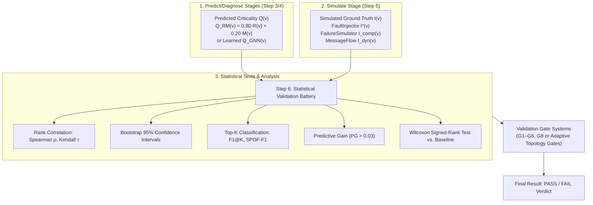
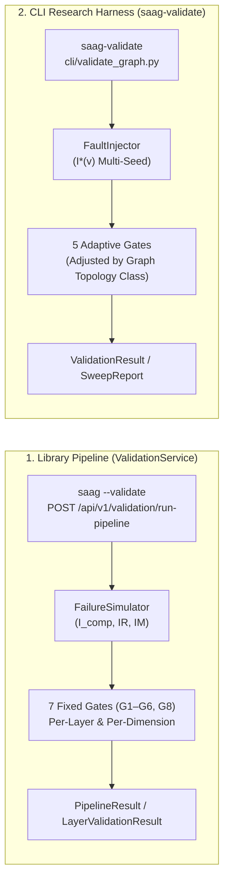
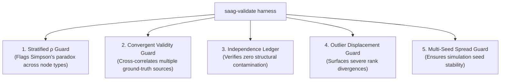

# Step 6: Validate — Empirical Validation

**Statistically prove that pre-deployment topology-based predictions $Q(v)$ agree with simulation-derived cascade impact $I(v)$, establishing empirical validity.**

← [Step 5: Simulate](failure-simulation.md) | → [Step 7: Prescribe](prescription.md)

---

## Table of Contents

1. [Overview & Core Thesis](#1-overview--core-thesis)
2. [Dual Validation Paths & Architectures](#2-dual-validation-paths--architectures)
3. [Ground-Truth Oracles & Taxonomy](#3-ground-truth-oracles--taxonomy)
   - 3.1 [The Three Ground-Truth Symbols](#31-the-three-ground-truth-symbols)
   - 3.2 [Oracle Convergence & The Behavioral Oracle ($I_{\text{dyn}}(v)$)](#32-oracle-convergence--the-behavioral-oracle-i_textdynv)
4. [Statistical Evaluation Battery](#4-statistical-evaluation-battery)
   - 4.1 [The One-Population Evaluation Contract](#41-the-one-population-evaluation-contract)
   - 4.2 [Rank Correlation & The Label Noise Ceiling](#42-rank-correlation--the-label-noise-ceiling)
   - 4.3 [Bootstrap Confidence Intervals ($95\%\text{ CI}$)](#43-bootstrap-confidence-intervals-95-ci)
   - 4.4 [Classification & Top-$K$ Metrics](#44-classification--top-k-metrics)
   - 4.5 [Per-Dimension Validation & Specialist Metrics](#45-per-dimension-validation--specialist-metrics)
   - 4.6 [Composite Validation & Predictive Gain ($PG$)](#46-composite-validation--predictive-gain-pg)
   - 4.7 [Wilcoxon Signed-Rank Test](#47-wilcoxon-signed-rank-test)
   - 4.8 [System-Wide Health & Risk Indicators](#48-system-wide-health--risk-indicators)
5. [Validation Gate Systems](#5-validation-gate-systems)
   - 5.1 [Library Gate Suite (G1–G6, G8)](#51-library-gate-suite-g1g6-g8)
   - 5.2 [CLI Adaptive Topology-Class Gates](#52-cli-adaptive-topology-class-gates)
6. [Stratified Reporting & Simpson's Paradox Guards](#6-stratified-reporting--simpsons-paradox-guards)
7. [Methodological Guards Harness](#7-methodological-guards-harness)
   - 7.1 [The 5 Core Guards](#71-the-5-core-guards)
   - 7.2 [Multi-Seed Stability Sweep](#72-multi-seed-stability-sweep)
   - 7.3 [QoS Ablation Protocol](#73-qos-ablation-protocol)
8. [Output Schemas & Reports](#8-output-schemas--reports)
9. [Diagnostic Interpretation Table](#9-diagnostic-interpretation-table)
10. [Known Limitations & Design Boundaries](#10-known-limitations--design-boundaries)
11. [What Comes Next](#11-what-comes-next)

---

## 1. Overview & Core Thesis

Step 6 closes the scientific loop of the Software-as-a-Graph methodology. It evaluates whether **pre-deployment topological predictions ($Q(v)$)** accurately correlate with **simulated runtime failure cascades ($I(v)$)**.



> [!IMPORTANT]
> **Methodological Independence**: $Q(v)$ is computed purely from graph topology and static QoS declarations. $I(v)$ is generated via stochastic discrete-event and graph cascade simulations. Strong statistical correlation ($\rho \ge 0.70$) proves that graph structure alone is predictive of operational failure impact.

---

## 2. Dual Validation Paths & Architectures

The framework provides two distinct validation execution pathways tailored for different workflows:



### Feature Comparison

| Attribute | Library Pathway (`ValidationService`) | CLI Research Pathway (`saag-validate`) |
|:---|:---|:---|
| **Invocation** | `saag --validate`, Python API, REST API | `cli/validate_graph.py` |
| **Ground-Truth Engine** | `FailureSimulator` $\to I_{\text{comp}}(v) + IR / IM$ | `FaultInjector` $\to I^*(v)$ multi-seed |
| **Gate Structure** | 7 Fixed Gates (G1–G6, G8) | 5 Adaptive Topology-Class Gates |
| **Scope** | Layer-stratified (`app`, `infra`, `mw`, `system`), full RM sub-dimensions | Whole-graph, composite impact, multi-seed sweeps |
| **Primary Use Case** | Production CI/CD gates, interactive UI dashboards | Research benchmarks, QoS ablation, LaTeX tables |

---

## 3. Ground-Truth Oracles & Taxonomy

### 3.1 The Three Ground-Truth Symbols

Different simulation engines generate distinct ground-truth formulations across the pipeline:

| Symbol | Generating Engine | Mathematical Definition | Consumed By |
|:---:|:---|:---|:---|
| **$I^*(v)$** | `FaultInjector` | Mean subscriber feed-loss across seeds | GNN training labels, LOSO benchmarks, CLI gates |
| **$I_{\text{comp}}(v)$** | `FailureSimulator` | $0.35\cdot\text{reach} + 0.25\cdot\text{frag} + 0.25\cdot\text{tp} + 0.15\cdot\text{flow}$ | Library validation gates G1–G6, G8, dimensional decomposition |
| **$I_{\text{RM}}(v)$** | `FailureSimulator` | $0.5 \cdot IR(v) + 0.5 \cdot IM(v)$ | Predictive Gain ($PG$) evaluation |

- **Dimension Coverage**: $I^*(v)$ is an external observable metric covering Reliability ($IR$). Maintainability ($IM$) is assessed on the artifact via change-propagation BFS over $G^{\mathsf T}$ (structural consistency check).
- **Engine Separation**: The two engines are strictly separated by contract ([`tests/test_groundtruth_contract.py`](../tests/test_groundtruth_contract.py)) and must not be mixed within the same evaluation stage.

### 3.2 Oracle Convergence & The Behavioral Oracle ($I_{\text{dyn}}(v)$)

To confirm that topological cascade models are not self-referential artifacts, the framework evaluates convergence against a dynamic discrete-event traffic oracle, $I_{\text{dyn}}(v)$:

$$I_{\text{dyn}}(v) = \text{DeliveryRate}_{\text{pre-fault}} - \text{DeliveryRate}_{\text{post-fault}}$$

```mermaid
flowchart LR
    I_Star["FaultInjector I*(v)<br>(Graph Cascade Feed Loss)"] <-->|Mean ρ = 0.765<br>(Strong Convergent Validity)| I_Dyn["MessageFlow I_dyn(v)<br>(SimPy Dynamic Traffic Drop)"]
    I_Star <-->|Mean ρ = 0.394<br>(Moderate Agreement)| I_Comp["FailureSimulator I_comp(v)<br>(4-Component Structural Loss)"]
```

- **Cross-Method Convergent Validity**: $I_{\text{dyn}}$ exhibits strong agreement with $I^*(v)$ (mean $\rho = 0.765$, minimum $0.548$ on Hub-and-Spoke), proving that discrete-event traffic drops under load closely mirror topological feed-loss cascades.

---

## 4. Statistical Evaluation Battery

### 4.1 The One-Population Evaluation Contract

To prevent sample bias across model comparisons:
1. **Identical Key Sets**: Evaluated node sets are fixed by `resolve_eval_keys` before scoring.
2. **Held-Out Sample Reporting**: Predictions are scored on held-out test splits (20% sample) to ensure fair comparison between learned GNNs and training-free structural baselines.
3. **Explicit Coverage Accounting**: Unlabelled or constant nodes are explicitly reported as `undefined` rather than converted to $0.0$.

---

### 4.2 Rank Correlation & The Label Noise Ceiling

- **Spearman Rank Correlation ($\rho$)**: Measures global ordinal monotonicity between predicted $Q(v)$ and ground truth $I(v)$:
  $$\rho = 1 - \frac{6 \sum d_i^2}{n(n^2 - 1)}$$
- **Kendall Rank Correlation ($\tau$)**: Conservative cross-check. A gap $|\rho - \tau| > 0.15$ flags outlier-dominated rankings.
- **The Label Noise Ceiling**: Ground-truth reproducibility sets the maximum achievable $\rho$:
  $$\rho_{\text{model}} \le \text{test\_retest\_spearman}$$
  *(If a label set has $\text{test\_retest\_spearman} = 0.93$, a model achieving $\rho = 0.92$ has saturated the ground truth).*

---

### 4.3 Bootstrap Confidence Intervals ($95\%\text{ CI}$)

Non-parametric percentile bootstrap resampling ($B = 1000$ in library, $B = 2000$ in CLI):

$$\text{CI}_{95\%} = \left[ \text{Percentile}(\hat{\theta}_b, 2.5), \; \text{Percentile}(\hat{\theta}_b, 97.5) \right]$$

---

### 4.4 Classification & Top-$K$ Metrics

For operational triage, components are evaluated on their identification within the top-$K$ critical set ($K = \max(3, \; 0.20 \cdot |V|)$):

```
Top-K Agreement:    gt_top_k ∩ pred_top_k
Precision@K   =    |gt_top_k ∩ pred_top_k| / K
Recall@K      =    |gt_top_k ∩ pred_top_k| / K        (Identical to Precision@K at equal K)
F1@K          =    |gt_top_k ∩ pred_top_k| / K
```

- **SPOF-$F_1$**: Evaluates detection of structural cut-vertices that cause significant operational loss ($I(v) > 0.30$):
  $$\text{SPOF-}F_1 = 2 \cdot \frac{\text{Precision}_{\text{spof}} \cdot \text{Recall}_{\text{spof}}}{\text{Precision}_{\text{spof}} + \text{Recall}_{\text{spof}}}$$

---

### 4.5 Per-Dimension Validation & Specialist Metrics

Every quality dimension is validated against its dedicated ground-truth signal:

| Dimension | Predictor | Ground Truth | Specialist Evaluation Metrics |
|:---|:---:|:---:|:---|
| **Reliability** | $R(v)$ | $IR(v) = 0.36 \cdot IFT + 0.64 \cdot IA$ | **CCR@5** (Critical Component Capture Rate at 5), **CME** (Mean Rank Error) |
| ↳ **Fault Tolerance** | $FT(v)$ | $IFT(v)$ | Diagnostic rank correlation $\rho(FT, IFT)$ |
| ↳ **Availability** | $A(v)$ | $IA(v)$ | **SPOF-$F_1$**, **HSRR** (Hidden SPOF Recovery), **DASA**, **RRI** |
| **Maintainability** | $M(v)$ | $IM(v)$ | **COCR@5** (Change Outage Capture Rate), **$\kappa_{\text{CTA}}$** (Coupling Tier Kappa), **BP** (Bottleneck Precision) |

---

### 4.6 Composite Validation & Predictive Gain ($PG$)

Predictive Gain verifies that the multi-dimensional composite $Q(v)$ adds predictive value beyond its single strongest constituent:

$$PG = \rho(Q(v), \; I_{\text{RM}}(v)) - \max\left( \rho(R, IR), \; \rho(M, IM) \right)$$

- **Gate Requirement**: $PG > 0.03$ confirms multi-dimensional synthesis lift.

---

### 4.7 Wilcoxon Signed-Rank Test

A non-parametric paired hypothesis test comparing $Q(v)$ absolute error against a simple Degree Centrality ($DC$) baseline:

$$\text{diff}_v = |Q(v) - I(v)| - |DC(v) - I(v)|$$

- One-sided test ($\alpha = 0.05$); $p < 0.05$ confirms $Q(v)$ is statistically superior to raw degree heuristics.

---

### 4.8 System-Wide Health & Risk Indicators

Component predictions aggregate into system-level risk indexes:

$$\begin{aligned}
H_d &= 1 - \frac{\sum_v \text{score}_d(v) \cdot w(v)}{\sum_v w(v)} \quad &\text{(Health Score in Dimension } d \in \{R, M\}) \\
\text{SRI} &= 0.5 \cdot (1 - H_R) + 0.5 \cdot (1 - H_M) \quad &\text{(System Risk Index)} \\
\text{RCI} &= \frac{\sum_i (2i - n - 1) \cdot Q_{(i)}}{n \sum_i Q_{(i)}} \quad &\text{(Risk Concentration Index / Gini)}
\end{aligned}$$

---

## 5. Validation Gate Systems

### 5.1 Library Gate Suite (G1–G6, G8)

Evaluated per layer in `ValidationService`. **All Tier 1 gates must pass** for `passed = True`:

| Gate | Target Metric | Minimum Threshold | Classification Tier | Description |
|:---:|:---|:---:|:---:|:---|
| **G1** | **Spearman $\rho$** | **$\ge 0.70$** | **Tier 1 (Primary)** | Global rank-order monotonicity |
| **G2** | **$F_1\text{@}K$** | **$\ge 0.75$** | **Tier 1 (Primary)** | Top-$K$ critical set classification overlap |
| **G3** | **Precision@$K$** | **$\ge 0.80$** | **Tier 1 (Primary)** | Precision in top-$K$ identification |
| **G4** | **Top-5 Overlap** | **$\ge 0.60$** | **Tier 1 (Primary)** | Capture rate of top 5 critical components |
| **G5** | **Predictive Gain ($PG$)** | **$> 0.03$** | Tier 2 (Secondary) | Composite lift over individual dimensions |
| **G6** | **$\kappa_{\text{CTA}}$** | **$\ge 0.70$** | Tier 2 (Secondary) | Weighted Cohen's $\kappa$ over 3 coupling tiers |
| **G8** | **Bottleneck Precision** | **$\ge 0.70$** | Tier 3 (Specialist) | Maintainability bottleneck identification |

*(Note: Gates G7 and G9 were retired when the Vulnerability dimension was removed).*

---

### 5.2 CLI Adaptive Topology-Class Gates

The CLI adapts gate thresholds based on the architectural graph density and hub structure:

```python
density   = edges / (nodes * (nodes - 1))
hub_ratio = max_degree / mean_degree

# Topology Classification
"hub_spoke" if (hub_ratio > 10 and density < 0.10)
"sparse"    if density < 0.05
"dense"     if density > 0.20
"medium"    otherwise
```

| Topology Class | Spearman $\rho \ge$ | $F_1\text{@}K \ge$ | $\text{SPOF-}F_1 \ge$ | $\text{FTR} \le$ | $PG \ge$ |
|:---|:---:|:---:|:---:|:---:|:---:|
| **`sparse`** | $0.75$ | $0.65$ | $0.60$ | $0.30$ | $0.02$ |
| **`medium`** | $0.80$ | $0.70$ | $0.65$ | $0.25$ | $0.03$ |
| **`dense`** | $0.82$ | $0.72$ | $0.65$ | $0.25$ | $0.03$ |
| **`hub_spoke`** | $0.85$ | $0.75$ | $0.70$ | $0.20$ | $0.03$ |

---

## 6. Stratified Reporting & Simpson's Paradox Guards

Pooled correlations across heterogeneous node types can obscure sub-population trends (Simpson's paradox). The framework reports stratified correlations:

1. **Stratification by Node Type**:
   - `Application`: Primary target (threshold $\rho \ge 0.75$).
   - `Broker`: Secondary routing tier (threshold $\rho \ge 0.70$).
   - `Library`: Code dependency tier (threshold $\rho \ge 0.60$).
   - `Node`: Host infrastructure tier (threshold $\rho \ge 0.65$).
2. **Stratification by Topic Frequency Decile**: Partitions topics into 10 frequency bins to confirm prediction stability across low-frequency telemetry and high-frequency control loops.

---

## 7. Methodological Guards Harness

### 7.1 The 5 Core Guards

`saag-validate harness` runs 5 methodological verification guards over pre-computed results:



### 7.2 Multi-Seed Stability Sweep

Evaluates consistency across random seeds ($\{42, 123, 456, 789, 2024\}$):
- **Rank Consistency Rate ($RCR$)**: $1 - \text{mean}(\text{normalized Kendall distance})$. Target $RCR \ge 0.90$.
- **All-Gates Pass Rate**: Proportion of simulation seeds passing 100% of validation gates.

### 7.3 QoS Ablation Protocol

Runs paired sweeps with QoS weighting enabled vs. disabled to evaluate predictive lift:

$$\Delta\rho = \rho(Q_{\text{QoS}}, \; I) - \rho(Q_{\text{topo}}, \; I) > 0 \quad (p < 0.05)$$

---

## 8. Output Schemas & Reports

### 8.1 Library JSON Output (`PipelineResult`)

```json
{
  "all_passed": true,
  "total_components": 35,
  "layers": {
    "system": {
      "layer": "system",
      "passed": true,
      "summary": {
        "spearman": 0.8421,
        "f1_score": 0.8000,
        "top_5_overlap": 0.8000,
        "predictive_gain": 0.0512,
        "system_health": {
          "H_R": 0.812,
          "H_M": 0.764,
          "SRI": 0.212,
          "RCI": 0.384
        }
      },
      "gates": {
        "G1_spearman": true,
        "G2_f1_k": true,
        "G3_precision_k": true,
        "G4_top_5_overlap": true,
        "G5_predictive_gain": true,
        "G6_kappa_cta": true,
        "G8_bottleneck_precision": true
      }
    }
  }
}
```

---

## 9. Diagnostic Interpretation Table

| Diagnostic Symptom | Probable Cause | Corrective Action |
|:---|:---|:---|
| **High $\rho$ but Low $F_1\text{@}K$** | Global ranking is accurate, but top-$K$ cutoff threshold is slightly misaligned. | Inspect $Q(v)$ score distribution; adjust $K$ or evaluate continuous PR-AUC. |
| **Negative $\rho$ ($\rho < 0$)** | **Inverse Criticality**: Core hubs are heavily hardened with multi-broker redundancy and failover paths. | Enable `--qos` weighting to account for publisher sole-ownership. |
| **Predictive Gain $PG \le 0$** | Composite score does not outperform its best single dimension. | Ensure `ap_c_directed` and `mpci` metrics ran in Step 2; inspect dimension balance. |
| **Topics/Brokers Show Constant Signal** | Normal behavior: Topics/Brokers act as conduits; cascade impact accrues to publishers. | Confirm that node-type stratification separates `Application` from `Topic`. |
| **Large Gap $|\rho - \tau| > 0.15$** | Agreement is concentrated in a few dominant architectural outliers. | Inspect top 2–3 critical components to verify non-trivial ranking across mid-tier nodes. |

---

## 10. Known Limitations & Design Boundaries

| # | Boundary / Limitation | Methodological Scope |
|:---|:---|:---|
| **L1** | **Redundant $G2 / G3$ Gates** | At equal $K$, $F_1\text{@}K \equiv \text{Precision@}K$, meaning $G3 \ge 0.80$ strictly dominates $G2 \ge 0.75$. |
| **L2** | **Maintainability Oracle Substrate** | $IM(v)$ ground truth is generated via change-propagation BFS over $G^{\mathsf T}$, acting as an internal consistency check rather than an external behavioral observation. |
| **L3** | **Unmodelled Infrastructure Hosts** | 30–47% of entities (`Node`, `Topic`) lack direct cascade failure models and report `undefined`. |
| **L4** | **Top-$K$ Set Variance** | Top-$K$ critical set identity exhibits $\approx 40\%$ churn across simulation seeds; rank correlations ($\rho, \text{NDCG}$) remain stable ($\ge 0.93$). |

---

## 11. What Comes Next

Validation outputs serve as the decision foundation for downstream stages:
- **[Step 7: Prescribe](prescription.md)** reads `SRI` (System Risk Index) as the baseline for evaluating counterfactual architectural refactorings.
- **[Step 8: Visualize](visualization.md)** renders $Q(v)$ vs. $I(v)$ scatter plots, quadrant classifications, and topology risk heatmaps.

---

← [Step 5: Simulate](failure-simulation.md) | → [Step 7: Prescribe](prescription.md)
